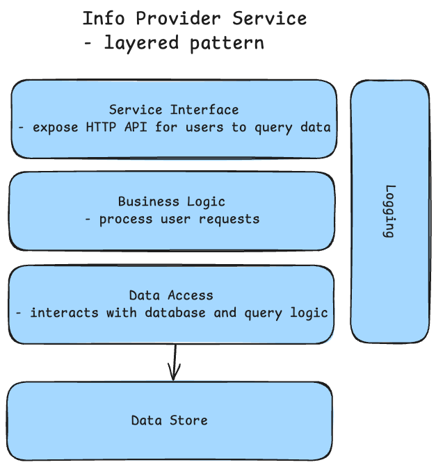

# IOToo - IOT. Controled

> FROM: "The Complete Guide to Becoming a Software Architect" on Udemy

## Overview

IOToo is a SaaS platform that provides a unified IoT device monitoring and control dashboard, solving the "app sprawl" problem for smart home and building automation users. By aggregating real-time sensor data from multiple IoT devices into a single interface, IOToo eliminates the need to switch between multiple manufacturer-specific apps.

**Business Context:**
- **Industry**: Internet of Things (IoT) - Smart Home & Building Automation
- **Business Model**: B2C SaaS - Subscription-based dashboard service for end users
- **Problem Solved**: Users with multiple IoT devices (thermostats, cameras, humidity sensors, energy meters) must juggle separate apps from each manufacturer—IOToo consolidates everything into one unified dashboard
- **Target Market**: Smart home owners, building managers, facility operators
- **User Base**: 2 million registered users, 40 concurrent users at peak
- **Value Proposition**: 
  - Single pane of glass for all IoT devices
  - Real-time monitoring and historical analytics
  - Cross-device insights (e.g., correlate HVAC usage with energy consumption)
  - Alerts and recommendations for optimization

**System Characteristics:**
- **Real-Time Data**: Sub-2-second latency for live device status updates
- **High Volume**: 15 million messages/month from IoT devices (~500 msg/sec peak)
- **Multi-Protocol**: Supports diverse device types with different message formats (JSON, fixed-format strings)
- **Read-Only (Phase 1)**: Dashboard displays data; device control via manufacturer apps (control capability planned for Phase 2)
- **Historical Analytics**: 2-year data retention for trend analysis and energy optimization
- **Alert System**: User-configurable alerts for critical conditions (high temp, low air quality, device offline)

**Phase 1 Scope (MVP):**
- Real-time monitoring dashboard (read-only)
- Manual customer onboarding by sales team (no self-service signup)
- Pre-registered devices (no device verification/provisioning in system)
- Support for 4 device types with 3 data formats

**Example Use Case:**
A homeowner with IOToo can instantly see:
- All security cameras online/offline status
- Current temperature from smart thermostats
- Air quality levels from sensors
- Energy consumption trends
- Alerts when any device malfunctions or exceeds thresholds

This architecture document describes the system design ensuring IOToo is **fast** (sub-2s response), **reliable** (99.9% uptime), **scalable** (2M users), and **maintainable** (modular, loosely coupled services).

## Requirements

### Functional Requirements (What the system should do)

- **Device Data Ingestion**: Receive real-time status updates from IoT devices via HTTP POST (REST API)
  - Support multiple message formats: 3 devices use JSON, 1 device uses fixed-format strings
  - Handle 500 messages/second peak load
  - Validate message structure and device authentication
  
- **Data Storage**: Persist sensor data in database for historical analysis
  - Store device status updates with timestamp, device ID, sensor readings
  - 2-year data retention policy
  - Support efficient queries by device ID, house ID, and time range
  
- **Real-Time Dashboard**: Web-based UI displaying live device status
  - Show current status of all devices in a house
  - Display latest readings for individual devices
  - Update dashboard within 2 seconds of device status change
  - Support 40 concurrent users, 540 requests/second
  
- **Historical Data Queries**: API endpoints for time-series data retrieval
  - Query device updates by time range (from/to timestamps)
  - Aggregate data by house or individual device
  - Return results within 5 seconds for historical queries
  
- **Alerting** (Planned - Phase 1 foundation):
  - System foundation to support user-defined alert conditions
  - Database schema includes alert configuration tables
  - Future: Push notifications for critical conditions (high temp, device offline)
  
- **Multi-Device Type Support**:
  - Thermostats (temperature, target temp, mode)
  - Humidity sensors (humidity percentage)
  - Air quality monitors (PM2.5, CO2, VOC levels)
  - Energy meters (current power draw, cumulative kWh)
  
- **Logging & Monitoring**: Centralized logging for all services
  - Aggregate logs from Receiver, Handler, Info Provider services
  - Enable troubleshooting and performance analysis
  - Support SLA compliance tracking

### Non-Functional Requirements (How the system should perform)

**Performance Requirements:**
- **Message Processing**:
  - Peak load: 500 messages/second
  - Message size: ~300 bytes average
  - Bandwidth: ~15 MB/second at peak
  - End-to-end latency: < 2 seconds (device → database → dashboard)
  
- **API Response Times**:
  - Real-time data queries: < 2 seconds (p95)
  - Historical data queries: < 5 seconds (p95)
  - Dashboard page load: < 3 seconds
  
- **Concurrent Users**:
  - Registered users: 2 million
  - Peak concurrent users: 40
  - Dashboard requests: 540 requests/second

**Data Volume & Retention:**
- **Monthly Throughput**: 15 million messages × 300 bytes = 4.5 GB/month
- **Annual Data**: 4.5 GB × 12 = 54 GB/year
- **2-Year Retention**: 54 GB × 2 = **108 GB total storage**
- **Growth Rate**: Plan for 50% annual user growth (6.75 GB/month by Year 2)

**Reliability & Availability:**
- **SLA Target**: 99.9% uptime
  - Maximum downtime: 43.8 minutes/month, 8.76 hours/year
  - Acceptable for consumer SaaS (not mission-critical like medical/financial)
  
- **Message Loss Tolerance**:
  - Some message loss acceptable during peak loads or network issues
  - Critical: System must stay up and continue processing new messages (no cascading failures)
  - Acceptable loss rate: < 0.1% under normal operation, < 1% during incidents
  
- **Disaster Recovery**:
  - RTO (Recovery Time Objective): < 1 hour
  - RPO (Recovery Point Objective): < 15 minutes (database backup frequency)

**Scalability Requirements:**
- **Horizontal Scaling**: All services stateless, can scale out on-demand
- **Database Scaling**: Support 10x message growth (50M messages/month) without architecture changes
- **Future Growth**: Architecture supports transition from Phase 1 (read-only) to Phase 2 (device control)

**Security Requirements:**
- **Device Authentication**: IoT devices authenticate via API keys or tokens
- **User Authentication**: Dashboard users authenticate via OAuth 2.0 / SSO
- **Data Encryption**: TLS 1.3 for all data in transit
- **Access Control**: Users only access devices they own (house-level permissions)

**Operational Requirements:**
- **Monitoring**: Real-time metrics for all services (CPU, memory, request rate, errors)
- **Logging**: Centralized logging with 90-day retention
- **Deployment**: Zero-downtime deployments via rolling updates
- **Team Expertise**: Leverage team's C# / .NET Core skills (no new language learning curve)

**SLA Tiers (Platinum Compliance - Phase 1):**
IOToo targets **Platinum** tier:
- ✅ Fully stateless services (easy horizontal scaling)
- ✅ Comprehensive logging and monitoring
- ✅ Automated health checks and alerting
- ✅ Load balancer with auto-scaling

## Executive Summary

**Architecture Style:** Service-Oriented Architecture (SOA) with event-driven messaging and queue-based decoupling

**Key Architectural Components:**

1. **Receiver Service** (C# / .NET Core Web API)
   - Exposes HTTP REST endpoints for IoT devices to POST status updates
   - High-performance ingestion layer handling 500 msg/sec peak load
   - Minimal processing—validates and forwards to queue (fire-and-forget)
   - Stateless design enabling horizontal scaling

2. **Message Queue** (RabbitMQ or Azure Service Bus)
   - Decouples ingestion (Receiver) from processing (Handler)
   - Provides message durability and buffering during traffic spikes
   - Prevents Handler overload—processes at its own pace
   - Also used for asynchronous logging (low-priority queue)

3. **Handler Service** (C# / .NET Core Background Service)
   - Consumes messages from queue at controlled rate
   - Validates device data (4 different formats: 3 JSON, 1 fixed-string)
   - Transforms heterogeneous formats into unified database schema
   - Writes validated data to SQL Server database
   - Stateless, can scale horizontally via multiple instances (consumer group pattern)

4. **Database** (SQL Server)
   - Relational database storing device status updates and metadata
   - Tables: `Houses`, `Devices`, `StatusUpdates`
   - Indexed on `deviceId`, `houseId`, `timestamp` for fast queries
   - 2-year retention enforced via scheduled cleanup jobs

5. **Info Provider Service** (C# / .NET Core Web API)
   - RESTful API exposing device data to dashboard frontend
   - Endpoints: Get current device status, query historical updates by time range
   - Read-only queries (no writes)—isolated from ingestion path
   - Load-balanced for high availability (40 concurrent users, 540 req/sec)

6. **Dashboard UI** (Web Application - React/Angular)
   - Frontend consuming Info Provider API
   - Real-time updates via polling or WebSockets (Phase 2)
   - Responsive design for desktop and mobile
   - User authentication and house-level access control

7. **Logging Service** (C# / .NET Core Background Service)
   - Centralized logging consuming log messages from queue
   - Aggregates logs from all services for unified monitoring
   - Stores logs in SQL Server (separate schema) or log management tool (Seq, ELK)
   - Critical for SLA compliance and troubleshooting

**Technology Stack:**
- **Backend Services**: C# with .NET Core 6+ (ASP.NET Core for Web APIs, Worker Services for background processing)
- **Database**: Microsoft SQL Server (team expertise, ACID compliance, strong query performance)
- **Message Queue**: Azure Service Bus (managed service) or RabbitMQ (self-hosted)
- **Frontend**: React or Angular (modern SPA framework)
- **Hosting**: Azure App Service (PaaS) or Kubernetes (containerized)
- **Monitoring**: Application Insights, Prometheus + Grafana

**Key Architectural Principles:**

1. **Loose Coupling via Messaging**
   - Receiver → Queue → Handler decoupling prevents cascade failures
   - If Handler is down, messages buffer in queue; Receiver stays operational
   - Asynchronous processing allows services to scale independently

2. **Stateless Services**
   - All services store no local state (only Queue and Database persist data)
   - Enables horizontal scaling without session affinity
   - Services can be restarted or scaled without data loss

3. **Separation of Concerns**
   - **Receiver**: Ingestion only (fast, lightweight)
   - **Handler**: Validation and persistence (complex logic isolated)
   - **Info Provider**: Read-only queries (isolated from writes)
   - Each service has single, well-defined responsibility

4. **Performance Optimizations**
   - Queue buffers incoming spikes (500 msg/sec peak)
   - Database indexes on query-heavy columns (`deviceId`, `timestamp`)
   - Info Provider caching for frequently accessed data (current device status)
   - Connection pooling for database access

5. **Reliability & Resilience**
   - Message queue provides durability (no message loss if service crashes)
   - Database transactions ensure data integrity
   - Health checks and auto-restart for all services
   - Logging service decoupled via queue (doesn't block critical path)

**Critical Success Factors:**
- Sub-2-second latency from device update to dashboard visibility
- 99.9% uptime with graceful degradation (message queueing during incidents)
- Ability to scale from 15M to 50M messages/month without architecture changes
- Team productivity leveraging existing .NET Core expertise

**Architecture Diagram:**


*Four loosely coupled services communicate via HTTP (IoT devices, dashboard users) and message queues (internal service communication). Queue and Database are the only stateful components, ensuring no data loss on service restart.*

## Components

> what are the components that are part of the system while rememebering that each component is an autonomous piece of code that runs in its own process and communicates with other components via well-defined APIs.

Based on [the requirements](#requirements), the following components can be identified for the IOToo system:

1. Receiver Service
   - Responsible for receiving messages from IoT devices.
   - Handles high throughput and ensures messages are processed in real-time.
   - Receives the status updates from various devices, and adds them to the Queue system for further processing by the Handler Service. The Receiver Service puts a strong emphasis on performance, and its main task is to make sure the update was received and stored. It does not make any action on the update, this is the role of the Handler Service.

2. Handler Service
   - Handles different formats from various IoT devices.
   - Validates, processes and parses, and saves incoming sensor data in the database.
   - Will receive messages from 4 types of devices (& formats): 3 use JSON, 1 uses fixed-format strings - VALIDATION is required.
   - Data in database should be indepented ot the device type and format, fully accessible, extremely important when data is received from multiple sources.

3. Info Provider Service
   - Waits for user requests from the dashboard.
   - Queries the database for historical data based on user-defined time ranges and sensor types.

4. Logging and Monitoring Service

   - Monitors the health and performance of the system.
   - Logs important events and metrics for analysis and troubleshooting.
   - Aggregates all the logs genertaed by the various services to enable a unified view of all event in the system.

5. Database
   - Stores sensor data for historical analysis.
   - Optimized for read and write operations to handle high throughput and low latency requirements.
   - Communicates with both the Handler Service and Info Provider Service.

### Messaging System

- Note: The IOT devices communicate via HTTP REST API with POST requests.
- The various services communicate with each other using various messaging methods. Each method was selected based on the specific requirements from the services.
- The **Receiver Service** exposes REST API/HTTP endpoint to receive messages from IoT devices - the reason for tha is quite simple: IoT devices are limited in their capabilities, and REST API is a widely supported protocol that is easy to implement on various devices.
- The **Receiver Service** will then forward the messages to the **Handler Service** for processing via a Queue system (e.g., RabbitMQ, Apache Kafka) to handle high throughput and ensure message durability.
  - REST would cause a lot of work on the Handler Service side if it gets overwhelmed with messages.
  - Using a messaging system allows for better load balancing and decouples the Receiver Service from the Handler Service.
  - The queue uses a fire and forget mechanism, meaning that once a message is sent to the queue, the Receiver Service does not wait for an acknowledgment from the Handler Service.
- The **Info Provider Service** will communicate directly with the Database to fetch historical data based on user requests from the dashboard.
- The **Info Provider Service** will be accessed by the end-users via a Web UI (dashboard) and will expose RESTful APIs for the dashboard to interact with.
- The **Logging and Monitoring Service** will collect logs and metrics from all other components via RESTful APIs or other suitable protocols.
  - Logs can be heavy, so it's important to ensure that the **Logging and Monitoring Service** can handle high volumes of log data without impacting the performance of other components.
  - Options: Database or queue system for log storage and processing.
  - Consider using a Queue system for log processing to handle high volumes of log data efficiently.
    IMPORTANT: Ensure that the IT departmante is aware of queues systems and are able to maintain them.

### Scalling
This architecture allows for easy scaling of individual components as needed. Since each service is laser-focused on a specific task, single task, each can be scaled independently, either automatically (by service managers such as Kubernetes) or manually (by IT department).

In addition, the service's inner code is fully stateless, allowing scaling to be performed on a live system, without chaning any lines of code or shutting down any services.

## Services Drill Down
### Logging and Monitoring

- very important for SLA compliance and system health.
- it is worng to leave logging and monitoring as an afterthought.
- should be designed from the beginning as a core component of the system.
- all the other built services shold be built in way that includes logging and monitoring capabilities.
- the logging service reads from a queue system to avoid overloading the other services.

Steps:

- decide on the application type
- decide on he technology stack
- design on the architecture pattern

What it does:

- read log records from the queue system
- should perform record validation
- should store the log records in a database

- Application Type: Service (no UI and managed by some service manager) (can also be a Console Application)
- Technology Stack:

  - Team is familiar with C# and .NET Core.

  - Code:

    - Shold be able to access Queue's API and store data in a database.
    - Decided to use C# and .NET Core for the Logging and Monitoring Service.

  - Database:
    - Team is familiar with SQL Server.
    - Decided to use SQL Server for storing log records.

Architecture Pattern:

- Long runnig process with no UI and no API exposed to the outside world.
- Suggestion: Tweak the classing layered pattern
- Layers:
  - Polling Layer
    - Responsible for reading log records from the queue system.
    - Should implement a polling mechanism to continuously check for new log records.
  - Business Layer
    - Responsible for processing log records.
    - Should perform record validation and any necessary transformations.
  - Data Access Layer
    - Responsible for storing log records in the database.
  - Data Store Layer
    - Represents the SQL Server database where log records are stored.


### Receiver Service

- What it does:

  - Receoives messages from IoT devices via HTTP POST requests.
  - Forwards messages to the Handler Service via a Queue system.

- Application Type: Web API
- Technology Stack:
  - Team is familiar with C# and .NET Core.
  - .NET Core is well-suited for building high-performance web APIs.
  - Decided to use C# and .NET Core for the Receiver Service.

Architecture Pattern:

- Classic layered pattern for Web APIs with well-defined layers.
- Layers:
  - Service Interface Layer
    - Exposes HTTP endpoints to receive messages from IoT devices.
    - Handles incoming HTTP POST requests and extracts message data.
  - Business Layer
    - Responsible for processing incoming messages.
    - Forwards messages to the Handler Service via the Queue system.
  - Queue Handler Layer
    - Responsible for interacting with the Queue system.
    - Implements logic to send messages to the Queue.
  - Logging Layer (Cross-cutting Concern)
    - Responsible for logging important events and metrics.
    - Sends log records to the Logging and Monitoring Service via the Queue system.

Non-Functional Requirements:

- Load: 500 messages/second during peak times.
  - Complaint: Yes - Architecture is stateless, easily scaled out horizontally, service is lightweight and simple.
- Message loss: Tolerant to message loss, but should minimize data loss during peak loads or network disruptions.
  - Complaint: Yes - REST API is quire reliable, very low chance of errror in such simple service.


### Handler Service

- What it does:
  - validates messages, paarses messages, stores messages in data store
  - messages wait in a queue system to be processed
- Application Type: Service (no UI and managed by some service manager) (can also be a Console Application)
- Technology Stack:
  - Team is familiar with C# and .NET Core.
  - Decided to use C# and .NET Core for the Handler Service.
- Database:
  - Team is familiar with SQL Server.
  - Decided to use SQL Server for storing sensor data.
    Architecture Pattern:
- Long running process with no UI and no API exposed to the outside world.
- Suggestion: Tweak the classing layered pattern
- Layers:
  - Service Interface Layer
    - Polling Layer
      - Responsible for reading messages from the Queue system.
      - Should implement a polling mechanism to continuously check for new messages.
  - Business Layer
    - Responsible for processing messages.
    - Should perform message validation, parsing, and any necessary transformations.
  - Data Access Layer
    - Responsible for storing sensor data in the database.
  - Data Store Layer
    - Represents the SQL Server database where sensor data is stored.
  - Logging Layer (Cross-cutting Concern)
    - Responsible for logging important events and metrics.
    - Sends log records to the Logging and Monitoring Service via the Queue system.


### Info Provider Service

- What it does:
  - allows end-users to query historical data
- What it does not:
  - it does not display the data - that is the dashboard's responsibility
- Application Type: Web API
- Technology Stack:
  - Team is familiar with C# and .NET Core.
  - .NET Core is well-suited for building high-performance web APIs.
  - Decided to use C# and .NET Core for the Info Provider Service.

Architecture Pattern:

- Classic layered pattern for Web APIs with well-defined layers.
- Layers:
  - Service Interface Layer
    - Exposes HTTP endpoints to allow users to query historical data.
    - Handles incoming HTTP requests and extracts query parameters.
  - Business Layer
    - Responsible for processing user requests.
    - Validates query parameters and implements business logic for data retrieval.
  - Data Access Layer
    - Responsible for interacting with the database.
    - Implements logic to query historical data based on user-defined time ranges and sensor types.
  - Data Store Layer
    - Represents the SQL Server database where sensor data is stored.
  - Logging Layer (Cross-cutting Concern)
    - Responsible for logging important events and metrics.
    - Sends log records to the Logging and Monitoring Service via the Queue system.



API Architecture:

- Get current status of devices for specific device and entire house.
- Past events for specific device and entire house.

- Required functionality:

  - Get all the **updates** for a specific **house's devices** for a given **time range**.
  - Gte the updates fir a specifc device for a given time range.
  - Get the current status of all devices ina specifc house.
  - Get current status of a specific device.

- API Design:

| Endpoint                 | Method | Description                             | Parameters      | Return Code   |
| ------------------------ | ------ | --------------------------------------- | --------------- | ------------- |
| /api/device/`{deviceId}` | GET    | Get current status of a specific device | deviceId (path) | 200, 404, 500 |
```json
{
  "deviceId": "string", // ("17", "sensor-xyz")
  "type": "string", // ("thermostat", "humidity-sensor", "air-quality-monitor", "energy-meter")
  "houseId": "string", // ("house-123", "home-456")
  "value": "number", // (e.g., 22.5, 45, 300, 1500)
  "timestamp": "string" // ("2023-01-31T12:34:56Z")
}
```

| Endpoint                                                       | Method | Description                                                  | Parameters                               | Return Code   |
| -------------------------------------------------------------- | ------ | ------------------------------------------------------------ | ---------------------------------------- | ------------- |
| /api/house/`{houseId}`/devices/updates?from=`{from}`&to=`{to}` | GET    | Get all updates for a house's devices for a given time range | houseId (path), from (query), to (query) | 200, 404, 500 |
```json 200
{
  "houseId": "string", // ("house-123", "home-456")
  "from": "string", // ("2023-01-01T00:00:00Z")
  "to": "string", // ("2023-01-31T23:59:59Z")
  "updates": [       // Array of device update objects
    {
      "deviceId": "string", // ("17", "sensor-xyz")
      "type": "string", // ("thermostat", "humidity-sensor", "air-quality-monitor", "energy-meter")
      "value": "number", // (e.g., 22.5, 45, 300, 1500)
      "timestamp": "string" // ("2023-01-31T12:34:56Z")
    }
  ]
}
```
- houseId, devices and updates are actual entities in the database
- from and to are time-range parameters, not entities

```json 404
{
  "error": "House not found"
}
```

```json 500
{
  "error": "Internal server error"
}
```

| Endpoint                                      | Method | Description                                           | Parameters     | Return Code   |
| --------------------------------------------- | ------ | ----------------------------------------------------- | -------------- | ------------- |
| /api/house/`{houseId}`/devices/status/current | GET    | Get current status of all devices in a specific house | houseId (path) | 200, 404, 500 |
```json
{
  "houseId": "string", // ("house-123", "home-456")
  "status": [         // Array of device status objects
    {
      "deviceId": "string", // ("17", "sensor-xyz")
      "type": "string", // ("thermostat", "humidity-sensor", "air-quality-monitor", "energy-meter")
      "value": "number", // (e.g., 22.5, 45, 300, 1500)
      "timestamp": "string" // ("2023-01-31T12:34:56Z")
    }
  ]
}
```

```json 404
{
  "error": "House not found"
}
```

```json 500
{
  "error": "Internal server error"
}
```

## Technology Decisions

### Technology Stack Summary

| Component | Technology | Version | Rationale |
|-----------|-----------|---------|----------|
| **Receiver Service** | C# / .NET Core | 6+ | Team expertise, high-performance HTTP server, async/await for I/O-bound work |
| **Handler Service** | C# / .NET Core | 6+ | Team expertise, background worker pattern, excellent JSON parsing |
| **Info Provider Service** | C# / .NET Core | 6+ | Team expertise, ASP.NET Core Web API, built-in OpenAPI/Swagger |
| **Logging Service** | C# / .NET Core | 6+ | Team expertise, background worker pattern, consistent stack |
| **Database** | SQL Server | 2019+ | Team expertise, ACID compliance, strong indexing, familiar tooling |
| **Message Queue** | Azure Service Bus | N/A | Managed service (no ops overhead), native .NET SDK, message durability |
| **Dashboard Frontend** | React | 18+ | Modern SPA framework, component reusability, large ecosystem |
| **Hosting** | Azure App Service | N/A | PaaS simplicity, auto-scaling, native .NET integration |
| **Monitoring** | Application Insights | N/A | Native Azure integration, distributed tracing, alerting |

### Key Technology Choices & Trade-offs

**1. C# / .NET Core for All Backend Services**

**Chosen**: C# with .NET Core 6+

**Alternatives Considered**:
- **Node.js**: Async I/O, JavaScript familiarity
- **Python**: Rapid development, data science libraries
- **Java/Spring**: Enterprise-grade, mature ecosystem

**Decision Factors**:
- **Team Expertise**: Development team proficient in C# (no learning curve, faster delivery)
- **Performance**: .NET Core competitive performance (async/await for I/O-bound, compiled code)
- **Cross-Platform**: Runs on Linux (cost savings vs. Windows licensing)
- **Unified Stack**: Single language for all services (code reuse, easier maintenance)
- **Ecosystem**: ASP.NET Core Web API, Entity Framework, excellent tooling (Visual Studio, Rider)

**Trade-offs Accepted**:
- Larger runtime footprint than Node.js (acceptable given server capacity)
- Less trendy than Node.js/Go (acceptable—mature, enterprise-supported platform)

---

**2. SQL Server for Database**

**Chosen**: Microsoft SQL Server

**Alternatives Considered**:
- **PostgreSQL**: Open-source, advanced features, lower licensing cost
- **MongoDB**: NoSQL, schema flexibility, horizontal scaling
- **Time-Series Database** (InfluxDB, TimescaleDB): Purpose-built for sensor data

**Decision Factors**:
- **Team Expertise**: Operations team highly skilled in SQL Server (administration, backups, tuning)
- **Structured Data**: Device updates have consistent schema (deviceId, timestamp, value)—relational model fits well
- **ACID Compliance**: Transactions ensure data integrity (critical for user-facing app)
- **Indexing**: SQL Server's indexing excellent for time-range queries (indexed by `timestamp`, `deviceId`)
- **Tooling**: Mature ecosystem (SQL Server Management Studio, Azure Data Studio, monitoring tools)
- **Integration**: Native .NET integration (Entity Framework, Dapper)

**Trade-offs Accepted**:
- Licensing costs (mitigated by Azure SQL Database pay-as-you-go)
- Vertical scaling limits at extreme scale (acceptable for 108 GB, 15M msg/month)
- Not optimal for pure time-series workloads (acceptable—queries simple, data volume moderate)

**Schema Design**:
```sql
-- Relational schema ensures data integrity and fast queries
CREATE TABLE Houses (
    HouseId INT PRIMARY KEY IDENTITY,
    UserId INT NOT NULL,
    HouseName NVARCHAR(100),
    CreatedAt DATETIME2 DEFAULT GETDATE()
);

CREATE TABLE Devices (
    DeviceId INT PRIMARY KEY IDENTITY,
    HouseId INT FOREIGN KEY REFERENCES Houses(HouseId),
    DeviceType NVARCHAR(50), -- thermostat, humidity-sensor, etc.
    DeviceExternalId NVARCHAR(100) UNIQUE, -- external device ID from manufacturer
    CreatedAt DATETIME2 DEFAULT GETDATE()
);

CREATE TABLE StatusUpdates (
    UpdateId BIGINT PRIMARY KEY IDENTITY,
    DeviceId INT FOREIGN KEY REFERENCES Devices(DeviceId),
    Timestamp DATETIME2 NOT NULL,
    Value DECIMAL(10,2), -- sensor reading (temp, humidity, etc.)
    Unit NVARCHAR(20), -- celsius, percentage, ppm, etc.
    ReceivedAt DATETIME2 DEFAULT GETDATE(),
    INDEX IX_Device_Time (DeviceId, Timestamp DESC), -- fast queries by device + time
    INDEX IX_Timestamp (Timestamp) -- cleanup old data
);
```

---

**3. Azure Service Bus for Message Queue**

**Chosen**: Azure Service Bus (managed queue)

**Alternatives Considered**:
- **RabbitMQ**: Open-source, self-hosted, feature-rich
- **Apache Kafka**: High throughput, distributed, message replay
- **Azure Storage Queues**: Simple, cheap, native Azure

**Decision Factors**:
- **Managed Service**: No infrastructure to maintain (RabbitMQ requires cluster management)
- **Native .NET SDK**: Excellent C# client library (Azure.Messaging.ServiceBus)
- **Message Durability**: Guarantees at-least-once delivery (message persistence to disk)
- **Dead Letter Queue**: Built-in handling for failed messages
- **Azure Integration**: Native Azure identity (Managed Identity), monitoring via Application Insights
- **Cost-Effective**: Pay-per-operation (Standard tier ~$10/month for 15M messages)

**Comparison**:

| Feature | Azure Service Bus | RabbitMQ | Kafka |
|---------|------------------|----------|-------|
| **Managed Service** | Yes (PaaS) | No (self-host) | No (self-host or Confluent Cloud) |
| **Throughput** | ~2K msg/sec per queue | ~10K msg/sec | ~Millions msg/sec |
| **Message Persistence** | Yes | Yes | Yes |
| **Operational Complexity** | Low | Medium | High |
| **Cost** | $10-50/month | Infrastructure only | Infrastructure + license |
| **Dead Letter Queue** | Built-in | Built-in | Manual implementation |
| **Team Familiarity** | Learning curve acceptable | Unknown | Unknown |

**Trade-offs Accepted**:
- Lower throughput than Kafka (acceptable—need only 500 msg/sec)
- Vendor lock-in to Azure (acceptable—already Azure customers)
- Cost scales with usage (acceptable—predictable for 15M msg/month)

---

**4. React for Dashboard Frontend**

**Chosen**: React (JavaScript SPA framework)

**Alternatives Considered**:
- **Angular**: Full-featured framework, TypeScript
- **Vue.js**: Simpler learning curve, progressive framework
- **Blazor**: C# in browser (WebAssembly)

**Decision Factors**:
- **Industry Standard**: React most popular SPA framework (large community, talent pool)
- **Component Model**: Reusable UI components (device cards, charts)
- **Ecosystem**: Rich library ecosystem (charting: Chart.js/Recharts, state: Redux/Zustand)
- **Real-Time Updates**: Easy integration with WebSockets or polling
- **Team Familiarity**: Frontend team has React experience

**Trade-offs Accepted**:
- JavaScript fatigue (many libraries, frequent updates)—mitigated by sticking to stable versions
- Not using team's C# expertise for frontend (acceptable—React superior UX, broader hiring pool)

---

**5. Azure App Service for Hosting**

**Chosen**: Azure App Service (PaaS)

**Alternatives Considered**:
- **Azure Kubernetes Service (AKS)**: Container orchestration, fine-grained control
- **Azure VMs**: Full control, lift-and-shift
- **On-Premises**: Total control, capital expense

**Decision Factors**:
- **Simplicity**: PaaS abstracts infrastructure (no OS patching, networking config)
- **Auto-Scaling**: Built-in horizontal scaling based on CPU, memory, request count
- **Zero-Downtime Deployments**: Deployment slots for blue-green deployments
- **Native .NET Support**: Optimized for ASP.NET Core, integrated debugging
- **Cost**: Pay-per-second, scale-to-zero for dev/test environments
- **Team Familiarity**: Ops team comfortable with Azure Portal

**Trade-offs Accepted**:
- Less control than Kubernetes (acceptable—simple architecture doesn't need K8s complexity)
- Vendor lock-in (acceptable—Azure-first strategy)

## Architecture Diagrams

### Logic Diagram (Component Interaction)

```
[IoT Devices] (Thermostat, Humidity, Air Quality, Energy Meter)
     │
     │ HTTP POST (REST API)
     │ {"deviceId": "DEV-123", "value": 22.5, "timestamp": "..."}
     ▼
┌────────────────────┐
│ Receiver Service   │ (C# / .NET Core Web API)
│  - Expose HTTP     │
│  - Validate token  │
│  - Publish to Queue│
└─────────┬──────────┘
          │
          │ Fire-and-Forget (async)
          ▼
┌─────────────────────────┐
│  Azure Service Bus      │
│  (Message Queue)        │
│  - Message Durability   │
│  - Dead Letter Queue    │
└─────────┬───────────────┘
          │
          │ Poll messages (consumer group)
          ▼
┌────────────────────────┐
│  Handler Service       │ (C# / .NET Core Worker)
│  - Validate formats    │
│  - Transform to schema │
│  - Write to DB         │
└──────────┬─────────────┘
           │
           │ Write (SQL INSERT)
           ▼
┌─────────────────────────┐         ┌──────────────────┐
│   SQL Server Database   │◄────────┤ Info Provider   │ (C# / .NET Core Web API)
│  - Houses               │ Read    │   Service        │
│  - Devices              │         │  - Query API     │
│  - StatusUpdates        │         └────────┬─────────┘
└─────────────────────────┘                  │
                                             │ HTTP GET (REST API)
                                             ▼
                                   ┌──────────────────┐
                                   │  Dashboard UI    │ (React SPA)
                                   │  - Device Cards  │
                                   │  - Historical    │
                                   │    Charts        │
                                   └──────────────────┘
                                             │
                                             ▼
                                      [End Users]

Logging Flow (Separate Queue):
[All Services] → Azure Service Bus (Logging Queue) → Logging Service → SQL Server (Logs Table)
```

**Key Flows**:
1. **Device Update**: IoT Device → Receiver → Queue → Handler → Database
2. **Dashboard Query**: User → Dashboard UI → Info Provider → Database → UI
3. **Logging**: Services → Logging Queue → Logging Service → Logs Database

---

### Physical Diagram (Deployment)

```
┌────────────────────────────────────────────────────────────────────┐
│                       AZURE CLOUD                                  │
│                                                                    │
│  ┌────────────────────────────────────────────────────────────┐  │
│  │  Azure App Service Plan (Standard S1)                      │  │
│  │                                                             │  │
│  │  ┌──────────────────┐  ┌──────────────────┐              │  │
│  │  │ Receiver Service │  │ Handler Service  │              │  │
│  │  │   (Web App)      │  │   (Web App)      │              │  │
│  │  │  - 2 instances   │  │  - 2 instances   │              │  │
│  │  │  - Auto-scale    │  │  - Auto-scale    │              │  │
│  │  └────────┬─────────┘  └────────┬─────────┘              │  │
│  │           │                     │                         │  │
│  │  ┌────────┴─────────────────────┴────────┐               │  │
│  │  │ Info Provider Service (Web App)       │               │  │
│  │  │  - 2 instances, auto-scale            │               │  │
│  │  └────────┬──────────────────────────────┘               │  │
│  │           │                                               │  │
│  │  ┌────────┴──────────┐                                   │  │
│  │  │ Logging Service   │                                   │  │
│  │  │   (Web App)       │                                   │  │
│  │  │  - 1 instance     │                                   │  │
│  │  └───────────────────┘                                   │  │
│  └────────────────────────────────────────────────────────────┘  │
│                                                                    │
│  ┌────────────────────────────────────────────────────────────┐  │
│  │  Azure Service Bus (Standard Tier)                         │  │
│  │  - Queue: device-updates                                   │  │
│  │  - Queue: logging                                          │  │
│  │  - Dead Letter Queues enabled                              │  │
│  └────────────────────────────────────────────────────────────┘  │
│                                                                    │
│  ┌────────────────────────────────────────────────────────────┐  │
│  │  Azure SQL Database (Standard S2)                          │  │
│  │  - 50 DTU, 250 GB storage                                  │  │
│  │  - Geo-replication: Secondary region (DR)                  │  │
│  │  - Automated backups (point-in-time restore)               │  │
│  └────────────────────────────────────────────────────────────┘  │
│                                                                    │
│  ┌────────────────────────────────────────────────────────────┐  │
│  │  Azure CDN + Static Web App (Dashboard UI)                 │  │
│  │  - React SPA hosted on CDN                                 │  │
│  │  - Global edge caching                                     │  │
│  └────────────────────────────────────────────────────────────┘  │
│                                                                    │
│  ┌────────────────────────────────────────────────────────────┐  │
│  │  Application Insights (Monitoring)                         │  │
│  │  - Distributed tracing                                     │  │
│  │  - Performance metrics                                     │  │
│  │  - Alerts and dashboards                                   │  │
│  └────────────────────────────────────────────────────────────┘  │
└────────────────────────────────────────────────────────────────────┘

External Connections:
- IoT Devices → Azure Load Balancer → Receiver Service (HTTPS)
- End Users → Azure CDN → Dashboard UI → Info Provider (HTTPS)
```

**Deployment Strategy**:
- **Blue-Green Deployments**: App Service deployment slots (zero downtime)
- **Auto-Scaling**: CPU > 70% → scale out; CPU < 30% → scale in
- **Health Checks**: Azure App Service pings `/health` endpoint every 30 seconds

---

### Technical Diagram (Message Flow Detail)

```
IoT Device Message Lifecycle

┌──────────────┐
│ Smart        │
│ Thermostat   │
└──────┬───────┘
       │
       │ POST /api/v1/device/update
       │ Headers: { "X-API-Key": "device-secret-token" }
       │ Body: { "deviceId": "THERM-001", "temperature": 22.5, "timestamp": "2026-01-08T10:00:00Z" }
       ▼
┌──────────────────────────┐
│  Receiver Service        │
└────────┬─────────────────┘
         │ 1. Authenticate device (validate API key)
         │ 2. Basic validation (non-empty fields)
         │ 3. Publish to Azure Service Bus
         │ 4. Return 202 Accepted (async processing)
         ▼
┌────────────────────────────────┐
│  Azure Service Bus             │
│  Queue: "device-updates"       │
└────────┬───────────────────────┘
         │ Message stored with TTL=24 hours
         │ If Handler down, messages buffer
         │
         │ Handler polls queue (long-polling)
         ▼
┌────────────────────────┐
│  Handler Service       │
└────────┬───────────────┘
         │ 1. Deserialize message
         │ 2. Validate device format:
         │    - JSON format (3 device types)
         │    - Fixed-string format (1 device type)
         │ 3. Transform to unified schema
         │ 4. Lookup DeviceId from external ID
         │ 5. Insert into StatusUpdates table
         │ 6. Complete message (remove from queue)
         ▼
┌─────────────────────────┐
│  SQL Server Database    │
│  Table: StatusUpdates   │
└─────────────────────────┘
         │
         │ Later: User queries dashboard
         ▼
┌──────────────────────┐
│ Info Provider Service│
└────────┬─────────────┘
         │ GET /api/device/THERM-001
         │ SELECT TOP 1 * FROM StatusUpdates
         │ WHERE DeviceId = (SELECT DeviceId FROM Devices WHERE DeviceExternalId = 'THERM-001')
         │ ORDER BY Timestamp DESC
         ▼
┌─────────────────┐
│  Dashboard UI   │
└─────────────────┘
Display: "Thermostat THERM-001: 22.5°C (updated 5 seconds ago)"

Error Handling:
- Invalid format → Handler logs error, moves to Dead Letter Queue
- Database down → Handler retries 3x, then Dead Letter Queue
- Queue full → Receiver returns 503 Service Unavailable
```

## Data Architecture

### Database Schema (SQL Server)

```sql
-- Users and Houses
CREATE TABLE Users (
    UserId INT PRIMARY KEY IDENTITY,
    Email NVARCHAR(255) UNIQUE NOT NULL,
    PasswordHash NVARCHAR(255) NOT NULL,
    CreatedAt DATETIME2 DEFAULT GETDATE()
);

CREATE TABLE Houses (
    HouseId INT PRIMARY KEY IDENTITY,
    UserId INT FOREIGN KEY REFERENCES Users(UserId),
    HouseName NVARCHAR(100) NOT NULL,
    Address NVARCHAR(500),
    CreatedAt DATETIME2 DEFAULT GETDATE(),
    INDEX IX_User (UserId)
);

-- Devices
CREATE TABLE Devices (
    DeviceId INT PRIMARY KEY IDENTITY,
    HouseId INT FOREIGN KEY REFERENCES Houses(HouseId),
    DeviceExternalId NVARCHAR(100) UNIQUE NOT NULL, -- manufacturer's ID
    DeviceType NVARCHAR(50) NOT NULL, -- thermostat, humidity-sensor, air-quality, energy-meter
    DeviceName NVARCHAR(100), -- user-friendly name
    ManufacturerName NVARCHAR(100),
    ModelNumber NVARCHAR(100),
    InstallationDate DATE,
    CreatedAt DATETIME2 DEFAULT GETDATE(),
    INDEX IX_House (HouseId),
    INDEX IX_ExternalId (DeviceExternalId)
);

-- Status Updates (Time-Series Data)
CREATE TABLE StatusUpdates (
    UpdateId BIGINT PRIMARY KEY IDENTITY,
    DeviceId INT FOREIGN KEY REFERENCES Devices(DeviceId),
    Timestamp DATETIME2 NOT NULL, -- device timestamp (when reading taken)
    Value DECIMAL(18,4) NOT NULL, -- sensor value (temp, humidity, etc.)
    Unit NVARCHAR(20) NOT NULL, -- celsius, fahrenheit, percentage, ppm, watts, kwh
    ReceivedAt DATETIME2 DEFAULT GETDATE(), -- server timestamp (when received)
    INDEX IX_Device_Time (DeviceId, Timestamp DESC), -- primary query pattern
    INDEX IX_Timestamp (Timestamp), -- cleanup/archival queries
    INDEX IX_ReceivedAt (ReceivedAt) -- monitoring lag
);

-- Logging (Separate Schema)
CREATE TABLE SystemLogs (
    LogId BIGINT PRIMARY KEY IDENTITY,
    ServiceName NVARCHAR(50) NOT NULL, -- receiver, handler, info-provider
    LogLevel NVARCHAR(20) NOT NULL, -- info, warning, error
    Message NVARCHAR(MAX),
    Exception NVARCHAR(MAX),
    Timestamp DATETIME2 DEFAULT GETDATE(),
    INDEX IX_Service_Time (ServiceName, Timestamp DESC)
);
```

**Index Strategy**:
- **`IX_Device_Time`**: Covers 90% of queries (get device updates by time range)
- **`IX_Timestamp`**: For data cleanup (delete updates older than 2 years)
- **`IX_House`**: For house-level queries (get all devices in house)

**Data Retention Policy**:
```sql
-- Scheduled job runs monthly (SQL Server Agent)
DELETE FROM StatusUpdates
WHERE Timestamp < DATEADD(YEAR, -2, GETDATE());
```

---

### Data Flow & ETL

**Ingestion Flow (Real-Time)**:
1. Device → Receiver → Queue (< 100ms)
2. Handler polls queue → validates → writes to DB (< 500ms)
3. Total latency: ~600ms (device to database)

**Query Flow (On-Demand)**:
1. User opens dashboard → Info Provider queries DB
2. Indexed query: `SELECT * FROM StatusUpdates WHERE DeviceId = X ORDER BY Timestamp DESC LIMIT 1`
3. Response time: < 50ms (indexed seek)

**Archival Flow (Optional - Phase 2)**:
- Monthly job exports old data to Azure Blob Storage (Parquet format)
- Reduces database size, improves query performance
- Archives kept for 5 years (compliance)

## Security Architecture

### Authentication & Authorization

**IoT Device Authentication**:
- **Method**: API Key per device (HTTP header: `X-API-Key`)
- **Storage**: Device API keys stored in `Devices` table (hashed)
- **Validation**: Receiver Service validates key before accepting message
- **Rotation**: Manual key rotation via admin portal (Phase 2)

**User Authentication**:
- **Method**: OAuth 2.0 / OpenID Connect (Azure AD B2C)
- **Flow**: Dashboard redirects to Azure AD login → returns JWT token
- **Token Storage**: Stored in browser sessionStorage (expires on tab close)
- **API Authorization**: Info Provider validates JWT on every request

**Authorization Model**:
- **House-Level Permissions**: Users only access devices in their houses
- **Database Enforcement**: `WHERE HouseId IN (SELECT HouseId FROM Houses WHERE UserId = @userId)`
- **Admin Role**: Support staff can view all houses (read-only, audit logged)

### Data Protection

**Data in Transit**:
- **Device → Receiver**: TLS 1.3 (HTTPS)
- **Dashboard → Info Provider**: TLS 1.3 (HTTPS)
- **Services → Database**: TLS encrypted connection string
- **Services → Queue**: TLS (Azure Service Bus default)

**Data at Rest**:
- **SQL Server**: Transparent Data Encryption (TDE) enabled
- **Azure Service Bus**: Encrypted by default (Azure-managed keys)
- **Backups**: Encrypted before storage (AES-256)

**Sensitive Data**:
- **User Passwords**: Bcrypt hashed (cost factor 12)
- **API Keys**: SHA-256 hashed before storage
- **PII**: User emails and addresses considered PII (encrypted columns)

### Network Security

**Firewall Rules**:
- Receiver Service: Public internet (accept HTTP POST from any IoT device)
- Info Provider: Public internet (accept HTTP GET from dashboard users)
- Handler Service: No public access (internal to Azure)
- SQL Server: Whitelist only Azure App Service IPs
- Service Bus: Managed Identity authentication (no connection strings in code)

**DDoS Protection**:
- Azure DDoS Protection Standard enabled
- Rate limiting: 100 requests/min per device API key

**Compliance**:
- **GDPR**: User data stored in EU region, right to erasure implemented
- **SOC 2**: Audit logging of all data access

## Backup & Disaster Recovery

### Backup Strategy

**SQL Server Backups**:
- **Automated Backups**: Azure SQL Database built-in (point-in-time restore)
  - Full backup: Weekly
  - Differential backup: Daily
  - Transaction log backup: Every 5-10 minutes
- **Retention**: 35 days (configurable up to 10 years)
- **Geo-Replication**: Secondary database in paired region (async replication)

**Application State**:
- **Stateless Services**: No backup needed (code in Git, config in Key Vault)
- **Message Queue**: Azure Service Bus handles replication (geo-disaster recovery tier)

### Disaster Recovery Plan

**Scenarios**:

**Scenario 1: Database Failure**
- **RTO**: 30 minutes
- **RPO**: 5 minutes (transaction log backup interval)
- **Procedure**:
  1. Azure SQL Database auto-failover to geo-replica
  2. Update connection strings (or use read-write listener endpoint—automatic)
  3. Services reconnect automatically

**Scenario 2: Region Outage**
- **RTO**: 2 hours
- **RPO**: 15 minutes
- **Procedure**:
  1. Deploy services to secondary region (ARM templates)
  2. Failover SQL Database to geo-replica
  3. Update DNS to point to secondary region
  4. Notify users of temporary degraded performance

**Scenario 3: Message Queue Failure**
- **RTO**: 5 minutes
- **RPO**: 0 (messages lost in flight, acceptable per requirements)
- **Procedure**:
  1. Azure Service Bus auto-failover (Premium tier with geo-DR)
  2. Services reconnect to new endpoint
  3. Devices retry failed POST requests (exponential backoff)

**DR Testing**: Quarterly failover drills to secondary region

## Monitoring & Observability

### Key Metrics & Alerts

**Application Metrics**:

| Metric | Threshold | Alert Level | Action |
|--------|-----------|-------------|--------|
| Receiver HTTP Latency | > 200ms (p95) | Warning | Investigate slow queue writes |
| Receiver HTTP Latency | > 500ms (p95) | Critical | Scale out instances |
| Queue Depth | > 1000 messages | Warning | Scale out Handler instances |
| Queue Depth | > 5000 messages | Critical | Immediate investigation |
| Handler Processing Rate | < 400 msg/sec | Warning | Check database performance |
| Database CPU | > 80% | Warning | Scale up database tier |
| Database Connection Pool | > 90% used | Critical | Investigate connection leaks |
| Info Provider API Latency | > 2 seconds (p95) | Warning | Optimize queries, add caching |
| Dead Letter Queue Count | > 10 messages | Warning | Investigate message format issues |

**Business Metrics**:
- Total devices online (should match registered devices)
- Messages received per minute (trending up/down)
- Active users (dashboard concurrent connections)
- Data freshness (time since last update per device)

### Logging Strategy

**Centralized Logging**:
- **Tool**: Application Insights (Azure-native) or Seq (self-hosted)
- **Log Levels**: Debug (dev), Info (prod), Warning, Error
- **Structured Logging**: JSON format with correlation IDs

**What to Log**:
- **Receiver**: Device message received, queue publish success/failure
- **Handler**: Message consumed, validation errors, database write success
- **Info Provider**: API requests, query performance, cache hits/misses

**Example Log Entry**:
```json
{
  "timestamp": "2026-01-08T10:00:00Z",
  "level": "INFO",
  "service": "handler-service",
  "correlationId": "abc-123",
  "message": "Device update processed",
  "deviceId": "THERM-001",
  "processingTimeMs": 45
}
```

**Retention**: 90 days (compliance requirement)

### Distributed Tracing

**Tool**: Application Insights distributed tracing

**Trace Scenario**: Device update end-to-end
- Span 1: Receiver receives HTTP POST
- Span 2: Receiver publishes to Service Bus
- Span 3: Handler consumes from Service Bus
- Span 4: Handler writes to SQL Server
- Total trace shows end-to-end latency breakdown

## Deployment Strategy

### CI/CD Pipeline

**Build Pipeline** (GitHub Actions / Azure DevOps):
1. Code commit → Git (main branch)
2. Build .NET projects (`dotnet build`)
3. Run unit tests (`dotnet test`)
4. Build Docker images (optional, if containerized)
5. Push artifacts to Azure Artifacts or ACR

**Release Pipeline**:
1. Deploy to **Staging** environment (auto)
2. Run integration tests (API tests, database migrations)
3. Manual approval gate
4. Deploy to **Production** (blue-green via deployment slots)
5. Monitor for 15 minutes, auto-rollback if errors

**Database Migrations**:
- **Tool**: Entity Framework Migrations or DbUp
- **Approach**: Apply migrations before deploying code (backward-compatible)

### Environment Strategy

| Environment | Purpose | Data | Deployment |
|-------------|---------|------|------------|
| **Development** | Developer local testing | Synthetic data | On developer machine |
| **Staging** | Pre-production testing | Sanitized copy of prod | Automated on PR merge |
| **Production** | Live system | Real user data | Manual approval + automated |

## Performance & Scalability

### Performance Benchmarks

**Current Performance** (15M messages/month):
- Message ingestion: 500 msg/sec peak
- Receiver latency: < 100ms (p95)
- Handler processing: < 500ms (p95)
- Info Provider API: < 200ms (p95)
- Dashboard page load: < 2 seconds

**Scalability Targets** (Phase 2 - 50M messages/month):
- Message ingestion: 1500 msg/sec
- Same latency targets (scale out instances)

### Scaling Strategy

**Horizontal Scaling**:
- **Receiver**: Auto-scale 2 → 10 instances (CPU > 70%)
- **Handler**: Auto-scale 2 → 10 instances (queue depth > 1000)
- **Info Provider**: Auto-scale 2 → 5 instances (CPU > 70%)

**Database Scaling**:
- **Vertical**: Upgrade from S2 (50 DTU) to S3 (100 DTU) if CPU > 80%
- **Horizontal**: Add read replicas for Info Provider queries (offload reads from primary)

**Caching** (Phase 2):
- Redis cache for current device status (reduce DB queries)
- TTL: 30 seconds (balance freshness vs. performance)

## Testing Strategy

### Unit Testing
- **Coverage**: 80% target
- **Framework**: xUnit (C#), Jest (React)
- **Focus**: Business logic (validation, transformation)

### Integration Testing
- **Scope**: Service-to-service interactions
- **Tools**: Testcontainers (SQL Server, Azure Service Bus emulator)
- **Scenarios**:
  - Receiver → Queue (message published)
  - Handler → Database (data written correctly)
  - Info Provider → Database (query returns correct data)

### Load Testing
- **Tool**: Azure Load Testing (JMeter-based) or k6
- **Scenarios**:
  - 500 msg/sec for 1 hour (normal load)
  - 1000 msg/sec for 30 minutes (stress test)
- **Acceptance Criteria**: p95 latency < 2 seconds, 0% errors

## Cost Analysis

**Monthly Infrastructure Cost Estimate**:

**Azure App Service**:
- Standard S1 plan × 3 apps (Receiver, Handler, Info Provider): $75 × 3 = $225
- Basic B1 × 1 app (Logging): $55

**Azure SQL Database**:
- Standard S2 (50 DTU, 250 GB): $150

**Azure Service Bus**:
- Standard tier (15M messages): $10

**Azure Storage** (logs, backups):
- 50 GB: $1

**Application Insights**:
- 5 GB ingestion/month: $10

**Azure CDN** (Dashboard UI):
- 100 GB bandwidth: $10

**Total: ~$461/month** (~$5,500/year)

**Cost at Scale** (50M messages/month, 5M users):
- App Service scale-out: $500 (more instances)
- SQL Database S3: $300
- Service Bus: $30
- **Total: ~$900/month**

## Risks & Mitigation

**Risk 1: Message Queue Overload**
- **Impact**: High (messages dropped, data loss)
- **Mitigation**: Queue depth monitoring, auto-scale Handler, dead letter queue analysis

**Risk 2: Database Performance Degradation**
- **Impact**: High (slow dashboard, poor UX)
- **Mitigation**: Indexing strategy, read replicas, query optimization, caching

**Risk 3: Third-Party Device API Changes**
- **Impact**: Medium (message format changes break Handler)
- **Mitigation**: Versioned message schemas, graceful degradation, alerting on parsing errors

**Risk 4: Security Breach (API Key Leak)**
- **Impact**: High (unauthorized device data injection)
- **Mitigation**: Rate limiting per API key, anomaly detection, key rotation capability

## Future Enhancements

**Phase 2** (6-12 months):
1. **Device Control**: Send commands to devices (not just read)
2. **WebSocket Updates**: Real-time dashboard (no polling)
3. **Mobile Apps**: Native iOS/Android apps
4. **Advanced Alerts**: ML-based anomaly detection

**Phase 3** (1-2 years):
1. **Multi-Tenant SaaS**: Self-service signup, billing integration
2. **Third-Party Integrations**: Alexa, Google Home, IFTTT
3. **Energy Optimization AI**: ML recommendations for reducing consumption

## Appendices

### Appendix A: Glossary

- **IoT**: Internet of Things—network of physical devices with sensors and connectivity
- **SLA**: Service Level Agreement—uptime commitment (99.9% = 43.8 min downtime/month)
- **DTU**: Database Transaction Unit—Azure SQL performance measure
- **Dead Letter Queue**: Queue for messages that failed processing (debugging)
- **Blue-Green Deployment**: Deploy to standby environment, switch traffic (zero downtime)

### Appendix B: API Reference

See [Services Drill Down - Info Provider Service](#info-provider-service) for complete API documentation.

### Appendix C: Deployment Runbook

**Standard Deployment**:
1. Merge PR to `main` branch
2. CI builds and tests pass
3. Deploy to staging slot
4. Run smoke tests
5. Swap staging → production (blue-green)
6. Monitor Application Insights for 15 minutes

**Rollback**:
```bash
az webapp deployment slot swap -g iotoo-prod -n iotoo-receiver --slot staging --action swap
```

## Document Control

- **Version**: 1.0
- **Last Updated**: 2026-01-08
- **Author**: Architecture Team
- **Reviewers**: CTO, Engineering Manager, DevOps Lead
- **Next Review Date**: 2026-04-08 (Quarterly)
- **Change Log**:
  - 2026-01-08: Initial comprehensive architecture document created