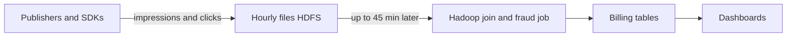
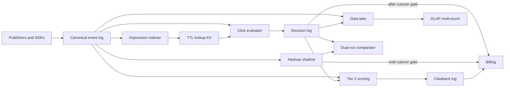
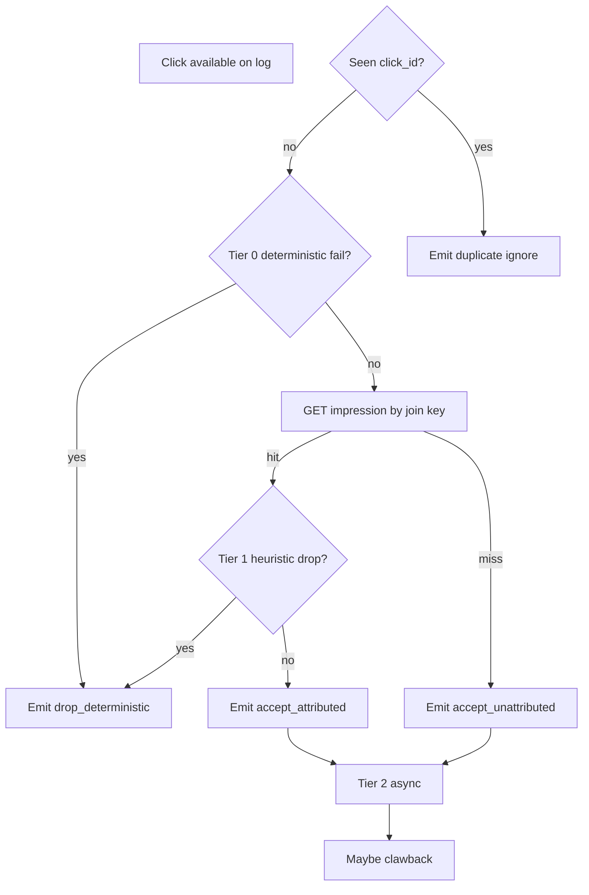

# Ad-Tech Click Fraud & Attribution Engine — Architecture Document
> - **Document Status**: Draft
> - **Last Updated**: 2026 Aug 29
> - **Author**: Paul Serban

A streaming redesign of click fraud evaluation and impression attribution: clicks are decided on a keyed, TTL'd impression lookup plus a three-tier fraud pipeline; Hadoop leaves the hot path; multi-touch over petabytes lives on a lake/OLAP plane. This document covers *what* the system is and *why* it is shaped this way; see [System Design](./03_system_design.md) for *how* lookup, tiers, partitioning, and idempotency actually work, and [Trade-offs and Honest Assessment](./05_tradeoffs_and_honest_assessment.md) for what "real-time" costs.

## Overview

**Brief description**: Ad-tech decision infrastructure, scoped narrowly: evaluate a click against a 30-minute impression window and against the fraud that can be decided at ingest speed; sink everything else to an async plane. It is not a general streaming analytics platform, not an ML platform, and not a billing product — it *feeds* billing.

**Business Context**
- See [Scenario and Requirements](./01_scenario_and_requirements.md) for the full framing. In short: 350k clicks/s and 2.5M impressions/s with a 30-minute window imply ~4.5 billion live keys; Hadoop's 45-minute cycle is a leakage window for fraud that is already knowable; "deterministic + botnet detection + sub-second" is three requirements that do not fit on one path.
- Target users: owning engineer, fraud science, billing/ad ops, on-call. Finance consumes decision logs. Warehouse consumers consume the lake.

## Requirements

### Functional Requirements

- **Ingest**: accept impression and click events from collectors worldwide; persist durably before, or atomically with, acknowledgement to the collector; never lose an event without a metric.
- **Index impressions**: write a compact record to a TTL'd lookup store keyed by the join id minted at serve time; expire at the 30-minute window (plus a small skew buffer if product requires it — that buffer is money in RAM).
- **Evaluate clicks**: parse, idempotency-check, Tier 0 deterministic rules, lookup, Tier 1 cheap heuristics, emit a decision record.
- **Attribute**: last-valid-impression (or the invoicing rule product already uses) in window for this join key. Miss → `unattributed`.
- **Drop**: Tier 0/1 drops emit audit events and do not create billable conversions. Reasons are stable enums.
- **Score asynchronously (Tier 2)**: behavioral/ML/graph models consume the canonical stream and decision logs; emit clawback or "do not pay" records; never sit in the click p99 path.
- **Audit**: every accept, drop, and clawback is a durable, versioned record.
- **Historical / multi-touch**: the same canonical events land in a data lake table format; OLAP/warehouse serves multi-touch and advertiser queries. The hot KV is not a historical store.
- **Shadow / dual-run**: streaming decisions can be compared to Hadoop outputs on the same event ids without being the invoice, until a written gate says so.

### Non-Functional Requirements

**Performance Requirements:**
- Click hot path p99 **< 1 s** end-to-end from ingest-available to decision-emitted, for Tier 0 + lookup + Tier 1. Design target internally is tens of milliseconds of compute plus queueing; the SLO is sub-second so a GC pause or a KV hiccup is not an automatic breach, but a 500 ms remote model call is already a budget violation.
- Impression writes: 2.5M/s sustained with peak headroom (working assumption: 2×). If you cannot buy a store that writes this, you do not have a design.
- State: 4.5 billion keys, compact records, TTL'd, replicated. Capacity planning is in terabytes of RAM/flash, not "the cluster will scale."
- Multi-touch queries: warehouse SLAs (seconds to minutes), **not** the click SLO.

**Reliability Requirements:**
- **Idempotent billing-adjacent effects.** Replay of a click or of a stream job must not double-apply a conversion or a drop. See System Design §5.
- **Watermarks and lateness are explicit.** A stuck watermark is a page, not a silent stall of attribution.
- **Degrade mode for lookup-store outage is a written policy** (fail open vs fail closed). Default recommendation: fail *open* for billing of clicks that pass Tier 0 (accept as `unattributed` or `attributed_degraded`) and **fail closed** for *new* Tier 1 drops that need the store — i.e. do not drop if you cannot look up. Losing attribution for a minute is better than dropping 350k legitimate clicks/s because Redis was partitioned. This is a business signature, not an engineer preference.
- **Hadoop remains restorable as system of record** until Phase 5. Rollback is a switch of billing source, not a cluster rebuild from backup.

**Infrastructure Constraints:**
- Worldwide publishers: ingest is multi-region or regionally collected with a documented hop to the decision region. Cross-region KV for the *same* 4.5B keys is a second copy of the bill; the default is **regional decision** (US/EU/AP) with campaign-level routing, not a single global hot store, unless product proves a single global window is required for the same user crossing regions in 30 minutes. Cross-region users in 30 minutes are real but are not 100% of keys; do not pay 3× regions × 3× replicas on day one without the measurement. See scaling.
- Existing Hadoop/lake is not deleted in v1; it is the shadow and the backfill source.
- No greenfield "we rewrote billing." This system emits facts; billing applies them.

**The defining constraint:**
- The scarce resource is **hot state and per-click decision budget**, not MapReduce slots. Hadoop's scarce resource was shuffle and job time. Raising Hadoop frequency does not create a 4.5B-key lookup. Putting 4.5B keys in Flink managed state without a team that has already operated that is how you get checkpoint times measured in tens of minutes and a streaming job that is a batch job with extra steps. The architecture is: **external TTL'd KV for the join; stream processors that are almost stateless on the hot path; fraud that needs state beyond counters lives off the path.**

## Executive Summary

The system is a **hot-path decision engine plus an async fraud/analytics plane**, both fed from the same partitioned event log. The scarce resource on the old path was **time-to-knowledge** (45 minutes of shuffle). The scarce resource on the new path is **working-set size and per-click CPU/network**. Those are not solved by the same technology.

**Architecture Style:** Stream ingest + keyed lookup + tiered policy, with CQRS-like split between decision serving and historical query. Not a single Flink pipeline that "does everything." Not Lambda architecture as a slogan; Hadoop is a *migration shadow*, not a forever serving layer. After Phase 5 it is a warehouse job among warehouse jobs.

**Key Components:**
- **Collectors / ingest log**: partitioned pub/sub (or equivalent) as the canonical event stream. Impressions and clicks are topics (or tagged on one topic — operational choice, not architecture).
- **Impression indexer**: writes TTL'd records to the lookup store; also sinks raw events to the lake.
- **Click evaluator**: hot-path workers; Tier 0, lookup, Tier 1; emits decision records to a decisions topic.
- **Lookup store**: distributed KV, TTL 30 min, keyed by join id; sized for 4.5B keys.
- **Idempotency store**: seen `click_id` (and perhaps `impression_id` for exactly-once index) with TTL ≥ max replay window.
- **Tier 2 workers**: consume decisions + events; feature store / model scoring; clawback topic.
- **Lake + OLAP**: Iceberg/Delta/Hudi (or whatever you already have) + warehouse for multi-touch and dual-run comparison.
- **Dual-run comparator**: joins streaming decisions to Hadoop outputs on event id; reports dollar and count divergence.
- **Hadoop (during migration)**: continues to produce the invoice until the gate in [ADR-005](./04_architecture_decision_records.md#adr-005).

**Technology Stack (class, not brand):**
- Log: partitioned, durable, high-throughput (Kafka / equivalent). 2.5M+350k messages/s is a large but standard Kafka-class cluster if records are compact; fat JSON SDK dumps will need a compact binary or a two-stage parse. Payload size is a Phase 0 measurement.
- Hot-path workers: stream processor or a request-style consumer group. **Almost stateless.** Flink/Spark Structured Streaming/custom consumers are interchangeable *if they do not hold the 4.5B-key join*.
- Lookup: a KV that has proven multi-million QPS and multi-billion keys (Aerospike / Scylla / DynamoDB-class / a carefully operated Redis cluster only if Phase 0 RAM and QPS math closes — Redis at 4.5B keys is a maybe, not a default).
- Lake: the existing Hadoop-adjacent object store, upgraded to a table format if not already.
- Comparator: batch or micro-batch is fine; this is not in the click SLO.

**Architecture Principles:**
- **The join is a lookup.** If a design diagram shows two streams window-joining without a key, it is wrong.
- **Deterministic ≠ complete.** Tier 0/1 drop what is explainable. The rest is scored later.
- **Do not drop when you are blind.** Store outage → degrade, do not fail closed on drops.
- **Money has a replay story.** Every billing-adjacent write is keyed by event id.
- **One canonical stream, many consumers.** Hadoop, lake, evaluator, Tier 2, dual-run all read the log (or a lake projection). Do not dual-ingest from SDKs into two pipelines that then disagree on what an event *was*.
- **Hadoop numbers win ties until the gate.** Streaming is guilty until proven within tolerance.

**Key Architectural Decisions:**
1. **Streaming log + hot-path workers over Hadoop as the decision system of record.** [ADR-001](./04_architecture_decision_records.md#adr-001).
2. **External TTL'd KV for impression lookup over embedded stream-processor window state.** [ADR-002](./04_architecture_decision_records.md#adr-002).
3. **Three-tier fraud: inline deterministic / cheap heuristic drop vs async probabilistic clawback.** Explicitly reject "fully deterministic + sub-second + catches botnets." [ADR-003](./04_architecture_decision_records.md#adr-003).
4. **Lake/OLAP for historical multi-touch, not the hot path.** [ADR-004](./04_architecture_decision_records.md#adr-004).
5. **Dual-run/shadow vs Hadoop before any billing cutover.** [ADR-005](./04_architecture_decision_records.md#adr-005).

### Context Diagram — current path (the 45-minute leak)

Every minute on the "up to 45 min later" arrow is a minute of knowable fraud still looking like revenue. The join and the fraud model are coupled to the same shuffle.

### Context Diagram — target path

The click evaluator talks to the KV with a point get. Hadoop still consumes the log until the gate, then becomes a warehouse citizen. Tier 2 never edges into `eval`.

## Runtime Architecture

1. **Ingest layer** (collectors, regional): authenticate publisher/app, cap payload size, attach ingest_time, publish to the log. This layer does **not** attribute and does **not** drop for fraud except poison (unparseable, unauthenticated, over-size). Dropping "fraud" at the edge without audit is how you become undebuggable.
2. **Index layer** (impression indexer): compact the record, PUT to KV with TTL = window, sink to lake. Idempotent on `impression_id`.
3. **Hot evaluate layer** (click evaluator): idempotency on `click_id` → Tier 0 → GET impression → Tier 1 → emit decision. Target: milliseconds of work, sub-second SLO including queue.
4. **Async fraud layer** (Tier 2): features over minutes–hours, model versions, clawback events.
5. **Compare layer** (until Phase 5): Hadoop job on the same log (or on lake files derived from it) vs decision log; dollar divergence.
6. **Query layer**: OLAP on lake for multi-touch, disputes, advertiser UI. Not on the evaluator's cluster.

### Hot path vs async path

Tier 2 runs on accepts (and optionally on drops, for training). It does not gate `emitOK`.

## Components

### 1. Canonical event log
**Purpose**: Be the only statement of "this impression/click existed," in ingest order per partition, with enough retention for replay, dual-run, and lake sink lag.

**Responsibilities:**
- Hold compact events at 2.5M+350k/s.
- Partition by a key that keeps a *publisher or join-id prefix* local enough for ordered processing where it matters; do **not** require global order.
- Retain days (working: 3–7) plus lake as the long store. The log is not the petabyte historical system.

**Interactions:**
- Produced by collectors.
- Consumed by indexer, evaluator, lake sink, Hadoop shadow, Tier 2, replay tools.

### 2. Impression indexer
**Purpose**: Turn an impression event into a hot lookup record without putting join logic in the collector.

**Responsibilities:**
- Validate join key present (server-minted). Missing key: metric + dead-letter; do not invent a key.
- Write `{join_key → compact impression}` with TTL.
- Sink the full event to lake (full fidelity; the KV is not the archive).

**Interactions:**
- Reads: impression topic.
- Writes: KV, lake, index-error DLQ.

### 3. Lookup store (TTL'd KV)
**Purpose**: Be the 30-minute working set. This is the expensive component. Treat it as such in ops and in budget.

**Responsibilities:**
- GET/PUT at millions/s, TTL, replication, predictable p99.
- Per-key TTL; no "scan all impressions in 30 minutes."
- Expose occupancy, eviction, hotspot keys as metrics. A celebrity app's campaign can hotspot a shard; the key scheme must hash well (join ids are random; do not partition by publisher id alone).

**Interactions:**
- Written by indexer; read by evaluator; not queried by OLAP.

**Non-responsibilities:**
- Not a feature store for 24-hour device graphs.
- Not a multi-touch store.
- Not Hadoop's replacement for last year of logs.

### 4. Click evaluator (hot path)
**Purpose**: Produce a decision record per distinct click within SLO.

**Responsibilities:**
- Idempotency check.
- Tier 0: schema, replay/duplicate (if not already caught), timestamp sanity, optional IP/ASN allow/deny lists that are **already** dual-run, per-key rate limits that fit in local or sharded counters (see System Design).
- Lookup.
- Tier 1: cheap scores that use the impression record + local counters only (e.g. click-too-fast after impression, impossible geo vs campaign, frequency cap). No remote model.
- Emit decision with rule ids, model-n/a, lookup hit/miss, timings.

**Interactions:**
- Reads: click topic, KV, idempotency store, rate-limit counters.
- Writes: decision log, maybe idempotency store.

### 5. Idempotency store
**Purpose**: Make replay safe for money.

**Responsibilities:**
- Remember `click_id` (and evaluation result, or a pointer) for the **replay window**, which is longer than 30 minutes if collectors retry for hours. Working default: 24–72 hours. This is a second large set: 350k/s × 86,400 ≈ **30 billion keys/day** if you keep 24h of *every* click id — that is **larger than the impression working set** if you are naive.

**Honesty on size:** 24h of click ids at 350k/s is ~30.2 billion ids. At 16–32 bytes per key in a bloom/Cuckoo or a slim KV, that is hundreds of GB to low TB. **Use a Bloom/Cuckoo filter + a short exact store for recent ids, or a compacted log-structured set**, not a full replica of every click as a rich document. False positives on a Bloom for *idempotency* must fail toward "treat as duplicate" only if you can confirm via a second exact check, or fail toward "treat as new" and accept a rare double-eval that the decision log's unique constraint then catches. **Billing unique-constraint on `click_id` is the backstop.** The idempotency store is an optimization and a hot-path guard, not the only fence. See System Design §5.

### 6. Tier 2 scoring and clawback
**Purpose**: House the fraud that cannot be honest on the hot path.

**Responsibilities:**
- Consume events + decisions; maintain features at minute–hour grain (this *may* be a stream job with **aggregated** state, not 4.5B raw impressions).
- Call model services asynchronously; batch inference is allowed and preferred.
- Emit `clawback` / `fraud_score` records with model version, feature snapshot id, confidence.
- Never NACK the hot path.

**Interactions:**
- Reads: log, decisions, optional feature store.
- Writes: clawback topic, lake, model-monitoring.

### 7. Lake + OLAP
**Purpose**: Petabyte history, multi-touch, dual-run inputs, dispute reconstruction.

**Responsibilities:**
- Exactly-once-enough sink from the log (transactional table format or dedup on event id).
- Partition by event_date / hour for the Hadoop shadow and for time-range queries.
- Serve multi-touch models as **batch SQL or warehouse jobs**, not as KV lookups.

**Interactions:**
- Fed by log and decision/clawback topics.
- Read by warehouse, Hadoop shadow, comparator, analysts.

### 8. Dual-run comparator
**Purpose**: Decide whether streaming is allowed to become money.

**Responsibilities:**
- Join on `click_id` / `impression_id` between Hadoop output and decision log.
- Report: match rate, attributed-spend delta, fraud-spend delta, missing-in-streaming, missing-in-Hadoop, per-rule disagreement.
- Dollar caps and percentage bands as first-class outputs, not a notebook someone ran once.

**Interactions:**
- Reads: Hadoop tables, decision lake tables.
- Writes: a daily/hourly divergence report that Phase 2–4 gates read.

### 9. Hadoop (migration citizen)
**Purpose**: Until cutover, be the invoice. After cutover, be a replay/audit generator or be decommissioned as a *decision* engine.

**Responsibilities:**
- Consume the **canonical log or the lake**, not a second SDK tap.
- Keep producing the current schema billing expects, so rollback is a pointer change.

**Interactions:**
- Must not write to the hot KV. Two writers of TTL state is a split brain.

### Communication Patterns

**Synchronous (small, hot):**
- Evaluator ↔ KV GET.
- Evaluator ↔ idempotency / rate counters.

**Asynchronous (the rest):**
- Collectors → log.
- Indexer, evaluator, lake, Tier 2, Hadoop: consumers of the log.
- Decisions → billing (after gate), comparator, Tier 2.
- Clawbacks → billing (always async).

**Forbidden:**
- Evaluator → model HTTP in the click loop.
- OLAP query → hot KV.
- Hadoop and indexer both writing the same KV keys.

## Scaling Strategy

**Current Scale Requirements:**
- 2.5M impression writes/s, 350k click evals/s, 4.5B live impression keys, worldwide ingest.

**Partition / shard math (working):**
- Hash `join_key` (impression id) across KV shards so celebrity publishers do not pin one node. Join keys must be high-entropy (UUIDs / Snowflake-ish). Partitioning the *log* by `join_key` can keep a click on the same consumer as recent impressions *if* you want a cache; it is optional. With an external KV, consumers can be stateless and the KV owns the hash. Prefer **stateless consumers + hashed KV** over "sticky Flink keys" unless you have the Flink skill.
- Consumer parallelism: 350k/s / per-worker capacity. If a worker does 2k clicks/s honestly (rules + one GET), you need ~175 workers plus headroom, before replica. That is a medium-large consumer group, not a miracle.
- Impression writes: 2.5M/s is the harder KV number. Shard count is driven by write QPS and by key count, not by click count.

**Regional vs global:**
- Default: **regional hot path** (ingest region → regional KV + evaluator). A click in EU looks up EU impressions. Cross-region attribution in 30 minutes is a miss or a delayed async repair, not a 3-region sync write of 4.5B keys. If product *requires* global last-touch in 30 minutes, you are buying a global KV or a replicate-on-write fabric; that is a Phase 0 finding and a different cost. Do not assume it.

**What does not need to scale with the window:**
- Evaluator CPU. It scales with click rate, not with 30 minutes.
- Hadoop shuffle, after cutover.

**What scales with the window:**
- KV memory/flash. Stretching the window to 60 minutes **doubles** the working set. Product asking for "just make the window 24 hours in real time" is asking for ~24× state (216 billion keys at 2.5M/s). That is a "no" or a "only aggregated features, not raw impressions." Write the refusal down.

**Bottleneck Analysis:**
- Primary: KV write QPS + working set. If this is wrong, nothing else matters.
- Secondary: log cluster disk and network (especially if events are fat). Compact at collect.
- Tertiary: Tier 2 feature compute and model cost. Can lag; must be observable; must not backpressure the log into the hot path (separate consumer groups, separate clusters if needed).
- Not a bottleneck if designed right: "join complexity." It is O(1) GET.

## Data Architecture

### Data Model

**Key Entities:**
- **ImpressionEvent**: impression_id (join key), campaign_id, publisher_id, app/site, device_hash, ip/asn (or a privacy-reduced form), event_time, ingest_time, serving metadata.
- **ClickEvent**: click_id, join_key (impression_id), campaign_id, publisher_id, device_hash, ip/asn, event_time, ingest_time.
- **ImpressionRecord (KV)**: compact subset: join_key, campaign_id, publisher_id, event_time, a few fraud-relevant flags. TTL 30 min.
- **DecisionRecord**: click_id, impression_id or null, outcome (`drop_deterministic` | `accept_attributed` | `accept_unattributed` | `duplicate`), rule_ids[], lookup_status, evaluator_version, event_time, decision_time, timings.
- **ClawbackRecord**: click_id, model_version, score, reason codes, feature_as_of, emitted_time.
- **DivergenceRecord** (comparator): click_id, streaming_outcome, hadoop_outcome, spend_delta.

**Entity Relationships:**
- One impression_id → one KV record (last write wins if duplicate ingest; first-write-wins is also valid — pick one and test).
- One click_id → one DecisionRecord (uniqueness enforced in the decision log/lake).
- One click_id → zero or many ClawbackRecords over time (model reruns); billing applies a policy (first fraud wins, or latest, or locked after invoice). Policy is finance's; architecture keeps all.

### Data Lifecycle

**Create**: events at ingest; KV at index; decision at eval; clawback at Tier 2; lake copies continuously.

**Read**: evaluator GETs KV; billing reads decisions (post-gate) and clawbacks; OLAP reads lake; comparator reads both worlds.

**Update**: KV overwrite only for duplicate impression ingest. Decisions are append-only. Corrections are new clawbacks or compensating events, not UPDATE-in-place of a decision. This is how disputes stay reconstructable.

**Delete / expire**: KV TTL. Idempotency structures expire on their own TTL. Lake retains per compliance (years is normal in ad-tech; that is the petabyte). Log retains days.

## Cost Analysis

### Cost Components

**Money — the KV is the slide that usually gets left off:**
- 3–6 TB replicated working set, flash or RAM, plus 2.5M writes/s. This is a serious Aerospike/Scylla/DynamoDB bill, not a "we already have Redis" footnote. Multi-region doubles or triples it.
- Log cluster at ~3M msgs/s: large Kafka-class cost; dominated by disk and cross-AZ network if you replicate.
- Dual-running Hadoop + streaming until Phase 5: **you pay both**. This is months to a year of double opex. Finance must see it. Cutting Hadoop in month two to "save money" is how you lose the rollback.
- Tier 2: GPU/CPU for models, feature store. Can exceed the hot path if someone deploys a huge graph. Cap it; it is a separate budget.
- Engineering: multiple quarters, multiple teams (ingest, KV, fraud process, billing cutover). Larger than the software licenses.

**Leakage vs infra — the comparison that justifies the bill:**
- If Phase 0 leakage of *currently detectable* fraud in 45 minutes is $X/day, and the streaming stack is $Y/day, the project is a cost-of-goods conversation. If X is small because most fraud is *not* detectable in batch either, streaming will not magically find it faster in a way that pays for the KV. **Do not skip that arithmetic.**

### Cost Optimization

- Compact event encoding at the collector. JSON-at-2.5M/s is how Kafka disks die.
- KV record as small as the lookup needs. Do not store the raw user-agent string in the hot record if a hash suffices for Tier 1.
- Regional, not global, hot state until proven otherwise.
- Bloom-backed idempotency, not a rich 24h click document store.
- Do not stretch the 30-minute window "for product" without a KV resize approval.
- Turn off Hadoop as *decision* only after the gate; keep lake jobs — those are cheaper than Hadoop MR if you already move to a table format.

## Risks and Mitigation

| Risk | Likelihood | Impact | Mitigation Strategy | Owner |
| --- | --- | --- | --- | --- |
| Stated rates are 10× marketing | Medium | High (wrong size cluster) | Phase 0 measure; seams stay, fleet shrinks | Owning engineer |
| No stable join key on clicks | High in messy SDKs | High (design invalid) | Block Phase 2; client requirement; no fuzzy v1 | Product + client teams |
| KV cannot hit 2.5M writes/s p99 | Medium | Critical | POC at production-like key cardinality in Phase 1; kill streaming join if it fails, consider micro-batch | Platform |
| Flink/RocksDB used for 4.5B keys anyway | High under slogan pressure | High | [ADR-002](./04_architecture_decision_records.md#adr-002); checkpoint-time SLO as a kill criterion | Architect |
| Tier 0 false positives at 350/s | High if rules shipped without shadow | Critical | Shadow rules; per-rule kill switch; fail open on uncertainty | Fraud + owning engineer |
| Clawback not in publisher contracts | High | High (Tier 2 cannot recover money) | Phase 0 legal; either renegotiate, accept leakage, or put *more* on Tier 1 with dual-run — not silent clawback | Legal + finance |
| Dual-run divergence treated as "streaming is right" | High | High (wrong invoices) | Hadoop wins ties until gate; investigate every dollar band breach | [ADR-005](./04_architecture_decision_records.md#adr-005) |
| Window extended to hours in real time | Medium (product request) | Critical (state explosion) | Refuse raw-impression TTL stretch; offer warehouse multi-touch | Architect |
| Single global KV | Medium (architecture fashion) | High cost | Regional default; measure cross-region need | Platform |
| Hot path calls the model "just for 20% of traffic" | High | High (SLO death) | No. Sample to Tier 2. 20% of 350k is 70k inf/s | Fraud |
| Log and Hadoop dual-ingest from SDK | High during migration | High (incomparable events) | One collector, many consumers | Ingest |
| Celebrity campaign hot shard | Medium | Medium | High-entropy keys; shard metrics | KV owner |
| Audit logs too fat / too thin | Medium | Medium | Decision records compact but complete on rule ids; raw events in lake | Owning engineer |
| "Real-time dashboard" still reads Hadoop | High | Low (optics) | Point live counters at decision stream; keep Hadoop for invoice until gate | Ad ops |
| Privacy (IP, device) in hot KV vs regulation | Medium | High | Minimize KV payload; hash; retain raw in lake under existing controls | Privacy counsel |

## Future Enhancements

### Phase 1 (current design's first build)
**Focus**: Measure; canonical log; Tier 0 only in shadow. See [Phased Implementation Plan](./06_phased_implementation_plan.md).

### Phase 2
**Focus**: KV lookup + attribution dual-run vs Hadoop.

### Phase 3
**Focus**: Tier 1 heuristics on the hot path (shadow then drop); Tier 2 clawback pipeline, still not the invoice.

### Phase 4
**Focus**: Billing cutover to streaming decisions; Hadoop as fallback.

### Phase 5
**Focus**: Decommission Hadoop as decision engine; OLAP multi-touch is the historical product.

### Technical Debt (accepted)

- Fuzzy device+campaign view-through in the 30-minute window is not v1. Last-click with a join key is.
- Global cross-region 30-minute join is not v1.
- Graph fraud, people-based attribution, and "the model blocks in real time" are not v1 and may never be on this path.
- Evaluator is not a general CEP engine. New fraud that needs new state is a new ADR or it goes to Tier 2.
- Billing remains a separate system. This project will not "just update the ledger in the evaluator."
