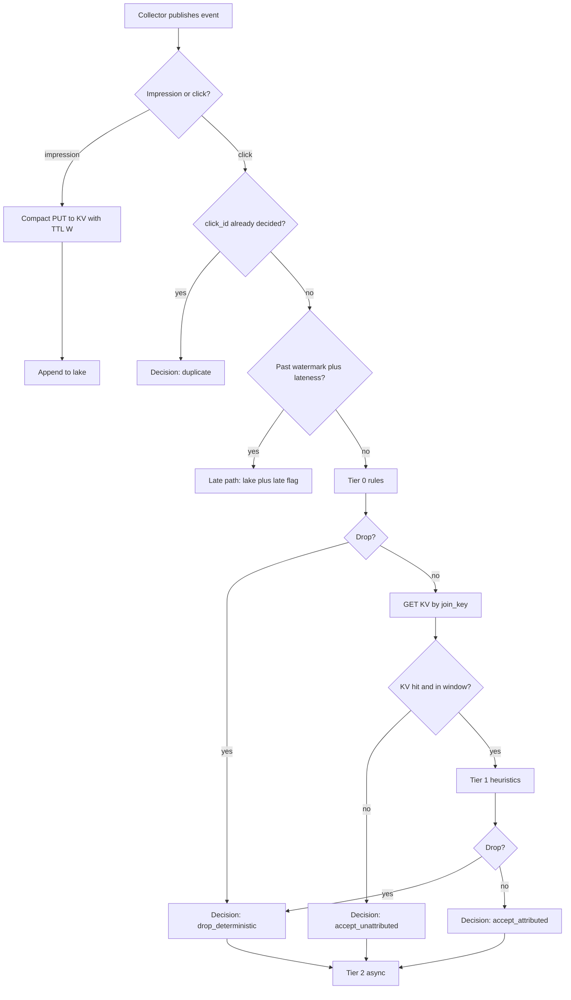
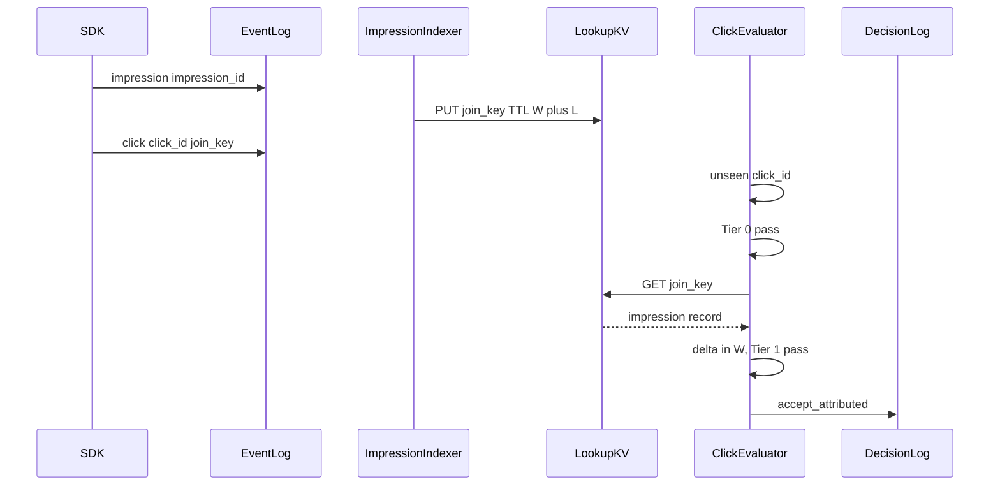
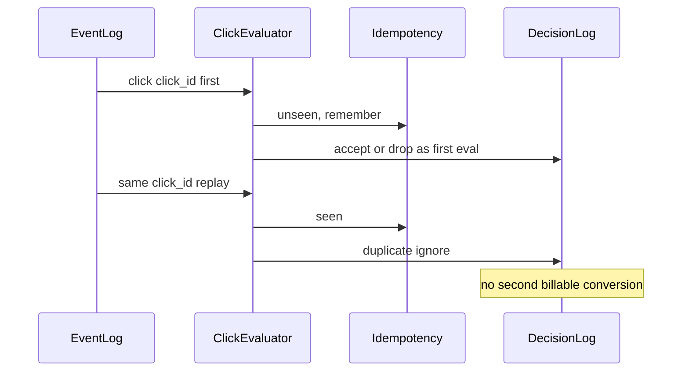
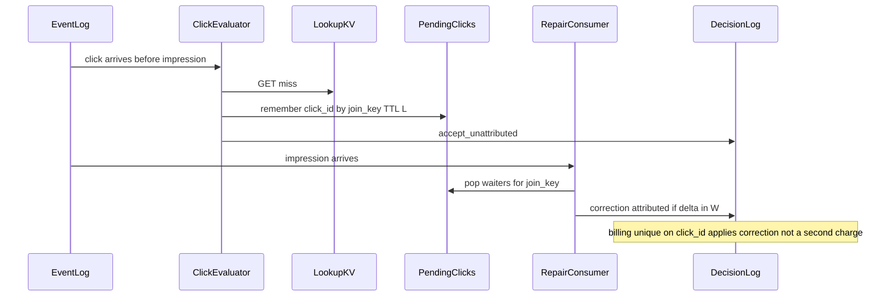
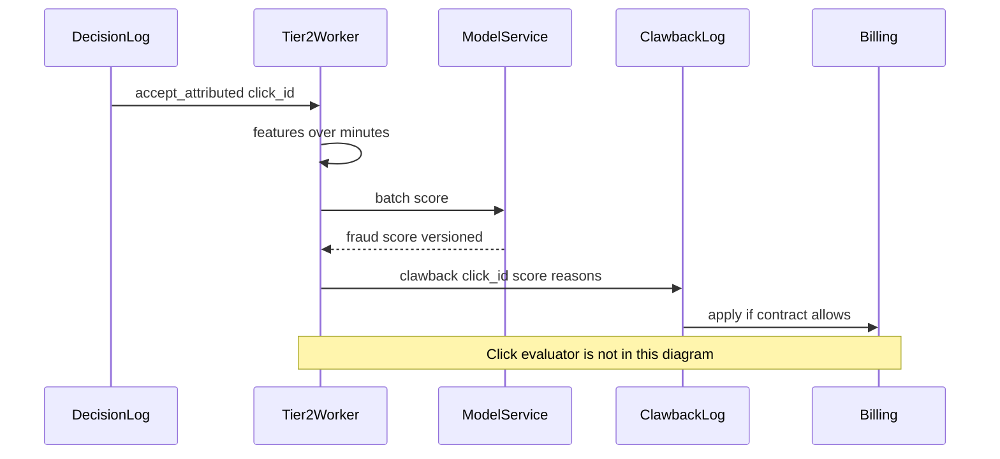
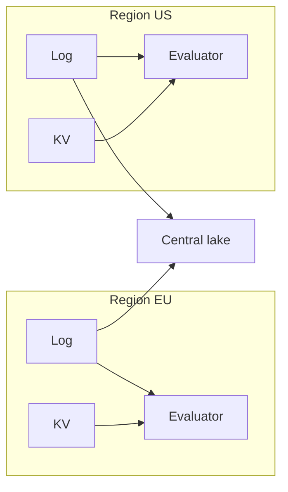

# Ad-Tech Click Fraud & Attribution Engine — System Design
> - **Document Status**: Draft
> - **Last Updated**: 2026 Aug 29
> - **Author**: Paul Serban

This document is the mechanical *how* for the system described in the [Architecture Document](./02_architecture_document.md). It specifies the join-key lookup, TTL and lateness, the three-tier fraud sequences, partitioning, financial idempotency, backfill, and observability. It does not specify code.

## 1. Control Flow

One canonical log. Two hot-path consumers (index impressions, evaluate clicks). One async scoring plane. One lake. Hadoop is a shadow consumer until the billing gate.



**Invariant:** the click evaluator never scans impressions. If a design needs `join impressions where device_id = X and time in window`, that is not this hot path. It is a warehouse query or an explicit v2 degraded path with a cap.

**Window W:** 30 minutes of **event time**, plus a **lateness slack L** (working default **2 minutes**) of allowed arrival delay. An impression stays in KV for `W + L` so a click that is on-time in event time but slightly late in ingest still hits. KV TTL = `W + L`. Stretching L is RAM. See §3.

## 2. Join Key, Lookup, and Window Geometry

### 2.1 Key scheme

- **Join key** = `impression_id` minted at **ad serve / impression-log time** by *our* serving path (or a trusted exchange), not by the publisher's client. Format: high-entropy, globally unique, not sequential per publisher (hot-shard avoidance).
- **Click carries** `impression_id` as `join_key`. If absent: Tier 0 may drop as `malformed` or emit `accept_unattributed` depending on contract. Do not fuzzy-match in v1.
- **Click id** = server- or SDK-issued unique id with the same uniqueness story as payment idempotency keys. If the SDK cannot mint one, the collector mints one from a hash of (publisher, timestamp, IP, user-agent, landing URL) **only as a last resort** and metrics it as `synthetic_click_id` — collisions will double-drop or double-bill. Phase 0 must show the collision risk; if it is material, **fix the SDK** before Phase 2.

### 2.2 KV record (hot)

Keep it small. Working fields:

| Field | Role |
| --- | --- |
| join_key | Primary key |
| campaign_id, publisher_id | Attribution + Tier 1 |
| event_time | Window check (do not trust TTL alone; clock and TTL are cousins, not twins) |
| device_hash | Optional Tier 1; hash, not raw |
| asn or geo bucket | Optional Tier 1 |
| serving_flags | Compact bitfield (e.g. rewarded, viewability if already computed at serve) |

TTL on the record: `W + L`. Evaluator still checks `click.event_time - impression.event_time` in `[0, W]` (and the product's view-through vs click-through sign rules). A GET hit with a time delta outside W is a miss for attribution (`accept_unattributed` or `drop` if a click before the impression is defined as invalid).

**Impression after click:** if the click arrives first (SDK reordering), the GET misses. Options: (a) short retry/wait in the evaluator — **forbidden** (destroys SLO at 350k/s); (b) emit `accept_unattributed` and let a **repair consumer** re-evaluate if the impression arrives within L — **allowed**, bounded, and must be idempotent on `click_id` (second decision is a `correction`, not a second bill); (c) ignore. **(b) is the default** with a repair window = L, not W. Repair is a separate consumer reading impression topic against a short-lived `pending_unattributed_clicks` index keyed by `join_key`. That secondary index is **clicks waiting**, not 4.5B impressions: at most `350k × L` (2 min → ~42 million keys), much smaller. If you skip repair, you systematically under-attribute on reordered SDKs. Measure reorder rate in Phase 0.

### 2.3 Not a sliding-window join

A Flink `interval join` on click and impression streams keyed by `join_key` is **semantically** the same as a KV lookup if and only if the state backend can hold the impression side for W at this cardinality. That is the 4.5B-key problem again. This design **externalizes** that state. A stream processor may cache locally but must not be the system of record for the window. See [ADR-002](./04_architecture_decision_records.md#adr-002).

### 2.4 Fast-click replay

Replay is **the same `click_id` twice** (or the same payload hashed). Counter: idempotency (§5). A *different* `click_id` on the same impression within 100 ms is either a double-tap (maybe billable once per impression — **frequency cap on impression_id**) or fraud. That is a **Tier 1 counter**: `clicks_on_join_key` with TTL W. Store: sharded counters next to the KV or a field on the impression record incremented with a cheap atomic. Cap is a product number (e.g. 1 paid click per impression). Excess: `drop_deterministic` reason `over_frequency`. This is one of the few *stateful* hot-path rules that is worth it: the state is per live impression, not a new 4.5B-key space.

## 3. Event Time, Watermarks, Lateness

- **event_time**: from the event, clamped: reject (Tier 0) if more than `S` in the future (working `S = 2 minutes`) or older than `W + L` at ingest (too old to ever join). Clamping vs dropping is a product choice; default **drop future-far, late-path the too-old**.
- **ingest_time**: collector clock, trusted more than the device.
- **Watermark** per click-partition: `max(event_time) - L` or a heuristic on ingest_time if device clocks are junk. **If device clocks are junk (likely), watermark on ingest_time and use event_time only for the delta check against the impression.** Phase 0 must say which clock is less wrong. Mobile-heavy traffic often means: **ingest_time for watermarks, event_time for attribution delta with sanity clamps.** That is an honest, slightly leaky policy. Pretending device NTP is true is how you mis-window a continent of Android phones.
- **Late clicks** (arrive after watermark): go to the late path — lake + `late` flag; optional offline attribution job; **not** the hot SLO. Metric: `late_click_rate`. If this is 10%, your L is wrong or your collectors are buffering too long.

## 4. Sequences

### 4.1 Clean click — attributed



### 4.2 Deterministic drop — replay / duplicate



### 4.3 Deterministic drop — over-frequency / too-fast

```mermaid
sequenceDiagram
    participant Ev as ClickEvaluator
    participant KV as LookupKV
    participant Dec as DecisionLog

    Ev->>KV: GET join_key
    KV-->>Ev: impression plus click_count
    Ev->>Ev: click_count exceeds cap or delta below min_ms
    Ev->>Dec: drop_deterministic over_frequency or too_fast
    Note over Ev: still increment or not per policy; default increment so the cap holds
```

`too_fast`: click.event_time − impression.event_time below a floor (e.g. 2–10 ms for a human-impossible tap, tuned per surface). This is heuristic-but-thresholded → **Tier 1**, dual-run required. Datacenter IP lists are **Tier 0** only if already used in Hadoop and dual-run agrees.

### 4.4 Lookup miss — unattributed, then repair



If repair volume is huge, L is too small or SDK order is broken — fix the SDK; do not turn the evaluator into a wait-loop.

### 4.5 Tier 2 retroactive clawback



The evaluator is intentionally absent. If a sequence diagram for botnet detection includes the click p99 path, the design has failed [ADR-003](./04_architecture_decision_records.md#adr-003).

## 5. Exactly-Once / Idempotency (Financial)

"Exactly-once" in streaming marketing decks is **not** what billing needs. Billing needs **effectively-once application of money** on `click_id`.

Layers, all required:

1. **Collector**: at-least-once to the log. Duplicates will happen.
2. **Log**: at-least-once delivery to consumers. Offsets are not a billing uniqueness key.
3. **Hot-path idempotency**: probabilistic or exact *recent* `click_id` set so the common retry does not redo KV GETs and Tier 1. Fail toward extra eval, not extra drop, unless the exact store confirms duplicate.
4. **Decision log uniqueness**: `click_id` is a unique key in the lake table / billing ingest. A second `accept_attributed` for the same id is a no-op or a versioned correction.
5. **Billing system**: unique constraint / idempotent upsert on `click_id`. If billing cannot do this, **stop this project until it can**. Streaming will not save a ledger that double-applies.

**Impression indexing:** PUT is idempotent (same record). Duplicate impressions must not reset TTL in a way that extends the window forever (replay every 20 minutes to keep a fraudulent impression alive). **TTL from original event_time**, not from last PUT. If the store's TTL is "from last write," encode `expires_at` in the value and ignore GETs past it; or use first-write-wins.

**Stream job replay (from offset 0):** must not mutate KV into a mess. Re-indexing impressions is safe if first-write-wins and TTL-from-event-time. Re-evaluating clicks is safe if decision uniqueness holds. **Do not** "clear the KV and replay last 30 minutes" in production without a runbook; a partial replay desynchronizes TTL.

**Clawbacks:** identified by `(click_id, model_version)` or a clawback_id. Billing applies a documented fold (e.g. once per click, first fraud wins). Rerunning Tier 2 must not stack five clawbacks into 500% refund.

## 6. Partitioning and Sharding

### 6.1 Event log

- Partition count: sized for 3M+ msgs/s and consumer parallelism, typical hundreds of partitions, not 12.
- Partition key: `join_key` (impression_id) for both impression and click **if** you want locality; or `hash(publisher_id)` if you care about publisher-level ordering. **Default: hash(join_key)** so a click and its impression share a partition (nice for debugging and for a local cache), with the KV still authoritative. Publisher-id partition keys create celebrity partitions — reject for the log unless you already know how to split them.

### 6.2 KV

- Hash(join_key) shards. Target: no shard owns a celebrity campaign by construction.
- Replica factor 3 in-region. Cross-AZ is assumed.
- Capacity: plan 4.5B keys × record size × replica × 1.5 headroom (fragmentation, tombstones, spikes).
- Write path: 2.5M/s is the procurement constraint. A POC that inserts 4.5B keys and then holds 2.5M writes/s with production-like TTL churn is a **Phase 2 gate**, not a slide.

### 6.3 Evaluator consumers

- Consumer group parallelism ≈ partition count.
- Stateless wrt the join. Local LRU cache of recent impressions is optional (helps the click-soon-after-impression case) and must be treated as a cache: miss goes to KV.
- Rate-limit counters: sharded by the rate key (IP/device/publisher) with a short TTL (seconds to minutes). These are **approximate** (they will under-count across shards unless you use a global store). For Tier 0 "obvious flood," approximate is enough. For billing-grade frequency caps on `impression_id`, use the KV atomic on that key (§2.4), not a local counter.

### 6.4 Regional topology



A click ingested in US does not GET the EU KV in v1. Cross-region repair is a warehouse problem or a Phase 0 measured exception. Replicating all impressions to all regions is 2–3× the KV bill.

## 7. Fraud Tiers (Mechanics)

| Tier | Latency budget | State it may use | Output | Examples | Dual-run |
| --- | --- | --- | --- | --- | --- |
| 0 | microseconds–low ms | event + deny lists + seen click_id | drop or continue | malformed, future ts, duplicate click_id, known-bad ASN **already in batch** | Yes, before drop |
| 1 | low ms, still in SLO | KV impression + per-impression counters + coarse rate | drop or accept | too-fast, over-frequency, click/impression campaign mismatch, simple IP spoof if you have a cheap check | Yes, before drop |
| 2 | seconds–hours | aggregated features, graphs, batches | score + clawback | botnets, proxy pools, farms, unusual publisher mix | Continuous vs Hadoop and vs labels |

**Determinism:** Tier 0 and the *thresholded* part of Tier 1 are deterministic given their inputs. Deny-list updates are versioned; a click is evaluated against `denylist_version`. Changing the list is a config deploy with shadow. Tier 2 is not deterministic and must not use the word on customer traffic-quality reports.

**Fail-open vs fail closed:** if KV is down: do not Tier 1 drop; emit `accept_unattributed` or `accept_attributed_degraded` (if you have a cache hit) + page. If idempotency store is down: proceed and rely on decision uniqueness (risk: extra work, not extra bills if layer 5 holds). If the **log** is down: collectors buffer or shed with metrics; this is an ingest incident, not a fraud incident.

## 8. Backfill and Reprocessing

- **Lake is the source for reprocessing**, not the KV (the KV has only 30 minutes).
- Reprocess jobs: read lake for a time range, reconstruct decisions with a **new evaluator_version**, write to a *side* decision table, compare, then (rarely) switch billing to the new version for that range if finance agrees. Do not overwrite the original decision log; append a `reprocess_run_id`.
- Backfill of the KV: only to warm a new cluster: replay last `W+L` of impressions from the log. This is a runbook, minutes of replay at 2.5M/s (1,800 s of data is 4.5B writes — **the same size as the working set**, a serious load). Warm-up is a planned event, not "we bounced the pod."
- Hadoop dual-run must read the **same lake/log**, not leftover HDFS dumps from a different collector generation, or the comparator will measure ingest drift and call it fraud drift.

## 9. Error Handling

| Failure | Where | What the system does | What it must not do |
| --- | --- | --- | --- |
| Unparseable event | Collector / indexer | DLQ + metric | Drop on the floor |
| Missing join_key on click | Evaluator | unattributed or malformed per contract | Fuzzy IP join in v1 |
| KV timeout | Evaluator | fail open: unattributed/degraded + page | Drop as fraud |
| KV full / eviction before TTL | KV | page (this is a capacity bug) | Silently under-attribute |
| Duplicate click | Evaluator | duplicate ignore | Second conversion |
| Impression replay extending TTL | Indexer | first-write-wins / expires_at in value | Infinite window |
| Late click | Evaluator | late path | Pretend it was on time |
| Tier 2 model timeout | Tier 2 | no clawback; metric; retry batch | Block hot path |
| Dual-run dollar breach | Comparator | hold gate; Hadoop remains invoice | "Ship streaming, investigate later" |
| Deny-list false positive spike | Tier 0 | per-rule kill switch | Wait for a full rollback of the cluster |
| Repair storm | Repair consumer | cap outstanding pending clicks; shed to unattributed | Wait-loop in evaluator |
| Hadoop job fail during dual-run | Hadoop | page; streaming still shadow | Cut over because Hadoop is down |

## 10. Observability (Minimum)

If on-call only has "consumer lag" and "CPU," you will not see money leaking or money being stolen by a bad rule.

**Hot path:**
- Click eval p50/p99, KV GET p99, drop rate **by rule_id**, lookup hit rate, unattributed rate, duplicate rate, degraded/fail-open count.
- Evaluator version, denylist version on every decision (fields, not just a dashboard).

**State:**
- KV keys, memory/disk, eviction, expired/s, write QPS, hotspot shards.
- Pending-repair size.
- Idempotency structure fill / Bloom FPR.

**Watermarks:**
- Lag vs ingest, late_click_rate, partition-stuck watermark page.

**Money:**
- Attributed spend /s (streaming), Hadoop attributed spend /s, **delta**, cap breach.
- Clawback volume /s and applied vs rejected by billing.
- Estimated leakage remaining: fraud caught only in Tier 2, aged by detection delay.

**Forbidden:**
- Logging raw IPs and full device ids at 3M events/s into a general log stack (cost + privacy). Sample, or structured audit in the lake.
- Treating model-score histograms as a substitute for dual-run dollar delta.

## 11. What Hadoop still does (and when it stops)

Until the [Phase 4 gate](./06_phased_implementation_plan.md): Hadoop (or its Spark successor on the lake) produces the invoice schema. After the gate: it may still run as an audit job for a time-box. After Phase 5: it is not a decision engine. Multi-touch SQL is not "keeping Hadoop"; it is the warehouse. Do not confuse a Hive query with the 45-minute fraud job.
