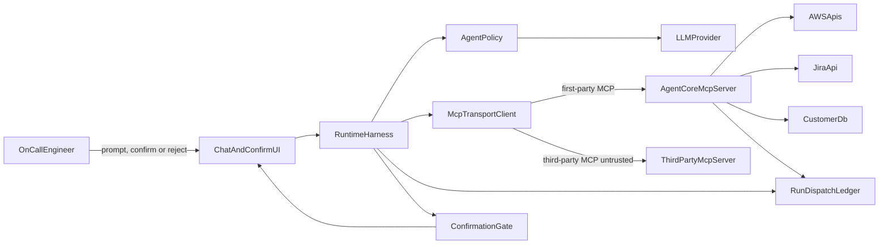
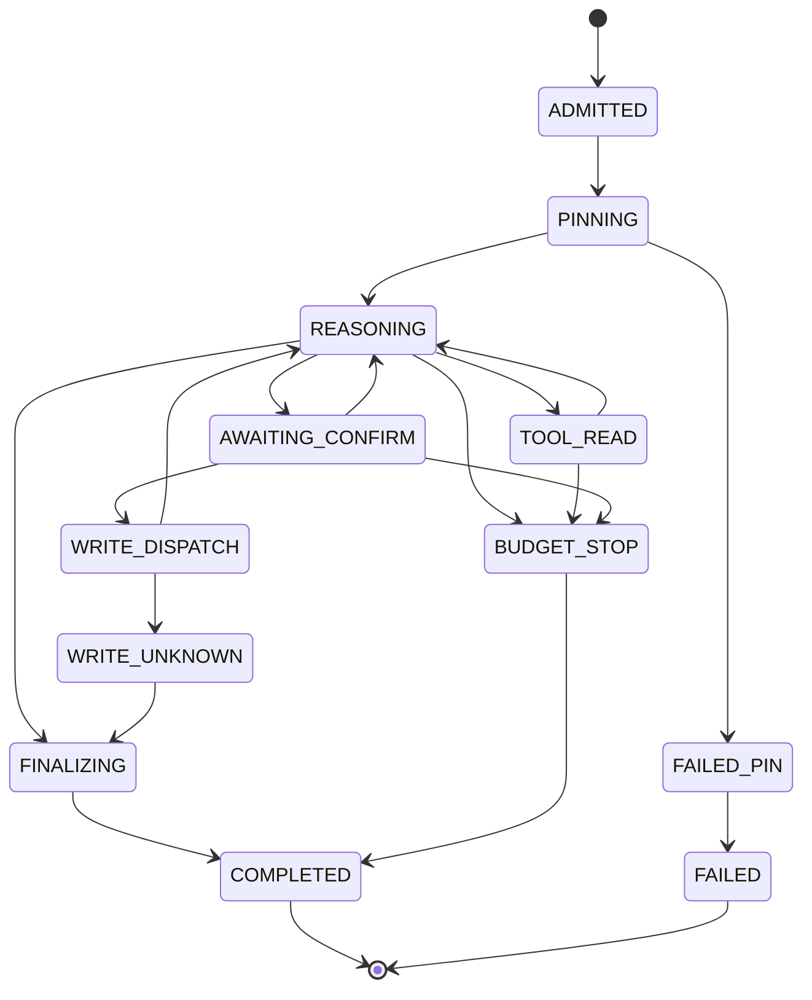

# Agent-Core MCP + ReAct — Architecture Document
> - **Document Status**: Draft
> - **Last Updated**: 2026 Aug 29
> - **Author**: Paul Serban

An on-call triage agent that reasons in a ReAct loop, invokes first-party tools (AWS reads, Jira, a narrow DB) through an MCP server we own, and can also invoke one allowlisted third-party MCP server. Policy, MCP transport, and runtime are separate layers. MCP is the wire, not the trust boundary. This document covers *what* the system is and *why* it is shaped this way; see [System Design](./03_system_design.md) for *how* the checkpoint loop, confirmation gate, schema pinning, and dispatch ledger actually work, and [Trade-offs and Honest Assessment](./05_tradeoffs_and_honest_assessment.md) for when MCP is worth the extra hop.

## Overview

**Brief description**: Control plane for a single sequential ReAct run plus a standalone first-party MCP server. Not a multi-agent platform, not a company-wide MCP gateway, not an LLM product. The scarce resource is *control over writes and untrusted observations*, not model cleverness.

**Business Context**
- See [Scenario and Requirements](./01_scenario_and_requirements.md) for the full framing. In short: MCP standardizes discovery and invocation; it does not authorize, idempotize, or sandbox a vendor.
- Current state: SDK-wrapped tools + a retrying while-loop + a shared bot credential + raw third-party tool text in the prompt. That coupling is the defect.
- Desired future state: a versioned MCP server with its own authz, a runtime that owns budgets/retries/confirmation/dispatch, a policy that only proposes tool calls, and a third-party client that pins and sandboxes.
- Target users: owning engineer, security/appsec, on-call/support, AWS/Jira/DB tool owners, the third-party vendor, future MCP clients.

## Requirements

### Functional Requirements

- **First-party MCP server**: expose the inventory in [Scenario](./01_scenario_and_requirements.md) as MCP tools with JSON Schema, version metadata, and write-tool required fields (`idempotency_key`, `confirmation_token`). Standalone process. Any compliant MCP client can connect; writes still require our gate.
- **ReAct policy**: given transcript + available tool *contracts* (not raw MCP), emit either a thought+action (tool name + args) or a final answer. No MCP types in this layer.
- **MCP transport**: `initialize` / `tools/list` / `tools/call` to our server and to the third-party server. Streamable HTTP in deployed environments; stdio acceptable for local first-party only. Schema-validate arguments and results.
- **Runtime / harness**: create a durable run; enforce budgets; classify read vs write; confirmation-gate writes; persist dispatch before write calls; retry reads only; sandbox third-party observations; persist the transcript; emit a terminal reason.
- **Identity**: every run is bound to a human principal. Server-side authz is that principal ∩ tool policy, not the bot's IAM ceiling.
- **Pinning**: first-party and third-party tool lists hashed at session start. Drift is a stop.
- **Audit**: transcript + dispatch ledger answer "who confirmed what, which key, which Jira id" without grepping LLM logs.

### Non-Functional Requirements

**Performance Requirements:**
- Interactive on-call: a read-only turn should feel like a slow chat (seconds to low tens of seconds), dominated by the LLM and the slowest AWS/Jira call, not by our ledger writes.
- Confirmation wait is human-paced (seconds to minutes). The run leases across that wait; it does not hold an LLM connection open burning tokens.
- Throughput: human-paced. Tens of concurrent runs is a product question; correctness does not change.

**Reliability Requirements:**
- Crash after write dispatch, before outcome: no second Jira issue / no second flag. Same key or reconcile.
- Budget exhaustion is a successful *control* outcome (`budget_exhausted`), not an uncaught exception that retries.
- Third-party server down: the run can continue with first-party tools or fail closed on that *action*; it must not fail *open* by skipping sandboxing.
- Idempotent confirmation: confirming twice with the same token is a no-op after the first apply.

**Infrastructure Constraints:**
- Technology shape (not an implementation mandate): TypeScript or Python MCP SDK; LangGraph (or equivalent) *only* inside the runtime-as-loop driver, behind the runtime interface; a small relational store for runs/steps/dispatches; Docker for the first-party server and the agent runtime as separate images; outbound HTTPS to AWS, Jira, the DB, the LLM provider, and one third-party MCP origin.
- Secrets in the existing secret store. Bot credentials never shipped to the third-party origin.
- No company-wide service mesh required in v1. mTLS or signed tokens between agent runtime and first-party server are enough.

**The defining constraint:**
- **The model will call whatever you expose, including at the wrong time, twice, and because a vendor's prose said so.** Architecture that exposes a write as "just another tool" is a demo. Architecture that makes writes a different path — confirm, record, key, authorize as the human — is the job.

## Executive Summary

The architecture is **Three Layers, Two Trust Boundaries, One Ledger**.

- Layers: **Policy** (what to do), **Transport** (MCP), **Runtime** (whether, how often, with whose confirmation).
- Trust boundaries: (1) the first-party MCP server in front of AWS/Jira/DB, (2) the runtime sandbox in front of the third-party MCP server. MCP itself is *inside* both, not either boundary.
- Ledger: run + ReAct steps + tool dispatches. The transcript is a projection. The dispatch row is truth for writes.

**Architecture Style:** Orchestrated sequential ReAct with a sidecar tool server over MCP. Not a plugin-in-process. Not "the LLM has function calling and we hope."

**Key Components:**
- **Agent Policy**: ReAct proposer. LLM-swappable.
- **MCP Transport (client)**: first-party client + third-party client, same interface, different trust flags.
- **Runtime / Harness**: loop, budgets, classification, confirmation, retries, pinning, transcript.
- **agent-core-mcp-server**: first-party MCP server, authz, adapters, write-key enforcement.
- **Tool adapters**: AWS / Jira / DB. No arbitrary SQL, no mutating AWS in v1.
- **Confirmation Gate**: mints and validates confirmation tokens; human UX.
- **Transcript + Dispatch Store**: system of record.

**Architecture Principles:**
- **Transport is not permission.**
- **Policy proposes; runtime disposes.**
- **Reads retry; writes key and wait.**
- **Third-party text is data, not instructions we obey without a gate.**
- **Pin the contract at session start.**
- **The bot credential is an implementation detail; the human is the principal.**
- **Budgets are hard. Wrap-up calls after a budget hit are a bug.**

**Key Architectural Decisions:**
1. MCP as transport, not an authorization boundary — [ADR-001](./04_architecture_decision_records.md#adr-001).
2. Hard three-layer module boundary — [ADR-002](./04_architecture_decision_records.md#adr-002).
3. Read vs write classification; idempotency keys; no auto-retry of writes — [ADR-003](./04_architecture_decision_records.md#adr-003).
4. Third-party MCP untrusted; pin, cap, never secret-forward — [ADR-004](./04_architecture_decision_records.md#adr-004).
5. Runtime-enforced hard budgets — [ADR-005](./04_architecture_decision_records.md#adr-005).
6. Tool contract versioning, additive-only majors, schema hash pin — [ADR-006](./04_architecture_decision_records.md#adr-006).
7. Human confirmation default-on for writes — [ADR-007](./04_architecture_decision_records.md#adr-007).

### Context Diagram

The LLM never holds AWS keys. The third-party server never sees AWS keys, Jira tokens, DB credentials, or raw `query_customer_account` payloads. The first-party server never trusts the model: it trusts the runtime's bearer token + confirmation token + idempotency key, and it re-checks the human principal.

## Runtime Architecture

1. **Admission**: human authenticates; UI creates a `run` bound to `user_id`; runtime takes a lease; transport initializes MCP sessions; **pin** both tool lists (hash stored on the run).
2. **Policy step**: runtime passes a *transport-free* view (tool names, schemas, sanitized observations so far). Policy returns `tool_call` or `final_answer` or `wait` (rare).
3. **Runtime intercept**: check budgets. Validate args against pinned schema. Classify read vs write vs third-party.
4. **Read path**: optional retry with backoff; `tools/call`; append observation (size-capped; third-party additionally heuristically flagged).
5. **Write path**: do **not** call yet. Mint confirmation request (args fingerprint). Wait for human. On reject: observation `write_rejected_by_human`, loop continues or policy finalizes. On confirm: insert dispatch `recorded` with key, then `tools/call` with key + token, then record outcome. Timeout → `unknown`, no new key.
6. **Pin check**: before each `tools/list` refresh (we mostly do not refresh). If we re-list and the hash differs: stop (`contract_drift`).
7. **Terminal**: final answer, or budget, or drift, or unrecoverable authz, or unknown write that blocks honesty. Persist. Release lease.

### ReAct run state machine

`AWAITING_CONFIRM` is not "the model is thinking." It is a human wait. The LLM is not in the call stack. Lease heartbeats. A second worker must not confirm or dispatch.

`WRITE_UNKNOWN` means we dispatched a write and did not get an authoritative outcome. We do **not** loop back into REASONING with "try create_issue again." We finalize honestly.

## Components

### 1. Agent Policy

**Purpose**: Propose the next ReAct step. Be replaceable.

**Responsibilities:**
- System prompt + user prompt + transcript of thoughts/actions/observations (as the runtime sanitized them).
- Emit structured `tool_call {name, arguments}` or `final_answer {text}` or (optional) `thought` for the transcript.
- Know tool *semantics* at the prompt level (what `search_issues` is for). Know nothing about JSON-RPC, HTTP, retries, or IAM.

**Interactions:**
- In: `PolicyView` from runtime (pinned contracts, observations, remaining budget *hints* — hints are informational; runtime still enforces).
- Out: a proposal. Runtime may reject it (unknown tool, schema fail, budget, write without going through gate).

**What it must not do:**
- Catch a tool error and "decide to retry" a write. It can *propose* the same write again; that proposal is a *new* confirmation + a new attempt only if the previous attempt is known-not-applied. Runtime decides that.
- Call MCP, AWS, or Jira.

### 2. MCP Transport (client)

**Purpose**: Speak MCP and only MCP. Two instances: `first_party` (trusted origin, still authenticated) and `third_party` (untrusted origin).

**Responsibilities:**
- Session lifecycle: initialize, negotiated capabilities, teardown.
- `tools/list` returning canonical contracts to the runtime for hashing.
- `tools/call` with validated arguments; map protocol errors to a transport error type (`timeout`, `schema`, `rpc_error`, `auth`, `unavailable`).
- Not interpret tool results beyond JSON parse + size. No retries here. No confirmation here.

**Interactions:**
- Outbound: Streamable HTTP to our server; Streamable HTTP to the vendor. stdio only for local first-party development, never for third-party (a "local third-party" is a lie).
- The interface the runtime sees is `list_tools()` / `call_tool(name, args, headers)` — headers are how runtime passes idempotency and confirmation without policy seeing them.

**What it must not do:**
- Log full third-party payloads at info level (they may try to inject via our logs into another system; treat as untrusted). Truncate.
- Attach first-party secrets as MCP arguments "for convenience."

### 3. Runtime / Harness

**Purpose**: Be the only component allowed to start a tool call or spend another LLM turn.

**Responsibilities:**
- Lease the run.
- Enforce budgets: max iterations, max tool calls, wall-clock, cost ceiling ([ADR-005](./04_architecture_decision_records.md#adr-005)).
- Pin contracts ([ADR-006](./04_architecture_decision_records.md#adr-006)).
- Classify tools from the *first-party registry* and from the third-party allowlist config (third-party tools are `untrusted_read` unless Phase 0 classified a vendor tool as write, in which case it is **forbidden in v1** — we do not send third-party writes).
- Drive confirmation ([ADR-007](./04_architecture_decision_records.md#adr-007)).
- Dispatch-first writes ([ADR-003](./04_architecture_decision_records.md#adr-003)).
- Retry policy: reads only; bounded; never because the policy said "try again" without a new classify.
- Sanitize observations (size, PII redaction for logs, injection heuristic flag for third-party).
- Persist transcript.

**Interactions:**
- Owns the loop. Calls policy, transport, gate, ledger.

**What it must not do:**
- Embed the system prompt.
- Construct boto3 clients.

### 4. agent-core-mcp-server

**Purpose**: The reusable MCP surface. The reason this is not a private RPC — other clients can connect. Also the *second* enforcement point so a buggy or non-our client cannot write freely.

**Responsibilities:**
- MCP server protocol (Streamable HTTP in deploy; stdio local).
- Authenticate the caller (mTLS or signed JWT from our identity provider, bound to `user_id` + `run_id` + `client_id`).
- Authorize per tool using human ∩ policy. Deny is a tool error the client sees, not a 500.
- Validate arguments against the advertised JSON Schema **and** against extra write requirements (key + confirmation token).
- Verify confirmation token with the gate service (or shared HMAC + replay cache): token matches `user_id`, `run_id`, tool name, argument fingerprint, unexpired, unused.
- Enforce idempotency: unique on key; same key + same fingerprint returns the original result; same key + different fingerprint is 409 / protocol error, not a second apply.
- Invoke adapters. Timeouts mapped honestly.
- Emit audit rows (who, run, tool, key, outcome). Prefer writing the same dispatch store the runtime uses, or a server-side copy that recon can join.

**Interactions:**
- Adapters to AWS/Jira/DB.
- Gate for token introspection.
- Ledger.

**What it must not do:**
- Trust `tools/call` argument `user_id` from the model. The principal comes from the connection credential.
- Expose `execute_sql` or `run_aws_cli`.
- Call the LLM.

### 5. Tool Adapters (inside the server)

**Purpose**: Hide vendor SDKs. Classify. Bound blast radius.

**AWS (v1 read-only):** `describe_ec2_instances`, `get_s3_bucket_size`, `get_monthly_cost_by_service`. IAM role is read-only. Region allowlist. Pagination caps so the model cannot pull an entire org's inventory in one call.

**Jira:** `search_issues`, `create_issue`, `add_comment`, `transition_issue`. Project allowlist. `create_issue` sends the idempotency key in a custom field or header if Jira/the proxy supports it; if not, our dispatch unique key is the fuse and we never retry unknown ([Scenario](./01_scenario_and_requirements.md) Phase 0 inventory).

**DB:** `query_customer_account(account_id)` — prepared statement, `account_id` only. `flag_account_for_review(account_id, reason)` — single UPDATE, idempotency unique on `(account_id, idempotency_key)`. No query builder. No ORM "execute raw."

### 6. Confirmation Gate

**Purpose**: Turn "the model wants a write" into "the human asked for this exact write."

**Responsibilities:**
- Mint `confirmation_token` after runtime validates schema: payload = `{user, run, tool, fingerprint, exp}`.
- Present a *readable* summary to the UI (tool, key fields, not a 4KB JSON dump).
- Confirm / reject / timeout.
- Introspect tokens for the MCP server. Single use.
- Log decisions.

**Interactions:**
- Runtime, UI, first-party server.

**What it must not do:**
- Confirm from the policy layer.
- Auto-confirm if the human "usually accepts." That is how you train a rubber stamp and then skip it.

### 7. Transcript and Dispatch Store

**Purpose**: Survive the process. Answer support and security questions.

**Responsibilities:**
- Runs, ReAct steps (thought/action/observation or final), tool dispatches, pin hashes, budget counters, confirmation records.
- Forward-only step statuses except `unknown → succeeded|failed` via reconciliation.

### Communication Patterns

**Synchronous:**
- Runtime ↔ LLM.
- Runtime ↔ MCP servers (`tools/call`).
- Server ↔ AWS/Jira/DB.
- UI ↔ runtime (chat, confirm).

**Asynchronous / out-of-band:**
- Human confirmation (seconds to minutes).
- Reconciliation of `unknown` writes (timer).
- Token usage true-up if the LLM provider trails.

## Scaling Strategy

**Current Scale Requirements:**
- Interactive on-call. Correctness > QPS.

**What does not need to scale in v1:**
- A Kafka backbone. The database is the run queue.
- Horizontal runtimes without leases. Two workers on one run is a double-write.
- A mesh of MCP gateways.

**What is already the ceiling:**
- Jira's own create-issue idempotency (often weak). Our key + no retry of unknown is the fuse.
- AWS API rate limits if the policy loops `describe_*`. Budgets and pagination caps matter more than extra replicas.
- Human confirmation throughput. If on-call will not click Confirm, they will not use the product. That is a UX ceiling, not a Kubernetes ceiling.

**If run volume grows:**
- Queue in front of runtime workers, still with DB lease on `run_id`.
- First-party MCP server scales like a normal authenticated API. It is stateless aside from idempotency cache / DB.
- Do not scale by letting policy call adapters in-process "to save a hop." That hop *is* the second enforcement point.

**Bottleneck Analysis:**
- Primary: LLM latency and cost.
- Secondary: human confirmation wait (expected).
- Tertiary: AWS Cost Explorer / broad describes if uncapped — cap them.
- Truth latency: dispatch insert must commit before Jira POST. If the DB is down, we do not write. Fail closed.

## Data Architecture

### Data Model

**Key Entities:**
- **Run**: user, status, lease, pin hashes (first-party, third-party), budget counters, terminal reason.
- **Step**: ReAct iteration: thought (optional), proposed action, runtime decision, observation ref, token usage.
- **ToolDispatch**: writes (and optionally reads for audit). Idempotency key unique. Status `recorded | awaiting_provider | succeeded | failed | unknown`.
- **Confirmation**: token id, fingerprint, decision, actor.
- **ContractPin**: session-level hash of `tools/list` canonical form.
- **ObservationBlob**: sanitized, size-capped; PII flagged.

**Entity Relationships:**
- Run 1—N Steps; Step 0—1 Dispatch; Run 1—N Confirmations; Run 1—2 Pins (ours + vendor).

### Data Lifecycle

**Create**: run + pin at admission, before any tool call.

**Read**: runtime, UI, support, security audit.

**Update**: dispatch status forward; confirmation single-use; budgets increment.

**Delete**: not a correctness mechanism. Retention: audit/dispatch longer than chat transcript if Jira/DB writes occurred. Do not cascade-delete the proof of a flag. Flag for later compliance design; do not "just GDPR-delete the ledger" without a process.

## Cost Analysis

### Cost Components

**Money (vendors):**
- LLM: dominates. ReAct is chatty. Every thought+action is a turn. Budgets exist because this is where the demo becomes a bill.
- AWS API: Cost Explorer and broad EC2 describes are not free at volume.
- Jira: usually seat/API, not per-create — the cost of a *wrong* ticket is human, not dollars.
- Third-party MCP: vendor-priced; treat as variable.

**Money (us):**
- Two services (runtime + MCP server), a DB, a confirm UI. Small compared to LLM.
- Support time on `unknown` writes — real opex.

**Trust cost of a wrong write:**
- A wrongful `flag_account_for_review` or a `transition_issue` to Done is an incident. Confirmation exists to make that a human mistake we can attribute, not a model surprise we cannot.

### Cost Optimization

- Do not stream 40 ReAct thoughts to look smart. Prefer tool-calling with short thoughts; cap observation size aggressively (the model will re-ask if it needs more).
- Cache first-party `tools/list` by pin; do not re-list every iteration.
- Do not call third-party search "just in case" every run; policy prompt should say first-party first.
- Confirmation batches: if the model proposes three writes, show three confirms, do not auto-chain.

## Risks and Mitigation

| Risk | Likelihood | Impact | Mitigation Strategy | Owner |
| --- | --- | --- | --- | --- |
| Confused deputy (bot IAM used as ceiling) | High if ASR-2 skipped | High | Authz as human ∩ tool policy at the server | MCP server |
| Duplicate Jira issue on timeout retry | High if ADR-003 skipped | Medium | Dispatch-first, no write retry, unknown | Runtime |
| Third-party tool poisoning / rug-pull | Medium (rising) | High | Allowlist, pin hash, no mid-session schema merge, no third-party writes in v1 | Runtime |
| Third-party observation injects a write | Medium | High | Heuristic flag + confirmation is the backstop; never auto-apply | Runtime + gate |
| PII leaked to third-party MCP | Medium | High | Deny-list: customer payloads never in outbound third-party args; schema allowlist | Runtime |
| Runaway ReAct loop | High without ADR-005 | Medium (cost) / High (ops noise) | Hard budgets, pagination caps | Runtime |
| Confirmation fatigue → rubber stamp or bypass | High | High | Few write tools; readable summaries; no silent opt-out in prod | Product + gate |
| MCP SDK / spec churn (Streamable HTTP vs older SSE) | High in 2025–2026 | Medium | Transport isolated ([ADR-002](./04_architecture_decision_records.md#adr-002)); pin SDK versions | Transport |
| Tool schema change breaks clients | Medium | Medium | Additive majors ([ADR-006](./04_architecture_decision_records.md#adr-006)) | Server |
| Second MCP client writes without confirm | Medium | High | Server requires confirmation token; clients that are not our runtime must use the same gate or be read-only | Server |
| LangGraph (or the loop library) owns retries "helpfully" | High | High | Retries forbidden in transport and in the graph; only runtime classifier | Runtime |
| Arbitrary SQL "just a tool" | Medium if pressured | Critical | Not a tool. Named queries only | Server |
| Mutating AWS added casually | Medium | Critical | v1 read-only AWS; new ADR required | Server |
| stdio third-party "for the demo" | Medium | Medium | Forbidden; blurs the trust boundary | Transport |
| Treating `tools/list` as security review | High socially | High | Phase 0 inventory is the review; `tools/list` is advertising | Phase 0 |

## Future Enhancements

### Phase 1 (Current design's first build)
**Focus**: First-party read-only MCP server + budgeted ReAct against those reads. See [Phased Implementation Plan](./06_phased_implementation_plan.md).

### Phase 2
**Focus**: Write tools, dispatch ledger, confirmation gate.

### Phase 3
**Focus**: Third-party MCP client with pinning and sandboxing.

### Phase 4
**Focus**: Auth hardening, contract versioning process, recon of unknown writes, alerts. Ongoing.

### Technical Debt (accepted)

- Sequential ReAct only. Parallel tools would need multi-confirm and multi-unknown join.
- Human confirmation as the primary write safety. We did not build a policy compiler or a formal tool-use allowlist beyond classification.
- Injection heuristics will have false negatives. Confirmation is the real control.
- One third-party origin. A catalog of MCP servers is a platform project.
- Jira may not honor our keys. Then unknown is human-resolved. Ugly, cheaper than two tickets.
- ReAct traces in the clear may leak into logs. Redact PII; still assume thoughts are sensitive.

## What This Architecture Refuses to Draw

- A box labeled "MCP" that sits *above* IAM and the confirmation gate.
- Policy talking to boto3.
- An `execute_anything` tool "for flexibility."
- A third-party server inside the same trust color as `agent-core-mcp-server`.
