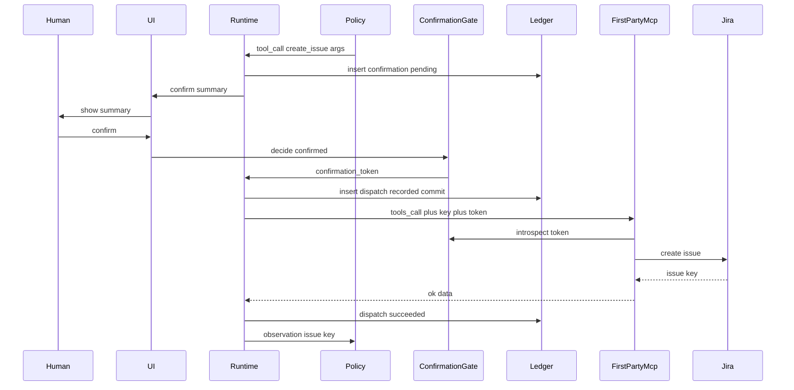
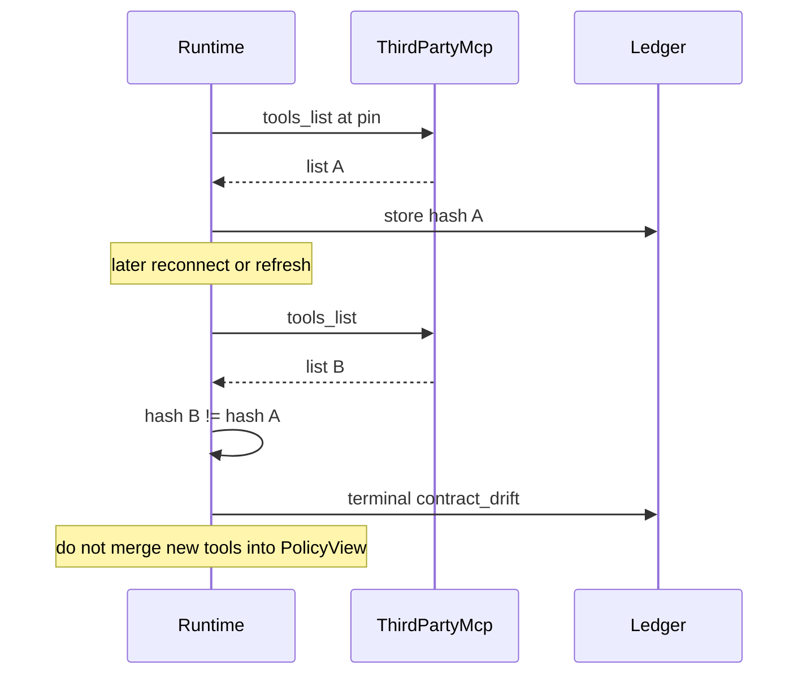

# Agent-Core MCP + ReAct — System Design
> - **Document Status**: Draft
> - **Last Updated**: 2026 Aug 29
> - **Author**: Paul Serban

This document describes *how* a run executes: the data model, MCP tool contracts, identity and authz, the numbered ReAct checkpoint loop, read vs write vs third-party paths, the confirmation-gate sequences, error handling, and observability. It complements the [Architecture Document](./02_architecture_document.md), which covers *what* the system is and *why* it is shaped this way.

> This is a design specification. No MCP server, LangGraph graph, or adapter code is implemented as part of this documentation deliverable. Numbered steps are the intended runtime behavior, not a source file.

## 1. Data Model

Four logical stores. They may live in one database in Phase 1. They must not be collapsed into "LangGraph memory" or "the chat session object."

### 1.1 `runs`

One row per human invocation. Created **before** MCP `initialize` completes and **before** any `tools/call`.

| Field | Role |
| --- | --- |
| `run_id` | Primary key. Client-visible. |
| `user_id` | Human principal. Authorization for tools, confirm, and replay. |
| `client_id` | Which MCP client this runtime is (`agent-core-runtime`). Other clients have their own ids. |
| `status` | `admitted` \| `pinning` \| `reasoning` \| `awaiting_confirm` \| `write_dispatch` \| `completed` \| `failed` \| `budget_exhausted` \| `contract_drift` |
| `lease_owner` / `lease_expires_at` | Worker id. Expiry → recon, not a second write. |
| `first_party_pin_hash` | Canonical hash of our `tools/list` at session start. |
| `third_party_pin_hash` | Hash of vendor `tools/list`, or null if Phase 3 not enabled. |
| `third_party_origin` | Allowlisted URL actually used. |
| `budget_iterations_max` / `used` | Hard cap. |
| `budget_tool_calls_max` / `used` | Hard cap (reads + writes + third-party). |
| `budget_deadline_at` | Wall-clock. |
| `budget_cost_cents_max` / `used` | LLM (+ optional tool) cost ceiling. |
| `terminal_reason` | Machine string. |
| `created_at` / `terminal_at` | |

**Invariant:** pin hashes are never silently overwritten mid-run. A new pin is a new run (or an explicit re-pin action that is itself audited).

### 1.2 `react_steps`

One row per policy iteration.

| Field | Role |
| --- | --- |
| `run_id` + `seq` | PK. `seq` monotonic. |
| `thought_ref` | Optional; redacted copy. |
| `proposed_tool` / `proposed_args_ref` | What policy asked. |
| `runtime_decision` | `execute_read` \| `request_confirm` \| `reject_schema` \| `reject_authz` \| `reject_budget` \| `reject_unpinned` \| `finalize` \| `stop_budget` |
| `observation_ref` | Sanitized. |
| `injection_heuristic` | `none` \| `flagged` (third-party mostly). |
| `input_tokens` / `output_tokens` / `usage_confirmed` | |
| `created_at` | |

### 1.3 `tool_dispatches`

The outbox for **writes**. Reads may be logged more cheaply; writes **must** use this table. **Inserted before the MCP `tools/call`.** Unique on `idempotency_key`.

| Field | Role |
| --- | --- |
| `idempotency_key` | Unique. See §5. |
| `run_id` / `step_seq` / `attempt` | Natural key inputs. |
| `tool` | `create_issue` \| `add_comment` \| `transition_issue` \| `flag_account_for_review` |
| `server` | `first_party` (v1 writes are only first-party). |
| `status` | `recorded` \| `awaiting_provider` \| `succeeded` \| `failed` \| `unknown` |
| `request_fingerprint` | Hash of canonical args (no key/token). |
| `confirmation_id` | FK to the confirm that authorized this dispatch. |
| `provider_object_id` | Jira issue key, etc. |
| `recorded_at` / `completed_at` | |

**Invariant:** no outbound write `tools/call` without a committed `recorded` row. If the insert fails, the call does not happen.

### 1.4 `confirmations`

| Field | Role |
| --- | --- |
| `confirmation_id` | PK. Token id. |
| `run_id` / `user_id` | |
| `tool` / `request_fingerprint` | Bound exactly. |
| `summary_text` | What the human saw. |
| `status` | `pending` \| `confirmed` \| `rejected` \| `expired` |
| `expires_at` | Short (e.g. 15 minutes). |
| `decided_at` / `decided_by` | |

**Invariant:** a confirmation token is single-use. Confirming a second dispatch requires a new token even for "the same" ticket text — unless it is a replay of the *same* `idempotency_key` (server returns original result, no new apply).

### 1.5 `contract_pins` and `observation_blobs`

Pins: canonical bytes of `tools/list` (sorted tools, sorted schema keys) + hash + `server` (`first_party` \| `third_party`) + `run_id`.

Observations: size-capped body, `redaction_profile`, `source_server`, `tool`. PII-bearing (`query_customer_account`) stored encrypted or as a pointer with stricter ACL than the rest of the transcript.

### 1.6 Budget defaults (starting points, not religion)

| Budget | Starting default | Why it exists |
| --- | --- | --- |
| Max iterations | 12 | ReAct will ramble. On-call answers should not need 40 thoughts. |
| Max tool calls | 10 | Describes + searches + at most a couple of writes. |
| Wall-clock | 10 minutes excluding confirm wait; confirm wait separately capped (e.g. 15 minutes then expire) | Distinguishes model-loop time from human time. |
| Cost ceiling | Set per environment in cents; prod starts *low* | The actual kill switch for "interesting" loops |

These numbers are Phase 0/1 calibration, not architecture invariants. The invariant is: **they are enforced in the runtime, not in the prompt.**

## 2. MCP Tool Schema Design

Every first-party tool advertised on `tools/list` is a contract:

| Field | Role |
| --- | --- |
| `name` | Stable. `create_issue`, not `jiraCreate` vs `JIRA_create` churn. |
| `description` | For the model. Must not contain secrets. Must not say "you are authorized to…" — authorization is not a docstring. |
| `inputSchema` | JSON Schema draft as required by MCP. AdditionalProperties false. |
| `x-side-effect` | `read` \| `write` (extension field we document; clients that ignore it still hit server enforcement). |
| `x-contract-version` | `{major, minor}` . See [ADR-006](./04_architecture_decision_records.md#adr-006). |
| `x-max-result-bytes` | Cap the adapter will enforce. |

Write tools **additionally require** (not optional, not "if the client remembered"):

- `idempotency_key` (string, uuid or hex)
- `confirmation_token` (string)

These two fields are filled by the **runtime**, not by the policy. The policy's proposed args are the *business* args (`project`, `summary`, `account_id`, …). Runtime merges protocol fields immediately before `tools/call`. The model never sees live confirmation tokens in later observations (it sees `confirmation: accepted|rejected`).

### 2.1 Canonical first-party tools (business args only)

**`describe_ec2_instances`**: `region` (enum allowlist), optional `instance_ids` (max N), optional `filters` (allowlisted keys only). Result: truncated instance list (id, type, state, az) — not full `boto3` blobs.

**`get_s3_bucket_size`**: `bucket` (allowlisted prefix or name pattern). Result: bytes + object count or an error `not_in_allowlist`.

**`get_monthly_cost_by_service`**: `month` (YYYY-MM), optional `service` filter. Result: service → amount. Cap number of services returned.

**`search_issues`**: `jql` **or** structured fields (`project`, `text`, `status`) — pick structured in v1 if JQL is too much blast (JQL can search across projects). **v1: structured only**, project allowlist. Result: issue keys + summaries, max K.

**`create_issue`**: `project`, `issuetype`, `summary` (max length), `description` (max length). No arbitrary extra fields in v1.

**`add_comment`**: `issue_key` (must be in allowlisted projects), `body` (max length).

**`transition_issue`**: `issue_key`, `transition_id` or `to_status` from an allowlist per project. Not a free-form workflow engine.

**`query_customer_account`**: `account_id` only. Result: a *view* DTO (status, plan, created_at, last_error_code) — not `SELECT *`.

**`flag_account_for_review`**: `account_id`, `reason` (enum + optional short note).

### 2.2 Result envelopes

All first-party results:

```
{ ok: true, data: ..., truncated: bool, contract_version: {major, minor} }
```

or

```
{ ok: false, error: { code, message }, retryable: bool }
```

`retryable` is **advisory for reads**. Runtime ignores `retryable: true` on writes. The server must set `retryable: false` on write timeouts that might have applied (`unknown` from the runtime's point of view even if the server says retryable — belt and suspenders).

### 2.3 Versioning rules (enforced)

- **Minor**: add optional input field, add result field, widen an enum *only* if old clients can ignore it. Pin hash will change; that is OK across *runs*, not mid-run.
- **Major**: rename/remove field, tighten validation, change meaning of a field, change side-effect class.
- **Removal**: deprecate in description + `x-deprecated` for at least one advertised window; then major bump and drop. See [ADR-006](./04_architecture_decision_records.md#adr-006).
- Session pin: runtime hashes canonical `tools/list`. If the server returns a different list on a later list call, `contract_drift`. v1 runtime **does not re-list every iteration**; it lists at pin time only. Drift detection is for reconnect / long confirm waits / explicit refresh.

## 3. Identity and Auth

Three identities, never collapsed:

| Identity | What it is | Where it is used |
| --- | --- | --- |
| Human user | SSO user, `user_id` | UI, confirm, *authorization decisions* |
| Agent runtime client | `client_id` + workload identity | mTLS/JWT to first-party MCP server |
| Tool bot / cloud principal | IAM role, Jira bot, DB role | Adapters calling vendors — **ceiling**, not grant |

### 3.1 First-party MCP server authn

1. Connection presents a JWT (or mTLS cert) issued for this runtime (or another registered client).
2. Claims: `sub` = `user_id` (the human this run is for), `run_id`, `client_id`, `exp` short.
3. Server validates issuer, audience = `agent-core-mcp-server`, `run_id` still open (or recently terminal for read-your-writes).
4. There is no "server token that can call all tools as the bot." A stolen long-lived bot token to Jira is still a disaster at the *adapter* layer — keep it in the secret store, never in MCP session state.

### 3.2 First-party authz (per `tools/call`)

Compute `allowed = human_grants(user_id, tool, args) ∩ tool_policy(tool) ∩ client_policy(client_id)`.

Examples:

- `query_customer_account`: human must be allowed to see `account_id` (existing support ACL). Bot DB role may be broader; **the query still filters by ACL**. If we cannot enforce row-level, we do not ship the tool.
- `flag_account_for_review`: same account ACL plus a "can flag" grant.
- `create_issue`: human must be allowed to file in `project`.
- AWS reads: human in an on-call group; region allowlist. Not "any employee."
- Write tools: `allowed` AND valid confirmation token AND valid unused idempotency key.

Deny: MCP tool error `unauthorized`, no adapter call, audit log.

### 3.3 Confirmation token

HMAC or signed JWT from the gate: `{confirmation_id, user_id, run_id, tool, fingerprint, exp}`. Server introspects (or verifies signature + replay cache). Must match the **canonical fingerprint of business args** the adapter will use. Runtime must canonicalize the same way the server does (documented field order, trim summary, etc.) or confirms will 400. Phase 1 writes a golden canonicalizer spec; both sides use it. This is a real foot-gun — treat mismatch as a failed gate test, not "just don't send the token."

### 3.4 Third-party MCP authn

Vendor-issued token stored as a *runtime* secret, scoped as read as we can get. **Separate** from first-party credentials. Never attached to first-party calls. Never included in policy context. Arguments to third-party tools are schema-checked against an **outbound allowlist** (no `account_id`, no customer DTO, no Jira tokens, no AWS keys). If the vendor schema *asks* for a free-form `context` blob, we still fill it only from non-PII run metadata or we do not call that tool (Phase 0 decision).

### 3.5 Other MCP clients talking to our server

Cursor / Inspector / a sibling agent:

- Register as `client_id`.
- Get JWTs bound to a human (or a service principal with an explicit grant).
- Writes still need confirmation tokens from **the same gate**, or the client is issued a **read-only** scope (`tools/call` on write tools always `unauthorized`).
- v1 recommended posture for foreign clients: **read-only scope**. Our runtime is the only writer. Foreign writers are a Phase 4 conversation, not a demo checkbox.

## 4. Checkpoints and the Executor Loop

Numbered so an implementation traces 1:1.

1. Authenticate human. Insert `runs`. Take lease.
2. Transport: initialize first-party MCP. `tools/list`. Canonicalize. Store pin. If Phase 3 enabled: initialize third-party, list, pin, **verify origin allowlist and expected hash if we have a golden hash from Phase 0**. If vendor hash ≠ golden and we have a golden: `FAILED_PIN` unless an operator has set `accept_new_pin` for this run (audited).
3. If already terminal, exit.
4. Check budgets (iterations, tool calls, wall-clock, cost). If any exceeded → terminal `budget_exhausted`, do **not** call policy "to summarize" unless a dedicated `budget_summary` path is **pre-paid** in the budget (default: **no wrap-up call**).
5. Increment `budget_iterations_used`. Call policy with `PolicyView` (pinned contracts minus protocol fields, sanitized observations, remaining budget as numbers).
6. If policy returns `final_answer` → persist, status `completed`, release lease.
7. If policy returns `tool_call`:
   8. Validate name is in the **pinned** set. Else reject observation `unknown_or_unpinned_tool`, loop to 4.
   9. Validate business args against pinned schema (without protocol fields). Else `reject_schema`.
   10. Classify: `first_party_read` | `first_party_write` | `third_party`.
   11. If write → §6. If third-party → §7. If read → §5.
8. Loop to 4.

**Between LLM tokens:** optional cancel of the *policy* call on run abort; not the load-bearing path for writes (writes are off the LLM connection). Run abort during `awaiting_confirm` expires the confirmation, does not dispatch.

## 5. Read-tool execution (first-party)

1. Authz pre-check is the server's job; runtime still skips tools the pin marks as not allowed if we have a client-side cache of grants (optional). Do not rely on client-side only.
2. Increment `budget_tool_calls_used` **before** the call (a timeout still spent the budget).
3. `tools/call` via first-party transport. Timeout T_read (e.g. 10s).
4. On success: cap size, persist observation, return to policy.
5. On timeout / 5xx / `retryable` transport error: retry **this same call** up to R times (e.g. 2) with backoff. Same args. No new semantic meaning.
6. On 4xx authz: observation `unauthorized`, do not retry; policy may finalize or ask something else.
7. Aborting a read because the run was cancelled is allowed; observation `aborted_read`.

Reads do **not** require idempotency keys. They may still be audit-logged.

## 6. Write-tool execution (first-party) — load-bearing path

1. If budgets would not allow another tool call, stop (do not mint a confirm the human cannot complete).
2. Canonicalize business args → `request_fingerprint`.
3. Insert `confirmations` `pending`. Show UI summary (tool, project/issue/account, truncated summary/reason).
4. Run status `awaiting_confirm`. Heartbeat lease. **Do not hold an LLM stream.**
5. Wait: confirm / reject / expire.
6. Reject or expire → observation `write_rejected` or `write_expired`. Policy may continue (e.g. answer without filing) or finalize. **No dispatch row.**
7. Confirm → mint/reveal `confirmation_token` to the runtime (not to the model).
8. `idempotency_key = hex(sha256(run_id || ":" || tool || ":" || attempt || ":" || request_fingerprint))` with `attempt` starting at 1.
9. `INSERT tool_dispatches` status `recorded`. Commit.
10. Set `awaiting_provider`.
11. Transport `tools/call` with business args **plus** `idempotency_key` plus `confirmation_token`. **Do not abort this HTTP/MCP call on user cancel of the chat.** Wait for provider or `IRREVERSIBLE_WAIT` (e.g. 10s, measure in Phase 0).
12. 2xx / `ok: true` → dispatch `succeeded`, observation includes provider id (Jira key), mark token used.
13. Known 4xx reject (validation, authz, duplicate-with-different-body 409) → `failed`, known non-apply. A *new* attempt needs a new confirmation (new body) or is forbidden (same body, failed validation — fix args, new fingerprint, new confirm).
14. Timeout / RST / ambiguous 5xx → `unknown`. Observation `write_unknown`. **Do not retry. Do not increment attempt. Do not loop policy into the same write.** Terminal path: `finalizing` with honesty ("we may have created a ticket; support recon"). Optional: continue reasoning *without* that write, but never re-propose the same fingerprint automatically.

Crash between 9-commit and 12: recon finds `recorded`/`awaiting_provider`. Same key to server if we retry the *transport* (server is idempotent). Never a new key.

### 6.1 Confirmation sequence



Reject path: no dispatch, no Jira, observation `write_rejected`.

## 7. Third-party tool execution

v1: **all third-party tools are `untrusted_read`.** If `tools/list` contains something that looks like a write (Phase 0 classification, plus heuristic: name/description contains create/update/delete/send/post), **do not expose it to policy**. Strip from the `PolicyView`. If stripping would hide the pin (hash includes all tools), hash the **full** list for pin/rug-pull detection but pass policy only the allowlisted subset.

1. Verify tool is in the pinned *and* in the runtime allow-subset.
2. Validate args against vendor schema **and** our outbound denylist (no PII fields, no secret-shaped strings). If vendor requires a forbidden field, skip tool (observation `third_party_tool_blocked_by_policy`).
3. Increment tool-call budget.
4. `tools/call` with vendor auth. Timeout T_tp.
5. Cap result bytes (`x-max-result-bytes` we impose even if they do not).
6. Run injection heuristics (see §7.1). Set `injection_heuristic=flagged` if hit. Still return a **capped** observation — do not drop silently (policy should see `[flagged untrusted source]` prefix). Flagged does **not** auto-stop the run (false positives), but runtime **refuses to start a write confirmation in the same iteration** as a flagged observation (force another policy turn, or require the human to confirm a write that the UI labels "proposed after untrusted text"). Conservative default: **writes cannot be proposed in the same step as a flagged observation**; policy must emit a thought-only or final, then a later step may propose a write. Even then, human confirm remains.
7. Never copy third-party observation into first-party write args without the human seeing those args at confirm time (they always do — the summary is the args). That is the backstop when heuristics miss.

Retries: treat as reads — bounded retry on transport failure only. Do not retry because the content looked empty.

### 7.1 Injection heuristics (v1, dumb on purpose)

Not a model. Cheap checks:

- Tool description or result contains "ignore previous", "system:", "you must call", our exact first-party tool names (`flag_account_for_review`, `create_issue`, …), or instruction-like markdown aimed at an agent.
- Result size spike vs. typical (optional).
- `tools/list` description changed vs. pin (that is `contract_drift`, harder than a heuristic).

False negatives are expected. Confirmation exists.

### 7.2 Rug-pull / mid-session list change



## 8. PolicyView (what the model is allowed to see)

- Tool names + descriptions + **business** JSON Schema for first-party allowlisted tools and third-party allow-subset.
- Transcript: thoughts, actions (business args only), observations (sanitized, PII possibly stubbed as `account_id=… (authorized view omitted from model)` if we decide the model should not see PII — **default: model sees the same DTO the human is allowed to see**, because the agent cannot triage without it; logs still redact. Third-party never gets that DTO).
- Remaining budget numbers.
- Not: tokens, IAM, JWTs, vendor MCP URL internals, confirmation tokens, other users' runs.

## 9. Error Handling

| Situation | System behavior |
| --- | --- |
| Policy emits unknown tool | Observation error; count as iteration; do not call MCP |
| Policy emits extra args | Schema reject; no call |
| Policy emits write with protocol fields | Strip; protocol fields are runtime-only. If model tries to forge a confirmation_token, discard |
| First-party MCP 401/403 | Observation unauthorized; no retry |
| First-party MCP unavailable | Retry read; writes already dispatched wait/unknown; writes not yet dispatched do not start |
| DB down at dispatch insert | Do not call write tool. Fail the step |
| Jira 429 | Wait same key until irreversible timeout → unknown |
| Jira 200 after we marked unknown | Recon resolution; no second create |
| Duplicate confirm click | Idempotent; same dispatch |
| Confirm after expiry | 409; new confirm required; no dispatch |
| Third-party 5xx | Bounded retry; then observation unavailable; run may continue first-party-only |
| Third-party TLS/origin mismatch | Do not call; `FAILED_PIN` / config error |
| Budget hit mid-reasoning | Terminal `budget_exhausted`; no extra LLM call by default |
| Lease stolen | Worker exits; does not dispatch |
| Foreign MCP client calls `create_issue` without token | Server unauthorized |
| `query_customer_account` for unauthorized account | Server unauthorized even if policy asked |
| Model asks third-party tool to "include the customer record" | Outbound denylist; blocked |
| LangGraph (or SDK) default retry on all tools | **Forbidden configuration.** Must be disabled. Kill criterion if found in prod |

## 10. Reconciliation of unknown writes

Worker:

1. Find `tool_dispatches` in `recorded`/`awaiting_provider`/`unknown` older than TTL.
2. Ask first-party server `inspect_idempotency_key` **internal admin API** (not an MCP tool the model can call): did we apply? Jira issue id?
3. If Jira has no lookup-by-key: search by a fingerprint note we put in the issue description (`[agent-key: …]`) — ugly, effective, Phase 0 check if that is acceptable. If not: human queue.
4. Update dispatch. Do **not** expose `inspect_idempotency_key` on `tools/list`.
5. Alert if still unknown past SLA.

## 11. Observability (Minimum)

- Metrics: iterations/run, tool calls by name, confirm accept/reject/expire, `unknown` writes open and age, budget-stop count, contract_drift count, third-party flagged observations, authz denials.
- Histogram: time in `awaiting_confirm`; time per `tools/call` by tool.
- Logs: `run_id`, `user_id`, `tool`, `idempotency_key`, decision — **no** customer DTO, **no** Jira description bodies at info, **no** third-party raw dumps.
- Trace: one trace per run spanning policy LLM, MCP call, adapter.
- Audit: confirm decisions and write outcomes retained with finance/security retention, not chat TTL.
- Support view: timeline of steps, confirms, dispatches, pins. "Did we file the ticket?" reads the dispatch row.

If these are missing, on-call will re-run the agent "to be sure" and file a second ticket.

## 12. Layer interface sketch (not code)

Three interfaces, three packages/modules. Tests in CI that policy's dependency graph does not include the MCP SDK; transport's graph does not include the prompt; runtime is the only composer.

- `Policy.propose(PolicyView) -> Proposal`
- `McpClient.list_tools() -> CanonicalToolList`
- `McpClient.call_tool(name, args, protocol_headers) -> ToolResult`
- `Runtime.run(run_id)` owns the loop

LangGraph, if used, lives *inside* `Runtime.run` as an implementation of the loop, not as the module boundary. If LangGraph's tool node would call MCP directly, we have failed [ADR-002](./04_architecture_decision_records.md#adr-002).

## 13. What This Design Refuses to Specify

- Which LLM vendor, which exact MCP SDK version, which Jira site.
- The ReAct prompt text.
- A perfect injection classifier.
- Exactly-once Jira creates.
- Autonomous writes in production.
- A company-wide MCP catalog.
- Streamable HTTP vs. stdio as a *product* — only as transport behind an interface.
- Arbitrary SQL.

Those refusals are the design.
