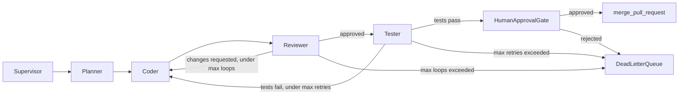

# Multi-Agent Orchestration Platform: Scenario and Requirements
> - **Document Status**: Draft
> - **Last Updated**: 2026 Aug 29
> - **Author**: Paul Serban

## Problem Statement

A user (or a triaging maintainer) submits a well-scoped GitHub issue. The platform runs a graph of specialized agents:

1. **Supervisor** — owns the run, advances nodes, holds the lease, never calls tools itself except to enqueue work and to write checkpoints.
2. **Planner** — LLM call that produces a structured plan (files, approach, risks). No write tools.
3. **Coder** — explores the repo, commits to a branch, opens a pull request. Side-effecting.
4. **Reviewer** — reads the diff, either requests changes (loop back to Coder) or approves. May post a review comment.
5. **Tester** — triggers CI against the PR, waits for a result, either loops back to Coder or proceeds.
6. **Human Approval Gate** — a durable wait. Only a human can authorize merge.
7. **Merge** — `merge_pull_request`. Irreversible. Never an agent identity.

The graph will crash, time out, get retried, and loop. The design must answer, concretely:

1. How a node’s progress is checkpointed so a restart does not re-enter work that already happened in the world.
2. How a side-effecting tool call (`open_pull_request`, `trigger_ci_run`, `notify_slack`, `merge_pull_request`) is recorded *before* it is issued, and how a retry of the same attempt does not fire it again.
3. How retries, backoff, and loop counters are bounded, and what happens when they are exhausted (dead-letter queue — not silent retry, not a second PR “to be sure”).
4. How agents talk to each other without sharing a single unbounded context window, and without treating another agent’s output as a system-prompt override.
5. How per-agent tool permissions are enforced so the Reviewer cannot merge, the Tester cannot push, and the Coder cannot merge.
6. How every LLM call and every tool call is traced so “did we open a second PR?” is a query, not a grep.

This is the **retry-after-partial-failure duplicate-side-effect trap**. The naive answer — persist graph state after the node *finishes*, retry the node on crash, trust LangGraph’s checkpointer / a Redis stream offset / the LLM’s “I already opened PR #412” — is the failure. It treats a distributed workflow of LLM calls and third-party APIs as if node completion and world mutation were the same event. **They are not.** A GitHub 201 and our checkpoint commit can be separated by a process death. Closing the gap with “the agent will remember” is how you ship two PRs, two CI runs, two Slack pings, and a merge you cannot explain.

The correct shape is: **a multi-agent graph is a workflow engine. Every node transition is a durable checkpoint. Every side-effecting tool call is an outbox row written before the HTTP call. Resume is replay of the ledger, not re-execution of the world.**

That sentence is the whole architecture. Everything else in this project is the honest cost of making it true when four agents, a message bus, and three vendors can fail independently.

## The Trap, Stated Directly

“Retry the failed node” in a graph framework is a *request to re-enter a function*. It is not a distributed transaction. There is no two-phase commit between:

- the supervisor process,
- the Coder worker,
- the checkpoint store,
- the message bus offset,
- GitHub (branch / commit / PR),
- CI,
- Slack,
- and a human who may already have seen PR #412.

Those are independent systems with independent clocks. The PR 201 and the checkpoint commit can arrive in either order. No amount of careful coding on *our* side can make GitHub and Postgres commit atomically. Designing as if they can is how you ship a “resumable agent graph” that sometimes opens a second PR, then a support ticket that says “why are there two drafts,” then an engineer who “fixes” it by asking the model whether it already opened a PR — which is how you get a *third* PR when the model is wrong.

The load-bearing distinctions:

| What people think resume/retry does | What it can actually do |
| --- | --- |
| Continue from where the agent left off | Re-enter a node from the last *durable* checkpoint |
| Skip work the model “already did” | Skip work that has a dispatch row with a known outcome |
| Undo a bad coder turn | Start a *new* attempt with a *new* key, or dead-letter — never silently re-fire the same key with a different body |
| Mean the world matches the graph state | The world may be ahead of the checkpoint (PR exists, row does not) or behind it (row says succeeded, GitHub 500’d) |
| Be exactly-once | At-least-once with idempotency keys. That is the ceiling. |

A hard kill of the Coder worker, or an automatic “retry the whole graph from Planner,” converts a known in-flight `open_pull_request` into an **unknown outcome**. Unknown is more expensive to operate than “we waited 800ms and GitHub said 201.” See [ADR-001](./04_architecture_decision_records.md#adr-001), [ADR-002](./04_architecture_decision_records.md#adr-002), and [ADR-003](./04_architecture_decision_records.md#adr-003).

This project is the sibling of [prj--agent-pipeline-cancellation](../../prj--agent-pipeline-cancellation/README.md). That project’s trap is **cancel vs. an in-flight email**. This project’s trap is **retry vs. an already-applied tool call**, multiplied across a graph of agents. The spine is the same: ledger-then-act, unknown is a real state, the bus/stream is not the source of truth.

## Current State (Assumed Starting Point)

A typical first version of a “multi-agent platform” looks like:

1. A LangGraph (or similar) graph in one process: Supervisor node → Planner → Coder → Reviewer → Tester → “HITL” as a blocking `input()`.
2. Tools are Python functions the model can call. `open_pull_request` is a GitHub SDK call inside the Coder node. No dispatch row. The checkpointer snapshots node state *after* the node function returns.
3. On crash, the framework resumes from the last checkpoint, which is “Coder not yet complete.” Coder runs again. The model, or the node code, calls `open_pull_request` again.
4. Retries are “the supervisor asks the planner to try a different approach,” which is a *new* plan that does not know the first PR exists.
5. HITL is a Slack message with two emoji reactions. If the worker dies while waiting, the reaction is lost and a new message is posted. Two humans approve two different PRs.
6. Observability is LangSmith / stdout. “Did we open two PRs?” is answered by searching GitHub.

That version will appear to work in a demo: the happy path is one PR, one CI run, one approval. It will fail in production the first time:

- Coder’s `open_pull_request` returns 201, the process dies before the checkpointer writes,
- Tester’s `trigger_ci_run` is not idempotent and a retry starts a second workflow that fights the first,
- Reviewer↔Coder loop has no cap and burns the token budget rewriting the same comment,
- a bus redelivery re-runs a node that already succeeded,
- the human approved PR #412 and the graph merged PR #413 because resume created a sibling.

This project documents the replacement, not a patch of that checkpointer.

## Concrete Graph Used Throughout These Docs

One task, one product-shaped example, so the sequences are not abstract. The architecture is the same if the Coder’s irreversible tool is “create Jira ticket” or “deploy to staging”; only the compensation story and the HITL placement change.

| Node | Side-effect class | Tools (this scenario) | Billable? | Re-enter on resume without a dispatch ledger? |
| --- | --- | --- | --- | --- |
| Planner | None (LLM text). Output consumed by Supervisor. | None | Yes — tokens | Harmless-ish: extra tokens, maybe a different plan. Not the incident. |
| Coder | **Mixed.** Reads are safe. `create_branch`, `commit_and_push`, `open_pull_request` are writes. | `read_file`, `grep_code`, `create_branch`, `commit_and_push`, `open_pull_request` | Tokens + GitHub | **Incident.** Duplicate branch names may 422 (lucky). Duplicate commits are duplicate CI. Duplicate PRs are the screenshot. |
| Reviewer | Write: `post_review_comment`. Approve is a graph signal, not a GitHub merge. | `read_file`, `fetch_pr_status`, `post_review_comment` | Tokens + comment | Duplicate review comments. Annoying, visible, usually not catastrophic. |
| Tester | Write: `trigger_ci_run`. | `fetch_pr_status`, `trigger_ci_run` | CI minutes | Duplicate workflows; flaky tests get worse; cost. |
| HITL | None until a decision is recorded. The *wait* must be durable. | None (human writes `hitl_approvals`) | Human time | Re-prompting the human is a second Slack message. Two approvals for two PRs is the incident. |
| Merge | **Irreversible.** | `merge_pull_request` (invoked by the gate after approval, not by an agent) | — | **Incident.** Double-merge is usually a 405/409 if GitHub is kind. Do not rely on kindness. |
| Notify | Write. | `notify_slack` (optional, on terminal states) | Per message | Duplicate pings. Same trap as email in the cancellation project. |

Read-only tools (`read_file`, `grep_code`, `fetch_pr_status`) may be retried freely. Side-effecting tools may not.

Failure and retry points that the design must name:

| Where it fails | What a naive retry does | What this design does |
| --- | --- | --- |
| Planner LLM 429 | Re-call planner | Backoff; new attempt; no tools |
| Coder crash after `open_pull_request` 201, before checkpoint | Coder re-enters, opens PR #413 | Dispatch row exists; same key; no second POST; checkpoint catch-up |
| Coder timeout on `open_pull_request` | Assume fail, retry with new body | `unknown`; reconcile; do not increment attempt |
| Reviewer comments, then worker dies | Second comment on resume | Same-key no-op or skip if dispatch succeeded |
| Tester triggers CI, crash before recording run id | Second workflow | Same-key / lookup by fingerprint |
| HITL Slack message lost on restart | New Slack message, two buttons | Durable `hitl_approvals` row; at most one open request per run |
| Bus redelivers “enter Coder” | Second Coder worker | Lease on `run_id`; second worker aborts |
| Max Reviewer↔Coder loops | Infinite rewrite | DLQ with the last PR link |
| Human rejects | Graph stalls or planner retries merge | Terminal `rejected`; DLQ; no merge |

## Target Users

- **Owning engineer**: implements the supervisor and the tool adapters; needs a state machine they can defend when two PRs exist.
- **On-call / agent-ops**: needs to answer “did we open a PR / trigger CI / merge?” from the dispatch ledger, not from GitHub search. `unknown` must be a first-class, alertable state.
- **Reviewing engineer (HITL)**: needs one approval request per run, a link to *the* PR, and a guarantee that approving does not merge a sibling PR created by a retry.
- **The end user / issue reporter**: needs one draft PR or an honest “we could not finish,” not a swarm of drafts.
- **Tool owners** (GitHub, CI, Slack): need this system not to retry a write just because a worker crashed.

## Architecturally Significant Requirements

These are the requirements that *shape* the architecture. Ordinary product requirements (which model, the plan schema, the review rubric) are out of scope.

1. **The graph is a durable state machine, not an in-memory traversal.** Every node entry and every node completion is a checkpoint keyed by `run_id`. A restarted supervisor must not start a node whose successor work is already recorded. See [ADR-001](./04_architecture_decision_records.md#adr-001).
2. **Side-effecting tool calls are dispatch-first and idempotent on retry, not undoable on failure.** Every dispatched tool call carries `idempotency_key = hash(run_id, node_id, attempt, tool, request_fingerprint)`. The ledger is **shared across agents** — Coder and a “helpful” Supervisor retry must not mint different keys for the same user-visible write. See [ADR-002](./04_architecture_decision_records.md#adr-002).
3. **Checkpoint ordering closes the duplicate-PR window.** Tool outcome is committed to the dispatch ledger *before* the node is allowed to checkpoint as complete *or* to call the LLM again. Resume reads the ledger first. See [ADR-003](./04_architecture_decision_records.md#adr-003).
4. **Retries are bounded, classified, and observable.** Transient failures backoff. Permanent failures and exhausted loop counters go to a DLQ. There is no infinite Reviewer↔Coder loop. See [ADR-004](./04_architecture_decision_records.md#adr-004).
5. **Per-agent tool permissions are a capability boundary, not a prompt.** Planner has no write tools. Reviewer cannot push or merge. Tester cannot push or merge. Merge is invoked only by the HITL gate after a durable approval. See [ADR-005](./04_architecture_decision_records.md#adr-005).
6. **Each agent receives a scoped, summarized context slice, not the full shared transcript.** Supervisor holds full task state. A message from Reviewer to Coder is labeled data, not an instruction override. See [ADR-006](./04_architecture_decision_records.md#adr-006).
7. **HITL is a durable gate with a timeout, not a blocking stdin.** Approval is a row. Restart does not re-ask. Timeout is a documented policy (escalate / DLQ / expire), not a hang. See [ADR-007](./04_architecture_decision_records.md#adr-007).
8. **The message bus is transport. The database is the system of record.** Bus redelivery is expected. Exactly-once bus semantics are not assumed. See [ADR-008](./04_architecture_decision_records.md#adr-008).
9. **Unknown is a real state, resolved by reconciliation, not by optimism.** A call interrupted with no ACK is `unknown` until a worker (or a human) determines whether the provider accepted it. The graph does not proceed to HITL-merge as if the PR were a known fact.
10. **Every LLM call and every tool call is traced** with `run_id`, `node_id`, `attempt`, `idempotency_key` (when applicable). Duplicate-dispatch rate is a first-class metric. See [Observability](./06_observability_and_evaluation_framework.md).

## Success Criteria for the Design (Not Implementation Metrics)

1. Happy path: one plan, one branch, one PR, one CI run, one HITL request, one merge (if approved). Dispatch ledger shows one row per side-effecting tool that fired.
2. Crash after `open_pull_request` 201, before node checkpoint: resume does not POST a second PR; catch-up checkpoint; graph continues with the recorded PR number.
3. Timeout on `open_pull_request`: step/dispatch `unknown`; no new attempt; no HITL; reconciliation or human; never “retry with a new title to be safe.”
4. Bus redelivery of “enter Coder” while a lease is held: second worker no-ops.
5. Reviewer requests changes twice, then approves: at most `MAX_REVIEW_LOOPS` coder re-entries; comments are keyed; loop 4 goes to DLQ with the PR link.
6. Tester crash after CI trigger: at most one workflow for that attempt key; Tester waits or looks up.
7. HITL worker restart: the human sees the original request (or a link to it), not a duplicate Slack message with a second approve button that merges a different SHA.
8. Two supervisor replicas: one lease, one graph walker. The unique idempotency key is the backstop, not the primary fuse.
9. Agent-ops can answer “how many PRs did this run open?” from the ledger. The answer is 0 or 1 for `open_pull_request` in this scenario. If it is 2, that is an incident, not a metric to average.

## Business Rules (Graph-Scoped)

1. Resume is replay of the ledger. It is not permission to call a write tool again.
2. A 2xx (or equivalent success) from a side-effecting tool is durable truth, even if the node later fails or the run is dead-lettered.
3. Idempotency keys are derived by this system and sent to the tool provider when the provider supports them. When the provider does not, the local dispatch ledger is the only guard — and it cannot prevent a double write if we never recorded the dispatch. Record *before* the HTTP call. See [System Design](./03_system_design.md).
4. A new `attempt` is allowed only after a *known non-apply*. Timeouts stay `unknown` and block a new attempt until reconciliation.
5. A new user action (re-run the issue, “try again”) is a new `run_id` and therefore new keys. That *may* open a new PR. The UI/ops contract must say so. Re-running is not resume.
6. Automatic compensating actions (close the extra PR, cancel the extra CI, delete the Slack message) are **opt-in per tool**, never default, never silent. Closing “the duplicate” is how you close the *real* PR if the ledger is wrong. See [Trade-offs](./07_tradeoffs_and_honest_assessment.md).
7. Merge happens only after a HITL row in state `approved` for *this* `run_id` and *this* `pr_number` (and preferably this `head_sha`). Approving run A must not merge run B’s PR.
8. `MAX_REVIEW_LOOPS` and `MAX_TEST_RETRIES` are configuration with defaults (3 and 2 in these docs). Raising them is a product decision, not a retry-policy leak.

## Non-Goals

- **Not a general multi-tenant agent mesh / “agent OS.”** One graph shape, one task type (issue → PR), four specialist agents plus supervisor. Fan-out to N arbitrary agent types, agent-to-agent negotiation protocols as a product, and marketplace tools are out. Parallel tool calls inside a node multiply the race; v1 Coder is sequential tools.
- **Not exactly-once across GitHub, CI, and Slack.** At-least-once with idempotency keys is the ceiling. Claiming more is a lie.
- **Not a generic saga / undo framework.** Compensating actions, if any, are per-tool and explicit. A framework that “closes the PR on graph failure” is how you close a PR a human is already reviewing.
- **Not unbounded autonomy.** Reviewer↔Coder and Tester↔Coder loops are capped. HITL is mandatory before merge. This is not AutoGPT with a bus.
- **Not an implementation.** No LangGraph code, no FastAPI services, no Docker Compose, no Redis/SQS clients. Numbered steps and diagrams only. The stack in the scenario brief (LangGraph, FastAPI per agent, Compose/k8s, Redis/SQS) is a *shape*, not a mandate that those libraries dissolve the trap. See [ADR-001](./04_architecture_decision_records.md#adr-001) and [Trade-offs](./07_tradeoffs_and_honest_assessment.md).
- **Not a claim that LangGraph’s checkpointer is sufficient.** A checkpointer that snapshots after the node function returns is exactly the bug. If we use LangGraph, we still own dispatch-first inside every tool adapter.
- **Not a promise that this is cheap.** The honest alternative — one process, in-memory graph, hope — is cheaper and will survive a demo. This design is justified when side-effecting tools are in the graph *and* retries/resume are required *and* duplicate writes are expensive. It is overkill for a read-only research graph with no tools. That distinction is load-bearing; see [Trade-offs](./07_tradeoffs_and_honest_assessment.md).
