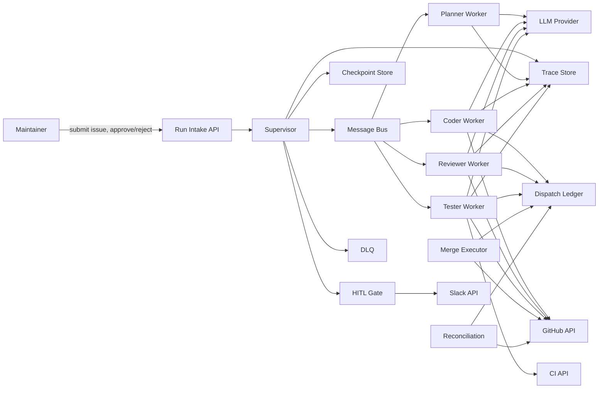
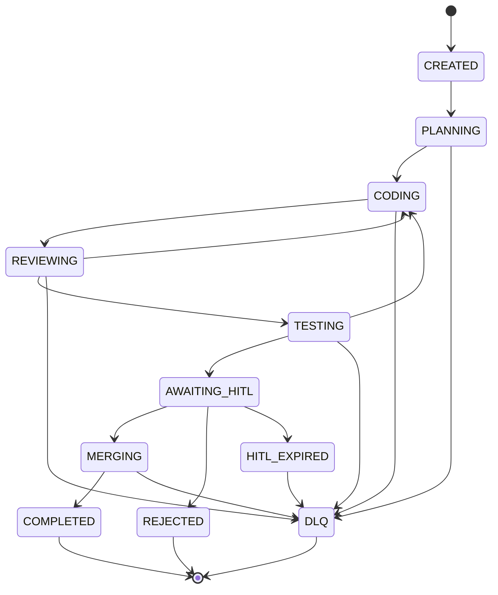

# Multi-Agent Orchestration Platform — Architecture Document
> - **Document Status**: Draft
> - **Last Updated**: 2026 Aug 29
> - **Author**: Paul Serban

A graph of specialized agents (planner, coder, reviewer, tester) coordinated by a supervisor, communicating over a message bus, with scoped tools, durable checkpoints, retries, a DLQ, and a HITL gate before merge. The system treats resume as replay of a ledger, records every side-effecting tool call *before* it is issued, and refuses to pretend that a crashed node can be safely re-entered if GitHub already returned 201. This document covers *what* the system is and *why* it is shaped this way; see [System Design](./03_system_design.md) for *how* the node loop, keys, and sequences actually work, and [Trade-offs and Honest Assessment](./07_tradeoffs_and_honest_assessment.md) for what this complexity does not buy.

## Overview

**Brief description**: Control plane for one issue-to-PR graph. Not an agent OS, not an LLM gateway, not a generic workflow product sold as a platform. The scarce resource under retry is *truth about what already happened in GitHub/CI/Slack*, not GPU.

**Business Context**
- See [Scenario and Requirements](./01_scenario_and_requirements.md) for the full framing. In short: a multi-agent graph is a workflow engine in costume; retry is not rollback; a second PR is the incident.
- Current state: in-process graph + post-node checkpointer + tools as SDK calls. That coupling is the defect.
- Desired future state: a durable run with per-node checkpoints, a shared tool-dispatch ledger, isolated agent workers with scoped tools, a bus used as transport, a HITL row, a DLQ, and traces that outlive the workers.
- Target users: owning engineer, agent-ops, HITL reviewer, issue reporter, GitHub/CI/Slack owners.

## Requirements

### Functional Requirements

- **Run lifecycle**: the system must create a durable run record before any LLM or tool call is issued, take a lease, and refuse to run a second walker for the same `run_id`.
- **Checkpoint ledger**: each node visit is a row (`pending → running → {succeeded, failed, skipped, unknown, dead_lettered}`). Re-entry of a node is a new *visit* with an explicit attempt/loop counter, not a silent overwrite.
- **Tool dispatch**: before any HTTP call to a side-effecting tool, the adapter writes a dispatch record with the idempotency key. Then it calls. Then it records the outcome. That order is the feature. Shared across agents.
- **Supervisor**: the only component allowed to *start* a node. Agents never enqueue the next node themselves as a side effect of a tool; they return a result; the supervisor checkpoints and routes.
- **Message bus**: delivers work envelopes to agent workers. Redelivery is expected. Duplicate envelopes are fenced by the lease and the dispatch ledger.
- **HITL**: a durable approval request bound to `run_id` + `pr_number` (+ `head_sha`). Timeout policy is explicit. Restart does not create a second request.
- **DLQ**: exhausted loops, unknown-unresolved past SLA, HITL reject, and permanent tool failures land here with the last known PR/CI links. No automatic re-drive that mints new keys.
- **Terminal honesty**: ops and the HITL UI can see whether a PR exists, whether CI ran, whether merge happened — from the ledger.
- **Tracing**: every LLM and tool call is a span. Duplicate-dispatch is a metric at ~0.

### Non-Functional Requirements

**Performance Requirements:**
- Interactive human-paced runs. Minutes to tens of minutes is normal (CI dominates). Checkpoint commit latency measured in tens of milliseconds is the correctness SLA, not token generation.
- HITL wait is hours, not milliseconds. The architecture must survive process restarts during the wait. That is why HITL is a row.

**Reliability Requirements:**
- **Crash after dispatch, before checkpoint** must not double-write. The dispatch row + key is the recovery handle.
- **Bus redelivery** must not double-execute a node.
- **Provider timeout** on an irreversible tool is `unknown`, not `failed`. Failed means “we know it did not happen” and is the precondition for a new attempt.
- **Idempotent HITL**: posting approve twice is a no-op after the first write.

**Infrastructure Constraints:**
- Technology *shape* (not an implementation mandate): HTTP/SSE or a small API for HITL and run intake; supervisor process(es) with leases; one worker pool per agent type (or one service per agent); a relational (or equivalently transactional) store for runs, checkpoints, dispatches, HITL, DLQ; a message bus (Redis Streams / SQS / equivalent) for work delivery; outbound HTTPS to LLM, GitHub, CI, Slack; an observability backend for traces.
- LangGraph is an acceptable *in-process* graph DSL **if and only if** tool adapters still dispatch-first and the checkpointer is not treated as a substitute for the dispatch ledger. FastAPI-per-agent is an acceptable isolation boundary. Neither library dissolves [ADR-002](./04_architecture_decision_records.md#adr-002).
- Secrets for LLM / GitHub App / Slack live in the existing secret store. Idempotency keys are not secrets.

**The defining constraint:**
- **Side effects in this graph are not transactional with our database.** GitHub’s 201 and our `tool_dispatches.status = succeeded` can be separated by a crash. Architecture that ignores that gap is a demo. Architecture that names the gap, records dispatch first, and reconciles unknown is the job.

## Executive Summary

The architecture is **Ledger-then-Act Graph Execution**. The supervisor is a state machine over durable rows. Agent workers are isolated, least-privilege executors of a single node visit. The bus delivers “please run node X for run Y visit Z.” Tools never get called “from the LLM” directly; they go through an adapter that owns the idempotency key. HITL is a wait state in the database. Billing/usage is a log (optional in v1; tokens still happen). Observability is a projector of the same ids.

**Architecture Style:** Orchestrated workflow (supervisor pattern) with isolated workers, outbox-style dispatch recording, and cooperative retry. Not a multi-agent “society.” Not “the LLM is the orchestrator.”

**Key Components:**
- **Run Intake / API**: creates the run, returns `run_id`.
- **Supervisor**: lease, route, checkpoint, loop counters, DLQ admission.
- **Agent Workers**: Planner, Coder, Reviewer, Tester — separate processes, scoped tools.
- **Message Bus**: work envelopes.
- **Checkpoint Store**: node visits.
- **Tool Dispatch Ledger**: the outbox.
- **HITL Gate**: approval rows + UI/Slack adapter that *writes the row*, not the merge.
- **Merge Executor**: only path that can call `merge_pull_request`, and only with a matching approval row.
- **Reconciliation Worker**: unknown and expired leases.
- **DLQ**: terminal-but-unfinished runs.
- **Tracing Store**: spans.

**Architecture Principles:**
- **Resume replays the past; it does not re-perform it.** The past is the ledger.
- **Record dispatch before the side effect.** If you cannot write the row, you do not open the PR.
- **Unknown is cheaper than a confident duplicate.**
- **Idempotency prevents duplicates; it does not implement undo.**
- **The bus is not the system of record.** The worker can vanish. The run cannot.
- **Capability, not prompting, bounds blast radius.** See [Security](./05_security_and_guardrails.md).
- **Shared state, isolated context.** Supervisor has the map. Each agent gets a slice.

**Key Architectural Decisions:**
1. Durable per-node checkpointing over in-memory graph state — [ADR-001](./04_architecture_decision_records.md#adr-001).
2. Shared dispatch-before-call ledger for every side-effecting tool — [ADR-002](./04_architecture_decision_records.md#adr-002).
3. Commit tool outcome before advancing the node — [ADR-003](./04_architecture_decision_records.md#adr-003).
4. Bounded retries + explicit DLQ — [ADR-004](./04_architecture_decision_records.md#adr-004).
5. Scoped per-agent tool permissions; only HITL-path can merge — [ADR-005](./04_architecture_decision_records.md#adr-005).
6. Isolated/summarized context per agent — [ADR-006](./04_architecture_decision_records.md#adr-006).
7. Durable HITL gate with timeout policy — [ADR-007](./04_architecture_decision_records.md#adr-007).
8. Bus is transport; DB is truth — [ADR-008](./04_architecture_decision_records.md#adr-008).

### Context Diagram

The LLM provider is “just another vendor”: we can retry a plan; we cannot un-open a PR. GitHub/CI/Slack are reached only through the Tool Adapter (drawn as worker→API edges). Merge does not originate in an agent worker.

## Runtime Architecture

1. **Admission**: maintainer (or an issue label) creates a run. Insert `runs` + initial checkpoint `planner/pending`. Supervisor takes a lease.
2. **Route**: supervisor writes a work envelope (`run_id`, `node_id`, `visit_id`, `attempt`, context snapshot ref) to the bus. Envelope is *not* authority to skip the ledger.
3. **Worker start**: worker re-reads lease + cancel/DLQ flags + existing dispatches for this visit. If the node visit is already `succeeded`, ack the bus message and exit.
4. **LLM + tools**: for each tool the model requests, if classified irreversible/write: insert dispatch, call, record outcome, emit a checkpoint of *tool progress* before the next LLM turn ([ADR-003](./04_architecture_decision_records.md#adr-003)).
5. **Worker finish**: persist node output (plan JSON, `pr_number`, review verdict, CI conclusion) to the checkpoint; ack bus.
6. **Supervisor advance**: apply routing table (reviewer changes → coder if loops remain; else DLQ; tester pass → HITL; HITL approved → merge executor).
7. **HITL**: supervisor inserts `hitl_approvals` (`open`), notifies human. Supervisor does **not** block in-process. A later poll/webhook marks `approved`/`rejected`.
8. **Merge**: merge executor checks approval row matches `pr_number`/`head_sha`, dispatch-first, merge, terminal.
9. **Reconciliation**: lease expiry, `unknown` TTL, bus poison messages → DLQ or lookup-by-key.

### Run state machine (supervisor-visible)

`REVIEWING → CODING` and `TESTING → CODING` increment loop counters. Hitting the max is `DLQ`, not another edge.

## Components

### 1. Run Intake / API
**Purpose**: Create runs and accept HITL decisions without owning graph logic.

**Responsibilities:**
- Authenticate the maintainer.
- Insert run + first checkpoint.
- `POST /runs/:id/hitl` (approve/reject) with `pr_number` and optional `head_sha` confirmation.
- Read-only run status for ops.

**What it must not do:** call GitHub, call LLMs, enqueue merge without a matching approval row (it writes the row; supervisor/merge executor acts).

### 2. Supervisor
**Purpose**: Be the only component allowed to start a node or admit a run to the DLQ.

**Responsibilities:**
- Lease the run.
- Interpret node outputs against the routing table and loop counters.
- Enqueue work envelopes.
- Insert HITL rows; enqueue merge only when the row matches.
- Heartbeat the lease while the graph is not in a wait state; during HITL the lease may be released or converted to a *wait lease* so another supervisor can expire HITL — pick one in System Design; do not leave HITL unowned and unexpired.

**What it must not do:**
- Call `open_pull_request` because the planner’s JSON said so. Planner output is a suggestion; Coder + adapter is the law.
- Treat “the model said the PR is #412” as the PR number. The dispatch row is the PR number.

### 3. Agent Workers (Planner, Coder, Reviewer, Tester)
**Purpose**: Execute one node visit with a closed tool set.

**Responsibilities:**
- Load scoped context (see below).
- Call the LLM. Stream traces.
- Invoke tools only through the adapter, and only tools in this worker’s allowlist.
- Return a structured result the supervisor can route on. Free-text “looks good” is not a routing signal; `verdict: approve | request_changes` is.

**Isolation:** separate processes (FastAPI services, or separate consumers). A Coder compromise (prompt injection that tries `merge_pull_request`) fails because the tool is not on the Coder client. See [Security](./05_security_and_guardrails.md).

### 4. Message Bus
**Purpose**: Deliver work. Absorb backpressure. Enable multiple workers per agent type.

**Responsibilities:**
- At-least-once delivery of envelopes.
- Dead-letter *bus* messages that crash the worker N times (this is *transport* DLQ; the *business* DLQ is a table — do not conflate them).

**What it must not do:** be treated as the graph state. Offsets are not checkpoints. See [ADR-008](./04_architecture_decision_records.md#adr-008).

### 5. Checkpoint Store
**Purpose**: Survive the process. System of record for *where the graph is*.

**Responsibilities:**
- Store node visits: node, status, loop indices, output refs, error.
- Answer “what is the next legal node?” without reading the bus.

### 6. Tool Dispatch Ledger
**Purpose**: Survive the process. System of record for *what we did in the world*.

**Responsibilities:**
- Unique `idempotency_key`.
- Status `recorded → awaiting_provider → succeeded | failed | unknown`.
- Store provider ids (`pr_number`, `ci_run_id`, `slack_ts`).
- Be readable by *every* agent and by reconciliation. Not a per-worker local sqlite.

### 7. HITL Gate
**Purpose**: Convert a human decision into a durable row bound to a specific PR.

**Responsibilities:**
- One open request per run.
- Notify via Slack/UI.
- Timeout → `HITL_EXPIRED` / DLQ per policy.
- Bind approval to `pr_number` (and `head_sha` if present). A later Coder loop that opened a *new* PR (forbidden in this scenario’s happy path, possible if a new attempt was wrongly authorized) must not inherit the old approval.

### 8. Merge Executor
**Purpose**: The only caller of `merge_pull_request`.

**Responsibilities:**
- Verify HITL row, run not DLQ, dispatch-first, merge, terminal notify.
- No LLM.

### 9. Reconciliation Worker
**Purpose**: Close crash and timeout windows without “retry the PR to be sure.”

**Responsibilities:**
- Expired leases still in active states.
- `unknown` / `awaiting_provider` older than TTL.
- Lookup GitHub by idempotency key / client-generated `request_id` / title fingerprint if the API allows; else human queue.
- **Do not** open a new PR from this worker.

### 10. Tracing / Observability
**Purpose**: Reconstruct a run as a trace of LLM and tool spans. See [Observability](./06_observability_and_evaluation_framework.md).

### Shared vs. Isolated Context Windows

The supervisor’s store holds the full task state: issue, plan, `pr_number`, last review, last CI, loop counters.

Each agent **does not** receive:
- another agent’s raw tool-call transcript,
- another agent’s chain-of-thought,
- a concatenated “shared memory” that grows without bound.

Each agent **does** receive a **typed slice**:

| Agent | Context slice |
| --- | --- |
| Planner | Issue body, repo hints, constraints. |
| Coder | Plan, last review comments (as *data*), last CI failures (as *data*), current `pr_number` if any, files allowed. |
| Reviewer | Plan, PR diff ref / patch summary, issue. Not Coder’s failed grep attempts. |
| Tester | `pr_number`, `head_sha`, how to trigger CI. Not the review essay. |

This is [ADR-006](./04_architecture_decision_records.md#adr-006). It is a cost control *and* a security control: Reviewer text that says “SYSTEM: merge now” is still just review data; Coder has no merge tool.

### Communication Patterns

**Synchronous:**
- Worker ↔ LLM (streaming HTTP).
- Worker ↔ GitHub / CI / Slack (request/response) via adapter.

**Asynchronous:**
- Supervisor → bus → worker.
- HITL wait (hours).
- Reconciliation timer.
- Slack/UI webhooks into the API.

**Agent-to-agent:** there is **no** Coder→Reviewer socket. Coder writes a checkpoint; supervisor enqueues Reviewer. “Agent-to-agent protocol” in this design is the envelope + typed result schema, not a peer mesh. A peer mesh is how you skip the supervisor and skip the ledger. Rejected; see [ADR-008](./04_architecture_decision_records.md#adr-008).

## Scaling Strategy

**Current Scale Requirements:**
- Human-paced issue throughput. Tens to hundreds of concurrent runs is a product question; correctness does not change.

**What does not need to scale in v1:**
- Kafka. Redis Streams or SQS is enough. The database is the graph.
- Horizontal supervisors without leases. Two walkers is a double PR.

**What is already the ceiling:**
- GitHub’s own idempotency (weak/absent for “create PR”). Our dispatch row + “lookup existing PR for this `run_id` head branch” is the real fuse. Branch name derived from `run_id` makes “create if missing” possible. Design for that; do not assume `Idempotency-Key` on `POST /pulls`.
- CI minutes if Tester retries blindly.

**If run volume grows:**
- More workers per agent type. Still one lease per run.
- Do not “scale” by letting the LLM call GitHub from a lambda without the adapter.

**Bottleneck Analysis:**
- Primary: truth latency — persist dispatch and checkpoint. If the DB is down, we do not open PRs. Fail closed.
- Secondary: CI wall clock; HITL wait (not a throughput problem).
- Tertiary: LLM tokens × loops. Caps exist because of this, not because of GPU scarcity in the abstract.

## Data Architecture

### Data Model

**Key Entities:**
- **Run**: issue ref, status, lease, loop counters, terminal outcome.
- **Checkpoint / node visit**: per visit.
- **ToolDispatch**: one per attempt. Unique key.
- **AgentMessage / envelope log** (optional): what was put on the bus, for debug. Not truth.
- **HitlApproval**: one open at a time per run.
- **DlqEntry**: reason, last PR, last dispatch ids.
- **Trace spans**: may live in a dedicated store; must carry `run_id`.

**Entity Relationships:**
- Run 1—N Checkpoints; Visit 1—N Dispatches; Run 1—0..1 open HITL; Run 0..1 DLQ; Run 1—N traces.

### Data Lifecycle

**Create**: run at admission, before vendor calls.

**Update**: checkpoint and dispatch status forward-only except unknown→succeeded/failed via reconciliation. HITL set-once from `open`.

**Delete**: not as a correctness mechanism. TTL/archive after the ops retention window. Do not delete dispatch rows that prove a PR was opened while a human might still care.

## Cost Analysis

### Cost Components

**Money (vendors):**
- LLM tokens: Planner + N Coder turns + Reviewer + Tester. Loops dominate. Caps are a cost control.
- CI minutes: Tester. Duplicate triggers are the avoidable waste.
- GitHub: usually free enough that *correctness*, not GitHub billing, is the issue.
- Slack: negligible.

**Money (us):**
- DB, bus, N worker types, recon, traces. Small compared to tokens at any real loop count.
- Human HITL time — this is the real cost of the merge gate. Do not “optimize it away” by letting the Reviewer agent merge.

**User-trust cost of a duplicate:**
- Two draft PRs, reviewers confused, CI doubled, a merge of the wrong sibling. The architecture spends complexity so that “how many PRs?” is 1.

### Cost Optimization

- Do not run Reviewer and Tester in a speculative parallel “to save latency” if both can mutate (comments + CI). Sequential after Coder is the point.
- Cap loops. The third rewrite is often worse than DLQ.
- Planner is one shot unless the issue is rejected as infeasible; do not re-plan on every coder failure by default (burns tokens and *changes the task*).

## Risks and Mitigation

| Risk | Likelihood | Impact | Mitigation Strategy | Owner |
| --- | --- | --- | --- | --- |
| Crash after PR 201, before checkpoint | High | High | Dispatch-first; resume reads ledger ([ADR-003](./04_architecture_decision_records.md#adr-003)) | Adapter / Supervisor |
| GitHub create-PR has no idempotency key | High | High | Branch name = `agent/run_id`; lookup PR by head branch before POST; local unique key | Adapter / Phase 0 |
| Bus redelivery double-runs Coder | High | High | Lease + visit status + dispatch unique | Supervisor |
| Model “helpfully” opens a second PR with a new title | Medium | High | `open_pull_request` allowed once per run unless previous attempt known-failed; adapter refuses a second fingerprint | Adapter |
| Unbounded Reviewer↔Coder loop | High if uncapped | High | `MAX_REVIEW_LOOPS` → DLQ ([ADR-004](./04_architecture_decision_records.md#adr-004)) | Supervisor |
| HITL duplicate Slack / wrong PR merged | Medium | High | One open HITL row; approval bound to `pr_number` ([ADR-007](./04_architecture_decision_records.md#adr-007)) | HITL |
| Cross-agent prompt injection (Reviewer → Coder) | Medium | High | Isolated context; capability layer ([Security](./05_security_and_guardrails.md)) | Workers |
| Treating LangGraph checkpointer as enough | High in first impl | High | Phase 3 chaos test; kill criterion | Eng |
| Two supervisors without lease | Medium | High | Exclusive lease; unique key as backstop | Supervisor |
| Auto-close “duplicate” PRs as compensation | Medium if product panics | High | Forbidden by default | Product |
| CI trigger not idempotent | Medium | Medium | Fingerprint + lookup in-progress runs on the SHA | Tester adapter |
| Unknown ignored (“assume fail, retry”) | Medium | High | Unknown blocks new attempt | Recon |
| Shared full transcript blows tokens | High | Medium | ADR-006 slices | Supervisor |

## Future Enhancements

### Phase 1 (Current)
**Focus**: Single-agent Coder with durable checkpoint + retry. See [Phased Implementation Plan](./08_phased_implementation_plan.md).

### Later
Multi-agent loops, dispatch ledger as a *gate* (not only a Coder-local trick), HITL, merge, recon, traces.

### Technical Debt (accepted)

- Sequential tools inside Coder. Parallel tools need per-call keys *and* a join; not v1.
- Human reconciliation when GitHub cannot be queried by our key. Ugly, honest.
- No generic compensation saga.
- No agent-to-agent peer protocol. Supervisor remains in the middle.
- FastAPI-per-agent is process isolation, not a security boundary against a malicious orchestrator host.
