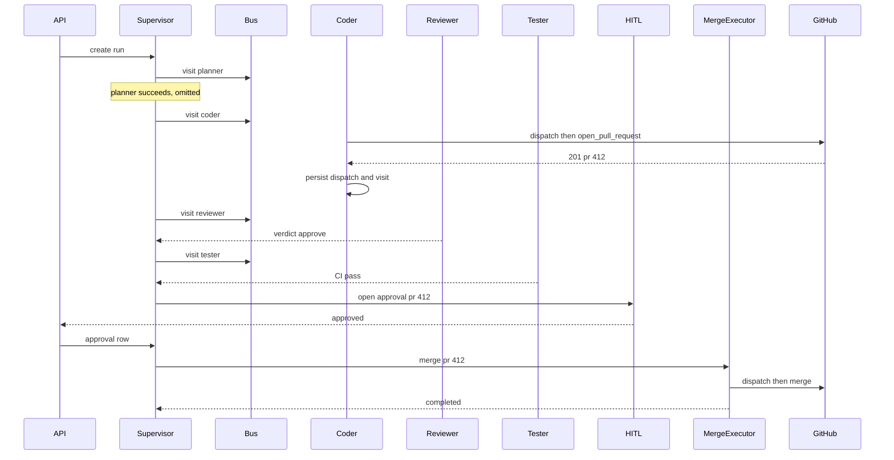
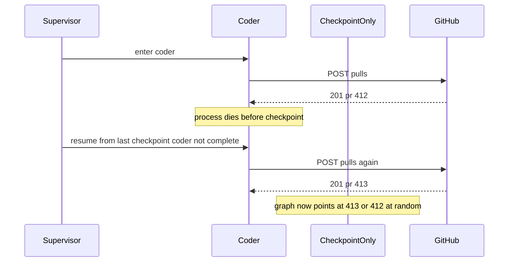
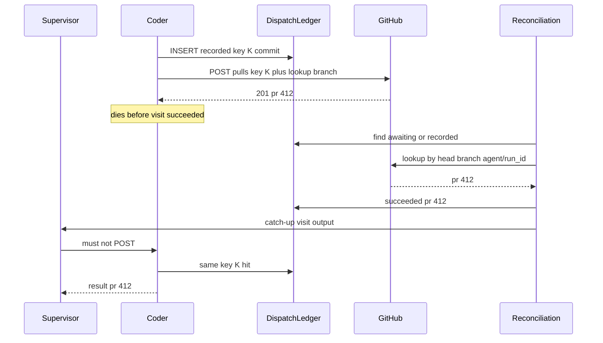
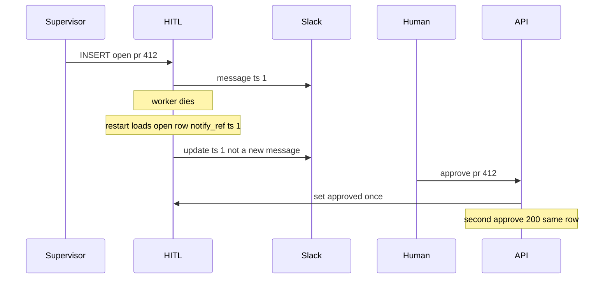
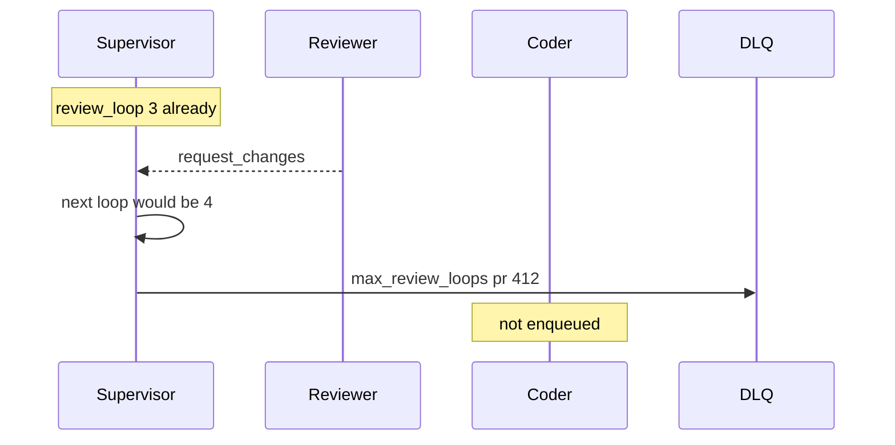

# Multi-Agent Orchestration Platform — System Design
> - **Document Status**: Draft
> - **Last Updated**: 2026 Aug 29
> - **Author**: Paul Serban

This document describes *how* a run executes and how retry intersects it: the data model, node loop, idempotency keys, agent envelopes, HITL, DLQ, and the sequences that actually answer the scenario. It complements the [Architecture Document](./02_architecture_document.md), which covers *what* the system is and *why* it is shaped this way.

> This is a design specification. No supervisor, worker, or adapter code is implemented as part of this documentation deliverable. Numbered steps are the intended runtime behavior, not a source file.

## 1. Data Model

Six logical stores. They may live in one database in Phase 1. They must not be collapsed into “LangGraph state dict in Redis.”

### 1.1 `runs`

One row per issue invocation. Created **before** any vendor call.

| Field | Role |
| --- | --- |
| `run_id` | Primary key. Client-visible. Used in branch names. |
| `issue_ref` | Repo + issue number. |
| `status` | `created` \| `planning` \| `coding` \| `reviewing` \| `testing` \| `awaiting_hitl` \| `merging` \| `completed` \| `rejected` \| `dlq` |
| `lease_owner` / `lease_expires_at` | Exclusive walker. Expiry → recon, not a second Coder. |
| `review_loop` | 0..`MAX_REVIEW_LOOPS`. |
| `test_loop` | 0..`MAX_TEST_RETRIES`. |
| `pr_number` | Cached from the succeeded `open_pull_request` dispatch. Nullable until then. |
| `head_branch` | `agent/{run_id}` (stable). |
| `head_sha` | Updated after each `commit_and_push` success. |
| `terminal_reason` | Machine string. |
| `created_at` / `updated_at` / `terminal_at` | |

**Invariant:** `pr_number` is copied from the dispatch ledger, never from model text. If they disagree, the ledger wins and the mismatch is an alert.

### 1.2 `node_visits` (checkpoints)

One row per *visit*, not per node type. Coder may appear three times (initial + two review loops).

| Field | Role |
| --- | --- |
| `visit_id` | PK. |
| `run_id` | |
| `node_id` | `planner` \| `coder` \| `reviewer` \| `tester` \| `hitl` \| `merge` |
| `seq` | Monotonic per run. |
| `loop_kind` | `initial` \| `review` \| `test_fix` |
| `status` | `pending` \| `running` \| `succeeded` \| `failed` \| `unknown` \| `skipped` |
| `attempt` | Tool-attempt counter *inside* this visit (starts 1). |
| `input_ref` / `output_ref` | Typed blobs: plan JSON, `{verdict, comments}`, `{ci_conclusion, run_id}`. |
| `started_at` / `ended_at` | |
| `error` | Truncated, no secrets, no patch bodies. |

**Legal transitions:** `pending → running` (lease held, previous visit succeeded as required); `pending → skipped` (run already DLQ/terminal); `running → succeeded | failed | unknown`. `running → skipped` is illegal if any dispatch for this visit is `awaiting_provider` or `succeeded`.

### 1.3 `tool_dispatches`

The outbox. One row per attempt. **Inserted before the HTTP call.** Unique on `idempotency_key`. Shared by all workers.

| Field | Role |
| --- | --- |
| `idempotency_key` | Unique. See §3. |
| `run_id` / `visit_id` / `node_id` / `attempt` / `tool` | Natural key inputs. |
| `tool` | `create_branch` \| `commit_and_push` \| `open_pull_request` \| `post_review_comment` \| `trigger_ci_run` \| `merge_pull_request` \| `notify_slack` |
| `status` | `recorded` \| `awaiting_provider` \| `succeeded` \| `failed` \| `unknown` |
| `request_fingerprint` | Hash of canonical body (e.g. title, head, base, SHA). |
| `provider_id` | `pr_number`, `ci_run_id`, `comment_id`, `slack_ts`. |
| `recorded_at` | Before the socket write. |
| `completed_at` | When we learned the outcome. |

**Invariant:** no outbound write HTTP call exists without a `recorded` (or later) dispatch row committed. If the insert fails, the call does not happen.

**Per-run uniqueness (this scenario):** at most one *succeeded* `open_pull_request` per `run_id`. A second insert with a different fingerprint while the first is `succeeded` or `unknown` is a defect: refuse and alert. New attempt only after known `failed`.

### 1.4 `hitl_approvals`

| Field | Role |
| --- | --- |
| `approval_id` | PK. |
| `run_id` | Unique among rows with `status=open`. |
| `pr_number` | Bound. |
| `head_sha` | Bound if known. |
| `status` | `open` \| `approved` \| `rejected` \| `expired` |
| `decided_by` | Human id. |
| `notify_ref` | Slack ts / UI id — for **update in place**, not a second message. |
| `opened_at` / `decided_at` / `expires_at` | |

**Invariant:** approve is accepted only if `pr_number` (and `head_sha` if the UI sent one) matches the row. A mismatched approve is 409.

### 1.5 `dlq_entries`

| Field | Role |
| --- | --- |
| `run_id` | Unique. |
| `reason` | `max_review_loops` \| `max_test_retries` \| `unknown_unresolved` \| `hitl_rejected` \| `hitl_expired` \| `permanent_tool_failure` \| `lease_poison` |
| `last_visit_id` | |
| `pr_number` | If any. |
| `operator_notes` | Humans only. **No** “retry graph” button that mints new keys. Re-drive is a *new run* or a documented replay-from-ledger procedure. |

### 1.6 `trace_spans` (or equivalent OTel backend)

| Field | Role |
| --- | --- |
| `trace_id` / `span_id` | |
| `run_id` / `visit_id` / `node_id` | Correlation. |
| `kind` | `llm` \| `tool` \| `supervisor` \| `hitl` |
| `tool` / `model` | |
| `idempotency_key` | If tool. |
| `status` | |
| `started_at` / `ended_at` | |
| `token_usage` | If LLM. |

Without this, “did we double-call?” is folklore. Cheap at issue volume.

## 2. Agent-to-Agent Protocol (Supervisor-Mediated)

There is no peer RPC. The protocol is: **typed result in, envelope out**.

### 2.1 Work envelope (bus)

Every envelope includes:

| Field | Role |
| --- | --- |
| `run_id` | |
| `visit_id` | |
| `node_id` | |
| `attempt` | Visit-level. |
| `context_ref` | Pointer to the slice in the store (not an inline 200k-token blob on SQS). |
| `correlation_id` | = `run_id` for traces; `visit_id` as parent span. |
| `produced_at` | |

Redelivery of the same `visit_id` is a no-op if the visit is not `pending`/`running` owned by this worker.

### 2.2 Node results (worker → store → supervisor)

| Node | Success payload (typed) | Routing |
| --- | --- | --- |
| Planner | `{plan, infeasible?: bool}` | `infeasible` → DLQ; else Coder |
| Coder | `{pr_number, head_sha, files_touched}` | Reviewer. Missing `pr_number` after success is a worker bug. |
| Reviewer | `{verdict: approve \| request_changes, summary}` | approve → Tester; request_changes + loops left → Coder; else DLQ |
| Tester | `{conclusion: pass \| fail, ci_run_id}` | pass → HITL; fail + retries left → Coder; else DLQ |
| HITL | `{decision}` | approved → Merge; rejected/expired → DLQ |
| Merge | `{merged: true, sha}` | `completed` |

**Context slice rules** (what the worker is allowed to load): see [Architecture — Shared vs Isolated](./02_architecture_document.md#shared-vs-isolated-context-windows). Reviewer `summary` is copied into Coder’s next slice as `[UNTRUSTED: REVIEWER_OUTPUT]`. CI logs as `[UNTRUSTED: CI_OUTPUT]`. Neither is a system instruction.

### 2.3 Correlation

Logs, traces, GitHub headers (`X-Request-Id` if we control it), Slack metadata: always `run_id`. Branch: `agent/{run_id}`. PR body contains `run_id` so a human and a recon query can find it without the ledger (belt; ledger is still suspenders).

## 3. Idempotency Keys

```
idempotency_key = hex(sha256(run_id || ":" || node_id || ":" || visit_id || ":" || tool || ":" || attempt || ":" || request_fingerprint))
```

`visit_id` is in the key so a legitimate *new* Coder visit (review loop 2) can `commit_and_push` a new SHA. It must **not** allow a second `open_pull_request` if one already succeeded for the run — that is a **separate invariant** on the tool, not the hash (see §1.3).

Practical rules:

- **Same attempt, same body**: unique hit → do not HTTP-call again; return stored outcome or wait.
- **Same attempt, different body**: defect; do not send; alert.
- **New attempt**: only after previous is `failed` with known non-apply (GitHub 422 “already exists” may actually mean *it applied in spirit* — treat as succeeded + lookup, not failed+retry). Timeouts stay `unknown`.

Where it is enforced:

1. **Local unique constraint** — the actual fuse.
2. **Vendor header** when the API has one. GitHub `POST /pulls` historically does **not**. Then (3).
3. **Natural uniqueness**: branch `agent/{run_id}`; `open_pull_request` becomes “get PR by head, else create.” `create_branch` is “get ref, else create.” `trigger_ci_run` looks up in-progress workflows for `head_sha` before POST. `merge_pull_request` is idempotent at GitHub if already merged (409/405) — treat as success if the PR is merged.

If the vendor has **no** idempotency and **no** lookup: local fuse only. Then: one lease, dispatch-first, never retry unknown. Phase 0 must write this down per tool. A CI API without keys and without list-by-SHA is a product decision: is Tester allowed to auto-retry?

## 4. Checkpoints and the Executor Loop

Supervisor loop (numbered so an implementation traces 1:1):

1. Take lease on `run_id` or abort.
2. Load run + latest visit. If terminal (`completed`/`rejected`/`dlq`), exit.
3. If status `awaiting_hitl`, go to **HITL poll** (§8). Do not enqueue agents.
4. If latest visit is `running` and lease was stolen/expired: recon, not a second enqueue.
5. If latest visit is `unknown`: **do not proceed** to HITL/merge. Recon or DLQ per TTL.
6. If latest visit is `succeeded`, compute next node from routing table + loop counters. If next would exceed max loops → insert DLQ, set run `dlq`, release lease.
7. Insert next `node_visits` (`pending`), enqueue envelope, heartbeat, wait for completion *or* (better) release compute and wake on visit update. Either way the **wake** re-enters at step 2.
8. If latest visit is `failed` with retryable classification and attempt budget: new visit or new attempt per §5. If not retryable: DLQ.

Worker loop:

1. Receive envelope. Claim visit (`pending → running`) **iff** still pending and lease matches (or visit-level lock). Else ack and exit.
2. Load context slice. Open parent trace span.
3. LLM turn. On each tool call:
   1. If tool not in allowlist → fail visit (do not call).
   2. If write tool: **checkpoint-adjacent dispatch** (§6) *before* HTTP.
   3. After outcome: persist dispatch; persist a **tool-progress** note on the visit (so a crash mid-node still sees the PR).
   4. Then continue the LLM (or stop if the node’s contract is complete — e.g. Coder after successful `open_pull_request` + required fields).
4. Persist typed result; visit `succeeded`; ack bus.

**The trap is step 3.3 being after the LLM turn or after the node function returns.** That is the LangGraph-default bug. The fix is dispatch + progress **inside** the node, per tool, before the next token or return.

## 5. Retry, Backoff, Loops, DLQ

### 5.1 Classification

| Class | Examples | Action |
| --- | --- | --- |
| Transient | LLM 429, GitHub 502, CI 503 | Exponential backoff, same attempt key if the HTTP never left or vendor is idempotent; else unknown |
| Unknown | Timeout, RST, 5xx with no body after dispatch | Stay `unknown`; recon; **no new attempt** |
| Known non-apply | GitHub 401/403, schema fail, 404 repo | `failed`; may DLQ; new attempt only if the request was never valid and we change the body (rare; usually DLQ) |
| Semantic loop | Reviewer `request_changes`, Tester `fail` | New **visit** (new `visit_id`), increment `review_loop` / `test_loop` |
| Permanent | HITL reject, infeasible plan, merge 409 because checks required and missing | DLQ or `rejected` |

Backoff (starting point, measure in Phase 0): 1s, 4s, 16s; cap 3 transients per visit then `unknown`/fail. Do not retry forever on 429 by creating new visits — that is how you open a PR on the fourth try after the first three actually succeeded.

### 5.2 Loop caps (defaults)

- `MAX_REVIEW_LOOPS = 3` (initial Coder + up to 3 review-driven re-entries = 4 Coder visits max — pick one definition and stick to it: **this design counts Reviewer→Coder edges**, max 3).
- `MAX_TEST_RETRIES = 2` (Tester→Coder edges).
- Raising these is a signed product change, not an incident hotfix.

### 5.3 DLQ admission

Insert `dlq_entries` when:

- loop cap hit,
- HITL rejected or expired,
- unknown older than SLA (e.g. 15 minutes) with no lookup,
- visit `failed` non-retryable,
- visit poison (worker crash N times on the same `visit_id` with no dispatch — then it is a bug; still DLQ rather than infinite bus redelivery).

**Re-drive policy:** ops may create a **new** `run_id` (new branch, new keys, *may* open a second PR — warn). Ops may **not** click “retry visit” on a visit that has a succeeded or unknown write dispatch. A documented “catch-up checkpoint from ledger” is allowed and is the *normal* resume path, not a button.

## 6. Side-Effecting Tool Execution (load-bearing)

Applies to every write tool in every agent.

1. Classify (Phase 0 table). Reads skip to call.
2. If tool is `open_pull_request` and a succeeded dispatch already exists for this `run_id`: return stored `pr_number`; do not POST.
3. Canonicalize body. Fingerprint.
4. `INSERT tool_dispatches` status `recorded`. **Commit.**
5. Set `awaiting_provider`.
6. HTTP call with any vendor idempotency header; GitHub: still do lookup-by-branch *before* POST as well (two layers).
7. Map response:
   - 2xx → `succeeded`, store `provider_id`, copy `pr_number`/`head_sha` onto `runs`.
   - 4xx known-reject that means not created → `failed`.
   - 4xx “already exists” → lookup; if found, `succeeded` with that id (do not increment attempt).
   - timeout / 5xx → `unknown`. **Do not increment attempt. Do not continue the node as if the PR exists. Do not continue as if it does not.**
8. Emit tool-progress on the visit. Then return to LLM or complete the node.

Crash between 4-commit and 7: recon finds `recorded`/`awaiting_provider`. Same key. Lookup or same-key retry if vendor-safe. **Never a new key.**

## 7. Sequences

### 7.1 Case A — Happy path



### 7.2 Case B — The trap uncorrected (checkpoint after node)

Coder POSTs PR #412, process dies before the checkpointer writes `coder=succeeded`. Resume loads `coder=pending/running` with empty output. Coder runs again and POSTs PR #413.



This is the failure the rest of the design exists to make illegal.

### 7.3 Case C — The fix (dispatch ledger + progress before return)



If GitHub 201 never reached us and lookup finds nothing: stay `unknown`, do not open a differently-titled PR, do not go to Reviewer.

### 7.4 Case D — HITL timeout / restart



If `expires_at` passes: `expired`, run `dlq`, reason `hitl_expired`. Do not merge. Do not auto-reopen without a human.

### 7.5 Case E — DLQ after max reviewer loops



The PR remains open as a draft. A human can take it. The graph does not keep burning tokens. Closing the PR is a human/product action, not a default compensation.

## 8. HITL Mechanics

1. Tester visit succeeded with `pass`. Supervisor inserts `hitl_approvals` (`open`, `pr_number` from run, `head_sha`, `expires_at` = now+SLA, e.g. 72h).
2. Notify Slack/UI once; store `notify_ref`.
3. Release or convert lease to wait (supervisor need not sit in a loop). A timer/poller expires rows.
4. Human approve: API updates row iff still `open` and ids match. Supervisor (or a waiter) enqueues Merge.
5. Merge executor: re-read row `approved`; dispatch-first merge; if GitHub says already merged → success; if SHA mismatch → refuse, DLQ, do not merge the new SHA under the old approval.

Default: **disconnect of the HITL UI does not reject.** Timeout does. Same lesson as cancel vs disconnect in the sibling project.

## 9. Error Handling

| Situation | System behavior |
| --- | --- |
| Duplicate envelope | Visit not pending → ack, no tools |
| Two supervisors | Second fails to take lease |
| DB down at dispatch insert | Do not call GitHub. Fail the visit. |
| LLM 429 | Backoff in worker; visit stays running; lease heartbeat |
| GitHub 422 PR exists | Lookup by branch; succeed if ours |
| Merge without approval row | Merge executor refuses. Alert. |
| Approve for wrong `pr_number` | 409 |
| Coder model asks `merge_pull_request` | Tool missing from allowlist; visit may continue or fail closed on schema — **must not** call GitHub merge |
| Reviewer posts 50 comments | One `post_review_comment` per visit in v1 (or one keyed comment). Cap in adapter. |
| CI pass then Coder visit accidentally enqueued | Supervisor routing bug; merge still blocked by HITL + SHA bind |

## 10. What This Design Refuses to Specify

- Which LLM vendor, which CI system.
- The plan JSON schema beyond “typed, supervisor-routable.”
- Exactly-once end-to-end.
- An automatic “close the extra PR” saga.
- Agent-to-agent gossip without a supervisor.
- A single boolean `retried`.

Those refusals are the design.
