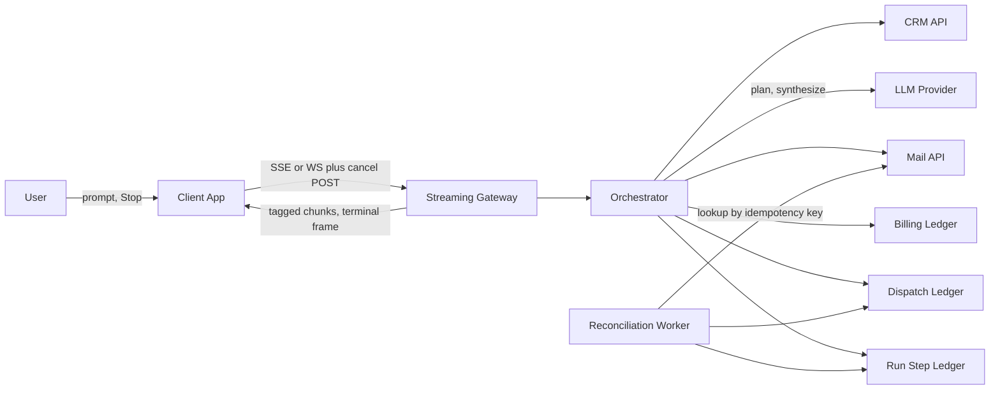
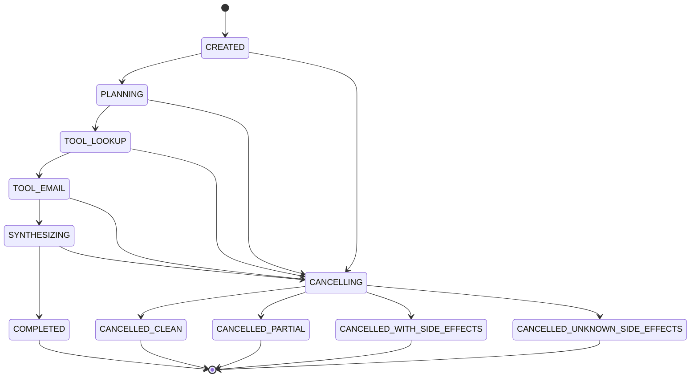

# Agent Pipeline Cancellation — Architecture Document
> - **Document Status**: Draft
> - **Last Updated**: 2026 Aug 29
> - **Author**: Paul Serban

A 4-step agent chain (plan → lookup_customer → send_email → synthesize) that streams to a user who is allowed to cancel. The system treats cancellation as a durable cooperative signal, records every step and every billable event, and refuses to pretend that an in-flight email can be rolled back. This document covers *what* the system is and *why* it is shaped this way; see [System Design](./03_system_design.md) for *how* the four cancel-timing sequences, the idempotency key, and the billing ledger actually work, and [Trade-offs and Honest Assessment](./05_tradeoffs_and_honest_assessment.md) for what Stop cannot undo.

## Overview

**Brief description**: Control plane for a single sequential agent run. Not a multi-agent platform, not an LLM gateway product, not a generic workflow engine. The scarce resource under cancellation is *truth about what already happened in the world*, not CPU.

**Business Context**
- See [Scenario and Requirements](./01_scenario_and_requirements.md) for the full framing. In short: cancel is not rollback, the email does not come back, and billing is what occurred, not what the user wished had occurred.
- Current state: request-scoped in-memory task + socket-close abort. That coupling is the defect.
- Desired future state: a durable run with a step ledger, an out-of-band cancel flag, tool adapters that key every dispatch, and a billing ledger that outlives the HTTP stream.
- Target users: owning engineer, on-call/support, finance, the end user, the email/CRM tool owners.

## Requirements

### Functional Requirements

- **Run lifecycle**: the system must create a durable run record before any LLM or tool call is issued, and must not issue work for a run whose `cancel_requested_at` is set except to finish an already-dispatched irreversible call and to emit the terminal frame.
- **Step ledger**: each of the four steps is a row with status `pending → running → {succeeded, failed, skipped, unknown}`. Skipped is only legal for steps that never dispatched. Unknown is only legal for dispatched-but-unacked irreversible (or crash-interrupted) calls.
- **Cancel signal**: the client sends an explicit cancel frame (or a dedicated POST) that sets `cancel_requested_at`. Executors observe it at checkpoints: before starting a step; between stream chunks for LLM steps; not in the middle of unsafely aborting `send_email`.
- **Streaming**: synthesize (and optionally plan status) is forwarded to the client as tagged chunks (`run_id`, `step_id`, sequence). The stream always ends with a terminal frame. A dropped connection does not, by itself, cancel the run — see [ADR-006](./04_architecture_decision_records.md#adr-006).
- **Tool dispatch**: before any HTTP call to a tool provider, the adapter writes a dispatch record with the idempotency key. Then it calls. Then it records the outcome. That order is the feature.
- **Billing**: every billable event (token batch, tool invocation) is appended to a ledger keyed by `run_id`. Cancel does not delete rows. Invoice policy may credit later; the ledger does not lie.
- **Reconciliation**: runs or steps left `unknown` or `running` past a lease TTL are picked up by a worker that asks the provider, or asks a human, and never "just retries send."
- **Terminal honesty**: the client is told which of the four cancel outcomes occurred. Support can read the same outcome from the run record.

### Non-Functional Requirements

**Performance Requirements:**
- Cancel observation latency: the next checkpoint, not a hard bound of 0ms. For LLM streams, checkpoint per chunk (typically tens to hundreds of ms). For `send_email`, the remaining round-trip of that call (typically < 2s; design for a few seconds) or the unknown-timeout (see System Design).
- Stream tail latency: terminal frame should follow the last forwarded chunk without waiting for invoice generation. Billing appends are inline and cheap; invoicing is not on the stream path.
- Throughput: this scenario is one run per user action. The architecture is not a high-QPS gateway. Durability of the ledger matters more than microseconds.

**Reliability Requirements:**
- **Crash after dispatch, before outcome write** must not double-send. The dispatch row + idempotency key is the recovery handle.
- **Crash after outcome, before cancel-aware terminal frame** must not restart the next step. `cancel_requested_at` and step statuses are durable.
- **Provider timeout** on an irreversible tool is `unknown`, not `failed`. Failed means "we know it did not happen" and is the precondition for a retry of a *new* attempt number. Getting this wrong is how a timeout becomes a second email.
- **Idempotent cancel**: posting cancel twice is a no-op after the first write of `cancel_requested_at`.

**Infrastructure Constraints:**
- Technology shape (not an implementation mandate): an HTTP/SSE (or WebSocket) edge; an orchestrator process with a lease on the run; a relational store for runs, steps, dispatches, billing events; a small reconciliation worker on a timer; outbound HTTPS to an LLM provider, a CRM, and a mail API.
- No new saga product, no new message bus required in v1. A bus is a later scale-out if run volume demands it; it does not make cancel safer.
- Secrets for LLM / CRM / mail live in the existing secret store. Idempotency keys are not secrets; they are identifiers and will appear in provider logs.

**The defining constraint:**
- **Side effects in this pipeline are not transactional with our database.** The mail API's 200 and our `step.status = succeeded` can be separated by a crash. Architecture that ignores that gap is a demo. Architecture that names the gap, records dispatch first, and reconciles unknown is the job.

## Executive Summary

The architecture is **Ledger-then-Act, Cancel-as-Flag, Finish-or-Reconcile**. The orchestrator is a state machine over durable rows. The streaming gateway is a projector of those rows to a client, plus an inbound cancel channel. Tools never get called "from the LLM" directly; they go through an adapter that owns the idempotency key. Billing is a log, not a column on the run.

**Architecture Style:** Orchestrated sequential workflow with cooperative cancellation and outbox-style dispatch recording. Not a distributed transaction. Not "just an AbortController."

**Key Components:**
- **Streaming Gateway**: client protocol, chunk tagging, cancel intake, terminal frame. Does not own business state.
- **Orchestrator / Run State Machine**: advances steps, checks cancel at checkpoints, holds a lease.
- **Run and Step Ledger**: source of truth for what was attempted and what is known.
- **Tool Adapter layer**: classify read vs irreversible; persist dispatch; attach idempotency key; map provider errors.
- **Billing Ledger**: append-only usage events.
- **Reconciliation Worker**: expires leases, resolves `unknown`, never blindly retries irreversible attempts.

**Architecture Principles:**
- **Cancel stops the future, not the past.** The past is the ledger.
- **Record dispatch before the side effect.** If you cannot write the row, you do not send the email.
- **Unknown is cheaper than a confident lie.** A status of `unknown` pages a human. A status of `skipped` after an in-flight send pages a customer.
- **Idempotency prevents duplicates; it does not implement undo.**
- **The stream is not the system of record.** The client can vanish. The run cannot.
- **Billing events are facts.** Invoice policy is a view.

**Key Architectural Decisions:**
1. Cooperative, checkpoint-based cancellation over hard task/socket kill — [ADR-001](./04_architecture_decision_records.md#adr-001).
2. Per-attempt idempotency keys on all tool calls — [ADR-002](./04_architecture_decision_records.md#adr-002).
3. Event-sourced, append-only billing ledger — [ADR-003](./04_architecture_decision_records.md#adr-003).
4. Explicit `unknown` + reconciliation instead of assuming success or failure — [ADR-004](./04_architecture_decision_records.md#adr-004).
5. No default automatic compensating action — [ADR-005](./04_architecture_decision_records.md#adr-005).
6. Explicit terminal-frame streaming protocol; socket close is not cancel — [ADR-006](./04_architecture_decision_records.md#adr-006).

### Context Diagram

The CRM and mail APIs are reached only through the Tool Adapter (drawn as the orchestrator→API edges). The LLM provider is also "just another vendor": we can stop reading their stream; we cannot un-bill tokens they already generated.

## Runtime Architecture

1. **Admission**: client opens a stream and submits a prompt. Gateway creates a `run` (`CREATED`), four `step` rows (`pending`), returns `run_id`. Orchestrator takes a lease.
2. **Checkpoint before every step**: if `cancel_requested_at` is set, mark remaining `pending` steps `skipped`, compute terminal outcome from *what already succeeded or is unknown*, emit terminal frame, release lease. Do not start the step.
3. **LLM steps (`plan`, `synthesize`)**: mark `running`, call provider with our abort tied to *stop forwarding*, persist token-usage billing events as they become known (final usage often arrives in the provider's terminal chunk — record that; if cancel interrupts before usage is reported, record a conservative estimate and a `usage_unconfirmed` flag for later true-up, or wait briefly for the provider trailer — pick one in System Design and do not silently drop).
4. **Tool steps**: write `tool_dispatch` (`dispatched`, key = `run_id:step_id:attempt`), then HTTP call, then write outcome. Irreversible tools ignore cancel *for the in-flight attempt*; they still refuse a *next* attempt.
5. **Cancel intake**: gateway writes `cancel_requested_at` (idempotent). Does not kill the orchestrator process. May send the client a `stopping` frame immediately so the UI is not a lie of stillness.
6. **Completion**: terminal frame + run status. Billing is already in the ledger; a later invoicing job sums it.
7. **Reconciliation**: lease expiry or `unknown` TTL. Compare dispatch ledger to provider. Update step. Alert if still unknown.

### Run state machine

`CANCELLING` is a *drain* state: finish or time-out the in-flight irreversible attempt, skip the rest, emit the terminal frame. It is not a synonym for "we undid it."

Mapping drain → terminal:

| What already happened | Terminal run status |
| --- | --- |
| No step reached `running` (or only skipped) | `CANCELLED_CLEAN` |
| `plan` and/or `lookup_customer` and/or partial `synthesize` succeeded; `send_email` never dispatched | `CANCELLED_PARTIAL` |
| `send_email` is `succeeded` | `CANCELLED_WITH_SIDE_EFFECTS` |
| `send_email` is `unknown` (or still `running` at unknown-timeout) | `CANCELLED_UNKNOWN_SIDE_EFFECTS` |

A completed run that receives a late cancel stays `COMPLETED`. Cancel is not a time machine.

## Components

### 1. Streaming Gateway
**Purpose**: Speak the client protocol without owning the run.

**Responsibilities:**
- Authenticate the user; bind the stream to a `run_id`.
- Forward tagged chunks; never rewrite step outcomes.
- Accept cancel (in-band frame or sidecar POST) and persist it, then ack `stopping`.
- Distinguish **explicit cancel** from **connection drop**. Default: drop ≠ cancel. Product may opt into "drop means cancel" later; that is a flag, not a silent default. See [ADR-006](./04_architecture_decision_records.md#adr-006).
- Reconnect: a client that dropped can reconnect by `run_id` and replay from last received sequence, or at least fetch the current run status. Without this, a blip looks like a Stop.

**Interactions:**
- Writes: `cancel_requested_at` (via the same store the orchestrator reads).
- Reads: chunk log or live subscription from the orchestrator.
- Does not call LLM, CRM, or mail.

### 2. Orchestrator / Run State Machine
**Purpose**: Be the only component allowed to start a step.

**Responsibilities:**
- Lease the run (so a second worker does not double-execute).
- Checkpoint-cancel before each step and between LLM chunks.
- Invoke LLM and tool adapters.
- Append billing events when usage is known.
- Transition the run into `CANCELLING` / terminal states.
- Heartbeat the lease while working.

**Interactions:**
- Reads/writes: run, steps, dispatches, billing.
- Outbound: LLM, adapters.

**What it must not do:**
- Start `send_email` because the planner's JSON said so *after* cancel was requested. The planner output is a suggestion; the checkpoint is the law.
- Treat LLM "stop reason: abort" as proof the provider billed zero.

### 3. Run and Step Ledger
**Purpose**: Survive the process. This is the system of record for cancellation correctness.

**Responsibilities:**
- Store run: status, `cancel_requested_at`, lease, user, prompt ref, terminal outcome, timestamps.
- Store steps: type, attempt, status, input/output refs, error, provider request ids if any.
- Answer "did we send the email?" without grepping logs.

**Interactions:**
- Written by orchestrator and reconciliation.
- Read by gateway (status), support, billing-invoice job.

### 4. Tool Adapter Layer
**Purpose**: Make every tool look like: classify → record dispatch → call → record outcome. Hide vendor SDK shapes.

**Responsibilities:**
- **Classification** (Phase 0 inventory, not runtime guess): `read` vs `irreversible`. `lookup_customer` is `read` in this scenario. `send_email` is `irreversible`.
- Mint `idempotency_key = hash(run_id, step_id, attempt_number)` and send it in the vendor's supported header/field when one exists.
- Persist dispatch *first*.
- Map timeouts and 5xx on irreversible tools to `unknown` (retryable only as *reconciliation*, not as a new send without a new key — and a new key is forbidden unless we *know* the previous attempt did not apply).
- For reads: cancel may abort the HTTP call; a retry of the same attempt is allowed if no mutation.

**Interactions:**
- Writes: `tool_dispatch`.
- Outbound: CRM, mail.

### 5. Billing Ledger
**Purpose**: Facts about consumption. Not a stripe invoice.

**Responsibilities:**
- Append events: `llm_tokens` (model, input/output counts, provider request id, `usage_confirmed` bool), `tool_call` (tool name, provider, attempt, outcome).
- Never update-in-place except a documented true-up of `usage_confirmed` from `false` to `true` with an additive correction event — not a silent overwrite. Prefer a second event over mutating the first. See [ADR-003](./04_architecture_decision_records.md#adr-003).
- Invoice job (out of this scenario's runtime, but the consumer of this ledger) applies the *policy*: charge all events; or charge all except cancelled-clean; or credit X%. Policy is not encoded as deletes.

**Interactions:**
- Written by orchestrator as work happens.
- Read by invoicing and by the terminal-frame "you were billed for N tokens and 1 email" if product wants that honesty in the UI — optional, recommended.

### 6. Reconciliation Worker
**Purpose**: Close the crash window and the timeout window.

**Responsibilities:**
- Find runs with expired leases still `PLANNING|TOOL_*|SYNTHESIZING|CANCELLING`.
- Find steps `running` or `unknown` older than TTL.
- For irreversible dispatches: query the provider by idempotency key (if supported) or by recorded provider message id; if no lookup API exists, escalate to human with the key and timestamp — **do not resend**.
- For LLM steps: if cancelled, just mark stopped; token true-up if the provider later exposes usage for that request id.
- Alert on unknown older than the support SLA.

**Interactions:**
- Reads/writes ledger; outbound lookup to mail API where possible.

### Communication Patterns

**Synchronous:**
- Orchestrator ↔ LLM (streaming HTTP).
- Orchestrator ↔ CRM / mail (request/response).
- Client ↔ gateway (SSE/WS).

**Asynchronous / out-of-band:**
- Cancel POST may arrive on a different connection than the stream. That is why cancel is a row, not a signal on one TCP connection.
- Reconciliation timer.
- Invoice generation.

## Scaling Strategy

**Current Scale Requirements:**
- Interactive agent runs, human-paced. Tens to thousands of concurrent runs is a product question; the correctness design does not change at either number.

**What does not need to scale in v1:**
- A Kafka backbone. The database *is* the queue of runs.
- Horizontal orchestrators without leases. Two workers on one run is a double-send. Lease first, scale second.

**What is already the ceiling:**
- The mail API's own idempotency support. If they do not key, *our* dispatch row is the only fuse, and it cannot save a dual-writer bug. One leased orchestrator per run is non-negotiable.

**If run volume grows:**
- Put a job queue in front of orchestrator workers, still with a DB lease/unique on `run_id`. The cancel flag stays in the DB so any worker can see it.
- Do not "scale" by firing tools from the LLM callback without the adapter. That is how you scale double-sends.

**Bottleneck Analysis:**
- Primary: truth latency — how fast we persist dispatch and cancel. If the DB is down, we do not send mail. Fail closed.
- Secondary: LLM stream; user-perceived cancel lag during `send_email` wait.
- Tertiary: reconciliation backlog of `unknown` if the mail API has no lookup. That is an operational cost, not a throughput cost.

## Data Architecture

### Data Model

**Key Entities:**
- **Run**: one user request. Status, cancel timestamp, lease owner/expiry, terminal outcome, client last-seq.
- **Step**: four per run in this scenario. Type, status, attempt, started/ended, input/output pointers.
- **ToolDispatch**: one per attempt. Idempotency key unique. Provider request/message ids. Outcome.
- **BillingEvent**: append-only. Kind, amounts, pointers to step/dispatch, `usage_confirmed`.
- **ChunkLog** (optional but useful): sequence of streamed frames so reconnect can replay. Can be truncated after terminal + TTL.

**Entity Relationships:**
- Run 1—N Steps; Step 1—N Dispatches (attempts); Run 1—N BillingEvents; Run 1—N Chunks.

### Data Lifecycle

**Create**: run + pending steps at admission, before vendor calls.

**Read**: orchestrator, gateway status, support, invoice job.

**Update**: step status forward-only except unknown→succeeded/failed via reconciliation. Cancel timestamp set-once.

**Delete**: not as a correctness mechanism. TTL/archive old runs for privacy after the finance retention window. Billing events follow finance retention, which is usually *longer* than chat retention. Do not GDPR-delete billing facts that invoices were based on without a finance process. That is a later compliance design; flag it, do not "just cascade delete."

## Cost Analysis

### Cost Components

**Money (vendors):**
- LLM tokens for plan + (partial) synthesize: incurred even on cancel. Providers generally bill generated tokens, not "completed chats."
- Mail API per message: incurred if 200, maybe incurred if timeout (unknown).
- CRM lookup: usually negligible; confirm.

**Money (us):**
- Database, two processes (orchestrator + recon). Small.
- Support time on `unknown` — this is the real opex of honest cancellation. A design that never produces `unknown` is a design that is lying or that hard-kills and hopes.

**User-trust cost of a wrong cancel:**
- Email sent after Stop, with a UI that said "Cancelled," is an incident. The architecture spends complexity to make that UI *unable* to say a simple Cancelled when a side effect happened.

### Cost Optimization

- Do not call `send_email` speculatively in parallel with plan "to save latency." Sequential is the point.
- Check cancel *before* the expensive irreversible call, not only after.
- Do not stream-plan if the user cannot usefully cancel during plan; a single non-stream plan call is simpler. Streaming plan is optional. Synthesize streaming is the UX that justifies the protocol.

## Risks and Mitigation

| Risk | Likelihood | Impact | Mitigation Strategy | Owner |
| --- | --- | --- | --- | --- |
| Cancel vs email ACK race | High | High | Dispatch-first, wait-out in-flight, honest terminal frame | Orchestrator |
| Hard-kill converts known in-flight into unknown | High if ADR-001 is violated | High | Cooperative cancel only for irreversible tools | Orchestrator |
| Mail API has no idempotency key support | Medium | High | Local dispatch unique key + never retry same attempt; Phase 0 inventory; maybe refuse to put this tool behind a cancelable UI | Adapter / product |
| Mail API has no lookup-by-key, so unknown cannot be resolved | Medium | High | Human queue with timestamp/recipient/key; timeout policy documented; do not auto-resend | Recon / support |
| LLM provider bills after we stop reading the stream | High | Medium | Billing true-up; do not promise "Stop = $0" | Billing |
| Client disconnect treated as cancel; email still sends or doesn't, chaotically | High | Medium | Disconnect ≠ cancel by default ([ADR-006](./04_architecture_decision_records.md#adr-006)) | Gateway |
| Two orchestrator replicas without a lease double-send | Medium | High | Exclusive lease; unique idempotency key as backstop | Orchestrator |
| Auto "sorry, disregard" compensation email | Medium if product panics | Medium | Forbidden by default ([ADR-005](./04_architecture_decision_records.md#adr-005)) | Product |
| Invoice job zeros cancelled runs and fights the ledger | Medium | High | Policy as credits, not deletes ([ADR-003](./04_architecture_decision_records.md#adr-003)) | Finance + eng |
| Planner emits a tool call after user cancelled but output was already in memory | Medium | High | Checkpoint is the law; planner output is not a dispatch | Orchestrator |
| User hits Send again after Stop; expects no second email | High | Medium | New run, new keys; UI must say Stop does not mean "and never do this action." Copy is part of the architecture. | Client / product |
| Chunk log missing; reconnect shows a complete answer that was cancelled mid-synthesize | Medium | Medium | Terminal frame required; client must render incomplete state from the frame, not from "stream ended" | Gateway / client |
| `lookup_customer` is secretly a write | Low–Medium | High | Phase 0 classification; reclassify if needed | Phase 0 |

## Future Enhancements

### Phase 1 (Current)
**Focus**: Durable run/step ledger and cooperative cancel for LLM steps plus the client protocol. See [Phased Implementation Plan](./06_phased_implementation_plan.md).

### Phase 2
**Focus**: Tool adapter, dispatch ledger, unknown status for `send_email`.

### Phase 3
**Focus**: Billing ledger and a signed-off partial-run invoice policy.

### Phase 4
**Focus**: Reconciliation worker, support view of unknown, alerts.

### Technical Debt (accepted)

- Sequential-only. Parallel tools would need per-child cancel tokens and a join of side-effect outcomes. Not v1.
- Human reconciliation when the mail API cannot be queried. Ugly, honest, cheaper than a second send.
- Conservative token estimates when the provider withholds usage on abort. True-up later or over-bill slightly; under-billing cancelled runs at scale is a silent finance leak the other way.
- No generic compensation saga. If a future tool is a card charge, that tool needs its own refund API design — a different ADR, not a framework anticipated here.
