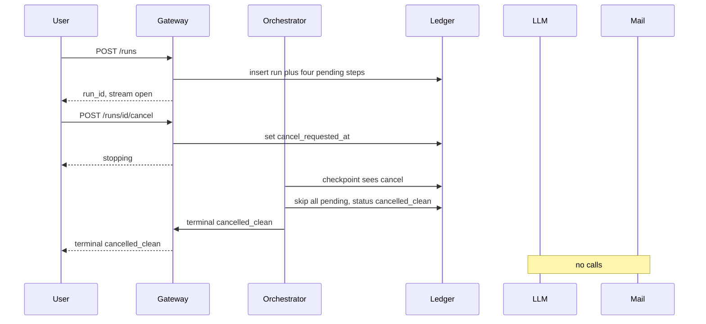
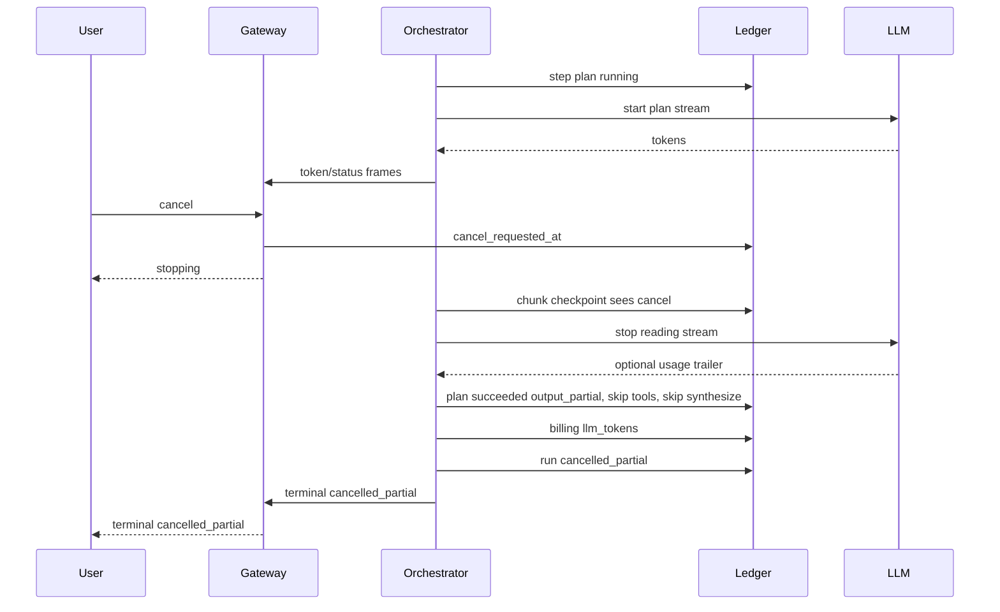
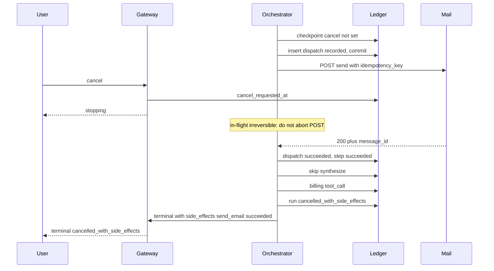
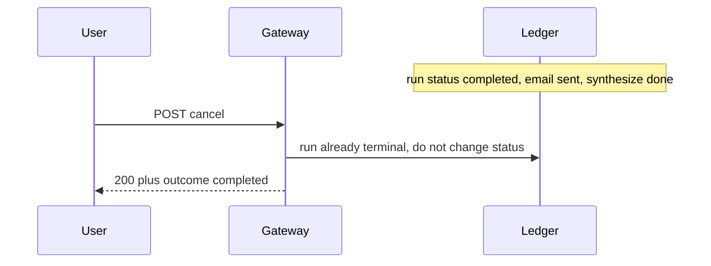

# Agent Pipeline Cancellation — System Design
> - **Document Status**: Draft
> - **Last Updated**: 2026 Aug 29
> - **Author**: Paul Serban

This document describes *how* a run executes and how cancellation intersects it: the data model, checkpoints, idempotency keys, billing appends, the client protocol, and the four cancel-timing sequences that actually answer the scenario. It complements the [Architecture Document](./02_architecture_document.md), which covers *what* the system is and *why* it is shaped this way.

> This is a design specification. No orchestrator, gateway, or adapter code is implemented as part of this documentation deliverable. Numbered steps are the intended runtime behavior, not a source file.

## 1. Data Model

Four logical stores. They may live in one database in Phase 1. They must not be collapsed into "a status column on the HTTP request object."

### 1.1 `runs`

One row per user invocation. Created **before** any vendor call.

| Field | Role |
| --- | --- |
| `run_id` | Primary key. Client-visible. |
| `user_id` | Owner. Authorization for cancel and reconnect. |
| `status` | `created` \| `planning` \| `tool_lookup` \| `tool_email` \| `synthesizing` \| `cancelling` \| `completed` \| `failed` \| `cancelled_clean` \| `cancelled_partial` \| `cancelled_with_side_effects` \| `cancelled_unknown_side_effects` |
| `cancel_requested_at` | Set-once. Null means no cancel. Presence is the signal; do not also rely on an in-memory flag. |
| `cancel_source` | `client_explicit` \| `admin` \| `policy` (optional). Not `disconnect` unless product opted in. |
| `lease_owner` | Worker id holding the run. |
| `lease_expires_at` | Heartbeat. Expiry → reconciliation, not a second send. |
| `prompt_ref` | Pointer to stored prompt (do not log secrets in this row). |
| `terminal_reason` | Short machine string for the terminal frame. |
| `last_chunk_seq` | For reconnect. |
| `created_at` / `updated_at` / `terminal_at` | Timestamps. |

**Invariant:** `cancel_requested_at` is never cleared. A late cancel after `completed` may be recorded as a no-op event in logs; it does not change `status`.

### 1.2 `steps`

Exactly four rows per run in this scenario, inserted with the run.

| Field | Role |
| --- | --- |
| `run_id` + `step_id` | PK. `step_id` is stable: `plan` \| `lookup_customer` \| `send_email` \| `synthesize`. |
| `seq` | 1..4. Execution order. |
| `status` | `pending` \| `running` \| `succeeded` \| `failed` \| `skipped` \| `unknown` |
| `attempt` | Starts at 1. Incremented only when a *new* attempt is authorized (known non-apply of the previous). |
| `classified_as` | `llm` \| `read_tool` \| `irreversible_tool` |
| `input_ref` / `output_ref` | Plan JSON, lookup payload, mail provider id, synthesize text pointer. |
| `provider_request_id` | If the vendor returns one. Reconciliation handle. |
| `started_at` / `ended_at` | |
| `error` | Truncated, no secrets, no email body. |

**Legal transitions:**

- `pending → running` (only if cancel not set, and previous required steps succeeded)
- `pending → skipped` (cancel observed before dispatch)
- `running → succeeded | failed | unknown`
- `unknown → succeeded | failed` (reconciliation only)
- `running → skipped` is **illegal** for irreversible tools that already wrote a dispatch row. Those finish `succeeded` / `failed` / `unknown`.

**`skipped` vs `failed` vs `unknown`:** skipped = never dispatched. failed = dispatched, provider said no (4xx that means "not sent", or a read-tool abort). unknown = dispatched, no authoritative outcome.

### 1.3 `tool_dispatches`

The outbox. One row per attempt. **Inserted before the HTTP call.** Unique on `idempotency_key`.

| Field | Role |
| --- | --- |
| `idempotency_key` | Unique. See §3. |
| `run_id` / `step_id` / `attempt` | Natural key; should match the idempotency key inputs. |
| `tool` | `lookup_customer` \| `send_email` |
| `status` | `recorded` \| `awaiting_provider` \| `succeeded` \| `failed` \| `unknown` |
| `request_fingerprint` | Hash of the canonical request body we sent (recipient, template, vars). Prevents "same key, different body" accidents. |
| `provider_message_id` | From a 200, if any. |
| `recorded_at` | Before the socket write. |
| `completed_at` | When we learned the outcome. |

**Invariant:** no outbound tool HTTP call exists without a `recorded` (or later) dispatch row committed. If the insert fails, the call does not happen.

### 1.4 `billing_events`

Append-only.

| Field | Role |
| --- | --- |
| `event_id` | PK. |
| `run_id` / `step_id` | Attribution. |
| `kind` | `llm_tokens` \| `tool_call` |
| `model` / `tool` | As applicable. |
| `input_tokens` / `output_tokens` | For LLM. 0 for tools. |
| `quantity` | 1 for a tool invocation that was dispatched (bill even if later unknown — finance can credit; the *attempt* happened). Policy may wait for `succeeded` on tools; that is a signed-off choice, default is: bill dispatched irreversible tools, bill confirmed LLM usage. |
| `usage_confirmed` | For LLM: true when the provider reported usage. False for estimates. |
| `provider_request_id` | |
| `created_at` | |

**Invariant:** no `DELETE`. Corrections are new events (negative `quantity` or a `kind=correction` row). Cancel does not append a "wipe."

### 1.5 `stream_chunks` (optional, recommended)

| Field | Role |
| --- | --- |
| `run_id` + `seq` | PK. Monotonic per run. |
| `step_id` | |
| `frame_type` | `status` \| `token` \| `stopping` \| `terminal` |
| `payload` | Token text or structured status. |
| `created_at` | |

Without this table, reconnect cannot replay, and support cannot see what the user saw. Cheap at interactive volumes. Truncate after TTL once `terminal_at` is set.

## 2. Client Protocol

Not "SSE until the socket dies."

### 2.1 Start

1. Client `POST /runs` with the prompt (or opens a WebSocket and sends a start frame). Server inserts `runs` + `steps`, returns `run_id`.
2. Client `GET /runs/:id/stream` (SSE) with last-event-id 0, or 0 after reconnect with the last `seq` it processed.

### 2.2 Frames (server → client)

Every frame includes `run_id`, `seq`, `step_id` (nullable for run-level), `type`.

- `status` — e.g. `{ step: "plan", state: "running" }`
- `token` — synthesize (and optionally plan) text delta
- `stopping` — cancel was persisted; drain in progress. UI: "Stopping…" not "Cancelled."
- `terminal` — last frame. `{ outcome, steps_summary, billed_unconfirmed: bool, side_effects: [...] }`

`side_effects` on the terminal frame is explicit, e.g. `[{ tool: "send_email", status: "succeeded", provider_message_id: "..." }]` or `status: "unknown"`. Empty array for `cancelled_clean`.

### 2.3 Cancel (client → server)

- `POST /runs/:id/cancel` (preferred: works even if the SSE connection is wedged), and/or an in-band `cancel` frame on the WS.
- Authz: same user (or admin).
- Handler: if run already terminal, return 200 with current outcome (idempotent). Else `UPDATE runs SET cancel_requested_at = now() WHERE run_id = ? AND cancel_requested_at IS NULL`, then 202, then gateway emits `stopping` if the stream is up.

### 2.4 Disconnect

TCP close / SSE abort **without** a cancel POST: run continues until its natural terminal or until a later explicit cancel. Rationale: mobile blips. The user who wanted Stop can reopen and cancel, or the product later sets `cancel_on_disconnect=true` per-workspace. Default false. See [ADR-006](./04_architecture_decision_records.md#adr-006).

If the product *does* opt in to cancel-on-disconnect, it is still the same durable flag — not a process kill.

### 2.5 Reconnect

Client sends `Last-Event-ID` / `from_seq`. Gateway replays `stream_chunks` and then live-tails. If the run is already terminal, replay including the terminal frame is enough; no orchestrator needed.

## 3. Idempotency Keys

```
idempotency_key = hex(sha256(run_id || ":" || step_id || ":" || attempt || ":" || request_fingerprint))
```

`request_fingerprint` is in the key so a bug that "retries" the same attempt with a *different* body (wrong recipient) cannot hide behind the unique constraint and silently no-op the *intended* send — it will collide or miss. Practical rule:

- **Same attempt, same body**: unique hit → do not HTTP-call again; return the stored outcome or wait.
- **Same attempt, different body**: treat as an engineering defect; do not send; alert. Never "just use a new key" inside the same attempt.
- **New attempt**: only after the previous attempt is `failed` with a *known non-apply* (provider 4xx "rejected", not a timeout). Timeouts stay `unknown` and block a new attempt until reconciliation.

Where it is enforced:

1. **Local unique constraint** on `tool_dispatches.idempotency_key` — the actual fuse.
2. **Vendor header** when the API has one (Stripe-style `Idempotency-Key`, some mail APIs, some CRMs). Send it. Do not skip it because we have (1). Dual-writer bugs happen.
3. **Vendor body field** if that is their contract.

If the vendor has **no** idempotency support: (1) is the only fuse. Then: one lease, dispatch-first, never retry unknown. Phase 0 must write this down per tool. A mail API without keys and without lookup is a product decision: is this tool allowed on a cancelable path at all?

## 4. Checkpoints and the Executor Loop

Numbered so an implementation traces 1:1.

1. Take lease on `run_id` or abort (another worker owns it).
2. Load run + steps. If already terminal, exit.
3. If `cancel_requested_at` set, go to **Drain** (§5).
4. Select the first `pending` step in `seq` order (previous must be `succeeded`; if previous `failed`, fail the run; if previous `unknown`, **do not proceed** — go to Drain-or-wait-recon, because we do not synthesize "we emailed you" when we might not have).
5. Re-read `cancel_requested_at` (the checkpoint). If set, Drain.
6. Mark step `running`, run status to the matching active status, heartbeat lease.
7. Execute the step (§6).
8. Persist step outcome. Append billing events.
9. If outcome is `failed` (non-retryable) → run `failed`, terminal frame, release lease.
10. If outcome is `unknown` → run `cancelling`/`cancelled_unknown_side_effects` path even without a user cancel: we cannot continue the chain honestly. (A lookup unknown might be retryable as a read; a send_email unknown is not.)
11. Loop to 2.

**Between LLM chunks:** after each forwarded chunk (or every N ms), re-read cancel (or listen to a NOTIFY / in-process pub from the cancel handler). If set: stop forwarding, close *our* read of the provider stream, Drain. Do not `kill` the provider TCP in a way that we cannot read a trailer usage block if it is about to arrive — best effort wait a short budget (e.g. 500ms) for usage, then proceed. Tokens already forwarded stay on the client's screen; the terminal frame marks incomplete.

## 5. Drain

Entered when cancel is set, or when an irreversible step ends `unknown`.

1. Set run `cancelling` if not already terminal.
2. Identify in-flight step (status `running`).
3. If none: skip all `pending`, compute terminal from §7, emit `terminal`, release lease.
4. If in-flight is `plan`, `synthesize`, or `lookup_customer`: stop forwarding / abort the read HTTP call; mark step `succeeded` if we got a complete provider response (unusual during abort) else a distinct outcome — for LLM, `succeeded` with partial output is acceptable *plus* the run terminal saying cancelled; or mark `succeeded` with `output_partial=true`. Do not mark LLM abort as `failed`; it is not an error. `skipped` is wrong if tokens were produced. Use `succeeded` + partial flag, or a status `stopped`. If adding `stopped` is too many statuses, `succeeded` + `output_partial` is enough. **This design uses `succeeded` + `output_partial` on the step, and the *run* carries the cancel outcome.**
5. If in-flight is `send_email`: **do not abort the HTTP call.** Wait until provider response or `IRREVERSIBLE_WAIT` timeout (design parameter: 10 seconds is a reasonable starting point; measure in Phase 0).
   - 2xx → dispatch `succeeded`, step `succeeded`, continue Drain (skip synthesize).
   - 4xx known-reject → dispatch `failed`, step `failed` (no mail). Terminal may then be `cancelled_partial` rather than `with_side_effects`.
   - timeout / connection reset / 5xx with no body → dispatch `unknown`, step `unknown`.
6. Skip remaining `pending` steps.
7. Compute terminal (§7). Write run status. Append no extra billing except any last LLM usage. Emit `terminal` frame. Release lease.

Drain is allowed to take as long as the in-flight irreversible wait. The `stopping` frame exists so the UI is not frozen without explanation.

## 6. Step Execution

### 6.1 `plan` (LLM)

1. Call provider with the user prompt and the planning schema.
2. Stream or buffer. If streaming to client, tag chunks `step_id=plan`.
3. On complete: persist plan JSON; billing event with provider usage.
4. On cancel mid-plan: stop forwarding; persist partial plan *must not* be used to dispatch tools. Discard partial plan for execution purposes; keep it only for debug. Billing: confirmed usage or estimate.

### 6.2 `lookup_customer` (read tool)

1. Insert `tool_dispatches` (`recorded`).
2. HTTP GET (or equivalent). Cancel may abort.
3. On 2xx: persist output; dispatch `succeeded`; optional cheap billing event.
4. On abort/cancel: dispatch `failed` or `skipped` — **read** abort is a known non-apply. Prefer `failed` with error `aborted_read` so we do not pretend the lookup existed. Step `skipped` if abort before HTTP, `failed` if aborted in flight (we do not know if the CRM wrote an audit log — Phase 0). Default this scenario: treat as non-mutating; step `skipped` if cancel, no retry.
5. **Do not** use a new attempt to "finish the lookup" after cancel. Drain skips the rest of the chain anyway.

### 6.3 `send_email` (irreversible tool) — the load-bearing step

1. Checkpoint cancel. If set, **do not insert dispatch, do not call**. Step `skipped`.
2. Canonicalize body (to, template, vars from lookup + plan). Fingerprint.
3. `INSERT tool_dispatches` status `recorded`. Commit.
4. Set dispatch `awaiting_provider`.
5. HTTP POST to mail API with `Idempotency-Key` header = our key, if supported.
6. **From this point, user cancel does not abort the socket.**
7. Interpret response as in Drain §5. Persist provider_message_id on 2xx.
8. Billing event `tool_call` quantity 1 if dispatched (see policy in 1.4).

Crash between 3-commit and 7: reconciliation finds `recorded`/`awaiting_provider`, does **not** POST again with a new key. It either retries the *same* key (safe if vendor idempotent) or looks up, or marks unknown and pages. Retrying the same key against a vendor that *is* idempotent is the happy recovery. Retrying with a new key is the incident.

### 6.4 `synthesize` (LLM, streamed)

1. Checkpoint cancel. If set, skip (email may already have sent; user still gets a terminal frame explaining that, not a streamed letter).
2. Call provider with plan + lookup + email result. Stream `token` frames.
3. Chunk checkpoint: on cancel, stop forwarding, `output_partial=true`, billing as in 6.1.
4. On natural complete: step `succeeded`, run `completed`, terminal `completed`.

## 7. Terminal Outcome Computation

Pure function of the ledger. The gateway must not invent a different one.

```
if send_email.status == unknown or dispatch.awaiting_provider timed out:
    outcome = cancelled_unknown_side_effects
else if send_email.status == succeeded:
    outcome = cancelled_with_side_effects
else if any(step in plan, lookup, synthesize has produced output or succeeded):
    outcome = cancelled_partial
else:
    outcome = cancelled_clean
```

This function is only used when `cancel_requested_at` is set (or when we forced drain on unknown email). Natural success is `completed`. Natural failure is `failed`.

If cancel was requested *after* `completed`, the function is not applied.

## 8. The Four Cancellation Sequences

These are the answers to the scenario. Happy-path complete run is omitted; it is steps 1–4 with no cancel.

### 8.1 Case A — Cancel before any step starts

Run is `created` (or leased but still on the first checkpoint). No vendor calls.



**Cleanup:** release lease; no vendor streams to close. **Billing:** zero events. **Idempotency:** N/A. **Support answer:** nothing left the building.

### 8.2 Case B — Cancel during plan or synthesize (no irreversible dispatch)

Example: cancel during synthesize after email was *not* sent (e.g. user cancelled during plan, or we never reached send). Diagram: cancel during plan.



**Cleanup:** close our side of the LLM stream; do not start tools. Partial plan is not executable. **Billing:** tokens the provider reports, or a marked estimate. **Not billed:** tools. **Idempotency:** N/A for tools. **UX:** if this were synthesize, tokens already rendered stay; terminal says incomplete. Never auto-mark the message as the final assistant answer.

If cancel happens during synthesize *after* a successful email, this is Case C's cousin — outcome is `cancelled_with_side_effects`, not `cancelled_partial`. The LLM abort mechanics are the same as Case B; the terminal function (§7) is what changes.

### 8.3 Case C — Cancel while `send_email` is in flight (the interview case)

The race. Two sub-races: ACK before we observe cancel, or cancel observed while the HTTP call is outstanding. Both must end with the email treated as a fact or an unknown, never as skipped.



If the mail API is slow and `IRREVERSIBLE_WAIT` fires:

```mermaid
sequenceDiagram
    participant Orch as Orchestrator
    participant DB as Ledger
    participant Mail
    participant Recon as Reconciliation

    Orch->>DB: dispatch awaiting_provider
    Orch->>Mail: POST send
    Note over Orch: cancel already set, still waiting
    Orch->>Orch: wait timeout
    Orch->>DB: step unknown, run cancelled_unknown_side_effects
    Orch-->>Orch: terminal to client unknown
    Mail-->>Orch: 200 arrives late
    Note over Orch: too late for this process; recon or a late handler must still record succeeded without resending
    Recon->>DB: find unknown dispatch
    Recon->>Mail: lookup by idempotency_key
    Mail-->>Recon: found message_id
    Recon->>DB: step succeeded
    Note over Recon: run outcome may stay cancelled_unknown_side_effects historically, plus a correction event or an updated side_effect record for support. Do not rewrite history silently; append a resolution.
```

**Late ACK after we marked unknown:** reconciliation (or a still-running reader) updates the *dispatch* and step to `succeeded` and appends a `side_effect_resolved` note. The run's terminal outcome already shown to the user was `cancelled_unknown_side_effects`. Do not send a second terminal that says "just kidding, completed." Do optionally push a follow-up status if the client is still connected: `side_effect_update`. Support's view follows the dispatch row (source of truth for "did we send"), not the original terminal enum (source of truth for "what did we tell the user at stop time"). Those can differ. That is uncomfortable and correct.

**Cleanup:** none that unsend the mail. Skip synthesize. **Billing:** tool_call if dispatched; do not wait for unknown resolution to *hide* the event — prefer an event at dispatch and a correction if reconciliation proves not-sent. **Idempotency:** the in-flight POST *is* the attempt. A worker restart must not POST a different key. If the vendor is idempotent, a same-key retry is allowed. **User-visible:** "Stopping…" then "Stopped. An email was sent to X." or "Stopped. We could not confirm whether the email was sent." Never "Cancelled." as the only word.

### 8.4 Case D — Cancel after the run already completed



**Cleanup:** none. **Billing:** unchanged. **Idempotency:** none. **If the client is still streaming** (they cancelled a buffer they had not finished reading): still Case D if the server already terminalled. The client Stop button after completion is "stop rendering," a client-local concern, not a run cancel.

A variant: cancel arrives after `send_email` succeeded and *during* synthesize — not Case D. That is Case B mechanics + §7 `cancelled_with_side_effects`. Included here so nobody files it as D:

- Email stays sent.
- Synthesize stops; `output_partial`.
- Billing: plan + lookup + email + partial synthesize.
- Terminal: `cancelled_with_side_effects`.
- Retry as a **new** run may send another email. The UI after Stop should not look like a generic chat box ready to "just resend."

## 9. Cleanup Inventory (What "Cleanup" Actually Means)

| Resource | On cancel | Must not |
| --- | --- | --- |
| Orchestrator lease | Released after drain | Stolen by a second worker mid-send |
| LLM HTTP stream | Stop reading; optional short wait for usage | Assume $0 |
| CRM HTTP | Abort allowed | Classify as irreversible without Phase 0 |
| Mail HTTP in flight | Wait or unknown | Abort and mark skipped |
| Mail already 200 | Leave it | Send "please disregard" unless ADR-005 opted in |
| Stream to user | `stopping` then `terminal` | Drop TCP with no frame |
| Pending steps | `skipped` | Left `pending` forever (recon would be confused) |
| Billing events | Stop appending new work | Delete |
| Chunk log | Keep through TTL | Treat as the run's source of truth over the step ledger |
| User's "Send again" | New `run_id` | Reuse the same idempotency attempt |

There is no `ROLLBACK` row. Anyone adding one has failed the scenario.

## 10. Partial Billing Rules (Default, Pending Stakeholder Sign-off)

These defaults exist so Phase 3 has something to implement. Finance can replace them with credits; they cannot replace them with silence. See [Trade-offs](./05_tradeoffs_and_honest_assessment.md).

1. **LLM:** charge confirmed tokens. If unconfirmed, charge estimate and true-up. Never charge 0 because the user cancelled.
2. **Read tools:** charge 0 or a small per-call fee if the vendor charges us; only if the call was dispatched.
3. **Irreversible tools:** charge when dispatch was committed, unless reconciliation later proves not-sent, in which case a correction event.
4. **Cancelled-clean:** invoice 0 beyond any admission fee the product already had (none in this scenario).
5. **Do not** offer "cancel within 5 seconds is free" as an architecture invariant. The email can leave in 200ms. A grace window is a *policy* that still needs the ledger (charge then credit).

The terminal frame may include a `billing_preview` for UX honesty. The invoice is computed later from the ledger, not from the frame (the frame can be lost).

## 11. Error Handling

| Situation | System behavior |
| --- | --- |
| Cancel POST for unknown `run_id` | 404 |
| Cancel POST for another user's run | 403 |
| DB down at cancel write | 503; client retries cancel; orchestrator may still be working — this is an availability incident, not a reason to kill the worker blindly |
| DB down at dispatch insert | Do not send email. Fail the step. |
| LLM 429 | Retry with backoff *unless* cancel set; then Drain |
| Mail 429 | Wait, same key, unless wait exceeds irreversible timeout → unknown |
| Mail 200 after we already unknown | Recon resolution; no second send |
| Duplicate cancel | 200, same `cancel_requested_at` |
| Orchestrator crash in synthesize | Lease expires; recon marks step stopped if cancel set, else may resume synthesize **only if** send_email already succeeded and we stored enough context; resuming LLM synthesize is a *new provider call* (new tokens). Product choice: resume vs fail the run. Default: **do not resume synthesize after crash**; fail or wait for user. Resuming plan after crash is similarly a new bill. Document this; it surprises people who thought "retry the step" was free. |
| Orchestrator crash during send_email | Recon + same idempotency key. Never attempt 2. |

## 12. Observability (Minimum)

- Metric: time from cancel write to terminal frame, histogram, by in-flight step type. This is the UX SLA. Email-in-flight will be the long tail; that is expected.
- Metric: count of `unknown` steps open, age.
- Metric: billing events with `usage_confirmed=false`.
- Log: `run_id`, `step_id`, `idempotency_key`, cancel flag — on every dispatch. No email bodies.
- Alert: unknown > support SLA (e.g. 15 minutes).
- Alert: dispatch insert failures (we are fail-closed; users will see failed runs).
- Support view: run timeline = steps + dispatches + terminal outcome + resolved-later notes.

If these are missing, on-call will grep provider dashboards by timestamp and guess. Guessing is how a second email gets sent "to be sure."

## 13. What This Design Refuses to Specify

- Which LLM vendor, which mail API, which CRM.
- The plan JSON schema.
- Exactly-once end-to-end.
- An automatic compensating email.
- Cancel latency of 0.
- A single boolean `cancelled`.

Those refusals are the design.
