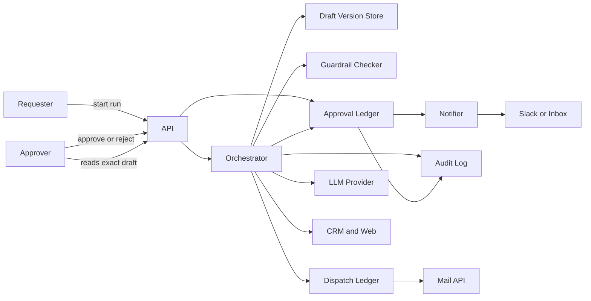
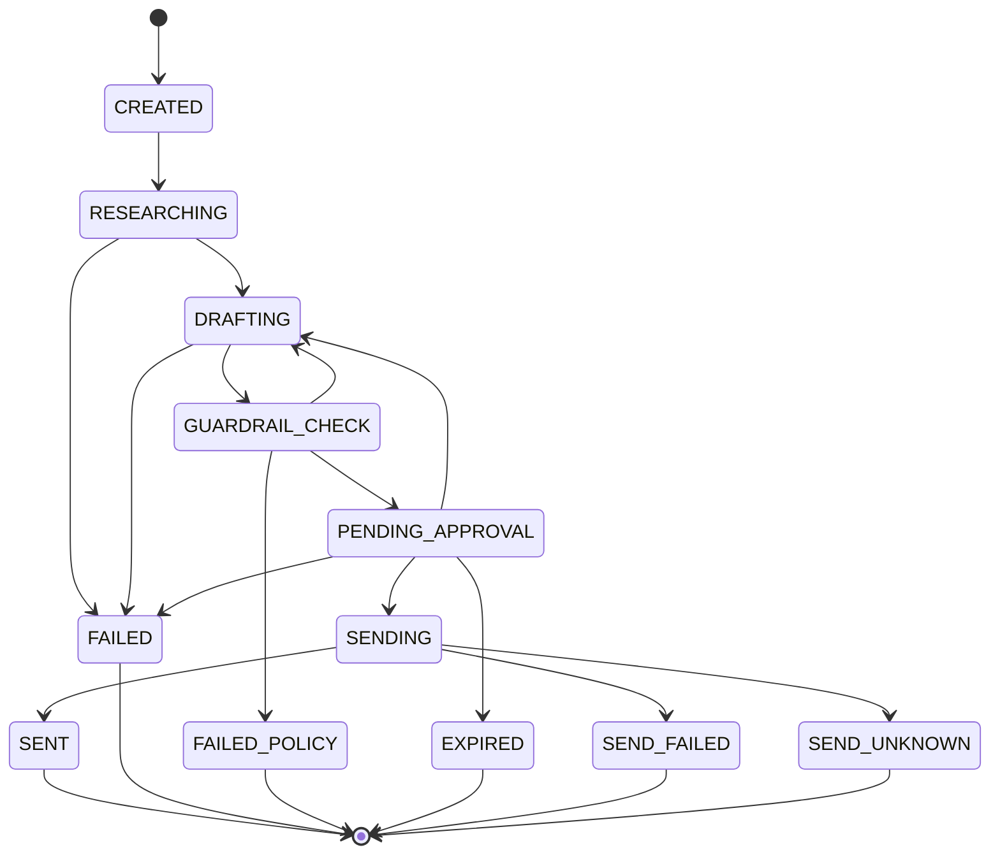

# Agentic HITL Approval Gate — Architecture Document
> - **Document Status**: Draft
> - **Last Updated**: 2026 Aug 29
> - **Author**: Paul Serban

An agentic outreach workflow (research → draft → guardrail check → human approval → send) that treats the human pause as a durable, server-enforced control, not a UI checkbox. The send tool is unauthorized until an approval record exists, bound to the exact draft that was reviewed. This document covers *what* the system is and *why* it is shaped this way; see [System Design](./03_system_design.md) for *how* the five sequences, the content-hash contract, and the dispatch ledger actually work, and [Trade-offs and Honest Assessment](./05_tradeoffs_and_honest_assessment.md) for what a human in the loop cannot buy.

## Overview

**Brief description**: Control plane for a single sequential agent run with one irreversible action behind an approval gate. Not a multi-agent platform, not an n8n product, not a generic BPM engine. The scarce resource under HITL is *authorization to mutate the world*, not CPU.

**Business Context**
- See [Scenario and Requirements](./01_scenario_and_requirements.md) for the full framing. In short: a confirm button is not a gate, the LLM cannot mint approval, stale approvals do not cover new drafts, and timeout must not send.
- Current state: in-process wait / n8n Wait-that-continues + Slack buttons + model-invocable send. That coupling is the defect.
- Desired future state: immutable draft versions, a policy checker that can fail the run, an approval ledger that is the only issuer of send-capability, a send adapter that checks that ledger and records dispatch before HTTP.
- Target users: requesting engineer, approver, compliance, on-call, the recipient, the mail-API owner.

## Requirements

### Functional Requirements

- **Run lifecycle**: the system must create a durable run record before any LLM or tool call is issued, and must not issue `send_email` for a run that lacks a valid approval decision for the current draft version.
- **Draft versions**: each draft is an immutable row with a `content_hash` over the canonical send payload (from, to, subject, body, headers we will actually send). There is no "update in place."
- **Guardrail check**: every new draft version is evaluated before an approval request is created. Fail closed. Results are stored and shown to the approver; they are not decorative.
- **Approval request**: one open request per run at a time, pointing at one `draft_version_id`. Creating the request notifies the reviewer channel. The run enters `PENDING_APPROVAL` and the orchestrator **releases the lease** (or holds a wait-lease that cannot execute send).
- **Decision**: Approve / Reject are authenticated, authorized, audited. Approve is valid only if hash matches, request is open, not expired, actor is in role and is not the requester.
- **Send**: after a valid approve, the orchestrator (not the LLM) calls the send adapter. Adapter: check approval, insert dispatch, HTTP, record outcome. Same dispatch-first rule as the cancellation project.
- **Reject / redraft**: reject closes the request, stores comments, returns the run to `DRAFTING`. The next draft is a new version. The old approval cannot be reused.
- **Expiry**: a worker closes open requests past TTL as `expired`. Late Approve is `stale`. No send.
- **Audit**: every transition (draft created, check result, request opened, notified, decided, sent, stale rejected) is an append-only event. Compliance reads this, not Slack.

### Non-Functional Requirements

**Performance Requirements:**
- Research + draft + guardrail: human-paced. Seconds to a small number of minutes is fine. Do not parallelize send with anything.
- Approval wait: 48 hours default TTL. The architecture must be correct at 5 minutes and at 5 days. In-memory wait is therefore illegal.
- Approve-to-send latency: once decided, send should follow on the order of seconds, not "next time a worker happens to poll" measured in hours. A short polling interval or a wakeup on decision is required. The gate is the human, not a sluggish queue after they clicked.
- Notification: best-effort with retry. Failure of Slack does not fail-open into send.

**Reliability Requirements:**
- **Crash during PENDING_APPROVAL** must resume waiting, not send, not lose the request.
- **Crash after approve, before send** must send exactly once (dispatch key on the draft version).
- **Crash after mail 200, before row** must not send again. Idempotency key of that attempt is still the key.
- **Duplicate Approve** is idempotent at the decision row *and* at the dispatch row.
- **Stale approve** (wrong hash, expired, superseded version) never dispatches.

**Infrastructure Constraints:**
- Technology shape (not an implementation mandate): an API for start-run and decide-approval; an orchestrator that runs research/draft/check and later send; a relational store for runs, draft versions, approval requests/decisions, guardrail results, dispatches, audit events; a notifier (Slack or email); outbound HTTPS to LLM, CRM, mail API; a small expiry/reconciliation worker.
- Hosting may be a custom orchestrator *or* n8n/Temporal **if and only if** the wait is a durable external state and timeout cannot continue into send. The engine is not the gate. See [ADR-002](./04_architecture_decision_records.md#adr-002).
- Secrets for LLM / CRM / mail live in the existing secret store. The LLM runtime must not be given the mail API credential. That is a load-bearing isolation, not a style preference.

**The defining constraint:**
- **Capability to send is not a prompt, not a UI, and not a workflow-node sequence. It is a record the send adapter verifies.** Architecture that skips that check is a demo. Architecture that binds the record to a content hash and an identity is the job.

## Executive Summary

The architecture is **Draft-Version-Then-Gate**. The orchestrator is a state machine over durable rows. The LLM is a researcher and a drafter with **no send tool**. The approval service is the only component that can mint a send-enabling decision. The send adapter is a bouncer: no matching decision, no HTTP.

**Architecture Style:** Orchestrated sequential workflow with a privileged, server-enforced approval gate and outbox-style dispatch recording. Not "Wait for webhook then send." Not "the model has a send function."

**Key Components:**
- **API / Run Admission**: start run, fetch status, fetch the exact draft the approver will see.
- **Orchestrator**: advances research, draft, guardrail; opens approval requests; on valid decision, runs send. Never lets the LLM call send.
- **Draft Version Store**: write-once versions and content hashes.
- **Guardrail Check Service**: policy on the canonical payload; fail closed.
- **Approval Gate / Ledger**: requests, decisions, expiry, authz.
- **Notification Service**: tell a human a request exists. Not a source of truth.
- **Send Adapter**: verify decision + dispatch-first + idempotency key.
- **Audit Log**: append-only events for compliance.
- **Expiry / Reconciliation Worker**: expire pending requests; resolve unknown sends (same unknown rules as the cancellation project if send is in flight).

**Architecture Principles:**
- **Default deny on the irreversible tool.** Send is not in the planner's tool list.
- **Approve the bytes, not the story.** Hash the canonical payload.
- **Humans are an additional control, not a replacement for policy.**
- **Pause is a row.** Process death is not a decision.
- **Timeout is deny.** A missing human is not consent.
- **Idempotency prevents duplicate sends; it does not implement undo.**
- **The notifier is a projector.** Slack is not the ledger.

**Key Architectural Decisions:**
1. Server-enforced approval bound to a content hash; never trusted from LLM output — [ADR-001](./04_architecture_decision_records.md#adr-001).
2. Durable, resumable pause over in-memory await — [ADR-002](./04_architecture_decision_records.md#adr-002).
3. Approval binds to an immutable draft version; edits mint a new version — [ADR-003](./04_architecture_decision_records.md#adr-003).
4. Automated guardrails pre-review and non-bypassable — [ADR-004](./04_architecture_decision_records.md#adr-004).
5. Idempotent, dispatch-ledger-based send — [ADR-005](./04_architecture_decision_records.md#adr-005).
6. Expiry-denies-by-default — [ADR-006](./04_architecture_decision_records.md#adr-006).
7. Role-scoped approver authorization; self-approval disallowed — [ADR-007](./04_architecture_decision_records.md#adr-007).

### Context Diagram

The mail API is reached only through the Send Adapter (drawn as dispatch → mail). The LLM provider is not on the path to mail. Slack is downstream of the ledger, never upstream of send.

## Runtime Architecture

1. **Admission**: requester POSTs a lead/prompt. API inserts `run` (`CREATED`), returns `run_id`. Orchestrator takes a *work* lease.
2. **Research**: mark `RESEARCHING`, call LLM + read tools, persist notes. Cancel/abandon of research is allowed; nothing irreversible has happened.
3. **Draft**: mark `DRAFTING`, produce canonical payload, insert `draft_versions` (immutable, hashed). The model does not get a `send_email` tool here or later.
4. **Guardrail**: mark `GUARDRAIL_CHECK`. Checker evaluates the payload. Fail → `FAILED_POLICY` or back to `DRAFTING` with a bounded retry count. Pass → persist results.
5. **Arm the gate**: insert `approval_requests` (`open`, TTL), audit, notify. Run → `PENDING_APPROVAL`. **Release the work lease.** Waiting is not a running worker.
6. **Human time**: approver fetches the draft (canonical body, not a summary-first view), guardrail report, recipient. Approves or rejects via API. Authz + hash check inside the approval service, in one transaction that closes the request.
7. **Wakeup**: decision write triggers a send job (queue/listen) *only* for `approved`. Reject → enqueue redraft. Expired → terminal or "requester must restart."
8. **Send**: orchestrator takes a work lease again, re-reads the decision (do not trust the wakeup payload alone), calls send adapter. Adapter verifies, records dispatch, calls mail, records outcome. Run → `SENT` or `SEND_UNKNOWN` / `SEND_FAILED`.
9. **Expiry worker**: close `open` requests past TTL; refuse late decisions; alert on pending age.

### Run state machine

`PENDING_APPROVAL` is a *wait* state: no worker is allowed to send. `SENDING` is only entered after a durable `approved` decision for the current `draft_version_id`. `DRAFTING` from `PENDING_APPROVAL` is reject/redraft, which mints a new version on the next successful draft. `EXPIRED` does not flow into `SENDING`.

Mapping decision → next:

| Event | Next run status |
| --- | --- |
| Guardrail fail, retries exhausted | `FAILED_POLICY` |
| Approval request opened | `PENDING_APPROVAL` |
| Authorized Approve, hash match, not expired | `SENDING` then `SENT` / fail / unknown |
| Authorized Reject | `DRAFTING` (new version required) |
| TTL elapsed with no decision | `EXPIRED` |
| Approve after expiry or on old version | stay / `EXPIRED`; decision recorded `stale`; no send |
| Requester tries to Approve | 403; stay `PENDING_APPROVAL` |

A `SENT` run that receives a late Reject stays `SENT`. Reject is not a time machine. Same spirit as late cancel in the sibling project.

## Components

### 1. API / Run Admission
**Purpose**: Speak HTTP without owning policy.

**Responsibilities:**
- Authenticate requester and approver separately. Starting a run and deciding a run are different permissions.
- `POST /runs`, `GET /runs/:id`, `GET /runs/:id/draft` (canonical payload + hash + guardrail report), `POST /approval-requests/:id/decisions`.
- Never accept `approved: true` from a client body that is not this decision endpoint. Never accept a draft body *as* the approval; the server loads the version by id and hashes it itself.
- Show the approver the canonical fields. If a summary is generated, it is labeled as non-authoritative.

**Interactions:**
- Writes: run create; decision insert (via approval ledger).
- Reads: draft store, gate, audit for status views.
- Does not call LLM or mail.

### 2. Orchestrator
**Purpose**: Be the only component allowed to start research, draft, check, or send.

**Responsibilities:**
- Lease the run while *working*. Do not hold a work lease for the entire human wait.
- Invoke LLM for research and draft only. Tool list: read tools. Not `send_email`.
- Insert draft versions; invoke guardrail; insert approval requests; on approved, invoke send adapter.
- Re-validate the decision at send time (status, hash, expiry, version id). The wakeup message is a hint.

**Interactions:**
- Reads/writes: run, drafts, gate, dispatch, audit.
- Outbound: LLM, CRM/web, send adapter.

**What it must not do:**
- Pass model-emitted `approval_id` through to send.
- Treat a Slack interaction payload as sufficient authorization without the ledger write.
- Keep `send_email` in the planner's schema "but instruct the model not to use it."

### 3. Draft Version Store
**Purpose**: Make "what was approved" a fact.

**Responsibilities:**
- Insert-only versions: `run_id`, `version`, `payload` (or payload ref), `content_hash`, `created_at`.
- `content_hash = sha256(canonical_form(from, to, cc, bcc, subject, body, reply_to))`. Canonical form is specified in System Design; changing whitespace rules changes hashes — version the canonicalizer.
- Current version pointer on the run. Approvals name a `draft_version_id`, not "whatever is current."

**Interactions:**
- Written by orchestrator on each draft.
- Read by API (approver view), guardrail, send adapter (hash check).

### 4. Guardrail Check Service
**Purpose**: Fail closed on policy before a human is even asked.

**Responsibilities:**
- Deterministic checks first: recipient domain allow/deny list, max recipients, forbidden header injection, empty body, from-address must be an org identity, basic PII regex/detectors as Phase 0 specifies.
- Optional model-assisted checks (prohibited claims, jailbreak/injection markers in *research input* and in *draft*). Model-assisted checks can false-negative; they do not replace the deterministic list. A model check that fails is a fail. A model check that passes is not a skip of the deterministic list.
- Persist `guardrail_results` per draft version. `pass` is required to open an approval request.

**Interactions:**
- Reads draft payload; may call an LLM for the soft checks.
- Writes results + audit.

**What it must not do:**
- "Warn and continue." v1 is pass/fail.
- Offer an `override=true` argument.

### 5. Approval Gate / Ledger
**Purpose**: Be the only issuer of send-enabling decisions. This is the system of record for the gate.

**Responsibilities:**
- Insert `approval_requests` (`open`, `expires_at`, `draft_version_id`, `content_hash` copy).
- Insert `approval_decisions` in a transaction that transitions the request to `approved` | `rejected` | refuses `stale`. Unique: one *effective* decision per request. A stale attempt is recorded as an event, not as a second effective decision.
- Authz: actor in `approver` role (or named list), `actor_id != run.requester_id`.
- Compare caller-supplied `expected_content_hash` (from the UI that loaded the draft) to the stored hash. Mismatch → `stale` (the page was old).
- Expiry: `open` AND `now > expires_at` is not approvable.

**Interactions:**
- Written by API (decisions) and orchestrator (requests) and expiry worker.
- Read by send adapter (mandatory).

### 6. Notification Service
**Purpose**: Make a human aware. Not a control.

**Responsibilities:**
- On request opened: send a message with a link to the approval UI (our API), not with a "the next Slack button click is the send." Slack buttons may *call our decision API*; they must not contain the draft body as the only copy of record, and they must send `expected_content_hash`.
- Retry on failure. Alert if undelivered. Never on failure: send the customer email.
- Duplicate notifications on worker restart are allowed. Duplicate sends are not.

**Interactions:**
- Reads request + deep link.
- Outbound: Slack/email.

### 7. Send Adapter
**Purpose**: Last bouncer and dispatch ledger.

**Responsibilities:**
- Load approval decision for this `run_id` + `draft_version_id`. Must be `approved`, unexpired *at decision time*, hash equal to current version hash, request not superseded.
- Insert `send_dispatches` with `idempotency_key = hash(run_id, draft_version_id, attempt)` **then** HTTP to mail API, then outcome. See [ADR-005](./04_architecture_decision_records.md#adr-005).
- Timeouts → `unknown`, not auto-retry with a new key. Same as the cancellation project.

**Interactions:**
- Reads: gate, draft store.
- Writes: dispatch, run status, audit.
- Outbound: mail API only.

**What it must not do:**
- Accept a `skip_approval` parameter.
- Live in the same process/package as the LLM tool runner in a way that the model can invoke it as a function. Process isolation is preferred; a hard code-level non-export to the tool registry is the minimum.

### 8. Audit Log
**Purpose**: Answer "who sent what, who approved it, which hash."

**Responsibilities:**
- Append events. No updates, no deletes as a correctness mechanism.
- Enough to reconstruct the success-criteria audit without Slack.

**Interactions:**
- Written by orchestrator, gate, adapter, expiry worker.
- Read by compliance export and support view.

### 9. Expiry / Reconciliation Worker
**Purpose**: Close the "nobody looked" window and the send-unknown window.

**Responsibilities:**
- Expire open requests.
- Reconcile `SEND_UNKNOWN` against the mail API by idempotency key; never "just resend."
- Alert on pending older than a warning threshold (e.g. 24h of a 48h TTL) so expiry is not a surprise.

**Interactions:**
- Reads/writes gate and dispatch; outbound lookup to mail if Phase 0 found a lookup API.

### Communication Patterns

**Synchronous:**
- Requester/approver ↔ API.
- Orchestrator ↔ LLM (research/draft).
- Orchestrator ↔ CRM/web.
- Send adapter ↔ mail API.
- Orchestrator ↔ guardrail (in-process or HTTP; still fail closed).

**Asynchronous / out-of-band:**
- Human wait (hours–days). The run row *is* the queue.
- Decision → wakeup to send worker.
- Notification retries.
- Expiry timer.

## Scaling Strategy

**Current Scale Requirements:**
- Human-paced outreach. Tens to low thousands of concurrent *pending* runs is a product question; correctness does not change. Concurrent *in-flight sends* should stay small; the bottleneck is humans.

**What does not need to scale in v1:**
- A Kafka backbone. The database is the queue of pending approvals and of send jobs.
- Multi-approver quorum (two of three). Real, and out of scope. v1 is one authorized approver. Quorum is a different state machine (partial collects, expiry of the set). Do not fake it with "two Slack reactions."
- Horizontal send workers without a unique dispatch key. Two workers on one approved run is a double-send. Unique key + lease.

**What is already the ceiling:**
- Human SLA. Architecture cannot make reviewers fast. If pending pile-up is the failure, that is a staffing/product problem (smaller blast radius, better notification, fewer runs). Adding auto-send on timeout is how you "scale" into an incident.

**If volume grows:**
- Queue the send job after decision; still unique on `draft_version_id`.
- Multiple notification channels. Still one ledger.
- Do not "scale" by giving the model the send tool on a trusted-user allowlist. That is how you scale incidents among seniors.

**Bottleneck Analysis:**
- Primary: time-to-decision. Design for visibility (queue of pending, age alerts), not for skipping the gate.
- Secondary: LLM research/draft cost on redraft loops. Bound redrafts.
- Tertiary: mail API idempotency support. If missing, our dispatch row is the only fuse; one leased sender per version is non-negotiable.

## Data Architecture

### Data Model

**Key Entities:**
- **Run**: requester, lead/prompt ref, status, current `draft_version_id`, work lease (only while researching/drafting/sending).
- **DraftVersion**: immutable payload + `content_hash` + version number.
- **GuardrailResult**: per version, pass/fail, rule ids, evidence pointers.
- **ApprovalRequest**: open/approved/rejected/expired, `expires_at`, hash copy, notify status.
- **ApprovalDecision**: actor, type, `expected_content_hash`, timestamp, `effective` bool (stale attempts are `effective=false`).
- **SendDispatch**: outbox row, idempotency key, outcome.
- **AuditEvent**: append-only.
- **ApproverBinding**: who may approve (role or explicit list). Not "the Slack channel roster" as the only source — directory must be readable by the API.

**Entity Relationships:**
- Run 1—N DraftVersions; DraftVersion 1—1 GuardrailResult set; DraftVersion 1—N ApprovalRequests (usually 1); ApprovalRequest 1—N Decisions (at most one effective); DraftVersion 1—N SendDispatches (attempts).

### Data Lifecycle

**Create**: run at admission; draft version on each draft; approval request only after guardrail pass; dispatch before send HTTP.

**Read**: orchestrator, API, send adapter (mandatory read of decision), compliance.

**Update**: request status forward-only; run status per state machine. Hash never updates. Payload never updates.

**Delete**: not as a correctness mechanism. Retention: drafts may contain PII/prospect data. Finance/legal retention for audit + dispatch may exceed chat retention. Do not cascade-delete the proof of a send because the CRM contact was removed. Flag for a later compliance design; do not "just GDPR-delete the hash that authorized the email."

**Notification copies**: Slack will retain a preview. Treat that as an uncontrolled copy. The ledger is still canonical. Phase 0 asks whether putting draft bodies in Slack is allowed; if not, the Slack message is a link only.

## Cost Analysis

### Cost Components

**Money (vendors):**
- LLM tokens for research, draft, optional model-assisted guardrail, redrafts. Redrafts are the cost multiplier HITL actually adds.
- Mail API per accepted send.
- Slack/notification: negligible unless you notify a thousand-person channel (don't).

**Money (us):**
- Database, orchestrator, expiry worker, a small UI.
- **Approver time** — this is the real opex. A design that needs a senior AE to read every email does not "scale with agents"; it scales with headcount. Be honest in the portfolio write-up.

**Risk cost of a missing gate:**
- One unsupervised send to the wrong person is an incident. The architecture spends complexity to make that send *unable* to happen without a ledger row.

### Cost Optimization

- Do not stream five draft variants for the human to pick from in v1. One draft, reject-to-redraft. Variants are N× review cost.
- Deterministic guardrails before any LLM-as-judge, so you don't pay a model to catch an obviously-external recipient domain.
- Check cancel/abandon *before* draft if the requester already walked away (if product has abandon). Do not wait for a human on a run nobody wants.
- Do not research+draft speculatively in parallel with "pre-approving the template." Pre-approval of a template is not approval of this payload. That shortcut is the stale-hash bug with extra steps.

## Risks and Mitigation

| Risk | Likelihood | Impact | Mitigation Strategy | Owner |
| --- | --- | --- | --- | --- |
| LLM or research text claims approval; send fires | High if send is a model tool | High | Send not in tool list; adapter checks ledger ([ADR-001](./04_architecture_decision_records.md#adr-001)) | Orchestrator / adapter |
| Wait-timeout auto-sends | High with default n8n Wait | High | Expiry = deny ([ADR-006](./04_architecture_decision_records.md#adr-006)); engine config is a Phase 0 kill item | Orchestrator |
| Approval of v1 sends v2 | High if payload is mutable | High | Immutable versions + hash bind ([ADR-003](./04_architecture_decision_records.md#adr-003)) | Draft store / gate |
| Approver rubber-stamps a summary | High | High | UI shows canonical body; summary secondary; hash of full payload | API / product |
| Self-approval | High in small teams | Medium–High | Actor ≠ requester ([ADR-007](./04_architecture_decision_records.md#adr-007)); if team of one, do not claim HITL | Gate |
| Double Approve / two reviewers | High | High | One effective decision + dispatch unique key ([ADR-005](./04_architecture_decision_records.md#adr-005)) | Gate / adapter |
| Guardrail bypass "because a human looked" | Medium | High | No override in v1 ([ADR-004](./04_architecture_decision_records.md#adr-004)) | Guardrail |
| Slack is treated as system of record | High | High | Ledger is SoR; Slack is a projector | Notify |
| Draft body in Slack violates data policy | Medium | High | Link-only notifications if Phase 0 says so | Phase 0 / notify |
| Process restart during wait drops the gate or double-sends | High with in-memory wait | High | Durable pause ([ADR-002](./04_architecture_decision_records.md#adr-002)) | Orchestrator |
| Mail API has no idempotency | Medium | High | Local dispatch unique + single leased sender; Phase 0 | Adapter |
| Pending pile-up; people then demand timeout-send | High | High | Age alerts; refuse the product change in this architecture | Product / this doc |
| Isolation fail: model runtime has mail credentials | Medium | High | Credential not mounted on the draft worker | Infra |
| Humans are bad reviewers | High | Medium | Guardrails still exist; HITL is not a safety proof | Honest assessment |

## Future Enhancements

### Phase 1 (Current)
**Focus**: Durable run + immutable draft versions. Send feature-flagged off. See [Phased Implementation Plan](./06_phased_implementation_plan.md).

### Phase 2
**Focus**: Guardrail pipeline on every version, fail closed.

### Phase 3
**Focus**: Approval ledger, authz, hash bind, expiry, notifications. Send still dry-run.

### Phase 4
**Focus**: Send adapter, dispatch ledger, enable real sends behind a flag.

### Phase 5
**Focus**: Audit export, pending-age alerts, metrics, runbook.

### Technical Debt (accepted)

- Single approver, no quorum.
- No break-glass override. If a CEO wants to send a failing-policy email, they use a different, fully-manual tool, not this agent.
- Human reconciliation when mail unknown cannot be queried.
- Sequential research → draft only. No multi-agent reviewer.
- n8n-as-host is allowed only with the Wait-timeout-cannot-send constraint; the interesting code is still the ledger, not the canvas.
- No undo of a send. Gate reduces how often you need the cancellation project's drain path; it does not delete it.
