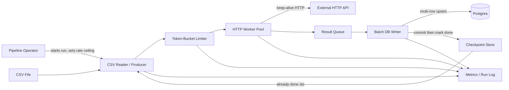

# Batch Enrichment Pipeline — Architecture Document
> - **Document Status**: Draft
> - **Last Updated**: 2026 Aug 29
> - **Author**: Paul Serban

A batch enrichment pipeline that reads a CSV of ~200,000 rows, calls an external HTTP API once per row under an explicit rate limit, and writes results to Postgres in batches — with checkpoints so a multi-hour run can fail without starting over. This document covers *what* the system is and *why* it is shaped this way; see [System Design](./03_system_design.md) for *how* the limiter, queue, batching, retries, and measurement actually work.

## Overview

**Brief description**: This is internal data-enrichment infrastructure, not a customer-facing product. It is scoped narrowly on purpose: one input file in, one Postgres table of enrichments out, per run.

**Business Context**
- See [Business Overview](./01_business_overview.md) for the full framing. In short: 200,000 rows in six hours is ~108 ms/row and ~9.26 req/s — the signature of a serial HTTP loop — and a 10 req/s hard cap pins the floor at ~5 h 33 m.
- Target users: pipeline operator, downstream table consumer, and (off to the side) the external API owner.

## Requirements

### Functional Requirements

- **CSV intake**: the system must read the source file as a stream, not as a fully-buffered in-memory table of 200,000 parsed objects plus their API responses. A stable per-row identity (column or derived key) must be available for idempotency and checkpointing.
- **Per-row enrichment**: the system must call the external HTTP API once per source row that still needs enrichment. It must not invent a batch API the vendor does not offer.
- **Rate-limited egress**: every attempt against the API — including retries — must pass through a single limiter. The configured ceiling is a run parameter (unconstrained-but-conservative, or 10 req/s, or whatever Phase 0 discovers).
- **Durable write**: successful enrichments must be persisted to Postgres via batched, transactional writes, upserted on the source-row identity.
- **Resume**: a killed or crashed run must restart from the checkpoint and skip rows already persisted, not from row 0 of the CSV.
- **Observability**: every run must emit per-phase timings, throughput, HTTP status histograms (including 429), queue depth, batch-write latency, and checkpoint age.
- **Canary execution**: the system must be able to run against a fixed sample of rows (on the order of 5,000) with the same code path as a full run, writing to a canary table or a filtered keyspace, so each change can be confirmed before a 200,000-row execution.

### Non-Functional Requirements

**Performance Requirements:**
- Traffic profile: one (or a few) long-running jobs, not a high-QPS service. The scarce resource is *API tokens per second*, not CPU.
- Wall-clock: in the 10 req/s regime, a clean run's expected duration is ~5 h 33 m plus measured overhead. The architecture will not claim a number below that floor while the contract remains 1 call per row.
- In the unconstrained regime, wall-clock is `max(API_bound, DB_bound, CPU_bound)` under a *measured* concurrency cap — not "as fast as we can spawn."
- CSV parse and Postgres write must not be on the critical path of the 108 ms/row average once Phase 1 is done; if they still are, Phase 0's hypothesis was wrong and the plan changes.

**Reliability Requirements:**
- **At-least-once processing with idempotent persistence.** Duplicates on retry or resume are a defect.
- **No unbounded retry.** Retries have a budget, honor `Retry-After`, and consume limiter tokens.
- **Bounded memory.** Queue depth between fetch and write is capped; backpressure stops the producer rather than growing until OOM at hour three.
- **Bounded concurrency.** Worker count is a configured ceiling, not "one goroutine/thread per remaining row."

**Infrastructure Constraints:**
- Technology stack (illustrative, language-agnostic where it matters): a streaming CSV reader; an HTTP client with connection pooling / keep-alive; a token-bucket rate limiter; a bounded in-process queue; a Postgres driver that supports multi-row inserts or `COPY`; a small checkpoint table or sidecar file; structured metrics.
- Hosting: a single worker process (or a small, explicitly-sized pool of processes sharing one limiter) on a machine that can keep a six-hour process alive. Distributed fan-out across many machines is out of scope for v1 — it adds coordination cost that the 10 req/s cap makes pointless.
- Compliance: none formal. The API credential and the CSV (which may contain PII) are still treated as secrets/sensitive data: not logged in full, not written to world-readable temp files.

## Executive Summary

The pipeline is a **single process, four-stage flow**: stream the CSV, acquire a rate-limit token, fetch, enqueue the result, batch-write to Postgres, and checkpoint. One architecture serves both capacity regimes. The limiter's configured rate is what changes when the API owner says "10 per second." Almost nothing else does.

**Architecture Style:** Streaming producer/consumer with a first-class rate limiter, bounded async workers, and batched durable writes. Not a microservices design. Not a thread-per-row design. Not a "rewrite in a faster language" project — the 108 ms is not CPU.

**Key Components:**
- **CSV Reader / Producer**: streams rows, assigns/reads a stable source id, skips already-checkpointed ids.
- **Token-Bucket Rate Limiter**: the only door to the API. Workers block on a token, they do not fire and hope.
- **HTTP Worker Pool**: a fixed-size pool of concurrent in-flight requests, each using a shared keep-alive connection pool.
- **Result Queue**: bounded in-memory (or local) queue decoupling fetch latency from DB write latency.
- **Batch DB Writer**: drains the queue into multi-row upserts / `COPY` in chunked transactions.
- **Checkpoint Store**: durable high-water mark / processed-id set, updated on successful commit, not on HTTP 200.
- **Observability**: per-phase timers and run-level counters that exist in Phase 0, before any optimization.

**Architecture Principles:**
- **The API owns the floor; we own the waste.** Concurrency cannot create capacity the vendor did not grant.
- **Instrument first, change second, one knob at a time.** A rewrite that moves three things cannot tell you which one helped.
- **Retries are traffic.** They go through the limiter. They are not free.
- **Persist then checkpoint.** A crash between HTTP 200 and commit must re-fetch; a crash after commit must not.
- **Backpressure over buffering.** If Postgres is slow, workers slow down. They do not pile 200,000 responses in RAM.

**Key Architectural Decisions:**
1. A **bounded worker pool**, not unbounded parallelism ([ADR-001](./04_architecture_decision_records.md#adr-001)).
2. A **token-bucket limiter as a first-class component**, not reactive 429 handling alone ([ADR-002](./04_architecture_decision_records.md#adr-002)).
3. **Decoupled fetch and write** via an internal queue ([ADR-003](./04_architecture_decision_records.md#adr-003)).
4. **Batched, transactional writes** instead of per-row autocommit ([ADR-004](./04_architecture_decision_records.md#adr-004)).
5. **Checkpoint + idempotent upsert**, not all-or-nothing restart ([ADR-005](./04_architecture_decision_records.md#adr-005)).
6. **Measure-first staged rollout**, not a single rewrite ([ADR-006](./04_architecture_decision_records.md#adr-006)).

### Context Diagram

## Runtime Architecture

1. **Intake**: the operator starts a run with a file path, a rate ceiling, a worker-pool size, and a sample/canary flag. The reader opens the CSV as a stream and loads the checkpoint.
2. **Pacing layer**: each row that still needs work waits for a limiter token before a worker is allowed to call the API.
3. **Fetch layer**: workers issue HTTP requests on a shared connection pool, classify responses (success / retryable / fatal / 429), and either enqueue a result, schedule a retry (which must re-acquire a token), or send the row to a dead-letter path.
4. **Write layer**: the batch writer drains the result queue, upserts in chunks, commits, then advances the checkpoint for those source ids.
5. **Control layer**: if the queue is full, producers block. If 429s appear, the limiter tightens. If a stop/kill signal arrives, in-flight requests may finish, the current batch commits, the checkpoint is flushed, and the process exits.
6. **Telemetry**: independent of success — every run produces timings and counters that Phase 0 already defined, so later phases have something to compare against.

## Components

### 1. CSV Reader / Producer
**Purpose**: Turn a file into a stream of work items without loading the job into memory, and without re-offering work that is already durable.

**Responsibilities:**
- Stream-parse the CSV; fail fast on schema drift (unexpected columns, missing identity column).
- Resolve a stable `source_id` per row.
- Filter out ids present in the checkpoint / already in Postgres (the checkpoint is the fast path; the unique constraint is the backstop).
- Push work items only as fast as the limiter and the result queue allow (backpressure).

**Interactions:**
- Reads: the CSV file, the Checkpoint Store.
- Feeds: the Rate Limiter / Worker Pool.
- Emits: parse timings and row-offered counters to Observability.

### 2. Token-Bucket Rate Limiter
**Purpose**: Be the single, process-wide authority on how often the API is touched — including retries.

**Responsibilities:**
- Issue tokens at a configured rate `r` with a small burst `b` (burst is deliberately tiny; see [System Design](./03_system_design.md#2-rate-limiter)).
- Block callers when empty rather than letting them hit the network.
- Tighten on 429 / `Retry-After` (temporary rate reduction, not "sleep in the worker and keep the configured rate").
- Expose tokens-granted, wait-time, and currently-configured-r to metrics.

**Interactions:**
- Called by: every HTTP attempt in the Worker Pool.
- Informed by: 429 classifier in the Worker Pool.

This is the component whose *configuration* changes when the API owner says 10 req/s. Its *existence* does not.

### 3. HTTP Worker Pool
**Purpose**: Keep a bounded number of requests in flight so HTTP wait can overlap — up to, and never past, what the limiter allows.

**Responsibilities:**
- Maintain `N` concurrent workers, `N` chosen from latency-vs-rate (if 10 req/s and p99 latency is 200 ms, you need on the order of 2 in-flight requests, not 200).
- Share one connection pool with keep-alive / TLS reuse.
- Enforce per-request timeouts. A hung vendor must not pin a worker forever.
- Classify errors per [System Design — Error Handling](./03_system_design.md#7-error-handling).

**Interactions:**
- Waits on: the Rate Limiter.
- Calls: the External HTTP API.
- Writes: the Result Queue (successes) or a retry/dead-letter path (failures).

**Honesty about pool size:** under a 10 req/s cap, a large pool is not "more throughput." It is more requests waiting on tokens, more memory, and a bigger retry blast radius if you misconfigure the limiter. `N` is sized to cover in-flight latency, not to impress.

### 4. Result Queue
**Purpose**: Decouple "API answered" from "Postgres committed" so a slow commit does not stall every HTTP worker, and a fast API does not require a matching per-row insert.

**Responsibilities:**
- Bounded depth. Full = backpressure to workers, which then stop taking tokens.
- Preserve enough data to upsert (`source_id`, payload, maybe original row fields needed for the write).
- Not a durable queue in v1. Durability is Postgres + checkpoint. A crash loses in-flight and in-queue items; they are re-fetched on resume. That is accepted, documented, and cheaper than introducing Kafka for a single job ([ADR-003](./04_architecture_decision_records.md#adr-003)).

**Interactions:**
- Produced by: Worker Pool.
- Consumed by: Batch DB Writer.

### 5. Batch DB Writer
**Purpose**: Turn a stream of successful enrichments into few, large, transactional upserts instead of 200,000 autocommits.

**Responsibilities:**
- Buffer to a chunk size (see [System Design](./03_system_design.md#4-batch-writes) for sizing).
- `INSERT ... ON CONFLICT (source_id) DO UPDATE` or equivalent; never insert-only.
- Commit per chunk, then notify the Checkpoint Store.
- Flush on shutdown so a graceful stop does not leave a full buffer uncommitted.

**Interactions:**
- Reads: Result Queue.
- Writes: Postgres, then Checkpoint Store.
- Emits: batch size, commit latency, rows-committed to Observability.

### 6. Checkpoint Store
**Purpose**: Make a 5-to-6-hour run restartable.

**Responsibilities:**
- Record source ids (or a contiguous offset, if the CSV order is stable *and* processing is sequential — it will not be, once workers are concurrent, so v1 is a **set of completed ids**, not a single integer offset; see [System Design](./03_system_design.md#6-checkpoint-and-resume)).
- Update only after the corresponding Postgres commit.
- Be itself durable (a Postgres table in the same database is the obvious choice: one transaction can commit rows + checkpoint).

**Interactions:**
- Written by: Batch DB Writer (same transaction if co-located).
- Read by: CSV Reader at startup.

### 7. Observability
**Purpose**: Make "did this change help?" an empirical question rather than a feeling after a six-hour run.

**Responsibilities:**
- Phase timers: CSV parse, limiter wait, HTTP wait (TTFB and total), enqueue, DB commit.
- Counters: rows offered, skipped-as-done, HTTP 2xx/4xx/5xx/429, retries, dead-letters, rows committed, duplicates caught by upsert.
- Canary mode: same metrics, smaller N, comparable histograms.

**Interactions:**
- Fed by: every other component, from Phase 0 onward — including the *existing* script, before the new pipeline exists.

### Communication Patterns

**Synchronous:**
- Worker ↔ API: blocking or async HTTP with an enforced timeout.
- Worker ↔ Limiter: blocking token acquire.
- Writer ↔ Postgres: blocking commit of a batch.

**In-process asynchronous:**
- Result Queue between workers and writer. Not a network hop.

**Human-paced:**
- Operator starts the run, reads the canary report, decides to go to 200k. No auto-approve of a full run after a red canary.

## Scaling Strategy

**Current Scale Requirements:**
- 200,000 rows, one job, one API, one Postgres. Duration in hours, not milliseconds. Concurrency in single digits to low tens of in-flight requests, not thousands.

**Scaling Strategy:**

**Vertical (the only path that matters in v1):** make *this process* overlap I/O, reuse connections, batch writes, and pace at the allowed rate. That is the entire scale-up for 200k.

**Horizontal (explicitly rejected for v1):** splitting the CSV across machines does not increase a 10 req/s global cap unless each machine has its *own* quota, which it will not. It does increase the chance of exceeding the cap (two processes, no shared limiter). Revisit only if the vendor grants per-key quotas or a bulk path.

**Bottleneck Analysis:**
- **Primary bottleneck, before measuring:** HTTP wait, serial. See [Trade-offs](./05_tradeoffs_and_honest_assessment.md).
- **Primary bottleneck, after a 10 req/s disclosure:** the limiter, by design. If something else is the bottleneck at 10 req/s, we have failed Phase 1.
- **Secondary:** connection setup (if keep-alive is off), then per-row commits. CSV parse is not on the list until a profiler shows it.
- **Hidden bottleneck:** retries. A 5% retry rate at 10 req/s turns a 5 h 33 m run into ~5 h 50 m *and* still may not finish if retries cascade. This is why Phase 3 exists.

**Monitoring and Triggers:**
- If sustained throughput sits well below the configured `r` with a non-empty work queue, the bottleneck has moved (DB, CPU, lock, DNS) — investigate before raising `N`.
- If 429 rate is non-zero, *lower* `r`, do not raise `N`.
- Scale-out of the job (more rows next quarter) is a linear stretch of wall-clock at fixed `r`. 400,000 rows at 10 req/s is ~11 hours. That is a business conversation, not a new architecture — unless they also want it daily, in which case see Phase 4.

## Data Architecture

### Data Model

**Key Entities:**
- **SourceRow**: identity + fields needed to call the API. Not necessarily stored; may be read only from CSV.
- **Enrichment**: `source_id` (unique), payload from the API, fetched_at, http_status, run_id.
- **CheckpointEntry**: `source_id` (unique), committed_at, run_id. May be the same table as Enrichment: "row exists" *is* the checkpoint if writes are upserts and the reader consults Postgres at start. A separate checkpoint is only justified if probing Postgres per row at start is too slow — 200,000 primary-key lookups at start is usually fine; a single `SELECT source_id FROM enrichments` into a hash set is cheaper than it sounds.
- **Run**: id, started_at, finished_at, rate_ceiling, worker_n, sample_flag, counters snapshot.
- **DeadLetter**: `source_id`, last_error, attempt_count, payload-or-snippet. Manual inspection, not silent drop.

**Entity Relationships:**
- One SourceRow maps to at most one Enrichment (unique `source_id`).
- One Run produces many Enrichments; a resumed Run is a new Run id that continues filling the same Enrichment table.

### Data Lifecycle

**Create**: Enrichment rows are upserted as batches commit.

**Read**: downstream consumers read the Enrichment table; the next run reads identities to skip.

**Update**: upsert on re-fetch (retry, resume, or a deliberate re-enrichment run). Last-write-wins unless a business rule says otherwise — if the API is not a snapshot, document that a resume can observably change a row.

**Delete**: not in the happy path. Dead-letter and old run metadata follow a retention policy the operator sets. The CSV file is the operator's problem to archive; this pipeline does not become a data lake.

## Cost Analysis

### Cost Components

**API quota / vendor bill:** usually the real cost. At 10 req/s, 200,000 calls is 200,000 units of whatever they charge, plus retries. Reducing retries is a cost optimization. Reducing *successful* calls requires a product change (caching identical keys, skipping rows that do not need enrichment) — worth asking, often forgotten. If 20% of CSV rows share a lookup key, a memoization cache is a bigger win than any worker pool.

**Compute:** one process for ~6 hours. Trivial next to six hours of engineer time spent rewriting it, and trivial next to vendor API cost.

**Postgres:** 200,000 upserts, batched, is cheap. Per-row autocommit on a remote instance is the version that can show up on IOPS bills and on wall-clock.

**Engineer time — the cost this project can actually waste:** rewriting the job as a distributed queue system to save 27 minutes under a 10 req/s cap is a cost failure. Phase 4 (asking for a bulk endpoint) is the high-leverage spend if 5 h 33 m is too slow.

### Cost Optimization

- Deduplicate lookup keys before calling the API, if the CSV is not already unique on the request shape. This is not in the scenario as stated (1 call per *row*), so it is optional and must be justified by a measured duplicate-key rate in Phase 0. If that rate is near zero, do not build a cache.
- Connection reuse: reduces latency and CPU on both sides; cheap.
- Do not build Kubernetes autoscaling, Kafka, or a fleet of workers for v1.

## Risks and Mitigation

| Risk | Likelihood | Impact | Mitigation Strategy | Owner |
| --- | --- | --- | --- | --- |
| Hypothesis is wrong: time is in DNS, a remote DB, or row-level locks, not HTTP | Medium | High if we "fix" the wrong thing | Phase 0 timers before any optimization ([ADR-006](./04_architecture_decision_records.md#adr-006)) | Operator |
| Bursting past an unpublished limit gets the credential banned | Medium | High | Conservative `r` even in the unconstrained regime; limiter exists before large `N` | Operator |
| 10 req/s includes retries; naive retry inflates wall-clock and 429s | High | Medium | Retries consume tokens; honor `Retry-After`; cap attempts | Limiter + Worker Pool |
| Unbounded queue / unbounded workers OOM at hour 3 | Medium | High | Hard caps on `N` and queue depth; backpressure | Worker Pool + Queue |
| Resume duplicates rows | High without design | High | Unique `source_id` + upsert; checkpoint after commit ([ADR-005](./04_architecture_decision_records.md#adr-005)) | Writer |
| Stakeholders expect sub-hour runtime after "we parallelized it" | High | Medium (political) | Floor arithmetic in every status update; Phase 4 if the floor is unacceptable | Operator |
| CSV has no stable identity | Medium | High | Phase 0 rejects the run until an identity exists (hash of business keys, or explicit column) | Reader |
| Idempotent upsert last-write-wins races with two processes | Low in v1 (single process) | High if someone "helps" by running two copies | Advisory lock on run start; document "one runner" | Operator |

## Future Enhancements

### Phase 1 (Current)
**Focus**: Instrument, strip serial waste, pace, persist safely — see [Phased Implementation Plan](./06_phased_implementation_plan.md).

### Phase 2 (Post-hardening)
**Focus**: Only if Phase 0 found duplicate lookup keys, add a memoization cache keyed on the request shape so identical rows share one call. This is the rare optimization that *does* beat the 10 req/s × 200,000 floor, because it reduces *N*, not because it cheats the limiter.

### Phase 3 (Conditional)
**Focus**: Vendor bulk/batch endpoint or a higher cap — [Phase 4 of the implementation plan](./06_phased_implementation_plan.md#phase-4--conditional-capacity-negotiation). May never trigger. That is an acceptable outcome.

### Technical Debt

**Known/Accepted Trade-offs:**
- In-process queue, not a durable bus — accepted for a single job; in-flight work is replayed on crash.
- Single process — accepted because a global 10 req/s cap does not divide.
- No attempt to parse the CSV in a faster language or to "use a thread pool in C++" — the 108 ms is not CPU, and claiming otherwise before Phase 0 is the actual debt.
