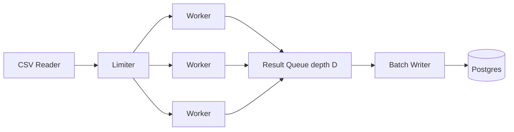
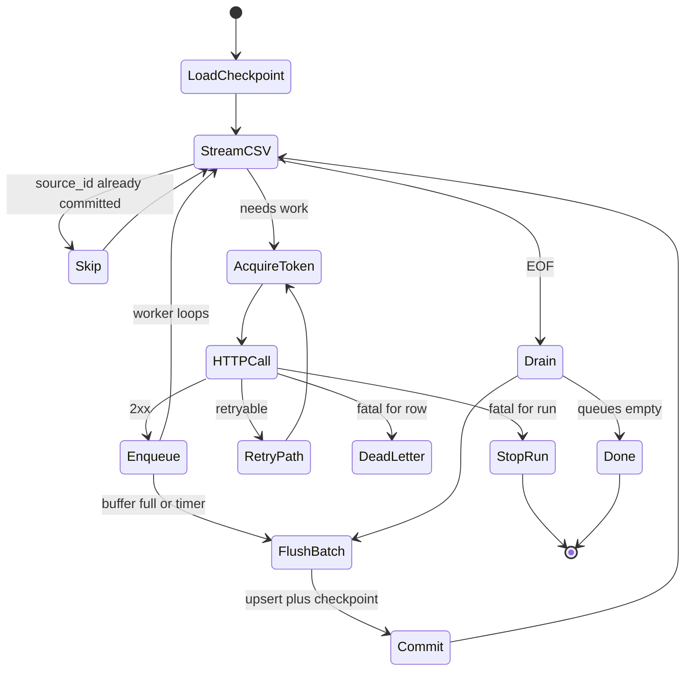

# Batch Enrichment Pipeline — System Design
> - **Document Status**: Draft
> - **Last Updated**: 2026 Aug 29
> - **Author**: Paul Serban

This document describes *how* the pipeline works internally: what is timed, how the limiter and worker pool interact, how fetch is decoupled from write, how batches and transactions are sized, how retries consume the same budget as new work, how checkpoints make a multi-hour run resumable, and how each change is confirmed. It complements the [Architecture Document](./02_architecture_document.md), which covers *what* the system is and *why*.

> This is a design specification. No pipeline code is implemented as part of this documentation deliverable — names below describe the intended future implementation.

## 1. Instrumentation (exists before any optimization)

Phase 0 does not make the job faster. It makes the next five phases honest.

### What to time

Every row (or a 1-in-N sample of rows on the full 200k run, and every row on the 5,000-row canary) records:

| Span | Start | End | What a large number means |
| --- | --- | --- | --- |
| `parse` | next CSV record begins | row object ready, `source_id` assigned | CPU / disk; expected tiny |
| `checkpoint_lookup` | skip-check begins | decision to work or skip | Slow skip-check (should be in-memory set after load) |
| `limiter_wait` | token acquire starts | token granted | We are healthy and pacing, or `r` is too low |
| `http_connect` | request starts | TCP/TLS established or connection reused | Keep-alive is off or the pool is thrashing |
| `http_ttfb` | request starts | first response byte | Vendor + network |
| `http_total` | request starts | body fully read | Vendor + network + large payload |
| `enqueue` | result ready | accepted by queue | Queue is full (backpressure) |
| `db_wait_in_buffer` | enqueued | included in a flush | Writer is slow or chunk is large |
| `db_commit` | flush starts | commit returns | Per-row autocommit, remote DB, or missing index on `source_id` |

Also, run-level counters, not per-row: `rows_offered`, `rows_skipped_done`, `http_2xx`, `http_429`, `http_5xx`, `retries_scheduled`, `dead_letters`, `rows_upserted`, `upsert_conflicts` (conflicts on resume are *expected*; conflicts on a first pass of a unique file are a smell).

### How to time without lying

- Use monotonic clocks, not wall-clock subtraction across NTP steps.
- Do not log a line per row on the 200k path — that can *become* the bottleneck. Histograms + counters. Per-row traces only on the canary or a sampled 0.1%.
- The baseline is the **existing serial script** with these spans added, run against the same 5,000-row sample that later phases will use. A new pipeline's "faster than an unmeasured 6 hours" is not a confirmation.

### Confirmation protocol (used by every later phase)

1. **Fixed sample.** 5,000 rows drawn once from the real file (not the first 5,000 if that slice is unrepresentative — stratify if there are types), frozen as `sample.csv`.
2. **Same machine, same network path to the API and to Postgres, similar time of day** if the vendor is known to load-shed.
3. **Before/after on the same sample**, one independent variable changed.
4. **Correctness check every time:** `count(distinct source_id)` in Postgres equals successful 2xx count; no extra rows; payload checksum or a hash of `(source_id, canonical_payload)` matches a stored canary fixture for a subset.
5. **Canary then full.** A green 5,000-row canary is necessary, not sufficient. The first 200k run of a phase is still a canary in the operational sense: watched, checkpointed, abortable.

If HTTP wait is *not* ~100 ms of the 108 ms in Phase 0, **stop following the default order** and retarget. The rest of this document assumes the hypothesis holds; it is written that way so a negative result is obviously a fork, not a quiet continuation.

## 2. Rate Limiter

### Algorithm

A **token bucket** (equivalently: leaky bucket at the egress):

- Rate `r` tokens/second (default in the 10 req/s world: `r = 10`, or slightly under, e.g. 9.5, until 429s are empirically zero).
- Burst `b`. For a hard "10 per second" that is commonly enforced as a clock-second window, **`b` is 1 to `r`, never `10×r`**. A burst of 50 into a 10/s window is how you draw 429s in the first 50 ms of every second and then idle.
- Acquire is blocking: `acquire()` waits until a token exists or a run-level deadline hits.
- **Every HTTP attempt acquires.** Retries, health checks, and "just one more" all count. A worker that 429s and retries without `acquire()` is a limiter bypass.

### Interaction with the worker pool

Workers are not a second rate limiter. They are a cap on *in-flight* requests. The relationship:

```
steady_state_in_flight ≈ r × typical_http_total_seconds
```

If `r = 10 / s` and `http_total` is 100 ms, Little's law says ~1 request in flight. The current serial job is already there. A pool of 20 is then 19 workers blocked on `acquire()`, which is harmless if `b` is small, and harmful if `b` is large (they wake, burst, 429).

If Phase 0 shows `http_total` of 500 ms and no documented cap, then `N ≈ r × 0.5`. `r` in the unconstrained world is discovered: raise `N` and `r` slowly until 429s or p99 latency climb, then back off.

### 429 and `Retry-After`

- On 429: do not immediately re-acquire at full `r`. Apply a **temporary rate cap** (e.g. multiply `r` by 0.5, floor at a minimum) for a cooldown window, and if `Retry-After` is present, **sleep the limiter** (not just the one worker) until that time. One worker backing off while 19 others keep firing is how you stay in 429.
- After cooldown, approach the configured `r` from below (additive increase), not an instant jump back to 10.
- A 429 is a **metrics event** and a **canary failure** if it happens on a canary that was supposed to be under cap.

### What the limiter is not

- Not a `sleep(0.1)` in a loop. Sleep-per-loop drifts (work time + 100 ms) and does not account for retries.
- Not a library default of "100 concurrent connections." That is a client pool size, not a rate.

## 3. Producer / Consumer Queue



### Why decouple

In the serial script, each row is `fetch(); write();`. If HTTP is 100 ms and a remote commit is 20 ms, you pay 120 ms in series. Overlapping them is the only local win left once you are near 10 req/s: the writer should be busy while the next request is in flight. At 10 req/s × 100 ms RTT, that overlap is **small in wall-clock** (you might save the 20 ms/row that was stacked on top of HTTP — theoretically up to ~1 hour if 20 ms were truly serial and HTTP were truly 88 ms, which is the generous reading of "108 ms total"). It is still worth doing because it is simple, it prevents the DB from becoming the bottleneck *when the cap is lifted*, and it is the same code in both regimes.

If Phase 0 shows DB at 2 ms, decoupling will not show a heroic before/after. Say so in the Phase 1 report. Ship it anyway as structure for Phase 2–3; do not spend a week on a custom queue.

### Bounds and backpressure

- Queue depth `D` is finite (e.g. 2–4× batch size). When full, `enqueue` blocks; workers stop calling `acquire()`; the limiter naturally goes quiet. Memory stays bounded.
- Do not use an unbounded channel "because 200,000 JSON bodies fit in RAM." They might, until a payload is 200 KB each.

### Failure of the queue

The queue is not durable. Process kill loses queued-but-uncommitted enrichments. Those `source_id`s are not in the checkpoint; resume will fetch them again. **That is the correct failure mode.** Making the queue durable would mean a second system of record next to Postgres. Rejected for v1 ([ADR-003](./04_architecture_decision_records.md#adr-003)).

## 4. Batch Writes

### Sizing

Start with a chunk of **100–1,000 rows** per transaction. Tune with `db_commit` histograms on the canary:

- Too small (1): you are the current script. Autocommit and round-trips dominate if the DB is remote.
- Too large (50,000): long transactions, big WAL spikes, a crash loses a large uncommitted buffer (those rows replay from API — expensive under 10 req/s).

A reasonable default: **500 rows or 2 seconds, whichever first**, plus a flush on shutdown.

### Transaction boundary (load-bearing)

```
BEGIN
  upsert enrichments for chunk
  upsert checkpoint ids for the same source_ids
COMMIT
```

If checkpoint lives in the same database, **one transaction**. A commit of enrichments without a checkpoint update means a crash looks like "not done" and you re-fetch (wasteful but correct, because upsert). A checkpoint update without a commit of enrichments means a crash looks like "done" and you **skip rows that were never stored** (incorrect). Therefore: never checkpoint before the data commit; prefer the same commit.

### Unique constraint

```
PRIMARY KEY (source_id)  -- or UNIQUE
```

Upsert on conflict. Application-level "check then insert" is a race even in one process (retry vs. writer) and a guaranteed mess if someone runs two copies.

### COPY vs. multi-row INSERT

`COPY` is faster for bulk load of *new* rows. This pipeline **must upsert**, so a batched `INSERT ... ON CONFLICT` is the default. If a first-ever backfill of an empty table is a distinct mode, `COPY` then is an allowed special case — not the steady-state path, because resume and retries need upsert.

## 5. Retry and Backoff

### Policy

| Class | Examples | Action |
| --- | --- | --- |
| Success | 2xx with parseable body | Enqueue for write |
| Retryable, respect `Retry-After` | 429, 503, some 502 | Limiter-level pause if 429; then retry with token |
| Retryable, jittered backoff | 500, timeout, reset | Exponential backoff with full jitter, **then** `acquire()` again |
| Fatal for the row | 400, 401/403 (after a credential check), 404 if that means "no enrichment exists" | Dead-letter; do not burn the budget looping |
| Fatal for the run | 401/403 on a previously-working credential, TLS failure to the host, Postgres unreachable | Stop the run; checkpoint what is committed |

### Attempt budget

- Per-row `max_attempts` (e.g. 5). After that: dead-letter, do not block the remaining 199,999.
- Backoff sleeps **do not** hold a limiter token. The token is acquired at attempt start and conceptually spent when the request is sent.
- Jitter: `sleep = random(0, min(cap, base * 2^attempt))` so a 503 on 10 in-flight workers does not retry as a synchronized herd.

### Interaction with 10 req/s

This is the part that changes the design's *priorities*, not its shape. Under a hard cap:

- A 5% retry rate is 10,000 extra tokens on 200,000 rows → **+1,000 seconds ≈ 17 minutes**, and that is the optimistic case where retries succeed on the second try.
- A retry storm can make the job **never finish** while staying "well-behaved" at 10/s.
- Therefore: **avoid creating retries** (right timeouts, no bursts, `b` small) is more important than a clever retry algorithm. The algorithm is still required.

Timeouts: set a request timeout around p99 of Phase 0 `http_total`, not 30 seconds "just in case." A 30 s timeout at 10 in-flight is how one vendor stall pins capacity.

## 6. Checkpoint and Resume

### Why not a single integer offset

Once workers are concurrent, row 17,000 can commit before row 16,990. A high-water mark of "all rows ≤ K are done" is a lie unless you stall the producer to keep order, which throws away the point of the pool.

**v1 checkpoint: the set of `source_id`s whose enrichment (or dead-letter) has been committed.**

Practical implementation: the `enrichments` table *is* the checkpoint, plus a `dead_letters` table. On start:

1. `SELECT source_id FROM enrichments UNION SELECT source_id FROM dead_letters` into a hash set (200,000 integers/UUIDs is small).
2. The reader skips those ids.

If that select is annoying, a `run_progress(source_id)` table maintained in the same transaction as the upsert is equivalent.

### Resume behavior

- In-flight HTTP at kill: result may or may not have reached the vendor; if it reached and we died before commit, we will call again. **The API must tolerate duplicate GET/idempotent POST.** If the vendor's call is a non-idempotent "create," this pipeline cannot be correct without a vendor-side idempotency key. Phase 0 must discover which it is. A non-idempotent "charge this row" API is a **stop-the-line** finding: do not add concurrency until an idempotency key exists.
- Queued uncommitted: replayed.
- Committed: skipped.

### Crash-test (Phase 3 exit gate)

Kill the process at ~50% and ~90% of the sample (and once on a longer soak). After restart:

- No duplicate `source_id` in Postgres.
- Count of 2xx in the *resume* run's metrics ≈ remaining work, not the full sample.
- Dead-letterled rows stay dead-letterled (do not flap).

## 7. Error Handling

| Failure | Detection | Response | User-visible outcome |
| --- | --- | --- | --- |
| Malformed CSV / missing `source_id` | Parse / validation | Abort before any API call | Run never starts |
| Duplicate `source_id` in the CSV | Seen twice in file | One API call (first or last wins, documented); log the duplicate rate | One enrichment row |
| HTTP timeout | Client timeout | Retryable class | Extra tokens; possible dead-letter |
| 429 | Status / body | Limiter cooldown | Throughput dips; if canary, **fail the canary** |
| Postgres down mid-run | Driver error | Stop taking tokens; do not checkpoint as done; exit non-zero | Resume later |
| Queue full for too long | `enqueue` wait > threshold | Signal: writer is the bottleneck; alert | Run continues under backpressure; investigate |
| Unique-violation on a non-upsert path | Should never fire | Treat as a bug | Fail the run |
| Two processes started | Advisory lock not acquired | Second process exits | Exactly one runner |
| Operator SIGINT / job timeout | Signal | Flush current batch, commit, exit | Resume-safe stop |

## 8. End-to-End Run Flow



## 9. Confirmation / Measurement Methodology (operational)

This restates [§1](#1-instrumentation-exists-before-any-optimization) as the contract each phase owes:

| Change | Metric that must move | Metrics that must not get worse |
| --- | --- | --- |
| Instrumentation only | We *have* a breakdown | Wall-clock of the sample ≈ previous uninstrumented sample (overhead < a few percent) |
| Keep-alive / connection pool | `http_connect` collapses; `http_total` may drop if handshakes were material | Error rate, correctness |
| Batched writes | `db_commit` per row-equivalent drops; fewer commits/sec needed | Duplicate rate, crash-window size still acceptable |
| Bounded concurrency (unconstrained) | Sample wall-clock drops roughly with overlap until 429s or p99 rise | 429 rate stays ~0; correctness |
| Limiter at 10/s | Sustained successful req/s ≈ 10 (or slightly under); 429 ≈ 0 | Wall-clock not *below* 5 h 33 m at full 200k (if it is, we are cheating the cap or the row count) |
| Checkpoints + upsert | Kill/resume residual work matches remainder | Duplicates remain 0 |

Full-file confirmation: only after the sample gate. Compare `rows_upserted + dead_letters + skipped` to 200,000. Any gap is a bug.

## 10. Configuration Surface (run parameters, not code forks)

| Parameter | Unconstrained regime | 10 req/s regime |
| --- | --- | --- |
| `r` | Discovered in Phase 2; start conservative | 10, or 9.5 until 429-free |
| `b` | Small (≤ `r`) | 1–10, never a large burst |
| `N` (in-flight) | ~ `r × p50_http_total` | Same formula; will be small |
| Batch size | 500 or 2 s | Same |
| `max_attempts` | 5 | Same, more strictly enforced |
| Sample size | 5,000 | Same |

The codebase does not fork. The run command's flags do.
