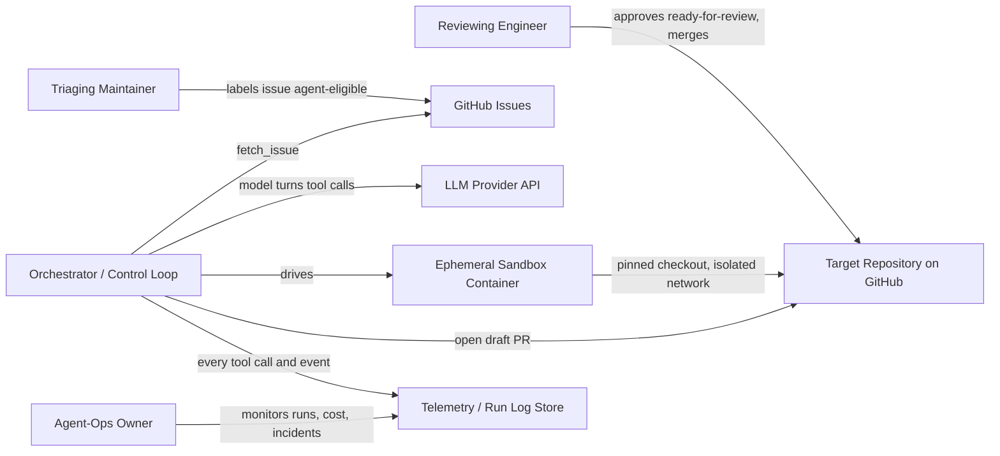

# Coding Agent Harness — Architecture Document
> - **Document Status**: Draft
> - **Last Updated**: 2026 Aug 29
> - **Author**: Paul Serban

A harness that takes a triaged GitHub issue, runs a sandboxed agentic control loop against a checkout of a mid-sized repository, and produces a draft pull request — with humans gating every point where the system's judgment could turn into an irreversible outcome. This document covers *what* the system is and *why* it is shaped this way; see [System Design](./03_system_design.md) for *how* the control loop, tools, and context management actually work.

## Overview

**Brief description**: This is internal developer-tooling infrastructure, not a customer-facing product. It is scoped narrowly on purpose: one triaged issue in, one draft PR (or one honest "could not do this") out, per run.

**Business Context**
- See [Business Overview](./01_business_overview.md) for the full framing. In short: reviewer trust and reviewer time, not draft-authoring speed, are the actual constraint this system is designed against.
- Repository profile: mid-sized, real CI, existing conventions, ambiguous issues in the mix — not a curated benchmark repo.
- Target users: triaging maintainer, reviewing engineer, agent-ops owner.

## Requirements

### Functional Requirements

- **Issue intake**: the system must accept a single triaged GitHub issue reference (repo, issue number) as its unit of work; it must not self-select issues to work on.
- **Repository exploration**: the system must be able to read files, list directories, and search code in a pinned checkout of the target repository without holding the entire repository in the model's context window at once.
- **Code modification**: the system must be able to propose and apply patches to a working checkout, constrained to files it has itself read/explored in the current run (no blind edits to unseen files).
- **Validation**: the system must be able to execute the repository's own build/lint/test commands, from a fixed, repo-configured allowlist, inside an isolated sandbox, and interpret structured pass/fail results.
- **Pull request creation**: the system must be able to create a branch, commit its changes, and open a **draft** pull request with a structured summary (plan, files touched, test results) — and must never open a non-draft PR or merge anything itself.
- **Human gating**: the system must pause and require an explicit human action at defined points (see [System Design — Human-in-the-Loop Gates](./03_system_design.md#6-human-in-the-loop-gates)) rather than proceeding autonomously through them.
- **Run termination**: the system must stop itself — successfully or not — under a defined, enforced set of conditions (budgets, stagnation, security violation, human cancel) rather than running unbounded (see [System Design — Stop Conditions](./03_system_design.md#5-stop-conditions)).
- **Auditability**: the system must record every tool call, model output, and sandbox event for a run in a durable, reviewable log.

### Non-Functional Requirements

**Performance Requirements:**
- Traffic profile: low concurrency by design — a handful of runs at a time, gated by triage volume, not a high-throughput service.
- Run duration: bounded by an explicit wall-clock budget (see [System Design](./03_system_design.md#5-stop-conditions)); a run that would take longer than a competent human's first-draft time is, by design, more likely to be stopped than left running.
- Repository scale: must remain usable against a repository whose full source will not fit in a single model context window — this shapes the entire [Context Window Management](./03_system_design.md#3-context-window-management) design.

**Reliability / Safety Requirements:**
- **No irreversible action without a human gate.** Every action the agent can take that changes state outside its own ephemeral sandbox (opening a PR, posting a comment) is reviewable and reversible before it has consequences; merge is always a separate, human-only action.
- **No unbounded execution.** Every run terminates under a finite set of conditions; "the model kept trying" is never an acceptable outcome for a run's duration or cost.
- **No privilege beyond the minimum needed.** The agent's GitHub identity, network access, and available tools are each scoped to the minimum required for a successful run — see [Security Architecture](./05_security_architecture.md).

**Adversarial-Input Requirement (the defining constraint of this system):**
- The system **will** read text it did not write and cannot trust: issue bodies, issue comments, linked-PR descriptions, README files, code comments, commit messages, and test/CI output. Any of this text may contain instructions crafted to manipulate the agent (prompt injection) into exfiltrating data, running unauthorized commands, or expanding its own privileges. The system must treat all such content as **data**, never as instructions, as a first-class design constraint threaded through the control loop, the tool surface, and the sandbox — not as an add-on filter (see [Security Architecture](./05_security_architecture.md#prompt-injection-threat-model)).

**Infrastructure Constraints:**
- Technology Stack (illustrative, vendor-agnostic where it matters): a tool-calling-capable LLM behind a provider API; a deterministic orchestrator process (not itself an LLM call) driving the control loop; ephemeral, network-isolated containers (or stronger, e.g. microVM-class isolation) as the execution sandbox; a fine-grained-permission GitHub App as the only interface to the real repository; `ripgrep`/glob-based code search rather than an embedding index for v1 (see [ADR-003](./04_architecture_decision_records.md#adr-003)).
- Hosting: sandbox execution is fully isolated from CI infrastructure and from any host holding real secrets; CI itself continues to run under its existing, unchanged permission model and is never granted to the agent's sandbox.
- Compliance Requirements: none formal, but the security posture (least-privilege identity, no-egress-by-default sandbox, full audit logging) is non-negotiable regardless of compliance framework, because the threat model (adversarial text input) is present regardless of industry.

## Executive Summary

The harness follows a **single deterministic-orchestrator control loop**, driving a **narrow, typed, allowlisted tool surface**, executing inside an **ephemeral, no-egress-by-default sandbox**, gated by **human approval at every point that matters**, and judged against a **continuously-resampled real-backlog evaluation**, not a fixed benchmark.

**Architecture Style:** Agentic control loop (single orchestrator, no multi-agent hand-off in v1) + tool-use pattern + sandboxed execution + human-gated delivery.

**Key Components:**
- **Orchestrator / Control Loop**: the deterministic state machine that drives each run — the only component that decides when to call the model, when to execute a tool, and when to stop.
- **Tool Layer**: the fixed set of typed, schema-validated operations the model can invoke (read, search, patch, test, PR) — deliberately excludes any generic shell/eval primitive.
- **Context Manager**: keeps a run inside the model's context window across dozens of steps via tiered memory and lazy re-fetch (see [System Design](./03_system_design.md#3-context-window-management)).
- **Sandbox / Execution Environment**: one ephemeral, resource-limited, network-isolated container per run, holding a pinned checkout of the target repository.
- **GitHub Integration Layer**: the only path in or out of the real repository — issue fetch, branch/commit, draft PR creation — authenticated as a fine-grained-permission GitHub App, never a broad personal-access token.
- **Human Approval Gateway**: the set of explicit pause points and the specific artifact a human is shown/approving at each one (see [System Design — Human-in-the-Loop Gates](./03_system_design.md#6-human-in-the-loop-gates)).
- **Evaluation / Telemetry Pipeline**: run logs, cost accounting, and the sampling/metrics machinery that answers "is this actually working" (see [Evaluation Framework](./06_evaluation_framework.md)) — treated as a first-class component, not an afterthought, because a harness nobody is honestly measuring is a harness nobody should be trusting.

**Technology Stack:**
- Control: a deterministic orchestrator process (plain code, not an LLM call) implementing the state machine in [System Design](./03_system_design.md#1-control-loop).
- Model access: any tool-calling-capable LLM provider API, abstracted behind a thin interface so the model can be swapped without changing the orchestrator.
- Execution sandbox: ephemeral containers (or microVM-class isolation for stronger guarantees), one per run, destroyed after the run regardless of outcome.
- Code search: `ripgrep`-style text/glob search over the pinned checkout; no embedding/vector index in v1 ([ADR-003](./04_architecture_decision_records.md#adr-003)).
- GitHub integration: a fine-grained-permission GitHub App (`contents:write`, `pull_requests:write`, `issues:read` — explicitly not admin/merge/workflow-write).
- Telemetry: structured per-run logs (every tool call + result, every model turn, every sandbox network attempt) shipped to durable storage independent of the sandbox's own lifecycle.

**Architecture Principles:**
- **The orchestrator decides, the model proposes.** Every tool call the model produces is schema-validated and can be rejected by the orchestrator before it ever touches the sandbox; the model has no direct access to anything.
- **No generic execution primitive.** If a capability isn't an explicit, typed tool, the agent cannot do it — this is the harness's primary defense against prompt injection turning into arbitrary code execution.
- **Everything the agent touches is disposable.** The sandbox, the branch, and the draft PR are all cheap to discard; nothing the agent does is irreversible until a human explicitly makes it so (marks ready-for-review, merges).
- **Untrusted text is data, never instruction.** Issue bodies, comments, file contents, and command output are labeled and prompted as data the model must reason *about*, never as new instructions to follow — enforced by prompting *and* by the sandbox having nothing dangerous to do even if that fails.
- **A stopped run is a successful outcome.** The system is explicitly designed to prefer stopping and escalating over guessing; "kept going and produced something" is not a success criterion anywhere in this design.

**Key Architectural Decisions:**
1. A **single deterministic orchestrator loop**, not a multi-agent planner/executor split, drives the run for v1 ([ADR-001](./04_architecture_decision_records.md#adr-001)).
2. A **narrow, allowlisted tool surface with no generic shell/eval tool** closes the main path from prompt injection to arbitrary code execution ([ADR-002](./04_architecture_decision_records.md#adr-002)).
3. **Lazy re-fetch + rolling compaction**, not a full transcript or an embedding index, keeps a mid-sized repo's exploration inside the context window ([ADR-003](./04_architecture_decision_records.md#adr-003)).
4. The agent **always opens a draft PR**; a human must explicitly mark it ready for review, and a human always merges ([ADR-004](./04_architecture_decision_records.md#adr-004)).
5. Every run executes in an **ephemeral, no-egress-by-default sandbox** ([ADR-005](./04_architecture_decision_records.md#adr-005)).
6. Success is measured against a **continuously-resampled sample of the real backlog plus shadow mode**, not a fixed curated benchmark ([ADR-006](./04_architecture_decision_records.md#adr-006)).
7. All tool output (including issue/file text) is treated as **untrusted data via prompt-level instruction hierarchy**, with the sandbox as the real backstop, not the prompting alone ([ADR-007](./04_architecture_decision_records.md#adr-007)).

### Context Diagram

## Runtime Architecture

1. **Intake layer**: a triaged issue reference enters the system; the orchestrator fetches the issue body/comments via the GitHub Integration Layer and starts a new run with a fresh sandbox.
2. **Control loop layer**: the orchestrator drives the Triage → Plan → Explore → Edit → Validate → Summarize state machine (see [System Design](./03_system_design.md#1-control-loop)), calling the model for each decision and executing the resulting tool call itself.
3. **Execution layer**: every tool call that touches the repository or runs a command executes inside the run's ephemeral sandbox — never on a host that holds real credentials or other runs' state.
4. **Delivery layer**: on success, the orchestrator commits to a branch and opens a draft PR with a structured report; on any stop condition short of success, it posts a structured "could not complete" report instead, with the same level of detail.
5. **Human gate layer**: the run pauses at explicit points (see [Human-in-the-Loop Gates](./03_system_design.md#6-human-in-the-loop-gates)) — nothing downstream of a gate happens without the corresponding human action.
6. **Telemetry layer**: runs independently of run success/failure — every run, whatever its outcome, produces a complete audit log and feeds the evaluation pipeline in [Evaluation Framework](./06_evaluation_framework.md).

## Components

### 1. Orchestrator / Control Loop
**Purpose**: Be the single authority over what happens in a run — the model never acts directly on anything.

**Responsibilities:**
- Drive the state machine, decide when to call the model, when to execute a validated tool call, and when to invoke a stop condition.
- Own budget accounting (steps, wall-clock, tokens/cost) and enforce every stop condition (see [System Design](./03_system_design.md#5-stop-conditions)).
- Validate every model-proposed tool call against its schema before any execution is attempted.

**Interactions:**
- Calls: the LLM provider API (model turns), the Tool Layer (execution), the Sandbox (indirectly, via tools), the GitHub Integration Layer (issue fetch, PR creation).
- Is called by: the intake mechanism that starts a run for a triaged issue.

### 2. Tool Layer
**Purpose**: Be the complete, closed set of actions the model can take — closed specifically so an adversarial instruction embedded in repository content has nothing dangerous available to invoke.

**Responsibilities:**
- Expose a fixed set of typed, schema-validated tools (full contracts in [System Design](./03_system_design.md#2-tool-surface)): issue/file/search reads, patch application, allowlisted command execution, test execution, branch/commit/draft-PR creation, status reporting, finish/abort.
- Reject, at the schema level, any malformed or out-of-contract call before it reaches the sandbox.

**Interactions:**
- Receives calls from: the Orchestrator, on the model's behalf, never directly from the model.
- Executes against: the Sandbox and the GitHub Integration Layer.

### 3. Context Manager
**Purpose**: Keep a run coherent across dozens of steps against a repository that does not fit in one context window.

**Responsibilities:**
- Maintain tiered memory (fixed system/task spec, structured scratchpad, recent raw tool outputs, summarized digest of older steps, on-disk worklog outside the window) — full design in [System Design](./03_system_design.md#3-context-window-management).
- Trigger compaction before the context window is exhausted, prioritizing verbatim retention of diffs and test failures over exploration history.

**Interactions:**
- Sits between: the Orchestrator and the LLM provider API, shaping what is actually sent on each turn.

### 4. Sandbox / Execution Environment
**Purpose**: Give every run a disposable, isolated place to do real work, so that nothing a run does — successful or adversarially manipulated — can affect anything outside itself.

**Responsibilities:**
- Provide one ephemeral container per run, with a pinned checkout of the target repository at a fixed commit.
- Enforce resource limits (CPU/memory/disk/time) and a default-deny network policy with a narrow, explicit allowlist (git remote, package registry mirror) — see [Security Architecture](./05_security_architecture.md#network-exposure).
- Be destroyed at the end of every run, success or failure, with no state retained between runs.

**Interactions:**
- Receives commands from: the Tool Layer (patch application, command/test execution).
- Reports to: the Telemetry layer (resource usage, any denied network attempt — a denied attempt is itself a security signal, not just an error).

### 5. GitHub Integration Layer
**Purpose**: Be the only path between the harness and the real repository/issue tracker, authenticated with the minimum privilege a successful run needs.

**Responsibilities:**
- Fetch issue bodies/comments (read-only).
- Create branches, commits, and draft pull requests (write, scoped, never merge).
- Post structured run reports as PR/issue comments.

**Interactions:**
- Authenticated as: a fine-grained-permission GitHub App, distinct from any human's or CI's credentials (see [Security Architecture](./05_security_architecture.md#identity-and-access-management)).
- Called by: the Tool Layer, on the Orchestrator's behalf.

### 6. Human Approval Gateway
**Purpose**: Make explicit, at the architecture level, exactly which decisions remain human decisions and what artifact the human is shown at each one.

**Responsibilities:**
- Present the pre-flight eligibility decision, the pre-ready-for-review diff+report, and the merge decision as three distinct, separately-logged approvals — never a single "approve the agent" button (full detail in [System Design](./03_system_design.md#6-human-in-the-loop-gates)).
- Surface escalations (ambiguous requirements, unresolvable test failures, scope creep) as structured reports, not silent stops.

**Interactions:**
- Consumes: run reports from the Orchestrator.
- Produces: the explicit human actions (approve-to-run, mark-ready-for-review, merge, or reject/cancel) that unblock the next stage.

### 7. Evaluation / Telemetry Pipeline
**Purpose**: Answer, with evidence rather than impression, whether the harness is worth the reviewer time it costs.

**Responsibilities:**
- Persist a complete, queryable log of every run (tool calls, model turns, sandbox events, cost, outcome).
- Feed the sampling, metrics, and kill-criteria machinery in [Evaluation Framework](./06_evaluation_framework.md).

**Interactions:**
- Fed by: every other component, continuously, regardless of run outcome.
- Consumed by: the agent-ops owner and the evaluation process gating each phase in [Phased Implementation Plan](./07_phased_implementation_plan.md).

### Communication Patterns

**Synchronous:**
- Orchestrator ↔ LLM provider API: one blocking call per control-loop turn.
- Orchestrator ↔ Sandbox (via Tool Layer): blocking tool execution with an enforced per-call timeout.
- Orchestrator ↔ GitHub Integration Layer: blocking, for issue fetch and PR creation.

**Asynchronous / Human-paced:**
- Human Approval Gateway → human: notifications (PR comment, dashboard entry) that a gate is waiting; there is no timeout that auto-approves a gate — a stalled gate stalls the run, it never silently proceeds.
- Telemetry pipeline: write-and-forget from every component; read on the agent-ops owner's and evaluation process's own cadence.

## Scaling Strategy

**Current Scale Requirements:**
- Low run concurrency, gated by triage throughput, not a high-QPS service.
- One repository, one pinned checkout per run, mid-sized (does not fit a single context window, does fit comfortably in a single sandbox's disk).

**Scaling Strategy:**

**Vertical/throughput (primary path):** more concurrent runs is a matter of more sandbox capacity (more ephemeral containers) and LLM provider rate limits — both scale close to linearly with cost, with no architectural change required, because runs share nothing (see [Sandbox](#4-sandbox--execution-environment)).

**Breadth (repository size, future):** if a target repository grows large enough that `ripgrep`/glob exploration becomes the bottleneck (too many steps spent searching), the [ADR-003](./04_architecture_decision_records.md#adr-003) decision to skip an embedding/semantic index should be revisited — this is a documented, deliberate v1 simplification, not a permanent constraint.

**Bottleneck Analysis:**
- Primary bottleneck in practice is expected to be **reviewer attention**, not compute — see [Business Overview — Success Metrics](./01_business_overview.md#success-metrics). Scaling run throughput without a matching increase in trustworthy output quality just produces a backlog of unreviewed draft PRs, which is a worse state than not running the harness at all.
- Secondary bottleneck: context-window pressure on genuinely large/coupled issues, mitigated but not eliminated by [Context Window Management](./03_system_design.md#3-context-window-management) — some issues are legitimately too large for a single run's budget, and the correct behavior is to stop, not to compact harder.

**Monitoring and Triggers:**
- Track run throughput against reviewer merge-without-rework throughput; if runs outpace trustworthy merges, throttle intake at the triage step rather than the sandbox layer.
- Scale-out/scale-back triggers for the pilot and rollout are defined in [Phased Implementation Plan](./07_phased_implementation_plan.md).

## Data Architecture

### Data Model

The harness's meaningful "entities" are run artifacts and configuration, not business data:

**Key Entities:**
- **Run**: one issue, one sandbox lifecycle, one outcome (draft PR / structured stop report); has a full transcript, cost, and stop reason.
- **Repository Configuration**: the allowlisted commands, hard-blocked path globs, and budget defaults for a given target repository — versioned, reviewed like code.
- **Run Report**: the structured artifact (plan, files touched, test results, cost) attached to every draft PR and every stop report — the primary interface between the agent's work and a human's judgment of it.
- **Audit Log**: every tool call, model turn, and sandbox event for a run, retained independent of the run's own transient sandbox.

**Entity Relationships:**
- One triaged issue maps to exactly one Run (retried issues are new Runs, not resumed ones — see [System Design](./03_system_design.md#error-handling) on why runs are not resumed across sandbox restarts).
- One Repository Configuration governs many Runs against that repository.

### Data Lifecycle

**Create**: a Run is created when a triaged issue is submitted to the orchestrator; it allocates a fresh sandbox and a fresh audit log.

**Read**: the Context Manager continuously reads from the sandbox (files, command output) and from the growing transcript; humans read Run Reports and the Audit Log.

**Update**: a Run's state advances through the control loop's states; nothing about a completed Run is ever mutated after the fact — corrections happen via a new Run, preserving the audit trail.

**Delete**: sandboxes are destroyed at the end of every Run, unconditionally; Audit Logs and Run Reports are retained under a data-retention policy set by the agent-ops owner (not deleted with the sandbox), since they are the evidence base for [Evaluation Framework](./06_evaluation_framework.md) and incident investigation.

## Cost Analysis

### Cost Components (rough shape, not a committed budget)

**LLM tokens per run:** dominated by exploration steps in a mid-sized repository; expect this to scale with repository size and issue ambiguity, not with a fixed constant — a well-scoped, isolated bug fix may cost a fraction of what a cross-cutting change costs. This is the cost component most people assume dominates; it usually does not.

**Sandbox compute:** one ephemeral container per run, alive only for the run's wall-clock budget; cheap relative to LLM tokens for a mid-sized repo's build/test cycle, unless the test suite itself is heavy, in which case CI-equivalent compute cost should be assumed.

**CI minutes:** if the draft PR triggers the repository's normal CI on push (likely, and generally *desirable* since it's a second, independently-configured validation signal) — this is the same CI cost a human contributor's PR would have incurred, not new cost.

**Reviewer time — the real, dominant, and most-often-ignored cost:** every draft PR opened claims a reviewer's attention whether or not it merges. A run that stops honestly with "could not complete" costs compute and nothing else; a run that opens a low-quality draft PR costs a reviewer's time to discover that. **The single most important cost-control lever in this system is a high bar for what gets escalated into a draft PR at all**, not a low bar for LLM token spend.

**Total cost framing:** report cost **per merge-without-material-rework outcome**, not per run and not per token — a cheap run that produces nothing useful is not cheap once reviewer time is counted, and an expensive run that saves a reviewer real time may be worth it. See [Evaluation Framework](./06_evaluation_framework.md) for how this is actually measured.

### Cost Optimization

**Strategies:**
- Bias the control loop toward stopping early on ambiguous issues rather than spending steps trying to resolve ambiguity itself — a stopped run is far cheaper than a low-quality draft PR (see [Stop Conditions](./03_system_design.md#5-stop-conditions)).
- Aggressive context compaction ([System Design §3](./03_system_design.md#3-context-window-management)) reduces tokens-per-step directly.
- Triage-level filtering (only route genuinely well-scoped issues) is a far more effective cost lever than any runtime optimization, because it controls both compute cost and — more importantly — reviewer-time cost.

## Risks and Mitigation

| Risk | Likelihood | Impact | Mitigation Strategy | Owner |
| --- | --- | --- | --- | --- |
| Prompt injection via issue text/comments/file content leads to data exfiltration or unauthorized command execution | Medium | High | No generic exec tool; default-deny sandbox network egress; untrusted-content labeling in prompting as a second, non-primary layer ([Security Architecture](./05_security_architecture.md#prompt-injection-threat-model)) | Agent-ops owner |
| Agent produces plausible-looking but subtly wrong code that passes a weak/incomplete test suite | Medium | High | Reviewer checklist explicitly does not treat "tests passed" as sufficient ([Operations Runbook](./08_operations_runbook.md#reviewer-checklist)); merge-without-rework and post-merge revert rate tracked as primary metrics, not test-pass rate | Reviewing engineer |
| Reviewers rubber-stamp agent PRs due to volume or misplaced trust (automation bias) | Medium | High | Explicitly tracked as a failure mode in [Evaluation Framework](./06_evaluation_framework.md#metrics-that-matter-vs-vanity-metrics); reviewer survey as a first-class metric | Agent-ops owner |
| Scope creep — the agent touches more files than the issue warrants, inflating review burden | Medium | Medium | Diff-size-vs-issue-size guard as an explicit stop condition ([System Design §5](./03_system_design.md#5-stop-conditions)) | Orchestrator (automated) |
| Runaway run / cost overrun from a stuck loop | Low | Medium | Independent step/wall-clock/token budgets, stagnation detector ([System Design §5](./03_system_design.md#5-stop-conditions)) | Orchestrator (automated) |
| Team never trusts or adopts the tool regardless of measured quality (organizational risk, not technical) | Medium | Medium | Pilot cohort with a small, willing set of reviewers first; transparent metrics shared with the whole team, not just claimed success ([Phased Implementation Plan](./07_phased_implementation_plan.md)) | Agent-ops owner |
| Evaluation overfits to an easy, self-selected slice of the backlog, producing false confidence (Goodhart's law) | Medium | High | Continuously-resampled, stratified holdout drawn from the real backlog, not a fixed/curated set ([Evaluation Framework](./06_evaluation_framework.md#statistical-rigor)) | Agent-ops owner |

## Future Enhancements

### Phase 1 (Current)
**Focus**: Get read-only triage, sandboxed patch generation, and a gated draft-PR pipeline working end-to-end on a small pilot cohort (see [Phased Implementation Plan](./07_phased_implementation_plan.md)).

### Phase 2 (Post-pilot hardening)
**Focus**: Expand autonomy within unchanged guardrails (multi-file changes, wider but still-allowlisted path scope) only if Phase 3 pilot metrics justify it.

Enhancements:
1. **Wider command allowlist** per repository, added deliberately and reviewed, not opened generically.
2. **Reviewer-facing run-quality dashboard**, surfacing the [Evaluation Framework](./06_evaluation_framework.md) metrics directly to the people whose trust the system depends on.

### Phase 3 (Conditional, may never trigger)
**Focus**: Relax a single specific guardrail (e.g., draft → auto-ready-for-review) as its own isolated, separately-gated change — never a bundle of relaxations at once.

### Technical Debt

**Known/Accepted Trade-offs:**
- No embedding/semantic code index in v1 — accepted for a mid-sized repository where `ripgrep`/glob search is sufficient; revisit if repository size or issue complexity outgrows it ([ADR-003](./04_architecture_decision_records.md#adr-003)).
- Single-orchestrator control loop rather than a specialist multi-agent architecture — accepted for the current scope of "small-to-medium, well-scoped issues"; revisit if the eligible issue class expands to require distinct planning/coding/review specialization ([ADR-001](./04_architecture_decision_records.md#adr-001)).
