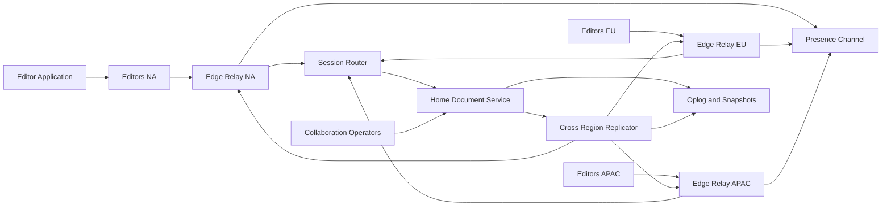
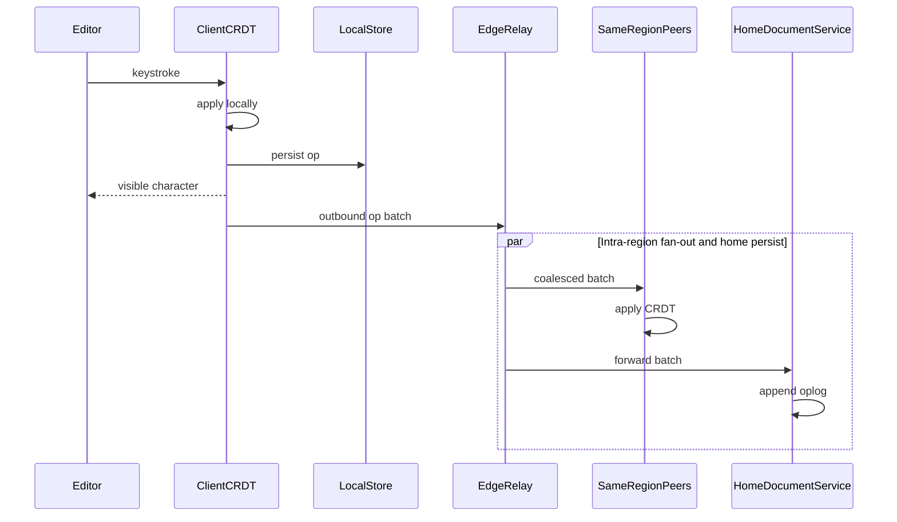
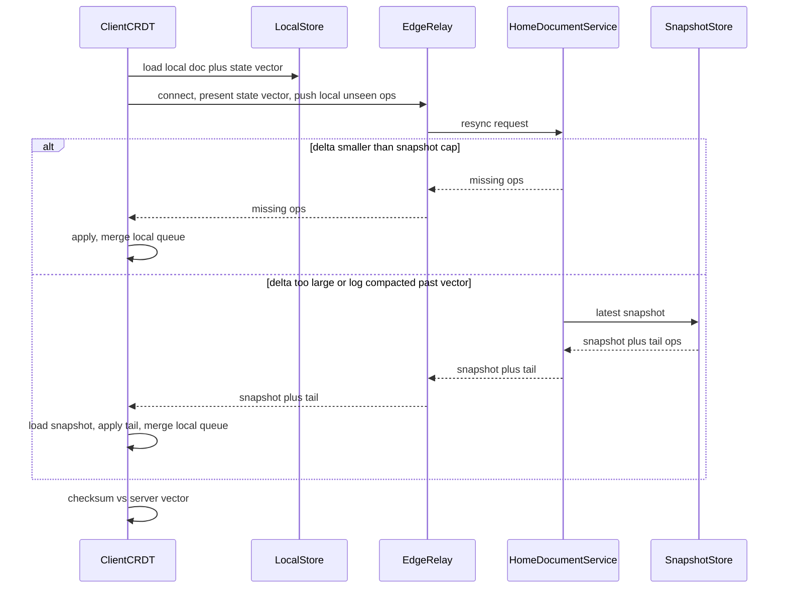

# Collaborative Document Engine — Architecture Document
> - **Document Status**: Draft
> - **Last Updated**: 2026 Aug 29
> - **Author**: Paul Serban

A multi-region collaborative rich-text engine that hosts on the order of 500,000 concurrent editing sessions, applies every keystroke locally, converges concurrent edits without a global sequencer, and resyncs hours-offline clients from a state vector rather than a full snapshot lottery. This document covers *what* the system is and *why* it is shaped this way; see [System Design](./03_system_design.md) for *how* CRDT sync, edge fan-out, resync, home-region assignment, and compaction actually work, and [Trade-offs and Honest Assessment](./05_tradeoffs_and_honest_assessment.md) for what is abandoned and why a global 50 ms p95 is not a strategy.

## Overview

**Brief description**: Collaboration infrastructure, scoped on purpose: local-first CRDT documents, edge-relay intra-region fan-out, per-document home-region durability, async cross-region replication of mergeable ops, a lossy presence channel, and snapshot/compaction so the log cannot grow forever. It is not a full office suite, not a generic pub/sub platform, and not "WebSockets plus Redis with a CRDT library dropped in."

**Business Context**
- See [Business Overview](./01_business_overview.md) for the full framing. In short: 500k sessions are a connection count; fan-out is editors-per-document; 50 ms globally contradicts the speed of light; Redis Pub/Sub plus a relational sequencer is the current incident, not a starting point to tune.
- Target users: editor application, end users, collaboration operators, compliance. Physics sits on the SLO, not on a later optimization ticket.

## Requirements

### Functional Requirements

- **Local-first editing**: the client must apply inserts, deletes, formatting, and structural edits to a local CRDT document and persist them locally *before* (and regardless of) network acknowledgment. A partition must not freeze the caret. See [ADR-002](./04_architecture_decision_records.md#adr-002).
- **Commutative merge**: concurrent ops from any replica (online edge, other region, hours-offline laptop) must merge to the same document state given the same set of ops. No central operation transformer as the production path. See [ADR-001](./04_architecture_decision_records.md#adr-001).
- **Delta resync**: on connect or reconnect, the client presents a state vector (or equivalent); the system returns missing ops, or a snapshot plus a short tail if the delta exceeds a size/time cap. See [ADR-004](./04_architecture_decision_records.md#adr-004).
- **Edge fan-out**: durable ops are batched and distributed to same-region peers via an edge relay/PoP, not via a single global Redis Pub/Sub. See [ADR-003](./04_architecture_decision_records.md#adr-003).
- **Home-region durability**: each document has a home region that stores the authoritative oplog and snapshots. Other regions replicate asynchronously and serve local readers/editors; CRDT merge, not a cross-region two-phase commit, is the consistency model. See [ADR-005](./04_architecture_decision_records.md#adr-005).
- **Presence/awareness**: cursors, selections, and "is typing" are delivered on a separate, coalesced, lossy channel. They are not written to the oplog. See [ADR-006](./04_architecture_decision_records.md#adr-006).
- **Snapshot and compaction**: the system must periodically produce a snapshot and garbage-collect CRDT tombstones / redundant ops so reconnect and memory stay bounded. See [ADR-007](./04_architecture_decision_records.md#adr-007).
- **Integrity**: replicas at the same state vector must hash-equal (or an equivalent structural checksum). Divergence is an incident, not "eventual."

### Non-Functional Requirements

**Performance Requirements:**
- Local apply p99 < 16 ms, always, including offline.
- Intra-region peer visibility p95 < 50 ms for durable ops among clients on the same regional edge. This is the 50 ms SLO the design owns.
- Cross-region convergence is a separate histogram with a physics floor; working product targets are in [Business Overview — Success Metrics](./01_business_overview.md#success-metrics), not 50 ms.
- Resync p95 to interactive for typical docs as specified in the business overview; snapshot fallback must not be a surprise freeze of tens of seconds without UI.
- Presence coalescing: cursor traffic must not be 30 Hz × N editors on the durable path.

**Reliability Requirements:**
- At-least-once delivery of durable ops between client and home, with CRDT idempotence (ops are identified; duplicates are no-ops).
- Partition between regions: both sides continue to accept edits; merge on heal. Split-brain is a merge, not a rollback-to-primary.
- Edge PoP loss: clients reconnect to another PoP in-region (or next-closest) and resync via state vector, not via "replay Redis."
- Home-region loss: failover to a replica that has a snapshot + caught-up log, or accept a bounded data-loss window *only* if product writes that number down. Silent loss is forbidden.

**Infrastructure Constraints:**
- Technology stack is vendor-agnostic at the architecture layer: a CRDT engine in the client (Yjs/Automerge-class, or an equivalent internally owned format); local persistence (IndexedDB / SQLite on native); edge WebSocket/WebTransport relays; a durable log (object store + maybe a log system, **not** a row-per-keystroke RDBMS); snapshots in object storage; a small metadata store (document → home region, ACL, snapshot pointers) which *may* be relational; a presence mesh that is explicitly *not* Redis Pub/Sub as the durable fabric.
- Hosting: real PoPs in NA, EU, APAC. Pretending one "central cluster" in `us-east-1` plus Redis will meet intra-EU 50 ms is how the current architecture was born.
- Compliance: documents contain customer content. Ops, snapshots, and logs inherit that classification. Client local replicas are a data-residency and device-loss problem, not a free cache.

**The defining constraint:**
- `distance / (2/3 c)` is a floor on cross-region RTT. Architecture that puts a 50 ms global p95 in the same bucket as intra-region fan-out is not architecture; it is a plan to fail the SLO on the first Tokyo–NYC pair and then "add more WebSocket servers" in a war room.

## Executive Summary

The system is a **four-plane collaboration platform**: a client apply plane that never waits on the network to mutate local state; an edge fan-out plane that makes same-region peers fast; a home-region persistence plane that stores a durable, compactable log; and a cross-region replication plane that ships CRDT ops asynchronously because they commute. The scarce resources are **hot-document fan-out, reconnect-herd bandwidth, CRDT metadata growth, and engineering correctness of the sync protocol**. Session count (500k) is usually the easy one until a single document has hundreds of editors or a PoP dies and everyone snapshots at once.

**Architecture Style:** Local-first CRDT replicas; regional edge relays for low-latency fan-out; asynchronous multi-region replication; not a single-leader OT server; not a microservices explosion — the cuts follow latency and failure domains (client vs edge vs home vs presence vs compaction).

**Key Components:**
- **Client CRDT engine + local store**: the source of truth the user types into.
- **Edge Relay / PoP**: terminates sessions, batches ops, fans out to in-region subscribers, forwards to home.
- **Document Session Router**: maps `doc_id` → home region + sticky edge; handles re-homing.
- **Home-region Document Service**: accepts ops, appends oplog, serves resync, coordinates snapshots.
- **Oplog + Snapshot Store**: append-only op batches; periodic snapshots; GC of obsolete ops.
- **Cross-Region Replicator**: ships op batches / snapshots to replica regions; merge is CRDT apply, not last-write-wins.
- **Presence / Awareness Service**: lossy, coalesced, scoped to the edge (and optionally a light cross-region hint).
- **Garbage Collector / Compactor**: tombstone collection, snapshot generation, size SLOs.

**Technology Stack (illustrative):**
- CRDT: Yjs (YATA) or Automerge (change DAG) or an internally specified equivalent. The architecture requires **identified ops + state summary + commutative merge**, not a brand.
- Transport: WebTransport where available, WebSocket fallback; not long-polling.
- Edge: anycast or geo-DNS to regional PoPs; sticky sessions per document on a relay *shard*, not a random global LB per message.
- Durable log: object-store segments + a sequencer *per document* in the home region (a log, not a SQL row per keystroke). Postgres is allowed for **metadata** (home region, ACL, snapshot pointer), not for the op firehose.
- Presence: in-memory at the edge, optional regional mesh; Redis *as a presence cache* is allowed if it is not the durable op bus. Using Redis Pub/Sub as the op fabric is forbidden.
- Observability: per-hop propagation histograms (client → edge, edge → peer, home → remote region), document size, resync bytes, divergence checks.

**Architecture Principles:**
- **The document is the shard key; the session is a connection.** Scale connections horizontally; scale merge/fan-out per document.
- **Apply locally; replicate mergeably; persist at home.** Do not invert this (persist-then-apply, or global-lock-then-apply).
- **50 ms is an intra-region budget.** Cross-region is lag. Mixing them is how dashboards stay green while Tokyo waits 180 ms.
- **Presence is not data.** If it shares a queue with ops, ops lose.
- **More WebSocket servers do not shrink oceans and do not fix hot-document O(N) fan-out.** See [Scaling Strategy](#scaling-strategy).
- **Compaction is correctness-adjacent.** An ever-growing CRDT is a reconnect and cost incident with a delay fuse.

**Key Architectural Decisions:**
1. **CRDTs over OT as the production merge.** [ADR-001](./04_architecture_decision_records.md#adr-001).
2. **Local-first client storage over server-authoritative-only.** [ADR-002](./04_architecture_decision_records.md#adr-002).
3. **Edge-relay regional fan-out over a single centralized broker.** [ADR-003](./04_architecture_decision_records.md#adr-003).
4. **State-vector delta resync over full-snapshot-on-reconnect.** [ADR-004](./04_architecture_decision_records.md#adr-004).
5. **Document-home-region sharding with async cross-region replication over a single global cluster.** [ADR-005](./04_architecture_decision_records.md#adr-005).
6. **Separate presence/awareness channel over multiplexing with durable ops.** [ADR-006](./04_architecture_decision_records.md#adr-006).
7. **Periodic snapshot + compaction over unbounded oplog growth.** [ADR-007](./04_architecture_decision_records.md#adr-007).

### Context Diagram

## Runtime Architecture

Four planes, deliberately decoupled.

1. **Client apply plane** (synchronous, local, offline-capable): keystroke → CRDT apply → local persist → enqueue outbound ops. Completeness of this plane is the "the app is not a remote terminal" SLO.
2. **Edge fan-out plane** (synchronous enough, intra-region, SLO-bound): receive op batch → coalesce → fan out to in-region subscribers on that document shard → forward to home. This plane does not wait on cross-region replication to ACK the originator.
3. **Persistence / home plane** (async from the typist's perspective, durable): append op batches, index by document and state-vector ranges, serve resync, snapshot.
4. **Cross-region plane** (async, lag-SLO): replicate batches to other regions; remote edges apply and fan out. Merge is CRDT. There is no global total order.
5. **Degraded modes** (explicit): presence dropped under load; snapshot instead of huge delta; edge miss → next PoP; home unreachable → local-only + queue with a banner, not a frozen editor; compaction paused → size alerts, not silent OOM.

### Local edit path (steady state, same region)

The originator does **not** wait for `Home` to ACK before the character is visible. Home ACK is for durability and for other regions, not for typing.

### Hours-offline reconnect

Redis Pub/Sub cannot implement this sequence. That is the point.

### Cross-region (async)

Originator in NA, peer in APAC: NA edge fans out locally in <50 ms p95; home in (say) NA appends; replicator ships the batch to APAC; APAC edge fans out. The APAC peer's visibility is **cross-region lag**, not the intra-region SLO. CRDT apply on APAC does not need a lock in NA.

## Components

### 1. Client CRDT Engine + Local Store
**Purpose**: The document the user actually edits. If this waits on the server, the rest of the architecture is a chat app with extra steps.

**Responsibilities:**
- Apply local and remote ops; maintain a state vector (per-replica clocks / equivalent).
- Persist ops and a recent snapshot locally so a crash or flight mode does not lose hours of typing.
- Encode outbound batches; accept inbound batches; idempotent apply.
- Expose a checksum of the document at a given vector for divergence detection.
- Separate presence emission (throttled) from durable ops.

**Interactions:**
- Reads/writes: local store always.
- Network: edge relay only. The client does not speak to Postgres.

### 2. Edge Relay / PoP
**Purpose**: The 50 ms machine. Keep same-region peers off the ocean and off the home-region database.

**Responsibilities:**
- Terminate transport; authenticate; bind session to `doc_id` shard.
- Coalesce ops over a small window (working: 8–16 ms) without violating the intra-region budget. See [System Design §3](./03_system_design.md#3-edge-relay-batching-and-fan-out).
- Fan out to subscribers on this PoP; forward to home; receive replica batches from the replicator for documents whose editors are here but home is elsewhere.
- Shed presence before shedding durable ops under load.
- Never use a global at-most-once bus as the only copy of an op.

**Interactions:**
- Clients, session router, home document service, presence mesh, replicator (inbound).

### 3. Document Session Router
**Purpose**: `doc_id` → home region + recommended edge. Without this, "multi-region" is three copies of a central cluster.

**Responsibilities:**
- Home-region assignment (initial: creator's region or org residency; later: access-weighted re-home).
- Sticky routing so a document's live sessions on a PoP land on the same relay shard (fan-out locality).
- Re-home is a migration: snapshot + tail, freeze is *short* or dual-write; not a weekend rewrite.
- ACL check at session bind (defense in depth; the editor also checks).

**Interactions:**
- Edge on connect; metadata store; does not sit on the per-keystroke path after bind.

### 4. Home-region Document Service
**Purpose**: Durability and resync for one region's owned documents (and a replica apply path for documents owned elsewhere).

**Responsibilities:**
- Append op batches with a per-document monotonic batch id (for storage order, **not** for CRDT merge order).
- Serve resync: given a state vector, produce missing ops or redirect to snapshot+tail.
- Trigger compaction when size/tombstone thresholds hit.
- Checksum audit: sample documents, compare replica hashes at a vector.

**Interactions:**
- Edge, oplog/snapshots, replicator, compactor.

### 5. Oplog + Snapshot Store
**Purpose**: The data that Redis Pub/Sub threw away and that Postgres row-locked.

**Responsibilities:**
- Append-only segments per `doc_id` (or per shard of hot docs).
- Snapshots: full CRDT state at a vector, plus a pointer: "log is valid from here."
- Retention: after snapshot N is durable and replicated, drop op segments covered by N, subject to a grace window for slow clients (those clients snapshot-resync).
- **Not** a relational row per character.

**Interactions:**
- Written by home service and compactor. Read by resync and replicator.

### 6. Cross-Region Replicator
**Purpose**: Move mergeable batches toward editors who are not in the home region, without putting their typing on a transoceanic lock.

**Responsibilities:**
- Ship new batches to replica regions with at-least-once + idempotent apply.
- Backpressure: lag histogram per region pair; do not silently drop.
- Snapshot shipping for catch-up of a new replica or a lagged region (faster than op replay from genesis).
- **Does not** provide a global sequence. Replica apply is CRDT apply.

**Interactions:**
- Home oplog → remote home-service apply → remote edges for live subscribers.

### 7. Presence / Awareness Service
**Purpose**: Cursors without murdering the op log.

**Responsibilities:**
- Coalesce to ~10 Hz or on-change with a min interval; drop under load.
- Scope to document subscribers at the edge; optional compressed cross-region "there are N others" without pixel-perfect cursors if lag is high.
- TTL on disconnect; no persistence.

**Interactions:**
- Edge only, in v1. Cross-region presence is best-effort.

### 8. Garbage Collector / Compactor
**Purpose**: Keep CRDT size from becoming the reconnect SLO.

**Responsibilities:**
- Produce snapshot at vector V; verify hash; replicate snapshot; truncate log.
- Tombstone collection per CRDT rules (cannot drop a delete the other replica still needs — this is protocol-specific and easy to get wrong).
- Expose `bytes_payload / bytes_visible` and time-since-compact.

**Interactions:**
- Snapshot store, home service. Never on the typing path.

### Communication Patterns

**Synchronous (felt):**
- User → CRDT apply (local).
- Client ↔ edge for op batches and presence (deadlines; no unbounded retry storms).
- Edge → in-region peers.

**Asynchronous (durable):**
- Edge → home append.
- Home → other regions.
- Compaction.

**Forbidden:**
- Client → home DB on each keystroke.
- Cross-region ACK on the typing path.
- Redis Pub/Sub as the sole delivery of durable ops.

## Scaling Strategy

**Current Scale Requirements (working assumptions, Phase 0 must replace):**
- 500,000 concurrent sessions: connection and presence fleet.
- Live documents: `500k / mean_editors`. Working ~62,500 at N=8. The tail of N is the real capacity plan.
- Ops: typing is bursty; presence is chatty. Design the durable path for peak typing on hot docs, not for average fleet-wide keystrokes.

**What more WebSocket servers actually buy:**
- More concurrent TCP sessions.
- More CPU for encode/decode.

**What they do not buy:**
- **Cross-region 50 ms.** Oceans do not shrink. See [Trade-offs §4](./05_tradeoffs_and_honest_assessment.md#4-why-global-p95-50-ms-is-the-wrong-slo).
- **Hot-document fan-out.** If 400 people are on one doc, each op still has 399 recipients. More servers *scatter* those recipients unless you **shard by document** and keep subscribers co-located on a relay. Random LB across 200 nodes turns one document into a mesh.
- **Reconnect correctness.** More sockets to a Pub/Sub with no replay still miss ops.
- **CRDT bloat.** Compaction is independent of connection count.
- **Merge quality on tables after 4 hours offline.** That is data-type design, not horizontal scale.

See [ADR-003](./04_architecture_decision_records.md#adr-003) and [Trade-offs §4](./05_tradeoffs_and_honest_assessment.md#4-why-global-p95-50-ms-is-the-wrong-slo).

**Preferred scale order (do not skip):**
1. Measure editors-per-doc distribution, latency matrix, doc-size distribution (Phase 0).
2. Local-first + CRDT correctness on one region (fan-out is still the algorithm; N is small).
3. State-vector resync + snapshot fallback (reconnect herd is a scale event).
4. Shard relays **by document id**; cap subscribers per relay shard; split hot docs only with a known CRDT/story (usually: still one logical doc, tree of relay subscribers, not split-brain shards of the *text*).
5. Put PoPs in the regions users actually sit; home documents near the write-weighted majority; replicate async.
6. Compact. Then load-test the p99 hot document, not only 500k idle connections.

**Bottleneck Analysis:**
- Primary latency bottleneck for *peers in-region*: edge coalesce + fan-out, not CRDT apply (apply is µs–ms for text; rich tables can be worse — measure).
- Primary latency bottleneck for *peers cross-region*: physics, then replicator queue.
- Primary capacity bottleneck: **fan-out on hot documents** and **resync bytes after a blip**.
- Primary correctness bottleneck: **CRDT GC / snapshot**, schema of rich types (tables, comments), not the WebSocket library.
- Primary operational bottleneck: **a PoP or home-region failure causing a snapshot stampede**.

**If 500k meant 500k documents with 1 editor each:** the problem collapses to local-first persistence and a quiet sync; edge fan-out is almost idle; this design is slightly heavy but the seams (state vector, snapshots) still pay for offline. If it means 50 documents with 10,000 editors, **no** CRDT fan-out design of "send every op to everyone" survives; you need a different product (presence-only for most, coarse sync, or an entirely different UX). Name the distribution. See [Trade-offs §5](./05_tradeoffs_and_honest_assessment.md#5-what-changes-if-the-50-ms-target-or-the-concurrency-shape-was-different).

## Data Architecture

### Data Model

**Key Entities:**
- **Document**: `doc_id`, `home_region`, ACL/tenant, residency constraint, `active_snapshot_id`.
- **Replica / Client**: `replica_id` (stable per device/doc), state vector, last-acked batch.
- **Op / OpBatch**: `doc_id`, `replica_id`, CRDT payload, `origin_ts`, `origin_region`, `batch_id`.
- **Snapshot**: `snapshot_id`, `doc_id`, state vector covered, payload (CRDT binary), checksum, `created_at`.
- **Session**: `session_id`, `doc_id`, `replica_id`, `edge_pop`, user, presence-only flag.
- **ChecksumAudit**: `doc_id`, vector, hash, source replica, mismatch flag.

**Entity Relationships:**
- One Document has many Replicas (clients) and many Snapshots over time.
- One Document has one home region at a time (re-home is a state change).
- Ops belong to a document and a replica; batches are the stored unit.
- Presence has no durable entity.

### Data Lifecycle

**Create**: editor creates doc → home region assigned → empty CRDT + snapshot 0.

**Read/Edit**: local replica; ops flow edge → home → replicas.

**Update (re-home)**: new home, snapshot copied, tail dual-written or paused briefly, router updated, old home becomes replica.

**Delete**: tombstone document; GC snapshots and logs per retention; clients receive a tombstone and wipe local (compliance: device-wipe is a separate, harder problem).

**Compact**: snapshot N+1; replicate; truncate. Slow clients past the truncation horizon take the snapshot path.

## Cost Analysis

### Cost Components

**Edge/PoP fleet (recurring, latency-coupled):**
- 500k connections is a large but known WebSocket/WebTransport fleet (memory per connection, not CPU-per-keystroke if you coalesce). Three regions × HA. This is real money and not the scary novel cost.

**Cross-region bandwidth (recurring, easy to underestimate):**
- Durable ops × replica regions. A busy document with formatting metadata can ship **multiples of the visible text**. Presence, if leaked onto this path, dominates. Coalescing and not replicating presence pixel-for-pixel across oceans is a cost control.

**CRDT metadata overhead (the silent storage tax):**
- Visible 1 MB document can be several MB of CRDT (tombstones, item IDs, formatting marks). Times 62k live docs is a storage line; times *all historical docs* without compaction is a lake of tombstones. Compaction is a cost-reduction feature, not a nice-to-have.

**Engineering time (actual scarce resource in year one):**
- Correct resync, rich-text schema (especially tables, comments, suggestions), GC that does not resurrect deleted secrets, checksum audits. Not "which CRDT npm package."

**Reconnect herd (spiky):**
- A PoP fail that forces 50k clients to snapshot is an object-storage and egress bill *and* a latency incident. Caching snapshots at remaining edges is cheaper than heroics.

### Cost Optimization

- Coalesce ops; never one packet per keystroke on the WAN.
- Do not replicate presence across regions at full fidelity.
- Snapshot aggressively on hot/large docs.
- Home the document near the majority of *writers*.
- Cap per-document subscriber fan-out with product limits (or a UX that is not 2,000 live cursors).
- Destroy truncated log segments after the grace window.

## Risks and Mitigation

| Risk | Likelihood | Impact | Mitigation Strategy | Owner |
| --- | --- | --- | --- | --- |
| SLO still written as global 50 ms p95 | High if unchallenged | High | Phase 0 splits the histogram; refuse launch on the combined number [Trade-offs §4](./05_tradeoffs_and_honest_assessment.md#4-why-global-p95-50-ms-is-the-wrong-slo) | Product + operators |
| Hot document with N in the hundreds | High in enterprise | High | Shard fan-out by doc, coalesce, product cap, load-test p99 N | Edge + product |
| CRDT tombstone bloat | High | High | Compaction as launch gate [ADR-007](./04_architecture_decision_records.md#adr-007) | Compactor |
| Hours-offline merge wrecks tables/embeds | High | High | Schema choices; maybe locks or last-writer for some structural ops; honest UX | Editor + CRDT |
| Snapshot stampede on PoP failure | High | High | Snapshot cache at edges; jittered reconnect; delta preferred | Edge / home |
| OT "just this once" for formatting | Medium | High | Forbidden as production merge; research tracks stay off the serving path [ADR-001](./04_architecture_decision_records.md#adr-001) | Platform |
| Redis Pub/Sub leftover as op bus | Medium | High | Kill criterion in the phased plan | Operators |
| Client local store is a leak / lost device | High | High | Encryption at rest, remote wipe policy, residency disclosure | Security |
| Re-home during active editing | Medium | Medium | Dual-write tail or short banner; never split home without a vector | Router |
| Checksums only in tests, not prod | High if rushed | High | Sampled production checksums; mismatch is a SEV | Home service |
| Encryption/ACL applied only at home, not at edge fan-out | Medium | High | Session bind ACL; encrypt payloads; fail closed | Edge |
| Native CRDT apply too slow on huge docs | Medium | High | Snapshot+window, lazy load of offscreen; not "more servers" | Client |
| Assuming mean N=8 when p99 is 200 | High | High | Phase 0 histogram; design to p99 or name a product cap | Operators |

## Future Enhancements

### Phase 1 (current design)
**Focus**: CRDT, local-first, one-region edge, resync, compaction seams. See [Phased Implementation Plan](./06_phased_implementation_plan.md).

### Phase 2 (after one-region integrity)
**Focus**: Multi-region home + async replicate, presence channel at full fleet, hot-doc fan-out tests.

### Phase 3 (conditional)
**Focus**: WebTransport, per-block lazy sync for huge docs, smarter re-homing, end-to-end encryption with CRDT (hard; may never ship if the product is enterprise-searchable). These are not v1.

### Technical Debt (accepted)

- Eventual cross-region visibility. Physics plus async replicate. We will not "fix" it with a global lock.
- CRDT merge of rich structure is not as pretty as OT-on-a-single-server for some table edits. We pay that for offline and multi-region.
- Snapshot fallback exists; some reconnects will be heavy. We meter them; we do not pretend every reconnect is 50 ms.
- Three+ regions of ops to staff. Multi-region is a bill, not a checkbox.
- Local replicas on devices. Compliance will hate this; the alternative is no offline. Disclose it.
