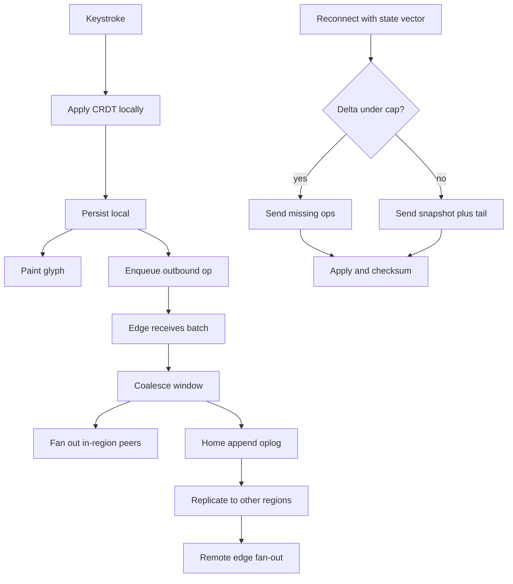

# Collaborative Document Engine — System Design
> - **Document Status**: Draft
> - **Last Updated**: 2026 Aug 29
> - **Author**: Paul Serban

This document is the mechanical *how* for the system described in the [Architecture Document](./02_architecture_document.md). It specifies CRDT op flow, edge coalescing, state-vector resync, home-region assignment, compaction, the millisecond budget, presence, and failure handling. It does not specify code.

Working capacity numbers (500k sessions, mean 8 editors/doc, intra-region p95 < 50 ms) are **assumptions** until Phase 0 replaces them. Mechanics do not depend on the exact count; sizing does. The 50 ms envelope **does not include** cross-continent hops. That is not a footnote; it is the budget.

## 1. Control Flow

Four planes. Coupling them is how typing dies (wait-for-home ACK) or how reconnect dies (no summary, full snapshot every time) or how Redis dies (presence on the durable bus).



**Invariant:** the paint path never waits on `homeAppend` or `replicate`. If the replicator is twelve minutes deep, **cross-region lag** is red; intra-region peers and the originator can still be green. That split is load-bearing.

## 2. CRDT Operations and State Vectors

The production merge is a CRDT. Brand is a Phase 0 pick (Yjs/YATA, Automerge, or an internal equivalent). The protocol requirements are brand-agnostic.

### 2.1 Identifiers

```
replica_id   = stable_id(user_id, device_id, doc_id)
op_id        = (replica_id, counter)          // or equivalent content-addressed change id
state_vector = map replica_id -> max_counter_seen
batch_id     = (doc_id, home_region, seq)   // storage order only; not merge order
```

- `replica_id` is **per device per document**, not per WebSocket session. A reconnect must present the same replica, or the state vector is meaningless and you duplicate identity (common production bug: new replica id every refresh → unbounded actor metadata).
- `batch_id` exists so the log can be stored and truncated. CRDT apply uses `op_id` / causal metadata, not `batch_id`. Treating `batch_id` as a global sequence is how you accidentally rebuild OT.

### 2.2 Apply rules

1. Local op: assign next counter for this replica; apply; persist; enqueue.
2. Remote op: if already in the document (same `op_id`), **no-op**. If missing, apply; CRDT integration determines position/marks.
3. Never block apply on "have we seen causal parents?" if the chosen CRDT is op-based and self-contained (Yjs updates typically are). If the chosen CRDT is change-DAG based (Automerge-class), missing dependencies are buffered, not applied to the visible tree, and the resync path must fetch them. **Pick one model in Phase 0 and do not mix.**
4. Visible rich-text schema (paragraphs, marks, tables, comments) is a **document type on top of the CRDT**, not "a string CRDT plus JSON in a blob." Tables that are a JSON blob inside one CRDT register will last-write-win entire tables. That is not collaboration; it is a race.

### 2.3 What CRDTs will not fix

- Two people independently converting the same paragraph into two different tables for three hours. Convergence is defined; **intent** is not. You get a defined mess.
- Move vs delete of the same subtree: depends on the list/tree CRDT. Test it; do not assume.
- Access control. A CRDT does not know tenants. ACL is session bind + encrypt + fail closed, not "the op contains a user id."
- A 200 MB pasted spreadsheet. Apply time and snapshot size become the product. Lazy-load / subdoc is a later phase, not a v1 promise for unbounded size.

## 3. Edge Relay: Batching and Fan-out

### 3.1 Why coalesce

A keystroke is ~one op. At 10 keys/s × 20 editors = 200 ops/s on one doc, each needing encode + N-1 sends. Coalescing 8–16 ms of ops into one batch:

- Cuts packets and syscalls.
- Still fits in a 50 ms intra-region budget if the coalesce window is a *slice* of the budget, not the whole thing.
- Must **not** wait for a full window if the batch is already large (size flush) or if the originator is the only editor (optional fast-path: still coalesce a tiny amount so the home log is not one-row-per-key).

Working default: `flush = min(16 ms, 32 KiB, N_ops >= 32)`. Calibrate. A 100 ms coalesce to "save bandwidth" spends the SLO on purpose.

### 3.2 Subscriber locality

Sessions for a given `doc_id` on a PoP hash to **one relay shard** (or a small tree of relays for hot docs). Random connection balancing across the PoP is forbidden for documents with N > ~10: each op becomes a mesh of extra hops.

Hot-document tree (only when N exceeds a measured threshold, e.g. 80):

- One **root** relay owns the document on the PoP.
- Additional relays subscribe to the root (not to every peer). Fan-out is O(relays + local_subscribers), not O(N²) across the fleet.
- This is still one logical CRDT document. It is **not** sharding the text.

### 3.3 Forward to home

After (or in parallel with) in-region fan-out, the edge forwards the batch to the document's home. If home is in-region, this is a LAN/metro hop and should not dominate. If home is out-of-region, **in-region peers must already have the batch** before the WAN hop completes. That is the entire point of the edge.

ACK to the originator: optional, for local-queue GC. It is **not** on the paint path. At-least-once: originator retries unacked batches; home is idempotent on `op_id`.

## 4. Resync Protocol

This is the replacement for "Redis had no replay so we dumped the whole document from Postgres."

### 4.1 Client connect

1. Load local snapshot + pending outbound ops + `state_vector`.
2. Open transport to nearest edge; authenticate; bind `doc_id`.
3. Send `Hello { replica_id, state_vector, pending_ops }`.
4. Receive `HelloOk { missing_ops }` **or** `Snapshot { snapshot, tail_ops, snapshot_vector }`.
5. Apply inbound; then integrate pending outbound (they may already be included if another path persisted them — idempotent).
6. Optional: `Checksum { vector, hash }`. Mismatch → SEV path (refetch snapshot, do not "keep typing on a divergent tree").

### 4.2 Server choice: delta vs snapshot

| Condition | Response |
| --- | --- |
| Missing ops byte size < `DELTA_CAP` (working: 512 KiB–2 MiB, Phase 0) and log still holds them | `missing_ops` |
| Missing ops would exceed cap | Latest snapshot + tail ops after snapshot vector |
| Client vector refers to ops the log already truncated | Snapshot + tail (required) |
| Client is empty / first open | Snapshot (cheap if snapshot 0 is tiny; still the path) |
| Client hash mismatch at agreed vector | Snapshot; page an integrity alert |

**Hours offline:** the laptop has many local ops the server has never seen, and is missing many server ops. Both directions move. The dangerous implementation is "push local then pull" without idempotence, or "pull snapshot that does not include a way to merge the local queue." Local pending ops must survive a snapshot install: typically, compute the snapshot into a new tree, then apply pending ops that are not in the snapshot. Test this with **clocks skewed and with compaction having dropped the client's old vector.**

### 4.3 Why full-snapshot-on-reconnect is the herd

If 20,000 clients on a PoP drop and reconnect, and each pulls a 5 MB snapshot: 100 GB in a few seconds, plus CRDT decode on the main thread, plus home CPU. Deltas for clients that were only down 2 s should be kilobytes. The cap exists so a 12-hour offline user takes the snapshot path *individually*, not so everyone does.

Jitter reconnect (randomized 0–few seconds, longer if `Retry-After`). Edge may serve **cached snapshots** for hot docs to keep home off the stampede.

## 5. Home Region, Sharding, Re-homing

### 5.1 Assignment

- **v1:** home = creator's region, or org's residency region if compliance demands it (residency beats latency).
- Metadata: `doc_id → home_region, snapshot_pointer, acl` in a small replicated store. This is the only thing Postgres is good at here.

### 5.2 Re-home (Phase 3+, not v1 required)

When write-weighted access is stably in another region (e.g. 90% of ops from EU for 7 days, home is NA):

1. Snapshot at home; copy snapshot + tail to new home.
2. Dual-write new ops to both for a short window, **or** a brief "syncing home" that does **not** freeze local apply (queue at edge).
3. Flip router; old home becomes replica.

Getting this wrong (two homes accepting as *home* without merge) is still recoverable with CRDTs **if** both append-only logs are kept and later unioned. Last-write-wins "the new home is truth" during a split is how you delete a region's work. Do not.

### 5.3 Replica regions

Every region that has live editors for a document should have a replica apply loop: receive batches, persist (or cache recent), fan out on local edges. Regions with zero editors need only lazy replica (snapshot on demand), not a hot follow of every keystroke. **Do not** replicate all 62k live documents at full op rate into every region by default — that is how cross-region bandwidth becomes a tax on documents nobody in APAC has open. Replicate **actively edited in that region** plus a standby snapshot for failover of homes.

## 6. Compaction and Tombstones

### 6.1 Why this is mandatory

Sequence CRDTs and rich-text CRDTs retain tombstones (deleted characters still occupy identity space until GC). Formatting marks and per-character metadata multiply size. A year of "track changes" without compaction is a 10× payload. Reconnect, apply time, and RAM on the client all degrade. Redis memory in the old system was often **this**, plus presence, plus retained pub/sub buffers — not "the text."

### 6.2 Procedure

1. Choose a vector V that **all currently connected replicas** have reached, **or** accept that anyone behind V will snapshot-resync (the usual choice at scale; do not wait for a laptop that has been closed for six weeks).
2. Serialize CRDT state at V to a snapshot blob; checksum.
3. Replicate the snapshot to replica regions (and edge cache for hot docs).
4. Truncate oplog segments whose ops are covered by V, after a grace period (working: 24–72 h) for flaky clients.
5. Run CRDT-native GC if the library supports it (e.g. garbage-collect deleted items that no remaining replica can still refer to). **Incorrect GC resurrects or duplicates content; this is a correctness test, not a storage optimization.**

### 6.3 Cadence

- Size-triggered: snapshot when payload exceeds k × visible text or an absolute byte cap.
- Time-triggered: at least daily for hot docs, weekly for cold.
- Never compact on the paint path.

Deleted-but-legally-held content is a **snapshot generation kept in a legal vault**, not "never GC the live CRDT." Mixing legal hold with live tombstones is how the editor stays slow forever.

## 7. Latency Budget

SLO owned by this design: **intra-region peer visibility p95 < 50 ms** for durable ops, among clients on the same regional PoP, at a Phase 0–measured N. Local apply is a separate, stricter SLO. Cross-region is **not** in this table's 50 ms.

Working ledger (allocations, not measurements — calibrate in Phase 4):

| Stage | p50 target | p95 allocation | In the 50 ms SLO? |
| --- | --- | --- | --- |
| Local CRDT apply + persist + paint | < 4 ms | 16 ms | **No** — user-felt, separate SLO |
| Client encode + send to edge | 2 ms | 8 ms | Yes (originator → edge) |
| Edge coalesce wait | 4–8 ms | 16 ms | Yes |
| Edge fan-out to in-region peer | 2 ms | 10 ms | Yes |
| Peer decode + CRDT apply + paint | 2 ms | 10 ms | Yes |
| **Intra-region sum (not local paint of originator)** | | **~50 ms p95** | Slack is small; do not add a Redis hop |
| Home append (in-region home) | 3 ms | 20 ms | **No** — durability, not peer visibility |
| Cross-region replicate + remote fan-out | 80–200 ms | 400–800 ms | **No** — own histogram |
| Snapshot resync (hours offline) | hundreds of ms–seconds | seconds | **No** — own SLO |

Wall clock for *peer in the same PoP*: coalesce + one hop + apply. If you insert a central Redis in another AZ or region, you spend the budget on a product that already failed.

**Where margin actually lives:** small coalesce, document-sticky relays, no extra broker, keep presence off this path, do not run CRDT apply on a 50 MB doc on the main thread without a worker.

If Phase 0 shows last-mile 350 ms to the *nearest* PoP, that user's *peer visibility* to a same-building colleague might still be fine (both local-first; P2P is out of v1) but their *path to the edge* is already >50 ms. **You cannot pick that last mile up with CRDTs.** Product: more PoPs, or accept that this user is not in the intra-region SLO. Do not average them into a global 50 ms and call it green.

## 8. Presence and Awareness

### 8.1 Separate channel

```
presence_msg = { replica_id, doc_id, cursor, selection, ts }
```

- Coalesce to ≤ 10 Hz per replica, or on pointer-up / selection change with a min interval.
- Drop oldest if the channel is congested; **never** drop durable ops to make room for a cursor.
- Do not persist. Do not replicate every cursor to every region. Optional: send a throttled "remote cursors" summary across regions at 1 Hz, or only for the viewport if you have that (v1: same-PoP presence is enough; cross-region cursors can be stale or hidden).

### 8.2 Why multiplexing fails

Cursor messages at 20 Hz × 50 editors = 1,000 msgs/s of non-data. On Redis Pub/Sub this is the memory and CPU profile people then blame on "CRDT." On the durable log it is a compaction nightmare (you would have to *not* log them — which means they were never durable, so they should not have been on that socket protocol). Two channels. See [ADR-006](./04_architecture_decision_records.md#adr-006).

## 9. Failure Handling

- **Client offline:** local apply continues; outbound queue grows; UI banner optional after a threshold. On reconnect: §4.
- **Edge PoP death:** clients reconnect (jittered) to another in-region PoP; Hello with state vector; **no** assumed in-memory relay buffer. Edges are not the source of truth.
- **Home unreachable, edge up:** in-region fan-out continues from the edge's recent buffer if you keep a **short** (seconds-to-minutes) durable-enough spill on the edge (or a regional log). Bound it. When home returns, forward the spill; idempotent. If the spill bound is exceeded, originators keep local queues and resync later — **do not** silently drop. Cross-region peers lag more; lag histogram goes red.
- **Home region lost (AZ/region):** promote a replica that has snapshot + bounded lag, *or* serve read-only until restore. Product must pick: **RPO of N seconds of ops** vs freeze. CRDTs do not make undurable ops reappear.
- **Network partition between regions:** both homes-as-replicas continue; editors local-first; merge on heal. Checksums after heal. Do not pick a winner.
- **Checksum mismatch:** stop serving that replica's tree as truth; snapshot refetch; alert. Repeated mismatch is a SEV (engine bug or bitrot).
- **ACL/auth fail:** fail closed; no fan-out.
- **Compaction bug (GC too eager):** restore from previous snapshot generation; this is why you keep N generations, not one.

## 10. Observability Minimum

If these do not exist, the system is not in production; it is a demo that got 500k connections.

- **Local apply** histogram on the client (sampled).
- **Intra-region visibility:** `peer_apply_ts - origin_apply_ts` using a shared op timestamp (origin monotonic + NTP-ish; **do not** use only server receive time — that hides client lag). p50/p95/p99, sliced by PoP and by `N` bucket.
- **Cross-region lag:** same formula, sliced by region pair. **Different dashboard panel.** Mixing is a defect.
- Home append latency; replicator queue depth and age.
- Resync: delta vs snapshot ratio, bytes, time-to-interactive.
- Document size: visible bytes, CRDT bytes, tombstone estimate, time since compact.
- Fan-out: ops/s and send/s per document; alert on hot docs.
- `presence_dropped`, `ops_retried`, `checksum_mismatch`.
- Reconnect herd: connects/s per PoP after an event.

Logs of document content are **customer data**. Sample, retain short, ACL the observability store.

## 11. Security and Residency (narrow)

- Session bind checks ACL before any fan-out.
- Payloads in transit: TLS. At rest: snapshot and log encryption. Local store: platform encryption plus app-level if the threat model includes stolen laptops (it does, for enterprise).
- A local replica in APAC of a document whose residency is EU is a **legal fact**, not an implementation detail. If residency forbids it, that user cannot have a full local doc — which **forbids offline** or requires a weaker product in that org. Write this down in Phase 0. Do not discover it at sales-engineering time.

## 12. Testing that actually matters

Not "WebSocket echo works."

- Concurrent insert at same position from 3 regions + 1 offline replica; checksum equality after sync.
- Hours-offline with compaction that truncated the client's old vector; snapshot+merge of local queue.
- Hot doc at p99 N: intra-region p95 still in budget; presence shed first.
- PoP kill: reconnect herd uses deltas for recent clients; snapshot cache hit rate.
- GC: deleted text does not reappear; legal snapshot still holds the hold-set.
- Table/list move-vs-delete concurrent; document the result even if ugly.
