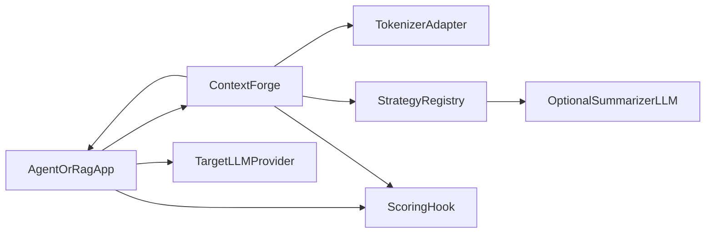
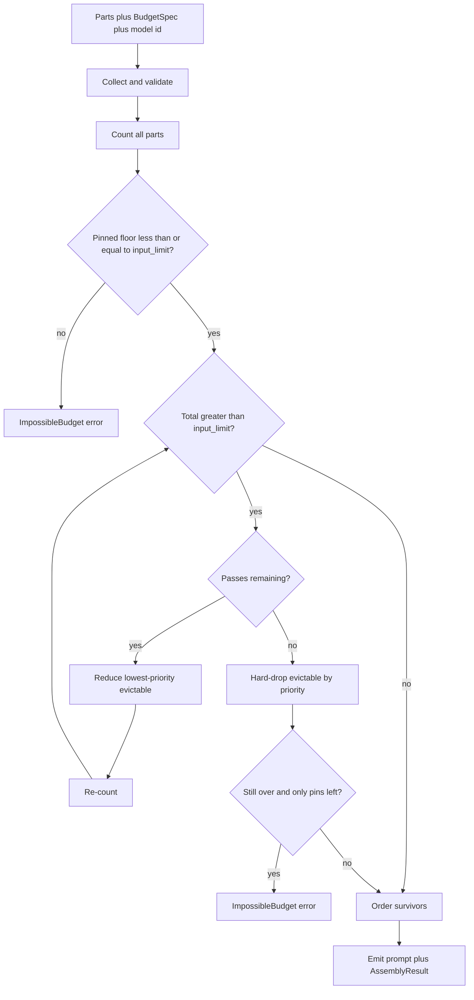
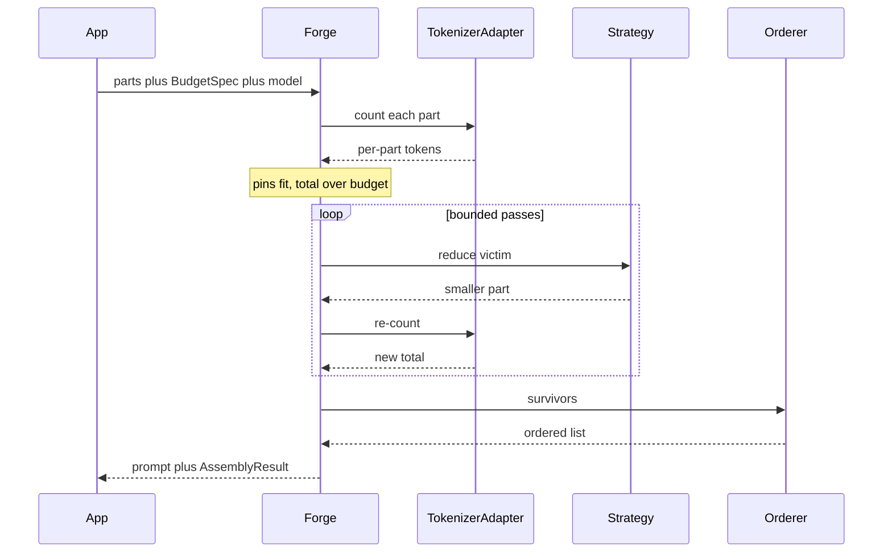
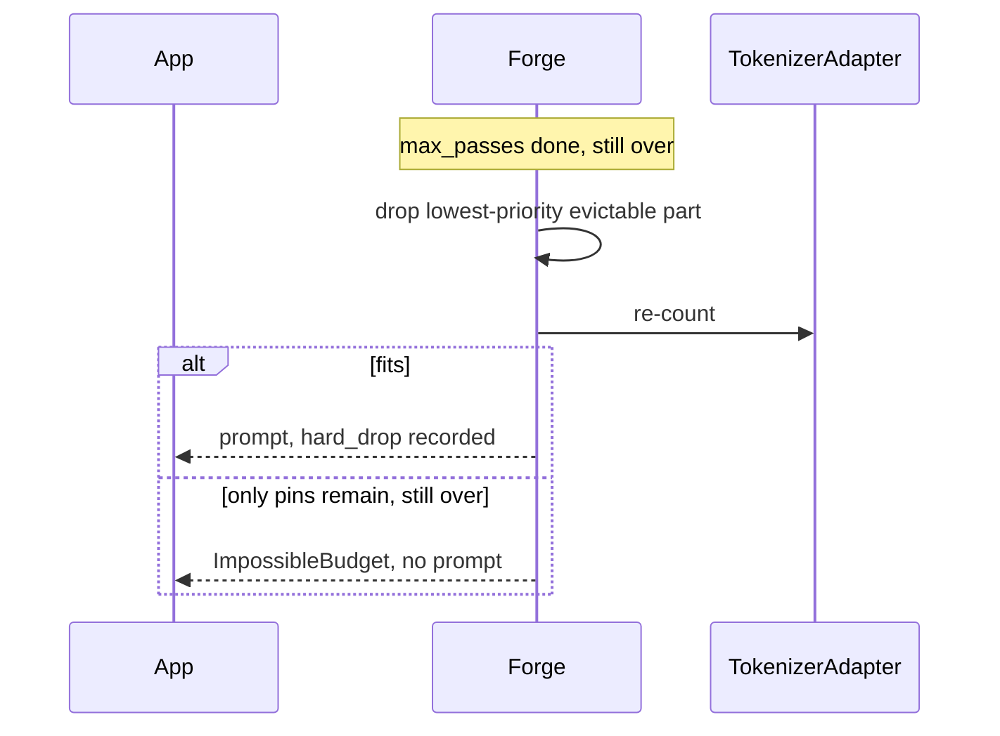
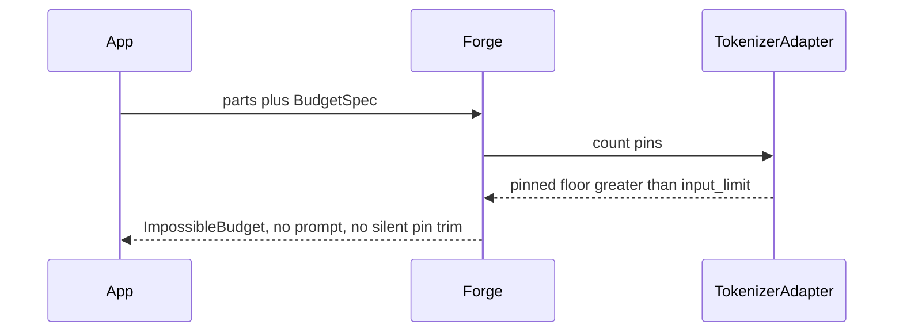

# Context Assembler (context-forge) — Architecture Document
> - **Document Status**: Draft
> - **Last Updated**: 2026 Aug 29
> - **Author**: Paul Serban

A **priority-tiered iterative budget allocator** for LLM context windows. Heterogeneous parts (system prompt, tools, few-shots, retrieved chunks, history, query) are counted with a real tokenizer, reduced by pluggable strategies in a bounded loop, then ordered for assembly. This document covers *what* the system is and *why* it is shaped this way; see [System Design](./03_system_design.md) for *how* counting, shrink, and hard-drop actually work, and [Trade-offs and Honest Assessment](./05_tradeoffs_and_honest_assessment.md) for what fitting does not buy you.

## Overview

**Brief description**: Context-engineering infrastructure, scoped narrowly: allocate a hard input-token budget across caller-declared parts without silently destroying pinned instructions, and without pretending that "it fitted" is a quality result. It is not a retriever, not a prompt optimizer, and not an eval harness.

**Business Context**
- See [Scenario and Requirements](./01_scenario_and_requirements.md) for the full framing. In short: every agent/RAG/chat path eventually concatenates more tokens than the model (or the bill) will bear. The naive trim is how system prompts die and tool schemas vanish. Product wants the window used well; finance wants fewer input tokens; on-call wants overflow to be a typed failure.
- Target users: library integrator, ML/product engineer, on-call, cost owner. The end user never sees the assembler.

## Requirements

### Functional Requirements

- **Collect**: accept a bag of `ContextPart`s (typed payload + caller-declared tier and priority + optional relevance scores + declared strategy).
- **Count**: tokenize each part with the adapter for the **target** model, including message/tool wrapping the provider will add, plus a safety margin applied to the budget — not to a fantasy of the raw strings.
- **Plan**: separate pinned from evictable. If pinned floor > `input_limit`, fail **impossible-budget**. Do not start shrinking evictable parts as a way to hide that the pins do not fit.
- **Reduce**: while over budget and passes remain, pick the lowest-priority evictable part (or part group) and apply its strategy. Re-count. Cap the loop.
- **Hard-drop**: if still over after the cap, drop evictable parts by priority until fit or only pins remain.
- **Order**: apply a placement policy independent of eviction order. Emit the assembled prompt.
- **Record**: `AssemblyResult` + telemetry (tokens in/out, reductions by strategy, summarizer calls, hard-drops). Optionally invoke a scoring hook *after* the downstream answer exists — the assembler does not block on quality.

### Non-Functional Requirements

**Performance Requirements:**
- Truncate + Drop + tokenize should add **milliseconds to low tens of milliseconds** on typical part sets, not a network RTT. If counting is a bottleneck, the adapter is doing I/O it should not (remote tokenize APIs as the hot path are a design fail for v1).
- Summarize, when enabled, adds **one or more LLM calls**. Latency and cost become "a generation" class, not "a join" class. That is why it is opt-in. See [ADR-007](./04_architecture_decision_records.md#adr-007).
- The shrink loop is bounded (working cap: a small integer of passes, e.g. 8, plus hard-drop). Unbounded loops under latency SLOs are forbidden.

**Reliability Requirements:**
- **Pinned parts never silently shrink or vanish.** Impossible-budget is the only legal outcome when they will not fit.
- **Determinism when Summarize is off.** Same inputs → same assembly. Required for tests, replay, and incident diffs.
- **Summarize failure is a typed degradation** (fall through to the part's fallback strategy, default Truncate or Drop), not a hung request and not an unlogged truncate.
- **Unknown tokenizer / unknown model id → fail closed.** Guessing `cl100k` for a model that is not `cl100k` is how you pass CI and 400 in production.
- **The assembler must not "help" by using the advertised window as the budget.** Output reserve is required configuration.

**Infrastructure Constraints:**
- Illustrative: a library (Python and/or TypeScript) called in-process by an existing agent/RAG service. Tokenizer: the official adapter for each supported model (tiktoken / HuggingFace tokenizer / vendor SDK counter — whatever actually matches). Summarizer: the same LLM stack the app already uses, invoked only if the strategy is on.
- No new vector database, no GPU cluster, no "context compiler" service in v1. A remote assembly service is how you add a SPOF and a RTT to every prompt. In-process first.
- This project does **not** include training a compressor model. If a learned compressor appears, it is a plugin strategy, not the core.

**The defining constraint:**
- The budget is hard and the parts are not equal. The architecture is: **stop treating the prompt as a string; treat it as tenants in a memory that can OOM.**

## Executive Summary

The scarce resource on the naive path was *trust that concat would fit and that whatever got sliced was unimportant*. The new path spends tokenizer truth and a pin policy to protect the instructions, spends a bounded loop to apply declared lossy strategies, spends a hard-drop so the loop always terminates, spends an orderer so survivors are placed where the model might actually read them, and spends telemetry so "better strategy" is a measured delta.

**Architecture Style:** Priority-tiered resource allocator with pluggable eviction strategies. Not a trimmer. Not a summarizer-with-a-length-check. Not a RAG pipeline.

**Key Components:**
- **Part Collector**: validates parts, tiers, strategies, scores.
- **Tokenizer Adapter**: per-model count, including wrapper tokens.
- **Budget Planner**: computes `input_limit`, pinned floor, impossible-budget.
- **Strategy Registry**: Truncate, Summarize, RelevancePrioritize, Drop.
- **Reduction Loop**: bounded shrink-until-fits; then hard-drop.
- **Orderer**: placement policy after the set of survivors is known.
- **Telemetry / Scoring Hook**: assembly metrics now; quality later, out of band.

**Technology Stack (illustrative):**
- Library: Python and/or TypeScript, in-process.
- Tokenizers: model-accurate adapters; no `chars/4` authority.
- Summarizer (optional): existing LLM client, strict max tokens, timeout, no tools.
- Telemetry: existing metrics + a durable `AssemblyResult` on sampled or all requests.

**Architecture Principles:**
- **Pins are a panic boundary, not a preference.** Kernel pages do not get OOM-killed first.
- **Count against the tokenizer that will bill/accept, then add margin.** Optimism here is a 400.
- **Strategies are loss functions.** The allocator does not know what a token "means."
- **Bounded loops.** Unknown summary size does not justify `while True`.
- **Placement ≠ priority.** Priority decides who lives. Placement decides where survivors sit.
- **Measure cost and quality separately from fit.** Fit is a gate. Quality is an eval.

**Key Architectural Decisions:**
1. **Tiered pinned vs evictable allocation; no flat pool.** [ADR-001](./04_architecture_decision_records.md#adr-001).
2. **Per-model tokenizer adapters + safety margin + re-count after every reduction.** [ADR-002](./04_architecture_decision_records.md#adr-002).
3. **Pluggable per-part-type strategies; allocator is strategy-agnostic.** [ADR-003](./04_architecture_decision_records.md#adr-003).
4. **Bounded shrink-until-fits with deterministic hard-drop fallback.** [ADR-004](./04_architecture_decision_records.md#adr-004).
5. **Ordering independent of eviction priority.** [ADR-005](./04_architecture_decision_records.md#adr-005).
6. **Quality/cost measurement via external scoring hook + telemetry; no built-in judge.** [ADR-006](./04_architecture_decision_records.md#adr-006).
7. **Summarize is opt-in, budgeted, non-deterministic, never silently chained.** [ADR-007](./04_architecture_decision_records.md#adr-007).

### Context Diagram

The target LLM is **not** inside the assembler except when the Summarize strategy is explicitly on — and that call is a compressor, not the user-facing completion. The scoring hook runs against the **user-facing** answer, owned by the app.

### Target path — one assembly

## Runtime Architecture

1. **Collect** (microseconds to milliseconds): validate part types, unique ids, pin flags, priorities, strategy names, optional scores. Reject unknown strategy. Reject RelevancePrioritize on a part with no scores.
2. **Count** (milliseconds; dominated by tokenizer): per-part token counts with wrapper overhead. Sum. Compute pinned floor.
3. **Plan** (microseconds): if pinned floor > limit, stop. Else if total <= limit, skip reduce.
4. **Reduce** (milliseconds, or seconds if Summarize): up to `max_passes`, reduce one victim per pass, re-count. Victim selection is deterministic given priorities (stable sort: priority, then part id).
5. **Hard-drop** (milliseconds): remove whole evictable parts until fit. Never drop pins.
6. **Order** (microseconds): apply placement policy to the survivor *set*.
7. **Emit**: assembled messages/parts structure the caller sends to the provider, plus `AssemblyResult`.
8. **Score** (async, after the user-facing completion): hook receives assembly telemetry + answer + task labels. Not on the assembly critical path.

Once pins are a panic boundary and counting is real, **tail-slicing a concat stops being the overflow architecture**. It remains available as the Truncate strategy on a *declared* evictable part — applied at part boundaries, not across the whole prompt.

### Happy path vs still-over after max passes

Hard-drop when the loop is exhausted (or Summarize is off and Truncate cannot create enough room):

Impossible-budget on entry (pins already too big) never enters the loop:

## Components

### 1. Part Collector
**Purpose**: Make "this bag of stuff" a valid allocation problem before any token is counted.

**Responsibilities:**
- Require: part id, type, payload, pin flag, priority (evictable only), strategy, optional relevance scores.
- Reject: pinned + evictable-only strategy that would mutate the pin; Summarize on a pin; RelevancePrioritize without scores; unknown model id (delegates to adapter); missing `output_reserve`.
- Canonicalize payloads so counting is stable (JSON key order for tool schemas, etc.). Unstable serialization is a self-inflicted token jitter bug.

**Interactions:**
- Reads: caller input.
- Writes: validated `ContextPart` list into the run.

### 2. Tokenizer Adapter
**Purpose**: Be the only source of token counts the planner believes.

**Responsibilities:**
- Map `model_id` → tokenizer + known wrapper overhead (chat template, tool JSON framing, per-message tax). If the mapping is missing, **fail closed**.
- Count a part as it will appear in the provider request, not as a raw string in isolation, when the difference is material (it often is: a "2k system prompt" is not 2k once wrapped).
- Never use `chars/4` as the returned count. A heuristic estimator may exist only as a **debug comparison metric**, never as the budget authority.
- Be local and deterministic. Remote "please tokenize" HTTP on the hot path is not v1.

**Interactions:**
- Called: before reduce, after every reduce, after hard-drop.
- Does not call the LLM.

### 3. Budget Planner
**Purpose**: Compute the real ceiling and the panic boundary.

**Responsibilities:**
- `input_limit = window - output_reserve - safety_margin_tokens`.
- `pinned_floor = sum(count(p) for p in pinned)`.
- If `pinned_floor > input_limit` → `ImpossibleBudget` with the numbers in the error. Do not round pins down.
- Safety margin is a configured fraction or absolute floor (working: 2% of `window - output_reserve`, minimum a few tens of tokens). Phase 0 may raise it after measuring provider disagreement.

**Interactions:**
- Reads: `BudgetSpec`, adapter counts.
- Writes: limits onto the run; may terminate the run.

### 4. Strategy Registry
**Purpose**: Keep lossy transformations out of the allocator core.

**Responsibilities:**
- Resolve strategy by name per part (or per type default).
- Each strategy: `(part, target_tokens, ctx) -> ReductionResult`.
- **Truncate**: shorten payload toward `target_tokens` at a declared grain (characters/tokens of this part, preferably at a structure boundary: last messages, last sentences, chunk suffix). Semantically blind. Cheap. Deterministic.
- **RelevancePrioritize**: given scores, keep a prefix of items (chunks, few-shots, turns if scored) that fits `target_tokens`. Requires scores. Deterministic given scores.
- **Drop**: return empty / remove part. Deterministic.
- **Summarize**: LLM compress toward `target_tokens`. Non-deterministic. Timeout. Fallback declared. See [ADR-007](./04_architecture_decision_records.md#adr-007).
- Strategies do not choose the next victim. They do not re-enter the planner.

**Interactions:**
- Called by Reduction Loop.
- Summarize calls optional LLM.

### 5. Reduction Loop
**Purpose**: Apply loss until fit or until the bound says stop.

**Responsibilities:**
- Select victim: lowest priority among evictable parts that still have a reduction remaining (a part that is already dropped is gone; a part marked "truncate exhausted" is not truncated into nothing if Drop is the next policy — keep this simple: one strategy per part as declared; if Truncate cannot get below target, the loop's later hard-drop removes the whole part).
- Invoke strategy with a target that is **greedy enough** to make progress (working: reduce that part toward its fair share or toward zero in one pass — see [System Design](./03_system_design.md)). A strategy that shrinks by 1 token per pass is a denial of the bound.
- Re-count **all affected parts** after each pass. Do not trust the strategy's claimed count as the new truth; the adapter is the truth. (A summarizer that says "800 tokens" and emits 1400 is a known liar.)
- Cap `max_passes`. Then hard-drop.
- Record every action on the run.

**Interactions:**
- Reads: parts, priorities, counts.
- Writes: mutated evictable parts; telemetry events.

### 6. Orderer
**Purpose**: Place survivors where attention is less likely to throw them away.

**Responsibilities:**
- Consume the survivor **set** (identity, not the eviction sequence).
- Apply a documented placement policy. Working default for `agent.answer_with_tools`: system/pinned instructions first; current query last (or in the user-message slot the API requires); high-value short pins (tools) adjacent to the system block; retrieved chunks and history arranged so the **most relevant / most recent** sit nearer the query, not buried in a long middle. See [System Design](./03_system_design.md) and [ADR-005](./04_architecture_decision_records.md#adr-005).
- Do not re-open eviction. If ordered prompt wrapper tokens change the count (they can), **re-count the serialized form** and if over limit, return to hard-drop — do not skip this. Placement that adds wrapper tokens and overflows is a real bug class.

**Interactions:**
- Reads: survivors, policy.
- Writes: ordered assembly; may trigger one more count.

### 7. Telemetry / Scoring Hook
**Purpose**: Make "this strategy is better" a pair of numbers, not a narrative.

**Responsibilities:**
- Always: `tokens_before`, `tokens_after`, `input_limit`, `pinned_floor`, reductions by strategy, parts dropped, hard_drop boolean, summarizer calls/latency/failures, impossible_budget boolean, model_id, route_id.
- Never: alert on "prose of the prompt changed" as a defect if Summarize is on — it will. Alert on pin mutation (should be impossible), impossible-budget spikes, provider context-length 400s despite `tokens_after <= input_limit` (margin/adapter bug), summarizer cost burn.
- Scoring hook: async, app-owned. Inputs: assembly telemetry, user question, final answer, optional labels. The library does not define "correct."

**Interactions:**
- Reads: every run.
- Writes: metrics; optional sampled payloads (PII policy applies — prompts are data).

### Communication Patterns

**Synchronous:**
- App ↔ library: one assemble call / one result or typed error.
- Library ↔ tokenizer: in-process.
- Library ↔ summarizer LLM: only if Summarize is on; timeout bounded.

**Asynchronous:**
- Metrics sink.
- Scoring hook after the user-facing completion (app-orchestrated).

There is no asynchronous "write this assembly to a cache for the next caller" in v1.

## Scaling Strategy

**Current Scale Requirements:**
- One route, human-paced or modest QPS (`agent.answer_with_tools`). Part counts in the tens (20 chunks, tens of turns), not millions of fragments. If someone passes 10,000 chunks, the bug is the retriever, not the assembler — RelevancePrioritize should see pre-capped input (e.g. top-50). The assembler is not a search engine.

**What scales horizontally:**
- Nothing shared. Each assemble is per-request, no cluster state. App hosts scale as they already do.

**What does not:**
- Summarizer RPM/TPM. A 20 RPS route with Summarize on every over-budget call is 20 extra generations **before** the real completion — and over-budget may be *most* calls if the policy is wrong. Capacity plan with this on.
- Tokenizer CPU at huge payloads. Counting 200k characters locally is usually fine; counting it on every shrink pass is why strategies must make real progress per pass, not 1-token nibbles.
- Cost of **kept** tokens. Even with a 128k window, sending 80k tokens of low-value chunks is a bill. The assembler can cap; product must **want** a cap below the window. A library default of "fill the window" is how you maximize spend. Prefer a `target_input` <= `input_limit` as an optional cost cap (same machinery). See [Trade-offs](./05_tradeoffs_and_honest_assessment.md).

**If QPS grows:**
- Keep Summarize off on the hot path; use Truncate/Drop/RelevancePrioritize.
- Cap retrieved chunks **before** assemble (retriever top-k).
- Do **not** add a global assembly cache as the first scaling move; it is a correctness/freshness problem for RAG and history.

**Bottleneck Analysis:**
- Default (Truncate/Drop): tokenizer + a bit of CPU. Should be invisible next to the user-facing LLM call.
- With Summarize: the summarizer *is* the bottleneck, and it is on the path **before** the call the user is waiting for.
- Misconfiguration: `max_passes` high + tiny truncate steps + huge parts = CPU and latency spike. Progress rules exist to prevent this.

### What changes as window or strategy mix changes

| Dimension | Truncate+Drop, 128k | Summarize on, or 8k/32k window |
| --- | --- | --- |
| Fit difficulty | Often idle; cost-cap still useful | Frequent reduce; pins may hit impossible-budget |
| Latency | ~tokenize | + summarizer RTT and queue |
| Determinism | Yes | No, for summarized parts |
| Quality risk | Blind cuts | Lost facts + extra variance |
| Bill | Input tokens of survivors | Survivors **plus** summarizer tokens |
| Temptation | Fill the window | Summarize everything "to be safe" |

## Data Architecture

### Data Model

**Key Entities:**
- **ContextPart**: part_id, type (`system`, `tools`, `few_shot`, `retrieved`, `history`, `query`, `other`), payload, pinned, priority, strategy, optional scores, token_count (filled by adapter).
- **BudgetSpec**: model_id, window, output_reserve, safety_margin, optional `target_input` (cost cap <= input_limit), max_passes.
- **TierPolicy**: route_id, pin set by type or part_id, default priorities, default strategies, placement policy id.
- **ReductionEvent**: run_id, pass, victim_id, strategy, tokens_before, tokens_after, fallback_used.
- **AssemblyResult**: run_id, ordered parts / serialized prompt, tokens_after, input_limit, pinned_floor, events, hard_drop, error (if any).
- **TelemetryRecord**: rollup fields above plus summarizer_calls, summarizer_ms, summarizer_tokens, scoring_hook_id (optional).

**Entity Relationships:**
- One assemble call → one run → N parts → 0..max_passes reduction events → one result or one typed error.
- TierPolicy is per route, not inferred per request (request may override only if explicitly allowed).

### Data Lifecycle

**Create**: parts at the app; counts at first tokenize; events as the loop runs; result at emit.

**Read**: on-call reads `AssemblyResult` to explain a missing tool or a 400; scoring hook reads telemetry + answer.

**Update**: evictable payloads mutate in the run; pins do not. Runs are not updated after emit.

**Delete**: sampled prompts retained per PII/debug policy. Metrics stay. Do not keep assemblies "in case we cache them later."

## Cost Analysis

### Cost Components

**Money:**
- User-facing LLM: **input tokens of the assembled prompt** (the whole point of a cost cap) + output tokens (not the assembler's).
- Summarizer LLM (optional): input = the part being compressed; output = the summary. This can exceed the cost of *keeping* a moderately oversized part, especially if the part would have truncated cheaply. Do the arithmetic in Phase 0 before enabling.
- Tokenizer: CPU, not tokens-billed — unless someone uses a billed tokenize API, which v1 should not.

**Engineering time — the actual build cost:**
- Tokenizer adapters that match production wrappers. This is most of the un-glamorous correctness work.
- The pin/evict/priority conversation with route owners. This is most of Phase 0.
- Telemetry and the scoring hook integration (the hook is small; the eval is not).
- Truncate-at-boundaries (messages, chunks) rather than mid-JSON.
- Summarize, if ever: timeouts, fallbacks, non-determinism in tests.

The allocator loop itself is small.

**Risk cost of skipping the allocator and "just concatenating":**
- Context-length errors, silent instruction loss, tool amnesia, unbounded input-token bills, no way to A/B "drop RAG vs drop history." That is why you would build this. If overflow is ~0 and the bill is fine, do not build it. See [Trade-offs](./05_tradeoffs_and_honest_assessment.md).

### Cost Optimization

- Default strategies: Truncate / Drop / RelevancePrioritize. Summarize last.
- Retriever top-k **before** assemble so the assembler is not given 200 chunks "just in case."
- Optional `target_input` below `input_limit` to stop filling 128k because it is there.
- Prefix-cache friendly stable prefixes (system + tools unchanged) — vendor billing win, not an application cache.
- Do not add an LLM judge of assemblies.

## Risks and Mitigation

| Risk | Likelihood | Impact | Mitigation Strategy | Owner |
| --- | --- | --- | --- | --- |
| Tokenizer disagrees with provider; 400 despite local fit | Medium | High | Safety margin; treat residual 400s as adapter bugs; never `chars/4` | Adapter owner |
| Margin too fat; quality dies from over-eviction | Medium | Medium | Measure provider delta in Phase 0; tighten; do not pick 20% "to be safe" forever | Phase 0 |
| Caller does not pin system/tools; overflow drops them | High | High | Example policy for the running route; fail reviews that default-unpin instructions; telemetry on pin misses | Route owner |
| Summarize on by default in a wrapper | High | High (cost, latency, variance) | Library default: Summarize off; [ADR-007](./04_architecture_decision_records.md#adr-007) | Integrator |
| Unbounded summarize-until-fit | Medium | High | max_passes + hard-drop; strategy cannot recurse summaries without a flag | Reduction Loop |
| RelevancePrioritize without a real ranker; fake scores | Medium | High | Require scores; if uniform, behavior equals Truncate-of-list; do not invent embeddings in-library | App / retriever |
| Lost-in-the-middle ignored; survivors unread | Medium | Medium | Orderer policy; do not treat eviction order as serialisation order | Orderer |
| Truncate splits JSON/tool calls / mid-fact | High | High | Truncate at part sub-structure boundaries; prefer Drop whole chunk to half a chunk | Truncate strategy |
| Impossible-budget in prod after a prompt edit bloats pins | Medium | High | Alert; pins must be sized in CI against the smallest window you claim to support | Route owner |
| Wrapper tokens after ordering overflow | Medium | Medium | Final serialize-and-count; extra hard-drop if needed | Orderer |
| Scoring hook becomes an LLM-as-judge in process | Medium | Medium | Hook is a callback; [ADR-006](./04_architecture_decision_records.md#adr-006) | App evals |
| PII in AssemblyResult logs | High | High | Sample, redact, retention; prompts are data | Operator |
| Filling 128k because the window exists | High | Medium (bill) | Optional target_input; cost metrics | Cost owner |
| Treating this library as a substitute for retrieval quality | High | High | Non-goal; garbage chunks in, truncated garbage out | Product |

## Future Enhancements

### Phase 1 (current design target)
Deterministic core: adapters, tiers, Truncate + Drop, bounded loop, hard-drop, impossible-budget. See [Phased Implementation Plan](./06_phased_implementation_plan.md).

### Phase 2
Orderer + telemetry + scoring hook integration; first quality/cost comparisons.

### Phase 3
Optional Summarize behind a flag, measured, killable.

### Phase 4
RelevancePrioritize with real retriever scores; per-route `target_input`; additional routes each with their own Phase 0.

### Explicitly not in this design

- `chars/4` as budget authority.
- Silent truncation of pinned parts.
- Unbounded summarization.
- Built-in quality judge / second-model critic.
- Learned prompt compressors as v1 core.
- A company-wide "context gateway" service that rewrites every team's prompts without a pin policy.
- Guaranteeing that a fitted prompt answers as well as the overflowed one would have (you cannot know that; the overflowed one often would not have run at all).
