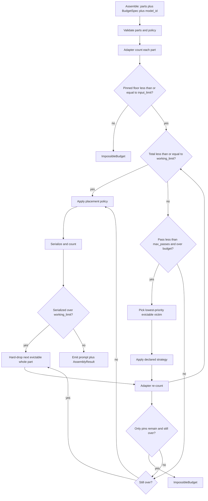
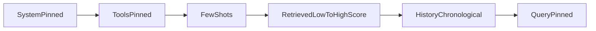

# Context Assembler (context-forge) — System Design
> - **Document Status**: Draft
> - **Last Updated**: 2026 Aug 29
> - **Author**: Paul Serban

This document is the mechanical *how* for the allocator described in the [Architecture Document](./02_architecture_document.md). It specifies counting, tiers, the shrink loop, strategy contracts, ordering, and failure modes. It does not specify code.

## 1. Control Flow

One assemble call, one budget, one survivor set, one ordered prompt. The caller does not "truncate a bit extra if it looks tight" outside this loop — that is how pins die in a wrapper.



**Invariant:** pinned payloads are never arguments to Truncate, Summarize, RelevancePrioritize, or Drop. If a pass would require shrinking a pin, the run has already failed impossible-budget — or the collector accepted an illegal policy.

**Working defaults for `agent.answer_with_tools`:** `output_reserve = 4000`, `safety_margin = 2%` of `window - output_reserve`, `max_passes = 8`, Summarize **off**, Truncate at sub-structure boundaries, tools and system and query pinned. These are route parameters. Shipping `chars/4` or silent pin trim is not a parameter change.

`working_limit` is `min(input_limit, target_input)` when a cost cap is set; otherwise `input_limit`. See §3.

## 2. Tiering and Priority

### 2.1 Pins vs evictable

| Class | Mutation allowed | If they will not fit |
| --- | --- | --- |
| **Pinned** | None | `ImpossibleBudget`; no prompt |
| **Evictable** | Declared strategy, then hard-drop | Reduced or removed until fit or only pins left |

Pin is a boolean on the part, usually from `TierPolicy` by type:

| Type | Default on this route | Notes |
| --- | --- | --- |
| `system` | Pinned | Policy, refusals, identity. |
| `tools` | Pinned | Unpinning a tool is an explicit route change. |
| `query` | Pinned | The current user message. |
| `few_shot` | Evictable, priority 80 | Prefer drop-whole-example over mid-example truncate. |
| `retrieved` | Evictable, priority 40 | Needs scores for RelevancePrioritize; else Truncate/Drop by list order the retriever sent (which is a weak relevance proxy — say so in telemetry). |
| `history` | Evictable, priority 20 | Prefer drop **oldest** turns as Truncate grain, not the middle of the latest turn. |
| `other` | Evictable, priority 10 | Caller must set; default low so undeclared junk dies first. |

Priority is an integer, **higher = more important = evicted later**. Victim = minimum priority among remaining evictable parts that still occupy tokens. Ties: stable sort by `part_id`. Do not randomize. Do not "rotate fairness" across requests; that makes incidents unreproducible.

The library **does not infer** that tools beat history. The table above is the **example policy** for the running route, signed in Phase 0. Copying it to a coding agent that needs the last 20 file chunks more than the tool list is how you get a confident wrong default.

### 2.2 Groups

Optional: several retrieved chunks as separate parts with the same priority. Victim selection picks one part (lowest priority, then id). A "group strategy" that jointly picks the worst-scoring 5 chunks is RelevancePrioritize on a **single** `retrieved` part whose payload is a list. Prefer list-parts for RAG; prefer one-part-per-turn for history if you want per-turn drop. Mixing "20 chunk parts" with per-part Truncate works but makes pass count noisier.

### 2.3 What the policy is not

- It is not inferred from token size (largest first). Large retrieved blobs are often the right sacrifice; large system prompts are not.
- It is not "arrival order."
- It is not ML-predicted importance in v1.

## 3. Token Counting

### 3.1 The budget identity

```
input_limit    = window - output_reserve - safety_margin_tokens
working_limit  = min(input_limit, target_input)  if target_input set, else input_limit
pinned_floor   = sum(adapter.count(p) for p in pinned)
```

- `window`: the model's advertised context length **as configured**, not as hoped.
- `output_reserve`: room for completion **and** tool-call arguments/results you still need in this request's remaining turns if the caller is in a multi-round loop. If the app runs 8 tool rounds in one user request, **either** the app re-assembles each round with a fresh reserve **or** `output_reserve` is a lie. This design assumes **re-assemble each round** (history grew; budget must be recomputed). A single assemble at the start of an 8-round loop is the concat bug wearing a library costume.
- `safety_margin_tokens`: working `ceil(0.02 * (window - output_reserve))`, minimum 32. Phase 0 may raise after measuring provider_count - local_count.
- `target_input`: optional cost cap. Same loop, tighter ceiling. Not a second architecture.

### 3.2 What the adapter must count

Count the part **as it will be sent**:

- Chat-template / per-message overhead (role tokens, delimiters).
- Tool-schema framing the provider adds.
- Special tokens the official tokenizer includes.

If the adapter counts only inner strings, the final serialize-and-count step (§6) will hard-drop "unexpectedly." That step is mandatory **because** wrappers are easy to under-count; it is not a license to skip per-part counting (the loop needs per-part numbers to choose victims).

### 3.3 Re-count discipline

| When | Count what |
| --- | --- |
| After collect | Every part |
| After each strategy application | The mutated part, then re-sum (or incrementally update that part's count) |
| After each hard-drop | Remove that part's count |
| After order + serialize | **The exact bytes/messages the client will send** |

Do not trust `ReductionResult.claimed_tokens` as authority. Log the delta `claimed - adapter` as a strategy-honesty metric. Summarizers lie.

### 3.4 Heuristics

`chars/4` (or `chars/3.5`, or "English is 4 chars") may be logged as `heuristic_tokens` for debugging drift. It **must not** gate `working_limit`. A test suite that only asserts the heuristic is a failed test suite.

### 3.5 Unknown model

If `model_id` has no adapter: **fail closed** (`UnknownTokenizer`). Do not fall back to another model's tokenizer. Do not fall back to the heuristic. The caller picks a supported model or they do not assemble.

### 3.6 How wrong `chars/4` actually is

Illustrative, not a paper:

| Content | Typical heuristic error vs real BPE |
| --- | --- |
| Plain English prose | Often "ok-ish" (10–20%) |
| JSON tool schemas, code, IDs | Often 20–40%+ undercount (punctuation-heavy) |
| Non-English, markup, base64 | Worse |
| Chat wrappers ignored | Systematic undercount of **every** message |

A 15% undercount on a "tight" 8k pack is a 400. A 15% overcount is extra eviction and worse answers. Neither is an architecture. Use the adapter.

## 4. Strategy Interface

Every strategy implements:

**Input:** part, `target_tokens` (>= 0), run context (tokenizer adapter, timeouts, summarizer client if any).

**Output:** `ReductionResult`: new payload (or tombstone), `claimed_tokens`, `exhausted` (cannot usefully shrink further without Drop), `fallback_used`, `external_calls`.

**Rules:**

- Must not mutate pinned parts (collector/loop enforce).
- Must make **progress** or set `exhausted=true`. Progress: adapter count of the part strictly decreases, or the part is dropped. A no-op that leaves the loop spinning is a bug; the loop treats no-op as `exhausted` and moves to the next victim / hard-drop.
- `target_tokens` is a **ceiling for this part**, not a promise the rest of the prompt will fit. The loop re-sums.

### 4.1 Truncate

**Grain (must be declared per type):**

| Type | Truncate grain (working) |
| --- | --- |
| `history` | Drop oldest **whole turns** until under target (keep newest). Never cut the newest turn in half if a whole older turn can go instead. |
| `retrieved` | Drop **whole chunks** from the end of the retriever list (or from lowest score if scores exist — that is RelevancePrioritize; Truncate without scores uses list order). |
| `few_shot` | Drop **whole examples** from the end (or lowest score). |
| `other` | Token-level tail trim only if there is no inner list; last resort. |

**Forbidden grains by default:** mid-JSON key, mid-tool-name, mid-code-fence without closing, half a chunk that starts in the middle of a table. Prefer dropping a whole unit to keeping a corrupted unit.

**Cost:** CPU. **Determinism:** yes. **Quality:** semantically blind except for the grain heuristic (recency, list order).

### 4.2 RelevancePrioritize

**Requires:** a list payload with a numeric score per item (retriever or reranker). Missing scores → collector reject, not a silent fallback to Truncate (falling back is allowed only if the route **declared** Truncate as the strategy). Mixing "optional scores" with silent fallback hides the fact that you are not prioritizing.

**Behavior:** sort by score descending, keep the longest prefix whose adapter count is `<= target_tokens` (plus any fixed header inside the part). Remaining items dropped.

**Cost:** CPU. **Determinism:** yes given scores. **Quality:** as good as the ranker. Garbage scores → confident wrong keep-set.

This library does **not** compute embeddings. If the app wants scores, the retriever already ran.

### 4.3 Drop

Remove the part. Count → 0. `exhausted=true`.

Use when the part is all-or-nothing (a nice-to-have appendix) or as hard-drop's primitive.

### 4.4 Summarize

See [ADR-007](./04_architecture_decision_records.md#adr-007). Mechanical contract:

- **Opt-in** per part or per type. Library-wide default: not registered as the type default.
- One LLM call per invocation. `max_output_tokens` set from `target_tokens` (and a floor so tiny targets do not emit 1-token nonsense — if `target_tokens` is below a configured minimum, **do not summarize**; set `exhausted` and let Drop/Truncate handle it).
- Timeout: working 2–5s or the route's latency budget leftover — if the user-facing SLA cannot absorb this, the strategy must not be on.
- On timeout, 5xx, empty output, or adapter count still `>=` previous count: `fallback_used=true`, apply the part's `summarize_fallback` (working: Truncate). Do not retry unbounded.
- **No chain:** the output of Summarize must not be fed to Summarize again in a later pass unless `allow_summary_of_summary` is explicitly true on the policy (default false). The loop enforces this with a flag on the part (`already_summarized`).
- Prompt for the summarizer is a **fixed template** owned by the route ("preserve order ids, amounts, tool names; do not invent"). That template is itself tokens — counted as summarizer **input** cost, not magically free.
- Temperature: 0 is allowed **for the summarizer** (a compressor, not the user-facing creative route). That is not a contradiction with other projects' T>0 constraints; it is a different call. Still not deterministic across providers/versions.

**Cost:** a full extra generation. **Determinism:** no. **Quality:** unknown until scored.

## 5. Shrink Loop and Hard-Drop

### 5.1 Victim selection

Each pass:

1. If total <= working_limit: exit loop.
2. If pass >= max_passes: go to hard-drop.
3. Candidate set: evictable parts with count > 0 and not `loop_skip`.
4. Victim = lowest priority, then lowest part_id.
5. `target_tokens` for the victim: **aggressive enough to matter.**

Working target rule (pick one in Phase 1 and do not bikeshed):

**Deficit rule:** `deficit = total - working_limit`. Ask the victim to reach `max(0, victim_count - deficit)` — i.e. try to close the entire deficit from this one part if possible. If the part is smaller than the deficit, the strategy will exhaust/drop it and the next pass takes the next victim.

Why not "shave 10% off everyone": more passes, more summarizer calls if that strategy is on, slower convergence. Why not "fair share remaining budget across evictable parts in one shot": a single-pass allocation **cannot** know Summarize output size; the loop exists because of that. Even with only Truncate, one-shot fair share is valid **as an alternative** — rejected for v1 uniformity: one loop, all strategies. A Truncate-only fast path that computes a one-shot keep-set is an allowed optimization if it is observably equivalent (same survivors). It must not be a second policy.

### 5.2 Pass bound

Working `max_passes = 8`. Enough for "drop several history turns + drop some chunks" without becoming `while True`. If 8 passes cannot fit, hard-drop whole remaining evictable parts — that is usually what you wanted anyway.

### 5.3 Hard-drop

After the loop, while total > working_limit and evictable parts remain:

- Remove the lowest-priority remaining evictable part entirely.
- Re-count.
- Record `hard_drop=true` and the part ids.

If evictable is empty and total still > working_limit: **ImpossibleBudget**. This should have been caught at pin check unless ordering wrappers added tokens. The serialize step can create this; treat it as a real failure, not a license to trim pins.

### 5.4 Guaranteed termination

Passes are bounded. Hard-drop removes at least one part per iteration. Finite parts. Halt. Unbounded summarize-until-fit is not a mode that can be turned on with a flag.

## 6. Ordering (Placement)

Eviction produces a **set**. Ordering produces a **sequence** (or a structured messages array).

### 6.1 Why this is not eviction order

Lost-in-the-middle: models disproportionately use the **beginning and the end** of a long context. Dumping the system prompt, then 40k tokens of RAG, then the query, can bury the best chunk. Dumping RAG then system then query can bury instructions on some templates. Arrival order is "how the handler fetched," not "how attention works."

This is **empirical and model-dependent**, not a law. The design requirement is: **placement is explicit and swappable**, not that one layout is forever optimal. Phase 2 measures.

### 6.2 Working default for `agent.answer_with_tools`

Structured chat messages, not one mashed string (if the provider allows):

1. **System** (pinned): instructions.
2. **Tools**: provider tool channel if any, else a system-adjacent block. Do not place tools after a 50k history dump.
3. **Few-shots**: remaining examples.
4. **Retrieved**: remaining chunks, **highest score last among the retrieved block** (nearest the query) if scores exist; else retriever order with the last kept chunk closest to the query.
5. **History**: remaining turns in chronological order (conversation coherence beats relevance-sort of turns unless a route proves otherwise). Recency already biased what **survived** via Truncate grain; do not then reverse chronology in the surviving window.
6. **Query**: last user message.



**History vs RAG order:** some routes do RAG after history. The default above puts RAG **before** history so the latest turns sit nearer the query (recency at the end). If Phase 2 shows the opposite wins on this model, swap. That is a policy id, not a new assembler.

### 6.3 Final serialize-and-count

After placement, serialize exactly as the client will send (including tool-call message wrappers). If `adapter.count(serialized) > working_limit`, re-enter hard-drop (not Truncate on pins, not "shave the system prompt"). Wrapper tax should be in per-part counts; residual overflow here is a bug to fix in the adapter, with hard-drop as safety net.

## 7. Failure Modes

| Class | Examples | Behavior |
| --- | --- | --- |
| **ImpossibleBudget** | Pinned floor > working_limit; post-serialize only pins left and still over | **No prompt.** Typed error with numbers. Alert. |
| **UnknownTokenizer** | model_id not in adapter map | **No prompt.** Do not guess. |
| **InvalidPolicy** | Summarize on a pin; RelevancePrioritize without scores; missing output_reserve | **No prompt.** Collector reject. |
| **Strategy no-op** | Truncate cannot parse structure; summarizer returns equal-length text | Mark exhausted; next victim or hard-drop. Log. |
| **Summarizer timeout / 5xx / empty** | Network, provider, content filter | Fallback strategy; `fallback_used`. Do not retry forever. |
| **Summarizer inflates count** | "Summary" longer than source | Discard summary; fallback. Do not keep the worse payload. |
| **Provider context-length 400** after assemble claimed fit | Adapter/margin failure | Incident on the adapter, not a silent extra slice in the client. Tighten margin. |
| **Empty evictable, still over** | Pins grew or wrappers under-counted | ImpossibleBudget. |
| **PII / huge part** | 2MB paste as `other` | Still a part; Truncate/Drop. Do not OOM the process — payload size cap at collector (bytes), independent of tokens. |
| **Process crash mid-assemble** | In-process; no partial prompt to "resume" | Caller retries assemble; must be deterministic if Summarize off. |

### Circuit breaker (Summarize only)

If summarizer error rate exceeds a bound (e.g. 20% of assemble calls in a window), **disable Summarize** for the route (feature flag) and fall back to Truncate/Drop. A dying compressor must not sit on the hot path of every support ticket.

### What is not retried

- Successful Truncate/Drop (do not re-truncate because the *next* part failed).
- ImpossibleBudget (retrying will not shrink pins).
- Provider 400 by blindly cutting 10% in the HTTP client.

## 8. Stop / Done Conditions

The assembler is **done** when:

- a prompt is emitted with serialized count <= working_limit, pins intact, `AssemblyResult` populated, or
- a typed error is returned (`ImpossibleBudget`, `UnknownTokenizer`, `InvalidPolicy`) with no prompt.

It is allowed to be done at 12% of the original evictable tokens. It is not allowed to be done with a sliced system prompt.

Idle / no-op assemble (already under budget) is success: identity transform + telemetry that says `passes=0`.

## 9. Observability (minimum, v1)

No new APM product. Metrics and a structured `AssemblyResult`:

- `tokens_before`, `tokens_after`, `working_limit`, `pinned_floor`, `window`
- `passes`, `hard_drop`, `impossible_budget`
- per-strategy: parts_touched, tokens_removed, `summarizer_calls`, `summarizer_ms`, `summarizer_tokens_in/out`, `fallback_used`
- `provider_context_400` correlated after the fact (app metric joined by run_id)
- `heuristic_tokens` vs `adapter_tokens` (drift dashboard)

Alert on: impossible-budget rate, provider 400s despite fit, summarizer error/latency burn, pin-mutation (should be zero; if not, page), `tokens_after` p95 vs `target_input` if cost cap exists.

Do not alert on "history was truncated." That is the system working. Do alert if **query** or **system** is missing from a successful emit (should be unreachable).

## 10. Security and data (brief)

This project has no separate security-architecture doc because it is an in-process library over data the app already holds. Still:

- Parts are often PII (tickets, orders). `AssemblyResult` sampling is a data-retention decision. Default: metrics without payloads; payloads on error samples with retention.
- Summarizer sees whatever part you send it — a second provider copy. If the main model is allowed to see it, the compressor usually is; if not (data residency), Summarize cannot point at a different-region model "because it is just a summary."
- Do not log full prompts at info once Phase 0 is over.
- Truncate must not be used to "redact secrets" (length is not a security boundary). Redact **before** assemble if required.
