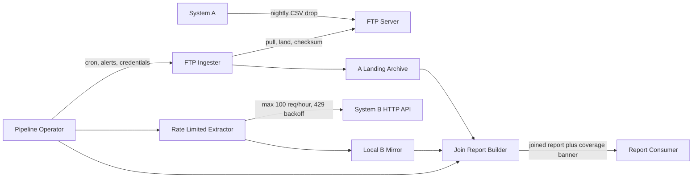
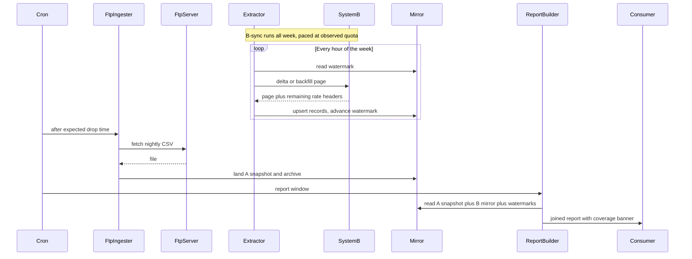

# Cross-System Report Pipeline — Architecture Document
> - **Document Status**: Draft
> - **Last Updated**: 2026 Aug 29
> - **Author**: Paul Serban

A deadline-driven integration that joins System A's nightly FTP CSV with a persistent local mirror of System B, because System B's 100-request/hour cap makes a live 50,000-record pull **arithmetically impossible** on the first weekly cycle (and worse on a daily one). This document covers *what* the system is and *why* it is shaped this way; see [System Design](./03_system_design.md) for *how* the limiter, watermarks, ingest, and join actually work, and [Trade-offs and Honest Assessment](./05_tradeoffs_and_honest_assessment.md) for what is abandoned and what is asked for expecting a no.

## Overview

**Brief description**: Internal reporting infrastructure, scoped narrowly: one joined report per cycle, produced from a landed System A snapshot plus whatever System B the local mirror currently holds, with completeness printed on the artifact. It is not a general integration platform, not a warehouse, and not a real-time sync.

**Business Context**
- See [Business Overview](./01_business_overview.md) for the full framing. In short: the rate limit is the architecture, the deadline is the forcing function, and silent incompleteness is the failure mode that matters more than missing Friday.
- Target users: report consumer, pipeline operator. System A/B teams are out of the runtime path.

## Requirements

### Functional Requirements

- **System A ingest**: the system must pull the nightly CSV from the FTP server, land it immutably (raw file + checksum + drop date), and detect a missing/late/duplicate/schema-drifted drop without hanging the rest of the pipeline.
- **System B extract**: the system must fetch System B records under an enforced client-side rate limiter that never exceeds 100 requests/hour and that additionally backs off on observed 429/`Retry-After` (the documented cap is a ceiling, not a guarantee of exclusive use).
- **Local B mirror**: the system must persist fetched System B records and a sync watermark so that a crash, a restart, or a later cycle does not re-spend quota on records already held.
- **Incremental sync**: after the initial backfill, the system must prefer delta fetches (`updated_since` or equivalent) when the API supports them; if it does not, it must fall back to an ID-cursor crawl and treat that fallback as a first-class, worse design — not a silent equivalent. See [ADR-001](./04_architecture_decision_records.md#adr-001).
- **Join/report**: the system must join the current System A snapshot to the current B mirror on the documented join key, emit the report artifact, and **always** attach coverage and freshness metadata.
- **Replay**: a report for a given A-drop date must be re-runnable from the A archive plus the B mirror as of a recorded watermark, without re-hitting System B.
- **No live full pull**: the report job must not attempt to fetch all ~50,000 System B records as part of producing a report. That job is not allowed to exist, because it cannot finish.

### Non-Functional Requirements

**Performance Requirements:**
- Throughput is gated by System B's 100 req/hour, not by CPU, disk, or FTP. Designing for "faster extracts" is wasted motion unless page size or a bulk path changes.
- System A ingest is a single nightly file; it should complete in minutes on any machine that can hold a CSV. If it does not, the file is larger than this scenario assumed and Phase 0 should have caught that.
- Report generation against a 50k-row local join is a laptop-class operation. Do not introduce a distributed compute layer for it.

**Reliability Requirements:**
- **Quota is not retry-safe in the naive sense.** A retry that re-issues a successful request wastes irrecoverable budget. Checkpoint after every successful page. See [System Design — Error Handling](./03_system_design.md#6-error-handling).
- **A missing nightly A drop must not look like an empty business day.** The report either waits (with a SLA-bound wait), uses the last good A file *and says so*, or fails loud. Silent substitution is forbidden.
- **The pipeline must survive a mid-backfill crash** without losing watermark progress and without double-writing conflicting B rows.

**Infrastructure Constraints:**
- Technology stack (illustrative, vendor-agnostic where it matters): a scheduled process (cron or the scheduler already on the box); a local durable store (SQLite, or an existing database — **no new paid datastore**); an FTP client; an HTTP client with a token-bucket limiter; local disk for the A landing/archive zone.
- Hosting: whatever machine already exists and can reach the FTP server and System B. No new cloud account, no new SaaS orchestrator, no new warehouse. See [ADR-005](./04_architecture_decision_records.md#adr-005).
- Compliance: none formal assumed. Credentials for FTP and System B are secrets; they live in the environment/secret store the operator already has, not in the repo. The B dataset may be sensitive — the local mirror is then a copy of sensitive data on a box the operator is now responsible for. That is an accepted, uncomfortable consequence of "build a warehouse-of-one." See [Risks](#risks-and-mitigation).

**The defining constraint:**
- `100 requests/hour × 168 hours/week = 16,800 requests/week` before retries, shared use, or downtime. A 50,000-record pull at 1 record/request cannot complete in a week. Daily is `100 × 24 = 2,400`. Architecture that ignores this number is not architecture; it is a plan to miss the deadline and then lie about coverage.

## Executive Summary

The pipeline is a **stateful, two-source integration**: System A is landed cheaply every night; System B is mirrored slowly behind a rate limiter; the report is a local join plus an honesty banner. The scarce resource is System B quota. Everything else is ordinary batch plumbing.

**Architecture Style:** Batch ETL (extract–checkpoint–load) + local analytical join. Not event-driven, not streaming, not microservices, not a data mesh.

**Key Components:**
- **FTP Ingester (System A)**: scheduled pull, landing zone, immutable archive, checksum/idempotency, late/missing/schema-drift handling.
- **Rate-Limited Extractor (System B)**: token-bucket client, 429-aware backoff, page/cursor walking, watermark persistence.
- **Local Mirror / State Store**: System B records, sync watermark(s), run history, coverage snapshots. The architecturally significant store — this is a warehouse-of-one, not a cache.
- **Join / Report Builder**: local join of the current A snapshot to the current B mirror; emits the artifact and the completeness/freshness banner.
- **Orchestrator**: cron (or equivalent) sequencing A-ingest → (continuous) B-sync → report-build. Not a new product.

**Technology Stack:**
- Scheduler: cron / systemd timer / whatever already runs jobs on the box.
- Language: whatever the operator can ship in a week (Python is the realistic default for FTP + HTTP + CSV + SQLite; this document does not require it).
- Store: SQLite file next to the job, or an existing Postgres/MySQL. New managed warehouses are out.
- Transport: FTP (or SFTP if that is what is actually there — confirm in Phase 0), HTTPS to System B.

**Architecture Principles:**
- **Do not fetch what you already have.** Quota spent on a known, unchanged B record is a defect.
- **The mirror is the source of truth for reports.** Live System B is a replenishment source, not a query source.
- **Label incompleteness; never hide it.** Coverage and watermark are part of the report schema, not a log line the consumer will never see.
- **Observe the limit, do not trust the brochure.** 100/hour is the documented cap; 429s are the real cap.
- **Ask expecting no; design for no.** Phase 0 sends the asks. The runtime path does not wait for them.

**Key Architectural Decisions:**
1. **Delta-and-mirror over full-pull-per-cycle** — the full pull cannot finish; the mirror can converge. [ADR-001](./04_architecture_decision_records.md#adr-001).
2. **Local durable store as system of record for B**, not a cache in front of live reads. [ADR-002](./04_architecture_decision_records.md#adr-002).
3. **Token-bucket + observed 429 backoff**, not a naive `sleep(36)` between calls. [ADR-003](./04_architecture_decision_records.md#adr-003).
4. **HTTP API as the steady-state source; dashboard scrape as bootstrap-only last resort.** [ADR-004](./04_architecture_decision_records.md#adr-004).
5. **Cron on existing infra**, no new orchestrator. [ADR-005](./04_architecture_decision_records.md#adr-005).
6. **Partial, labeled v1 report on the deadline**, rather than slipping the deadline for 100% coverage. [ADR-006](./04_architecture_decision_records.md#adr-006).

### Context Diagram

## Runtime Architecture

1. **A-ingest layer** (nightly, after the expected drop time plus a small grace window): pull the CSV, checksum, archive, parse, load the current A snapshot into the store (or keep it as a dated file the join reads directly). If the file is missing, enter the missing-drop path — do not invent an empty snapshot.
2. **B-sync layer** (continuous, quota-paced, independent of the report clock): spend System B budget on (a) delta/catch-up of records that changed since the watermark, then (b) whatever remainder is allocated to backfill of IDs not yet in the mirror. Persist watermark after every successful page.
3. **Join/report layer** (weekly, or daily): freeze a read of the current A snapshot and the current B mirror, join, compute coverage, emit artifact. This layer **does not call System B**.
4. **Operator layer**: alerts for missing A drop, sustained 429 backoff, watermark stall, schema drift, disk filling with archives. No dashboard product is required in week 1; a log line and an email/Slack hook the operator already has is enough.

### Weekly cycle (steady state, after bootstrap)

The daily variant uses the same diagram with a tighter report window and a **hard split of the hourly quota** between delta (priority) and backfill (remainder). See [Trade-offs — Daily vs Weekly](./05_tradeoffs_and_honest_assessment.md#4-how-the-answer-changes-if-the-report-is-needed-daily).

## Components

### 1. FTP Ingester (System A)
**Purpose**: Make System A's drop a reliable, replayable input, which is the only part of this problem that is allowed to be boring.

**Responsibilities:**
- Connect, list, fetch the expected nightly file (naming/schedule confirmed in Phase 0 — do not hard-code a guess).
- Write to a landing zone, compute a checksum, promote to an immutable archive keyed by drop date.
- Detect: missing file, late file (grace window exceeded), duplicate of an already-archived checksum, schema drift (column set / types / join-key null rate).
- Load or expose the current A snapshot for the join.

**Interactions:**
- Reads: the FTP server.
- Writes: landing zone, archive, A-snapshot table/file, run log.
- Does not call System B.

### 2. Rate-Limited Extractor (System B)
**Purpose**: Convert the only scarce resource (requests) into durable mirror progress, never into a discarded in-memory pull.

**Responsibilities:**
- Walk the API by page/cursor under the [rate limiter](./03_system_design.md#2-rate-limiter).
- Prefer `updated_since` (or equivalent) when it exists; otherwise ID-cursor crawl.
- Checkpoint watermark and upsert records after every successful page.
- Classify responses: success, empty-page (caught up), 429, auth failure, 5xx, schema surprise.
- Split remaining quota between **delta** (always first) and **backfill** (whatever is left), especially on the daily cadence.

**Interactions:**
- Reads: System B HTTP API, current watermark from the store.
- Writes: B records, watermarks, extractor run log.
- Never invoked by the report builder.

### 3. Local Mirror / State Store
**Purpose**: Be the warehouse-of-one. If this store is lost, the quota already spent is gone and backfill starts over — so treat the file/volume as the most valuable artifact in the system.

**Responsibilities:**
- Hold B records keyed by System B's stable ID, plus enough fields for the join and the report.
- Hold watermarks: `last_successful_updated_at` (delta) and/or `last_id_cursor` (backfill), plus `last_sync_at`.
- Hold A snapshots (or pointers to archived files) keyed by drop date.
- Hold run history and the coverage number that was printed on each shipped report (so arguments about "what did we send on Friday" are answerable).

**Interactions:**
- Written by: FTP Ingester, Rate-Limited Extractor.
- Read by: Join/Report Builder, operator debugging.

### 4. Join / Report Builder
**Purpose**: Produce the artifact the stakeholder asked for, and the banner that keeps the stakeholder from trusting it more than it deserves.

**Responsibilities:**
- Inner/left join of current A snapshot to B mirror on the join key (join type is a business choice, documented on the report: left-join-from-A is the honest default, because A is complete-for-the-day and B is not).
- Compute: matched rows, A keys missing in B, B rows not in this A snapshot (usually dropped from the report, counted in a footnote), watermark timestamp, coverage %.
- Emit the report file (CSV/XLSX/whatever the consumer already opens) plus a one-page header/sidecar with those numbers.
- **Must not** call System B. If coverage is too low, it still emits, labeled — unless the operator has set a hard floor that fails the job instead. Failing the job is a business choice; hiding the floor is not.

**Interactions:**
- Reads: A snapshot, B mirror, watermarks.
- Writes: report artifact, coverage snapshot in run history.

### 5. Orchestrator (cron)
**Purpose**: Sequence the jobs. Not a workflow engine.

**Responsibilities:**
- Nightly: A-ingest after expected drop + grace.
- Continuous/hourly: B-extractor (the extractor self-paces; the schedule just makes sure it is alive).
- Weekly (or daily): report builder in the delivery window.
- Alerts: missing A, watermark stall, disk, auth errors.

**Interactions:**
- Starts the three jobs. Holds no business state; all state lives in the store and the archive.

### Communication Patterns

**Synchronous:**
- Extractor ↔ System B: blocking HTTP, one page at a time, limiter in front.
- Ingester ↔ FTP: blocking fetch of one file.

**Asynchronous / clock-paced:**
- B-sync runs decoupled from report generation. This is load-bearing: coupling them would put the report job on the wrong side of the rate limit.
- Human-paced: the Phase 0 asks to System A/B teams. Silence is a no.

## Scaling Strategy

**Current Scale Requirements:**
- ~50,000 B records, one A file per night, one report per week (or day). This is small. The store, the join, and the archive fit on a laptop.

**What does not need to scale:**
- The join. 50k rows is not a Spark job.
- The FTP ingest. One file.
- The number of sources. There are two. Do not generalize this into an integration framework in week 1.

**What is already at its scaling ceiling:**
- System B quota. Horizontal scaling of the extractor **makes the problem worse** if it shares one credential (two clients = faster 429s = less useful work). One extractor, one limiter, one credential.

**If the record count grows (e.g. 500k, 5M):**
- The architecture (mirror + delta) still holds; the backfill calendar gets longer; SQLite may need to become the existing real database; the report may need paging. None of that is this week's problem. Do not design for it now.

**Bottleneck Analysis:**
- Primary bottleneck: System B request budget. Full stop.
- Secondary: unknown page size / missing delta filter — these determine whether week-1 coverage is "awkward but usable" or "a rounding error."
- Tertiary: operator attention if alerting is absent and the FTP drop silently stops. Cheap to prevent; expensive if discovered on Friday afternoon.

## Data Architecture

### Data Model

**Key Entities:**
- **ASnapshot**: one row-set per drop date; source = archived CSV. Grain = whatever System A exports (confirm join key in Phase 0).
- **BRecord**: one row per System B entity ID; upserted; holds join key, report fields, `retrieved_at`, `source_updated_at` if the API provides one.
- **Watermark**: delta timestamp and/or ID cursor, plus `last_sync_at` and limiter observations (remaining quota if headers exist).
- **ReportRun**: drop date, watermark used, coverage %, row counts, artifact path, shipped-at.
- **AArchiveObject**: drop date, checksum, byte size, storage path — immutable.

**Entity Relationships:**
- One ASnapshot (per date) left-joins many BRecords on join key. Unmatched A keys are the coverage gap.
- Many ReportRuns may exist for one ASnapshot (replays as the mirror fills in). Each run pins the watermark it used.

### Data Lifecycle

**Create**: A rows arrive nightly as a full snapshot (typical of CSV dumps — treat as replace-by-date, not incremental, unless Phase 0 shows otherwise). B rows arrive as pages and are upserted.

**Read**: the report builder reads; the operator reads watermarks and run history.

**Update**: B records upsert on ID. Watermarks only move forward, except a documented rewind procedure after a bad load (operator-only, logged).

**Delete**: A archives are retained at least until the business no longer asks "what did we send that week" — default 90 days unless the data classification forbids it. B mirror is not deleted on a cadence; it *is* the dataset. Losing it restarts the backfill clock.

## Cost Analysis

### Cost Components

**Money:** approximately zero in new spend, by constraint. Existing machine, existing disk, existing credentials. If the machine cannot reach the FTP server or System B, that is a network/ACL problem to raise on day 1 — it is not a purchase.

**System B quota — the real currency:** 16,800 requests/week theoretical, less in practice. Budget it like money:
- Week 1: almost all quota to backfill (and a small slice to discover/confirm page size and delta behavior).
- Steady weekly: a small slice to delta (hopefully tens to hundreds of requests, not thousands), remainder idle or still backfilling.
- Steady daily: delta is reserved first every hour; backfill gets the leftover. Idle quota is wasted opportunity during bootstrap and precious headroom after.

**Operator time — the actual week-1 cost:** Phase 0 (talking, reading API docs, watching 429s) is the highest-leverage hours. Building the extractor without knowing page size is how the week disappears.

**Risk cost of a wrong report:** if the consumer staffs, bills, or forecasts off an unlabeled 38%-complete join, the pipeline has produced harm, not value. This is why the banner is a functional requirement, not a nice-to-have.

### Cost Optimization

- Checkpoint per page so retries do not double-spend.
- Delta-first so steady-state cost in quota terms collapses.
- Do not parallelize extractors on one key.
- Do not rebuild the A archive story with object storage and lifecycle policies this week; a dated directory is enough.

## Risks and Mitigation

| Risk | Likelihood | Impact | Mitigation Strategy | Owner |
| --- | --- | --- | --- | --- |
| Page size is 1 (or too small) and week-1 coverage is a small fraction of 50k | Medium | High | Phase 0 measurement; labeled partial report ([ADR-006](./04_architecture_decision_records.md#adr-006)); ask for bulk dump anyway | Operator |
| API has no `updated_since`; every cycle is a full ID crawl | Medium | High | ID-cursor still lets the *mirror* converge; steady-state quota stays high forever; escalate the ask; see [ADR-001](./04_architecture_decision_records.md#adr-001) | Operator |
| Documented 100/hour is shared or lower in practice | Medium | High | Observe 429/`Retry-After`; never burst; one extractor | Extractor (automated) |
| Naive retries re-spend quota on success | High if unaddressed | High | Checkpoint per page; retry only the failed page | Extractor (automated) |
| Missing/late A drop on report morning | Medium | High | Grace window, then loud fail or last-good-with-label — never silent empty | Ingester |
| Schema drift on A CSV or B JSON | Medium | Medium | Drift detector fails the load, does not "best-effort parse" into garbage joins | Ingester / Extractor |
| Local mirror disk loss / no backup | Medium | High | Copy the SQLite/archive directory somewhere that already exists (another disk, existing backup agent). Losing the mirror = re-paying the entire backfill | Operator |
| Sensitive B data now lives on an unmanaged box | Medium | High | Treat the mirror as a production datastore: access control, encryption-at-rest if the box already supports it, no copies on laptops "for debugging" | Operator |
| Stakeholder rejects a labeled-partial report | Medium | High | Show the math on day 1, not on Friday; [Trade-offs](./05_tradeoffs_and_honest_assessment.md) is the briefing | Operator |
| Dashboard scrape used as steady-state (brittle HTML) | Low if ADR-004 held | High | Scrape is bootstrap-only, time-boxed, isolated from join logic | Operator |
| Parallel "helpful" scripts from other engineers using the same B key | Medium | High | One credential owner; if shared, the limiter cannot save you — this is a people problem to flag in Phase 0 | Operator |
| Join key is not actually unique / not present on both sides | Medium | High | Phase 0: sample both sources, measure match rate on a tiny pull before building the report | Operator |

## Future Enhancements

### Phase 1 (Current / week 1)
**Focus**: Land A, start B backfill, ship a labeled report. See [Phased Implementation Plan](./06_phased_implementation_plan.md).

### Phase 2 (Post-deadline, still in this design)
**Focus**: Let the mirror converge. Coverage should climb every cycle until it plateaus. Revisit quota split. Add the cheapest possible backup of the mirror file.

### Phase 3 (Conditional, may never trigger)
**Focus**: If a bulk dump, replica, or rate-limit exception ever arrives, use it **once** to catch the mirror up, then go back to delta. Do not rewrite the pipeline into a live pull. The live pull is still a bad idea; the gift is a shorter backfill.

### Technical Debt (accepted)

- SQLite on a box is not a warehouse. Fine at 50k. Revisit only if grain or volume actually changes.
- No real workflow engine. Cron will eventually surprise someone at DST or on a host reboot; an existing scheduler is still the right week-1 choice ([ADR-005](./04_architecture_decision_records.md#adr-005)).
- No `updated_since` means the extractor's steady state stays expensive in quota terms — that is System B's constraint leaking into forever, not a missed abstraction.
- Dashboard scrape, if used at all, is debt from minute one. Schedule its deletion.
