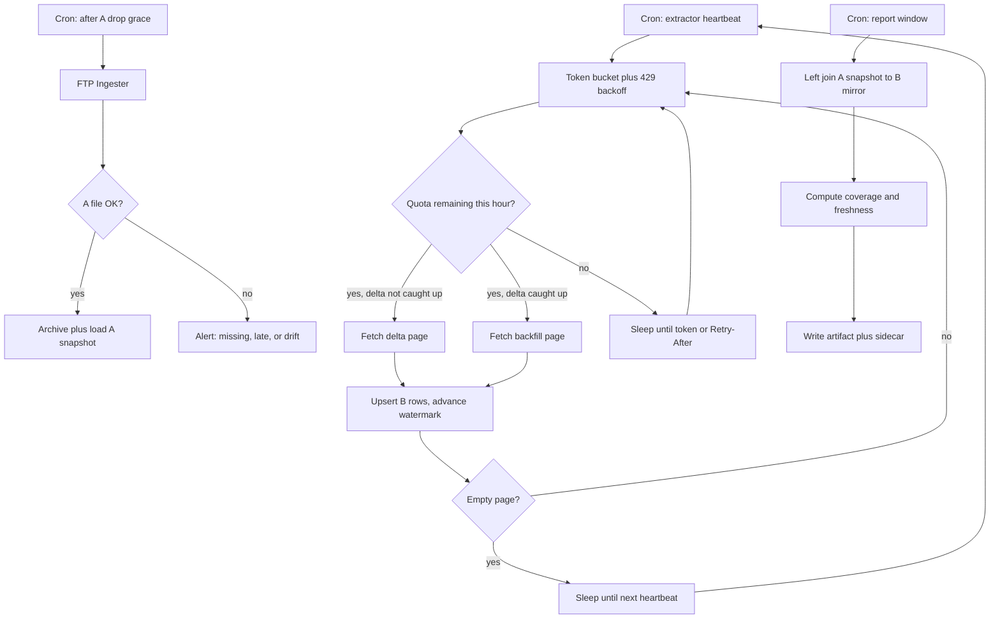

# Cross-System Report Pipeline — System Design
> - **Document Status**: Draft
> - **Last Updated**: 2026 Aug 29
> - **Author**: Paul Serban

This document is the mechanical *how* for the pipeline described in the [Architecture Document](./02_architecture_document.md). It specifies the rate limiter, watermarks, FTP ingest, local-mirror schema, join semantics, and error handling. It does not specify code.

## 1. Control Flow

Three jobs, loosely coupled, sharing a store. They are not a single process. Coupling the report job to a live B pull is how this design fails.



**Invariant:** the report path (`startR → emit`) never enters the limiter. If coverage is poor, the banner says so.

## 2. Rate Limiter

The documented cap is **100 requests per hour**. This is treated as a **ceiling to stay under**, not a throughput target to hit.

### Algorithm

Use a **token bucket** (or leaky bucket — equivalent here) with:

- Capacity: 100 tokens.
- Refill: 100 tokens per 3600 seconds, **smoothly** (≈1 token / 36 seconds), not a dump of 100 at the top of the clock hour.
- Cost: 1 token per HTTP request that leaves the machine, including retries of failed requests. Head-requests, auth-refresh, and pagination next-page calls all count if they hit System B.
- Burst: **disabled** (bucket capacity may be set lower, e.g. 5–10, to prevent a restart from slamming 100 requests in one second after a crash). A burst of 100 is how you discover that their limiter is per-minute, or shared, the hard way.

Smooth refill is load-bearing. A "100 at :00, then sleep 59 minutes" client:

- collides with any other consumer who does the same,
- looks like abuse,
- wastes the hour if the process dies at :02,
- and teaches you nothing about a rolling window vs a clock window.

### Observed limit beats documented limit

On every response:

- If `429`: stop, honor `Retry-After` if present, otherwise back off exponentially (start at 60s, cap at 15 minutes), and **decrement the assumed safe rate** (e.g. treat the ceiling as 80/hour until a full hour passes without a 429).
- If rate-limit headers exist (`X-RateLimit-Remaining`, `Retry-After`, IETF `RateLimit-*`): trust them over the local bucket when they are stricter.
- Log every 429 as an operator-visible event. A 429 is not a transient glitch; it is evidence the brochure number is wrong or the key is shared.

### What the limiter is not

- It is not distributed. There is one extractor process. Two processes with one bucket each is two buckets.
- It is not a queue of 50,000 jobs. A queue invites parallelism. Parallelism here is how you get banned.
- It does not reset on process restart without persisting bucket state *or* assuming empty on start (safer: assume empty, i.e. wait one refill interval after a crash rather than guessing remaining quota).

## 3. Watermarks and Incremental Sync

Two watermarks, because they solve different problems. Do not collapse them into one integer.

### 3.1 Delta watermark (`last_source_updated_at`)

Used when the API supports `updated_since` / `modified_after` / equivalent.

- **Advance rule:** after a successful page, set the watermark to the maximum `source_updated_at` observed on that page, **minus a small overlap** (e.g. 1–5 minutes, or one API timestamp tick) so clock skew and in-page unordered results do not drop rows.
- **Idempotency:** upserts on B ID make overlap safe; the cost is a few duplicate fetches, which is cheaper than a silent hole.
- **Caught-up signal:** a page that returns no rows (or only rows already at the overlap edge) means delta is idle until new updates exist.

If Phase 0 finds **no delta filter**, this watermark is unused. That is a first-class outcome, not a bug. The extractor then lives entirely on §3.2, and steady-state quota never collapses. Escalate the ask; do not pretend ID-crawl is "basically a delta."

### 3.2 Backfill cursor (`last_id_cursor`)

Used to populate records the mirror has never seen.

- Walk a stable sort (`id ASC` or whatever the API actually offers — confirm in Phase 0). Unstable sort + cursor = skipped and duplicated rows.
- Advance the cursor only after the page is upserted.
- **Do not restart from ID 0** on each cycle. That is the full-pull design wearing a cursor costume, and it re-creates the math trap every week.
- When the cursor reaches the end: either stop backfill until an operator resets it (if the ID space is closed) or keep a slow "new IDs beyond the high-water mark" probe if IDs are monotonic.

### 3.3 Quota split

Each hour's observed budget is allocated in this order:

1. **Mandatory overhead**: at most a tiny number of requests to confirm auth/health if needed. Prefer not to.
2. **Delta** (if the filter exists): run until caught up or the hour's delta cap is hit.
3. **Backfill**: remainder.

On a **weekly** cadence during bootstrap, almost everything can go to backfill; delta is cheap if the dataset is not hot.

On a **daily** cadence, **reserve delta first every hour** even during bootstrap. A daily report that is 40% complete but 24 hours fresh on the rows it has is more defensible than a daily report that is 45% complete and three days stale because backfill ate the quota. See [Trade-offs](./05_tradeoffs_and_honest_assessment.md#4-how-the-answer-changes-if-the-report-is-needed-daily).

### 3.4 Checkpointing

After every successful page, in one transaction:

- upsert the page's rows,
- write the new watermark/cursor,
- write `last_sync_at`.

A crash between HTTP success and this transaction wastes at most one page of quota (the page will be re-fetched). A crash without this discipline can waste hours.

## 4. FTP Ingester Mechanics

### 4.1 Expected drop

Phase 0 must pin, in writing even if only to ourselves:

- protocol (FTP vs SFTP vs FTPS — "FTP" in the prompt is a family, not a socket),
- host, path, filename pattern, timezone of "nightly,"
- typical size, encoding, delimiter, header row, quoting,
- join key column name.

Guessing any of these is how day 2 is spent debugging a file that landed at 02:00 in another timezone.

### 4.2 Landing and archive

```
landing/   incoming file, treated as untrusted until checksum + parse succeed
archive/YYYY-MM-DD/<filename>  immutable; checksum sidecar
```

Idempotency key: drop date + checksum.

- Same date, same checksum: no-op (safe re-run).
- Same date, different checksum: **alert**. Either they re-exported (use the new one, keep the old file as `archive/.../superseded-*`) or something hostile/broken happened. Do not silently overwrite.
- New date: new snapshot.

### 4.3 Grace window and missing drop

- Schedule ingest at expected_time + grace (e.g. 90 minutes). Polling every N minutes inside the grace window is fine; this is one file, not a chatty API.
- If still missing: **alert** and follow a documented policy:
  - **Fail the report** (preferred when the consumer would rather have nothing than yesterday), or
  - **Use last-good A and label it** ("A snapshot from D-1 because D was missing").
- Never emit an empty A snapshot as if the business had zero rows.

### 4.4 Schema drift

Before promoting a file:

- header set equals the contracted set (or a documented superset),
- join key null rate below a tiny threshold,
- row count vs a rolling median (order-of-magnitude drops/spikes are news, not "interesting variance").

Fail the load on drift. A wrong join key parsed "successfully" produces a confident, empty-looking coverage number that will be believed.

## 5. Local Mirror Schema (logical)

Physical types depend on SQLite vs an existing DB. The logical model does not.

### `b_record`

| Column | Notes |
| --- | --- |
| `b_id` | Stable System B primary key. PK. |
| `join_key` | The key that matches System A. Indexed. May equal `b_id`. |
| `payload` fields | Whatever the report actually needs — **not** "store the whole JSON forever because we might." Every extra field is a reason to re-fetch later if you skip it now; every extra field is also disk and a privacy surface. Phase 0 lists the report columns. |
| `source_updated_at` | Nullable if the API does not provide it. |
| `retrieved_at` | When *we* last upserted this row. |
| `source_hash` | Hash of the stored fields, to detect no-op upserts for quota-waste metrics. |

### `watermark`

| Column | Notes |
| --- | --- |
| `name` | `delta` or `backfill`. |
| `value` | Timestamp or ID, stored as text to avoid timezone cleverness. |
| `updated_at` | Operator-visible liveness. |

Single-row `limiter_state` is optional; empty-on-start is an acceptable simplification if the extractor waits one refill interval after boot.

### `a_snapshot_row`

Either a table loaded per drop date, or the join reads the archived CSV directly. A table is easier to left-join and to compute coverage; a CSV-only join is fewer moving parts. **Prefer a table** if the operator can afford the load step; 50k rows is cheap.

Grain: `(drop_date, a_row_id_or_join_key)`. If A is a full nightly snapshot, replacing that date's rows in a transaction is the right load.

### `a_archive` / `report_run`

As in the [Architecture Document data model](./02_architecture_document.md#data-model). `report_run` must store the coverage % that was actually shipped, not a recomputation later — arguments happen.

## 6. Join Logic

Default join: **left join from A to B** on `join_key`.

- A is a complete-for-that-night extract (assumed; Phase 0 confirms).
- B is a partial mirror.
- Inner join would silently drop unmatched A rows and make coverage look like 100% of *something* that is not the business question.
- Right/full join dumps B entities that are not in this week's A file; useful as a footnote count, not as the body of the report, unless the consumer asked for "everything in B." They asked for a report that *joins* the two.

Coverage, printed on the artifact:

```
coverage_pct = matched_A_keys / distinct_A_join_keys
```

Also print:

- A drop date and checksum
- B watermark timestamps (`delta` / `backfill`)
- `b_mirror_row_count`
- unmatched A key count
- B rows not in this A snapshot (count only)
- extractor `last_sync_at`
- whether this run used last-good A because tonight's file was missing

**Multiple A rows per join key / multiple B rows per join key:** Phase 0 must measure this. If it happens, the report grain is a business decision (explode, pick-latest, aggregate). Do not silently `SELECT *` and ship a cartesian product.

**The report builder does not fetch.** If a stakeholder says "can't you just look up the missing 30k," the answer is the math table in the [Business Overview](./01_business_overview.md#the-math-the-actual-requirement).

## 7. Error Handling

| Class | Examples | Behavior |
| --- | --- | --- |
| **Quota / 429** | 429, `Retry-After`, remaining=0 | Back off, tighten local ceiling, do not retry in a tight loop. Not a page failure. |
| **Transient transport** | timeout, 5xx, FTP disconnect | Retry the **same** page/file with jittered backoff, cap N. Checkpoint means a retry is the failed unit, not the whole backfill. |
| **Auth** | 401/403, FTP login fail | **Stop.** Alert. Do not burn quota on a credential that cannot work. |
| **Contract** | unexpected JSON shape, CSV header change, join key missing | **Stop the load/upsert of that unit.** Alert. Do not coerce. |
| **Empty B page** | zero rows on delta or end of cursor | Normal caught-up. Switch to the other mode or idle. |
| **Missing A** | no file after grace | Alert + documented fail-or-last-good policy. |
| **Duplicate A** | same checksum | No-op. |
| **Conflicting A** | same date, new checksum | Alert; do not overwrite archive; operator chooses. |
| **Mirror integrity** | disk full, SQLite busy/corrupt | Stop extractor and report. A half-written mirror is worse than a missed cycle. |
| **Process crash** | host reboot, OOM | Restart waits for limiter safety, resumes from watermark. No "resume the in-memory 50k pull" — there isn't one. |

### Circuit breaker

If N consecutive B pages fail for non-429 reasons, or if 429 backoff has been continuous for longer than some operator-set window (e.g. 3 hours), **stop the extractor** and alert. Hammering a sick API spends quota on errors and can get the key locked.

### What is not retried

- Successful pages (do not re-issue because the *next* page failed).
- The entire backfill from ID 0.
- Live lookups from the report job.

## 8. Stop / Done Conditions

The extractor does not "finish the week" in any strong sense. It has modes:

- **Backfilling:** cursor has not reached the end; spend remainder quota here.
- **Caught up:** delta empty and cursor at end; sleep until the next heartbeat. This is the steady-state success mode.
- **Blocked:** auth, contract, circuit breaker, disk. Human required.

The report job is "done" when the artifact and sidecar are written and the `report_run` row exists. It is allowed to be done at 12% coverage. It is not allowed to be done without the banner.

## 9. Observability (minimum, week 1)

No new APM product. Log lines and a couple of queries over the store:

- requests_this_hour, 429_count, assumed_ceiling
- pages_upserted, rows_upserted, no_op_upserts (quota waste)
- watermark values and `last_sync_at` age
- A ingest result (ok / missing / drift / conflict)
- last shipped coverage_pct

Alert on: auth fail, missing A, `last_sync_at` older than 2 hours during bootstrap (older than 26 hours in weekly steady state), disk > 80%, circuit breaker open.

## 10. Security and credentials (brief)

This project has no separate security-architecture doc because the system is a batch pull of two already-authorized sources. Still:

- FTP and System B credentials are secrets. Environment or the operator's existing secret store. Not in git, not in the report sidecar.
- The B mirror is a copy of System B data. Access to the box is access to that dataset. Treat it accordingly.
- Do not log raw response bodies at info level once Phase 0 is over; they are the data.
- Scraping a dashboard (if ever) almost certainly violates the System B team's TOS and may share a cookie/session with a human identity. That is one more reason it is bootstrap-only and asked-for-in-writing. See [ADR-004](./04_architecture_decision_records.md#adr-004).
