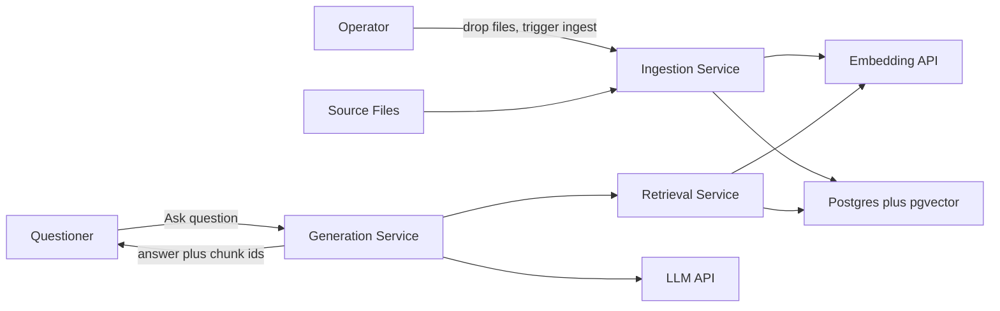
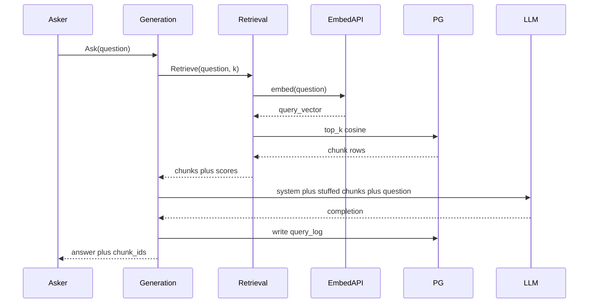

# Naive RAG Document Q&A — Architecture Document
> - **Document Status**: Draft
> - **Last Updated**: 2026 Aug 29
> - **Author**: Paul Serban

A three-service, deliberately naive RAG loop over a private knowledge base of tens to low hundreds of documents: ingest and embed offline, retrieve by cosine top-k, generate by stuffing chunks into a prompt. This document covers *what* the system is and *why* it is shaped this way; see [System Design](./03_system_design.md) for *how* chunking, pgvector retrieval, and prompt assembly actually work, and [Trade-offs and Honest Assessment](./05_tradeoffs_and_honest_assessment.md) for what is abandoned on purpose.

## Overview

**Brief description**: Portfolio-scale Document Q&A. One batch ingestion path writes chunks and embeddings into Postgres/pgvector. A retrieval service embeds the question and returns top-k neighbors. A generation service concatenates those neighbors into a prompt and calls an LLM. It is not a search platform, not a production assistant, and not "the good RAG" with the hard parts postponed.

**Business Context**
- See [Business Overview](./01_business_overview.md) for the full framing. In short: ~50 documents → ~400 chunks, vector-only retrieval, no rerank, no hybrid, no eval in the runtime path. The scarce resource is **honesty about quality**, not RAM.
- Target users: the operator (demo + later-tier comparison), a single trusted questioner. There is no second tenant.

## Requirements

### Functional Requirements

- **Ingest**: the system must accept a folder (or equivalent) of source files (markdown, PDF, plain text), extract text, and persist a `Document` record per file. Failed extraction is logged as `unsearchable`. Empty extracts must not become empty chunks in the index.
- **Chunk**: the system must split extracted text with a **fixed-size or recursive-character splitter plus overlap**, persist `Chunk` rows, and attach source pointers (`doc_id`, offsets or character ranges). Chunker parameters are recorded. They are not a versioned migration system. See [ADR-001](./04_architecture_decision_records.md#adr-001).
- **Embed and store**: the system must embed each chunk with **one named embedding model** and upsert the vector into pgvector. One model, one dimension, one similarity metric. Mixing models in one table is forbidden even at this scale — the geometry still breaks; you just will not notice until the eval set moves. See [ADR-002](./04_architecture_decision_records.md#adr-002).
- **Retrieve**: given a question, embed it with the **same** model and return top-k chunks by cosine (or inner-product). No BM25, no fusion, no rerank. See [ADR-003](./04_architecture_decision_records.md#adr-003).
- **Generate**: given a question and retrieved chunks, assemble a prompt (system instructions + stuffed chunks + question), call one LLM, return the completion. No citation verification, no faithfulness gate, no streaming requirement. See [ADR-005](./04_architecture_decision_records.md#adr-005).
- **Ask path**: a single public operation `Ask(question) → answer` that the caller uses. Internally it is retrieval then generation. The caller does not talk to pgvector.
- **Re-ingest**: replacing the corpus is a full ingestion re-run (truncate-or-replace chunks, re-embed). There is no dirty-chunk queue.
- **Query log (minimal)**: persist question, retrieved chunk IDs, model IDs, and the answer. This is for the Phase 5 baseline report, not for production analytics.

### Non-Functional Requirements

**Performance Requirements:**
- There is **no retrieval p99 SLO**. End-to-end latency is embedding-API + pgvector top-k (milliseconds) + LLM generation (seconds). Optimizing HNSW parameters on 400 rows is cargo-culted performance work. Do not do it.
- Ingest of ~50 documents should finish in minutes, dominated by embedding-API rate limits, not CPU. If it does not, extraction is broken or the "small corpus" assumption is false — stop and re-read [Business Overview — the ceiling](./01_business_overview.md#where-the-ceiling-actually-is).
- Generation is synchronous request/response. Time-to-first-token is a UX nicety this design gives up. [ADR-005](./04_architecture_decision_records.md#adr-005).

**Reliability Requirements:**
- Ingest must be **re-runnable**. A crash mid-embed must not leave a silently half-indexed corpus that looks complete. Prefer replace-in-transaction or a generation marker on the ingest batch.
- Retrieval with zero hits must return an empty list, not a 500. Generation on empty retrieval must **not** invent an answer from parametric knowledge as if it were grounded — the prompt is required to say "if the context does not contain the answer, say you do not know." This is a prompt rule, not a detector. It will still fail. Record it.
- Embedding-API and LLM-API failures are caller-visible errors. Retry with backoff on 429/5xx; do not retry on 400. There is no circuit-breaker product.
- Postgres is the system of record. If it is down, the system is down. That is acceptable at this scale.

**Infrastructure Constraints:**
- Illustrative stack: Python or TypeScript services; Postgres 16+ with pgvector; one embedding provider (OpenAI/Voyage/local — Phase 0 picks); one LLM provider; Docker Compose as the local composition; Kubernetes manifests for infra reps.
- Hosting: a laptop, a single VM, or a small k8s namespace. **No dedicated ANN cluster. No managed vector-DB SaaS required.** Pinecone is an allowed *alternative* in the prompt's stack list; it is the wrong default here. See [ADR-002](./04_architecture_decision_records.md#adr-002).
- Compliance: the corpus is the operator's own docs or an explicitly permitted internal dump. Embeddings leave the box if the embedding API is remote — treat that as a data-handling fact, not a surprise. Do not ingest other people's confidential files to "make a better demo."

**The defining constraint:**
- This architecture is **allowed to be naive** only because the corpus is small and the stakes are a portfolio baseline. Every omitted subsystem (hybrid, rerank, refresh, eval, ACL) is a **named debt** with a later-tier owner, not a backlog item to sneak in. Architecture that "just adds a reranker in v1.1 of this repo" destroys the baseline.

## Executive Summary

The system is a **two-plane, three-service RAG**: a write plane (ingestion) that turns files into rows in Postgres, and a read plane (retrieval + generation) that answers a question with one embed, one ANN query, and one LLM call. The scarce resource is **eval discipline**. Everything else is ordinary HTTP and SQL.

**Architecture Style:** Layered batch-ingest + synchronous retrieve-generate microservices. Not event-driven. Not a mesh. Not "an LLM with a plugin." The microservice cut is [ADR-004](./04_architecture_decision_records.md#adr-004): real contracts, pedagogical cost.

**Key Components:**
- **Ingestion Service**: extract, chunk, embed, upsert. Batch. No query path.
- **Retrieval Service**: embed query, pgvector top-k, return chunks + scores. No LLM.
- **Generation Service**: prompt assembly + LLM call. Does not query the index itself; it consumes retrieval's output (either by calling retrieval, or by receiving chunks from an orchestrating BFF — see runtime).
- **Postgres + pgvector**: documents, chunks, embeddings, query logs. The only store.
- **Ask API / thin BFF** (optional fourth process, or a route on generation): `Ask` that sequences retrieval → generation so the UI has one hop. Whether this is a separate container or a route is a deploy detail, not an architectural religion.

**Technology Stack (illustrative):**
- Services: FastAPI or equivalent (Python default, because chunking/PDF extract/embedding SDKs are boring here in Python; TypeScript is fine if the operator already lives there).
- Store: Postgres + pgvector on one instance. IVFFlat/HNSW indexes are optional at 400 rows; a sequential scan is honest and faster to reason about. If you add HNSW, do it for k8s-reps muscle memory, not recall.
- Embedding: one API or one local model. Pin `model_id` and dimension in config.
- LLM: one chat-completions API. Pin `model_id`.
- Compose: one Postgres, three app services (plus optional BFF).
- k8s: three Deployments, one StatefulSet or managed Postgres, Services, ConfigMaps/Secrets. No HPA story that matters.

**Architecture Principles:**
- **Naive on purpose.** Every sophistication has a later project. Adding it here is cheating at the baseline.
- **One embedding space.** One model, one metric, one table.
- **Retrieval does not generate; generation does not retrieve.** The boundary is the chunk list. That is the seam later tiers replace.
- **Empty context is a first-class outcome.** Do not let the LLM "be helpful" from weights while claiming RAG.
- **Log the chunks, not just the answer.** Without retrieved IDs, the Phase 5 report cannot distinguish retrieval failure from generation failure.
- **Deployed is part of done.** A notebook that does the same loop is a lab, not this project.

**Key Architectural Decisions:**
1. Fixed/recursive-size chunking, not structure-aware or semantic. [ADR-001](./04_architecture_decision_records.md#adr-001).
2. pgvector/Postgres, not Pinecone or a dedicated ANN. [ADR-002](./04_architecture_decision_records.md#adr-002).
3. Vector-only top-k, no rerank, no hybrid. [ADR-003](./04_architecture_decision_records.md#adr-003).
4. Three microservices rather than a monolith. [ADR-004](./04_architecture_decision_records.md#adr-004).
5. Synchronous generation, no streaming. [ADR-005](./04_architecture_decision_records.md#adr-005).

### Context Diagram

The Ask path is drawn through Generation for a single caller hop. Generation **calls** Retrieval; it does not embed or SELECT vectors. Ingestion never sits on the Ask path.

## Runtime Architecture

1. **Write plane (ingestion)**: operator drops files, triggers a job. For each file: extract text → split → embed each chunk → upsert `document` / `chunk` rows. Failures go to an `unsearchable` log. A batch ID marks the ingest. Query traffic is not blocked, but there is no "hot swap of generations" — a full replace is the honest model. If you need readers to never see a half-built index, ingest into a new batch ID and flip a `active_batch` pointer at the end. That is the maximum sophistication allowed. It is still not [ADR-005 from the at-scale project](../../prj--rag-pipeline-at-scale/_docs/04_architecture_decision_records.md#adr-005).
2. **Read plane, step A (retrieval)**: embed the raw question, `ORDER BY embedding <=> query_vec LIMIT k`, hydrate chunk text from the same row, return `{chunk_id, doc_id, text, score, source_pointer}`.
3. **Read plane, step B (generation)**: render a prompt template, call the LLM, return `{answer, chunk_ids, model_ids}`. Persist a query-log row.
4. **Operator plane**: Docker/k8s keeps the three services and Postgres up. Logs are stdout. No APM product.

### Ask sequence

Ingest is a separate sequence and **must not** be invoked from `Ask`. Coupling them is how a question pays for a full re-embed.

## Components

### 1. Ingestion Service
**Purpose**: Turn files into searchable rows. Own every failure that is actually extraction or chunking, so retrieval does not get blamed for soup.

**Responsibilities:**
- Discover files from a configured input path or upload API (folder-on-disk is enough for v1).
- Extract text per type (markdown/plain as identity; PDF via a pinned extractor version). Record extractor name/version on the document.
- Split with the [chunker](./03_system_design.md#2-chunking). Persist parameters (`chunk_size`, `overlap`, algorithm name).
- Embed chunks; upsert. Skip chunks whose text is empty after strip.
- Mark documents `unsearchable` on extract failure. Never insert a placeholder chunk "so the doc counts as indexed."
- Expose `POST /ingest` (or a CLI that is the same code path). Idempotency: re-ingest of the same corpus replaces the active batch.

**Interactions:**
- Reads: source files, embedding API.
- Writes: Postgres (`document`, `chunk`, ingest metadata).
- Does not call the LLM. Does not answer questions.

### 2. Retrieval Service
**Purpose**: Be the only component that knows about vectors. Later hybrid/rerank work replaces *this* service's internals behind the same chunk-list contract.

**Responsibilities:**
- `POST /retrieve {question, k}` → ranked chunks.
- Embed the question with the **same** `model_id` stored on the chunks. If config drifts, fail closed (4xx/5xx with a clear error), do not silently search the wrong space.
- Query pgvector; hydrate text; return scores.
- Do not filter by user. There is no user. Do not pretend a `tenant_id = default` column is access control.

**Interactions:**
- Reads: embedding API, Postgres.
- Writes: nothing required on the retrieve path (optional retrieve-only log).
- Does not call the LLM.

**What it is not:** a search product. No filters, no pagination beyond k, no "similar documents" UI.

### 3. Generation Service
**Purpose**: Convert a question plus a chunk list into an answer. Own prompt shape and LLM errors.

**Responsibilities:**
- Call Retrieval (or accept pre-fetched chunks — same prompt path).
- Assemble the prompt per [System Design §4](./03_system_design.md#4-generation-and-prompt-assembly).
- Call the LLM with a timeout. Return the text.
- On empty chunk list: still call with a "no context" variant that forbids answering from world knowledge, *or* short-circuit to a canned "I don't have that in the knowledge base." Short-circuit is more honest; an LLM call is more demo-like. **Prefer short-circuit.** Document the choice in the query log.
- Write `query_log`.

**Interactions:**
- Reads: Retrieval, LLM API.
- Writes: `query_log`.
- Does not SELECT embeddings.

### 4. Postgres + pgvector
**Purpose**: Be the only datastore. Documents, chunks (text + vector), ingest batch pointer, query log.

**Responsibilities:**
- Store vectors with `vector(dim)` matching the pinned model.
- Serve top-k. At this cardinality, correctness of the SQL beats index-tuning.
- Survive a compose restart with a volume. Losing the volume is a full re-embed — cheap here, still annoying.

**Interactions:**
- Written by Ingestion (and Generation for logs).
- Read by Retrieval (and Generation for logs).

### 5. Ask API / composition
**Purpose**: One hop for the questioner. Not a fourth domain.

If Generation already calls Retrieval, this is just Generation's `POST /ask`. A separate BFF that calls both is extra moving parts with no boundary benefit. **Do not add a fourth service** unless a UI needs CORS/session concerns that you refuse to put on Generation. Default: `POST /ask` on Generation. [ADR-004](./04_architecture_decision_records.md#adr-004) is three services, not four.

### Communication Patterns

**Synchronous:**
- Asker ↔ Generation: HTTP request/response.
- Generation ↔ Retrieval: HTTP.
- Retrieval/Ingestion ↔ Embedding API: HTTP.
- Generation ↔ LLM API: HTTP.
- All services ↔ Postgres: SQL.

**Asynchronous / batch:**
- Ingestion is a job. It can be an HTTP `POST /ingest` that blocks until done (acceptable at 50 docs) or a worker. Blocking is simpler. A queue is how this project pretends to be at-scale. Do not add a queue.

**What is not here:**
- Message bus between retrieve and generate.
- Streaming tokens to the client.
- Webhooks from the embedding provider.

## Scaling Strategy

**Current Scale Requirements:**
- ~50 docs, ~400 chunks, one user, bursty QPS near zero. This is a laptop.

**What does not need to scale:**
- pgvector. Sequential scan is fine.
- Retrieval replicas. One pod.
- Embedding throughput. A few hundred vectors, once (and again when you re-ingest).

**What is already at its scaling ceiling — quality, not QPS:**
- Top-k cosine as the only retrieval. More documents make this *worse*, not slower. Adding retrieval replicas does not fix wrong neighbors.
- Prompt stuffing of k chunks. Larger k burns the lost-in-the-middle budget. This is not a horizontal-scale problem.

**If the corpus grows:**
- Do **not** shard pgvector. Do **not** buy Pinecone "because scale." Stop this project and start [roadmap §1.1](../../../04_challenges/ai-engineering-portfolio-roadmap.md) or [prj--rag-pipeline-at-scale](../../prj--rag-pipeline-at-scale/) depending on *how far* it grew. See [Business Overview — the ceiling](./01_business_overview.md#where-the-ceiling-actually-is).

**Bottleneck Analysis:**
- Primary bottleneck: **LLM generation latency and quality**. Users wait on the model. Users are misled by the model.
- Secondary: embedding API rate limits during ingest.
- Tertiary: PDF extraction quality. A bad extract produces confident, well-embedded nonsense. No later retrieval trick fixes that. Spend time here before tuning k.

**k8s is not a scaling strategy.** It is an infra-rep target. One replica per Deployment. Resource requests sized for a toy. HPA on Generation would autoscale a service whose bottleneck is an external LLM quota — a good way to get 429s faster.

## Data Architecture

### Data Model

**Key Entities:**

| Entity | Grain | Notes |
| --- | --- | --- |
| `document` | one source file | `doc_id`, path, checksum, extractor_version, status (`indexed` / `unsearchable`), `ingest_batch_id` |
| `chunk` | one splitter window | `chunk_id`, `doc_id`, `chunk_index`, `text`, `char_start`, `char_end`, `embedding vector(dim)`, `embed_model_id` |
| `ingest_batch` | one ingest run | `batch_id`, `started_at`, `finished_at`, `chunker_params`, `embed_model_id`, `active` flag |
| `query_log` | one Ask | `question`, `retrieved_chunk_ids[]`, `scores[]`, `answer`, `llm_model_id`, `embed_model_id`, `k`, `empty_retrieval` |

**Entity Relationships:**
- A document has many chunks. Re-ingest of a document deletes or replaces its chunks (same `doc_id`, new rows). Do not leave orphan vectors from the previous split.
- `query_log` points at chunk IDs that must remain resolvable **or** the log stores denormalized chunk text. Prefer storing IDs plus a copy of the stuffed text — otherwise a re-ingest makes historical eval unexplained. This is a small corpus; storing the stuffed prompt is cheap and is the only way Phase 5 can be replayed.

**What is not modeled:**
- Users, tenants, ACLs, sessions, conversation memory. A chat UI may keep history **in the client**. Putting history into the next prompt without a context budget is a later `context-forge` problem. v1 Ask is **stateless per question**. That is a quality limit (no follow-ups) and an honesty feature (no hidden state).

### Data Lifecycle

**Create**: documents and chunks at ingest; query logs at Ask.

**Read**: retrieval reads chunks; generation reads nothing from the index; operator reads logs for the baseline report.

**Update**: not in the chunk table. A "changed file" is a new ingest. In-place UPDATE of an embedding is how you mix a new model into an old column by accident.

**Delete**: de-activating an ingest batch deletes (or orphans-and-purges) its chunks. Source files remain with the operator. Query logs are retained until the baseline report is written; they may contain the corpus in the stuffed prompt — treat the log as classified like the docs.

## Cost Analysis

### Cost Components

**Money:**
- Postgres: free locally; a small managed instance if you insist on deploying "for real." Tens of dollars/month is already overkill.
- Embedding: a few hundred chunks × a few hundred tokens × list price. **Single-digit dollars** for the whole corpus, including a couple of re-ingests. Waste is re-embedding because the chunker params were wrong — still cheap, still annoying.
- LLM: the recurring cost, and still tiny at demo QPS. A few cents per Ask on a frontier model. Do not add a semantic cache. Do not add a gateway. The [prj--llm-gateway](../../prj--llm-gateway/) exists for a different problem.
- k8s: cluster time. Use kind/minikube unless you already have a cluster. Paying a cloud k8s control plane to host 400 vectors is a joke you should be able to explain in an interview as *infra reps, not production sizing*.

**Operator time — the actual cost:**
- PDF extraction and chunk-boundary bugs.
- Writing 20+ labeled questions that are not all "what is my name."
- Sitting through Phase 5 and writing down failures instead of tweaking the prompt until the demo question works.

**Risk cost of a wrong answer:**
- In the portfolio envelope: low, unless you demo on someone else's data or let a hiring panel treat fluent answers as verified facts about you. Label the demo: **ungrounded claims are possible.**
- If this design is pointed at customers: the risk cost is the whole product. See [Trade-offs — when naive RAG is malpractice](./05_tradeoffs_and_honest_assessment.md#5-when-naive-rag-is-actually-fine-vs-malpractice).

### Cost Optimization

- Pin models so you are not accidentally on a frontier embedding because the SDK default changed.
- Do not re-embed on every Compose bounce; persist the volume.
- Short-circuit generation on empty retrieval.
- Do not run k8s in prod-shaped HA for this.

## Risks and Mitigation

| Risk | Likelihood | Impact | Mitigation Strategy | Owner |
| --- | --- | --- | --- | --- |
| Lost-in-the-middle: right chunk retrieved, ignored in generation | High at k≥5 | Medium | Document as failure mode; keep k small; do not "fix" with a reranker in this repo. Later: §1.1 / context ordering experiments in `context-forge` | Generation (recorded, not fixed) |
| Cosine top-k ≠ relevance (no rerank) | High | High | Eval set includes known hard negatives; Phase 5 reports precision@k. Later: §1.1 | Retrieval |
| Chunk-boundary bleed | High on PDFs and long markdown | Medium | Overlap helps a little; probes in the eval set. Later: §1.4 structure-aware chunking | Ingestion |
| Exact tokens (names, dates, IDs) missed | High | Medium | Include exact-token probes; accept the miss as baseline. Later: hybrid BM25 | Retrieval |
| Multi-part questions fail | High | Medium | Eval set includes one; do not add query rewrite here. Later: §1.2 | Retrieval |
| Stale index after file change | Certain if operator forgets to re-ingest | Medium | Full re-ingest is the procedure; no freshness metric. Later: dirty-chunk pipeline | Operator |
| Unfaithful generation (answer not in chunks) | High | High | Prompt "answer only from context"; short-circuit on empty; **no verifier**. Log chunks vs answer for Phase 5. Later: §1.5 / hallucination-detection project | Generation |
| No eval loop → "it works" shipping | High if Phase 5 is skipped | High | Phase 5 is a gate, not a blog post. Kill criteria if skipped | Operator |
| Multi-user data leak (this design has no ACL) | Low if scope held; certain if corpus shared | High | Scope lock; refuse extra users. Later: §1.3 | Operator |
| Remote embed/LLM APIs see private docs | Certain if APIs are used | Medium | Use own docs; consider local models if the corpus is sensitive; disclose in README of a future code repo | Operator |
| Microservice sprawl (fourth/fifth service, queue, cache) | Medium under "production-hardening" pressure | Low/Medium | ADR-004; kill extra services | Operator |
| Treating k8s HA as if QPS existed | Medium | Low | One replica; no HPA | Operator |
| Mixing embedding models in one column | Medium after a "quick model swap" | High | Fail closed on `embed_model_id` mismatch; full re-ingest for a new model | Ingestion / Retrieval |
| Demo question overfit (prompt tuned until one Q works) | High | High | Frozen eval set *before* prompt fiddling; Phase 0 gate | Operator |
| Corpus larger than envelope | Low in portfolio; high if "also dump the company wiki" | High | Ceiling table; stop and change project | Operator |

## Future Enhancements

### Phase 1 (this project)
**Focus**: Naive loop, three services, Compose + k8s, Phase 5 baseline report. See [Phased Implementation Plan](./06_phased_implementation_plan.md).

### Phase 2 (not this repo)
**Focus**: Beat the baseline on the **same corpus and eval set**:
- Hybrid + rerank → `retrieval-x` (§1.1), replacing Retrieval internals.
- Corrective / multi-query → `rag-selfheal` (§1.2).
- Eval harness / RAGAS → `rag-metrics` (§1.5), consuming `query_log` shape.

### Phase 3 (different problem)
**Focus**: If someone says "now do it on 50 million documents," that is [prj--rag-pipeline-at-scale](../../prj--rag-pipeline-at-scale/). Do not grow this design.

### Technical Debt (accepted)

- No lexical index. Permanent in this project.
- No rerank. Permanent in this project.
- No incremental refresh. Permanent in this project.
- Three services for a workload a script could run. Pedagogical; accepted. [ADR-004](./04_architecture_decision_records.md#adr-004).
- Human eval of ~20 questions is noisy and overfits. Still better than zero. A later harness replaces it.
- Prompt-only "don't hallucinate" instruction is not a control. Accepted; recorded in failure modes.
- Stateless Ask cannot do conversational follow-up. Accepted; `context-forge` is the later abstraction.
