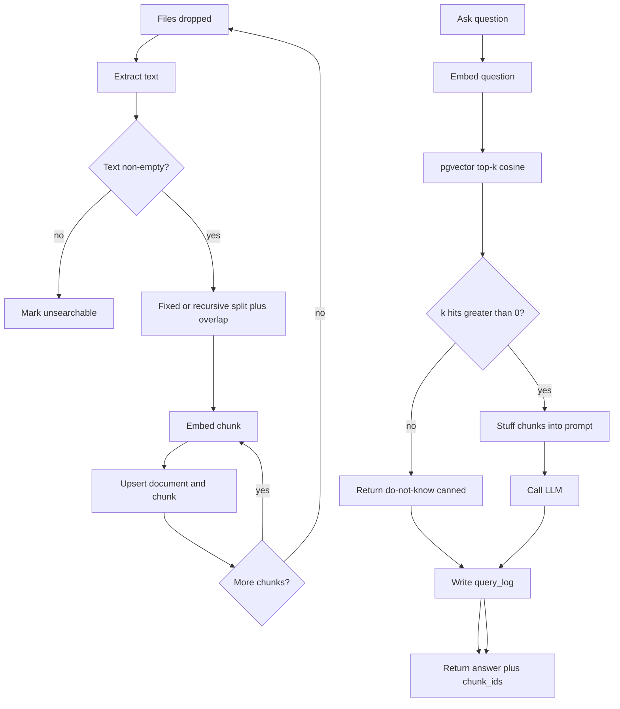

# Naive RAG Document Q&A — System Design
> - **Document Status**: Draft
> - **Last Updated**: 2026 Aug 29
> - **Author**: Paul Serban

This document is the mechanical *how* for the system described in the [Architecture Document](./02_architecture_document.md). It specifies ingestion, fixed-size chunking, pgvector top-k, prompt stuffing, error handling, and the **named failure modes this design refuses to fix**. It does not specify code.

Working capacity numbers (~50 documents → ~400 chunks, k = 5, 1536-d embeddings) are **assumptions** until Phase 0 replaces them. Mechanics do not depend on the exact count; the honesty of the baseline does.

## 1. Control Flow

Two planes. Coupling them is how a question pays for a re-embed, or how a half-finished ingest is treated as a complete knowledge base.



**Invariant:** `Ask` never calls Ingestion. Empty retrieval **short-circuits** to a canned refusal rather than letting the LLM answer from parametric memory while the product still looks like RAG. See [Architecture — Generation](./02_architecture_document.md#3-generation-service).

## 2. Chunking

Chunking is naive on purpose. It will split mid-sentence, mid-table, and mid-argument. Overlap is the only bandage. Structure-aware splitting is [roadmap §1.4](../../../04_challenges/ai-engineering-portfolio-roadmap.md). Semantic chunking is out of this project and expensive even later.

### 2.1 Algorithm (v1)

1. Normalize extracted text lightly: collapse runaway whitespace, keep markdown newlines. Do **not** rewrite prose. Do **not** strip headings — they are the only structure the splitter might accidentally preserve if a heading lands inside a window.
2. **Recursive character split** with a separator list like `\n\n`, `\n`, `. `, ` ` — *or* a raw fixed-size character/token window. Pick one in Phase 0 and freeze it. Recursive is slightly less stupid on markdown; it is still not heading-aware. Fixed-size is easier to explain in an interview. Either is in-scope. Switching after the eval set is scored **invalidates the baseline**; treat it as a new ingest batch and a new Phase 5 run.
3. Working defaults: **chunk_size ≈ 512 tokens** (or ~2,000 characters if you refuse a tokenizer in ingest), **overlap ≈ 10–15%** (≈ 50–80 tokens). Overlap exists to reduce (not eliminate) [chunk-boundary bleed](#93-chunk-boundary-bleed). More overlap duplicates embeddings and still will not keep a table together.
4. Do **not** prepend a breadcrumb (title + heading path) in the "clever" sense of the at-scale design. A single optional prefix of `source_filename` on each chunk is allowed because it is one string and helps the generator cite a file. Heading-path breadcrumbs imply a parser this chunker does not have. If you add them, you have started §1.4 inside this repo. Do not.

### 2.2 Identifiers

```
chunk_id   = ingest_batch_id + doc_id + chunk_index
text_hash  = hash(chunk text)   // stored for debugging, not for incremental refresh
doc_id     = hash(stable path) or a UUID assigned at first sight
```

- There is **no** dirty-chunk diff. Re-ingest replaces all chunks for the active batch.
- `chunk_index` is order-in-document. It is not a stable ID across chunker-param changes.
- Storing `text_hash` is so Phase 5 can say "this boundary split the same sentence we care about." It is not a refresh API.

### 2.3 Extractors

| Type | Behavior | Failure mode |
| --- | --- | --- |
| `.md` / `.txt` | Read as UTF-8 | Encoding garbage if the file is not UTF-8 — fail the doc, do not mojibake-index |
| `.pdf` | Pinned extractor (pypdf/pdfplumber-class). Record version on `document` | Layout/tables become reading-order soup. Indexing soup is how the system "finds" a page and still cannot answer a table question |
| Other | **Out of v1** unless Phase 0 adds one type with a test file | Silent skip is a coverage hole; log `unsearchable` |

A PDF that extracts to empty is `unsearchable`. A PDF that extracts to 40 pages of duplicated headers and broken columns is **indexed**. That is worse. Phase 0 must look at one extracted PDF with human eyes. No embedding model will save a broken extract.

### 2.4 What chunking will not fix

- A two-clause negation split so that "not" lives in chunk n and the claim lives in chunk n+1. Overlap sometimes catches this. The [bleed probe](#93-chunk-boundary-bleed) exists to prove when it does not.
- Questions that need two distant sections. Naive RAG retrieves one neighborhood. [§1.2](../../../04_challenges/ai-engineering-portfolio-roadmap.md) is the fix.
- Whole-document structure ("compare section 2 to section 5"). Hierarchical RAG is [§1.4](../../../04_challenges/ai-engineering-portfolio-roadmap.md).

## 3. Embedding and Store

### 3.1 Model pin

One `embed_model_id`, one dimension, one distance. Working assumption: **1536-d cosine** (or the model's native metric — cosine vs IP is a model-card fact, not a taste). Phase 0 writes the name down. Retrieval **fails closed** if the query embedder does not match `ingest_batch.embed_model_id`.

A "quick try of a cheaper model" is a new ingest batch and a new baseline, not an env-var flip against existing rows.

### 3.2 Upsert rules

For each ingest batch:

1. Insert `ingest_batch` row (`active = false`).
2. Insert documents and chunks (vectors included) for that batch.
3. In one transaction: set this batch `active = true`, set previous `active = false`.
4. Optionally `DELETE` inactive chunks later. Keeping one previous batch is a cheap rollback at this scale. Keeping ten is sloppiness.

Do not UPDATE vectors in place across models. Do not append a second ingest into the same active batch "to add one file" unless you also delete that file's old chunks first. The supported operator move for "I added a PDF" is **re-run ingest on the whole folder**. At 50 files this is the correct amount of engineering.

### 3.3 Query SQL (logical)

```
k nearest chunks from the active batch
ORDER BY embedding <=> :query_vec
LIMIT :k
```

- `<=>` is cosine distance in pgvector. If the model wants inner product, use `<#>` and **do not mix**.
- Filter: `ingest_batch_id = active`. Nothing else. No `tenant_id`. No keyword prefilter.
- **Index:** at ~400 rows, a sequential scan is the honest plan. An HNSW index is optional theatre for k8s-shaped deploys; it must not be tuned as if recall@10 at 300M were in scope. If HNSW is created, `lists`/`m`/`ef_search` defaults are fine; changing them is not a quality program.

### 3.4 k

Working default **k = 5**. This is a **quality and pollution** knob, not a performance knob.

| k | What you think you buy | What you actually buy |
| --- | --- | --- |
| 1–2 | Precision | Misses when the right chunk is neighbor 3 |
| 5 | The naive default | Enough room for one or two distractors; lost-in-the-middle starts |
| 10–20 | "More recall" | Distractors dominate the prompt; middle chunks are ignored; cost up | 

Changing k after Phase 5 without re-scoring is lying about the baseline. Allowed as an **experiment log**, not as silent config drift.

## 4. Generation and Prompt Assembly

### 4.1 Template (logical)

```
system:
  You answer questions using only the CONTEXT. If the context
  is insufficient, say you do not know. Do not use outside knowledge.
  Do not invent citations.

context:
  [chunk 1 — source: filename]
  ...
  [chunk k — source: filename]

user:
  {question}
```

Chunk order: **retrieval rank order** (best cosine first). This is the naive choice. Research on lost-in-the-middle suggests best-first, worst-middle, second-best-last can help. **Do not implement the permutation trick here.** If you do, you have started context engineering (`context-forge`) and contaminated the naive baseline. Mention it in the failure-mode write-up as a known mitigation you *refused*.

### 4.2 What generation does not do

- Does not cite with guaranteed alignment ("according to chunk 3"). A model may emit fake quotes. There is no offset-level citation check.
- Does not run NLI / faithfulness scoring. That is [prj--llm-hallucination-detection](../../prj--llm-hallucination-detection/) and [§1.5](../../../04_challenges/ai-engineering-portfolio-roadmap.md).
- Does not retry on "I don't know" hoping a different sample retrieves better. That is a corrective loop ([§1.2](../../../04_challenges/ai-engineering-portfolio-roadmap.md)).
- Does not stream. [ADR-005](./04_architecture_decision_records.md#adr-005).
- Does not include chat history. Ask is stateless.

### 4.3 Empty retrieval

If top-k is empty (or scores are all identically degenerate — should not happen on a non-empty index unless the vector is NaN):

- **Do not call the LLM.**
- Return a canned message: the knowledge base did not return context.
- Log `empty_retrieval = true`.

A non-empty index plus a well-formed query vector almost never returns zero rows with `LIMIT k` — you will get *some* neighbors. **Low-quality neighbors are the real empty.** Naive RAG has no score threshold. Adding one is a small, tempting "fix" that becomes an uncalibrated reranker. **v1 has no similarity cutoff.** Phase 5 may *record* score distributions; it may not ship a magic `0.75` threshold without treating that as a new baseline.

## 5. Service Contracts (logical)

No code. Fields that must exist so later tiers can replace a service.

### Ingestion — `POST /ingest`

- Input: pointer to the corpus root (path) or a previously configured volume.
- Output: `{batch_id, documents_indexed, documents_unsearchable, chunk_count, embed_model_id, chunker_params}`.
- Errors: corpus root missing, embedding API down after retries, Postgres down.

### Retrieval — `POST /retrieve`

- Input: `{question, k?}` with k defaulting to config.
- Output: `{embed_model_id, chunks: [{chunk_id, doc_id, text, score, source_filename, chunk_index}]}`.
- Errors: embed mismatch vs active batch, embedding API down, Postgres down, no active batch.

### Generation — `POST /ask`

- Input: `{question, k?}`.
- Output: `{answer, empty_retrieval, chunk_ids, scores, llm_model_id, embed_model_id, prompt_template_id}`.
- Errors: retrieval errors propagated; LLM 4xx/5xx after retries; timeout.

`prompt_template_id` is a hash of the template text. Prompt edits without a new id make Phase 5 unreproducible.

## 6. Ask Path (read plane)

Covered in the [Architecture sequence diagram](./02_architecture_document.md#ask-sequence). Additional rules:

- Timeouts: retrieval (embed + SQL) should be seconds at worst; LLM timeout is a hard cap (e.g. 60s). On LLM timeout: error to caller, still log the retrieved chunk IDs so Phase 5 can see that retrieval happened.
- k is taken from request or config; cap k at a small max (e.g. 20) so a client cannot stuff the entire corpus into the prompt "to be safe." Stuffing the entire corpus is not RAG; it is a context dump. At 400 chunks it might even fit in a fat window and **would beat naive RAG on some questions** while destroying the point of the project. **Forbid k > cap.**

## 7. Ingest Path (write plane)

Operator-triggered. Blocking HTTP or a CLI wrapping the same function. Progress logs: per-document extract OK/fail, running chunk count, embedding errors.

**Crash:** if the process dies before the active-pointer flip, the previous batch remains active. Incomplete new batch is inert. If it dies after flip but before DELETE of the old batch, both exist; only one is active. Safe.

**Partial file list:** ingest always walks the whole configured root. There is no "just this file" API in v1. Convenience here is how the index and the folder diverge.

## 8. Error Handling

| Class | Examples | Behavior |
| --- | --- | --- |
| **Extract empty / unsupported type** | scanned PDF, `.docx` in v1 | `unsearchable`; ingest continues | 
| **Extract garbage** | PDF soup | Indexed unless Phase 0 rejects the file; not auto-detectable. Human spot-check | 
| **Embedding 429 / 5xx** | provider rate limit | Retry with jitter, cap N; fail the ingest if still broken. Do not skip the chunk and mark the doc indexed | 
| **Embedding 400** | text too long | Split already should have prevented this; fail that chunk, mark doc degraded or unsearchable — **do not** silently drop one chunk from the middle of a doc without a log | 
| **No active batch** | retrieve before first ingest | 4xx, no LLM call | 
| **Model id mismatch** | config embed model ≠ batch | Fail closed | 
| **Postgres down** | crash, OOM, PVC lost | Service 5xx. Restore volume or re-ingest. No replica failover story | 
| **Empty retrieval** | empty index | Canned do-not-know; no LLM | 
| **LLM 429 / 5xx** | quota | Retry with jitter, cap N; then 5xx to caller with chunk_ids in the log | 
| **LLM timeout** | slow completion | 5xx; log chunks | 
| **LLM 400 content policy** | provider refusal | Return the refusal as the answer, flagged; do not retry into a different model (that would be a gateway) | 
| **NaN / dimension mismatch** | bad vector write | Fail ingest of that chunk; never write a zero-vector "so the row exists" — zero vectors cluster and pollute top-k | 

### What is not retried

- Successful embeds (do not re-embed because a later chunk failed — checkpoint per chunk or per document).
- LLM success (do not resample for a "better" answer).
- The Ask path does not retry retrieval with a rewritten query.

## 9. Known Failure Modes

This section is the point of the project. Each mode is **in scope as a documented defect**, out of scope as a fix. Phase 5 must try to reproduce each with a real question on the real corpus, or record that the probe did not fire.

Fixes name the roadmap tier (or sibling project). They are not tickets against this design.

### 9.1 Lost-in-the-middle

**What it is:** The relevant chunk is in the prompt but not at the beginning or the end. The generator under-attends and answers as if that chunk were absent — or blends it with a distractor.

**Why naive RAG produces it:** k>1 stuffing in rank order puts neighbor 3–4 in the middle. There is no reranker to put the *actually relevant* chunk first (cosine already tried). There is no context-assembler permutation.

**Illustrative example:** Eval question: "What database does the flash-sale inventory engine use for reservations?" Chunk 1 (highest cosine): a general "stack: Postgres, Redis, Docker" blurb from the portfolio README. Chunk 3: the architecture doc sentence that says reservations are Redis with a TTL. Chunk 5: an unrelated Postgres ledger project. The model answers "Postgres" because the first and last things it reads say Postgres.

**What we do here:** Keep default k small (5). Log chunk order. Score "retrieved-right-chunk" separately from "answer-correct." Do not permute.

**Where it is fixed later:** `context-forge` (ordering/budget strategies); rerank in [§1.1](../../../04_challenges/ai-engineering-portfolio-roadmap.md) so the right chunk is more often in position 1; smaller N after rerank.

### 9.2 No reranking (cosine ≠ relevance)

**What it is:** Top-k by embedding similarity returns chunks that are topically close and factually useless, or that share boilerplate with the question. The right chunk is at rank 8 and never enters the prompt.

**Why naive RAG produces it:** One bi-encoder, no cross-encoder, no lexical features. Boilerplate ("architecture document", "Phase 0", "Postgres") dominates cosine on a corpus of architecture write-ups that all share vocabulary.

**Illustrative example:** Question: "How does the DICOM sync project handle region failover?" Almost every project README embeds near "failover", "region", "sync." The DICOM-specific paragraph loses to a generic "we use multi-AZ Postgres" chunk from another project.

**What we do here:** Precision@k on the eval set, including questions with known distractor documents. No score cutoff.

**Where it is fixed later:** [§1.1 hybrid + rerank](../../../04_challenges/ai-engineering-portfolio-roadmap.md). Cross-encoder (or Cohere rerank) on a fused candidate list.

### 9.3 Chunk-boundary bleed

**What it is:** The splitter cuts a meaning-bearing unit. Neither chunk embeds as well as the whole, and generation sees a fragment that has the subject without the object (or the "not" without the clause).

**Why naive RAG produces it:** Fixed/recursive windows do not respect headings, tables, or sentences except by accident. Overlap is a statistical apology.

**Illustrative example:** Source: "The payment webhook handler is **not** idempotent on retries of 5xx; only 409s are treated as success." Split after "not." Chunk A embeds as a general webhook handler. Chunk B embeds as "409s are treated as success." Question: "Are payment webhook retries idempotent?" Retrieval returns B. Answer: "Yes, 409s are treated as success" — missing the 5xx half.

**What we do here:** Overlap 10–15%. Eval probe questions whose answer sits on a likely boundary (end of a paragraph, a table row). Record misses.

**Where it is fixed later:** [§1.4](../../../04_challenges/ai-engineering-portfolio-roadmap.md) structure-aware / parent-child chunking. Not "increase overlap to 50%" — that is paying embed cost to still split tables.

### 9.4 No hybrid retrieval (exact tokens smear)

**What it is:** Queries that hinge on a rare token — a project slug, a person name, an error code, a date — fail because dense embeddings smear rare tokens into a topical neighborhood.

**Why naive RAG produces it:** Vector-only. No BM25.

**Illustrative example:** Question: "What is `prj--fintech-idempotent-ledger`?" The slug is unique in the corpus. The embedding of the question is close to every fintech/ledger paragraph. Top-k returns the wrong project's ledger discussion. BM25 would have one-hit-killed on the slug.

**What we do here:** Include at least three exact-token probes in the eval set. Expect failure. That failure *is* the baseline number later hybrid work must beat.

**Where it is fixed later:** [§1.1](../../../04_challenges/ai-engineering-portfolio-roadmap.md) BM25 + RRF.

### 9.5 No query rewriting / decomposition

**What it is:** A multi-part or underspecified question is embedded as one vector. Retrieval returns a compromise neighborhood that answers neither part well.

**Why naive RAG produces it:** The query path embeds the raw string once.

**Illustrative example:** "Compare how the flash-sale engine and the ride-hailing matcher handle oversell, and which one is stricter." Needs two retrievals and a compare. Naive RAG returns mixed chunks from one of the two systems, plus a generic "oversell" sentence. The LLM produces a confident mash-up.

**What we do here:** One multi-part question in the eval set. Single embed. No HyDE, no subqueries.

**Where it is fixed later:** [§1.2 multi-query / CRAG](../../../04_challenges/ai-engineering-portfolio-roadmap.md).

### 9.6 Static index / no incremental refresh

**What it is:** A source file changes on disk. The index still answers from last ingest. There is no freshness lag metric because there is no freshness path.

**Why naive RAG produces it:** Full-batch ingest only. No checksum watcher, no dirty queue.

**Illustrative example:** Operator updates `resume.md` with a new job. Demo question "where do I work now?" still returns the previous employer until someone remembers to `POST /ingest`.

**What we do here:** Document the operator procedure: re-ingest the folder. Optional `document.checksum` vs file checksum printed at ingest start as a *warning log*, not a daemon.

**Where it is fixed later:** dirty-chunk refresh in [prj--rag-pipeline-at-scale](../../prj--rag-pipeline-at-scale/). Not a cron that blindly re-embeds everything every hour — that is how you hide the missing design behind API spend.

### 9.7 Unfaithful generation (no citation / faithfulness check)

**What it is:** Retrieved context is weak or contradictory; the model still emits a fluent answer, possibly with invented details or fake quotes, that is **not entailed** by the stuffed chunks. The product looks like RAG; the bits are parametric memory plus vibes.

**Why naive RAG produces it:** Prompt instruction only. No NLI, no claim split, no "cite or abstain" verifier. Short-circuit only on *empty* lists, not on *irrelevant* lists.

**Illustrative example:** Chunks mention Postgres in two projects and Redis in one. Question: "What is the primary datastore of the collab doc engine?" The right chunk was not retrieved. The model answers "Postgres" because that word appeared, then invents a "logical replication slot" detail from training data.

**What we do here:** Human score `answer-supported-by-retrieved-text` separately from `answer-correct-in-corpus`. Prompt forbids outside knowledge. Expect violations.

**Where it is fixed later:** [§1.5 RAGAS faithfulness](../../../04_challenges/ai-engineering-portfolio-roadmap.md); [prj--llm-hallucination-detection](../../prj--llm-hallucination-detection/) for grounded entailment. Corrective re-retrieve: [§1.2](../../../04_challenges/ai-engineering-portfolio-roadmap.md).

### 9.8 No evaluation loop in the runtime

**What it is:** Quality is a Phase 5 report plus whatever the operator remembers. Prompt edits, model default changes, and k tweaks do not have a CI gate. Regression is invisible.

**Why naive RAG produces it:** Scope. An eval platform is a different project. Shipping RAGAS here would make "we beat naive RAG with rag-metrics" tautological.

**Illustrative example:** SDK bumps the chat model. Answers change. Nobody re-runs the 20 questions. The README still says "works well on my resume."

**What we do here:** Frozen eval set in Phase 0; Phase 5 scores it; `prompt_template_id` and model IDs in the log. No GitHub Action in this design. The **procedure** is: any prompt/model/k/chunker change requires a new Phase 5 table. That is process, not a platform.

**Where it is fixed later:** [§1.5](../../../04_challenges/ai-engineering-portfolio-roadmap.md) and [§0.1 prompt-lab](../../../04_challenges/ai-engineering-portfolio-roadmap.md) as the shared harness.

### 9.9 No retrieval-time access control

**What it is:** Every Ask sees every chunk. There is no user. If a second person is pointed at the same index, they get the full corpus. Post-filtering top-k in a hypothetical UI would both leak (chunk already retrieved) and drop recall.

**Why naive RAG produces it:** Single-trust-boundary scope.

**Illustrative example:** "Internal docs" corpus includes a salary note and a public README. Any Ask can retrieve the salary note if cosine says so.

**What we do here:** Do not ingest what you cannot show every caller. No `user_id` on the API. If the demo needs a second corpus, it is a second ingest / second database, not a filter.

**Where it is fixed later:** [§1.3](../../../04_challenges/ai-engineering-portfolio-roadmap.md) retrieval-time authorization.

## 10. Observability (minimum)

No APM. What Phase 5 and debugging need:

- Ingest: files seen, indexed, unsearchable, chunk_count, embed errors, batch_id, checksum list.
- Ask: question, k, chunk_ids, scores, empty_retrieval, answer, model IDs, prompt_template_id, latency of retrieve vs generate (two numbers, logs not histograms).
- Alerting: none required. A 5xx in the terminal is the alert.

Do not log full PDF bytes. Do log chunk text in `query_log` because eval dies without it. That makes `query_log` as sensitive as the corpus.

## 11. Security (brief)

No separate security-architecture doc. Still:

- API keys for embed/LLM in the environment or a Secret, not in git.
- The Postgres volume is the knowledge base. Treat disk access as data access.
- Remote APIs see chunk text and questions. If that is unacceptable, Phase 0 picks local models or this project uses only public portfolio files.
- `POST /ingest` and `POST /ask` have **no auth** in v1 if bound to localhost. Binding them on a public Service without auth is how the salary-note example becomes an incident. k8s manifests default to ClusterIP. Do not write a LoadBalancer in the sample manifests "to make the demo easier."

## 12. Stop / Done Conditions

- **Ingest is done** when the active batch pointer has flipped and the response counts match the folder (every file indexed or unsearchable).
- **Ask is done** when the caller has an answer or a canned refusal and a query_log row exists.
- **The project is done** when Phase 5 has a written baseline table and a failure-mode catalog. "Demo answered three questions" is not done.

There is no "caught-up" incremental state. There is no quality SLO to go green. Green is the gate checklist in the [Phased Implementation Plan](./06_phased_implementation_plan.md).
