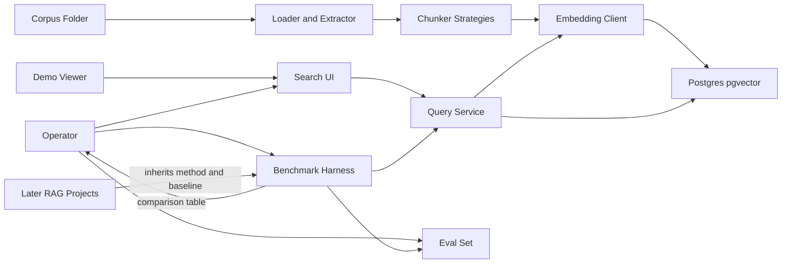
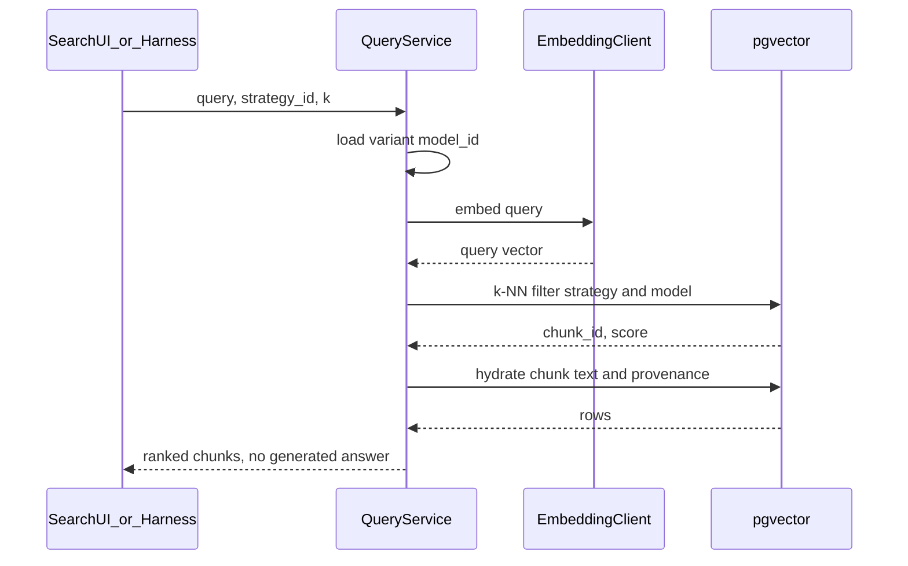
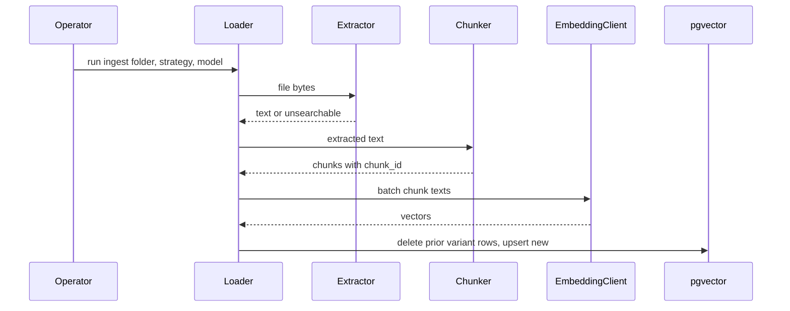

# Embeddings Explorer — Architecture Document
> - **Document Status**: Draft
> - **Last Updated**: 2026 Aug 29
> - **Author**: Paul Serban

A retrieval-only explorer that turns a folder of markdown/PDF files into **versioned chunk variants**, embeds them with one named model, serves k-NN search, and **compares chunking strategies on a labeled eval set**. This document covers *what* the system is and *why* it is shaped this way; see [System Design](./03_system_design.md) for *how* the three chunkers, IDs, query path, and harness actually work, and [Trade-offs and Honest Assessment](./05_tradeoffs_and_honest_assessment.md) for what is abandoned and why a 40-query winner is not a law of nature.

## Overview

**Brief description**: A laptop-scale lab: batch ingest, dense retrieval, a thin search UI, and an offline benchmark harness. It is not a chatbot, not a RAG product, not a vector-database bake-off, and not a preview of [RAG-at-scale](../../prj--rag-pipeline-at-scale/README.md).

**Business Context**
- See [Scenario and Requirements](./01_scenario_and_requirements.md) for the full framing. In short: the corpus is small; the scarce resource is **honest measurement**. Later RAG projects will copy whatever default chunker and whatever "eval" this project actually built.
- Target users: the operator running comparisons; a demo viewer at the search box; future projects that need a cited baseline.

## Requirements

### Functional Requirements

- **Ingest**: walk a configured folder; parse markdown natively and PDFs via a pinned extractor; persist raw/extracted text with hashes; mark extract failures `unsearchable`.
- **Chunking**: pluggable strategies (`fixed_size`, `recursive`, `semantic`) with recorded parameters. Chunk IDs must include strategy identity so variants coexist and re-ingest replaces rather than duplicates. See [ADR-003](./04_architecture_decision_records.md#adr-003).
- **Embedding**: one named `model_id` per comparison run. Every vector tagged with `model_id` and `strategy_id`. Mixing models inside one "which chunker wins" table is forbidden. See [ADR-002](./04_architecture_decision_records.md#adr-002).
- **Indexing**: upsert chunks + embeddings into Postgres/pgvector, filterable by strategy (and model). Batch rebuild of a variant is the write path.
- **Query serving**: embed query → k-NN on the selected variant → return ranked chunks with scores and provenance. No generator, no BM25, no rerank. See [ADR-005](./04_architecture_decision_records.md#adr-005).
- **Search UI**: query, strategy selector, k, result list. Eyeballing tool.
- **Benchmark harness**: replay the eval set against each variant; emit recall@k, MRR, ingest time, embed cost/count, coverage. See [ADR-004](./04_architecture_decision_records.md#adr-004).

### Non-Functional Requirements

**Performance Requirements:**
- Ingest: batch; laptop-minutes are success. Semantic sentence-embed pass may dominate wall clock — report it.
- Query: interactive for a human. No p99 SLO. Do not design a cache hierarchy to hide a remote embed API; localize the model or accept the latency.

**Reliability Requirements:**
- Idempotent ingest per `(strategy_id, params_hash, model_id)`.
- Failed embeds do not create fake vectors. Coverage is visible.
- Single-node. Crash recovery is "run ingest again."

**Infrastructure Constraints:**
- Python process(es), Postgres + pgvector, local filesystem corpus, optional embedding API.
- Compose is enough. Multi-service Kubernetes is a category error at this size.
- Corpus and eval queries may be private. Treat DB contents and traces as sensitive as the folder.

**The defining constraint:**
- Quality metrics do not exist until an eval set exists. The architecture is allowed to be simple. It is **not** allowed to skip labels. A search UI over one chunker with no table is a completed tutorial and a failed project.

## Executive Summary

The system is three pieces that should not be confused:

1. **Write plane (batch)**: folder → parse → chunk(strategy) → embed → upsert. Run on demand. No CDC.
2. **Read plane (sync, tiny)**: query → embed → k-NN → hydrate chunk rows → return. The UI is a client of this plane.
3. **Harness (offline)**: for each variant, run the labeled queries through the read plane (or the same library path), score, write a table.

The scarce resources are **operator time to label queries** and **discipline not to add a generator**. Embed dollars and RAM are rounding errors compared to [RAG-at-scale](../../prj--rag-pipeline-at-scale/_docs/01_business_overview.md). Pretending they are the story is how a foundation project acquires fake complexity.

**Architecture Style:** Batch pipeline + request/response k-NN. Not microservices. Not event-driven. A module boundary between parser / chunker / embedder / store is enough; process isolation is optional.

**Key Components:**
- **Corpus walker / loader**: files on disk, content hashes.
- **Extractors**: markdown (trivial), PDF (the actual quality risk).
- **Chunker interface** with three implementations.
- **Embedding client**: one model, batched, retried lightly.
- **Chunk + vector store**: Postgres/pgvector.
- **Query service**: library or a small HTTP API — same code the UI and harness call.
- **Search UI**: thin.
- **Benchmark harness**: the product.
- **Eval set store**: versioned queries + judgments (JSON/YAML in git is fine; tables are fine).

**Technology Stack (illustrative):**
- Language: Python.
- Extract: markdown as text; PDF via a pinned library (pypdf / pymupdf / unstructured — pick one in Phase 0 and **record extract quality**; switching extractors is a new experiment, not a silent pip bump).
- Chunk: own small implementations or a splitter library **wrapped** so parameters and versions are explicit. Do not call LangChain as the architecture.
- Embed: a single local `sentence-transformers` model **or** a single API model. Local is preferred so query latency and repeatability do not depend on a vendor. See [ADR-002](./04_architecture_decision_records.md#adr-002).
- Store: Postgres 16 + pgvector. Chroma/FAISS as documented alternatives, not dual-writes.
- UI: Streamlit or FastAPI + minimal HTML. No SPA framework.
- Harness: pytest or a CLI that writes Markdown/CSV.

**Architecture Principles:**
- **The benchmark table is the product; the UI is a flashlight.** Time spent on the UI after "query in, chunks out" is time stolen from labels.
- **One independent variable per comparison.** Chunker first. Model sensitivity is a later, optional phase. Changing two things and reporting one winner is fraud.
- **Chunk identity includes strategy.** Otherwise you cannot put three corpora in one DB and you cannot delete a variant cleanly.
- **Extraction quality is upstream of chunking.** A strategy comparison on soup measures nothing about splitters.
- **Dense-only is the point.** Hybrid and rerank would make this project a worse `retrieval-x`. Keep the baseline naive on purpose.
- **Small system, adult measurement.** Do not import freshness SLOs, shard hedges, or blue-green generations. Do import versioned params, coverage, and caveats.

**Key Architectural Decisions:**
1. **pgvector/Postgres over Chroma or FAISS as default.** [ADR-001](./04_architecture_decision_records.md#adr-001).
2. **Hold embedding model and store constant across chunker comparison.** [ADR-002](./04_architecture_decision_records.md#adr-002).
3. **Compare fixed-size, recursive, and semantic; do not crown semantic in advance.** [ADR-003](./04_architecture_decision_records.md#adr-003).
4. **Human labels over vibes or LLM-as-judge as primary ground truth.** [ADR-004](./04_architecture_decision_records.md#adr-004).
5. **Retrieval-only: no generation, no hybrid, no rerank.** [ADR-005](./04_architecture_decision_records.md#adr-005).

### Context Diagram

## Runtime Architecture

Two interactive paths and one batch path. None of them call an LLM for generation.

1. **Ingest (batch, operator-paced)**: walk folder → hash → extract → for each requested strategy: chunk → embed → delete old rows for that `(strategy, params, model)` → upsert. Completeness of this path is **coverage**, not a freshness SLO.
2. **Query (sync)**: receive query + `strategy_id` + k → embed query with the variant's `model_id` → k-NN `ORDER BY embedding <=> query_vec` filtered by strategy/model → join chunk text → return.
3. **Harness (offline, operator-paced)**: load eval-set version → for each variant → run all queries → score → write table. Must not special-case the query path (no "eval-only retriever").
4. **Degraded modes (tiny, explicit)**: extract fail → file unsearchable; embed fail → chunk missing from ANN, counted; store down → queries fail (no replica story).

### Query path (steady state)

### Ingest path (one strategy variant)

The query path never walks the folder. If ingest is stale, search is stale; **re-run ingest**. That is the entire freshness model. Building a dirty-chunk queue here would be rehearsing RAG-at-scale on 500 files.

## Components

### 1. Corpus Loader
**Purpose**: Turn a directory into a list of document records. Without hashes, re-ingest cannot skip unchanged files (optional optimization) and cannot prove what was indexed.

**Responsibilities:**
- Recurse the configured root; include/exclude globs.
- Compute `content_hash` on raw bytes (and a separate `text_hash` after extract).
- Skip or record binaries that are not in the allowed set.
- Does not chunk. Does not embed.

**Interactions:**
- Reads: filesystem.
- Writes: `documents` rows; hands text to chunker.

### 2. Extractor
**Purpose**: Produce the text the chunker will see. This is where PDF quality lives. HNSW cannot recover two-column soup, missing ligatures, or a slide deck indexed as one paragraph per page.

**Responsibilities:**
- Markdown: decode UTF-8, optionally keep a lightweight structure hint (headings) for the recursive splitter.
- PDF: pinned extractor version; store extract status and char count; **never index empty extract as a chunk**.
- Record `extractor_version` on the document. Changing it invalidates previous text_hashes and requires re-ingest.

**Interactions:**
- Written by loader. Read by chunker and by the coverage report.

### 3. Chunker (pluggable)
**Purpose**: The independent variable. Three implementations behind one interface. Re-chunking a strategy is a variant rebuild, not a config tweak you forget to record.

**Responsibilities:**
- `split(doc) -> list[Chunk]`.
- Stamp `strategy_id`, `params_hash`, `chunk_index`, `text`, optional `heading_path` / `page`.
- Assign `chunk_id` per [System Design §2.4](./03_system_design.md#24-identifiers).
- Drop empty/whitespace-only chunks; count them as dropped, not indexed.

**Interactions:**
- Reads: extracted text.
- Writes: chunk records (via ingest) to Postgres.

### 4. Embedding Client
**Purpose**: Vectors for chunks (always) and for sentences (semantic chunker only). Throughput lives here; at this scale it is still usually minutes, not days.

**Responsibilities:**
- Embed batches; pin `model_id` (name + revision if local).
- Semantic chunker may call this **twice** (sentences then chunks). Count both in cost. See [System Design §2.3](./03_system_design.md#23-semantic).
- Light retries on transient API errors; no distributed queue.
- Refuse to embed with a different model than the variant's recorded `model_id`.

**Interactions:**
- Reads: chunk (or sentence) texts.
- Writes: vectors on chunk rows / side table.

### 5. Chunk and Vector Store
**Purpose**: One Postgres that holds documents, chunks, embeddings, and optionally eval metadata. pgvector for k-NN.

**Responsibilities:**
- Filter k-NN by `strategy_id` (and `model_id`).
- Delete-by-variant for rebuilds.
- Return enough metadata to cite a file path and a location hint.

**Interactions:**
- Written by ingest. Queried by query service. Not a second vector product in prod.

### 6. Query Service
**Purpose**: The only retrieval API. UI and harness are clients.

**Responsibilities:**
- Validate strategy exists for the requested model.
- Embed query; k-NN; hydrate.
- Return scores as the index produces them (cosine/IP/L2 — pick one metric and stick to it for the comparison).
- Emit cheap logs: latency, k, strategy, hit count. Sample query text if the corpus is not public.

**Interactions:**
- Reads: embedder, Postgres.
- Writes: nothing durable except optional query log.

### 7. Search UI
**Purpose**: Qualitative inspection. Prove to a human that retrieval returns *chunks from files*, not magic.

**Responsibilities:**
- Query box, strategy dropdown, k slider, result cards (text, path, score, chunk_id).
- Optional: side-by-side two strategies for the same query (useful, still not a metric).
- **Forbidden**: "Ask the docs" generation box, chat history as product, user accounts.

**Interactions:**
- Calls query service only.

### 8. Benchmark Harness
**Purpose**: Produce the artifact the roadmap asked for. If this component is missing, the project is a search demo.

**Responsibilities:**
- Load eval-set version.
- Run each query against each variant at agreed k values (e.g. 5 and 10).
- Compute recall@k, MRR; optionally nDCG if graded relevance exists.
- Join ingest metrics (duration, embed calls, estimated $).
- Write a dated report with the caveat block from [System Design §5.4](./03_system_design.md#54-what-the-numbers-are-allowed-to-mean).

**Interactions:**
- Reads: eval set, query service, ingest run stats.
- Writes: report files in `_reports/` or equivalent (build phase). Docs-only: the **schema** of that report is specified in system design.

### Communication Patterns

**Synchronous:** UI/harness ↔ query service ↔ Postgres / embedder.

**Batch:** operator CLI for ingest and harness. No message bus.

**No control plane:** no blue-green index generations, no shadow traffic. A new embedding model is a new `model_id` and a new ingest. Cheap at this size; do not dress it up as a migration platform.

## Scaling Strategy

**Current Scale Requirements (working assumptions, Phase 0 must replace):**
- ~200–2,000 files, thousands to tens of thousands of chunks, one laptop.
- Query QPS: a human and a harness. Tens of queries per second is already overkill.

**What this project does not scale:**
- It does not shard. It does not quantize for RAM. It does not hedge scatter-gather.
- If Phase 0 finds 100k PDFs, **stop** and re-scope. That is no longer scenario 0.4. Point at RAG-at-scale or narrow the folder.

**Preferred order if the folder grows awkwardly (still toy-scale):**
1. Local embedding model (query latency, repeatability).
2. Skip re-embed of unchanged `text_hash` within a variant (optional).
3. HNSW index on the pgvector column when sequential scan gets sluggish (usually later than people think on 10k rows).
4. Do not add Redis, Kafka, or a second vector DB to "prepare for scale."

**Bottleneck Analysis:**
- Primary **quality** bottleneck: PDF extraction and eval-set size/bias — not ANN.
- Primary **time** bottleneck: semantic sentence embeddings + operator labeling.
- Primary **integrity** bottleneck: changing model or extractor mid-comparison.
- Capacity bottleneck: none worth a diagram, unless the folder is not the folder in the scenario.

## Data Architecture

### Data Model

**Key Entities:**
- **Document**: `doc_id`, `path`, `raw_hash`, `text_hash`, `extractor_version`, `status` (`ok` | `unsearchable`), `byte_size`, `char_count`.
- **IngestRun**: `run_id`, `strategy_id`, `params_hash`, `model_id`, `started_at`, `finished_at`, `file_count`, `chunk_count`, `embed_calls`, `duration_ms`.
- **Chunk**: `chunk_id`, `doc_id`, `run_id` or denormalized `strategy_id` + `params_hash` + `model_id`, `chunk_index`, `text`, `text_hash`, `heading_path`, `page`, `token_count`.
- **Embedding**: stored on the chunk row (`vector`) or 1:1 table. Same `model_id` as the run.
- **EvalQuery**: `query_id`, `eval_set_version`, `query_text`, `notes`.
- **EvalJudgment**: `query_id`, `doc_id` and/or `chunk_text_hash` / `label_span`, `grade` (binary relevant, or graded 0–2 if you have the patience).

**Entity Relationships:**
- One Document has many Chunks per `(strategy_id, params_hash, model_id)`.
- One Chunk has one vector for that run.
- Judgments should prefer **doc-level** (or stable text hashes) because chunk_ids change across strategies — see [System Design §5.3](./03_system_design.md#53-label-granularity).

### Data Lifecycle

**Create**: ingest run inserts documents (upsert by path/hash) and a full set of chunks for one variant.

**Read**: query service reads chunks + vectors. Harness reads eval tables/files.

**Update**: new ingest for a variant **replaces** that variant's chunks. Documents whose extract failed stay `unsearchable` until the extractor or file changes.

**Delete**: removing a file from the folder is detected on the next ingest (path gone → delete its chunks for the variants being rebuilt). No CDC.

**Rebuild**: changing `params_hash`, `strategy_id`, `model_id`, or `extractor_version` is a new variant or a replacement ingest. There is no in-place "same graph, new model." Cheap here; still forbidden for the same reason as at 300M vectors — the spaces do not mix. We just do not need blue-green RAM theater.

## Cost Analysis

### Cost Components

**This system is cheap. Say it plainly.**

A 2,000-file markdown-heavy folder at ~400 tokens/chunk and ~10k chunks, embedded once with a small API model, is typically **single-digit to low tens of USD**, often less with a local model (electricity and time). Semantic chunking can multiply embed calls (sentences + chunks) into a still-small bill that looks large **only relative to the other two strategies**. That relative number belongs in the table.

**Where money is not the story:**
- Postgres on a laptop: $0 incremental.
- pgvector vs Chroma vs FAISS: license/cost is not a reason at this size.
- Engineering time **is** the bill: labeling 40–60 queries well takes hours; debugging PDF extract takes more; a React UI takes a weekend and produces no comparison.

**Contrast, so nobody copies the wrong fear:** [RAG-at-scale](../../prj--rag-pipeline-at-scale/_docs/01_business_overview.md) is multi-TB RAM and day-long rebuilds. Copying that cost narrative here is dishonest. Copying that *measurement discipline* here is the point.

### Cost Optimization

- Local embedding model for iteration; API model only if Phase 0 bake-off needs it.
- Do not semantic-chunk the corpus ten times while tuning a similarity threshold without noting the spend in the report.
- Skip UI frameworks.
- Do not embed unsearchable/empty extracts.

## Risks and Mitigation

| Risk | Likelihood | Impact | Mitigation Strategy | Owner |
| --- | --- | --- | --- | --- |
| No eval set; "quality" is vibes | High if rushed | High | Phase 0 gate; harness cannot run without labels | Operator |
| PDF extract soup attributed to chunker | High | High | Measure extract quality first; optionally split the table markdown vs PDF | Extractor / Phase 0 |
| Embedding model changed mid-comparison | Medium | High | `model_id` on every row; harness groups by model; [ADR-002](./04_architecture_decision_records.md#adr-002) | Harness |
| Chunk-level labels break when strategy changes | High | Medium | Label at doc level (or text-hash / passage); [System Design §5.3](./03_system_design.md#53-label-granularity) | Eval set |
| Semantic chunking assumed superior | High | Medium | Cost columns required; no winner without caveats [ADR-003](./04_architecture_decision_records.md#adr-003) | Report |
| Search UI scope creep / chatbot added | High | High | [ADR-005](./04_architecture_decision_records.md#adr-005); Phase 3 after the table | Operator |
| Eval set of 8 queries overfit to headings | High | High | Minimum 30; mix paraphrase vs keyword; sanity-check with lexical baseline | Operator |
| Declaring a global best chunker | Medium | High | Report header: corpus, model, eval-set version, date | Report |
| Dual-writing Chroma and pgvector "for fairness" | Medium | Low/Medium | One store for the primary table; store bake-off is a different experiment | Operator |
| Local folder contains secrets, then logs/queries go to a cloud embed API | Medium | High | Prefer local model; redact; don't commit corpus | Operator |
| Treating this index as production search | Low | Medium | Explicit non-goals; no auth does not mean "deploy to the internet" | Operator |

## Future Enhancements

### Phase 1 (current design)
**Focus**: One model, three chunkers, labels, table, thin UI. See [Phased Implementation Plan](./06_phased_implementation_plan.md).

### Phase 2 (after the table exists)
**Focus**: Optional second embedding model (sensitivity). Optional markdown-vs-PDF slice of the table. Optional side-by-side UI.

### Phase 3 (explicitly another project)
**Focus**: Naive RAG generation (`docqa-basic`), then hybrid + rerank. Those consume this baseline; they do not get merged backwards into it.

### Technical Debt (accepted)

- Dense-only retrieval will lose ID/code queries that BM25 would catch. **That loss is the baseline.** Document it with a couple of ID-like eval queries rather than "fixing" it here with hybrid.
- Recursive splitters are corpus-tuned (separator lists). The params are part of the variant, not a universal law.
- Semantic chunking implementations differ (percentile breakpoints vs cosine drops). One implementation, documented, is enough. A paper's method is not promised.
- pgvector on 10k rows with no HNSW is a sequential scan and is fine. Adding index tuning theater is optional.
- Hand-labeled 40 queries will rot if the corpus changes a lot. Re-label or freeze the corpus for the published table. There is no living golden-set operations team on a personal folder.
