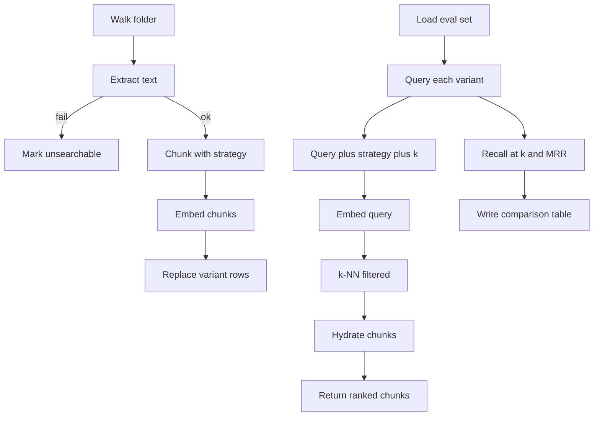
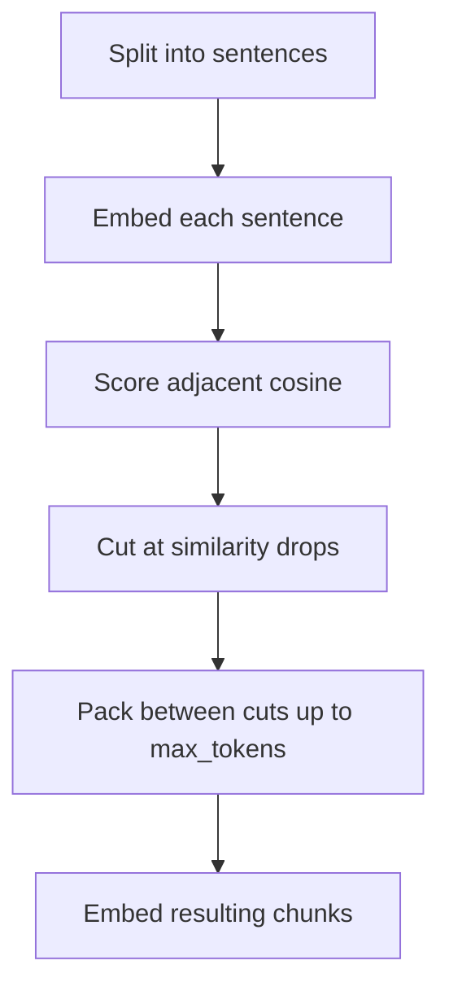
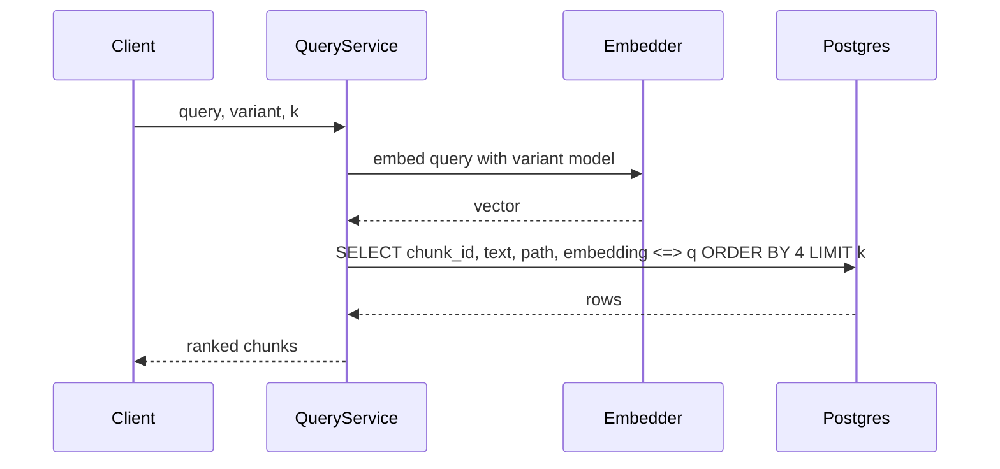
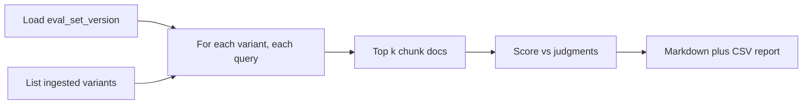

# Embeddings Explorer — System Design
> - **Document Status**: Draft
> - **Last Updated**: 2026 Aug 29
> - **Author**: Paul Serban

This document is the mechanical *how* for the system described in the [Architecture Document](./02_architecture_document.md). It specifies the three chunkers, identifiers, ingest/query paths, the eval-set labeling rules, and the harness report. It does not specify code.

Working corpus numbers (~200–2,000 files) are **assumptions** until Phase 0 replaces them. Mechanics do not depend on the exact count; labeling effort does.

## 1. Control Flow

Two operator-paced jobs (ingest, harness) and one synchronous query. Coupling query to "re-chunk this file if missing" is how a demo becomes an unmeasured snowflake.



**Invariant:** the query path never walks the folder and never generates tokens. If ingest is old, results are old. Re-run ingest.

## 2. Chunking

Chunking is a versioned function `(extracted_text, strategy_id, params) -> chunks`. Changing params is a new variant. Comparing strategies without recording params is how "recursive" means three different things next month.

All three strategies run on the **same extracted text**. They do not get to re-parse PDFs differently. If you want to test extractors, that is a different independent variable and a different table.

### 2.1 Fixed-size

The dumb baseline. It must exist so recursive and semantic can lose to it, which they sometimes will.

1. Tokenize with a **named tokenizer** aligned with the embedding model when practical (same family, or a documented approximation such as `chars/4` only if you cannot share a tokenizer — approximations go in the report).
2. Sliding window: working default **512 tokens**, overlap **64 tokens** (~12.5%). Record both in `params_hash`.
3. Do not split on structure. Mid-sentence and mid-table cuts are expected. That is the point of the baseline.
4. Optional breadcrumb: prepend `path` (and first heading if markdown already extracted it cheaply). If you add breadcrumbs, **all three strategies get the same breadcrumb policy** or you have confounded the comparison.

Suggested param grid *if* you explore inside this strategy (secondary, after the three-way table): 256/32, 512/64, 1024/128. Each cell is a variant. Do not grid this and semantic thresholds in the same run.

### 2.2 Recursive (structure-aware with fallback)

The "sensible default" candidate for markdown. Not magic for PDFs that have no headings.

1. Prefer markdown/HTML-aware splits: headings (`\n## ` …), then paragraphs (`\n\n`), then lines, then spaces, then characters — the usual recursive-separator cascade.
2. Keep fenced code blocks and markdown tables intact if they fit `max_tokens`; if not, split on row/line boundaries, not mid-cell when possible.
3. Pack siblings into a chunk until `max_tokens` (working default **512**, overlap **64** on the character/token fallback only). Overlap on the structure path is optional; if used, record it.
4. Prepend heading path as breadcrumb if the splitter knows it — same policy as §2.1.
5. PDFs: after extraction you often have pages, not headings. Recursive then **degrades toward paragraph/page splits**. That is expected. Do not invent fake H1s from font size in v1 unless Phase 0 shows it is necessary *and* you treat it as extractor work, not chunker work.

This is the strategy most tutorials mean by "recursive character splitter." Name the separator list in `params`. A silent LangChain upgrade that changes defaults invalidates the table.

### 2.3 Semantic

Split where adjacent sentence embeddings drop in similarity. This is **not** "smarter recursive." It is a second embedding pipeline used as a preprocessor.



Mechanics (v1, one documented method — pick it and freeze):

1. Sentence-split with a real sentence segmenter (not `split('.')` on code and abbreviations).
2. Embed each sentence with the **same** `model_id` as chunk embeddings (otherwise boundary detection lives in a different space than retrieval).
3. Compute cosine between sentence `i` and `i+1`.
4. Cut when similarity is below a threshold. Working default: **percentile-based** (e.g. cut at the bottom 5–10% of adjacent similarities in *this document*) rather than a global `0.7`, because similarity scales differ by model. Record the rule in `params`.
5. Merge the resulting spans until `max_tokens` (working **512**). If a single sentence exceeds max, hard-split it (rare; still needed).
6. Embed the packed chunks for retrieval. **Do not** retrieve with the sentence vectors unless you explicitly define a different system — v1 retrieves chunks like the other strategies.

**Cost honesty:** sentence count >> chunk count. A 2,000-token doc might be ~80 sentences and ~5 chunks. Semantic ingest embed calls are dominated by sentences. The harness **must** count sentence embeds separately from chunk embeds.

**What v1 will not do:**
- BERT-style topic segmentation papers with trained boundary models.
- LLM-asked "is this a good split."
- Cross-document clustering.

If semantic loses on the eval set, that is a valid outcome. Do not "tune the percentile until it wins" without reporting the search. That is p-hacking a 40-query set.

### 2.4 Identifiers

```
params_hash  = hash(canonical_json of strategy params)
chunk_id     = hash(doc_id, strategy_id, params_hash, model_id, chunk_index, text_hash)
text_hash    = hash(normalized_chunk_text)
doc_id       = hash(stable_path_relative_to_corpus_root)  or recorded UUID; pick one and keep it
```

- `chunk_index` is ordered within `(doc_id, strategy_id, params_hash, model_id)`.
- `model_id` is in the chunk identity because a vector is not meaningful without it. Same text, different model, different row.
- Rebuild of a variant: `DELETE FROM chunks WHERE strategy_id = … AND params_hash = … AND model_id = …` then insert. Do not leave orphans.

**Normalization** for `text_hash`: Unicode NFKC, collapse `\r\n`, strip trailing whitespace. Do not lowercase (code and IDs). Breadcrumbs, if any, are part of the stored text and therefore the hash.

### 2.5 What chunking will not fix

- A PDF extractor that returns page soup or ignores columns.
- Questions whose answer is split across a table and a footnote three pages away. Overlap might catch it; none of these three strategies is multi-hop retrieval.
- Eval queries copied verbatim from a heading. Recursive will look like a genius. Include paraphrases.

## 3. Ingest

### 3.1 Procedure

For a requested `(strategy_id, params, model_id)`:

1. Walk files; upsert `documents` (`path`, `raw_hash`).
2. If extract missing or `raw_hash` changed: extract; set `text_hash`, `status`.
3. If `status != ok`: no chunks for this file; increment `unsearchable`.
4. Chunk all ok documents with this strategy.
5. Embed chunks (and sentences if semantic).
6. Replace variant rows; record `IngestRun` stats.

**Optional skip:** if `text_hash` and strategy params and model are unchanged, skip re-embed. Nice to have; not required for v1 correctness. Do not skip when extractor_version changed.

### 3.2 Parallelism

Thread or async batches for embed calls. Do not shard the DB. Do not run three strategies as a distributed job queue. Sequential strategy runs are simpler and make cost attribution obvious.

### 3.3 Coverage metrics (required on every run)

- `files_seen`, `files_extracted_ok`, `files_unsearchable`
- `chunks_written`, `chunks_dropped_empty`
- `embed_calls_sentences` (0 for non-semantic), `embed_calls_chunks`
- `duration_ms`

A comparison table without coverage can hide "semantic won because it dropped the bad PDFs."

## 4. Query Path

Naive dense retrieval. This is the retrieval slice of naive RAG, without the generator.

1. Resolve variant: `strategy_id` + `params_hash` + `model_id` (UI may default params to the last ingest).
2. Normalize query text the same way as documents (whitespace); **do not** apply document breadcrumbs to the query.
3. Embed query with that `model_id`.
4. k-NN in pgvector: cosine distance (or IP if the model is trained for it — **one metric, documented**). `WHERE strategy_id = $1 AND params_hash = $2 AND model_id = $3` **inside** the query, not as a post-filter on a global top-k (post-filter would mix variants if you ever forget the WHERE).
5. Hydrate `text`, `path`, `heading_path`, `page`, `chunk_index`, distance/score.
6. Return. No fusion. No rerank. No "if score < t drop." Thresholding would be a fourth system; if you add it, it is another independent variable.



**k values:** UI default 5 or 10. Harness runs **the same k list for every strategy** (working: 5 and 10). Do not give semantic k=20 and fixed-size k=5.

## 5. Benchmark Harness

The deliverable. If ingest and UI exist and this does not, the project failed.

### 5.1 Procedure



1. Load `eval_set_version` (immutable snapshot; editing queries bumps the version).
2. Confirm every variant under test used the **same** `model_id` and same extractor_version. If not, refuse to emit a single table (emit separate tables).
3. For each variant, for each query: retrieve k_max (e.g. 10), compute metrics at each k in {5, 10}.
4. Attach the matching `IngestRun` cost/time/coverage.
5. Write the report.

### 5.2 Metrics

Working primary metrics (binary relevance):

- **Recall@k**: fraction of queries for which **at least one** relevant document (see §5.3) appears in the top k. (If you have multiple relevant docs and want completeness, also report **success-at-k** vs **full-recall-at-k** and say which one you mean. v1 default: **at least one relevant doc in top k** — i.e. Success@k — because labels will be sparse. Call it Success@k in the report to avoid lying with the word recall.)
- **MRR**: mean over queries of `1/rank` of the first relevant hit; 0 if none in k_max.

Optional:

- **nDCG@k** only if graded relevance exists. Do not invent grades from GPT.

Also report **non-quality**:

- ingest `duration_ms`
- `embed_calls_sentences + embed_calls_chunks`
- estimated $ if any API pricing applies; `local` if local model
- `files_unsearchable`

Lexical sanity baseline (Phase 0 / Phase 2): Postgres `ts_vector` or even substring match Success@k on the **same** eval set. If dense retrieval cannot beat naive keyword on ID-like queries, that is a finding, not a reason to add BM25 into this project's production path. Put keyword in the **report**, not in the query service.

### 5.3 Label granularity

Chunk IDs are **not** stable across strategies. Labeling `chunk_id` from the fixed-size run and then scoring recursive against those IDs is invalid.

**v1 rule:** judgments are **document-level** (and optionally a quoted `passage` string). A hit counts as relevant if the retrieved chunk's `doc_id` is in the relevant set for that query.

Optional stricter rule: relevant if `doc_id` matches **and** the chunk text overlaps the quoted passage (e.g. 32-character n-gram or token overlap ≥ threshold). Use this if many files are huge and retrieving the right PDF but the wrong half is a real failure. Record the overlap rule. If you cannot implement overlap cleanly, stay doc-level and accept that metric is coarse.

**Do not** relabel from scratch for every strategy unless you are doing a qualitative error analysis. Relabeling 3× is how the eval set never ships.

Query writing rules:

- At least ~30 queries; 40–60 better.
- Mix: paraphrase, keyword/ID, "which doc talks about X," a few that need a specific section.
- Do not copy a heading verbatim for more than a small fraction (~20%) of the set.
- Freeze the corpus (or snapshot paths+hashes) for a published table. Adding 400 files after labeling without review dilutes the set.

### 5.4 What the numbers are allowed to mean

A 40-query set can **rank** strategies on *this* folder and *this* model. It cannot:

- establish statistical significance (report that; a 0.05 Success@5 gap is often noise),
- transfer to another corpus or embedding model,
- transfer to 50M documents,
- survive a different PDF extractor.

Every report includes a fixed caveat block:

- eval_set_version, n_queries, label rule (doc-level vs passage),
- corpus snapshot (file count, format mix, unsearchable rate),
- model_id, distance metric, k list,
- "directional, not a significance test,"
- "not a global ranking of chunkers."

If that block is missing, the table is marketing.

### 5.5 Example table shape (fictional numbers)

| Variant | Success@5 | Success@10 | MRR | Ingest s | Embed calls | Est. $ | Unsearchable files |
| --- | --- | --- | --- | --- | --- | --- | --- |
| fixed_size 512/64 | 0.62 | 0.71 | 0.48 | 90 | 8,400 | local | 12 |
| recursive 512/64 | 0.70 | 0.78 | 0.55 | 95 | 7,100 | local | 12 |
| semantic p10 512 | 0.68 | 0.80 | 0.54 | 410 | 41,000 | local | 12 |
| keyword baseline | 0.44 | 0.51 | 0.33 | n/a | 0 | 0 | n/a |

Fictional. A real table might have semantic lose. The interesting row is often **embed calls**, not the 0.02 MRR delta.

## 6. Search UI

Minimum:

- Text input, strategy (and params/run) selector, k, Search.
- Results: rank, score, path, optional heading/page, chunk text, `chunk_id`.
- Show `model_id` and eval-set version in a footer so screenshots are attributable.

Useful, still in scope:

- Side-by-side two strategies, same query.
- Link or path copy.

Out of scope:

- Chat, streaming answers, "summarize these hits," user auth, upload UI (folder is configured, not a SaaS ingest).
- Editing the eval set from the UI (keep labels in git/files so they are reviewable).

## 7. Error Handling

- **Missing file / permission**: skip, count, continue.
- **Extract fail or empty text**: `unsearchable`; do not insert a blank chunk (blank nearest-neighbors are a special hell even at 10k rows).
- **Sentence split fail (semantic)**: fall back to recursive for that document, **flag the doc** in the run stats. Silent fallback would steal credit from semantic.
- **Embed fail**: retry 2–3 times with backoff; then leave chunk unindexed; increment `embed_failures`. Do not write zero vectors.
- **Unknown strategy on query**: 4xx, do not fall back to another variant.
- **Empty index for variant**: return zero hits, not another variant's hits.
- **Eval query with no judgments**: harness fails the run. Unlabeled queries are not "zeros"; they are incomplete data.

## 8. Observability Minimum

If these do not exist, you cannot defend the table.

- Per ingest: coverage and cost fields in §3.3.
- Per query (log): variant, k, latency_ms, hit_count — not full chunk text by default.
- Harness: git SHA or eval_set_version printed on the report.
- Postgres row counts per variant (sanity: recursive vs fixed-size chunk counts should differ; if they are identical, the splitter probably did not run).

No distributed tracing platform. stdout + a `runs/` JSONL is enough.

## 9. Caching (narrow)

Allowed:

- In-process cache of the query embedding for the harness (same query × same model). Tiny win.
- Skip re-embed of unchanged chunk `text_hash` on ingest.

Forbidden:

- Caching search results across strategies.
- Caching across `model_id`.
- "Semantic cache" of answers — there are no answers.

## 10. Embedding Model Choice (mechanical)

Not a bake-off in the primary table.

Working default: a small **local** English model with known dimension (e.g. a MiniLM-class 384-d or a newer ~768-d open model). Pin the revision. Document instruction prefixes if the model requires `query:` vs `passage:` — and apply them **consistently** (query prefix on queries, document prefix on chunks, never mixed).

If the model needs different prefixes and you omit them, you are measuring prefix bugs, not chunkers.

API models are allowed if Phase 0 prefers them; then **every** comparison run must use the same model snapshot. Provider-side silent upgrades are a reason to prefer local for this project.
