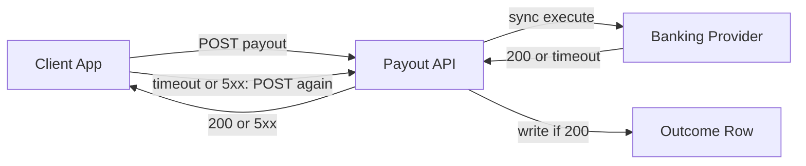
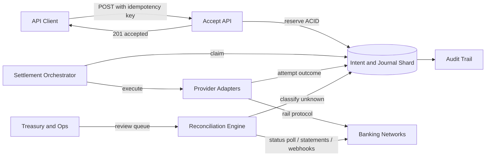
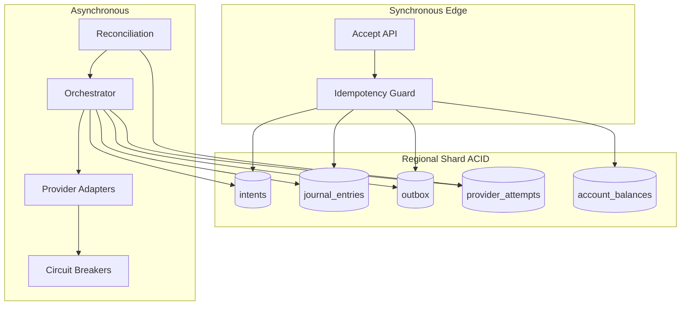
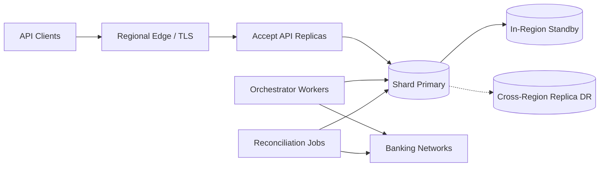

# PayGlobe Idempotent Ledger & Settlement Pipeline — Architecture Document
> - **Document Status**: Draft
> - **Last Updated**: 2026 Aug 29
> - **Author**: Paul Serban

PayGlobe is a cross-border remittance gateway at 20,000 TPS peak across 35 regional banking networks. Client-side retries after outbound timeouts have produced duplicate payouts and millions in losses. The system replaces that path with a regional ACID intent ledger, effectively-once provider execution, a settlement saga, and a reconciliation engine that is part of the runtime, not an incident wiki.

## Overview

**Brief description**: This is not a bank. It is the control plane and the books for moving money *through* banks we do not control. The architecture exists so that a timeout cannot become a second payout, and so that "accepted" is not confused with "settled."

**Business Context**
- Owner: the payments platform team that currently owns the synchronous payout API.
- Current state: client retries are the recovery mechanism; the database records outcomes after the bank answers; unknown is treated as failed.
- Desired future state: the database records the *intent* before any bank is called; unknown is a state; recovery is ours; the client may retry safely.
- Goal: zero duplicate payouts from retries and failovers; a journal a regulator can read; accept latency that does not wait on a bank.
- Target users: owning engineers, treasury on-call, finance/reconciliation, compliance, and the client-platform team that must stop treating 5xx as "please send it again as a new payment."

## Requirements

### Functional Requirements

- **Idempotent accept**:
  - The system must require a client-supplied idempotency key scoped to a principal.
  - The system must reserve at most one intent per `(principal_id, idempotency_key)`.
  - A replay with an identical payload must return the existing intent.
  - A replay with a conflicting payload must not pay and must not silently succeed.
- **Ledger**:
  - Money movement is recorded as balanced, append-only double-entry journal entries.
  - Corrections are reversing entries.
  - Intent reservation and the corresponding pending entries commit in one local ACID transaction.
- **Dispatch**:
  - A worker, not the HTTP handler, calls providers.
  - Execute is claimed exclusively.
  - Outcome `unknown` blocks further execute on that intent until classified.
- **Failover**:
  - Automatic provider failover is permitted only after a terminal, *known* failure (or a reconciled "not executed"), and only onto a rail that actually serves the corridor.
  - Failover is recorded; it is not a retry of the same provider request id.
- **Recovery**:
  - Reconciliation classifies unknowns from provider status APIs, webhooks, and statements.
  - Manual review exists for intents that cannot be classified automatically; it is a last resort, not the primary path.

### Non-Functional Requirements

**Performance Requirements:**
- Accept path (authn/authz already done, idempotency reserve, pending journal): **p99 < 100ms** as a *design intent* for a regional shard under load, not as a promise that includes TLS handshake from the other side of the planet or a cold cache miss on a overloaded node. See [Latency Budget](#latency-budget).
- Settlement confirmation: **not** in the 100ms budget. SLO is per-rail (seconds for instant schemes; hours/next-cycle for batch ACH/RTGS windows).
- Throughput: 20,000 TPS **accept** at peak, sharded. Execute TPS is the minimum of (queued accepted intents, per-rail rate limit, banking-hours calendar). Design the queue; do not design 20k bank HTTP calls.

**Service Level Agreement (SLA):**
- System criticality: money. A duplicate payout is an incident with a loss amount, not a log line.
- Availability of the **accept** API matters because clients will otherwise invent their own retry storms (they already did).
- Availability of **execute** workers matters for settlement latency, not for "did we uniquely reserve."
- RPO for a reserved intent: zero once the regional primary has committed. Cross-region replica lag is a disaster-recovery concern, not "the other region can accept the same key."
- RTO for execute: minutes is painful and recoverable. RTO for accept: tighter, because the business cannot take new volume.

**Infrastructure Constraints:**
- Technology shape (not an implementation mandate): stateless API tier; regional relational (or equivalent ACID) stores for intent + journal + attempts; an async worker pool; a durable queue or outbox from the same ACID store; provider adapters as a bounded context; a reconciliation scheduler; an append-only audit/event stream that may be the journal itself plus the attempt log.
- Secrets: provider credentials, signing keys, and HMAC secrets live in a secret store, are rotatable, and are never in the journal payload in recoverable form.
- Regulatory: retention, immutability, and access control on the journal are compliance constraints. They are not "we enabled WAL archiving."

## Executive Summary

The architecture is **Reserve-Locally → Ack-Accept → Dispatch-Async → Reconcile-Unknowns**. The HTTP handler is a narrow, synchronous, fail-closed reservation. Everything that talks to a bank happens off the request path, under an exclusive claim, with an outcome state machine that treats timeout as unknown.

**Architecture Style:** Regional sharded ACID ledger + transactional outbox + settlement saga + anti-corruption provider adapters + reconciliation as a control loop.

**Key Components:**
- **Accept API**: authenticates, validates, reserves intent.
- **Idempotency / Intent Store**: unique `(principal_id, idempotency_key)`, payload fingerprint, lifecycle state.
- **Double-Entry Ledger Core**: append-only journal, accounts (customer liability, rail clearing, fees, FX, suspense).
- **Outbox / Dispatch Queue**: same-transaction publication of "this intent may be executed."
- **Settlement Orchestrator**: claims work, drives the saga (hold → execute → post or reverse).
- **Provider Adapter + Circuit Breaker**: per-rail protocol, timeouts, outcome classification, rate limits.
- **Attempt Log**: every outbound call, durable, queryable.
- **Reconciliation Engine**: closes `unknown`, backfills from statements/webhooks/polls.
- **Audit / Event Store**: investigator-grade trail; may physically overlap the journal and attempt log.

**Architecture Principles:**
- **Ack means reserved, not paid.** A 201/200 on accept is a statement about the ledger, not about the beneficiary.
- **The client is not the retry mechanism for our bank calls.** Once we have reserved, retries of the *same key* are our problem and must be no-ops at execute time.
- **Unknown is not failed.** Retrying execute is allowed only when we can prove we did not send, or the provider proved it did not execute.
- **Duplicates are a success case** at the accept door. Unique constraint collision is the feature.
- **Banks are not in our transaction.** Sagas and compensating journal entries, never 2PC. [ADR-003](./04_architecture_decision_records.md#adr-003).
- **Failover is product, not TCP.** [ADR-005](./04_architecture_decision_records.md#adr-005).

**Key Architectural Decisions:**
1. Effectively-once via durable intent + no-blind-retry, not "exactly-once messaging." [ADR-001](./04_architecture_decision_records.md#adr-001).
2. Regional shard as the ACID boundary; no global serializable ledger. [ADR-002](./04_architecture_decision_records.md#adr-002).
3. Saga vs 2PC for settlement. [ADR-003](./04_architecture_decision_records.md#adr-003).
4. Reconciliation is mandatory, not a runbook. [ADR-004](./04_architecture_decision_records.md#adr-004).
5. Provider adapters isolate 35 protocols; failover is gated. [ADR-005](./04_architecture_decision_records.md#adr-005).
6. Consistency is per data class: journal/intent strict-local; settlement projection eventual. [ADR-006](./04_architecture_decision_records.md#adr-006).

### The Anti-Pattern This Design Exists to Kill

This fails because:

- The bank call is on the request path. Our timeout and the bank's execution clock are not the same clock.
- A timeout after the bank executed looks like failure. The retry is a second payout.
- There is no unique business key. The second POST is a new payment.
- Failover (when someone "improves" this with a second provider on 5xx) doubles the blast radius.
- The database is a memo of the last HTTP status, not a ledger.

### Context Diagram

## Runtime Architecture

1. **Synchronous edge (accept)**
   - Authenticate and authorize the principal.
   - Require idempotency key; fingerprint the canonical payload.
   - Insert intent + pending journal entries + outbox row in one local transaction, or detect duplicate / conflict.
   - Return per [Status-Code Policy](#status-code-policy).
2. **Asynchronous dispatch**
   - Orchestrator claims `ready_to_dispatch` intents (or outbox events).
   - Adapter sends execute with a *provider-scoped* request id derived from `intent_id` (stable across our retries of the *HTTP transport*, never a new id per timeout — see [System Design](./03_system_design.md)).
   - Classify outcome. Post journal (pending → posted) on success. Reverse or release on terminal failure. Freeze on unknown.
3. **Isolation and recovery**
   - Reconciliation and, if needed, human review close unknowns.
   - Failover is a later, explicit transition, not step 2's timeout handler.

## Components

### 1. Accept API

**Purpose**: Be the only door that creates money-moving intents. Bound the client's retry onto a unique key.

**Responsibilities:**
- Validate schema, corridor, amount bounds, currency, beneficiary completeness (enough to not pay the wrong person; full sanitization of every rail's field set may live in the adapter at dispatch, but *identity of the payee* is frozen at accept).
- Enforce idempotency as specified in [ADR-001](./04_architecture_decision_records.md#adr-001).
- Choose the **owning shard** from a deterministic key (typically `principal_id` or a hashed corridor+principal policy). The client does not choose the shard.
- Commit reservation. Do not call adapters.

**Interactions:**
- Reads: auth, product/corridor config, shard router.
- Writes: intent, journal, outbox.

**Honesty about this component:** if product insists the accept response include `provider_reference` and `settled_at`, they are asking to put the bank on the request path again. Refuse, or drop the 100ms SLA in writing.

### 2. Idempotency / Intent Store

**Purpose**: Be the system of record for "this principal meant this payout once."

**Responsibilities:**
- Unique `(principal_id, idempotency_key)`.
- Store canonical payload hash, frozen payee/amount/currency/corridor, state, owning shard, timestamps.
- Serve as the lock point for claims (`locked_by`, `locked_at` / fencing token).

**Honesty about this component:** a Redis SETNX of the key *without* the payload and journal is how you "dedup" and then cannot prove what you accepted, cannot replay, and cannot survive Redis failover without double-pay or drop. Redis as a *cache in front of* the ACID row is an optimization after the row exists. The unique constraint is the feature. [ADR-001](./04_architecture_decision_records.md#adr-001).

### 3. Double-Entry Ledger Core

**Purpose**: Record PayGlobe's books. If the intent store says what we meant to do, the journal says what we owe and own.

**Responsibilities:**
- Append balanced entries (minimum two legs). Debits equal credits in the entry's currency; multi-currency entries use explicit FX legs, not a magic plug.
- Typical v1 accounts (logical, not a full COA product):
  - Customer / merchant liability (we owe them, or they prefunded us)
  - Rail clearing / nostro-with-provider (in-flight or at the partner)
  - Fee income
  - FX difference
  - Suspense / unknown (money that may have left but is not confirmed) — this account is how `unknown` does not lie on the trial balance
- Immutability: insert only. Reversals are new entries linked to `intent_id` and `reverses_entry_id`.
- Projection: current balances are materialized views or account-balance rows updated in the same transaction as the journal insert (at shard scope). If you update a balance without a journal row, you no longer have a ledger.

**Honesty about this component:** "immutable double-entry" is the easy slogan. The hard parts are: (1) what to post at *reserve* vs *provider 200* vs *unknown*, (2) suspense accounting for unknown so you do not book revenue on a maybe, (3) not letting a "balance table" drift from the journal. Teams will implement a `status` column and call it a ledger. That is the current system.

### 4. Outbox / Dispatch Queue

**Purpose**: Start execute only after the reserve transaction commits, without a dual-write (API commits DB, then fails to publish).

**Responsibilities:**
- Insert outbox row in the **same** ACID transaction as the intent.
- Publisher (or `SKIP LOCKED` poller) delivers to workers.
- At-least-once delivery. Workers are idempotent because the intent state machine is.

**Honesty about this component:** Kafka is not the ledger. If the outbox is "just publish to the broker" with no local row, a 201 after a publish that the broker acked and a DB that rolled back (or the inverse) is a split brain. Transactional outbox from the shard is the boring, correct pattern. [ADR-002](./04_architecture_decision_records.md#adr-002) does not require Kafka on day one; a table-as-queue is acceptable until Phase 5 load says otherwise — same honesty as the webhook project's ADR-004, and the same failure mode if you pretend a `SELECT ... FOR UPDATE SKIP LOCKED` loop is a global bus.

### 5. Settlement Orchestrator (Saga)

**Purpose**: Drive one intent from reserved to a terminal money state without 2PC across banks.

**Responsibilities:**
- Claim exclusively.
- Invoke the adapter.
- On success: post pending entries (or insert posting entries that close the pending/suspense).
- On terminal failure: compensating entries (release hold).
- On unknown: move funds representation to suspense if not already, **do not execute again**, enqueue reconciliation.
- Record saga step in the attempt log / intent state so a crash resumes the *step*, not the *HTTP call to the bank as a new execute* unless the step is proven not-sent.

**Honesty about this component:** sagas are how you get "eventual consistency" support tickets. The customer will see `accepted` then `failed` after the rail rejects, or `accepted` then `settled` twelve hours later. Product must own those states. If they refuse, they are asking for the anti-pattern.

### 6. Provider Adapter and Circuit Breaker

**Purpose**: Translate one internal execute command into 35 hostile protocols, and tell the orchestrator the truth about the outcome.

**Responsibilities:**
- Map frozen intent fields onto rail-specific messages.
- Apply per-rail timeouts, mutual TLS, signing, and **their** idempotency field if they have one (pass our stable `intent_id` / derived id; do not mint a random UUID per attempt).
- Classify HTTP/timeout/parse into the four outcome classes. This mapping is per rail and will be wrong for some rails until production teaches you. Budget for it.
- Circuit breaker per `(provider, rail, region)`: trip on timeout/5xx *storms*, not on a single unknown (a single unknown is still an unknown; opening the circuit stops *new* dispatches, it does not authorize retry of the frozen one).
- Rate limit: honor partner TPS caps. Shed to queue, not to parallel hammering.

**Honesty about this component:** you will not get 35 high-quality adapters in the first year. Phase 2 is a handful of rails. "Dynamic failover across 35" on day one is a slide. Many rails have no status API; those rails make `unknown` expensive (statement-only reconciliation, next day). The adapter's most important function is **classification**, not XML mapping.

### 7. Attempt Log

**Purpose**: Be the forensic record of what we sent, when, and how it came back (or did not).

**Responsibilities:**
- One row per outbound attempt: `intent_id`, provider, request id we sent, timestamps, outcome class, raw response reference (object store, not the hot table, if large), correlation ids.
- Never delete. Retention per compliance.

Without this, reconciliation is guesswork and audit is a lie.

### 8. Reconciliation Engine

**Purpose**: Turn `unknown` into `succeeded` or `not_executed` / `failed_terminal` using sources the accept path cannot wait for.

**Responsibilities:**
- Poll provider status APIs where they exist, keyed by the stable request id.
- Ingest webhooks (with their own inbox/idempotency — that is a related pattern, not this project's HTTP trap, but the webhook must not be a second write path around the state machine).
- Match bank statements / Nostro reports to attempt ids or amounts+beneficiary+time windows (the last is weak; prefer ids).
- Apply classification through the *same* orchestrator transitions, not a SQL `UPDATE status` in the job.
- Alert on age of oldest `unknown` and on unmatched statement lines (money moved that we did not expect — the other direction of duplicate).

**Honesty about this component:** if this does not exist, the design is lying about recovery. Timeouts will happen. Status APIs will be missing. Statement matching will be fuzzy and will need humans. Budget a ops queue. [ADR-004](./04_architecture_decision_records.md#adr-004).

### 9. Audit / Event Store

**Purpose**: Answer "what happened?" without a production engineer tailing logs.

**Responsibilities:**
- Intent transitions, journal entry ids, attempt ids, actor (system / user / reconciliation job), timestamps, reasons for failover and manual override.
- Hash-chain or storage immutability controls as compliance requires (WORM bucket, append-only table with no `UPDATE` grant). Do not over-claim cryptographic ledgers; a permissioned append-only store plus backups is what most regulators actually inspect. A blockchain is not on the table.

### Communication Patterns

**Synchronous:**
- Client ↔ Accept API.
- Accept API ↔ regional shard (one transaction).
- Orchestrator ↔ adapter (outbound; timeout-bounded). Adapter timeout is *our* timeout, chosen per rail, and its expiry produces `unknown` if we cannot prove not-sent.

**Asynchronous:**
- Outbox → orchestrator.
- Reconciliation schedule and webhook inbox.
- Alerts.

There is no synchronous call from accept to a bank. That is the whole point.

## Status-Code Policy

The status code is the contract with the client's retry engine. Getting it wrong is how you recreate the loss.

| When | Status | Client should retry? | Durable effect |
| --- | --- | --- | --- |
| New key, reserve committed | `201 Created` | No (replay with same key is ok and returns existing) | Intent `accepted` / `reserved`, pending entries |
| Same key, same payload, intent exists | `200 OK` (or `201` if you must; pick one and document) with **the existing intent body** | N/A — this *is* the retry | None |
| Same key, **different** payload | `409 Conflict` | No | None |
| Missing idempotency key, malformed body, failed validation | `400 Bad Request` | No | None |
| Unauthenticated / unauthorized | `401` / `403` | No | None |
| Shard cannot commit (overload, primary down) | `503 Service Unavailable` | Yes, **with the same idempotency key** | None |
| Shed load before reserve | `503` or `429` | Yes, same key | None |

**Why the body of a duplicate replay must be the current intent, including state.** If you return a generic "duplicate" without `intent_id` and `state`, the client cannot poll. If you return `201` with a *new* id, you have not implemented idempotency.

**Why 4xx for conflict, not a second payout.** The client has a bug (reused a key). Paying is worse than annoying them.

**Why 5xx only when we did not reserve.** After `201`, the client must not be told to "retry as a new payment." They may *replay* the same key. Our docs and SDKs must say so. The current millions in losses are 5xx-after-unknown plus a new-key retry.

**Do not return 2xx before commit.** Optimistic 201 is the data-loss / double-pay cousin: client thinks you have it; you do not; they may or may not retry; if a later ghost execute existed from a process that continued after the response, you are in hell. Commit, then respond.

## Latency Budget

Sub-100ms is the most abused number in the scenario. Split it.

### What can fit in ~100ms p99 (regional, healthy)

| Step | Budget (order of magnitude) | Notes |
| --- | --- | --- |
| AuthN already cached / JWT verify | 1–5ms | JWKS cache miss is a spike; do not pretend it cannot happen |
| Validate + canonicalize + hash | 1–3ms | |
| Shard route | <1ms | Deterministic, no cross-region lookup |
| ACID reserve (primary in-region) | 5–30ms | The real number. Contention on a hot principal can blow this. |
| Replication to *synchronous* local standby, if required | 2–10ms | Same AZ or same region. Cross-region sync replication will not fit. |
| Response serialize | 1–2ms | |

Sum: **plausible in-region** if the database is healthy, the row is not contended, and "end-to-end" starts after the request has reached the accept process. It is not plausible if it includes:

- Client → edge TLS from a mobile network
- Cross-region synchronous commit
- Any provider HTTP call
- A second shard "just to be sure"
- Serializing a 35-provider routing optimization

### What cannot fit

| Step | Typical reality | Consequence |
| --- | --- | --- |
| Inter-region RTT (e.g. US-EU, EU-APAC) | 30–180ms+ *one way* | Cross-datacenter ACID is not a 100ms feature |
| Raft/Paxos majority in three regions | Multiple RTTs | Global linearizability vs 100ms: pick one |
| Instant payment scheme, happy path | tens to hundreds of ms, often more | Still not "inside accept" |
| Batch / RTGS / correspondent banking | minutes to T+2 | Settlement SLO is a calendar |
| Provider timeout we must sit in | often 5–30s (their SLA, not ours) | Must be async |

**The architectural sentence:** we take the 100ms SLA as **accept p99, regional, excluding last-mile and excluding banks**. We refuse it as **global ACID + bank confirmed**. Anyone restating the SLA in a customer contract as "payout credited in 100ms worldwide" is creating a legal problem this architecture will not solve.

### 20,000 TPS and the 100ms budget together

20k TPS with a 100ms service time implies ~2,000 in-flight accepts if that 100ms were all server time (`Little's law`: `concurrency ≈ rate × latency`). That is a capacity number for the API and the databases, not a curiosity. Hot shards (one giant merchant) will not average; they will serialize on the unique index for that principal's keyspace — which is *fine* for correctness (idempotency) and lethal for latency if one principal is a huge fraction of 20k TPS with *distinct* keys. Shard by principal, and split principals who are actually platforms. If one `principal_id` is 8,000 TPS of unique payouts, that shard's unique-index and journal append is the bottleneck, and no amount of Kubernetes replicas in front will fix it. That is a data-model fact, not an ops miss.

## Brutal Honesty

This pattern is **materially more complex** than a synchronous POST-to-bank. It adds:

- An intent lifecycle distinct from "the HTTP status of the last bank call"
- A real journal, including suspense for unknown
- Outbox + workers + claiming
- Per-rail adapters and outcome classification (the unglamorous forever-work)
- Reconciliation, statement matching, and a human queue
- Eventual customer-visible states
- Multi-region *routing* of accept to the owning shard, and a disaster-recovery story that does not split-brain the unique key

**When this is justified:** duplicate payouts already cost millions; rails are unreliable; clients retry; auditors exist. That is this scenario.

**When this is overkill:** two internal accounts in one database we own, low TPS, no external rail. A unique constraint and a single transaction is the correct design. Building PayGlobe-in-a-box for that is architecture theater.

**The consistency window is a product fact.** After `201`, `GET` of the intent may show `accepted` / `dispatched` / `unknown` / `settled` over time. Downstream systems that ship goods or credit a wallet on `201` are **prefunding against our liability**, not against a confirmed rail. If the product requirement is "the HTTP response is when the beneficiary can withdraw in Nairobi," this architecture **cannot meet that requirement** on a rail that is not instant, and cannot meet it in 100ms even on instant rails we do not control.

**Complexity you will actually pay:**
- Outcome classification bugs (treating a provider's 200 `{status: pending}` as success, or a 500 as failed-not-sent). This is where the next million is lost.
- Hot principal contention at 20k TPS.
- "Temporary" sync execute "just for this one partner who needs a reference in the HTTP response." That exception becomes the product.
- Reconciliation matching without a shared id (amount + name + date). High false positives/negatives. Ops load.
- Multi-region: the first time someone accepts in region B because region A was "slow," with a different unique index, you have two intents. Shard ownership must be sticky. [ADR-002](./04_architecture_decision_records.md#adr-002).
- Failover FX: the second rail quotes 40 bps worse. Treasury will care. Engineering cannot hide it in a retry.

## Scaling Strategy

**Accept:** stateless API replicas; **data** scales by shard. Add shards for new principal ranges; do not add a "global ledger node."

**Execute:** scale workers per rail up to the partner's cap. Beyond that, queue.

**Bottlenecks:**
- Primary: unique-index and journal append on hot shards.
- Secondary: unknown backlog if reconciliation is weak (ops people, not CPUs).
- Tertiary: adapter credential/rate-limit lockouts from retry bugs.

**Scale-out (conditional):** dedicated broker for dispatch; more shards; read replicas for GET/status and reporting (never for reservation). Cross-region active-active accept for the *same* keyspace is refused unless a consensus layer owns the unique key — which reintroduces the latency trade-off. Prefer active-passive per shard, active-active across *disjoint* shards (EU principals in EU, APAC in APAC).

### Component Diagram (Logic View)

### Deployment Diagram (Physical View)

Workers and API share the shard primary, not a second "ledger service" with a cache. A cache of "we already paid this key" that can miss is a duplicate-payout bug.

## Data Architecture

See [System Design](./03_system_design.md) for field-level description. Summary:

- **intents** are the unique business command.
- **journal_entries** are the books; **account_balances** are a projection maintained in the same transaction.
- **provider_attempts** are the wire history.
- **outbox** is the dispatch trigger.
- Cross-region copies are **replicas for DR and reads**, not a second writable unique index.

The platform does not treat a provider 200 as the ledger. The ledger is ours. The provider 200 is evidence used to post.

## Cost Analysis

Not an AWS bill exercise. The costs that matter:

- Engineering: adapters × 35, reconciliation, journal correctness. This is years, not a quarter, to *finish* all rails. A quarter can finish the core + a few rails.
- Database: 20k TPS ACID writes are expensive (IOPS, high-availability primaries, change-data-capture for outbox).
- Ops: 24/7 for unknowns and statement breaks. If you will not staff this, do not accept money.
- Duplicate-payout losses (the current cost) vs this machine. Price the architecture against the millions already lost, not against "one extra table."

## Risks and Mitigation

| Risk | Likelihood | Impact | Mitigation | Owner |
| --- | --- | --- | --- | --- |
| Literal 100ms end-to-end including bank | High (stakeholder) | High (impossible SLA) | Written SLA split; product sign-off in Phase 0 | Architect + product |
| Blind retry of `unknown` | High | High (duplicate payout) | State machine + chaos test as Phase 2/3 gate | Owning engineer |
| Redis-only idempotency | Medium | High | Unique constraint on shard is source of truth [ADR-001](./04_architecture_decision_records.md#adr-001) | Owning engineer |
| Cross-region dual-write of same key | Medium | High | Sticky shard ownership [ADR-002](./04_architecture_decision_records.md#adr-002) | Platform |
| Adapter classifies 500 as not-sent | High | High | Per-rail classification table; default `unknown` | Adapter owner |
| Failover after timeout | Medium | High | [ADR-005](./04_architecture_decision_records.md#adr-005); code review gate | Owning engineer |
| Hot merchant shard | Medium | Medium | Split principal / shard early; watch p99 | Platform |
| Reconciliation never staffed | High | High | Phase 3 is a hard gate; DLQ/unknown aging pages | Treasury on-call |
| Sync execute exception for "strategic partner" | High | High | Architectural review; exception = drop 100ms for that route in writing | Architect |
| Journal vs balance drift | Medium | High | Same transaction; periodic trial-balance job | Finance + engineer |

## Future Enhancements

Covered by phases rather than a wishlist: core ledger, few rails, reconciliation, multi-region DR, then more rails and failover policy. See [Phased Implementation Plan](./06_phased_implementation_plan.md).

**Known/Accepted Trade-offs:**
- Eventual settlement vs accept.
- Regional ACID vs global ACID.
- Effectively-once vs exactly-once.
- Table-as-queue until measured pain.
- Human review for stubborn unknowns.
- Incomplete rail coverage for a long time.

See [Trade-offs and Honest Assessment](./05_tradeoffs_and_honest_assessment.md).
