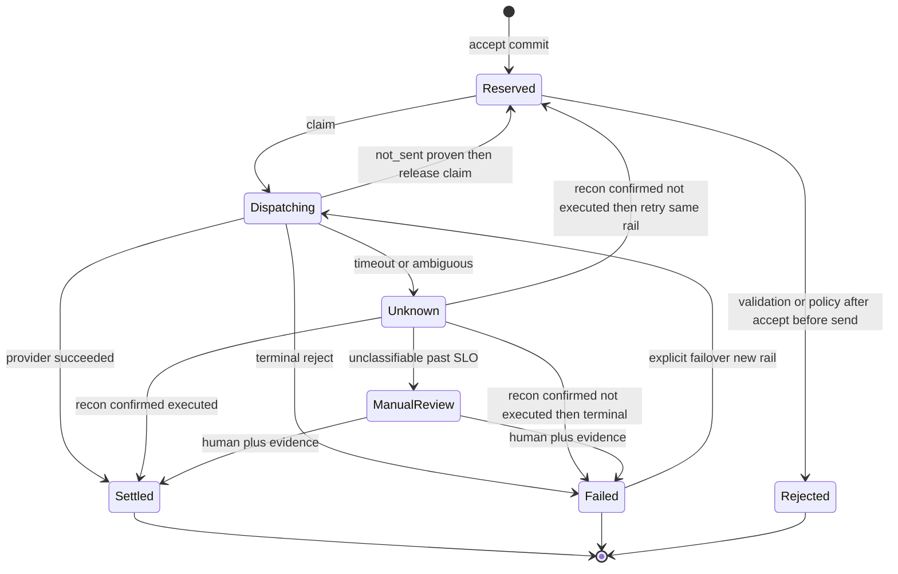
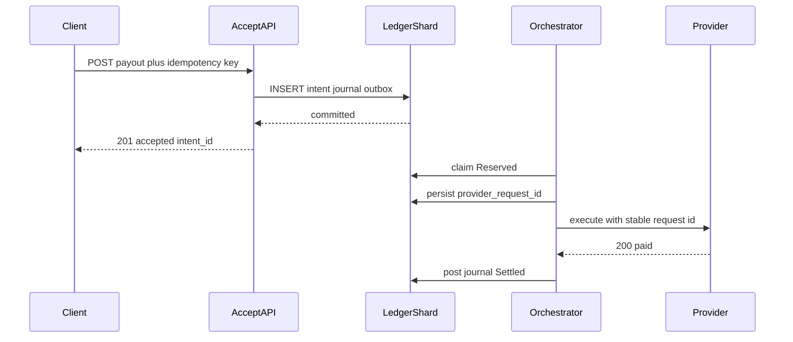
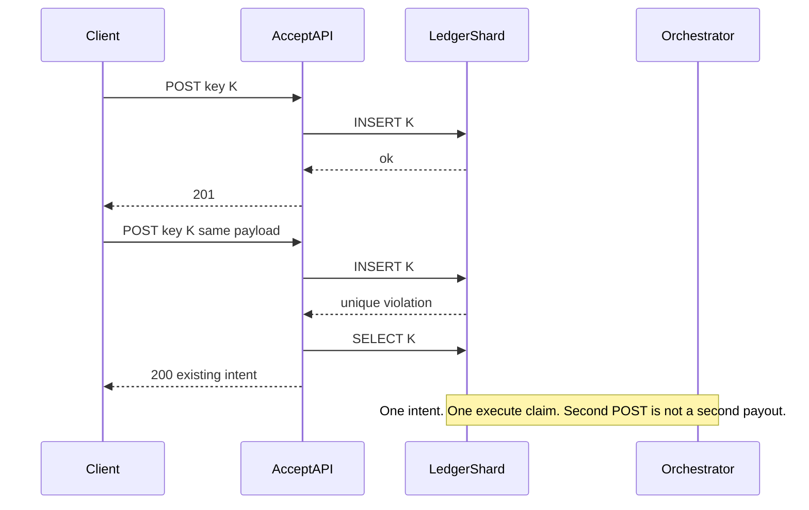
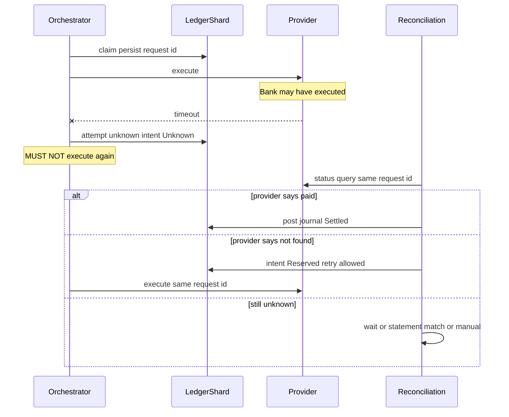
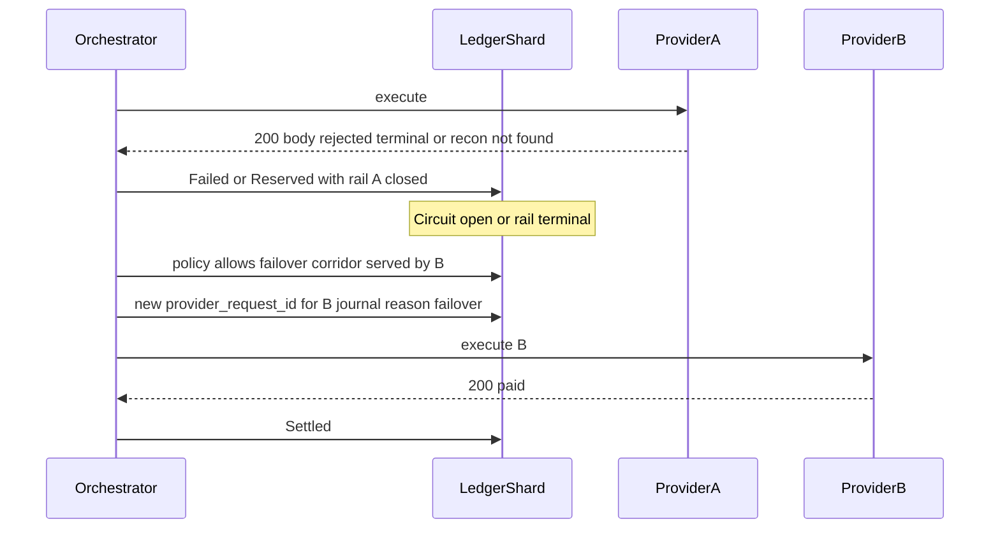
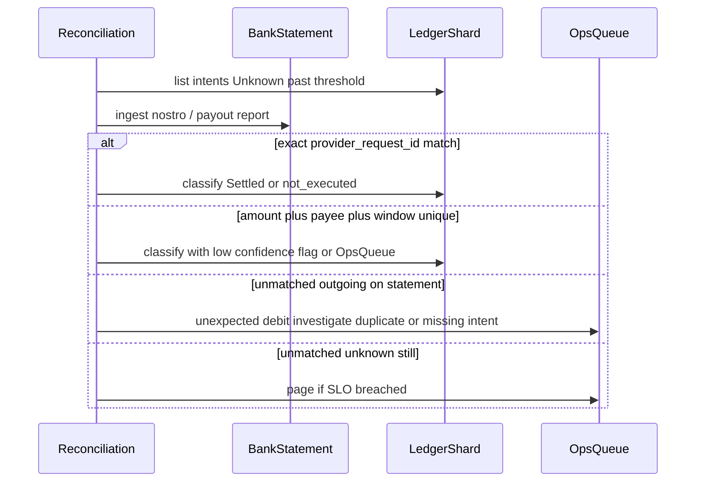

# PayGlobe Idempotent Ledger — System Design
> - **Document Status**: Draft
> - **Last Updated**: 2026 Aug 29
> - **Author**: Paul Serban

This document describes *how* the ledger and settlement pipeline work internally: the data model, the accept and dispatch procedures, the outcome state machine, and the sequences that actually answer the scenario (happy path, duplicate submit, timeout-with-unknown-outcome, failover, reconciliation). It complements the [Architecture Document](./02_architecture_document.md), which covers *what* the system is and *why* it is shaped this way.

> This is a design specification. No API, SQL, or adapter code is implemented as part of this documentation deliverable. Numbered steps are the intended handler/worker behavior, not a source file.

## 1. Data Model

Five logical stores. They may live in one regional database per shard in Phase 1. They must not be collapsed into "update a payout row after the bank answers."

### 1.1 `intents` (idempotency backbone)

One row per accepted business command.

| Field | Role |
| --- | --- |
| `intent_id` | Server-minted unique id. Stable forever. Used in all journal lines, attempts, and as the basis of the provider request id. |
| `principal_id` | API client / merchant / originating institution. Part of the unique key. |
| `idempotency_key` | Client-supplied. Unique with `principal_id`. |
| `payload_hash` | Canonical hash of the frozen payout command (amount, currency, corridor, beneficiary identifiers, purpose codes that affect routing). Conflict detection. |
| `amount`, `currency`, `corridor` | Frozen at accept. Dispatch may not reinterpret. |
| `beneficiary_fingerprint` | Canonical payee identity as accepted. |
| `state` | See [§2](#2-intent-state-machine). |
| `shard_id` | Owning shard. Immutable. |
| `provider_id` | Set when a rail is selected (at accept if the corridor has one rail; at dispatch if routing is deferred). Failover *changes* this only via an explicit transition. |
| `provider_request_id` | Stable id we send to the current provider. Derived from `intent_id` (and provider code if the same intent can be failed-over — then it is `intent_id + attempt_rail_n`, still stable per rail). |
| `reserved_at`, `updated_at` | |
| `settled_at` / `failed_at` | Terminal timestamps. Null until terminal. |
| `locked_at` / `locked_by` / `lock_epoch` | Exclusive claim for dispatch. `lock_epoch` is a fencing token so a zombie worker cannot post after losing the lease. |
| `unknown_since` | Set when entering `unknown`; drives reconciliation SLO. |
| `version` | Monotonic for optimistic concurrency on state transitions. |

**Unique constraint:** `(principal_id, idempotency_key)`. Not optional. Application-level "select then insert" is a race and a duplicate payout.

**Secondary unique:** `intent_id`. **Secondary unique:** `(provider_id, provider_request_id)` when provider_id is set — prevents two in-flight executes to the same rail with different ids *and* makes status polls unambiguous.

### 1.2 `journal_entries` (append-only books)

| Field | Role |
| --- | --- |
| `entry_id` | Unique, ordered (ULID/snowflake per shard is enough; global order across shards is **not** required). |
| `intent_id` | |
| `booked_at` | Ledger time. |
| `kind` | `reserve` \| `post` \| `reverse` \| `suspense_move` \| `fee` \| `fx` \| `manual_adjust` |
| `reverses_entry_id` | For compensating entries. |
| `legs` | At least two: `account_id`, `amount`, `direction` (debit/credit), `currency`. Sum of signed amounts per currency is zero; FX uses a pair of currencies plus an explicit rate on the entry. |
| `actor` | `system:accept` \| `system:orchestrator` \| `system:recon` \| `user:<id>` |
| `reason` | Short machine code (`provider_confirmed`, `provider_rejected`, `unknown_timeout`, `manual_override`). |

No `UPDATE` of amount, legs, or kind. If the row is wrong, reverse it.

### 1.3 `account_balances` (projection)

| Field | Role |
| --- | --- |
| `account_id` | Logical account (liability, clearing, fee, fx, suspense, …). May be further dimensioned by currency and principal. |
| `currency` | |
| `amount` | Current balance. Updated **in the same transaction** as the journal insert. |
| `as_of_entry_id` | Last entry applied. Drift detection: a job can recompute from journal and compare. |

If a process updates `account_balances` without a `journal_entries` row, it is not this design.

### 1.4 `provider_attempts`

| Field | Role |
| --- | --- |
| `attempt_id` | Unique. |
| `intent_id` | |
| `provider_id` | |
| `provider_request_id` | What we sent. |
| `kind` | `execute` \| `status_query` \| `cancel` (if the rail supports cancel — many do not) |
| `started_at`, `finished_at` | |
| `outcome_class` | `succeeded` \| `failed_terminal` \| `failed_retryable_not_sent` \| `unknown` |
| `http_or_protocol_status` | As observed, nullable. |
| `provider_reference` | Their id, if any. |
| `request_payload_ref` / `response_payload_ref` | Pointer to durable blob; PII-aware retention. |
| `error_truncated` | Safe, short. |

An execute attempt in `unknown` is what **forbids** another execute attempt until this row is reclassified (or a linked status_query reclassifies the intent).

### 1.5 `outbox` (dispatch trigger)

| Field | Role |
| --- | --- |
| `outbox_id` | |
| `intent_id` | |
| `event_type` | `intent_reserved` \| `intent_retry_allowed` \| `recon_reclassified` |
| `created_at` | |
| `published_at` | Null until the publisher succeeds. |

Inserted in the reserve transaction. At-least-once delivery to the orchestrator.

### 1.6 What is *not* a table

- A Redis "paid keys" set as the source of truth.
- A `payouts.status` boolean updated from the HTTP adapter with no journal.
- A global sequence table that every shard must hit (that is a 20k TPS hotspot and a cross-region latency magnet).

## 2. Intent State Machine

States are the control plane. Journal entries are the books. Both must move together on money-relevant transitions; the worker writes them in one transaction.

**Illegal:** `Unknown → Dispatching` (execute) without passing `Reserved` via a classification that says not-executed. The diagram's `Unknown → Reserved` is that gate.

**`Dispatching → Reserved` on `failed_retryable_not_sent`:** we never reached the bank (connect error before send, local timeout before bytes, provider 4xx "rejected before accept"). Transport retry is allowed, still with the **same** `provider_request_id`.

## 3. Accept Handler: What Happens Before Responding

Numbered so an implementation can be traced 1:1.

1. **Authenticate / authorize** the principal. Failure: `401` / `403`.
2. **Require idempotency key** from a well-known header or field. Missing: `400`.
3. **Parse and canonicalize** the payout command. Missing mandatory payee/amount/corridor: `400`.
4. **Fingerprint** the canonical payload.
5. **Route to shard** from `principal_id` (or documented policy). If the local process is not the owner, **forward** to the owning region (this hop can blow a 100ms budget — see honesty below) or return `307`/`422` with the correct endpoint. Do not insert locally "to be fast."
6. **Insert intent** in `Reserved`, plus `journal_entries` kind `reserve` (hold customer liability → clearing or hold account), plus `account_balances` update, plus `outbox` `intent_reserved`, in **one transaction**.
   - Success: continue.
   - Unique violation on `(principal_id, idempotency_key)`: `SELECT` the existing row. If `payload_hash` matches: **do not insert anything**; return `200` with current representation. If it does not match: `409`. Do not pay. Do not 500.
   - Any other DB error: `503`. Do not return 2xx.
7. **Commit.** Only after commit: `201` with `intent_id`, `state: accepted` (or `reserved`), and a **status URL**. Do not wait for a worker. Do not include a bank reference you do not have.

**Deferred:** all adapter calls, FX lock from a market, AML model inference if it cannot meet the budget (if AML must gate money movement, it gates *dispatch*, or accept becomes "accepted_pending_review" still without a bank call).

**Crash between commit and flush:** row exists; client may retry; unique violation path returns `200`. Safe.

**Crash before commit:** no row; no 2xx (or response never left). Client retries with same key. Safe.

**Honesty about step 5:** a globally distributed client population hitting the "wrong" region cannot have p99 100ms *and* a single-writer shard on another continent. Product options: pin clients to regional endpoints, accept extra latency on mis-route, or partition principals geographically. There is no fourth option that keeps one unique index worldwide at 100ms.

## 4. Orchestrator: Claim, Execute, Post

1. **Claim:** take an outbox event or `SELECT ... FOR UPDATE SKIP LOCKED` an intent in `Reserved` whose rail is in business hours and whose circuit is closed. Set `Dispatching`, increment `lock_epoch`, set `locked_by`.
2. **Fence:** subsequent journal writes include `lock_epoch` check (or compare-and-swap `version`). A worker whose lease expired must not post.
3. **Select rail** if not frozen. Record `provider_id` and `provider_request_id` **before** the HTTP send, in the same state as `Dispatching` (commit). If you send before recording the request id, a crash makes the attempt invisible and the next worker will send a *new* id — duplicate if the first landed.
4. **Insert `provider_attempts` row** `kind=execute`, `outcome_class` pending/in-flight, then send.
5. **Classify** the result ([§5](#5-outcome-classification)).
6. **Single transaction on known terminal outcomes:**
   - Success: journal `post` (or convert reserve to posted), balances, intent `Settled`, attempt `succeeded`.
   - Terminal fail: journal `reverse` of the reserve, intent `Failed`, attempt `failed_terminal`.
   - Not-sent: intent back to `Reserved` (or stay retryable), attempt `failed_retryable_not_sent`. Same `provider_request_id` on next send.
   - Unknown: intent `Unknown`, `unknown_since=now()`, journal `suspense_move` if accounting policy requires in-flight funds to sit in suspense, attempt `unknown`. **Stop.**
7. **Release claim** as part of that transaction.

**Lease length:** longer than the adapter timeout, shorter than "stuck forever." Expired `Dispatching` without an attempt row: treat as not-sent. Expired `Dispatching` *with* an attempt in-flight/unknown: treat as `Unknown`, not as "retry execute."

## 5. Outcome Classification

This is the most important table in the project. Default, when unsure, is `unknown`.

| Observation | Class | Next execute? |
| --- | --- | --- |
| TCP/TLS failed before request bytes | `failed_retryable_not_sent` | Yes, same request id |
| Local timeout **before** send | `failed_retryable_not_sent` | Yes |
| HTTP 4xx documented as schema/auth reject, provider says not processed | `failed_terminal` or retryable-not-sent if they say "retry with fix" — still **not** a second money instruction | No execute of the *same* frozen payload if the payload is what they rejected |
| HTTP 2xx with body `accepted` / `paid` / their success code | `succeeded` | No |
| HTTP 2xx with body `duplicate` / `already processed` for our `provider_request_id` | `succeeded` (idempotent success) | No |
| HTTP 5xx | **`unknown` unless the rail's contract says 5xx cannot have executed** (rare; do not assume) | No |
| Timeout **after** send | `unknown` | No |
| Connection reset after send | `unknown` | No |
| Unparseable 200 | `unknown` (or `succeeded` if you like gambling) | No |
| Circuit open *before* send | never sent; not an attempt, or attempt not-sent | Dispatch later |

Per-rail overrides live in adapter config, reviewed when a partner changes their API, and tested with captured fixtures. A generic "5xx = retry" in a shared HTTP client is how you duplicate.

## 6. Sequence Diagrams

### 6.1 Happy path

### 6.2 Duplicate client submit (harmless)

Concurrent first inserts: one transaction wins, one unique-violates, both return the same `intent_id`. Two orchestrators cannot both execute if claim is exclusive on that row.

### 6.3 Provider timeout after send (the actual hard case)

**Blind retry is the bug.** The current system is this diagram without the `Unknown` state and with a second `execute` after timeout.

### 6.4 Failover mid-transaction (only after known not-executed)

If the first call was `unknown`, this diagram **does not run**. Failover after unknown is two rails, two possible credits.

### 6.5 Post-timeout reconciliation via statement (no status API)

Fuzzy match is how you book the wrong statement line to the wrong intent. Prefer ids. If the rail cannot echo an id, the honest ops cost is high — record that in the rail's adapter profile.

## 7. Accounting Sketch (Enough to Be Honest)

At **reserve** (accept):

- Debit: merchant prefund / receivable (depending on business model)
- Credit: `held_for_payout` (or similar)

At **unknown**:

- Move `held_for_payout` → `suspense_in_flight` (same amounts). Trial balance still balances. Revenue is not recognized.

At **settled**:

- Debit: `held_for_payout` or `suspense_in_flight`
- Credit: `rail_clearing` / nostro
- Separate entry for fees if taken

At **failed / reverse**:

- Reverse the reserve (and suspense if used). Merchant funds available again.

This is a sketch. Finance must sign the actual COA in Phase 0. Engineering must not invent "fee income" posting on `201`.

## 8. Idempotency at Three Layers

All three are required. One layer is not enough.

| Layer | Mechanism | Duplicate class it stops |
| --- | --- | --- |
| Accept | Unique `(principal_id, idempotency_key)` | Client retries, concurrent POST |
| Dispatch | Exclusive claim + stable `provider_request_id` + no execute in `Unknown` | Worker retries, timeouts |
| Provider | Pass their idempotency field when they have one | Their internal retries of our single execute |

If the provider ignores idempotency (common), layers 1–2 are the whole guarantee, plus reconciliation to detect the case where we sent once and they executed twice on their own. That last case is a partner incident, not something we can prevent with a unique index. We can detect it if statements show two credits for one request id.

## 9. GET / Status and Client SDK Rules

- `GET /intents/{id}` is eventually consistent with dispatch by milliseconds to hours; it is **not** a second execute.
- Clients may poll. They must **not** `POST` a new key because `state != settled`.
- SDKs: retry `503`/`429` with the same key; treat timeout of *accept* as replay-with-same-key, never as a new payment; never retry accept timeout by generating a UUID key.

The current losses are largely "SDK default retry + new UUID." Document this as a breaking client change. Without it, the server can be perfect and the mobile app will still double-pay.

## 10. Observability (Minimum)

Metrics that change behavior:

- Accept: count by status code, unique-violation rate (retry storm), p99 reserve latency, `409` rate, `503` rate.
- Intent: depth by state, age of oldest `Reserved` and `Unknown`, `Unknown` count.
- Attempts: outcome class histogram **per provider**.
- Ledger: trial-balance check failures (should be zero).
- Reconciliation: classified per run, unmatched statement lines, manual queue depth.

Logs: `intent_id`, `principal_id`, `provider_request_id`, state transition, outcome class. Not full PANs / account numbers in default logs.

Traces: accept transaction separate from execute span. Do not make "trace missing a bank span" look like a bug on the accept SLO dashboard.

## 11. Mapping Back to the Scenario

| Ask | Answer in this design |
| --- | --- |
| Immutable double-entry | Append-only `journal_entries`; reversals only. |
| Strict ACID across datacenters | Strict ACID **per regional shard**. Cross-region is replica/DR, not a second writer. Cross-border settlement is a saga. |
| Exactly-once | Effectively-once: unique intent, no blind retry, provider key where supported, recon for the rest. |
| Full audit trail | Intent history + journal + attempt log + actor/reason. |
| Dynamic failover | After known failure, corridor-capable rail, new provider-scoped id, recorded reason — not on timeout. |
| Sub-100ms e2e | Accept-path p99, regional. Not bank-confirmed, not cross-ocean consensus. |
| 20,000 TPS | Accept/ledger TPS, sharded. Execute TPS = queue vs rail limits. |
| Timeouts / drops / maintenance | `Unknown` + circuit for *new* work + recon. Maintenance is `failed_retryable` only if we did not send. |
| Client-side retries | Same key returns existing intent. Client SDK contract is mandatory. |
