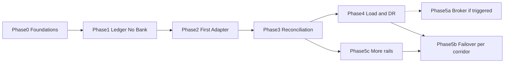

# PayGlobe Idempotent Ledger — Phased Implementation Plan
> - **Document Status**: Draft
> - **Last Updated**: 2026 Aug 29
> - **Author**: Paul Serban

Each phase has an **Objective**, **Deliverables**, and an **Exit Gate** that must pass before the next phase begins. Phases 0–4 are sequential. Phase 5 is conditional in its broker/scale pieces and sequential in its "more rails / failover policy" pieces.

The order is load-bearing: **Phase 1 does not call a bank.** If Phase 1 is skipped ("we will reserve and execute in the same PR"), the trap is back — you cannot prove accept-vs-dispatch isolation if they never existed as separate systems. **Phase 2 is one or two rails, not 35.** If Phase 2 is "all partners," classification will be wrong and you will duplicate on a rail you did not understand.

Calendar honesty: Phase 0–3 for *core + first rail + recon* is a serious team's **multiple quarters**, not a sprint. Phase 4–5 (DR, 20k TPS proof, many rails, failover) is **a year-plus** of platform and partnership work. Anyone dating "35 networks, 20k TPS, global HA" as a single release is staffing a slide.

## Phase 0 — Foundations

**Objective**: Freeze the contract, the books, and the SLA rewrite before anyone writes an accept handler that calls a bank "just for now."

**Deliverables**:
- Written SLA split signed by product: accept p99 target vs settlement SLO per first-rail. The sentence "sub-100ms end-to-end paid" is either withdrawn or scoped to a named, testable path that does not include a bank. [Trade-offs §3](./05_tradeoffs_and_honest_assessment.md#3-what-i-would-ask-for-even-though-i-expect-friction).
- Idempotency key: header name, uniqueness `(principal_id, idempotency_key)`, payload canonicalization rules, `409` on fingerprint mismatch. SDK retry policy drafted (same key on 503 and on accept timeout).
- Chart of accounts sketch signed by finance: reserve, suspense, clearing, fees, FX, reversal. Revenue recognition not on `201`.
- Rail questionnaire for **candidate Phase 2 rails only** (not all 35): status API, idempotency field, webhook, statement identity, timeout, 5xx-means-paid or not. If a candidate cannot answer, default classification is `unknown` — recorded.
- Schema review against [System Design — Data Model](./03_system_design.md#1-data-model). Unique constraint is in the schema, not "we will add it later."
- Shard key policy: `principal_id`, owning region, what happens on mis-route. DR fencing owner named.
- Retention/PII policy for attempt payloads.

**Exit Gate**:
- [ ] Product signed: `201` is accepted-not-settled; 100ms does not include bank confirm.
- [ ] Finance signed COA sketch.
- [ ] Idempotency contract written; missing key is 400.
- [ ] At least one Phase 2 rail has a filled classification questionnaire (even if answers are "no status API").
- [ ] Unique `(principal_id, idempotency_key)` is a hard schema requirement; handler will not call adapters.
- [ ] DR dual-primary is explicitly a **non-goal**; fencing is a written requirement for any later promote.

**Honesty gate:** if product refuses to ship without a bank reference on the first response, stop and run the sync-wait exception as a **separate** route document — or stop the project. Do not "compromise" by putting execute on the default accept path.

## Phase 1 — Minimal Safe Ledger (No Bank Calls)

**Objective**: Prove that the edge can reserve, dedup, conflict-check, and journal — and that duplicates are harmless — **without** outbound payouts. Intents accumulate as `Reserved` and stay there. That is success for this phase, not an incomplete feature.

**Deliverables**:
- Accept API: validate, hash, insert intent + reserve journal + balances + outbox in one transaction; unique violation → return existing; hash mismatch → `409`; DB error → `503`; `201` only after commit.
- `GET` intent by id (primary read).
- Structured logs: `intent_id`, status code, unique-violation vs insert. No full account numbers in default logs.
- Tests (not production money): concurrent duplicate POST; conflicting payload; crash between commit and response (replay); induced DB failure → 5xx and zero committed intents.
- Trial-balance job on the shard: sum of journal vs `account_balances` = 0 discrepancies.

**Exit Gate**:
- [ ] Two concurrent requests with the same key produce one intent row and one reserve entry pair.
- [ ] Replay with same payload returns the same `intent_id` and does not append a second reserve.
- [ ] Replay with different payload is `409` and does not pay (there is no pay yet) and does not mutate the existing intent.
- [ ] Induced commit failure yields 5xx and no row; retry with same key then succeeds once.
- [ ] No code path in the accept service opens a TCP connection to a bank (review / dependency check).
- [ ] Trial balance holds after the test suite.

**Honesty gate:** if commercial refuses to expose an accept-only API even in sandbox, they are asking to skip to Phase 2 under schedule pressure. The compromise is a sandbox flag that still uses the state machine with a **fake adapter that can timeout** — not a real rail — to keep the door closed. A real rail in Phase 1 is a failed gate.

## Phase 2 — First Adapter(s), Outcome Classification, No Blind Retry

**Objective**: Dispatch from `Reserved` to one (max two) real rails. Prove timeout-after-send becomes `unknown` and **does not** execute twice. Prove success posts the journal and failure reverses it.

**Deliverables**:
- Orchestrator claim, `lock_epoch`, persist `provider_request_id` before send.
- Adapter for rail A (and optionally B if they are the duplicate-loss rails). Classification table implemented as data, not as `if status >= 500: retry`.
- Circuit breaker for **new** dispatches.
- Same `provider_request_id` on transport retry after `failed_retryable_not_sent` only.
- Simulated and, where legal, sandbox chaos: kill response after send; adapter process death mid-call; duplicate outbox delivery; two workers racing the claim.
- Client sandbox SDK that retries accept with the **same** key.

**Exit Gate**:
- [ ] Happy path: `Reserved` → `Settled`, journal posted, balances match.
- [ ] Terminal reject: reserve reversed, `Failed`, no second execute.
- [ ] Chaos: timeout after send → `Unknown`, **execute attempt count remains 1** until a test double *classifies* not-executed; only then a second execute with the **same** request id is allowed.
- [ ] Chaos: worker kill after provider 200 and before journal post → recovery **posts**, does not send a second execute (status query or idempotent success from provider, or replay of recorded success — not a new money instruction).
- [ ] Unique-violation storm at accept still does not increase execute count above 1 per intent.
- [ ] Accept handler still does not call the adapter (regression).

If the first rail's sandbox cannot simulate "executed but HTTP timeout," **still** fail the gate unless a test double does. Production will.

## Phase 3 — Reconciliation and Manual Review

**Objective**: Make `unknown` a boring, automatic path most of the time — and a paged path when it is not. Cover rails with status API **and** statement-only rails if the Phase 2 rail is statement-only (otherwise the first statement-only rail is a later Phase 5 corridor launch with this phase's machinery reused).

**Deliverables**:
- Status poller keyed by `provider_request_id`.
- Webhook inbox for the rail (verify, durable accept, **apply via orchestrator transitions**, not a second writer). Duplicate webhooks harmless.
- Statement ingest and match: exact id first; fuzzy match only into **ops queue**, not auto-`Settled`, until false-positive rate is measured.
- Manual review UI or runbook: evidence, allowed transitions (to Settled / Failed / retry-allowed), actor recorded on the journal.
- Alerts: age of oldest `Unknown`, `Unknown` count, unmatched statement lines, DLQ/review depth.
- Chaos: handler down (accept 503) then replay same key; execute unknown then status API says paid; statement shows a debit with no intent (unexpected money) pages.

**Exit Gate**:
- [ ] After `201`, execute unknown, status API confirms paid → `Settled`, one execute attempt, trial balance holds — **without** a human SQL patch.
- [ ] After unknown, status API confirms not found → retry execute **same** request id, at most one additional execute, or `Failed` if policy says stop.
- [ ] Unknown older than the signed SLO pages in a drill.
- [ ] Unexpected statement debit pages in a drill.
- [ ] Webhook duplicate does not double-post the journal.

If the rail has no list/status/statement at all, this phase's automatic gate is blocked. The honest fallback: **every** execute-timeout goes to manual review, volume cap on that rail, and a written residual loss/ops-cost window. Do not pretend a DLQ of unknowns is recovery.

## Phase 4 — Observability, Accept-Path Load, Multi-Region DR (Read/Promote), Not Dual-Write

**Objective**: Know whether the *ledger* holds at the load you actually have (toward 20k TPS if that number is real), and prove regional DR without minting a second unique index.

**Deliverables**:
- Metrics from [System Design — Observability](./03_system_design.md#10-observability-minimum).
- Load test: mix of unique keys (20k TPS *if* hardware/budget is authorized; otherwise the **measured** production peak plus a stated factor) **and** a retry storm of duplicate keys. p99 accept vs the Phase 0 SLA. Unique violations must not become 5xx and must not become extra executes (Phase 2 property under load).
- Hot-principal test: one `principal_id` at a large share of TPS; document p99 degradation; do not "fix" it by dropping the unique constraint.
- Asynchronous cross-region replica; **promote drill** with old primary fenced; prove no accept on the fenced node; prove no duplicate intent for keys reserved before failover.
- GET-from-replica lag dashboard so on-call does not confuse replica stale with lost payout.

**Exit Gate**:
- [ ] Under retry storm, execute count per distinct key stays 1 (or 1+only after classified not-sent) at the tested rate.
- [ ] Accept p99 meets the **signed** Phase 0 number at the tested TPS, or the SLA is revised in writing (not silently dropped).
- [ ] Promote drill: zero dual-primary window in the runbook execution; fencing tested, not documented-only.
- [ ] Trial balance job still green during and after load.

**Honesty:** if 20k TPS accept p99 100ms fails on one shard, the answer is more shards / principal splits / faster storage, not "put Redis in front of the unique constraint." A load test that only sends unique keys and never duplicates has not tested the incident that cost millions.

## Phase 5 — Conditional Scale-Out, Multi-Region DR Hardening, Failover Policy, and More Rails

**Objective**: Add a broker, automatic corridor failover, and the rest of the 35 networks **only** under gates — not because the original prompt listed them.

### 5a. Dedicated broker / CDC outbox (conditional)

**Entry Gate (any one of):**
- [ ] Outbox polling or `SKIP LOCKED` wait is a measurable fraction of dispatch lag at **normal** load (not only storms).
- [ ] Oldest `Reserved` age exceeds settlement SLO while workers are scaled out and the DB graph shows queue-query contention (not under-provisioned workers or a closed rail).
- [ ] CDC already wanted for audit warehouse; piggy-backing dispatch is cheaper than a second poller.

**Deliverables**: broker as delivery; outbox/intent still source of truth; at-least-once consumers; runbook for broker down: accept still commits outbox, or accept **503**s — never `201` with no durable dispatch record.

**Exit Gate**: Phase 2/3 chaos tests still pass; broker-down does not silently drop reserved intents.

This sub-phase can be deferred indefinitely. [ADR-007](./04_architecture_decision_records.md#adr-007).

### 5b. Automatic failover (per corridor, default off)

**Entry Gate (all of):**
- [ ] Corridor has two rails with filled questionnaires.
- [ ] Beneficiary schema mapped; FX/fee policy signed (who pays the worse quote).
- [ ] Phase 2/3 proven on **both** rails independently.
- [ ] Chaos: unknown on rail A does **not** trigger rail B.

**Deliverables**: failover transition as in [System Design §6.4](./03_system_design.md#64-failover-mid-transaction-only-after-known-not-executed); new `provider_request_id`; journal reason; feature flag per corridor.

**Exit Gate**:
- [ ] Terminal failure on A, success on B: one customer debit per policy, one beneficiary credit.
- [ ] Timeout on A: B not called.
- [ ] Finance can explain the FX legs on a failed-over intent.

### 5c. Remaining rails (iterative, never a big-bang)

Each new rail is a **mini Phase 2+3**: questionnaire, adapter, classification fixtures, sandbox chaos, recon path, volume cap, then raise cap. There is no exit gate that says "35/35." There is a portfolio metric: % of volume on the new pipeline vs the old dual-pay path. The old path's kill date from Phase 0 is either hit or explicitly slipped with a loss-acceptance signature.

**Exit Gate (program, not a week):**
- [ ] Duplicate-payout incident rate on the new path is zero for retry/timeout class in a stated window (or each incident is a classification bug with a fixture added).
- [ ] Residual old path volume is scheduled to zero.

## Phase Dependency Graph

Phases 2–3 may be compressed in calendar time on a small team for **one** rail; they must not be collapsed into one deploy that first sees production money. Phase 1 should take sandbox traffic with real client retries before Phase 2 owns a live payout. Phase 5c can start additional rails after Phase 3's machinery exists, without waiting for 20k TPS proof — **volume caps** replace that proof until Phase 4 is done.

## What "done" is not

Done is not "we selected a globally distributed SQL product." Done is not "we have 35 adapter stubs." Done is: **a client can retry safely, a timeout cannot pay twice, the books balance, unknowns age into recon or humans, and the SLA on the tin matches the path in the code.** Until the old client-retry path is off, the program is not done — it is a second system next to the loss.
