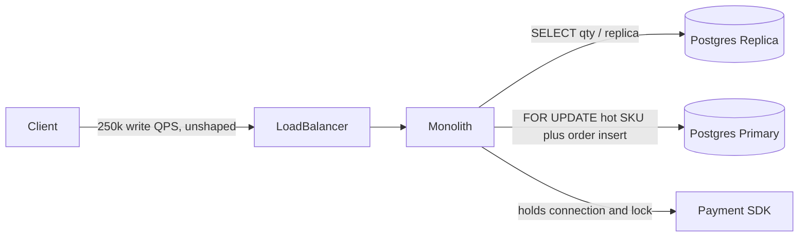
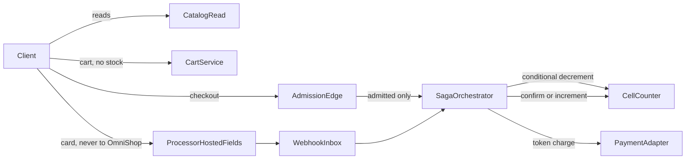
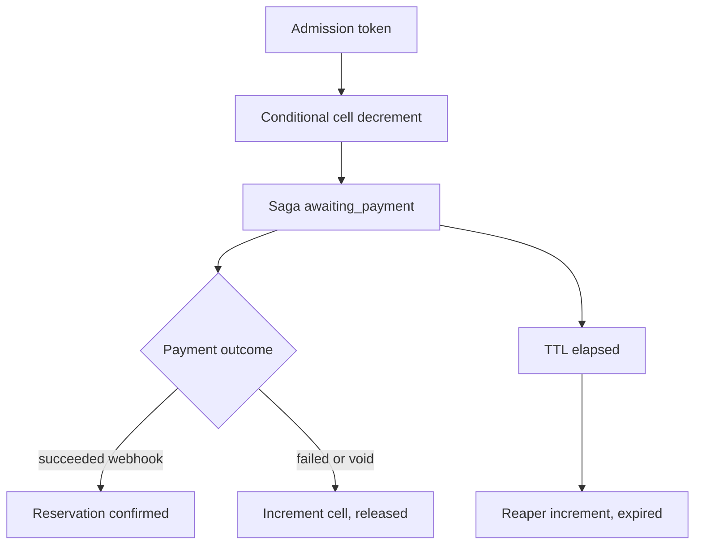

# Flash Sale Inventory Engine — Architecture Document
> - **Document Status**: Draft
> - **Last Updated**: 2026 Aug 29
> - **Author**: Paul Serban

A write-path redesign of flash-sale checkout: the spike is metered at the edge; availability reads are a stale cache that cannot sell; each hot SKU's stock is split into independently decremented cells; a sale is authorized only by an atomic conditional decrement with a TTL; payment is a saga step on a token, not a lock holder. This document covers *what* the system is and *why* it is shaped this way; see [System Design](./03_system_design.md) for *how* cells, reservations, and failover actually work, and [Trade-offs and Honest Assessment](./05_tradeoffs_and_honest_assessment.md) for what that paragraph costs.

## Overview

**Brief description**: Inventory and checkout infrastructure, scoped narrowly: survive a 50× write spike on a handful of SKUs without overselling, without putting payment on the reserve latency path, and without fail-open multi-region inventory. It is not an OMS, not a storefront platform, and not a payment company.

**Business Context**
- See [Scenario and Requirements](./01_scenario_and_requirements.md) for the full framing. In short: Postgres dies because the sale is a hot-key problem, not a dataset-size problem; replicas and SKU-sharding do not split one contended row; holding a connection across payment turns a processor blip into 504s and ghost inventory.
- Target users: checkout platform, SRE, PCI/compliance, finance/inventory ops. Product consumes "reserved / confirmed / released" and must accept that the product-page number is not the ledger.

## Requirements

### Functional Requirements

- **Admit**: offered load above a configured origin ceiling is queued or rejected at the edge. Inventory services see a shaped rate, not a stampede.
- **Read availability**: product pages and badges read a cache/CDN. They must not decrement, reserve, or confirm.
- **Reserve**: checkout (or an explicit hold step that *is* checkout) performs one atomic cell decrement, records a reservation + saga state, returns success or sold-out. Idempotent on client key.
- **Pay**: client talks to the processor's hosted fields; OmniShop receives a token; OmniShop requests authorization/capture against the token; confirmation arrives asynchronously (webhook) and is applied idempotently.
- **Confirm or compensate**: payment success binds the reservation to a confirmed order; failure, expiry, or timeout re-increments the cell.
- **Reconcile**: cell sums, reservations, confirmed orders, and warehouse receipts have a planned comparison path. Drift is an incident, not a surprise.
- **Survive region loss (cart)**: cart remains readable/writable in surviving regions under eventual consistency.
- **Survive region loss (inventory)**: SKUs whose home region is gone do not sell. Fail closed.

### Non-Functional Requirements

**Performance Requirements:**
- Availability read p99 < 30 ms (edge cache hit is the intended p99 path; origin read model is the miss path).
- Reserve write p99 < 100 ms (admission already passed + authn + cell conditional write + saga persist). Payment is excluded; see [Latency budget](#latency-budget).
- Admission must keep admitted reserve QPS within the cell store's per-item and table budgets with headroom. 250,000 QPS is the *offered* spike, not a promise that every request reaches DynamoDB.

**Reliability Requirements:**
- **Zero oversell** on the write path. Tested, not monitored-after-the-fact as the primary control.
- **Reservation expiry releases stock.** A crashed checkout is not a permanent decrement.
- **Payment webhooks are at-least-once.** Apply is idempotent. See [ADR-005](./04_architecture_decision_records.md#adr-005) and the existing [payment webhook ingestion](../../prj--payment-webhook-ingestion/README.md) project — do not invent a second inbox design.
- **Inventory single-writer per SKU home region.** A second writer during failover is a bug, not a HA feature. [ADR-007](./04_architecture_decision_records.md#adr-007).

**Infrastructure Constraints:**
- Global users; more than one cloud region is assumed. Exact cloud vendor is not the architecture; a quorum-consistent, low-latency item store with conditional updates is. DynamoDB is the working default because conditional `UpdateItem`, per-item throughput with partitioning, and multi-AZ durable writes are native. Redis Cluster is the rejected default for *authoritative* stock unless someone is prepared to own persistence, failover, and split-brain. [ADR-003](./04_architecture_decision_records.md#adr-003).
- Postgres remains for orders, customers, catalog-of-record, and finance. It leaves the *hot decrement* path.
- The existing monolith is strangler-migrated for this path only. A full microservices estate is not a prerequisite for Phase 1.

**The defining constraint:**
- One SKU row cannot absorb 250k QPS at WAL/lock speed. No pool size changes that. The architecture is: **stop making one row the serialization point, and stop letting anything but an atomic decrement sell.**

## Executive Summary

The scarce resource on the old path was **the lock on a hot tuple**, plus the **connection held for the duration of whatever the monolith did next (often payment)**. The new path consumes lock-free conditional writes spread across K cells, in a store whose per-item latency is measured in single-digit milliseconds, and consumes those writes only for admitted checkouts.

**Architecture Style:** CQRS for catalog/availability; sharded-counter write model for finite stock; reservation + choreography/orchestration saga for payment; multi-region AP for cart, CP for inventory.

**Key Components:**
- **Admission / Edge**: waiting room or token-bucket + hard ceiling on `/checkout` and reserve APIs; WAF; bot filter. Highest leverage. [ADR-001](./04_architecture_decision_records.md#adr-001).
- **Catalog Read Service**: CDN + Redis (or equivalent) availability projection; CDC from cells/reservations; never authoritative for sale.
- **Inventory Cell Counter Service**: K cells per SKU; conditional decrement/increment; home region pin.
- **Reservation / Saga Orchestrator**: idempotent reserve, TTL, confirm, release; state machine for the order attempt.
- **Cart Service**: active-active, conflict-tolerant, no inventory side effects.
- **Payment Gateway Adapter**: token in, processor API out; no PAN. Webhook inbox as in the sibling project.
- **Reaper**: expires reservations, re-increments cells, is the difference between "TTL exists in a comment" and "stock returns."
- **Reconciliation**: batch compare cell sums vs confirmed vs warehouse; not on the customer path.

**Technology Stack (working defaults, not a shopping list):**
- Edge: CDN + waiting-room product or equivalent (Cloudflare Waiting Room / custom token bucket at the API gateway).
- Read: CDN, Redis Cluster for availability keys, Postgres for catalog content.
- Write: DynamoDB (or equivalent) for cells + reservation records; Postgres for durable order/saga projection and finance.
- Payment: Level-1 processor hosted fields + webhooks.
- Cart: multi-region KV or DynamoDB global tables (cart only).

**Architecture Principles:**
- **The page cannot sell.** If a cache hit completes a purchase, the design has failed.
- **One atomic operation authorizes a unit.** Conditional write `qty >= n`, then `qty = qty - n`. No read-then-write in the application.
- **Shape the spike before you scale the store.** Scaling DynamoDB to 250k un-admitted QPS is how you pay for bots and retries.
- **Payment is not in the reserve p99.** If it is, you missed the requirement.
- **Fail closed on inventory, fail open on cart.** Different data, different CAP pick. [ADR-007](./04_architecture_decision_records.md#adr-007).
- **Postgres is a system of record for orders, not a lock manager for SKUs.**

**Key Architectural Decisions:**
1. **Edge admission control is mandatory.** [ADR-001](./04_architecture_decision_records.md#adr-001).
2. **CQRS: stale reads, authoritative writes.** [ADR-002](./04_architecture_decision_records.md#adr-002).
3. **Cell-sharded counters in a conditional-write store, not Postgres and not Redis-as-source-of-truth.** [ADR-003](./04_architecture_decision_records.md#adr-003).
4. **Two-phase reservation with TTL; add-to-cart is a no-op for stock.** [ADR-004](./04_architecture_decision_records.md#adr-004).
5. **Saga, not 2PC.** [ADR-005](./04_architecture_decision_records.md#adr-005).
6. **Tokenized payments; no in-house vault.** [ADR-006](./04_architecture_decision_records.md#adr-006).
7. **Cart AP, inventory CP, inventory home-region pin.** [ADR-007](./04_architecture_decision_records.md#adr-007).

### Context Diagram — current path (the anti-pattern)

Every arrow into the primary on the hot SKU is a queue. The payment arrow is how that queue becomes a site outage. The replica arrow is how the page oversells.

### Context Diagram — target path

Reads never touch cells on the customer path. Unadmitted checkout never touches cells. Card bytes never touch OmniShop. The cell store is the only seller.

## Runtime Architecture

1. **Admission layer** (edge, microseconds to a redirect/wait): if the sale is live and origin reserve QPS is at ceiling, the user waits or is 429'd. Tokens proving admission are short-lived and bound to the sale. [ADR-001](./04_architecture_decision_records.md#adr-001).
2. **Read layer** (CDN/Redis, <30 ms p99): catalog + projected `available_approx = sum(cells) - reserved_open` with lag. Badge is marketing. [ADR-002](./04_architecture_decision_records.md#adr-002).
3. **Cart layer** (multi-region KV): add/remove lines. No cell calls.
4. **Reserve layer** (orchestrator + cells, <100 ms p99): authenticate, idempotency key, pick cell, conditional decrement, persist reservation `held` and saga `awaiting_payment`. Bounded retry on other cells. [ADR-003](./04_architecture_decision_records.md#adr-003), [ADR-004](./04_architecture_decision_records.md#adr-004).
5. **Pay layer** (client → processor; OmniShop token API): not in the 100 ms budget. 3DS can be minutes of user time; reservation TTL must cover it or product must re-reserve after 3DS. [ADR-006](./04_architecture_decision_records.md#adr-006).
6. **Confirm layer** (async): webhook inbox → apply `payment_succeeded` → reservation `confirmed` (no increment). Failure/expiry → `released` + increment. [ADR-005](./04_architecture_decision_records.md#adr-005).
7. **Reaper layer**: scan `held` past TTL, increment, mark `expired`. Must be safe under duplicate reaper and duplicate webhook.
8. **CDC / projection**: cell and reservation changes update the read model. Lag is accepted.
9. **Reconciliation layer** (batch): not customer-facing.

### Reserve → pay → confirm/compensate

**Invariant:** `confirmed` units + `held` units + remaining cell qty = seeded allocatable qty ± documented adjustments (receipts, damages). Oversell is this invariant breaking. The read cache is not in the equation.

## Components

### 1. Admission / Edge
**Purpose**: Make 250,000 offered QPS into a number the write path can meet the p99 for.

**Responsibilities:**
- Waiting room or equivalent queue-based leveling for sale-scoped paths.
- Hard rate limit per SKU / per sale / global reserve QPS as defense in depth.
- Bot and credential-stuffing controls (otherwise the waiting room is a bot room).
- Issue a short-lived admission token that the orchestrator verifies. Unauthenticated stampede on the origin is a failed admission layer.

**Interactions:**
- Does not call cells. If the waiting room implementation "pre-reserves," it has become the inventory system and must obey zero-oversell. Do not do that. Wait, then reserve.

### 2. Catalog Read Service
**Purpose**: Fast, stale availability and catalog content.

**Responsibilities:**
- Serve product HTML/JSON from CDN; `available_approx` from Redis.
- Subscribe to CDC/projections; do not query cells on the page path.
- Explicitly *cannot* call decrement.

**Interactions:**
- Reads: cache, origin catalog Postgres.
- Writes: none to inventory.

### 3. Inventory Cell Counter Service
**Purpose**: Be the only component that can change allocatable stock of a finite SKU.

**Responsibilities:**
- Store K cells: `sku_id, cell_id, qty, version, home_region`.
- Conditional decrement/increment with occupancy checks.
- Seed and rebalance (ops/OMS receipts).
- Refuse writes that are not in the SKU's home region (or proxy to home, but do not dual-write).

**Interactions:**
- Called by orchestrator and reaper and OMS adjustments.
- Emits changes for CDC.

### 4. Reservation / Saga Orchestrator
**Purpose**: Turn "user intends to buy" into a durable state machine whose side effect on stock is exactly one decrement and later either confirm or increment.

**Responsibilities:**
- Idempotent reserve by `(client_key | session, sku, qty, sale_id)`.
- Cell pick + bounded retry. See [System Design](./03_system_design.md).
- Persist reservation and saga state *durably* before returning success to the client (otherwise a crash after decrement and before persist is a leaked decrement — the reaper can only expire what it can see; leaked decrements need a cell/reservation reconciliation). Prefer a transactional write in the cell store for `{cell update, reservation item}` or a documented compensation if the store cannot do that in one commit. See [ADR-004](./04_architecture_decision_records.md#adr-004).
- Drive confirm/release from payment apply and from TTL.

**Interactions:**
- Cells, reservation store, order projection in Postgres, payment adapter, webhook apply.

### 5. Cart Service
**Purpose**: Remember lines across devices and regions. Not inventory.

**Responsibilities:**
- CRUD cart. Conflict resolution: union of lines or last-write-wins per line, documented. Duplicates in the cart after a partition are a UX bug, not an oversell.
- Replicate active-active.

**Interactions:**
- Must not call cells. A "reserve on add to cart" feature request is a kill criterion for this component's contract; it is [ADR-004](./04_architecture_decision_records.md#adr-004) revisited.

### 6. Payment Gateway Adapter
**Purpose**: Tokens in, processor API out, PAN never in.

**Responsibilities:**
- Create payment intents against the processor for a reservation id / amount / currency.
- Map processor states into saga events.
- Not a vault. Not a retry storm onto the processor without idempotency keys (processor-side idempotency key = reservation id).

**Interactions:**
- Processor network from a small, controlled egress (still not CDE if no PAN). Webhook inbox is a separate ingest path.

### 7. Webhook Inbox
**Purpose**: Same as [prj--payment-webhook-ingestion](../../prj--payment-webhook-ingestion/README.md): verify HMAC, persist raw event, 202, apply async, idempotent on provider `event_id`.

**Responsibilities:**
- Do not apply business state on the HTTP thread.
- On apply: transition saga; never decrement again; increment only on compensating events if still `held`.

### 8. Reaper
**Purpose**: Make TTL real.

**Responsibilities:**
- Find `held` where `expires_at < now`, increment the recorded cell by recorded qty, mark `expired`.
- Idempotent: a reservation already `confirmed` or `released` is a no-op. A double reaper increment is an oversell-in-reverse (phantom stock) and is as serious as oversell. Conditional increment tied to reservation status (or a single-item transaction: reservation status check + cell increment) is required.

### 9. Reconciliation
**Purpose**: Catch the bugs the invariant tests missed.

**Responsibilities:**
- Daily and post-sale: sum(cells) + sum(held) + sum(confirmed_unshipped) vs warehouse/OMS.
- Alert on drift above a threshold of 0 for sale SKUs during the event (0 is the target; a threshold exists because CDC lag is not drift).

### Communication Patterns

**Synchronous, customer-critical:**
- Client → edge → orchestrator → cells (reserve).
- Client → read path (cache).
- Client → cart.

**Synchronous, not in the 100 ms budget:**
- Orchestrator → processor (auth request) *after* reserve returns, or client-driven confirm. Prefer: return reserved, client completes payment with processor, webhook confirms. If product insists on server-side auth before "order placed" UX, it still happens *after* the cell decrement is committed and the HTTP reserve can already have returned.

**Asynchronous:**
- Processor → webhook inbox → apply.
- CDC → read model.
- Reaper, reconciliation.

## Latency Budget

Target: reserve p99 < 100 ms, payment excluded.

| Step | Budget (p99, indicative) | Notes |
| --- | --- | --- |
| Admission token verify | 5 ms | Local JWT/HMAC or edge-already-verified. |
| Authn (session) | 10 ms | Cache session; do not hit a slow IdP on this path. |
| Idempotency lookup | 10 ms | Same store as reservation. |
| Cell conditional write (1 hop) | 15–25 ms | DynamoDB in-region. |
| Extra cell retries (up to 3) | +15–25 ms each | Tail. Bound retries so p99 still holds for the *first* cell success path; p99 of sold-out-after-retries may miss 100 ms — that is acceptable if sold-out is rare and measured separately. |
| Persist reservation + saga | folded into cell transact or +15 ms | Must not be a cross-region write. |
| Response | remainder | |

If the sum of the happy path (no cell retry) does not fit in 100 ms in the home region, the design is already wrong — usually because someone put payment, fraud, or a cross-region hop on this path.

**Read p99 < 30 ms:** CDN hit. Redis get on miss of HTML but hit of `available_approx`. Origin origin-to-Postgres on the *page* during a sale is a failed read architecture.

## Scaling Strategy

**What the 15 million DAU does not size:** the cell table. DAU sizes the read fleet, cart, and admission. The sale sizes cells.

**Hot-key math (order of magnitude):** DynamoDB (and similar) publishes per-partition item limits far below 250k QPS on a *single* item. One cell is still a hot key. K cells are how 250k admitted QPS becomes ~250k/K per item, plus imbalance. If K=128 and one cell is 4× hotter, that cell sees ~8k QPS — still a number you must *measure against the vendor's current per-item ceiling*, not assume. If the ceiling is lower, raise K, improve scatter (see System Design), or lower the admission ceiling. Do not "add a Redis in front of the cell" as a second truth.

**Admission is the first scale knob.** Lower ceiling → waiting room grows → origin lives. That is a successful sale (angry queue) rather than an unsuccessful one (oversell + 504). Product must know.

**Read scale:** CDN. If Redis is the availability origin for uncached pages, size Redis for the sale's SKU set (tiny) plus the rest of catalog traffic. Do not put all catalog HTML in Redis as a side effect of this project.

**Cart scale:** independent. Global tables / CRDT-ish merge. Cannot take down checkout if you keep reserve off the cart store.

**Bottleneck Analysis:**
- Primary after redesign: **admission policy vs. conversion** (business), and **cell imbalance** (engineering).
- Secondary: reaper lag (stock hostage), webhook apply lag (paid but unconfirmed — user-visible; not oversell if decrement already happened).
- Tertiary: processor outage. Users reserved, cannot pay; TTL releases. Conversion dies; invariant holds. Do not fail-open inventory because the processor is down.

## Data Architecture

### Data Model (logical)

**Key Entities:**
- **SkuAllocation**: sku_id, total_allocatable, home_region, K, sale_id.
- **Cell**: sku_id, cell_id, qty, version.
- **Reservation**: id, sku_id, cell_id, qty, status (`held` | `confirmed` | `released` | `expired`), expires_at, idempotency_key, order_attempt_id.
- **Saga/OrderAttempt**: id, reservation_id, payment_ref, status.
- **CartItem**: cart_id, sku_id, qty, region-replicated.
- **InboxEvent**: as in webhook project.

**Entity Relationships:**
- One SKU has K cells. Sum of cell qty + held + confirmed-not-yet-removed-from-allocatable is conserved.
- One reservation points at exactly one cell (the cell that was decremented). Release increments *that* cell, not a random one (otherwise imbalance grows unbounded).
- Cart lines have no FK to cells.

### Data Lifecycle

**Create**: cells seeded before sale from OMS/warehouse number, not from the product-page CMS.
**Reserve**: decrement cell, insert reservation `held`.
**Confirm**: status `confirmed`; qty stays decremented; OMS notified.
**Release/expire**: increment same cell.
**Read model**: overwrite `available_approx`; no conservation required.

## Cost Analysis

### Cost Components

**Money:**
- DynamoDB on-demand or provisioned with sale-day capacity. A 2-hour sale at high QPS is a bill you can see. Provisioned with autoscaling still needs a pre-warm (on-demand is simpler; still not free). Pre-warming partitions is a real ops task if using provisioned.
- Waiting-room vendor or equivalent engineering.
- Processor fees: unchanged in kind; 3DS and auth-rate during a bot-heavy sale are a finance problem admission should reduce.
- Multi-region cart replication: continuous, not only on sale day.
- CDC and Redis: modest relative to the write store on sale day.

**Engineering time — the actual cost:**
- This is a **multi-quarter** program if starting from the monolith described: admission + read CQRS can be a quarter; cell service + saga + reaper + shadow reconciliation another; PCI tokenization may already be done or may be its own program (Phase 5). Treating this as a sprint is how you ship Redis `DECR` in front of Postgres and oversell.
- Chaos drills for region fail-closed are calendar time. Skipping them is how you discover dual-write in production.

**Risk cost of the cheap alternatives:**
- Replicas: oversell + a reassuring dashboard.
- Redis-only counters without a durability/failover story: fast oversell after a failover, or lost reservations.
- Decrement on add-to-cart: looks like it stops oversell, holds the entire sale's stock in abandoned carts, conversion dies, support tickets look like "sold out instantly."

### Cost Optimization

- Admission ceiling is the cheapest capacity plan.
- K sized from measurement, not from "256 feels distributed."
- Cold SKUs (not in the sale) can stay on Postgres decrement or a single cell. Do not cell-shard the entire catalog on day one. [Trade-offs](./05_tradeoffs_and_honest_assessment.md).
- Single PUT of capacity: pre-seed cells hours before the sale, not at T-0.

## Risks and Mitigation

| Risk | Likelihood | Impact | Mitigation Strategy | Owner |
| --- | --- | --- | --- | --- |
| Admission skipped because "the new store is fast enough" | High under schedule pressure | High (repeat of incident) | [ADR-001](./04_architecture_decision_records.md#adr-001); Phase 1 ships admission before cells | SRE + platform |
| Cell imbalance → false sold-out while other cells have qty | Medium | Medium | Bounded retry; jittered cell pick; rebalance job; see System Design | Cell service |
| Reservation persist fails after decrement | Medium | High (leaked stock) | TransactWrite of cell + reservation, or compensating increment with idempotency | Orchestrator |
| Reaper double-increments | Medium | High (phantom stock / later oversell) | Conditional on status `held` | Reaper |
| TTL too short vs 3DS | High | Medium (angry conversion) | Measure payment duration; TTL from p99 payment UX + margin; product sign-off | Product + checkout |
| TTL too long | Medium | Medium (hostage stock) | Cap; do not use "until warehouse close" | Product |
| Read cache treated as authorization by a new client | High | High | No decrement API on read service; authz on cell API | Platform |
| Dual-region writers on failover | Medium | Critical (oversell) | Fail closed; fence token / disable writes in old region; [ADR-007](./04_architecture_decision_records.md#adr-007) | SRE |
| PCI scope creeps back (log PAN, proxy hosted fields) | Medium | High | Token-only reviews; Phase 5 gate; log redaction tests | Compliance |
| Shadow mode never cut over | High | High (two truths forever) | Phase 3 time-box; kill criterion | Phased plan |
| 250k QPS load test never run with production-like K and SKU count | High | High | Exit gate is the test, not the diagram | SRE |
| Waiting room is a DDoS of bots | Medium | Medium | Bot management; admission is not a substitute for it | Security |

## Future Enhancements

### Phase 1 (current design's first ship)
**Focus**: Admission + read-path CQRS. See [Phased Implementation Plan](./06_phased_implementation_plan.md). Postgres may still be the writer.

### Phase 2
**Focus**: Cell service in shadow; reconcile against Postgres; not authoritative.

### Phase 3
**Focus**: Pilot SKU/sale cutover to cells as source of truth.

### Phase 4
**Focus**: Multi-region cart proven; inventory fail-closed drill.

### Phase 5
**Focus**: PCI tokenization if not already done; decommission card-on-monolith.

### Technical Debt (accepted)

- Cell K is static per sale without auto-rebalancing beyond a batch job. Live cell split during a sale is a new ADR.
- Fairness of the waiting room is not designed.
- OMS/warehouse is a partner system with its own lag; "zero oversell" is *allocatable e-commerce stock*, not physical shelf truth. Shrink and receiving errors remain warehouse problems.
- Postgres remains in the order path. It can still die; it must not take inventory down with it (different stores, different pools).
