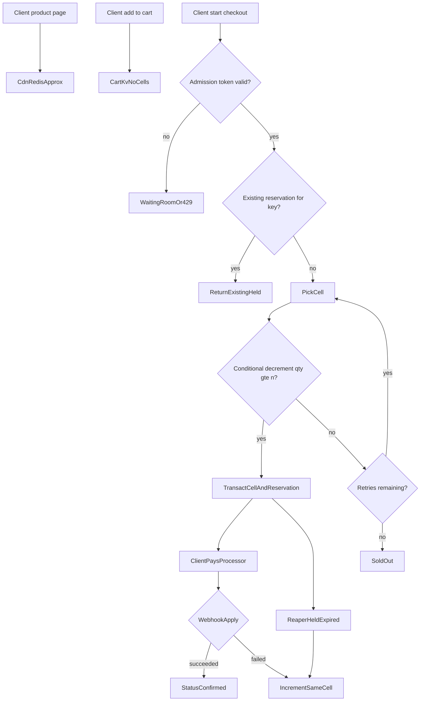
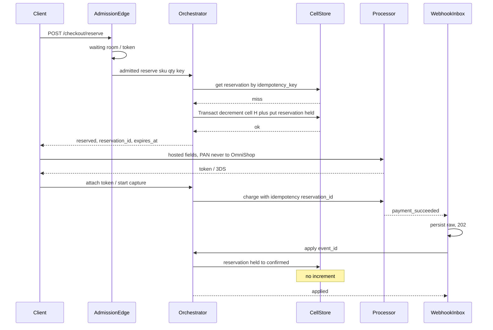
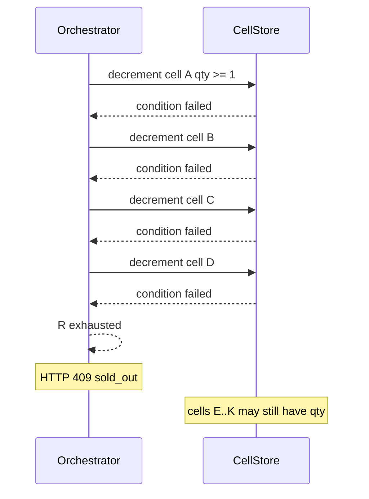
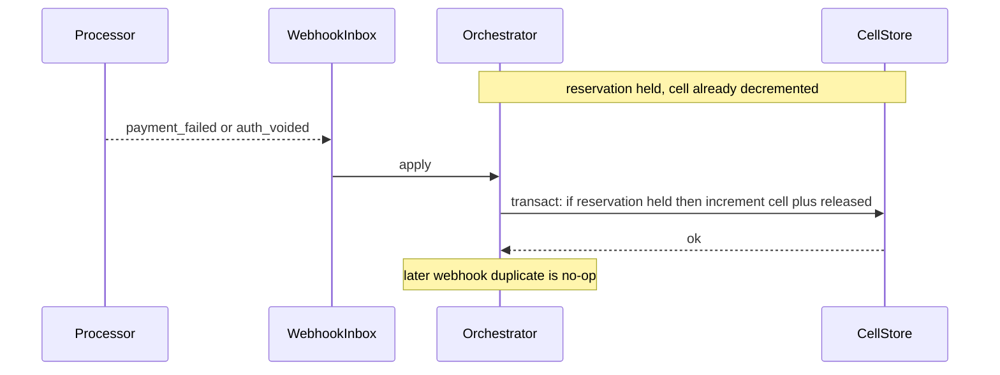
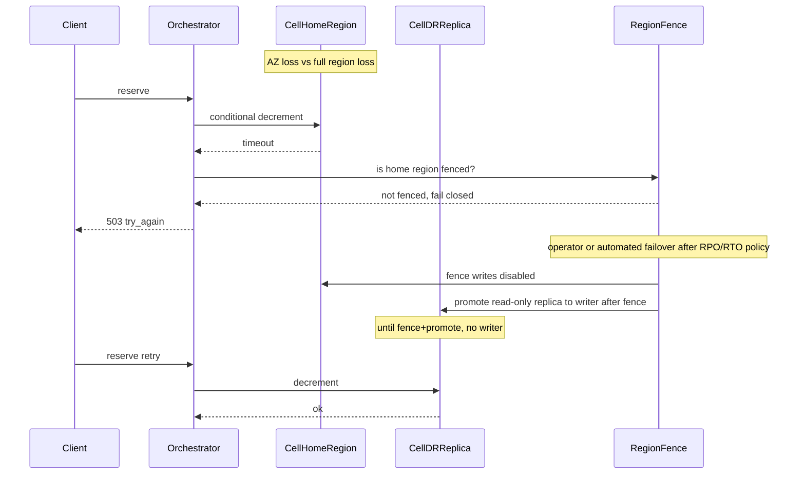

# Flash Sale Inventory Engine — System Design
> - **Document Status**: Draft
> - **Last Updated**: 2026 Aug 29
> - **Author**: Paul Serban

This document is the mechanical *how* for the system described in the [Architecture Document](./02_architecture_document.md). It specifies cell geometry, reservation TTL and reaper rules, the four control-flow sequences, the logical data model, PCI data-flow constraints, and observability. It does not specify code.

## 1. Control Flow

**Invariant:** The catalog read path has no edge to decrement. Add-to-cart has no edge to decrement. A sale exists only after a successful conditional decrement.

## 2. Cell Geometry and Pick Algorithm

### Why cells exist

A single item in a conditional-write store still has a per-key throughput ceiling. The sale's offered load, even after admission, can exceed that ceiling on a hero SKU. Cells split *one logical counter* into K independently updated items so that contention is divided. They do **not** split the *semantic* stock: oversell is prevented per cell by the condition `qty >= n`, and globally by conservation (sum of cells is the allocatable remainder).

### Choosing K

Working default: **K = 128** for a hero SKU; **K = 16–32** for secondary sale SKUs; **K = 1** for the long tail (Postgres or a single cell is enough).

Sizing rule, not a brand number:

1. Take the **admitted** peak reserve QPS for that SKU (after the waiting-room ceiling), not 250k unless admission is that open.
2. Divide by the store's **documented per-item/partition ceiling** with a safety factor of 2–4 (imbalance, retries, reaper increments, OMS adjustments).
3. Round to a power of two if the pick function is bitwise; this is convenience, not correctness.
4. If `total_qty < K`, some cells are zero. That is fine; retries skip empty cells. Do not set K > qty for tiny drops (50 units) — use K = min(K_default, qty) or even K = 1. Cell sharding a 50-unit drop is how you add false sold-out without adding throughput you need.

**Revisit during Phase 0 load test.** K is a parameter. Changing K between sales is expected. Changing K *during* a live sale requires a split/merge protocol not in v1 (would be a new ADR).

### Seeding

Before the sale:

- OMS gives `total_allocatable` (already net of safety stock if the business wants a buffer — that buffer is a business decision, not a hidden extra cell).
- Divide as evenly as possible: `base = floor(total / K)`, remainder `r` distributed to cells `0..r-1`.
- Persist `SkuAllocation` (K, home_region, sale_id, total).
- Cells are not created lazily on first checkout. Lazy create races the sale start.

### Pick function

**Default: `cell_id = hash(idempotency_key) mod K`**, with retries on **other cells in a deterministic permutation** of the remaining ids (e.g. `hash(key + attempt)` or a small jump hash) so that concurrent retries from one client do not all slam cell 0.

Do **not** pick `hash(sku_id)` — that is one cell.

Do **not** pick `random()` as the *first* cell without tying retries to the idempotency key: a retried HTTP reserve must hit the same reservation, not decrement a second cell. The idempotency lookup happens *before* pick (see flow). Only a *new* key picks a cell.

**Sticky cell after first successful decrement:** the reservation records `cell_id`. All increments go there.

### Conditional decrement

Pseudomechanics (not SQL):

- Update cell where `sku_id, cell_id` and `qty >= n` set `qty = qty - n`, increment version.
- If condition fails: treat as miss, retry another cell, up to **R = 3** additional cells (4 tries total).
- If all fail: return sold out even if `sum(other cells)` might be > 0. This is **false sold-out**. It is the central engineering trade-off of cell sharding. Mitigation: raise R (hurts p99), raise K only if per-cell QPS needs it (does not fix leftover-in-other-cells at the end of the sale), run a **rebalance** that moves qty from fat cells to empty ones *between* bursts (not every request). Near sale end, a **gather** step can collapse remaining qty onto fewer cells — optional, operational, not on the customer path. See [Trade-offs](./05_tradeoffs_and_honest_assessment.md).

**n > 1** (multi-qty line): decrement `n` on one cell, do not split one line across cells in v1 (partial decrement + second cell is a distributed transaction). If `n` is larger than any one cell, false sold-out is more likely. Product constraint: flash-sale line qty is typically 1. If carts allow qty 10 of a 50-unit drop, document that those may fail while 10 singles would succeed. That is accepted in v1.

### Increment (release / expire / OMS return)

- Conditional: reservation still `held` (or a dedicated `release_token` consumed once).
- Increment the **recorded** `cell_id` by `qty`.
- Do not pick a new cell to increment "for balance" on the customer path; rebalance is a batch job.

### Rebalance (ops, not request path)

Periodic or post-burst: if `max(cell.qty) - min(cell.qty)` exceeds a threshold and the sale is still live, move units from fat to thin cells with two conditional updates in a transaction, or via a reserved "mover" reservation so conservation holds if the job crashes. If you cannot transact two cells, **do not rebalance live**. Wait for the sale to end.

## 3. Sequences

### 3.1 Happy-path checkout (admitted, first cell has stock, payment succeeds)

Reserve HTTP returns **before** processor capture. Payment is not in the 100 ms budget.

### 3.2 Sold-out with retry across cells (false sold-out possible)

**What the system must not do:** read `SUM(qty)` and then decrement (race). **What product must accept:** a sold-out at the tail of the sale while a few units sit in untried cells. A background gather can reduce this; it will not hit 0 false sold-out without trying more cells (latency) or gathering to K=1 (hot key again). Near the end of a 500-unit drop, **gathering remaining stock to K=1** is a valid ops play: throughput is no longer the problem; leftover is. That play is scheduled, not automatic in v1.

### 3.3 Payment failure → compensation

**Timeout:** processor never answers. Reservation stays `held` until TTL. Reaper releases. A late `payment_succeeded` after `expired` **must not** confirm. Apply logic: if not `held`, **do not confirm**; trigger refund/void with the processor using `reservation_id` as the reference. This is the expensive correctness case (captured money, no stock). It is rarer than oversell-from-fail-open and must still be designed. Finance runbook: refund the late capture.

### 3.4 Regional failover of a SKU's home region (fail closed)

**Rules:**

1. **Multi-AZ loss in one region** is the store vendor's problem (DynamoDB sync replication across AZs). That is *not* this failover sequence. Do not run a dual-region writer for AZ loss.
2. **Full region loss:** writes stop until a **fence** proves the old region cannot write (STS/DNS/disable endpoint, vendor regional failover APIs). Then promote. Split-brain = oversell. Automation that promotes *without* a fence is forbidden.
3. RTO for hero SKUs is a product number (e.g. 5–15 minutes of 503). It is not 0. Anyone asking for 0 is asking for active-active writers.
4. Cart is not in this diagram. Cart stays up in other regions.

## 4. Reservation TTL and Reaper

| Parameter | Working default | Bound |
| --- | --- | --- |
| `reservation_ttl` | 12 minutes | 8–15 minutes unless product signs a different p99 payment+3DS duration |
| Reaper cadence | 5–15 seconds | Faster is not more correct; correctness is the conditional expire |
| `expires_at` | `reserved_at + ttl` | Stored on the reservation item; not "now + ttl" at reaper time |

**Reaper algorithm:**

1. Query `held` where `expires_at <= now` (or a TTL store + queue of reservation ids). DynamoDB TTL *deletes* items; **do not use delete-TTL as the reaper**. Deleting the reservation without incrementing the cell is leaked stock. Application reaper (or a queue delay equal to TTL) is required. Vendor TTL may delete *after* you have incremented, as garbage collection of already-terminal items only.
2. For each id: `Transact`: `condition reservation.status == held AND expires_at <= now` → `status = expired`, `cell.qty += n`.
3. If condition fails (`confirmed` / `released` / already `expired`): skip.

**Clock:** `expires_at` is absolute. Reaper uses store time or NTP-synced clocks. A reaper running fast does not expire early if it respects `expires_at`.

**Payment longer than TTL:** user still on 3DS at minute 13. Reservation expired, stock back in cell, someone else bought it. Late success → refund. Product can extend TTL only with a written conversion vs hostage-stock trade-off. An "extend TTL while 3DS in progress" API is allowed if it is **bounded** (max one extension, still cap 15–20 min) and still fail-closed.

## 5. Data Model (Logical)

Not SQL. Grain and invariants only.

### sku_allocation

| Field | Role |
| --- | --- |
| sku_id | Identity. |
| sale_id | Sale isolation; cells are not reused across sales without a new seed. |
| K | Cell count. Immutable during sale in v1. |
| home_region | Writer pin. |
| total_seeded | For reconciliation. |

### cell

| Field | Role |
| --- | --- |
| sku_id, cell_id | PK. |
| qty | Remaining allocatable in this cell. `>= 0`. |
| version | Conditional write helper. |

**Invariants:**
- `qty >= 0` always. Decrement condition enforces it.
- No application read-modify-write.

### reservation

| Field | Role |
| --- | --- |
| id | Unguessable. |
| idempotency_key | Unique. Client/session + sku + sale + attempt semantics documented to the client. |
| sku_id, cell_id, qty | Where to increment. |
| status | `held` → `confirmed` \| `released` \| `expired`. Terminal states do not leave. |
| expires_at | Reaper bound. |
| order_attempt_id | Saga correlation. |

**Invariants:**
- Unique `idempotency_key`. Duplicate reserve returns the existing row.
- `confirmed` never increments.
- `expired` and `released` both increment exactly once (status is the lock).

### saga / order_attempt

| Field | Role |
| --- | --- |
| id | PK. |
| reservation_id | FK. |
| payment_ref | Processor reference / token id (not PAN). |
| status | `awaiting_payment` → `paid` \| `failed` \| `refunded_late`. |

Postgres may own this projection for finance. The reservation item in the cell store is the stock truth. Dual-write of saga state: if Postgres insert fails after reservation `held`, the user can retry with the same idempotency key and receive the same reservation. Postgres is eventually filled by a repair job if needed. **Do not** make Postgres commit part of the decrement transaction (that is 2PC). [ADR-005](./04_architecture_decision_records.md#adr-005).

### cart_item

| Field | Role |
| --- | --- |
| cart_id, sku_id | Line. |
| qty | Desired, not reserved. |
| updated_at | LWW or merge. |

**Invariants:**
- No cell_id.
- Merge after partition may duplicate qty; checkout still has to reserve. User may see 2 lines; they cannot buy 2 without 2 successful decrements.

### inbox_event

Identical in role to [payment webhook ingestion system design](../../prj--payment-webhook-ingestion/_docs/03_system_design.md): raw payload, `event_id` unique, apply state. Apply handler is the only new piece: it calls reservation confirm/release.

## 6. Security Mechanics (PCI and otherwise)

### What never touches OmniShop systems

- PAN, CVV, full track data, and anything a PCI assessor would call account data.
- Client loads processor hosted fields / SDK from the processor origin. OmniShop page contains an iframe or equivalent. OmniShop JS receives a **token** (or payment-method id).
- App hosts, logs, APM, dumps, and support HAR files are in-scope for *token* leakage, not PAN, if this is true. A single debug log of a processor raw response that includes PAN is a scope incident.

### What OmniShop does handle

- Amount, currency, `reservation_id`, customer id, token/reference, billing address if required (address can still affect SAQ; keep the CDE diagram honest — SAQ A vs A-EP depends on how hosted fields are implemented). This document does not certify a SAQ level; it requires a QSA to map the implemented client. The architecture constraint is: **no PAN on OmniShop servers.**
- Server-to-processor API calls authenticated with processor credentials, **idempotency key = reservation_id**.

### Cell API authorization

- Only the orchestrator role can decrement/increment. Product page role cannot.
- Admission token ≠ authorization to decrement without a logged-in shopper (or guest checkout policy). Bots with waiting-room tokens still must not skip payment. They can still hold stock for TTL — admission + bot control reduce this; they do not eliminate it. Short TTL is the bound on griefing.

### Idempotency keys as credentials

- A stolen idempotency key can replay the same reservation (safe) or, if unused, create a reservation for the thief if the authz is only the key. Bind key to `user_id` / session server-side.

## 7. Error Handling

| Failure | Where | What the system does | What it must not do |
| --- | --- | --- | --- |
| No admission token | Edge | Wait / 429 | Forward to cells |
| Idempotency hit `held` | Orch | Return same reservation | Decrement again |
| All cell retries fail | Cells | 409 sold_out | SUM-then-write; steal from another SKU |
| Transact decrement+put fails mid-way | Store | Vendor transact aborts both | Orphan decrement |
| Processor 5xx | Adapter | Leave `held`; retry charge with same idempotency key | Decrement again; confirm |
| Webhook duplicate | Inbox | 202, one apply | Second confirm |
| Late success after expire | Apply | Refund/void; no confirm | Re-decrement without a new reserve UX |
| Home region timeout, not fenced | Orch | 503 | Write the DR replica |
| Reaper vs confirm race | Store | Transact conditions; one winner | Two increments or confirm+increment |
| Read cache says 5 left, reserve sold_out | Read vs write | Correct | Trust cache and skip reserve |
| Old Postgres decrement path still live | Monolith | Phase 3 drain | Dual decrement |

Postgres timeouts and `504` from pool exhaustion are **not** on the new reserve path. If they appear on reserve, the decrement is still in Postgres.

## 8. Observability (Minimum)

If on-call only has monolith 504 rates, the new system will fail opaquely ("sold out but warehouse has 40"). Minimum:

- **Admission:** offered QPS, admitted QPS, waiting-room depth, 429 rate.
- **Cells:** per-SKU per-cell QPS, conditional-failure rate, p99 latency, `qty` heatmap (imbalance).
- **Reserve:** success, sold_out, 503 home-region, idempotency hits, p99 (payment excluded).
- **Reservations:** count by status; age of `held`; expire rate; confirm rate.
- **Invariant check (during sale):** `sum(cell.qty) + sum(held.qty) + sum(confirmed.qty)` vs `total_seeded` (± adjustments). Alert at ≠.
- **Webhook:** inbox depth, apply lag, late-success-after-expire count (finance).
- **PCI:** alerts on log patterns that look like PAN (existing DLP); this is hygiene, not the vault.
- **Do not** log tokens in full if the processor treats them as replayable; treat like credentials.

## 9. What stays on Postgres (and what does not)

Still on Postgres: orders for finance, catalog content, customers, post-sale OMS integration, webhook inbox if you follow the sibling project's table-as-inbox (that inbox is not the hot SKU).

Not on Postgres: the hot decrement. `SELECT … FOR UPDATE` on inventory qty is **not** in this design. If it appears in an incident on the new path, the old path is still in production.
