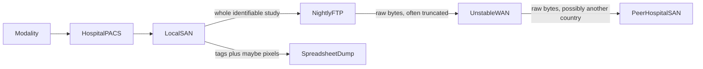
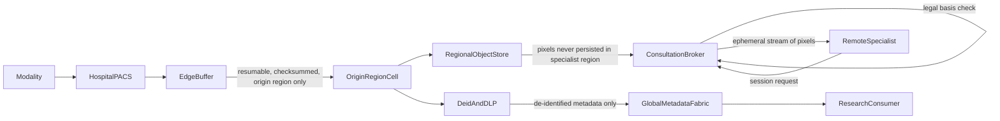
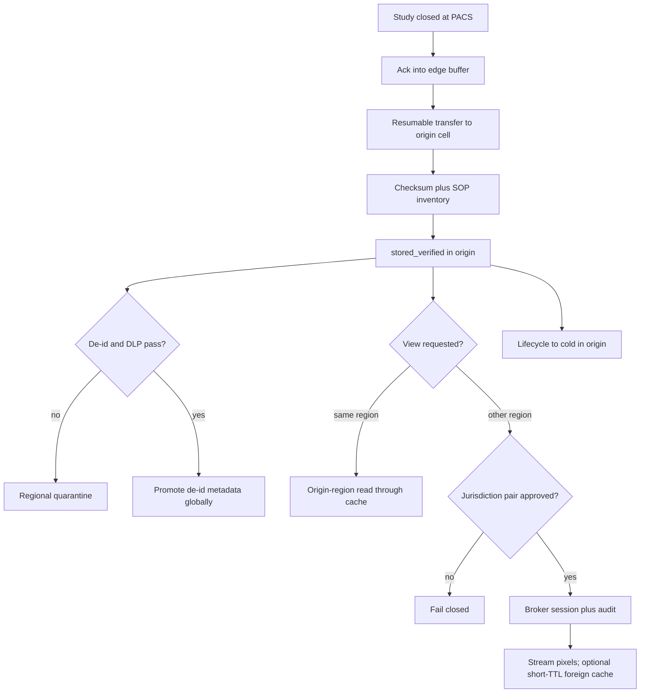

# Healthcare DICOM Regional Sync — Architecture Document
> - **Document Status**: Draft
> - **Last Updated**: 2026 Aug 29
> - **Author**: Paul Serban

A residency-first imaging fabric: raw PHI and DICOM pixel data stay in the region they were created in; de-identified clinical metadata is the only dataset that replicates globally; a specialist in another country sees pixels through an ephemeral, audited stream, not through a second copy. This document covers *what* the system is and *why* it is shaped this way; see [System Design](./03_system_design.md) for *how* ingest, de-identification, consultation, cache, and archival actually work, and [Trade-offs and Honest Assessment](./05_tradeoffs_and_honest_assessment.md) for what that one sentence costs.

## Overview

**Brief description**: Multi-region imaging infrastructure, scoped narrowly: place identifiable studies, promote only what is de-identified, stream what must be seen across a border, archive what is cold. It is not a PACS, not a diagnostic AI platform, and not a global CDN for DICOM.

**Business Context**
- See [Scenario and Requirements](./01_scenario_and_requirements.md) for the full framing. In short: 150 hospitals, 100 MB–4 GB studies, nightly FTP over unstable 1 Gbps WAN, SAN storage, HIPAA + GDPR + stricter national health-data laws. Consultation is late or unlawful. Research aggregation is a spreadsheet. Archival is a capacity panic.
- Target users: hospital imaging IT, treating/remote specialist, DPO/legal, research consumer, platform SRE.

## Requirements

### Functional Requirements

- **Ingest**: accept a closed DICOM study from a hospital site into a durable local buffer, transfer it to the origin region's object store with resume and verification, and refuse to mark the study complete without a matching checksum and SOP Instance manifest.
- **Place**: persist raw instances only in the origin region, under a region-local CMK. There is no replication rule for raw objects.
- **De-identify**: in the origin region, apply a defined DICOM de-identification profile and a DLP gate. Fail closed into a regional quarantine for human review.
- **Promote**: copy only records that passed the gate into a global metadata fabric usable for research queries. No reversible join key leaves the region.
- **Consult**: given a written legal basis for a jurisdiction pair, issue a short-lived viewing session that streams pixels from the origin region. Do not create a durable copy in the requesting region as part of this path (the Phase 4 short-TTL cache is a separate, constrained exception — [ADR-006](./04_architecture_decision_records.md#adr-006)).
- **Cache**: accelerate origin-region reads with a normal regional cache. Accelerate repeat cross-border views with a TTL-bound, encrypted, purgeable cache that is not a replica.
- **Archive**: migrate origin objects through hot → warm → cold per policy. Rehydrate on demand inside the origin region.
- **Audit**: record every cross-border session (who, what, when, basis) in the origin region with identifiers; emit a de-identified audit summary globally if operations need a fleet-wide view.

### Non-Functional Requirements

**Performance Requirements:**
- Origin-region open of a hot study must be in the same order of magnitude as today's PACS LAN retrieval. This design does not try to beat a local SAN on first fetch of a cold 4 GB volume; it tries not to be worse than "the file is in the region."
- Cross-border first open of an uncached 4 GB study is bounded by origin egress and the requesting site's WAN, not by architecture theater. A working planning number: **minutes**, not sub-second, not "CDN pop." Repeat opens inside cache TTL should be fast. Product copy must say this.
- Control-plane calls (register study, request session, legal-basis check) are small and must not scale with study size.
- Ingest throughput is per-hospital WAN, not a global pipe. Backlog is a first-class metric.

**Reliability Requirements:**
- **A WAN drop does not lose a study and does not require restarting from byte 0.**
- **A failed de-id or DLP check does not promote.** Quarantine is success of the gate, not failure of the pipeline.
- **A consultation broker crash must not leave identifiable objects on its disk in a foreign region.** Transit memory / ephemeral volume only; process death is a session abort, not a leak.
- **Legal basis lapse fails closed.** Yesterday's approval is not today's session.

**Infrastructure Constraints:**
- Hospitals keep their PACS. This system sits beside C-STORE / existing export, as a destination the PACS already knows how to send to, or as a pull from a vendor-neutral archive. We do not rip out 150 PACS.
- One object-store API per region (S3-compatible working assumption). Cross-region replication features of that store are **disabled** for the raw prefix. Using the vendor's "replicate for durability" across regions is how the design dies in procurement.
- Per-region KMS / CMK. Keys do not replicate to a global keyring that can decrypt raw objects from another country.
- 1 Gbps class WAN to many sites is a given. The architecture absorbs it with buffers and resume; it does not assume a dedicated imaging backbone.

**The defining constraint:**
- **Residency is a placement invariant, not a latency SLO.** Every feature that would be easier with a replica (global CDN, "warm the specialist's region overnight," research copies of pixels in a US bucket) is refused unless it can be done with de-identified data or with an ephemeral view. The specialist's wait is the price. Paying it in the open is the design. Pretending it is free is the trap.

## Executive Summary

The system is a set of **regional data-residency cells** plus a **global de-identified metadata fabric** plus a **cross-region consultation broker**. The scarce resources on the old path were nightly window, WAN luck, and SAN capacity. The new path consumes buffer disk and WAN in proportion to *bytes that must move once into the origin cell*, and consumes cross-border bandwidth only when a human with a legal basis actually looks.

**Architecture Style:** Region-pinned system of record for identifiable imaging; event-promoted global read model for de-identified metadata; capability-based ephemeral access for cross-border pixels. Not a multi-master imaging mesh. Not a data lake with a residency sticker.

**Key Components:**
- **Hospital Edge Ingestion Buffer**: durable store-and-forward on-site, off the clinical SAN if at all possible.
- **Regional DICOM Object Store**: origin-only raw prefix; KMS-CMK; versioning/WORM-ish retention as required by local medical-record law.
- **Ingest Control Plane**: manifests, checksums, resume, completion verification.
- **De-identification & DLP Pipeline**: origin-region only; quarantine; promotion gate.
- **Global Metadata Fabric**: de-identified study/series/instance index for research and for "does this study exist" without holding pixels.
- **Cross-Region Consultation Broker**: legal-basis check, short-TTL session, audited stream.
- **Regional Edge Cache**: long-lived in origin; short-TTL in foreign regions.
- **Lifecycle / Archival Manager**: per-region tiering and rehydration.
- **Regional Audit Log**: identifier-bearing; never replicated raw.

**Technology Stack (indicative, not a shopping list):**
- Object storage + per-region CMK.
- Transfer: multipart, checksummed, resumable protocol (storage-native multipart or an equivalent; **not FTP**).
- Queue/bus inside a region for de-id jobs; a *metadata-only* bus across regions.
- DICOM toolkit in the de-id workers (tag profile + pixel inspection where feasible).
- Existing PACS as the acquisition front-end.

**Architecture Principles:**
- **Raw bytes are regional. Metadata that passed the gate is global. Views are sessions.** Mixing those three is how you get a replica.
- **Verify completion; do not trust the sender's "done."** Same lesson as direct-to-storage upload; the sender here is a hospital buffer.
- **Fail closed on de-id, DLP, and legal basis.** Open is how research and consultation become the second EHR.
- **Cache is not a store.** If a foreign cache needs a lifecycle policy measured in months, it is a replica and the design has failed.
- **FTP is not tuned; it is removed**, after the new ingest path is proven for that site.

**Key Architectural Decisions:**
1. **Regional residency cells; no bulk replication of raw imaging.** [ADR-001](./04_architecture_decision_records.md#adr-001).
2. **Cross-region consultation by ephemeral audited streaming, not copy.** [ADR-002](./04_architecture_decision_records.md#adr-002).
3. **De-identification + DLP as a hard promotion barrier, residual pixel risk accepted and contained.** [ADR-003](./04_architecture_decision_records.md#adr-003).
4. **Durable edge buffer + resumable checksummed transfer replacing nightly FTP.** [ADR-004](./04_architecture_decision_records.md#adr-004).
5. **Tiered archival with a stated rehydration SLA, not always-hot.** [ADR-005](./04_architecture_decision_records.md#adr-005).
6. **Region-scoped, TTL-bound edge cache; foreign cache must not become a replica.** [ADR-006](./04_architecture_decision_records.md#adr-006).

### Context Diagram — current path (the anti-pattern)

Every arrow labeled as raw bytes is both a reliability failure and, when it crosses a border, a residency failure. Success in the FTP log is not integrity and is not lawfulness.

### Context Diagram — target path

Raw pixels travel to the specialist only as a stream under a session. The global fabric never receives them. The origin store never replicates them.

## Runtime Architecture

1. **Capture / buffer layer** (hospital site): PACS C-STOREs (or equivalent export) into the edge buffer. Buffer acknowledges locally so the modality/PACS is not waiting on the WAN. Buffer holds until the origin cell verifies.
2. **Ingest layer** (WAN → origin cell): resumable multipart transfer of instances plus a manifest. Control plane tracks offsets, checksums, SOP Instance UIDs. Completion is a verify step, not a TCP close.
3. **Place layer** (origin store): objects written under region CMK, inventory updated, study marked `stored_verified`.
4. **De-id layer** (origin, async): workers read instances, apply profile, run DLP on tags and (where in scope) pixels. Outcomes: `promotable`, `quarantined`. Re-id keys stay here.
5. **Promote layer**: de-identified metadata records published to the global fabric. Pixel data for research, if ever allowed, is a **separate** approved environment still inside the origin region or a legally designated research region — not a side effect of promotion. v1 promotion is metadata-only.
6. **Consult layer** (on demand): specialist's IdP authn → authorization including clinical relationship or break-glass → legal-basis matrix for the jurisdiction pair → session token → broker streams from origin. Audit row written in origin. Session TTL enforced.
7. **Cache layer**: origin cache populated on clinical reads; foreign cache populated only from an authorized session, encrypted, TTL short, purge job mandatory.
8. **Lifecycle layer**: origin objects age to warm/cold; rehydrate in origin only. Foreign cache is never archived; it is deleted.

Once raw objects no longer FTP between hospitals, **nightly batch window and FTP exit codes stop being the imaging architecture**. They remain a legacy drain item until each site is cut over.

### Happy path vs cross-border view

## Components

### 1. Hospital Edge Ingestion Buffer
**Purpose**: Be the durable store-and-forward so the clinical SAN and the PACS are not the WAN's retry buffer.

**Responsibilities:**
- Accept DICOM from PACS (C-STORE SCP or a filesystem watch the hospital already uses).
- Persist until origin verify succeeds; ack locally.
- Hold a manifest: Study/Series/SOP Instance UIDs, sizes, checksums.
- Retry transfer with resume; never mark local purge until origin says `stored_verified` (or a documented dead-letter after human review).
- Expose buffer occupancy. A full buffer is a clinical incident at *that hospital*, paged, not a silent skip.

**Interactions:**
- In: PACS/modality traffic.
- Out: ingest control plane + origin store.
- Must not be in another region. A "cloud buffer" in a foreign region is PHI export.

**Honest constraint:** Many hospitals will not give you a second array. The buffer may share spindles with PACS. Capacity planning is then a Phase 0 site survey, not a footnote. If the buffer is the SAN, you have improved resume and verification but not contention. Say so in the site runbook.

### 2. Ingest Control Plane
**Purpose**: Replace FTP's exit code with a protocol that can answer "is this study complete and bit-identical."

**Responsibilities:**
- Register a transfer session per study (or per series, if studies are enormous and closed incrementally — default is per closed study).
- Issue upload credentials or multipart URLs **only to the origin region's store**.
- Track part/offset completion; allow resume.
- On client "done": verify size, checksum (or per-instance hashes), SOP UID set vs manifest. Mismatch → not complete; buffer retries or quarantines the transfer (distinct from de-id quarantine).
- Enforce origin pinning: a hospital site identity maps to exactly one region; a credential that could write another region's raw prefix must not exist.

**Interactions:**
- Hospital buffer, origin store, regional inventory DB.

### 3. Regional DICOM Object Store
**Purpose**: Be the system of record for identifiable instances in this legal region.

**Responsibilities:**
- Store objects under a raw prefix; encryption with a CMK that lives in this region.
- Block public access; block cross-region replication on this prefix (account-level SCP / org policy, not a hopeful bucket setting).
- Retention: medical-record retention is local law (years, sometimes decades). Object lock / WORM where the law requires immutability. This is not "S3 default."
- Separate prefixes: `raw/`, `quarantine/`, `deid-artifacts/` (if de-id produces derived objects that might still be sensitive — treat derived identifiable pixel data as `raw/`).

**Interactions:**
- Written by ingest; read by de-id workers, origin viewers, consultation broker, lifecycle manager.
- Never written by a foreign-region worker.

### 4. De-identification & DLP Pipeline
**Purpose**: Be the only door into the global metadata fabric.

**Responsibilities:**
- Apply a versioned DICOM de-id profile (which tags are stripped, hashed, date-shifted, kept). Profile version is stored on the promoted record so research can know what they have.
- DLP: regex/dictionary on text tags; checks for PatientName, PatientID, accession in unexpected tags; **best-effort** burned-in annotation detection on pixel data for modalities/classes in scope.
- Emit `promotable` metadata (and optionally de-identified pixel objects **only if** a research program exists *and* they remain in a legally allowed store — v1 default: **metadata only**).
- Quarantine failures for human Health Information Management / privacy review. Do not auto-retry promotion on the same bytes without a profile or reviewer change.
- Keep re-identification material region-local.

**Interactions:**
- Reads `raw/` in origin. Writes quarantine and promotion events. Must not publish on DLP "low confidence, ship anyway."

**Honest constraint:** Burned-in PII detection is not a proof. A missed overlay is a residual risk. The mitigation is: do not promote pixel data globally in v1; sample quarantines; treat DLP as a gate for metadata, not as a cryptographic guarantee. See [ADR-003](./04_architecture_decision_records.md#adr-003).

### 5. Global Metadata Fabric
**Purpose**: Let research (and "find this study" without pixels) query clinical facts that are lawful to aggregate.

**Responsibilities:**
- Store de-identified study/series/instance records: modality, body part, study date (possibly shifted), technical parameters, origin **region** (not hospital name if that is identifying in a small cell — Phase 0 legal call), de-id profile version, promotion time.
- Serve query APIs to approved research projects.
- Hold a pointer: `origin_region` + `opaque_study_key` so a lawful consult can be *requested*, not so a researcher can fetch pixels.
- Replicate this fabric across regions for availability. It contains no raw PHI *by construction of the gate*, not by hope.

**Interactions:**
- In: promotion events from each cell.
- Out: research query, consult "resolve this key to a region" (the broker still must pass legal basis; knowing the region is not permission to stream).

### 6. Cross-Region Consultation Broker
**Purpose**: Turn "a specialist in region B needs to see a study in region A" into a session, not a sync.

**Responsibilities:**
- Authenticate the specialist (existing IdP; this document does not invent one).
- Authorize: clinical relationship, role, or break-glass.
- Check **jurisdiction-pair legal basis** (data structure: origin jurisdiction, viewer jurisdiction, basis type, expiry, policy version). Fail closed on miss or expiry.
- Issue a short-TTL streaming session bound to a study (or series), a viewer identity, and a set of allowed actions (view, not download, not print-to-file — as far as the viewer client can be constrained; **a determined user can screenshot**. Technical controls are not a complete prohibition on disclosure; they are a reduction plus audit. Say this in the security review).
- Proxy or sign an origin-region streaming path. Prefer origin-signed byte-range GETs through a broker that does not spool to disk. If a proxy must terminate TLS, use tmpfs / encrypted ephemeral disk with guaranteed wipe on session end, and test that wipe.
- Write the audit record **in the origin region**.
- End the session: revoke token, stop stream, trigger foreign-cache TTL (do not rely on TTL alone if the user clicked "end").

**Interactions:**
- Legal-basis store (global, because it is policy, not PHI — but it is sensitive operationally).
- Origin store (read).
- Viewer client.
- Must not have IAM to `PutObject` on a foreign raw prefix. A broker that can write raw objects in the specialist's region is a replica factory.

### 7. Regional Edge Cache
**Purpose**: Make repeated reads cheap without violating placement.

**Responsibilities:**
- **Origin cache**: read-through for physicians in-region; TTL can be long; still encrypted; still access-logged. This is a performance cache of data that is *allowed* to live here.
- **Foreign cache**: populated only as a side effect of an authorized session; encrypted with a key that is not the origin CMK copy; TTL short (working range: minutes to a few hours, not days); max size cap so it cannot silently hold a hospital's worth of studies; purge API and scheduled sweeper; **audit of cache hits as views**.
- Prove emptiness: an ops drill that, after TTL, a forensic pass finds no study bytes.

**Interactions:**
- Origin viewers, broker, lifecycle (origin cache may be invalidated on archive). Foreign cache must die when session ends or TTL hits, whichever first.

### 8. Lifecycle / Archival Manager
**Purpose**: Put cold origin bytes on cheap media without inventing a second, forgotten copy in another region.

**Responsibilities:**
- Policy: age, modality, legal hold, "this patient is in active treatment" flags from EHR if available.
- Transition hot → warm → cold **in origin only**.
- Rehydrate into origin hot/warm on request; track SLA (start, done, breach).
- Legal hold stops transition.
- Never lifecycle-migrate raw objects to a cheaper *region*. Cheaper *storage class* in the same region only.

**Interactions:**
- Origin store, inventory, perhaps EHR encounter status (best-effort; do not block v1 on a perfect ADT feed).

### 9. Regional Audit Log
**Purpose**: Answer the regulator.

**Responsibilities:**
- Append-only (as far as the platform allows) records of ingest verify, quarantine decisions, promotions (metadata only), every view (local and via broker), break-glass, cache purge exceptions, rehydration.
- Identifier-bearing logs stay in region. A redacted operational feed may leave for central SRE (session id, region, latency, error class — not PatientName).
- Retention of audit is also law; it may exceed imaging retention. Plan the volume.

### Communication Patterns

**Synchronous (small):**
- Buffer ↔ ingest control plane: register, complete, status.
- Viewer ↔ broker: request session.
- Broker ↔ legal-basis store; broker ↔ origin authz.

**Synchronous (large, pinned):**
- Buffer ↔ origin store: resumable instance upload.
- Origin viewer / broker ↔ origin store: byte-range reads.

**Asynchronous:**
- stored_verified → de-id queue.
- de-id pass → metadata promotion.
- Clock: lifecycle, cache purge, buffer occupancy alerts, legal-basis expiry.

**Forbidden:**
- Origin store → foreign store replication of `raw/`.
- De-id workers in region B reading `raw/` in region A "because the GPU cluster is there."
- Foreign cache warming jobs that pull studies nobody has requested.

## Scaling Strategy

**Current Scale Requirements:**
- 150 hospitals, a handful of legal regions (not 150). Studies 100 MB–4 GB. Daily volume is site-specific; a large tertiary CT/MR shop is a different WAN problem than a clinic ultrasound site. Phase 0 measures bytes/day per site rather than assuming a uniform 150× average.

**What scales with hospitals, not with regions:**
- Edge buffers, site WAN, on-site support. This is the long tail of the project. The cell pattern is copy-paste; the 150th hospital is still a truck roll and a firewall change.

**What scales with regions:**
- A full cell: store, KMS, de-id workers, audit, lifecycle, ingest control plane. Adding a country is a cell, a legal opinion, and a pair-matrix update — not a new shard of a global bucket.

**What does not scale, and must not be "fixed" by replication:**
- Cross-border consult bandwidth. If consult volume explodes, the honest levers are: longer foreign-cache TTL *within legal sign-off*, more origin egress, prefetch **on explicit request** (still a session), or putting specialists *in* the origin region (people move, data does not). Prefetch-all-into-every-region is rejected.

**Bottleneck Analysis:**
- Primary: **site WAN into the origin cell** for ingest. Buffer absorbs bursts; it cannot absorb a structural deficit (hospital produces 8 TB/day on a 1 Gbps contended link). That site needs a network program, not a new object store.
- Secondary: **de-id compute**, especially if pixel OCR/burn-in detection is on. Metadata-only promotion is cheaper; turning on pixel inspection is a GPU/CPU bill and a backlog.
- Tertiary: **origin egress** during a mass consult event (disaster, tele-radiology night coverage). The broker will concentrate load on the origin region's NIC. Pre-positioning replicas is still refused; bursting origin egress and session queues is the lever.
- Not a bottleneck to "solve" with architecture: first-open latency of a 4 GB cold study across an ocean. That number is physics plus storage-class. Document it.

## Data Architecture

### Data Model

**Key Entities (see System Design for fields):**
- **Site → Jurisdiction → Region** mapping. The most important table in the system. Wrong row = wrong country.
- **StudyInventory** (regional): Study Instance UID, origin site, storage keys, verification status, lifecycle state, de-id status.
- **InstanceObject** (regional): SOP Instance UID, checksum, size, storage class.
- **DeidRecord / QuarantineItem** (regional).
- **GlobalStudyMetadata** (global): opaque key, origin region, de-identified clinical tags, profile version.
- **LegalBasisPair**: origin jurisdiction, viewer jurisdiction, basis, expiry.
- **ConsultSession**: ids, actors, times, basis citation; **full row in origin**; pointer/id in global ops if needed.
- **CacheEntry**: region, key, expiry, session id that populated it.

**Entity residency:**

| Entity | Where it may live | May replicate globally? |
| --- | --- | --- |
| Raw instance bytes | Origin region only | No |
| Re-identification keys | Origin region only | No |
| Identifier-bearing audit | Origin region only | No |
| Edge buffer contents | Origin hospital / origin region | No |
| De-identified metadata | Global fabric | Yes |
| Legal-basis matrix | Global (policy) | Yes |
| Consult session token | Anywhere as a capability; short TTL | N/A (not a store) |
| Foreign cache bytes | Requesting region, TTL-bound | No (must die) |

### Data Lifecycle

**Create**: instances at modality → buffer → origin store. Metadata at promotion. Sessions at consult request.

**Read**: origin clinical read; broker stream; research query on metadata.

**Update**: lifecycle class; de-id status; legal-basis expiry. Raw bytes are immutable (new instance = new SOP Instance UID, per DICOM).

**Delete**: only under local medical-record and GDPR-erasure rules, which **conflict**. Erasure vs. retention is a legal workflow per jurisdiction, not a `DeleteObject` in a job. The architecture provides a hold/erase request type that does not execute until legal says which statute wins for that record. Do not "implement GDPR delete" as a global sweep of imaging. That is how you lose a malpractice record or how you refuse a lawful erasure — both are incidents.

## Cost Analysis

### Cost Components

**Money:**
- **N regional cells**: storage (hot + archive), KMS, de-id compute, NAT/egress, audit storage. N is number of legal regions, not 150. Still the dominant bill vs. one global bucket.
- **Ingest transfer**: bytes still move once from hospital to origin cell. You were already paying WAN; you are now paying it with resume instead of with repeats of the same 4 GB. Repeats were hidden cost.
- **Consult egress**: billed when someone actually looks across a border. This is the correct cost function. A replica mesh bills even when nobody looks.
- **Archive storage class**: the actual saver at year 3–7 of retention. Rehydration requests have a retrieval fee and an SLA; budget both.
- **DLP/pixel inspection**: can exceed object storage in compute if turned up naively. Metadata-tag DLP is cheap; video-like OCR on every slice of every CT is not. Scope it.

**Engineering time — the actual cost:**
- Legal mapping and pair matrix: calendar time, not sprint points. Phase 0.
- DICOM de-id profile for *this* installed base: weeks of sampling, not a vendor PDF.
- 150 site buffers: the unglamorous majority of calendar time.
- Broker + viewer constraints + audit evidence pack for a regulator: a product, not a proxy sidecar.
- Cache purge proof and key management: easy to skip, fatal in an audit.

**Risk cost of the rejected design (global replication):**
- Regulatory fine and forced shutdown of cross-border reading. Larger than any egress bill. The architecture is expensive because the alternative is forbidden, not because object storage is pricey.

### Cost Optimization

- Metadata-only global promotion in v1 (no global pixels).
- Foreign cache short TTL so you are not storing a shadow fleet of CTs in every country "for speed."
- Archive aggressively in origin with a hold flag for active patients.
- Do not run de-id pixel OCR on every ultrasound if the risk profile does not justify it; say which classes are in the OCR set.
- Do not build 150 cells. Build ~regions, plus 150 **buffers**.

## Risks and Mitigation

| Risk | Likelihood | Impact | Mitigation Strategy | Owner |
| --- | --- | --- | --- | --- |
| Current FTP already exports PHI across borders | High until Phase 0 says otherwise | Critical | Data map first; stop unlawful jobs as a legal action, not as a tech milestone | Legal + imaging IT |
| DLP misses burned-in PII or private tags; metadata (or worse, pixels) leak to global fabric | High if pixel OCR off; medium even if on | Critical | Fail closed; metadata-only v1; seeded-PII suite; sample; do not promote pixels globally | Privacy + owning engineer |
| Consultation broker spools identifiable files to disk in a foreign region | Medium | Critical | No PutObject IAM; ephemeral storage only; chaos test of process kill + disk audit | Security + SRE |
| Foreign cache becomes a de facto replica (TTL crept to 30 days, warming jobs added) | High without gates | Critical | TTL cap in policy; no warming without a session; purge drills; treat TTL creep as a kill criterion | [ADR-006](./04_architecture_decision_records.md#adr-006) |
| Site buffer fills; modalities block or PACS backup fails | Medium | High | Occupancy paging; site capacity survey; do not onboard the next hospital | Site IT + SRE |
| WAN structurally too small for site's production volume | Medium | High | Network program; this architecture cannot invent bandwidth | Hospital network + exec sponsor |
| Legal cannot approve a jurisdiction pair | Medium | High for that pair; expected | Pair stays on manual export; do not "temporarily" stream | Legal |
| Legal basis expires and sessions still run | Medium | Critical | Check expiry at session start *and* on a ticker during long views; cut stream | Broker |
| Break-glass abused as default tele-radiology | High if the normal path is slow | High | Distinct UX, mandatory reason, post-hoc review queue, metrics on glass rate | Clinical ops + compliance |
| Rehydration SLA missed on a cold stroke workup | Medium | High | Active-care hold; do not archive last-N-days; emergency runbook; do not hide a foreign hot copy | Lifecycle + clinical ops |
| Screenshot / download of streamed pixels | High | Medium (residual) | Disable download in viewer; watermark; audit; accept residual; this is not solvable in architecture | Security + product |
| GDPR erasure vs medical retention conflict | High in EU | High | Per-jurisdiction legal workflow; no global delete job | Legal |
| 150-site rollout never finishes; dual FTP+new path forever | High | High | Per-site gates; time-box FTP drain; exec sponsor | Phased plan |
| "Just enable CRR on the bucket for DR" from cloud team | High | Critical | Org SCP denying CRR on raw prefix; DR is *in-region* multi-AZ / second site in same jurisdiction | Platform + security |
| De-id profile version drift; research cannot interpret dates | Medium | Medium | Version on every promoted record; do not silently change date-shift | Research + pipeline |
| Specialist UX backlash: "it used to be a copy on my PACS" | High | Medium | Honest wait UX; origin-region staffing; do not cave into replication | Product |

## Future Enhancements

### Phase 0–1 (current design's first cuts)
**Focus**: Legal map, PII audit, one-region zero-loss ingest. See [Phased Implementation Plan](./06_phased_implementation_plan.md).

### Phase 2
**Focus**: De-id gate and global metadata for the pilot region.

### Phase 3
**Focus**: Broker for **approved pairs only**.

### Phase 4–5
**Focus**: Cache discipline, then archival.

### Phase 6
**Focus**: Repeat the cell; kill FTP per site.

### Technical Debt (accepted)

- Pixel-level de-id is best-effort. A future dedicated pixel-redaction product may join; v1 does not wait for it to promote metadata.
- Viewer screenshot residual. Watermarking is a later control, not a reason to delay the broker.
- EHR-driven "active encounter" holds for archival may be manual at first.
- In-region DR (second AZ / second building in the same jurisdiction) is required for a real hospital and is **not designed in detail here**. It is a cell-internal concern. Cross-region DR of raw PHI is out.
- A full research clean room with de-identified *pixels* is a later program. v1 metadata fabric is not that clean room.
