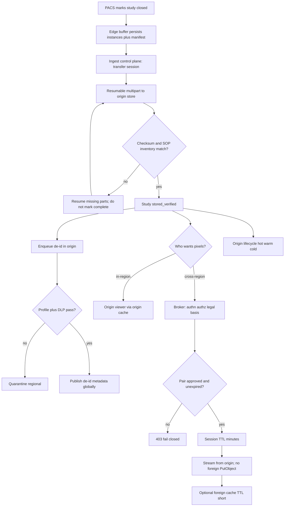
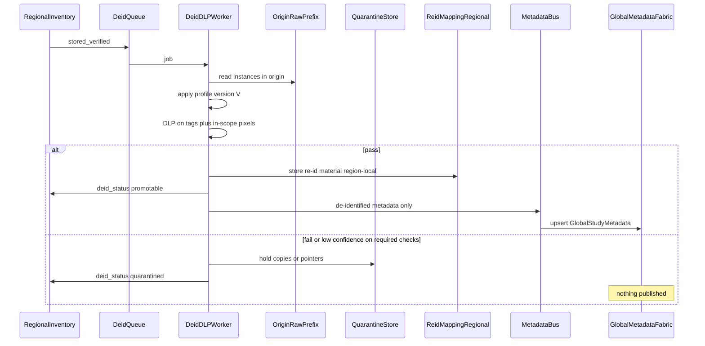
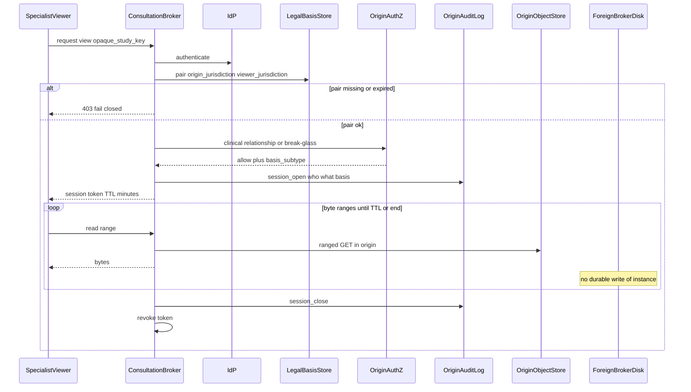
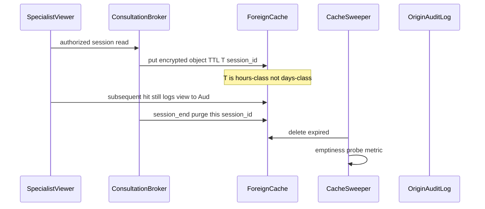
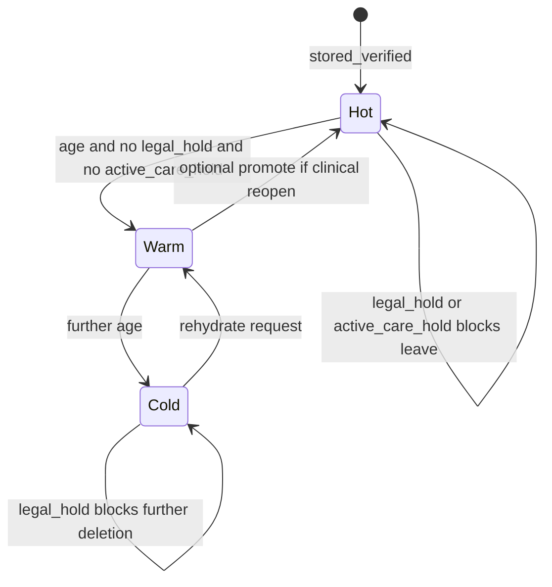

# Healthcare DICOM Regional Sync — System Design
> - **Document Status**: Draft
> - **Last Updated**: 2026 Aug 29
> - **Author**: Paul Serban

This document is the mechanical *how* for the system described in the [Architecture Document](./02_architecture_document.md). It specifies ingest verification, de-identification promotion, consultation sessions, cache classes, archival states, and which records may never leave a region. It does not specify code.

## 1. Control Flow

One origin cell per legal region. Hospitals map onto exactly one cell. The global fabric and the broker are the only cross-region control planes, and neither is allowed to persist raw instances.



**Invariant:** No worker, cache warmer, or "DR job" in region B has `PutObject` / `ReplicateObject` on region A's `raw/` prefix. If that IAM exists, the design has failed.

**Study closure:** Default unit of transfer is a **closed study** (Study Instance UID with a completion signal from PACS or a configured quiet period). Transferring a study still being acquired is how you verify the wrong manifest. If a site cannot signal closure, Phase 0 records that and uses a quiet-period heuristic — a worse clock, named as such.

## 2. Ingestion Geometry

### Buffer

- Durable local store. Target: disk that is not the only copy of the clinical PACS volume. Reality: see Architecture — may be the same SAN.
- Manifest written **before** WAN transfer starts: list of SOP Instance UIDs, series UIDs, uncompressed sizes, per-instance checksum (SHA-256 working default; storage checksums if the store exposes them — do not skip the application manifest even then).
- Local ack to PACS on buffer persist, not on origin verify. PACS must not block a CT scanner on Dublin↔Frankfurt packet loss.
- Purge from buffer only after `stored_verified` **or** a documented local retention (e.g. N days extra). Purging on "upload 200" without verify is the FTP bug with extra steps.

### Transfer

- Multipart / chunked, **resumable**. Chunk size is an operational parameter (working default 64 MB) so a WAN blip retries 64 MB, not 4 GB. This is not DICOM-part-aware; DICOM awareness is the manifest of instances. An instance larger than the chunk is split; an instance smaller rides in one part. Do not invent a second "DICOM-aware WAN protocol" in v1.
- Credentials: the buffer authenticates as a **site identity** bound to one region. Pre-signed URLs or equivalent are minted only for that region's bucket/prefix. A leaked URL still cannot write another region if IAM and signer are correct.
- Parallelism: a few parts in flight, capped. Unlimited parallelism on a 1 Gbps shared link starves EHR. Default conservative (2–4). Site override is an ops knob, not a client guess.

### Verification (the `HeadObject` analogue)

On buffer "done":

1. Load transfer session. Site mismatch → reject.
2. For each SOP Instance in the manifest: object exists, size matches, checksum matches.
3. Count of objects == count of manifest rows. Extra objects in the prefix for this study are a finding (retry debris); do not ignore them; quarantine the transfer for ops, do not auto-delete without a rule.
4. Only then: `stored_verified`. Inventory row updated. Buffer may purge per policy.

**Do not trust:** FTP-style "the last PUT returned 200." Partial last part is the classic lie.

## 3. Sequences

### 3.1 Zero-loss ingest with a WAN drop mid-study

```mermaid
sequenceDiagram
    participant PACS
    participant Buffer as EdgeBuffer
    participant CP as IngestControlPlane
    participant Store as OriginObjectStore
    participant Inv as RegionalInventory

    PACS->>Buffer: C-STORE instances
    Buffer->>Buffer: persist plus write manifest
    Buffer-->>PACS: association success
    Buffer->>CP: register transfer session
    CP-->>Buffer: session, part URLs for origin only
    Buffer->>Store: PUT parts 1 to k
    Note over Buffer,Store: WAN drop
    Buffer->>CP: resume; completed parts listed
    CP-->>Buffer: remaining part URLs
    Buffer->>Store: PUT remaining parts
    Buffer->>CP: complete session plus checksums
    CP->>Store: Head or checksum API per instance
    CP->>CP: compare to manifest
    CP->>Inv: status stored_verified
    CP-->>Buffer: verified; purge allowed
```

If verify fails, session stays `transferring` or moves to `transfer_quarantine`. The buffer does **not** invent missing SOP Instances. A human or a resend from PACS is required if the buffer never had the instance.

### 3.2 De-identification and promotion (fail closed)



**v1 promotion payload is metadata only.** No pixel bytes on the bus. A later research clean-room that needs pixels does that **inside the origin region** (or a legally designated research jurisdiction), as a new ADR.

### 3.3 Cross-region consultation — stream, do not persist



**What is not in the diagram on purpose:** `Bro->>ForeignStore: PutObject`. If a sequence review ever adds it "for buffering," that review has failed [ADR-002](./04_architecture_decision_records.md#adr-002).

Break-glass is the same sequence with `basis_subtype = break_glass`, a mandatory reason string, and a post-hoc review record. It is not a second, less-logged path.

### 3.4 Foreign cache populate and purge



A cache hit is still a view. Skipping audit on hits is how "I didn't open it, the CDN did" shows up in a deposition.

### 3.5 Archive and rehydrate (origin only)



Rehydrate SLA is measured from request to `Warm` readable in **origin**. A specialist in another region who needs a cold study waits: rehydrate **plus** stream. Do not rehydrate into *their* region. Product must show "archived, fetching in origin, ETA."

## 4. Data Model (Logical)

Not SQL. Grain and invariants only.

### site_region_map

| Field | Role |
| --- | --- |
| site_id | Hospital / facility. |
| jurisdiction | Legal entity (e.g. DE, IE, US-MA). Not "EU" if member states differ. |
| region_id | Technical cell (usually 1:1 with jurisdiction or with a country). |
| raw_prefix / bucket | Where this site may write. |

**Invariant:** A site has exactly one `region_id` for raw imaging. Changing it is a legal + technical migration, not a config edit on a Friday.

### transfer_session

| Field | Role |
| --- | --- |
| id | Unguessable. |
| site_id, region_id | Pin. |
| study_instance_uid | DICOM. |
| status | `open` \| `transferring` \| `verifying` \| `stored_verified` \| `transfer_quarantine` \| `aborted`. |
| manifest_hash | Hash of the instance list. |

### study_inventory (regional)

| Field | Role |
| --- | --- |
| study_instance_uid | Natural key in-region. |
| opaque_study_key | What the global fabric and broker use; not the patient id. |
| origin_site_id | |
| storage_class | `hot` \| `warm` \| `cold`. |
| deid_status | `pending` \| `promotable` \| `quarantined` \| `not_applicable`. |
| legal_hold, active_care_hold | Block archival / erasure. |
| verified_at | |

### instance_object (regional)

| Field | Role |
| --- | --- |
| sop_instance_uid | |
| object_key | Origin store. |
| checksum, size | Verification. |
| series_instance_uid | |

### reid_mapping (regional, highest sensitivity)

| Field | Role |
| --- | --- |
| opaque_study_key | |
| patient_id_hash_or_handle | Enough to re-identify under a legal process. |
| salt / key id | |

**Invariant:** This table has **no replica**, no analytics extract, no "just for debug" copy to the global account.

### global_study_metadata

| Field | Role |
| --- | --- |
| opaque_study_key | |
| origin_region_id | For routing consults, not for "phone the hospital" if that is identifying. |
| modality, body_part, deid_study_date, technical tags | Per profile V. |
| deid_profile_version | |
| promoted_at | |

**Invariant:** No PatientName, PatientID, accession, exact birth date, street address, full face photo refs, or other direct identifiers as defined by the profile. Accession may be identifying; default **strip**. If research needs a linkage, they use a region-local honest broker, not this table.

### legal_basis_pair

| Field | Role |
| --- | --- |
| origin_jurisdiction, viewer_jurisdiction | |
| basis_type | `adequacy` \| `scc` \| `consent` \| `healthcare_provision` \| `other_documented` |
| policy_version | |
| expires_at | Required. "Until revoked" still has a review date. |
| allowed_actions | e.g. view-stream; not bulk-export. |

### consult_session (full row in origin)

| Field | Role |
| --- | --- |
| session_id | |
| actor_id, actor_idp | |
| opaque_study_key | |
| basis_type, break_glass_reason | |
| opened_at, expires_at, closed_at | |
| bytes_served, ranges | Forensics and cost. |
| viewer_region_id | |

A de-identified **ops** copy may include session_id, regions, durations, error codes — not actor name + study identifiers together outside origin if that reconstructs a patient journey. When in doubt, keep ops metrics aggregate.

### cache_entry

| Field | Role |
| --- | --- |
| cache_region_id | |
| object_ref | |
| expires_at | Hard. |
| session_id | Provenance. |
| class | `origin` \| `foreign`. |

**Invariant:** `foreign` entries cannot have `expires_at` beyond a platform cap (working cap: 24 hours, default much shorter). Raising the cap is an ADR amendment plus legal, not an env var.

## 5. Security Mechanics

### Placement and keys

- CMK per region. Decrypt of `raw/` only in that region. Application roles in region B cannot `kms:Decrypt` region A's imaging key.
- Org-level deny of `s3:ReplicateObject` / CRR on the raw prefix.
- Buffer credentials scoped to site + prefix. No shared "imaging-ftp" user.

### Session tokens

- Capability: study (or series) + actor + action `stream` + expiry on the order of **15–60 minutes**, refreshable only if legal basis and authz still hold.
- Refresh is a new check, not an extension of a dead basis.
- Tokens are not logged in full. They are credentials.

### Broker disk

- Preferred: origin-signed ranged GET the viewer can use directly, broker only for authz (like pre-signed GET). **CORS and viewer constraints** apply; many diagnostic viewers cannot talk to object storage directly. Then the broker proxies.
- If proxy: no swap to unencrypted local disk; tmpfs or encrypted ephemeral; session teardown wipes; periodic "did we leak files" scanner on the broker fleet.
- Broker role: `GetObject` on origin raw for authorized keys, **not** `PutObject` on any raw prefix in any region.

### DLP residual

- Required checks for promotion: profile-required tags empty or transformed; dictionary/regex on remaining text tags; accession/PatientID not in Comment fields.
- In-scope pixel checks: a defined list of modalities / photometric interpretations. Unscoped classes **do not promote pixels** (v1: none promote pixels globally anyway). If metadata still might quote a burned-in string (rare), fail quarantine.
- Seeded-PII suite is part of the protocol, not a nice-to-have: named phantoms in Phase 2 gate.

### Audit

- Origin audit is the system of record for "who saw this patient."
- Clock sync (NTP) on brokers and cells; session times are evidence.

### Screenshots

- Viewer disables save/download where the product stack allows. Watermark with actor id + time if product agrees.
- Residual risk accepted. Training and audit, not a cryptographic solution.

## 6. Edge Cache Rules

| Class | Where | TTL | Populate | Allowed to survive session end? |
| --- | --- | --- | --- | --- |
| Origin | Origin region | Long (hours–days), still bounded | Clinical read-through | Yes, until TTL or invalidate |
| Foreign | Viewer region | Short (minutes–hours), platform cap | Authorized session only | No — purge on session end **and** TTL, whichever first |

Foreign cache encryption: a cache CMK in the **viewer** region. That sounds like "PHI key in the wrong country." It is: the bytes should not be there long enough to be a store, but they are still PHI while cached. That is why TTL is short, why warming is forbidden, and why legal must approve that **ephemeral copies in memory/cache** are within the consultation basis. If legal says even cache is too much, **foreign cache stays off** for that pair; every frame comes from origin for the session. That is an expected outcome, not a defect. [ADR-006](./04_architecture_decision_records.md#adr-006).

## 7. Error Handling

| Failure | Where | What the system does | What it must not do |
| --- | --- | --- | --- |
| WAN drop mid-PUT | Buffer ↔ origin | Resume remaining parts | Restart 4 GB; mark complete |
| Verify checksum mismatch | Control plane | `transfer_quarantine`; keep buffer | stored_verified anyway |
| Buffer disk full | Site | Page; stop acking new studies when policy says so | Drop oldest unverified to make space |
| De-id / DLP fail | Worker | Regional quarantine; no global publish | Promote with warning flag |
| Seeded PII found in global sample | Ops / Phase 2 | Halt promotion for that class; retract records | "Only one phantom, ship" |
| Legal pair missing or expired | Broker | 403; offer documented manual export path | Stream "just this once" |
| AuthZ no relationship, no glass | Broker | 403 | Glass without reason code |
| Break-glass | Broker | Allow + review queue | Same audit as normal view |
| Broker crash mid-stream | Broker | Session abort; wipe ephemeral | Leave `.dcm` in `/tmp` |
| Foreign cache past TTL | Sweeper | Delete; alert if found | Extend TTL silently |
| Cold study, emergency view | Lifecycle | Rehydrate in origin; show ETA | Copy cold object to viewer region to "be faster" |
| CRR enabled by cloud team | Platform | SCP deny; alert | Trust the bucket setting |
| GDPR erase vs retention | Legal workflow | Ticket; hold | Global delete job |
| Viewer screenshot | Client | Watermark + policy | Claim the stream is non-disclosable |

FTP timeouts and nightly windows are **not** in this table for the new path. If they appear in an incident on the new path, the study is still on the old path.

## 8. Observability (Minimum)

If on-call only has PACS logs, cross-border failures become "the specialist says it is slow / empty." Minimum:

- **Ingest:** studies closed vs `stored_verified`, transfer duration, resume count, verify-fail reasons, buffer occupancy per site, bytes backlog vs WAN estimate.
- **De-id:** queue age, pass/quarantine rates by site and modality, profile version.
- **Promotion:** count; **never** log payload tags that might contain residual PII. Log ids and profile version.
- **Consult:** session start/fail by reason (`no_pair`, `authz`, `expired`, `origin_cold`, `ok`), bytes, duration, glass rate.
- **Cache:** foreign hit ratio, entries past TTL (should be ~0), purge latency.
- **Lifecycle:** objects per class, rehydrate time vs SLA, hold counts.
- **Do not log** session tokens, pre-signed URLs, PatientName, or raw DICOM dumps in central (foreign) logging. Central logs are another residency surface. Default: regional log sinks; aggregate metrics go global.

## 9. What stays in-region vs what may leave

**Stays in origin region:** raw instances, buffer contents, re-id maps, identifier-bearing audit, de-id workers' scratch, quarantine identifiable objects, origin cache, archival bytes.

**May leave:** de-identified metadata records; legal-basis policy; aggregate metrics; ephemeral pixel **streams** (not stores) under a live session; foreign cache bytes only if that pair's legal opinion allows ephemeral copies, and only inside TTL.

**May not leave even as metadata until the gate says so:** anything still `deid_status != promotable`.

If a debugger in a global SRE account can `GetObject` a raw CT, the IAM review failed, regardless of how pretty the diagrams are.
