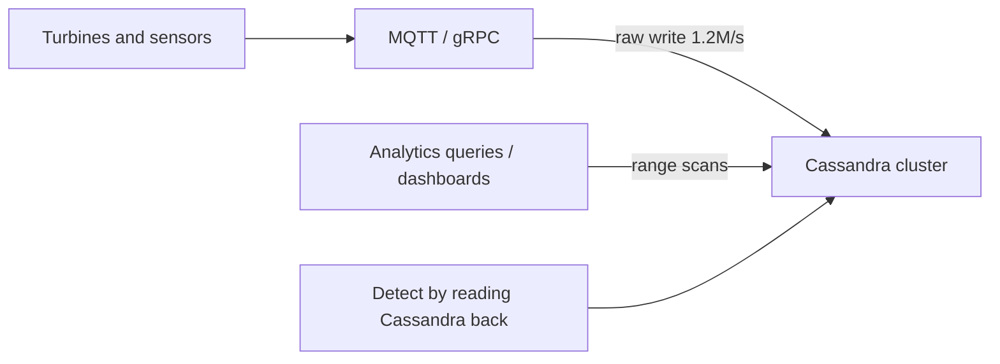
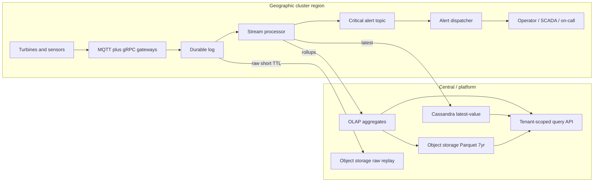
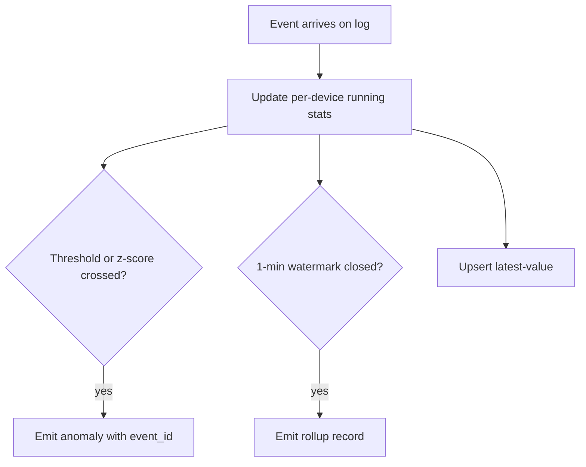

# IoT Telemetry & Anomaly Platform — Architecture Document
> - **Document Status**: Draft
> - **Last Updated**: 2026 Aug 29
> - **Author**: Paul Serban

A control-plane and data-path redesign of fleet telemetry: the durable log absorbs the firehose; regional stream processors detect anomalies inside 2 seconds; an isolated alert path pages operators; Cassandra is narrowed to latest-value lookups; an OLAP store and a cold object-storage tier of **aggregates** serve analytics and the 7-year audit. This document covers *what* the system is and *why* it is shaped this way; see [System Design](./03_system_design.md) for *how* partitioning, windowing, quotas, and failure modes work, [Security and Multi-Tenancy](./04_security_and_multitenancy.md) for isolation, and [Trade-offs and Honest Assessment](./06_tradeoffs_and_honest_assessment.md) for what those extra moving parts cost.

## Overview

**Brief description**: Multi-tenant, geo-distributed telemetry ingest, real-time anomaly detection, safety notification, and cost-bounded historical retention for wind turbines and smart-grid sensors. It is not a turbine controller, not a general IoT cloud, and not "Cassandra, but larger."

**Business Context**
- See [Scenario and Requirements](./01_scenario_and_requirements.md) for the full framing. In short: 1.2M events/s into one serving store that is also scanned for analytics produces compaction-driven read spikes and couples packet-loss risk to disk health. Tenants are external wind-farm operators sharing the platform.
- Target users: platform engineer, ingest/detection on-call, safety/grid ops, security, finance.

## Requirements

### Functional Requirements

- **Ingest**: accept MQTT and gRPC diagnostic payloads; authenticate the device; bind it to a tenant; validate schema; apply per-tenant quota; append to the regional durable log.
- **Normalize**: map both protocols to one internal event (`tenant_id`, `device_id`, `event_time`, 50-metric vector, `schema_version`).
- **Detect**: evaluate each event against running per-device (and optionally per-farm) statistics and static thresholds; emit an anomaly record within the 2-second budget.
- **Alert**: deduplicate, enrich with tenant/device context, dispatch to the tenant's configured channels (SCADA webhook, on-call, email). At-least-once with idempotent IDs.
- **Serve latest**: point-lookup of the last reading per device (and a short recent buffer if needed) without scanning history.
- **Serve analytics**: dashboards and API queries over **aggregates** (1-min / 5-min / hourly as designed), tenant-scoped.
- **Retain**: roll aggregates into object storage; lifecycle to cold/archive class; 7-year retrieval for audit.
- **Replay (short)**: keep raw in a replay window long enough to recompute rollups and debug incidents (days), not seven years.

### Non-Functional Requirements

**Performance Requirements:**
- Ingest: 1.2M events/s peak, ~6 GB/s, across 12 regional clusters. Per-region design target is the measured peak of that cluster (Phase 0), not 1.2M in every region.
- Detection: **p99 < 2s** from `event_time` (within skew policy) to alert-path enqueue in the **same region**. Central-region RTT is not in this budget.
- Dashboard queries over recent aggregates: interactive (sub-second to low seconds) at farm/cluster grain — **not** over raw.
- Audit retrieval over cold tier: **minutes** is acceptable. Optimizing audit to dashboard latency is wasted money.

**Reliability Requirements:**
- Valid, authorized, in-quota events are not dropped because Cassandra/OLAP/alert-dispatch is slow. They wait on the log until consumers catch up or the log's disk/retention policy is itself exhausted (that exhaustion is an incident, not silent drop).
- Detection for a geographic cluster survives partition from the central region.
- Alert path has dedicated throughput and consumer capacity. Bulk lag is not alert lag.
- Multi-tenant: one tenant's burst is shed; others continue.

**Infrastructure Constraints:**
- Existing device fleet speaks MQTT and gRPC. A flag day to "just use Kafka from the turbine" is not available.
- Cassandra already exists and is operationally known. It is **re-scoped**, not necessarily deleted on day one. Removing it before the OLAP latest-value (or a dedicated latest store) is live is how dashboards go dark.
- 12 geographic clusters are given. They are treated as **12 ingest+detect regions**, not as 12 names for one VPC.

**The defining constraint:**
- One system cannot be the firehose, the 2-second detector, the multi-second analytics scanner, and the 7-year archive. Those four jobs have incompatible I/O patterns. The architecture is **four paths with explicit coupling points**, not one database.

## Executive Summary

The scarce resources on the old path were **disk I/O and compaction CPU** on the serving cluster, consumed in proportion to raw write rate *and* scan width. The new path consumes:

- sequential disk/network on the **log** in proportion to ingest (this is the correct bottleneck for "don't drop packets"),
- sequential compute on the **stream processor** in proportion to events (this is the correct bottleneck for 2s detect),
- a **small, hot** latest-value store (Cassandra's actual sweet spot),
- **columnar** scans on pre-aggregated data (OLAP),
- **cheap sequential writes** of Parquet to object storage for the long tail.

**Architecture Style:** Geo-distributed, log-centric CQRS for time-series. Not a Lambda-architecture science project with a "batch layer" that is actually another Cassandra. Not a single global mesh.

**Key Components:**
- **Protocol gateways** (MQTT broker cluster + gRPC ingest) with tenant auth, schema validation, quota.
- **Regional durable log** (Kafka/Pulsar-class), partitioned by `tenant_id` + `device_id`.
- **Regional stream processor**: running stats + thresholds; rollup emission; latest-value projection.
- **Critical alert topic + dispatcher** (isolated quotas).
- **OLAP store**: recent aggregates for dashboards.
- **Cassandra**: latest-value (and only that, after cutover).
- **Object storage**: raw replay (short TTL) + Parquet rollups (7-year lifecycle).
- **Tenant-scoped query API**.

**Technology Stack (class, not SKU):**
- Ingest: MQTT 5 / existing 3.1.1 fleet + gRPC; mTLS.
- Log: Kafka or Pulsar. The ADR is "durable partitioned log," not a brand.
- Stream: Flink / Kafka Streams / equivalent with **event-time** and checkpoints. Not a fleet of stateless Lambdas at 1.2M/s.
- OLAP: Druid / Pinot / ClickHouse-class. Pick one in Phase 3 with a load test, not three.
- Cold: S3/GCS/Azure Blob + Parquet + lifecycle.
- Cassandra: keep for latest, or replace latest with a purpose-built KV if ops wants to exit Cassandra entirely later. v1 re-scopes.

**Architecture Principles:**
- **ACK ingest at the log, not at the serving store.**
- **Detect in-region. Roll up to center.**
- **Alerts are a different queue from bulk.**
- **Raw is a replay buffer. Aggregates are the record.**
- **`tenant_id` is in the key, the ACL, and the quota, not only the JSON.**
- **The cloud does not trip the turbine.**

**Key Architectural Decisions:**
1. Durable log decouples ingest from storage. [ADR-001](./05_architecture_decision_records.md#adr-001)
2. Regional-first stream processing. [ADR-002](./05_architecture_decision_records.md#adr-002)
3. Narrow Cassandra; introduce OLAP for aggregates. [ADR-003](./05_architecture_decision_records.md#adr-003)
4. Cold tier stores aggregates only (raw is short-TTL). [ADR-004](./05_architecture_decision_records.md#adr-004)
5. Cloud path is notification, not the safety interlock of record. [ADR-005](./05_architecture_decision_records.md#adr-005)
6. Shared infrastructure, logical isolation. [ADR-006](./05_architecture_decision_records.md#adr-006)
7. Alert path isolated from bulk. [ADR-007](./05_architecture_decision_records.md#adr-007)

### Context Diagram — current path (the anti-pattern)

Every analytics read competes with flush + compaction from the firehose. Detection that reads the same store inherits 3s spikes. Ingest ACK that waits on Cassandra inherits them too.

### Context Diagram — target path

Ingest ACK is `gw → log`. Detection does not wait on `olap` or `cold`. Dashboards do not scan `log` or raw Cassandra.

## Runtime Architecture

1. **Edge / device** (not designed here): emits every 3s; local interlock remains local.
2. **Gateway layer** (regional, milliseconds): mTLS or equivalent device identity → tenant binding; schema check; quota; produce to log. MQTT persistent session / QoS is a device-protocol concern; the *platform* durability starts at the log.
3. **Log layer** (regional): partitioned append. Retention sized for consumer lag + replay window, not for 7 years.
4. **Detect layer** (regional, in-process state): per-device EWMA/z-score/thresholds; emit anomaly; write latest; emit 1-min rollup records. Checkpoints to survive processor restart.
5. **Alert layer** (regional, isolated): consume anomalies; dedup; dispatch. Fail loud.
6. **Serving layer** (central and/or regional replicas): OLAP ingest of rollups; Cassandra latest; API.
7. **Cold layer** (central object storage, possibly per-jurisdiction bucket): compacted Parquet partitions by tenant/time; lifecycle.

### Detection vs rollup (they are not one window)

The anomaly branch does **not** wait for the 1-minute rollup. Waiting is how you miss the 2s SLA by 58 seconds.

## Components

### 1. MQTT broker cluster and gRPC ingest service
**Purpose**: Terminate device protocols without making the broker the system of record.

**Responsibilities:**
- Terminate TLS; authenticate device; resolve `tenant_id` from device registry, **not** from a client-supplied tenant header the device can spoof.
- Enforce per-tenant and per-device rate/quota (see [System Design](./03_system_design.md#5-backpressure-and-quotas)).
- Validate payload against schema registry (size, metric count, types).
- Produce to the regional log. ACK the device only after produce succeeds (MQTT QoS/gRPC status mapped honestly).
- Shed load: quota exceeded → explicit backpressure (MQTT disconnect / gRPC RESOURCE_EXHAUSTED), not silent drop.

**Interactions:**
- Reads: device registry, schema, quota counters.
- Writes: durable log.
- Does not write Cassandra or OLAP.

**What this is not:** an MQTT broker used as a 7-year queue. Broker disk is for inflight sessions, not the archive.

### 2. Device registry (control plane)
**Purpose**: Map device identity → tenant, cluster region, allowed schema, quota class.

**Responsibilities:**
- Provisioning and revocation at 2M-device scale (batch, not click-ops).
- Cert/credential lifecycle. See [Security](./04_security_and_multitenancy.md).
- Region assignment: a device produces only to its cluster's log.

### 3. Regional durable log
**Purpose**: Be the only place "we accepted this event" is true. Decouple producers from every consumer's speed.

**Responsibilities:**
- Partition by `hash(tenant_id, device_id)` so one device is totally ordered; tenants spread across partitions.
- Hold raw events for replay window (e.g. 3–7 days) plus lag margin.
- Separate **topics** (or equivalent) for bulk telemetry vs critical alerts. [ADR-007](./05_architecture_decision_records.md#adr-007).
- Per-tenant quotas at produce time (gateway) *and* fair sharing at consume if the log supports it; do not rely on "please don't produce too much."

**Interactions:**
- Produced by gateways.
- Consumed by stream processors, raw-to-object shipper, (optional) debug tools.

### 4. Regional stream processor
**Purpose**: The only component allowed to spend CPU on every event for detection.

**Responsibilities:**
- Event-time processing with a **small** allowed lateness (clock skew). Late events update stats and may still alert if still inside policy; they are marked late.
- Maintain keyed state: per `device_id` (tenant implied) running mean/variance or EWMA, last values, consecutive-breach counters.
- Emit: anomaly records; 1-min (and 5-min) rollups; latest-value upserts.
- Checkpoint state. A restart rebuilds from checkpoint + log, not from Cassandra scans.

**Interactions:**
- Reads: bulk telemetry topic.
- Writes: alert topic, rollup topic/sink, latest store, metrics.

**What this is not:** a place to run GPU inference on 50-dimensional vectors at 1.2M/s in v1. If a model is required later, it scores **candidates** already flagged, or runs on rollups, unless a new ADR and a new capacity plan exist.

### 5. Alert dispatcher
**Purpose**: Turn an anomaly record into a notification the tenant actually receives, without coupling to dashboard ingest.

**Responsibilities:**
- Idempotency key: `(tenant_id, device_id, rule_id, window_id)` or hash of first-crossing event.
- Dedup / suppression: e.g. re-alert at most every N minutes while still in breach; page immediately on rising edge.
- Enrichment from registry (farm name, severity, contact path).
- Dispatch adapters: HTTPS webhook to SCADA, PagerDuty-class, email. Timeouts must not block the consumer forever (async send with retry on a *side* queue).
- Audit: every dispatch attempt stored (who/what/when/result). This is the safety paper trail.

**Interactions:**
- Reads: alert topic (isolated).
- Writes: notification providers; alert audit store.

### 6. Latest-value store (Cassandra, narrowed)
**Purpose**: `GET /devices/{id}/latest` in milliseconds. Not history.

**Responsibilities:**
- One row (or a short ring of last-N) per device. Write rate is still high (1.2M upserts/s) but **value size is small** and **read is point-get**, which is the workload Cassandra can do if compaction is not also merging multi-year histories.
- TTL on latest is optional; overwrite is the model.
- Tenant key in the partition key. See [Security](./04_security_and_multitenancy.md).

**What this is not:** the analytics database. After Phase 3, range scans of raw history here are a forbidden product path.

### 7. OLAP store
**Purpose**: Interactive aggregation queries on **pre-rolled** data (and optionally very-recent 1-min rollups).

**Responsibilities:**
- Ingest rollup records, partitioned by time and tenant.
- Serve farm / cluster / tenant dashboards and API queries for hours–weeks (hot) and maybe months (warm).
- **Row-level (tenant) enforcement** in the query engine or a mandatory predicate injected by the API — never trust a client-supplied tenant list.

### 8. Raw replay + cold aggregate storage
**Purpose**: Raw: recompute and incident debug. Cold: 7-year audit.

**Responsibilities:**
- Ship raw from log to object storage in time-partitioned files; lifecycle delete after replay window.
- Compact rollups to Parquet (partition `tenant_id / date / grain`); lifecycle to infrequent-access / archive storage class.
- Catalog (Hive/Glue-class or a thin table) so audit queries do not become "list 2 million prefixes by hand."

### 9. Query API
**Purpose**: The only public read path. Enforces tenancy.

**Responsibilities:**
- Authenticate **human/service tenant users**, not devices.
- Route: latest → Cassandra; recent aggregates → OLAP; old aggregates → cold (async or slower).
- Never: "run this CQL against prod Cassandra" as a customer feature.

### Communication Patterns

**Synchronous (small):**
- Device ↔ gateway (MQTT/gRPC).
- User ↔ query API.
- Dispatcher ↔ notification providers (with timeout).

**Asynchronous (the system):**
- Gateway → log → stream → (alert | rollup | latest | raw shipper).
- Rollup → OLAP → cold compaction jobs.

## Scaling Strategy

**Current Scale Requirements:**
- 2M devices, 12 clusters, 1.2M events/s, ~6 GB/s, 50 metrics, 3s cadence, 7-year aggregates.

**Why regional sharding is not optional:**
- 6 GB/s into one region is a network and disk design; it is also a **latency** design. A 80–150ms intercontinental hop already spends 5–7% of a 2s budget before processing, and a partition spends 100% of the availability budget.
- 2M devices of keyed state in one Flink cluster is possible on paper and an operational nightmare (checkpoint size, recovery time). 12 clusters of ~100–200k devices are still large, but recovery is bounded.

**What must scale linearly with events:**
- Gateway instances, log partitions (within cluster), stream-processor parallelism (keyed).

**What must not scale with raw event rate:**
- Dashboard query cost. If it does, rollups are wrong or unused.
- Cold-tier audit. If auditors scan raw, the cost model is a lie.

**Bottleneck Analysis:**
- **Correct primary bottleneck:** regional log disk/network and gateway CPU for TLS + schema. Size for 1.2M/s with headroom (e.g. 2×) for reconnect storms.
- **Detection bottleneck:** keyed state backend and checkpoint I/O. If checkpoints take tens of seconds, a restart misses the SLO until catch-up. This is a real operational risk — see [System Design](./03_system_design.md#8-failure-modes).
- **Wrong bottleneck to "fix" first:** Cassandra heap/compaction on the *old* cluster. That cluster should stop receiving the firehose, not get another 20 nodes.

**Multi-tenant scaling:**
- Quotas are the scale control for tenants. Adding a tenant with 200k devices is a capacity review, not a signup checkbox. See Phase 5.

## Data Architecture

### Data Model

**Key entities:**

- **Tenant**: id, isolation policy, quota class, data-residency tags, alert endpoints.
- **Device**: id, tenant_id, cluster_id, identity, schema_version, status.
- **TelemetryEvent** (internal): tenant_id, device_id, event_time, ingest_time, metrics[50], schema_version, produce_partition, offset.
- **DeviceStats** (processor state): EWMA/mean/var, last_event_time, consecutive_breaches, last_alert_id.
- **AnomalyRecord**: tenant_id, device_id, rule_id, event_id, severity, detected_at, event_time.
- **AlertDispatch**: alert_id, channels, status, attempts.
- **RollupRecord**: tenant_id, device_id (or farm_id), window_start, grain, min/max/avg/sum/count (per metric or a documented subset).
- **LatestValue**: tenant_id, device_id, event_time, metrics (or a subset), ingest_time.

**Entity relationships:**
- Device belongs to exactly one tenant and one primary cluster.
- Events are immutable. Rollups are derived. Latest is an overwrite projection.
- Anomalies reference an event_id (log offset or device+event_time) for audit.

### Data Lifecycle

| Data | Hot | Delete / tier |
| --- | --- | --- |
| Raw on log | days (replay + lag) | log retention |
| Raw in object storage | same window | lifecycle delete |
| 1-min rollups | days–weeks in OLAP | downsample or drop; hourly remains |
| Hourly rollups | months OLAP + 7 years cold | lifecycle to archive class; delete after 7 years + legal hold exceptions |
| Latest | forever overwrite | device decommission |
| Alert audit | years (align with safety/regulatory) | legal policy |

## Cost Analysis

### Cost Components

**The number that must not be ignored:** ~518 TB/day raw. Object storage at that rate is still a serious bill (and egress/API request costs if naively PUT per event). Raw **must** be batched into large objects (hundreds of MB) for the replay window, then deleted.

**Money — order of magnitude, not a quote:**

- **Log + brokers + gateways**: dominates engineering and a large fraction of always-on compute. This is the price of not dropping packets.
- **Stream processors**: second compute line. State backends need fast disks.
- **OLAP**: sized for aggregate query, not 1.2M/s raw ingest. If OLAP ingest is fed rollups, it is ~20×–1200× cheaper than raw.
- **Cassandra narrowed**: much smaller than today's "keep everything" cluster. If today's cluster is already huge, this is a **cost down** after cutover, not another bill — *if* you actually stop the raw writes.
- **Cold 7-year hourly**: ~1 PB class over 7 years before compression/downsampling. Archive storage class makes this the intended cheap tier. **Raw 7-year is ~1.3 EB and is not proposed.**
- **Alert dispatch**: negligible compute; webhook/PagerDuty bills are tiny next to the firehose. Do not cheap out here to save money; isolation is the point.

**Engineering time — the actual cost:**
- This is a **platform program**: protocol gateways, log ops, stream jobs, three serving/storage systems, tenancy, and a migration off the live Cassandra firehose **without dropping packets**. Calendar is quarters, not a sprint. [Phased Implementation Plan](./07_phased_implementation_plan.md).
- The stream processor and the migration (shadow + cutover) are where teams underestimate. Kafka-on-Friday is the cheap part.

### Cost Optimization (that is actually architecture)

- Binary payloads and schema registry vs JSON.
- Batch raw to object storage; never one-object-per-event.
- Rollups in the processor (one pass) rather than re-reading raw from OLAP.
- Downsample: 1-min for 14 days, hourly for 7 years (numbers illustrative; legal signs the grain).
- Do not replicate raw 3× across regions "for safety." Replicate the log **inside** the region; ship aggregates centrally.

## Risks and Mitigation

| Risk | Likelihood | Impact | Mitigation | Owner |
| --- | --- | --- | --- | --- |
| Legal requires 7-year **raw** | Medium | Extreme (cost + design break) | Phase 0 written scope; if raw, new ADR, sampled raw or event-triggered raw capture, not "keep everything 3s" | Legal + architect |
| Treated as safety interlock of record | Medium | Extreme | [ADR-005](./05_architecture_decision_records.md#adr-005); farm inventory in Phase 0 | Safety + product |
| Checkpoint recovery > 2s catch-up; missed alerts during restart | High if untuned | High | Keyed state sizing, frequent checkpoints, hot-standby jobs, regional blast radius | Stream owners |
| One tenant firmware loop | High | High (noisy neighbor) | Gateway quotas; isolated alert path still won't help if the log is full of one tenant — produce-side quota is mandatory | Gateway |
| Cross-tenant query bug | Medium | High (trust) | Tenant predicate below API; tests as Phase 5 gate | Security |
| MQTT QoS vs log ACK mismatch (device thinks stored, we didn't) | High if hand-waved | High | ACK after produce; document QoS mapping; never ACK on "queued in broker memory" | Ingest |
| Data residency: 12 clusters ≠ 12 legal jurisdictions | Medium | High | Open question in [Security](./04_security_and_multitenancy.md); per-jurisdiction buckets if required | Legal |
| Dual-write during migration duplicates / splits truth | High | Medium | Shadow consume; cutover by cluster; Cassandra firehose off only after OLAP proven | Migration |
| OLAP + log + Cassandra + object = 4 on-call surfaces | Certain | Medium | This is accepted complexity. Hire/train. Do not "simplify" by writing OLAP from the gateway. | Engineering mgmt |
| Clock skew on devices blows event-time | High | Medium | ingest_time fallback; skew alerts; do not wait forever for unordered event-time | Stream |
| Compaction still hurts **latest** Cassandra at 1.2M upserts/s | Medium | Medium | Narrow schema, TWCS or STCS on small rows, capacity test in Phase 3; replace with KV if it still fails | Data store |
| Alert storm (farm-wide icing, grid event) | High | Medium (pages) | Suppression, severity aggregation, farm-level rollup alerts | Dispatcher |

## Future Enhancements

### Phase 1 (current design)
**Focus**: Durable ingest beside Cassandra; prove no-drop. See [Phased Implementation Plan](./07_phased_implementation_plan.md).

### Phase 2
**Focus**: Regional detect + isolated alerts.

### Phase 3
**Focus**: OLAP serving; Cassandra narrowed; dashboards off raw scans.

### Phase 4
**Focus**: Cold aggregates; 7-year drill.

### Phase 5 (conditional)
**Focus**: Multi-tenant hardening as tenant count grows.

### Technical Debt (accepted)

- Two ingest protocols forever unless the fleet migrates (it will not, soon).
- Latest still on Cassandra until proven otherwise — carrying Cassandra ops skill is debt and an asset.
- No ML on the 2s path. A future "predictive maintenance" model is a **batch/nearline** product, not a silent add-on to the detector.
- No global exactly-once.
- Shared isolation, not dedicated rings per tenant.
