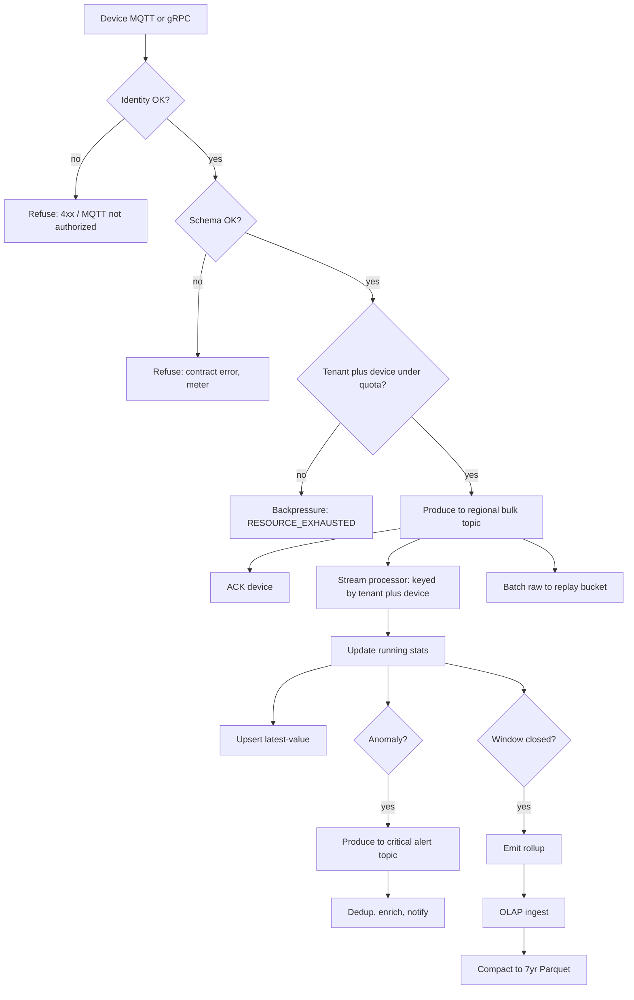

# IoT Telemetry & Anomaly Platform — System Design
> - **Document Status**: Draft
> - **Last Updated**: 2026 Aug 29
> - **Author**: Paul Serban

This document is the mechanical *how* for the platform described in the [Architecture Document](./02_architecture_document.md). It specifies keys, schemas, detection, quotas, rollups, and failure modes. It does not specify code.

## 1. Control Flow



**Invariant:** `ack` does not wait on `latest`, `olap`, `dispatch`, or `cold`. If those stall, the log holds. If the log cannot hold, that is a platform incident — not a silent drop inside the gateway.

**Invariant:** `alertProduce` is a different topic (and consumer pool) than bulk. Bulk consumer lag does not block the alert consumer.

## 2. Partitioning and Keys

### 2.1 Log partition key

```
partition_key = hash(tenant_id, device_id)
```

- All events for one device are totally ordered on one partition. Detection state is local to that key. No shuffle for the 2s path.
- Tenants with many devices spread across partitions. A huge tenant still occupies many partitions — quota is what stops them occupying *all* produce capacity.
- **Do not** partition on `event_time` only (hot partitions at "now").
- **Do not** partition on `tenant_id` alone (one jumbo tenant = one hot partition).
- Partition count per regional cluster: sized so that peak regional events/s / partitions stays within a broker's per-partition produce/consume budget, with headroom for reconnect storms. Exact count is a Phase 1 load-test output, not a number in this doc pretending to be measured.

### 2.2 Latest-value Cassandra key

```
PRIMARY KEY ((tenant_id, device_id))
```

Single-row overwrite. No clustering on time for the product path. A `last_n` table, if needed for a sparkline, is a **bounded** clustering window (e.g. last 20 points) with TTL — not "history lives here."

### 2.3 OLAP / cold partition

```
tenant_id / grain / yyyy / mm / dd / [hh] / ...
```

Every query from the API injects `tenant_id = token.tenant`. Listing a prefix without tenant is a platform-admin path only.

### 2.4 Ordering guarantees (what you get)

| Scope | Order |
| --- | --- |
| One device | Total order on the log partition (produce order). Event-time may still be skewed. |
| One tenant, many devices | No global order. |
| Two regions | No order. Cross-region "what happened first" uses `event_time` with skew policy, never a global clock. |
| MQTT vs gRPC duplicate of the same physical reading | Possible. Idempotency: `device_id + event_time` (truncated to sensor resolution) or a device-supplied `seq`. If the device has no `seq`, last-write-wins on latest; rollups may double-count **unless** the processor de-dupes on `(device_id, event_time)` in a short window. Phase 0 measures dual-protocol overlap. |

## 3. Schema Registry

MQTT and gRPC must become **one** internal event. The 50-metric vector is a contract.

### 3.1 Internal event (logical)

| Field | Notes |
| --- | --- |
| `tenant_id` | From registry via device identity, never from payload. |
| `device_id` | From identity / authenticated topic namespace. |
| `event_time` | Sensor timestamp. Timezone: UTC. |
| `ingest_time` | Gateway clock when produce is accepted. |
| `schema_version` | Integer; registry. |
| `metrics` | Fixed 50-wide vector of known types (float/int). Names live in the registry, not repeated as JSON keys per event (that is how 5 KB becomes 15 KB). |
| `seq` | Optional device monotonic counter. |
| `source_protocol` | `mqtt` \| `grpc`. |

### 3.2 Evolution

- Additive optional metrics: new schema version; processors ignore unknown tail until rolled.
- Type change of metric *i*: new version; **do not** silently coerce. Old processors must not crash; they skip or route to a "schema lag" metric.
- Gateway **rejects** unknown versions and oversize payloads. A 2 MB "diagnostic dump" on the 3s path is an incident in disguise.

### 3.3 MQTT topic convention (illustrative)

```
tenant/{tenant_id}/cluster/{cluster_id}/device/{device_id}/diag
```

The tenant segment is **checked against** the authenticated device's registry row. A device that publishes under another tenant's prefix is a security event, not a routing convenience.

gRPC: metadata carries device identity via mTLS; tenant is looked up. Client-supplied `tenant_id` metadata is ignored.

## 4. Anomaly Detection (real-time path)

### 4.1 What runs at 1.2M events/s

Per key `(tenant_id, device_id)`, for each configured rule on a subset of metrics (not necessarily all 50):

- **Static threshold**: `metric[i] > T_hi` or `< T_lo` (engineering limits from the turbine vendor / tenant config).
- **EWMA / z-score**: `ewma = α * x + (1-α) * ewma`; z against running variance; alert if `\|z\| > Z` for `K` consecutive points (K small, e.g. 1–3). Consecutive-K filters single-sample spikes that local interlocks already handle.
- **Stuck sensor**: `x` unchanged (or NaN) for longer than M periods.
- **Missing data**: if `ingest_time - last_event_time > gap`, emit a **connectivity** anomaly (this is not the 2s "operational" class, but it is operationally load-bearing). Gap detection is on processor wall-clock / ingest_time, not event_time.

Rules are **data**. Tenants may have different T_hi. The processor loads rule sets keyed by tenant (cached). A bad rule (alert on every point) is a quota/suppression problem, not a reason to allow unbounded page storms.

### 4.2 Why not a tumbling 2-second window for detection

A tumbling window that **emits at close** detects at T_window_end, which is up to 2s after occurrence *plus* processing. The SLA is already spent.

**Decision:** detection is **per event** against state updated by that event. Windows exist for **rollups**, not for the safety-adjacent flag.

Optional: a short sliding window (e.g. last 5 samples) for "mean over 15s" rules still updates on each event and can fire on the event that pushed the window over the line — not on a timer tick.

### 4.3 Event-time vs ingest-time

- Primary: `event_time` for "occurrence."
- If `|event_time - ingest_time| > skew_max` (e.g. 5s): treat as **skewed**; detect using ingest_time for the SLA clock; flag device clock; do not wait for watermarks that never advance.
- Watermarks for **rollups** close 1-min windows with a short allowed lateness (e.g. 10–30s). Late events update the next window or a correction record; they do not block alerts.

### 4.4 What does not run on this path (v1)

- GPU models, multivariate autoencoders, "LLM summarizer of turbine health."
- Cross-device joins that require shuffling the fleet (e.g. "this farm's median vs this turbine") **on the 2s path**. Farm-level comparison is a **rollup-time** or **OLAP** job (minutes). If product insists on 2s farm-relative detection, that is a new shuffle, a new capacity plan, and a new ADR.

### 4.5 Alert idempotency and suppression

```
alert_id = hash(tenant_id, device_id, rule_id, rising_edge_event_id)
```

- **Rising edge**: first event that enters breach after a non-breach (or after suppression expired).
- **Dedup store**: `(tenant_id, device_id, rule_id) → last_alert_at, last_alert_id`. If still in breach and `now - last_alert_at < suppress_for`, do not produce a new alert record (or produce a `suppressed` count metric only).
- Dispatcher is still at-least-once: the same `alert_id` may be delivered twice. Downstream webhooks must treat `alert_id` as idempotent.

**At-least-once vs exactly-once:** the log + processor will replay. Alerts must tolerate duplicates. A transactional "exactly-once alert" across PagerDuty is not offered. Missing an alert is worse than a duplicate page; suppression is how we avoid *infinite* pages.

## 5. Backpressure and Quotas

### 5.1 Why gateway quota exists

Without it, one tenant's firmware loop fills the regional log, checkpoints inflate, and *other tenants in that region* miss the 2s SLO. Multi-tenant isolation that only exists at query time is decorative.

### 5.2 Token bucket (per tenant, per region)

- Capacity and refill sized from contracted device count × 1/3 Hz × burst factor (e.g. 2× for reconnect).
- Per-device cap (lower) so one bad device doesn't eat the tenant's whole bucket — then the tenant's *other* devices still flow.
- Cost: 1 token per accepted event (rejected schema/auth does not consume *tenant fair-share* of the log, but is rate-limited separately as an abuse control).

### 5.3 What happens at the limit

- gRPC: `RESOURCE_EXHAUSTED` with retry-after. That is not "packet drop" of *valid in-quota* traffic; it is contract enforcement.
- MQTT: do not silently drop QoS1. Either throttle by delaying PUBACK (dangerous: session buffers) or disconnect with a documented code and **meter**. Prefer explicit refuse over lying PUBACK. Phase 1 must pick one and test device behavior — some firmware will reconnect-storm, which is worse. A reconnect-storm breaker (per device identity) is required.

### 5.4 Log and consumer backpressure

If the stream processor lags:

- Log retains (until retention). Ingest continues until disk watermarks.
- **Do not** stop accepting all tenants because one consumer is slow unless the log is actually at the cluster disk watermark. At that watermark, shedding is global in the region — this is a **severity-1**, not a quiet throttle.
- Alert topic has **reserved** broker throughput / separate cluster if needed. A full bulk topic must not block alert produce (dedicated brokers or quotas). [ADR-007](./05_architecture_decision_records.md#adr-007).

### 5.5 Fairness

Shared log: producer quotas per tenant. Consumer: one processor group for bulk, scaled to the region. Do not run "one consumer group per tenant" at 50 tenants × 12 regions unless you like coordinator collapse.

## 6. Rollups and Cold Tier

### 6.1 Grains (illustrative; legal may tighten)

| Grain | Produced by | Hot retention | 7-year |
| --- | --- | --- | --- |
| 1-minute min/max/avg/count per metric, per device | Stream processor | 14 days OLAP | **No** (unless legal says yes) |
| 5-minute | Derived or processor | 90 days OLAP | Optional |
| 1-hour | Processor or compact job | months OLAP | **Yes** — default 7-year record |
| Daily | Compaction from hourly | cold only | Optional downsample after year 1 |

Exact numbers are Phase 0/4. The **shape** is: fine grain dies young; coarse grain lives in object storage.

### 6.2 Rollup record

Per `(tenant_id, device_id, window_start, grain)`: count, sum, min, max, (optional) sum_of_squares for variance, null/omitted count. Do not store 1-minute **raw samples** in the rollup.

Farm-level rollups: **second job** from device hourlies, or OLAP query at read time for interactive dashboards. Pre-computing farm grain reduces dashboard cost; it is not required for the 2s path.

### 6.3 Raw replay objects

- Consumer batches by time (e.g. 1–5 minutes) into Parquet/Avro files of hundreds of MB.
- Prefix: `raw/cluster_id/tenant_id/yyyy/mm/dd/hh/...`
- Lifecycle: delete after replay window (e.g. 7 days).
- Purpose: recompute rollups after a processor bug; sample for incident review. **Not** the 7-year API.

### 6.4 Cold lifecycle

- Compaction job: hourly rollups → larger Parquet, partitioned for predicate pushdown on tenant + date.
- Storage class: standard → infrequent → archive per age. Archive restore time is **the audit SLO**, communicated to compliance (hours possible). If they need minutes, you stay on infrequent access and pay.
- Legal hold: object lock / disable lifecycle delete for named tenants or date ranges.

### 6.5 The 7-year audit query

Not a dashboard. Flow: authorized compliance role → query API → catalog lookup → (restore if archived) → scan Parquet for tenant + range + grain → artifact + access log.

Success is **completeness of contracted grain**, not "same UX as last-hour dashboard."

## 7. Latest-Value Path

- Stream processor upserts after stats (same event). Loss of latest for a few seconds on processor restart is acceptable; detection catch-up is the SLO that matters more.
- API reads Cassandra (or KV) with tenant in the key. Caching latest in Redis is optional and is a **cache of a projection**, TTL seconds; cache key must include tenant.

If 1.2M upserts/s still crushes Cassandra after narrowing (Phase 3 test):

- Split latest by region (12 smaller rings), or
- Use a memory-first KV (Redis cluster / Dragonfly / etc.) with persistence, or
- Accept "latest is OLAP's most recent 1-min bucket" (weaker freshness).

Do not silently expand Cassandra back into a history store.

## 8. Failure Modes

| Class | Example | Behavior |
| --- | --- | --- |
| **Auth / identity** | Expired cert, unknown device | Refuse. No log produce. Meter. Do not ACK as stored. |
| **Schema** | Wrong version, truncated vector | Refuse. Alert tenant's integration metric. |
| **Quota** | Tenant burst | Shed that tenant/device. Others unaffected. |
| **Broker / log disk watermark** | Regional Kafka filling | Severity-1. Ingest shed **regionally**. Detection stale. **Local farm interlocks still authoritative.** Pages: "platform ingest down in cluster X." |
| **Central region partition** | WAN cut | Regional detect + alert **continue**. OLAP/cold/API historical degrade. Dashboards of *latest* may be served regionally if API is regional; if API is only central, latest lookups fail — **detection must not depend on them.** |
| **Stream processor crash** | OOM, checkpoint fail | Restart from checkpoint. Replay log. Duplicate alerts possible (idempotent IDs). If recovery takes minutes, 2s SLO is **missed for that interval**; mitigate with faster checkpoints, more memory, standby job. This is the honest residual. |
| **State backend corruption** | Bad checkpoint | Restore previous checkpoint or rebuild from replay window. If replay window < outage, stats **reset** (EWMA cold-start). Threshold rules still work; z-score is hot. |
| **Cassandra latest down** | Compaction of *narrow* table still, or outage | Dashboards of "now" fail. Ingest continues. Alerts continue. |
| **OLAP down** | | Dashboards of history fail. Ingest, detect, alert continue. |
| **Cold / object store down** | | Audit and raw shipper lag. Raw accumulates on log until log retention — then **raw replay is lost** (aggregates already emitted may still be in OLAP). Ingest continues until log disk. |
| **Alert dispatcher down** | | Anomalies accumulate on **alert topic**. Dispatch delay. This is a safety-notification incident. Page the platform. Bulk telemetry must not be the thing on-call looks at first. |
| **Notification provider down** | PagerDuty 5xx | Retry with backoff on side queue; dead-letter + page platform via a **second** channel (SMS gateway, ops Slack). Do not block alert-topic consume on one HTTP call without a timeout. |
| **Clock skew storm** | GPS/NTP loss on a farm | Skew flags; ingest_time detection; do not stall watermarks globally. |
| **Alert storm** | Real icing event, 10k turbines | Suppression + farm-level aggregation. Still at-least-once. Human on-call will hurt; that can be correct. |
| **Poison event** | Processor throws on one payload | Skip to DLQ for that event after N fails; **do not** stall the partition (head-of-line). Meter poison. A stalled partition is missed alerts for every device on that partition. |
| **Dual-write migration split brain** | Cassandra old path + log both written | Shadow until cutover; one writer for each sink after cutover. See Phase 1–3. |

### Circuit breaker (tenant)

If a tenant's poison rate or schema-reject rate exceeds a bound, **open** ingest for that tenant (or that firmware version) and page tenant success. Do not keep chewing CPU on garbage at 1.2M/s.

### Circuit breaker (processor)

If checkpoint failure repeats, do not "keep processing without checkpoints" as a silent default — a crash then loses detection state and may **replay a storm of alerts** or miss. Fail the job to standby or to a degraded mode that only runs **static thresholds** (stateless) until checkpoints recover. Degraded mode is an explicit operator-visible state.

## 9. Observability (minimum)

If you cannot answer these, you do not have a 2s safety-adjacent platform. You have a Kafka cluster.

**Ingest:** events/s in, events/s produced, refuse counts by class (auth, schema, quota), produce latency p99, MQTT reconnect rate, gRPC error rates, **bytes/s**.

**Log:** disk watermark, produce p99, consumer lag **seconds** (not only offsets) on bulk vs **alert** (separate). Alert lag SLO is tighter than bulk.

**Detect:** detect_latency = `alert_enqueue_time - event_time` (and vs ingest_time); p50/p99; fraction skewed; rules fired; suppressed count; processor checkpoint duration; time-to-restore.

**Alert:** dispatch success/fail, time to first attempt, DLQ depth.

**Serving:** OLAP query p99, Cassandra latest p99, **no** product dashboard that scans raw.

**Tenancy:** per-tenant ingest rate vs quota, cross-tenant query denials (should be ~0; any spike is an incident).

**Page on:** regional ingest refuse of valid traffic, log watermark, alert-topic lag above SLO (e.g. 2s), detect p99 > 2s, dispatcher DLQ, cross-tenant access denials, checkpoint failed.

## 10. Security-relevant mechanics (see also [Security](./04_security_and_multitenancy.md))

- Produce ACLs: gateway service identity only. Devices never produce to Kafka directly in v1 (2M device principals in Kafka is an identity product you do not want on the launch path).
- Consume ACLs: processor, shipper, debugger (break-glass).
- Query: tenant token → mandatory predicate.
- Alert webhooks: per-tenant secrets; no shared signing key across tenants.

## 11. Stop / Done Conditions (runtime)

The ingest path does not "finish." Modes:

- **Healthy:** in-quota events ACKed; detect p99 < 2s; alert lag inside SLO.
- **Degraded detect:** thresholds-only or lagging; ingest still up; operator banner on dashboards.
- **Shed:** quotas or watermarks; explicit.
- **Blocked region:** auth/registry down — cannot safely accept (cannot bind tenant). Fail closed on identity, not "tenant=unknown."

Rollup/cold jobs are "done" per window when the object is written and the catalog row exists. They are allowed to be hours behind ingest. They are not allowed to be days behind without an alert — that is how you discover at year 7 that compaction never ran.
