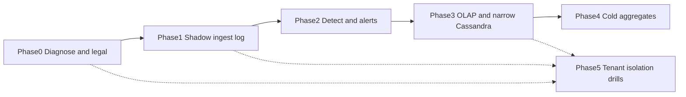

# IoT Telemetry & Anomaly Platform — Phased Implementation Plan
> - **Document Status**: Draft
> - **Last Updated**: 2026 Aug 29
> - **Author**: Paul Serban

Each phase has an **Objective**, **Deliverables**, and an **Exit Gate** that must pass before the next phase begins. **Phase 0 is not optional and is not "we already know it's compaction."** Building Kafka on top of an unmeasured Cassandra cluster is how you pay for two firehoses. Phase 5 is **conditional** on onboarding tenants beyond a pilot.

Rollback/kill criteria at the bottom apply at every phase.

Calendar is **quarters**, not a two-week sprint. A realistic Phase 0 is weeks (evidence + legal). Phase 1 (shadow ingest) is months including hardware, TLS, and load tests. Compressing Phase 2 by skipping a WAN-partition drill is how you discover the 2s SLA was central-region luck.

## Phase 0 — Diagnose, Scope, and Confirm (before any new pipeline)

**Objective**: Name the Cassandra failure with **evidence**, freeze the 7-year grain with **legal**, inventory **safety authority** and **residency**, and measure **real** ingest mix. Replace "Cassandra is slow" with a partitioned fault tree. See [Scenario](./01_scenario_and_requirements.md).

**Deliverables**:
- Cassandra: compaction stats, pending tasks, disk util, read p99 vs write p99 vs compaction windows; table sizes; whether analytics queries are full-partition scans; TWCS vs STCS actually in use.
- Consumer inventory: every job that reads or writes the telemetry keyspaces (dashboards, Spark, mystery cron).
- Measured events/s, bytes/s, MQTT vs gRPC split, events/device, **dual-protocol duplicates**, per-cluster device counts (not the brochure 2M if production is 200k).
- Payload size histogram (p50/p99). Schema inflation (JSON vs binary).
- Written legal answer: 7-year grain (hourly vs raw vs other). If unanswered, **do not start Phase 4**; assume hourly for planning but **flag** as unsigned.
- Safety inventory: which farms have local interlocks. Product language review vs [ADR-005](./05_architecture_decision_records.md#adr-005).
- Residency map vs 12 clusters. Fork: central OLAP vs federated. [Security](./04_security_and_multitenancy.md#data-residency-open-question--do-not-assume-away).
- Tenant model confirmation: external SaaS (this project). Pilot tenant vs wait-for-isolation-tests.
- Unknowns log: each item `observed` / `ruled out` / `still open`. Open items that change the design (raw-7yr, no local interlock, residency) flagged immediately.

**Exit Gate**:
- [ ] Root cause of >3s reads named with evidence (compaction I/O vs bad queries vs GC vs something else). **Both** "compaction vs analytics coupling" and "it's only a missing index" are successful Phase 0 outcomes — they fork the project.
- [ ] Go/no-go: **coupling / firehose class at material volume → proceed to Phase 1.** **Query-only abuse at modest volume → fix queries / add a rollup table, stop this program.**
- [ ] Legal grain: signed, or explicitly "unsigned, Phase 4 blocked, proceed 1–3 on replay-window raw only."
- [ ] Safety copy: notification, not interlock, acknowledged by product/safety.
- [ ] Residency: written; OLAP topology chosen (central vs regional).
- [ ] Peak ingest **measured** (or a dated load-test plan on a representative subset if production cannot yet produce 1.2M/s). Design numbers updated if reality diverges.

Do not "stand up Kafka in parallel" before this gate unless it is a **lab** that cannot become the production path by inertia.

## Phase 1 — Ingestion Decoupling, Shadow Path (Cassandra firehose still on)

**Objective**: Prove gateways + regional log can accept the firehose **without dropping in-quota events**, **without** cutting over serving. Cassandra remains the production write path until Phase 3. The log is a **shadow** (or dual-write) until gates pass.

**Deliverables**:
- Device registry + mTLS (or documented legacy) on a **pilot cluster**.
- MQTT + gRPC gateways producing to a regional log; ACK after produce.
- Schema registry; reject path metered.
- Per-tenant/device quotas **enforced on the shadow path** (even if production Cassandra still takes everything — find the bugs here).
- Load test: regional peak (or 2×) with reconnect storm; measure drop/refuse classes.
- Dual-write plan: either gateway writes log **and** existing Cassandra, or a Cassandra CDC/capture shadows **from** existing path onto the log — pick one. Dual-write is how you compare. Two uncompared paths is a split brain.
- Minimum metrics: produce p99, log disk, refuse counts, **Cassandra still healthy** (this phase must not make today worse).

**Exit Gate**:
- [ ] Shadow path holds target events/s in the pilot region with **zero silent drops** of in-quota valid events (refuses are explicit and classified).
- [ ] ACK is not issued unless produce committed (test: kill brokers, devices do not get success).
- [ ] Quota shed of a noisy tenant does not drop a victim tenant on the **log path**.
- [ ] Production Cassandra write path still default; rollback = stop shadow. Dual-write load on Cassandra is measured; if dual-write **causes** worse compaction, shadow from a side consumer instead of double-write.
- [ ] MQTT QoS/gRPC mapping documented and tested against real firmware samples.

If the log cannot hold the rate in one region, **do not start Phase 2**. Detection on a lying ingest is theater.

## Phase 2 — Regional Detection and Isolated Alert Path

**Objective**: Detect within 2s **in-region**, page on the isolated topic, **with central region partitioned** in a drill. Dashboards may still read Cassandra.

**Deliverables**:
- Stream processor: keyed state, per-event rules, checkpoints, poison DLQ (no HOL blocking).
- Critical alert topic + dispatcher: `alert_id`, suppression, one real notification channel (webhook) + audit.
- Detect latency metrics (`alert_enqueue - event_time` / ingest_time).
- Drill: **partition WAN to central**; inject threshold-crossing events; confirm dispatch still fires.
- Drill: kill processor, measure recovery and duplicate-alert behavior.
- Degraded mode documented (thresholds-only if checkpoints fail).
- Rule config distribution to the region (not "edit the job on the box").

**Exit Gate**:
- [ ] Injected anomaly: p99 detect-to-alert-enqueue **< 2s** at representative regional load.
- [ ] WAN partition drill: detection+dispatch continue; result recorded (video/metrics, not "should work").
- [ ] Bulk consumer lag (induced) does **not** move alert-topic lag by the same amount.
- [ ] Processor kill: job restores; no partition permanently stalled on poison.
- [ ] Suppression: stuck-high metric does not page every 3s; rising edge still pages.
- [ ] Product still not treating this as the interlock (runbook sentence present).

Do not cut over dashboards in this phase. Detection truth and serving truth can differ until Phase 3; operators must know which is canonical for **alerts** (the processor) vs **charts** (still Cassandra).

## Phase 3 — Serving-Layer Cutover (OLAP live, Cassandra narrowed)

**Objective**: Dashboards and APIs stop scanning raw Cassandra. Latest-value is a point-get. Cassandra **stops** receiving the raw firehose **by cluster**, after OLAP is proven.

**Deliverables**:
- Rollup sink → OLAP; tenant-scoped query API for aggregates and latest.
- Latest upsert from processor; Cassandra schema narrowed (or dual-table then drop history writes).
- Dashboard cutover behind a flag, per cluster.
- Load test: latest upsert at regional rate; OLAP query p99 for farm/24h aggregates.
- Per-cluster cutover runbook: stop Cassandra raw writers; confirm ingest remains on log; confirm no leftover Spark-on-Cassandra.
- Cassandra capacity **shrink** plan (cost win) only after N days of no raw writes.

**Exit Gate**:
- [ ] Flagged users in a cutover cluster: 24h farm dashboard does **not** query raw history tables (query audit / tracing).
- [ ] Latest point-get p99 inside interactive SLO under load. If not: **do not** put history back; trigger [ADR-003](./05_architecture_decision_records.md#adr-003) revisit (KV).
- [ ] Cassandra raw write rate ≈ 0 in that cluster; ingest ACK still on log; detect SLO still holds.
- [ ] Rollback: flag back to old dashboards **only if** Cassandra still has data. After history TTL/drop, rollback to old charts is **gone** — do not drop history until flags are default-on and stable.
- [ ] Tenant predicate tests: API cannot read another tenant's latest/aggregates.

Cutover is **per cluster**, not global Friday. Kill criterion if detect SLO regresses when OLAP ingest is attached to the processor — then isolate OLAP ingest on a **separate consumer** so the detect job only does detect+alert+latest.

## Phase 4 — Cold Tier and Regulatory Retention

**Entry Gate**: Legal grain is **signed**. Phase 3 rollups are the object you will keep for 7 years. Do not compact garbage.

**Objective**: Hourly (or signed grain) Parquet in object storage, lifecycle, catalog, and a **7-year audit drill** (simulated age / restored prefix).

**Deliverables**:
- Batch raw → replay bucket; lifecycle **delete** after replay window.
- Compaction: rollups → 7-year prefix; lifecycle to archive class.
- Catalog + compliance API path; access logs.
- Drill: restore-from-archive (or equivalent) for a tenant-date range; time to artifact recorded as the real SLO.
- Prove raw replay can **recompute** a day of hourlies and match (within documented epsilon) before you rely on it; then accept that after raw delete you cannot recompute.

**Exit Gate**:
- [ ] Signed grain objects exist, partitioned by tenant/date, listed in catalog.
- [ ] Lifecycle: raw prefix empty after window (drill with shortened TTL in non-prod).
- [ ] Audit drill completes; duration accepted by compliance **in writing** (hours vs minutes).
- [ ] Access to cold data is logged; break-glass tested.
- [ ] Cost dashboard: run-rate of cold tier vs the rejected "raw 7 year" counterfactual (so nobody "just keeps raw" later).

If legal signs **raw 7 years** during this phase, **stop** and re-ADR. Do not store raw in the hourly prefix and lie.

## Phase 5 — Multi-Tenant Hardening (conditional)

**Objective**: Isolation that survived one pilot tenant survives **tenant #2+**. Quotas, leakage tests, deny-list, reconnect storms.

**Entry Gate (any):**
- [ ] Second external tenant scheduled, or
- [ ] Pilot tenant's device count crosses an order of magnitude, or
- [ ] A tenant contract requires isolation evidence.

**Deliverables**:
- Cross-tenant attack tests: API, MQTT namespace, object prefix, OLAP, latest. See [Security](./04_security_and_multitenancy.md#blast-radius-and-onboarding-tenant-2).
- Aggressor-at-3×-quota vs victim 2s SLO.
- Device revoke/deny-list drill across regions.
- Optional: cold CMEK for contracted tenants.
- Onboarding checklist: quota class, region pin, webhook secrets, no shared signing keys.

**Exit Gate**:
- [ ] Cross-tenant tests fail closed (zero leaked rows).
- [ ] Victim detect/ingest SLO holds under aggressor shed.
- [ ] Revoke takes effect inside documented minutes in all relevant regions.
- [ ] Tenant #2 produces only after the checklist is signed.

This phase can start **in parallel with Phase 3** as tests in CI, but **onboarding tenant #2 to production** waits for the drills, not for a sales date.

## Phase Dependency Graph

Phase 5 depends on Phase 0's tenancy/residency answers and on **some** ingest path existing; it must complete before a second production tenant, which may be before or after Phase 4 (a second tenant does not require 7-year cold to be finished, but **does** require isolation). Phase 4 must not block alerts.

## Standing Rollback / Kill Criteria (apply at every phase)

Stop, roll a flag back, or kill the program — do not "keep the new path on to see if it settles" — if any of the following hold:

1. **Phase 0 says the problem is a bad query at modest volume.** Proceeding to twelve regional logs anyway is résumé-driven. Kill; fix the query; maybe add a rollup table.
2. **Shadow ingest silently drops or ACKs without produce.** Do not start detection. Fix ACK semantics.
3. **Detect p99 cannot meet 2s in-region after honest tuning** (state size, checkpoints, rules). Do not claim the SLA. Either reduce rules, add hardware, or change the product number — do not ship a dashboard green check.
4. **Alert path shares lag with bulk** after Phase 2. Do not call Phase 2 done. Isolation is the feature.
5. **Legal requires full-fleet 7-year raw and will not fund it.** Kill Phase 4 as specified; do not hide raw in "aggregates." Escalate commercially.
6. **Product markets cloud trip / SIL.** Kill the safety claim; [ADR-005](./05_architecture_decision_records.md#adr-005). Do not add `emergency_stop` RPC to "close the gap."
7. **Cross-tenant leak in any test.** Do not onboard tenant #2. Do not expand API surface.
8. **Cassandra latest fails SLO and someone proposes writing history back to Cassandra to "simplify."** That request is a kill criterion for architecture quality, not a simplification.
9. **Log disk watermark pages become routine** because retention was set to "hold raw for months." That is Phase 4 bleeding into the log. Shorten raw retention; do not buy disks forever to avoid Parquet.

Rollback is always to the last phase whose exit gate was honestly green — typically "Cassandra still the serving store, shadow log off" in early phases; after Phase 3 drop of history, rollback to old analytics **does not exist**. Plan the drop of history **after** the new serving path has been default for a defined soak (e.g. one billing month), not the same week as cutover.

After a kill, the honest output is the Phase 0 evidence plus whatever query/compaction/limit change is justified. The output is not a half-enabled Flink job still writing 1.2M rows/s into the same compacted volume, undocumented.
