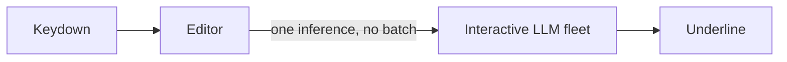
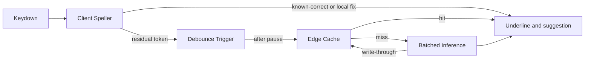
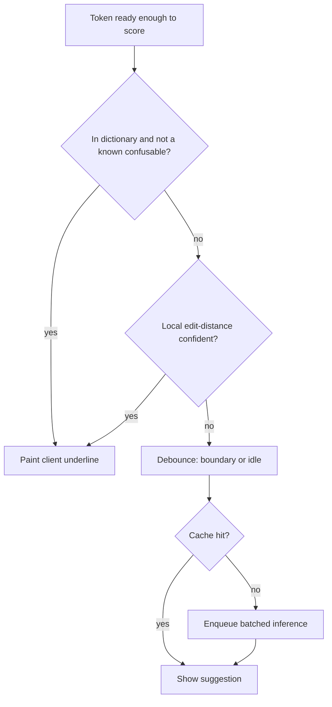

# Keystroke Spell-Checker Cost Redesign — Architecture Document
> - **Document Status**: Draft
> - **Last Updated**: 2026 Aug 29
> - **Author**: Paul Serban

A cost-driven redesign of LLM spell-check: the client owns instant spelling; a shared cache absorbs common residual errors; a batched model runs only after a pause, only for what is left. This document covers *what* the system is and *why* it is shaped this way; see [System Design](./03_system_design.md) for *how* debounce, cache keys, and batching actually work, and [Trade-offs and Honest Assessment](./05_tradeoffs_and_honest_assessment.md) for what the 100x actually costs.

## Overview

**Brief description**: Spell-check infrastructure, scoped narrowly: take the model off the keystroke path. It is not a grammar product, not a writing assistant, and not a general inference gateway.

**Business Context**
- See [Scenario and Requirements](./01_scenario_and_requirements.md) for the full framing. In short: 10M DAU × ~4,000 keystrokes/day is ~40 billion events. A model call per event is a ~$30–50M/month GPU fleet at interactive latency. The 100x is not a cheaper GPU. It is fewer calls, then cheaper serving of the residual.
- Target users: owning engineer, FinOps, product, privacy. The editor consumes "suggestion for this word" and must not care which tier produced it.

## Requirements

### Functional Requirements

- **Triage locally**: the client must classify each completed token as known-correct, local-correctable, or residual — without a network round-trip.
- **Trigger on pause, not on key**: residual work is scheduled from word boundary, punctuation, or idle timeout. See [ADR-002](./04_architecture_decision_records.md#adr-002).
- **Cache the residual's common case**: (normalized word + coarse neighborhood) → suggestion, globally shared, with TTL and poison controls.
- **Infer the tail**: a small hosted model, dynamically batched, only on cache miss of a residual.
- **Render without blocking**: underlines and suggestions appear when ready; typing never waits.
- **Degrade**: cache down, inference down, or offline → client tier only. See [ADR-005](./04_architecture_decision_records.md#adr-005).

### Non-Functional Requirements

**Performance Requirements:**
- Client-tier underline: on-device, budget comparable to existing spell-check (single-digit milliseconds per token on a typical laptop/phone, not a 100 ms hitch on every space).
- Residual suggestion: 100–300 ms after the pause is acceptable. Mid-keystroke LLM opinions are not a requirement; they are the thing we are refusing to buy.
- Cache lookup: edge/KV, single-digit to low tens of milliseconds. A cache that is slower than just calling the model is not a cache.

**Reliability Requirements:**
- **The editor is the SLO, not the model.** A GPU blip must not stall the caret.
- **Cache is a performance optimization, not a correctness oracle.** A miss is a slower path, not an error. A poison hit is a correctness incident; treat it as one.
- **Inference is best-effort.** Time out, show client-tier result, do not retry-storm a hot word.

**Infrastructure Constraints:**
- Existing editor process (desktop and/or web) stays the client. New work is a library inside that process, not a sidecar GPU on the laptop.
- Inference is a small, existing-or-new serving cluster. It is not 30,000 GPUs. If the capacity plan still looks like a supercomputer after this design, the file is still on the keystroke path.
- Cache is a global KV (CDN edge, Redis-cluster, or equivalent). It is not a per-user document store.

**The defining constraint:**
- Interactive GPU serving does not batch. Keystroke volume does not fit in any product GPU budget. The architecture is: **stop making the keystroke a model request.** Then batch what remains, because the user has paused.

## Executive Summary

The system is a **three-tier correction pipeline**. The scarce resource on the naive path was GPU-milliseconds, consumed in proportion to physical key events and denied batching by the latency SLO. The new path consumes GPU-milliseconds in proportion to *unresolved words after a pause*, which is two to three orders of magnitude smaller, and it *allows* batching because the wait is now user-visible as "suggestion after I stopped," which users already accept from every spell-checker they have used.

**Architecture Style:** Tiered, fail-open, cache-aside inference. Not an LLM-in-the-loop editor. Not a keystroke telemetry platform.

**Key Components:**
- **Client Speller**: dictionary + edit-distance (and, optionally, a tiny on-device model) for known-correct and common non-word typos.
- **Debounce / Trigger Controller**: the only thing allowed to promote a token to the network.
- **Edge Cache**: global KV of anonymized (word, neighborhood) → suggestion.
- **Batched Inference Service**: small distilled model, dynamic batching, 100–300 ms budget.
- **Suggestion Mixer**: merges client, cache, and model results for the UI; never auto-applies LLM/cache replacements in v1.
- **Telemetry (sampled, not per-keystroke)**: volumes by tier, hit rates, accepted-suggestion rate — the numbers that replace Fermi guesses.

**Technology Stack (illustrative, not a shopping list):**
- Client: existing editor + a WASM or native dictionary (Hunspell-class) ± a small on-device model if Phase 1 numbers demand it.
- Cache: edge KV / CDN with TTL; no document bodies.
- Inference: 7B-or-smaller distilled speller/grammar head, continuous batching, not a general chatbot.
- Control plane: feature flags, cache version, model version, kill switches.

**Architecture Principles:**
- **The model is not on the keystroke path.** If a `keydown` produces a GPU enqueue, the design has regressed.
- **Cheap, local, deterministic first.** Hunspell is not embarrassing. It is the product users already trust for `teh`.
- **Call reduction before unit-cost reduction.** Distill after you have 100x fewer calls, not before, and not instead.
- **Cache is shared and therefore dangerous.** Popularity + TTL + version; not "remember everything the model ever said."
- **Fail open to local spelling.** Network features may vanish. Typing may not.

**Key Architectural Decisions:**
1. **Tiered pipeline over per-keystroke LLM.** [ADR-001](./04_architecture_decision_records.md#adr-001).
2. **Debounce / pause trigger over per-keystroke invocation.** [ADR-002](./04_architecture_decision_records.md#adr-002).
3. **Global shared cache over per-user or no cache.** [ADR-003](./04_architecture_decision_records.md#adr-003).
4. **Small distilled / on-device model for common-case triage over always using the large hosted LLM.** [ADR-004](./04_architecture_decision_records.md#adr-004).
5. **Fail-open to client-only spelling.** [ADR-005](./04_architecture_decision_records.md#adr-005).

### Context Diagram — naive path (the anti-pattern)

Every arrow from the editor to the GPU is 1.7M QPS at peak, at a latency that forbids the batcher from doing its job. Thirty-thousand GPUs, or a 429 storm.

### Context Diagram — target path

The GPU sees the miss path of the residual of the paused token. That is the entire cost model.

## Runtime Architecture

1. **Client tier** (on the keystroke, microseconds to milliseconds): dictionary lookup on the current token; edit-distance candidates for non-words; optional tiny on-device model for high-frequency real-word patterns. Paints the underline. No network.
2. **Trigger tier** (on word boundary / punctuation / \(T_{idle}\) ms idle): if the token is still residual, enqueue one lookup. Coalesce bursts (backspace, retype) so a word in flux is one event.
3. **Cache tier** (edge, milliseconds): keyed by normalized word + coarse neighborhood. Hit → suggestion. Miss → inference.
4. **Inference tier** (batched, 100–300 ms budget): small model, dynamic batching. Result write-through to cache if it passes confidence and privacy gates.
5. **Mixer**: UI shows client underline immediately; cache/model suggestion may upgrade or add a contextual hint after the pause. Client result is never withdrawn to wait for a slower tier.

### Request classification

"Known confusable" is the crack where real-word errors live (`their`/`there`, `its`/`it's`). A pure dictionary says they are all fine. That is why a residual exists at all. It is also why the residual is *small*: most tokens are not confusables.

## Components

### 1. Client Speller
**Purpose**: Be the only code on the keystroke path. Own the Hunspell-class bar.

**Responsibilities:**
- Tokenize incrementally (the editor already does this).
- Dictionary membership; affix rules; local candidate ranking for non-word typos.
- Optional: a tiny on-device model (tens of MB, not a 7B) for a closed list of real-word confusables. If it does not fit the CPU/battery budget, it does not ship. The dictionary still does. See [ADR-004](./04_architecture_decision_records.md#adr-004).
- Mark tokens `local_ok`, `local_suggest`, or `residual`.
- Never block the input thread on I/O.

**Interactions:**
- Reads: local dictionary pack, current token, tiny left/right window in-process.
- Writes: none off-device.
- Does not call the cache or the model.

### 2. Debounce / Trigger Controller
**Purpose**: Convert a stream of keys into at most one residual request per settled word.

**Responsibilities:**
- Triggers: whitespace, punctuation, or idle ≥ \(T_{idle}\) (working default 400 ms; a parameter, not a religion).
- Coalesce: token still being edited → cancel in-flight residual for that token, restart timer.
- Dedup: same (user session, token span, neighborhood) already in flight → do not enqueue a second.
- Budget: per-session QPS cap so a stuck key or a paste of 10,000 words cannot stampede inference. Paste is a *document* event: sample or window, do not fan out one request per token.

**Interactions:**
- Reads: client classification.
- Calls: cache lookup, then inference on miss.
- Must not: enqueue from `keydown`.

### 3. Edge Cache
**Purpose**: Make the Zipf of human typos a cache hit instead of a GPU call.

**Responsibilities:**
- Get/put by `cache_key` (see [System Design](./03_system_design.md) for the key).
- TTL on the order of hours to a few days, not forever. Model version is part of the key or the value.
- Reject puts that fail a confidence floor, or that contain spans that look like PII (see privacy rules in System Design).
- Invalidation by model version and by explicit kill of a key prefix.
- Optional: compile the hottest N keys into the next client dictionary release (Phase 4+). Not required to hit 100x.

**Interactions:**
- Read by every residual trigger (this is the QPS the cache must survive: after debounce+client, working peak is thousands to low tens of thousands per second, not 1.7M — still a real cache, not a laptop Redis).
- Written by inference on eligible results.

### 4. Batched Inference Service
**Purpose**: Run a small spelling/contextual-error model on the residual miss stream, with a latency budget that *permits* batching.

**Responsibilities:**
- Dynamic batching up to the 100–300 ms budget (working p95 ≤ 250 ms including queue).
- A distilled task model, not a chatbot. Prompt is short: token + neighborhood + "is this an error, if so what." Max generation is a few tokens.
- Backpressure: shed to "no suggestion" rather than grow a queue that returns 2 seconds later. A late suggestion is a ghost; the user has moved on.
- Model-version stamp on every result so the cache can segregate.

**Interactions:**
- Reads: residual requests from trigger.
- Writes: cache (write-through), metrics.
- Does not see user ids. Does not log raw prompts at full volume.

### 5. Suggestion Mixer (editor UI)
**Purpose**: Combine tiers without lying about latency.

**Responsibilities:**
- Client underline is authoritative until a higher tier returns.
- A later cache/model result may *add* a suggestion or a real-word underline; it must not flicker the client underline off and on.
- No auto-replace from cache or model in v1. Click-to-fix is the product control against poison.
- If the user has already edited past the span, drop the late result.

**Interactions:**
- Reads: all three tiers.
- Writes: UI only.

### Communication Patterns

**Synchronous, in-process:**
- Keydown → Client Speller → paint.

**Synchronous, short, after pause:**
- Trigger → Edge Cache.

**Synchronous, batched, after pause, miss only:**
- Trigger → Inference (via a frontend that batches).

**Asynchronous:**
- Inference → cache put.
- Sampled telemetry.
- Dictionary pack updates (release cadence).

There is no per-keystroke websocket to the model. If someone adds one "for streaming feel," they have reintroduced the naive design.

## Scaling Strategy

**Current Scale Requirements:**
- 10M DAU, ~40B keystrokes/day, peak ~1.7M keys/s — of which the GPU must see ~1/100 to ~1/300 after levers.

**What does not need to scale:**
- GPU count, for keystrokes. If GPU count still tracks DAU linearly at 0.003 GPU per user, the model is still on the keystroke path.
- Per-user spell-check state on the server. There is no per-user document replica here.

**What must scale:**
- Client dictionary distribution (CDN of a pack, already a solved problem).
- Cache QPS at residual rate (thousands to tens of thousands QPS peak — ordinary).
- Inference QPS at miss rate (hundreds to low thousands QPS peak — a small cluster).

**If DAU grows 10x:**
- Client tier is free (users bring the CPU).
- Cache grows with unique residual keys, not with DAU, once the Zipf is hot. New languages and new slang are what grow the key space.
- Inference grows with *misses*, which should grow sublinearly if the cache and the client pack absorb yesterday's tail. If inference QPS tracks DAU linearly after a year, the cache is not working.

**Bottleneck Analysis:**
- Primary bottleneck after redesign: **cache hit rate and client coverage**, not GPU. Tune those before buying cards.
- Secondary: paste and collaborative-edit bursts. A 50-page paste is not 10,000 residual requests. Window it.
- Tertiary: on-device CPU on low-end mobile if an on-device neural model is added. The dictionary does not have this problem. Do not add the neural client if Phase 1 already hits coverage. See [ADR-004](./04_architecture_decision_records.md#adr-004).
- The user's typing speed is not a bottleneck we can "fix." Debounce that feels laggy is a mistuned \(T_{idle}\), not a reason to return to keystroke inference.

## Data Architecture

### Data Model

**Key Entities:**
- **DictionaryPack** (client): words, affixes, confusable list. Versioned, signed, CDN-distributed.
- **CacheEntry**: `cache_key`, `suggestion`, `confidence`, `model_version`, `created_at`, `expires_at`, optional `hit_count`.
- **ResidualRequest** (ephemeral, not stored): token, neighborhood, request_id. Not a table. Not a log of everything anyone typed.
- **ModelVersion**: id, serving pin, cache namespace.

**Entity Relationships:**
- Many cache entries per model version; a new model version does not read the old namespace (or keys include the version).
- No user entity on this path.

### Data Lifecycle

**Create**: cache put on eligible inference result; dictionary pack on release.

**Read**: cache get on residual; dictionary on every token.

**Update**: cache is write-through with TTL; no read-repair of documents.

**Delete**: TTL; version namespace drop; emergency key/prefix delete on poison.

Per-keystroke logs are **not** a data store we keep. Sampled accept/reject of *shown* suggestions is enough for quality. Full keystroke capture is a privacy incident wearing a metrics badge.

## Cost Analysis

### Naive (from Scenario)

| | Working value |
| --- | --- |
| Peak QPS | ~1.7M |
| QPS/GPU (no batch) | 50 |
| GPUs | ~34,000 |
| $/month | **~$30–50M** |

### Redesigned — call reduction

Start from 4,000 keystrokes/user/day.

| Stage | Remaining events / user / day | Factor | Notes |
| --- | --- | --- | --- |
| Keystrokes | 4,000 | 1 | Naive. |
| After debounce (word / pause) | ~700 | ~6x | ~5 chars/word, plus coalesced pauses. Not 1:1 with words if idle fires mid-word; still far below keys. |
| After client triage | ~45 | ~16x | ~6% residual: confusables + dictionary misses the local model will not touch. If Phase 0 measures 15% residual, this factor is ~7x and you need cache + batching to still clear 100x. |
| After cache (working 67% hit) | ~15 | ~3x | 67% is a plan, not a measurement. 50% hit is the conservative 2x. |

**Working compound: ~6 × 16 × 3 ≈ 290x fewer model calls.** Conservative compound (5 × 10 × 2): **100x.** The requirement is the conservative line. The working line is margin.

Fleet-wide model calls after working compound: \(4 \times 10^{10} / 290 \approx 1.4 \times 10^{8}\) / day ≈ **1,600 QPS average**.

Peak at the same 15% hour: ~**5,800 QPS**.

### Redesigned — serving the residual (batching)

The residual is allowed to wait 100–300 ms. That is enough for dynamic batching. QPS/GPU for a small model with tiny sequences and a 200 ms batch window is not 50; it is **hundreds**. Working value: **400 QPS/GPU**. If serving is worse, buy a few more cards; do not panic back to 34,000.

| | Working | Conservative (100x calls, 200 QPS/GPU) |
| --- | --- | --- |
| Peak model QPS | ~5,800 | ~17,000 |
| QPS/GPU | 400 | 200 |
| GPUs at peak | ~15 | ~85 |
| $/month at $2/h × 730h | **~$22k** | **~$125k** |

Plus cache (a global KV at <20k QPS is hundreds to low thousands of dollars, not millions) and CDN for dictionary packs (already in the editor's budget).

**Headline redesigned GPU: low tens of thousands of dollars per month (working), still well under $500k in the conservative column.** That is the 100x (conservative) to ~2,000x (working, including batching). Report 100x as the *requirement we design to*; report ~$20k–$125k as the *working cost band* after levers. Do not put "$22k" in a board slide as a promise. Phase 0 replaces every factor with a measurement.

### Cost Optimization (what to turn, in order)

1. Client coverage (free QPS; ships in the binary).
2. Debounce correctness (wrong trigger → either UX lag or QPS explosion).
3. Cache hit / poison controls.
4. Batching and model size on the residual.
5. Reserved GPU SKUs.

Do not start at 5. That is how you buy a cluster for a problem you have not shrunk.

## Risks and Mitigation

| Risk | Likelihood | Impact | Mitigation Strategy | Owner |
| --- | --- | --- | --- | --- |
| Debounce feels laggy; product demands "on every key" | High politically | High (returns naive cost) | Show that desktop Word already waits on word boundary; A/B \(T_{idle}\); never take keystroke inference as a "temporary" flag | Product + owning engineer |
| Client coverage worse than 16x (messy tokenization, CJK, code) | Medium | High | Phase 0 measure; language pack scope; do not silently send code tokens to the model | Client speller |
| Cache hit << 50% | Medium | Medium | 100x still achievable from debounce+client in the conservative table; cache is margin. Investigate key granularity (too unique → always miss) | Cache |
| Cache too coarse → wrong suggestion, fleet-wide | Medium | High | Confidence floor, TTL, version, no auto-apply, prefix kill switch | [ADR-003](./04_architecture_decision_records.md#adr-003) |
| Neighborhood in the cache key is PII | Medium | High | Normalize, truncate, drop numbers/emails; never put user id in the key; legal review in Phase 0 | Privacy |
| On-device neural model blows CPU/battery | Medium if we add one | Medium | Dictionary-only is v1; neural client is a gated add. Kill if thermal/battery budget misses | [ADR-004](./04_architecture_decision_records.md#adr-004) |
| Paste/stampede | High without a cap | High | Per-session cap; paste = sampled window, not per-token fanout | Trigger |
| Late inference result applies to the wrong span | High | Medium | Span ids, drop if the buffer changed, no auto-apply | Mixer |
| Inference autoscale cold start | Medium | Medium | Tiny always-on baseline (a handful of GPUs); shed, don't wait 3 minutes | Inference |
| "Just stream tokens from a 70B for quality" | High socially | High | Out of scope; that is the $50M system plus a larger model. See Trade-offs | [ADR-001](./04_architecture_decision_records.md#adr-001) |
| Observability becomes keystroke logging | Medium | High | Sample shown suggestions only; forbid raw prompt logs at residual QPS | Privacy + on-call |

## Future Enhancements

### Phase 0 (current design's prerequisite)
**Focus**: Measure \(k\), residual rate, current dictionary coverage. Replace Fermi factors. See [Phased Implementation Plan](./06_phased_implementation_plan.md).

### Phase 1
**Focus**: Client dictionary tier only. Instant local highlighting. No GPU yet.

### Phase 2
**Focus**: Debounce + batched residual LLM, flagged.

### Phase 3
**Focus**: Shared cache in front of inference.

### Phase 4
**Focus**: Default-on, cost/quality dashboards, compile hot cache into client packs, kill switches proven.

### Technical Debt (accepted)

- Long-range grammar and tone are not started. If product later requires them, that is a new invoke-based product with a different QPS, not "add more context to the spell-check prompt."
- CJK / unsegmented scripts need a different tokenizer; v1 is a space-delimited (or existing-editor-tokenizer) language pack.
- On-device neural spelling is optional and may never pay for its complexity if Hunspell + cache + small hosted model hit the bar.
- The Fermi numbers in this document expire when Phase 0 lands. Leaving them in the architecture doc as folklore is how you provision the wrong cluster next year.
