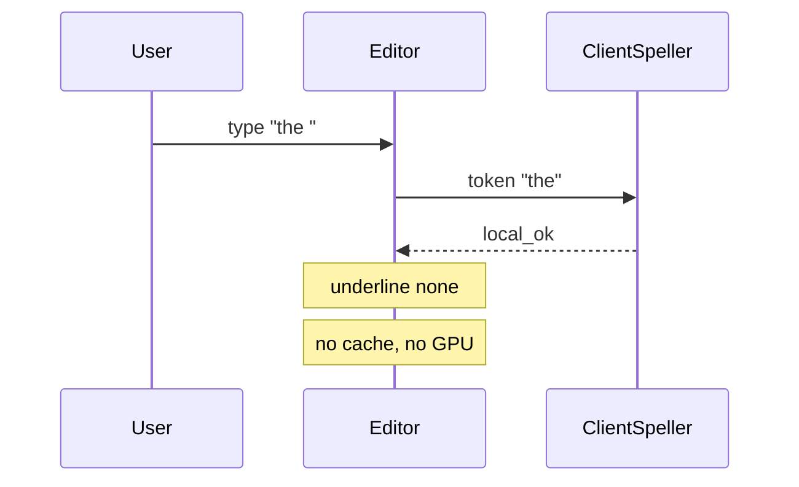
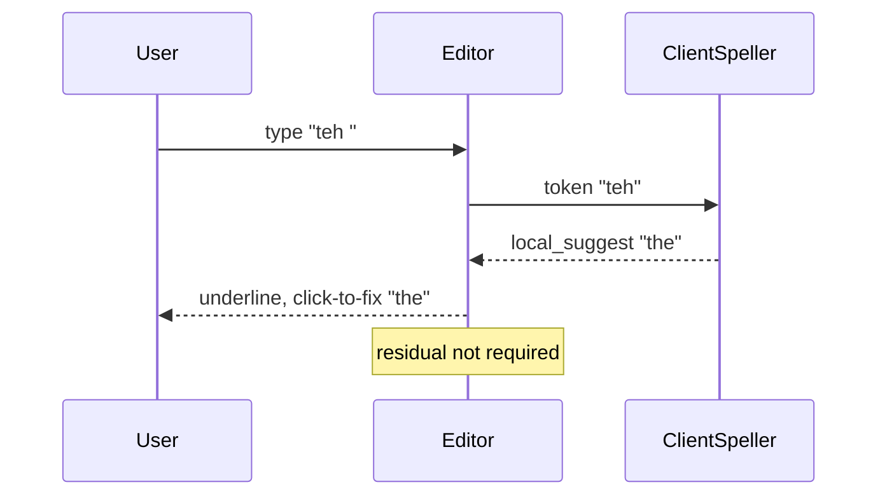
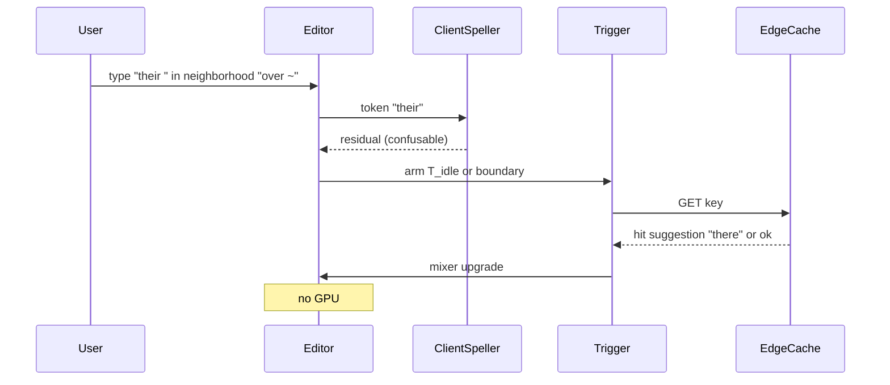
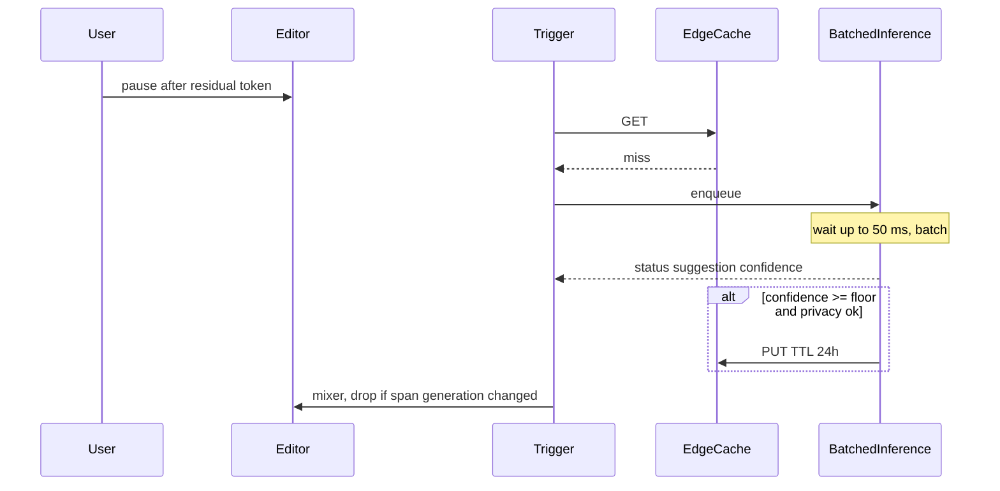
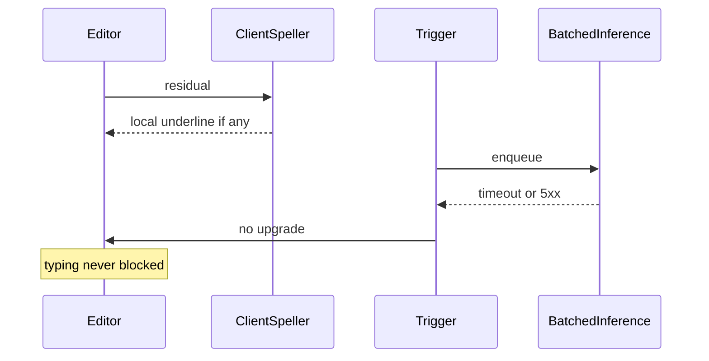

# Keystroke Spell-Checker Cost Redesign — System Design
> - **Document Status**: Draft
> - **Last Updated**: 2026 Aug 29
> - **Author**: Paul Serban

This document is the mechanical *how* for the system described in the [Architecture Document](./02_architecture_document.md). It specifies debounce triggers, cache keys, batching, the three request paths, and degraded modes. It does not specify code.

## 1. Control Flow

One token, three possible exits. The GPU is the last exit, not the default.

```mermaid
flowchart TD
    key[Key event]
    token[Update current token]
    local[Client Speller]
    class{"class"}
    paint[Paint local underline]
    arm[Arm debounce timer]
    fire{"boundary, punctuation, or idle T_idle?"}
    residual{"class is residual?"}
    cache[GET cache_key]
    hit{"hit and not expired?"}
    infer[Enqueue inference]
    mix[Mixer: maybe upgrade UI]
    dropLate[Drop if span changed]

    key --> token --> local --> class
    class -->|local_ok or local_suggest| paint
    class -->|residual or local_suggest that still wants context| arm
    arm --> fire
    fire -->|no| token
    fire -->|yes| residual
    residual -->|no| paint
    residual -->|yes| cache --> hit
    hit -->|yes| mix
    hit -->|no| infer --> mix
    mix --> dropLate
```

**Invariant:** `keydown` never enqueues inference or cache I/O. If a profiler shows cache GETs at keystroke rate, the trigger is wrong.

**\(T_{idle}\):** 400 ms is the working default. Rationale: typical inter-keystroke times while typing a word are 100–200 ms; 400 ms is "the user hesitated," not "the user is a slow typist on a long word." If Phase 0 shows p95 intra-word gaps near 400 ms, raise it. If product feels the contextual underline is late, lower it toward 250 ms *before* anyone proposes per-keystroke calls. Changing \(T_{idle}\) is a parameter; changing the trigger to `keydown` is a new architecture (a rejected one).

## 2. Debounce Mechanics

### What fires a residual request

| Trigger | Fires when | Why it exists |
| --- | --- | --- |
| Word boundary | Whitespace after a token | The word is complete. This is how desktop spell-check has always worked. |
| Punctuation | Token followed by `, . ! ? ; : )` etc. | Same as boundary; "end." is a word. |
| Idle | No key events on this token for \(T_{idle}\) | The user stopped mid-word (`seperate|`). Worth a residual check; they may be staring at it. |
| Explicit blur | Editor loses focus | Flush the last token. |

### What must not fire a residual request

| Event | Why not |
| --- | --- |
| `keydown` / `keypress` / `input` per character | Naive design. 100x is gone. |
| Every token in a paste | A paste is one user action. Window: spell-check locally in full; send at most \(R\) residuals (working: 20) from the pasted span, highest-uncertainty first. |
| Cursor movement that does not edit | Do not re-infer a word the user is only walking over. |
| IME composition (mid-composition) | Composition is not a token. Fire on composition end. |
| Undo/redo storms | Coalesce; one pass after the buffer settles. |

### Coalescing

Each token span (start offset, end offset, buffer generation) has at most one armed timer and at most one in-flight residual. Backspace inside the token: cancel in-flight, restart \(T_{idle}\). If inference returns for generation \(g\) and the buffer is on \(g+1\), drop the result. The mixer does not "apply it anyway" to a nearby word.

### Per-session cap

Working cap: **5 residual network requests per second per session**, burst 10. A held key or a buggy trigger that reverts to keystroke-rate dies here instead of at the GPU. Paste uses a separate budget (one burst of up to \(R\)).

## 3. Cache Key Design

The cache exists because typing errors are Zipf: a large fraction of residual misses are the same few thousand (word, neighborhood) pairs. The key must be **common enough to hit** and **specific enough not to poison**.

### Working key

```
model_version | lang | normalized_token | left_ctx | right_ctx
```

| Field | Rule |
| --- | --- |
| `model_version` | Serving pin. New model → new namespace. Do not serve model A's guesses under model B. |
| `lang` | Dictionary pack id, not Accept-Language guesswork. |
| `normalized_token` | Unicode NFKC, case-fold per language rules, strip a single trailing punctuation. Do not stem; stemming collides `run`/`running` into nonsense suggestions. |
| `left_ctx` / `right_ctx` | Up to **two** neighboring tokens each, normalized the same way. Empty allowed (start of buffer). |

### What is stripped before the key is built

- Runs of digits → `#` (so `invoice 1842` and `invoice 2991` share a key if the token is the error). If the *token itself* is mostly digits, do not cache (IDs, phones).
- Tokens matching email / URL / @handle shapes → do not cache that request at all.
- User id, document id, session id: **never in the key, never in the value**.

### Granularity trade-off

| Too coarse (token only) | Too fine (five-token verbatim window) |
| --- | --- |
| High hit rate | Near-unique keys, cache is dead |
| `their` → always `there`, even when `their` is right | Every document is a miss; you paid for a cache and got a log |
| Fleet-wide wrong-word incidents | GPU bill returns |

Two-token neighborhood is the working compromise. If Phase 3 hit rate is <40%, the key is too fine (or the residual stream is actually diverse — then cache will not save you, and debounce+client must carry the 100x). If poison incidents cluster on confusables, *narrow* the cache: confusables may be **inference-only, not cached**, which spends GPU to buy safety. That is allowed. See [ADR-003](./04_architecture_decision_records.md#adr-003).

### Value, TTL, population

| Field | Role |
| --- | --- |
| `suggestion` | Replacement token, or `ok` (no error). Caching `ok` matters: it prevents re-inferring `their` in a common neighborhood. |
| `confidence` | Model score. Below floor → do not put. |
| `expires_at` | Working TTL **24 h**. Short enough to bound a bad model day; long enough to be hot through a workday. |
| `hit_count` | Optional, for compiling hot keys into the client pack. |

Write-through on inference success. No read-through of user documents. No "learn from this user's accept" into the *global* cache in v1 — that is a poisoning API. Accept/reject telemetry may promote a key into a *reviewed* allow-list offline; it must not write the global cache from a single user's click.

## 4. Batching Mechanics

### Why batching exists only after the pivot

Interactive keystroke serving: the batch window is ~0. A 50 ms SLO means you ship whatever is in the queue *now*, usually size 1. That is the 50 QPS/GPU number.

Post-pause residual: the user already waited \(T_{idle}\) or a word boundary. An additional 100–200 ms of queue time is inside "suggestion after I stopped." Dynamic batching can sit for tens of milliseconds collecting work.

### Working serving parameters

| Parameter | Working value | Notes |
| --- | --- | --- |
| p95 end-to-end (queue + infer + RTT) | ≤ 250 ms | If RTT eats 100 ms, the GPU has 150 ms. Design for the editor's p95, not the model's self-reported latency. |
| Max batch wait | 30–50 ms | Do not wait the full 250 ms for a bigger batch. Shed instead. |
| Max batch size | whatever fills the GPU at the sequence length | Tiny prompts; this should be large. |
| Max generation | ~8 tokens | Spelling is not an essay. Hard cap. A model that "explains" is a bug. |
| Shed policy | return `no_suggestion` | Never a 2 s success. The mixer already has the client underline. |

**QPS/GPU working value: 400** at these budgets for a ≤7B distilled model, short sequences, quantized. If you cannot hit 200, the model is too big or the prompt is too long. Shrink those before adding GPUs. A 70B "for quality" is how you recreate the cost problem on the residual stream.

### Prompt (logical, not a string to copypaste)

Input: language, token, left/right neighborhood (same window as the cache key). Instruction: classify `ok` vs `error`; if error, emit the replacement token only. No chain-of-thought. No document.

Output: structured `{status, suggestion?, confidence}`. Unparseable → treat as miss, do not cache.

## 5. Sequences

### 3.1 Common word — client only, zero network



This must be the majority of tokens. If it is not, Phase 0 failed and you are about to buy GPUs for correctly spelled English.

### 3.2 Common non-word typo — client suggest, no GPU



A product choice: still send residual for "is this actually a name?" That choice is a QPS leak. v1 does **not** residual a high-confidence local non-word. Names that collide with typos are a known miss; users add to a personal dictionary (local, on-device).

### 3.3 Residual, cache hit



### 3.4 Residual, cache miss, batched inference



### 3.5 Inference down — fail open



## 6. Data Model (Logical)

Not SQL. Grain and invariants only.

### cache_entry

| Field | Role |
| --- | --- |
| cache_key | See §3. Primary key. Unguessable as a document: it is a normalized snippet, not a capability URL, but it is still potentially sensitive. Access logs of keys are a privacy surface. Sample them. |
| suggestion | Replacement or `ok`. |
| confidence | Below floor: row should not exist. |
| model_version | Must match serving pin for a GET to count as a hit. |
| created_at, expires_at | TTL. |
| hit_count | Optional, approximate. |

**Invariants:**
- No user_id column. If someone adds one "for personalization," they have built a keystroke store. Reject the PR.
- Puts without a model_version are invalid.
- `suggestion` length cap (working: 64 chars). A paragraph in this field is a model-gone-chatty bug.

### residual_request (ephemeral)

| Field | Role |
| --- | --- |
| request_id | For logs and traces, sampled. |
| span | Buffer generation + offsets. |
| cache_key | Built client-side or at the edge from the same spec. |
| class | Why it left the client (`confusable`, `oov`, `low_local_confidence`). |

Not persisted. A queue item, then gone.

### client_dictionary_pack

| Field | Role |
| --- | --- |
| lang, version | CDN object. |
| words / affixes | Hunspell-class. |
| confusable_list | Closed set that forces `residual` even when in-dictionary. |
| personal_dictionary | Per user, **on device**, not synced in v1 unless the product already has that sync. Syncing personal dictionaries is a product feature, not required for 100x. |

## 7. Privacy Mechanics

The cache key is the privacy design. Treat it as a small fingerprint of what someone typed.

**Allowed off-device:** normalized token + up to two normalized neighbors, after digit/PII stripping, no user id.

**Not allowed off-device on this path:**
- Full buffer / document.
- Keystroke timings (those are biometric-ish and useless for spelling).
- Unstripped emails, URLs, account numbers.
- "Prompts" stored for later eval at residual QPS. Eval uses a **curated set**, not a firehose of production keys.

**Logging:** default deny for raw keys. Metrics: counters by class, hit/miss, latency, shed rate, accept rate of *shown* suggestions (the suggestion was already on screen). If an incident requires a key, it is a sampled, access-controlled, short-TTL debug tap — not an always-on log pipeline.

## 8. Error Handling

| Failure | Where | What the system does | What it must not do |
| --- | --- | --- | --- |
| Dictionary pack missing | Client | No underlines, or last-known pack | Block typing; send every token to GPU "to compensate" |
| Client CPU budget exceeded | Client | Disable optional on-device neural; keep Hunspell | Move work to GPU to "help" the laptop |
| Debounce timer storms | Trigger | Per-session cap; log once | Disable the cap in production to "improve quality" |
| Cache timeout | Edge | Treat as miss | Retry loop; wait on cache to paint local underline |
| Cache poison report | Cache | Prefix/key delete; drop namespace if model-wide | "Hotfix" by teaching the model live from one ticket |
| Inference 5xx / timeout | Inference | `no_suggestion`; client underline stays | Retry 3x with backoff (that is a stampede) |
| Inference queue > budget | Inference | Shed | Let p95 become seconds |
| Paste of 10k words | Trigger | Local full pass; ≤R residuals | One request per token |
| Late result, span moved | Mixer | Drop | Auto-insert the suggestion |
| Feature flag "LLM on keydown" | Anywhere | Does not exist | A debug flag that is the naive design |

## 9. Observability (Minimum)

The Fermi table dies in Phase 0 only if these exist.

| Signal | Why |
| --- | --- |
| Tokens classified / sec by `local_ok`, `local_suggest`, `residual` | Replaces the 16x guess |
| Residual requests / sec (pre-cache) | Replaces the 6x debounce guess |
| Cache hit / miss / skip-privacy | Replaces the 3x guess |
| Inference QPS, batch size, p50/p95, shed rate | GPU plan |
| GPU utilization and $/hour | The actual bill |
| Suggestion shown → accepted / ignored / reverted | UX quality; the "materially hurting" clause |
| Typing hitch events (input-thread > X ms) | Client perf regression |
| Per-session residual rate histogram | Catch trigger bugs (a session at keystroke rate is a P0) |

**Do not:** log every cache key, every prompt, or every keystroke. Those dashboards are how this project becomes a surveillance system that also spell-checks.

## 10. What stays on the client (and what does not)

Still on the client: tokenization, dictionary, local candidates, debounce state, mixer, personal dictionary, the paint.

On the network: residual GET/miss only, after trigger, under cap.

On the GPU: cache misses of residuals, batched, sheddable.

If a new feature needs the full document on every pause, it is not this system. It is an explicit "rewrite" action with a different budget and a different consent story. Do not extend the prompt "a little" until it is the document. That is how the Fermi estimate comes back through the side door.
