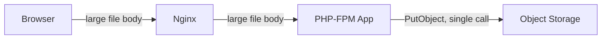
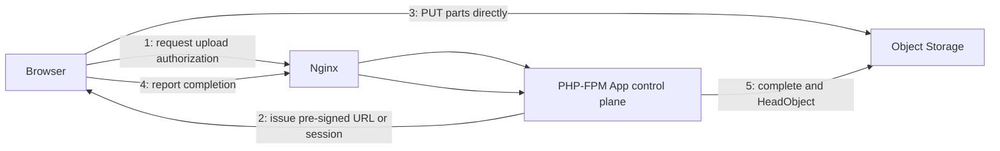
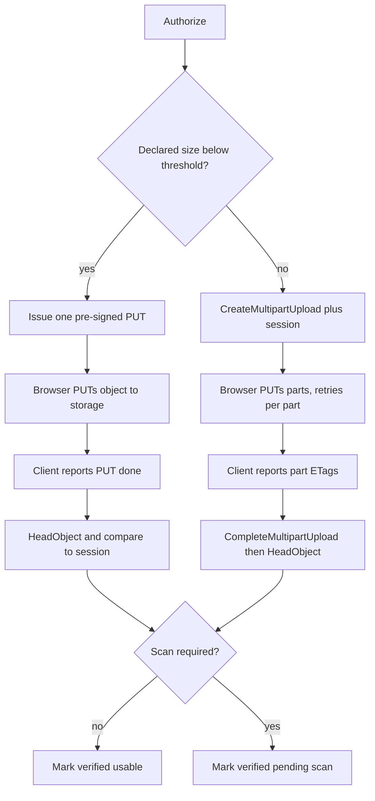

# Large File Upload Redesign — Architecture Document
> - **Document Status**: Draft
> - **Last Updated**: 2026 Aug 29
> - **Author**: Paul Serban

A control-plane redesign of file upload: the browser writes bytes directly to object storage using short-lived pre-signed URLs; nginx and PHP-FPM authorize, issue, and verify, and never hold the file. This document covers *what* the system is and *why* it is shaped this way; see [System Design](./03_system_design.md) for *how* the two upload flows, the session model, and verification actually work, and [Trade-offs and Honest Assessment](./05_tradeoffs_and_honest_assessment.md) for what those three words cost.

## Overview

**Brief description**: Upload infrastructure, scoped narrowly: take the file off the application data path. It is not a media platform, not a CDN, and not a general storage gateway.

**Business Context**
- See [Scenario and Requirements](./01_scenario_and_requirements.md) for the full framing. In short: large files fail intermittently because every hop on browser → nginx → PHP-FPM → storage has a size, time, memory, or concurrency limit that large transfers trip, and because "some people" is usually last-mile speed or shared-resource contention, not a cursed user account.
- Target users: owning engineer, on-call, security. Product consumes "object became usable."

## Requirements

### Functional Requirements

- **Authorize**: the system must decide, before any byte is written to storage, whether this principal may upload a file of the declared size and content-type, and must mint the object key itself.
- **Issue**: the system must return one pre-signed PUT (small) or a multipart session plus a way to obtain pre-signed URLs per part (large).
- **Transfer**: the browser must write to storage directly. nginx and PHP-FPM must not receive the file body.
- **Complete**: the client reports completion (single PUT: "I PUT it"; multipart: ordered part ETags). The server completes the storage-side operation and verifies.
- **Verify**: the object is not application-usable until server-side `HeadObject` (and checksum if required) matches what was authorized.
- **Quarantine / scan**: if malware or content scanning is a product requirement, the object stays unusable until an async scanner says so. Absence of a scanner is an explicit accepted risk, not an oversight. See [ADR-004](./04_architecture_decision_records.md#adr-004).
- **Cleanup**: abandoned multipart uploads and expired sessions must not accumulate as billed incomplete MPU parts. A storage lifecycle rule is the primary sweeper; an application janitor is backup.

### Non-Functional Requirements

**Performance Requirements:**
- Control-plane calls (authorize, sign-part, complete) are small JSON and must complete in ordinary PHP-FPM request time. They do not scale with file size.
- Data-plane throughput is the client's path to the storage region, not the app host's NIC. Designing for "faster PHP" is wasted motion once the file is off the path.
- Per-part retry is the reliability mechanism for large files. End-to-end retry from byte 0 is a last resort, not the happy path.

**Reliability Requirements:**
- **A failed part does not fail completed parts.** That is the point of multipart.
- **A crash of PHP-FPM during someone else's upload cannot affect that upload**, because PHP-FPM is not in the data path. A crash *during authorize or complete* is ordinary request failure and is retried as a small call.
- **The client's completion callback is not a source of truth.** The storage API is. See [ADR-003](./04_architecture_decision_records.md#adr-003).

**Infrastructure Constraints:**
- Existing stack stays: nginx, PHP-FPM, an object store that speaks S3 (AWS S3 or compatible). No new app language. No new proxy.
- CORS must be configured on the bucket for the application's origins. This is a real operational dependency, not a footnote. Without it, the browser will refuse the PUT and the redesign "doesn't work" in a way that looks like a client bug.
- Credentials that can sign URLs live in the environment/secret store the operator already has. The browser never sees long-lived storage credentials.

**The defining constraint:**
- The application process model (PHP-FPM workers, nginx temp disk, request timeouts) is sized for short requests. A large file is a long request. No amount of limit-raising makes a long request into a short one. The architecture is: **stop making the file a request body.**

## Executive Summary

The system is a **small control plane in front of object storage**. The scarce resource on the old path was worker time and local disk, consumed in proportion to file size and last-mile slowness. The new path consumes those resources in proportion to the number of authorize/complete calls, which is one or a few per upload, independent of bytes.

**Architecture Style:** Direct-to-storage upload (pre-signed URLs) with a server-side session for multipart. Not a streaming ingest service, not a tus server, not a storage gateway.

**Key Components:**
- **Upload Authorization API**: existing PHP-FPM app; authn/authz, quota, content-type, size class; mints object key; opens a session.
- **Pre-signed URL Issuer**: wraps the storage SDK; produces single-PUT URLs or per-part URLs with short expiry.
- **Upload Session store**: tracks session id, owner, key, multipart upload id, status, expiry, expected size/type.
- **Completion / verification**: `CompleteMultipartUpload` or `HeadObject`; compare against the session; mark usable or reject.
- **Async malware scan** (if required): storage event → scanner; object quarantined until clean.
- **Lifecycle rule**: abort incomplete multipart uploads after N days.

**Technology Stack:**
- App: existing PHP-FPM behind nginx (control plane only).
- Storage: S3 or S3-compatible; multipart upload API; bucket CORS; lifecycle configuration.
- Client: browser uploader that can PUT/POST to storage and retry a failed part. This is new client complexity. It is not optional. See [Trade-offs](./05_tradeoffs_and_honest_assessment.md).

**Architecture Principles:**
- **The app is not a proxy.** If a byte of user file content hits PHP-FPM, the design has regressed.
- **Authorize at issue time; verify at complete time.** Nothing in between is trusted.
- **Short-lived capabilities, not long-lived credentials.** A pre-signed URL is a time-boxed write permit for one key.
- **Size class selects protocol.** Small files do not pay multipart ceremony. Large files do not use a single PUT.
- **Limits on nginx/PHP become moot for the file, not "tuned."** `client_max_body_size` still exists for other POSTs. It is no longer the upload architecture.

**Key Architectural Decisions:**
1. **Pre-signed URLs / direct-to-storage over proxy-through-app.** [ADR-001](./04_architecture_decision_records.md#adr-001).
2. **Multipart above a size threshold; single PUT below.** [ADR-002](./04_architecture_decision_records.md#adr-002).
3. **Server-side post-upload verification, not trust of the client callback.** [ADR-003](./04_architecture_decision_records.md#adr-003).
4. **Async post-upload scanning with quarantine, not synchronous inspection on the proxy path.** [ADR-004](./04_architecture_decision_records.md#adr-004).
5. **Short-lived URLs plus lifecycle cleanup of abandoned MPUs.** [ADR-005](./04_architecture_decision_records.md#adr-005).

### Context Diagram — current path (the anti-pattern)

Every arrow labeled "large file body" is a timeout, a size limit, a disk buffer, or a worker occupancy. Three serial legs.

### Context Diagram — target path

Arrows 1, 2, 4, 5 are small. Arrow 3 is the file, and it does not touch nginx or PHP-FPM.

## Runtime Architecture

1. **Authorize layer** (PHP-FPM, milliseconds to tens of milliseconds): authenticate the user, enforce quota and allowed types, choose single-PUT vs multipart from declared size, mint key, persist session, return URL(s) or a session id plus the first batch of part URLs.
2. **Data layer** (browser ↔ storage, duration proportional to bytes and last mile): PUT the object or the parts. Retry a failed part. The app is not in this loop.
3. **Complete layer** (PHP-FPM, small): receive part list / "PUT done", call storage to complete if multipart, `HeadObject`, compare to session, mark `verified` or `rejected`.
4. **Scan layer** (async, optional, seconds to minutes): storage event triggers scanner; result flips session to `usable` or `quarantined`.
5. **Janitor layer**: storage lifecycle aborts incomplete MPUs; a periodic app job expires sessions that never completed.

Once the file no longer flows through them, nginx `client_max_body_size` / body timeouts and PHP-FPM `upload_max_filesize` / `memory_limit` / `request_terminate_timeout` **stop being the upload fix**. They remain relevant to other endpoints. Treating "raise the limits" as the architecture is how the next 2 GB file becomes next quarter's incident.

### Small-file (single PUT) vs large-file (multipart)

## Components

### 1. Upload Authorization API
**Purpose**: Be the only place a human identity is mapped to a write permit.

**Responsibilities:**
- Authenticate the caller (existing session / token — this document does not invent an IdP).
- Authorize: this principal, this content-type, this declared size, this quota remaining.
- Mint the object key (unpredictable, scoped, not client-chosen).
- Persist an `upload_session` row.
- Choose protocol from size vs threshold.
- Return either a single pre-signed URL or a session id (multipart) plus signing capability for parts.

**Interactions:**
- Reads: identity, quota, policy.
- Writes: `upload_session`.
- Calls: storage `CreateMultipartUpload` when above threshold (server-side; the client does not create the MPU).
- Does not accept a file body. If the route still has a `$_FILES` handler, it is the old path and must be flagged off.

### 2. Pre-signed URL Issuer
**Purpose**: Turn "this session may write this key" into a time-boxed URL the browser can use without storage credentials.

**Responsibilities:**
- Sign PUT (single object) or PUT (one part) with expiry on the order of minutes.
- For presigned POST (if used instead of PUT): attach policy conditions for `content-length-range` and `Content-Type`.
- Never return a URL that can write a different key, a larger object than authorized, or that outlives the session by hours.

**Interactions:**
- Called by Authorization API and by a "sign next parts" endpoint on the same app.
- Uses the app's storage credentials. Those credentials never leave the server.

### 3. Upload Session store
**Purpose**: Be the application-side memory of an upload that now happens somewhere else. Previously the HTTP request *was* the state. That state is gone; this row replaces it.

**Responsibilities:**
- Hold session identity, owner, object key, protocol (single vs multipart), `multipart_upload_id` if any, expected size and content-type, status, timestamps, expiry.
- Hold part records (part number, ETag, size) as the client reports them, or as the complete call submits them.
- Expire: a session that is not completed before `expires_at` cannot be completed later without a new authorize.

**Interactions:**
- Written by Authorization API, part-sign endpoint (optional touch), Completion step, scanner callback, janitor.
- Read by Completion, by "is this object usable" checks elsewhere in the app.

### 4. Completion / verification
**Purpose**: Make "the client says it is done" into "storage has an object we agreed to."

**Responsibilities:**
- Multipart: call `CompleteMultipartUpload` with the ordered ETags. Fail the session if storage rejects the complete (missing part, wrong ETag).
- Single PUT: do not trust the client's 200; `HeadObject` and compare `Content-Length` / `Content-Type` / checksum to the session.
- After multipart complete, still `HeadObject` — complete succeeding is not the same as "the object is the size we authorized."
- Transition status: `pending` → `verified` → (`usable` | `pending_scan`). Reject mismatches; do not mark usable.

**Interactions:**
- Reads: session, part list.
- Calls: storage Complete + Head.
- Writes: session status; may write an application-level "file" record only after verified.

### 5. Async malware / content scan
**Purpose**: Replace the inspection that used to be possible (in theory) while bytes transited PHP. Most proxy-through-app designs did not actually scan; if this one did, this component is mandatory before cutover. If it did not, this component is still the honest replacement for "we could have."

**Responsibilities:**
- Trigger on object-created (storage event / queue), not on a PHP request.
- Write scan result onto the session (or a scan table).
- Keep the object non-usable until clean, or delete/quarantine on dirty.
- Fail closed: a scanner outage leaves objects in `pending_scan`, not `usable`.

**Interactions:**
- Reads: object bytes from storage (the scanner, not PHP-FPM).
- Writes: session scan status.

### 6. nginx (after redesign)
**Purpose**: Terminate TLS and reverse-proxy the *control plane*, as it already does for the rest of the app.

**Responsibilities:**
- Proxy small JSON authorize/complete calls.
- CORS for the app origin is an application/nginx concern for those JSON calls; CORS for the *bucket* is a bucket concern and is not nginx's job.
- Must not be configured to receive the file body on the upload routes. If a legacy POST-the-file route remains during rollout, it is explicitly the old path and is time-boxed. See [Phased Implementation Plan](./06_phased_implementation_plan.md).

### Communication Patterns

**Synchronous (small):**
- Browser ↔ PHP-FPM: authorize, sign-part, complete.
- PHP-FPM ↔ storage: `CreateMultipartUpload`, `CompleteMultipartUpload`, `HeadObject`, optionally `AbortMultipartUpload`.

**Synchronous (large, not through the app):**
- Browser ↔ storage: PUT object / PUT parts.

**Asynchronous:**
- Storage event → scanner.
- Clock: lifecycle abort of incomplete MPUs; app janitor of expired sessions.

## Scaling Strategy

**Current Scale Requirements:**
- Whatever the product already uploads, plus "large" as defined by the failures (tens to hundreds of MB, possibly GB). Concurrent uploads are the old path's killer; the new path's concurrency lives on storage, which is built for it.

**What does not need to scale:**
- PHP-FPM worker count, for uploads. Control-plane calls are short. Do not size the pool for in-flight bytes.
- App-host disk. If upload temp disk is still a capacity plan after this redesign, the file is still on the path.

**What is already at a different scaling ceiling:**
- Storage request rates and MPU part counts (S3: 10,000 parts max, minimum part size 5 MB except the last). The client must respect these. This is a protocol constraint, not an app-host constraint.
- Pre-signed URL issuance rate. Negligible at human-upload volumes. Not a reason to introduce a new service.

**If upload volume grows (many concurrent multi-GB files):**
- The architecture still holds. Tune part size and client parallelism. Do not put PHP back in the data path. Do not build a custom chunked protocol to feel like you scaled.

**Bottleneck Analysis:**
- Primary bottleneck after redesign: the client's last mile to the storage region. That is the correct bottleneck. It was always the user's network; it was previously disguised as an origin outage.
- Secondary: CORS, clock skew on signatures, and "forgot to CompleteMultipartUpload" — operational, not throughput.
- Tertiary: scanner lag, if scanning is required. Usable-latency becomes scan-latency. Product must know that.

## Data Architecture

### Data Model

**Key Entities:**
- **UploadSession**: id, owner, object_key, protocol (`single_put` | `multipart`), multipart_upload_id, expected_content_type, expected_max_size, status (`pending` | `verified` | `pending_scan` | `usable` | `rejected` | `expired` | `aborted`), created_at, expires_at, completed_at.
- **UploadPart**: session_id, part_number, etag, size_bytes, reported_at.
- **ScanResult** (if scanning exists): session_id / object_key, status (`clean` | `dirty` | `error`), scanned_at.
- **UsableFile** (application record, out of this project's schema but gated on it): created only from a session in `usable`.

**Entity Relationships:**
- One session has zero or many parts (zero for single PUT).
- One session has at most one successful complete.
- One session maps to one object key. Keys are not reused across sessions.

### Data Lifecycle

**Create**: session at authorize; parts as reported; object bytes at storage on PUT.

**Read**: complete/verify; "may this user read this file" is a different path (pre-signed GET, CloudFront, etc.) and is out of scope except that it must not point at `pending` / `quarantined` objects.

**Update**: status transitions only forward, except a documented abort.

**Delete**: rejected / dirty objects deleted or moved to a quarantine prefix. Expired incomplete MPUs aborted by lifecycle. Session rows retained long enough to debug "I uploaded it and it vanished" tickets — days, not years, unless compliance says otherwise.

## Cost Analysis

### Cost Components

**Money:**
- Storage PUT/MPU request costs and bandwidth: the bytes always had to land in storage. Direct upload *removes* app-host egress of the same bytes (you were paying to ingest from the user and egress to S3). Direct upload is usually cheaper in transfer, slightly chatty in request count (one PUT per part).
- Incomplete MPU storage: billed until aborted. Lifecycle rules are cost control, not hygiene theater.
- Scanner: if you add one, it is the real new bill. Do not pretend pre-signed URLs include scanning.

**Engineering time — the actual cost:**
- Client uploader: chunking, part retry, progress, complete call, CORS debugging. This is most of the project. The server side is small.
- CORS, IAM, bucket policy, lifecycle: a day of "why does the browser say failed" if anyone hand-waves them.
- Session/janitor/verify: a few days, including the tests for "client lied."

**Risk cost of skipping verification:**
- A client that PUTs a 10 GB object to a URL issued for 50 MB (if the signature did not constrain size) — or PUTs a different type — becomes your storage bill and your content-safety incident. Constraining the URL and verifying with `HeadObject` is cheaper than that incident.

### Cost Optimization

- Single PUT below the threshold so 1 MB avatars are not 8 MPU API calls.
- Part size large enough to stay under 10,000 parts, small enough that a retry is cheaper than the whole file (typical: 8–16 MB, not 5 MB minimum-for-its-own-sake and not 100 MB if last-mile is bad).
- Lifecycle abort of incomplete MPUs (e.g. 1–7 days).
- Do not run a second copy of the file through PHP "just to scan it." That reintroduces the anti-pattern. Scan in-place or via storage events.

## Risks and Mitigation

| Risk | Likelihood | Impact | Mitigation Strategy | Owner |
| --- | --- | --- | --- | --- |
| CORS misconfigured; browsers fail all PUTs | High at first cut | High | Phase 1 on a subset with a known origin list; treat CORS as a gate, not a follow-up | Owning engineer |
| Pre-signed URL leaked and used until expiry | Medium | Medium | Minutes-not-hours expiry; key is unguessable; content-length-range / content-type conditions; verify at complete | Issuer + Complete |
| Client skips CompleteMultipartUpload; parts sit billing | Medium | Medium | Lifecycle rule; complete is server-side once the client sends ETags; janitor aborts expired sessions | Storage + janitor |
| Object larger or different type than authorized | Medium | High | Policy conditions on the URL; HeadObject compare; reject session | Complete |
| Malware lands in the bucket because the app no longer sees bytes | High if no scanner | High | [ADR-004](./04_architecture_decision_records.md#adr-004): quarantine-until-clean; do not cut over the old path's scan (if any) until this exists | Security + owning engineer |
| Clock skew invalidates signatures | Low | Medium | NTP on app hosts; avoid expiry of 30 seconds; 5–15 minutes is the realistic window | Ops |
| Multipart part-size / 10k-part limit exceeded | Low if threshold and part size are documented | High | Server computes part size from declared size; client must use it | Authorization API |
| Old proxy path left open indefinitely | High without a gate | High | Phase 3 time-box; kill criterion if traffic does not drain | Phased plan |
| Small-file UX worse than a form POST | Medium | Medium | Keep single PUT for small files; do not force multipart ceremony on avatars | [ADR-002](./04_architecture_decision_records.md#adr-002) |
| Observability: app no longer sees transfer errors | High | Medium | Client-side telemetry for part failures; storage access logs; do not expect PHP error logs to explain a failed PUT | On-call |
| "Some people" still fail: last-mile, not origin | High | Low (correct diagnosis) | Per-part retry; this is now actually their network; do not revert to proxy to "fix" it | Product / support |

## Future Enhancements

### Phase 1 (current design)
**Focus**: Diagnose, then put small files on a single pre-signed PUT beside the old path. See [Phased Implementation Plan](./06_phased_implementation_plan.md).

### Phase 2
**Focus**: Multipart for large files, per-part retry, session tracking, lifecycle abort.

### Phase 3
**Focus**: Cut over. Old path becomes a time-boxed fallback.

### Phase 4
**Focus**: Scanner + quarantine, verification enforced, old route removed.

### Technical Debt (accepted)

- A custom resumable protocol (tus, etc.) is not started. If product later requires cross-session resume, that is a new ADR, not an inevitable next step.
- Scan latency becomes user-visible if scanning is required. A progress UI that says "uploaded" before "usable" is product copy, not architecture.
- PHP-FPM remains the control plane. Replacing it is unrelated to this problem.
- Bucket CORS is an operational artifact that will break on a new frontend origin. Document the origin list next to the bucket config in ops notes; this project does not invent a CORS management platform.
