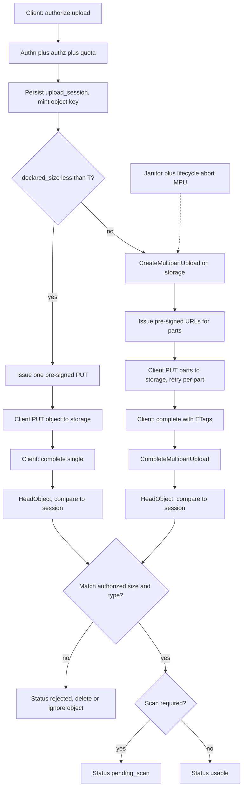
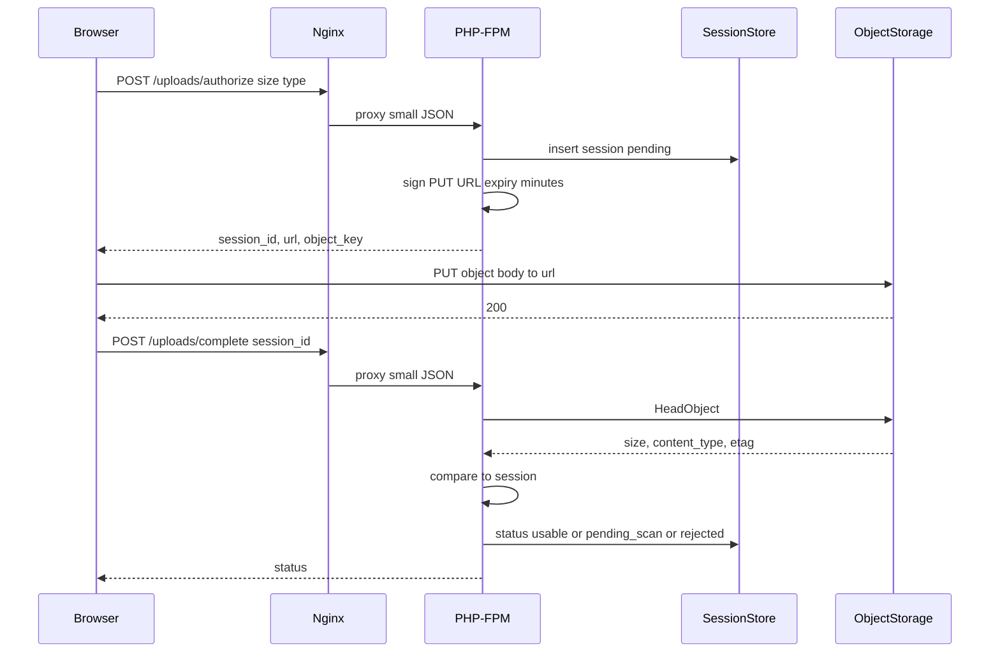
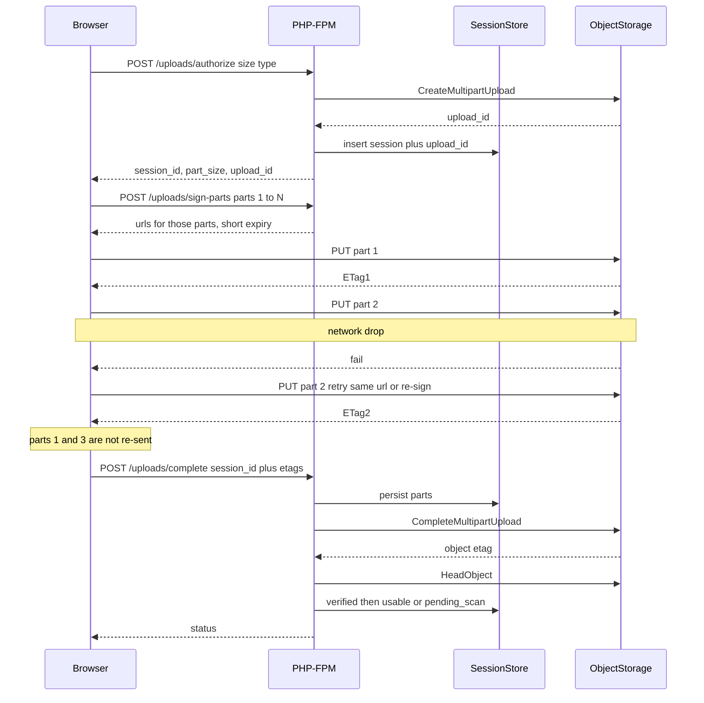
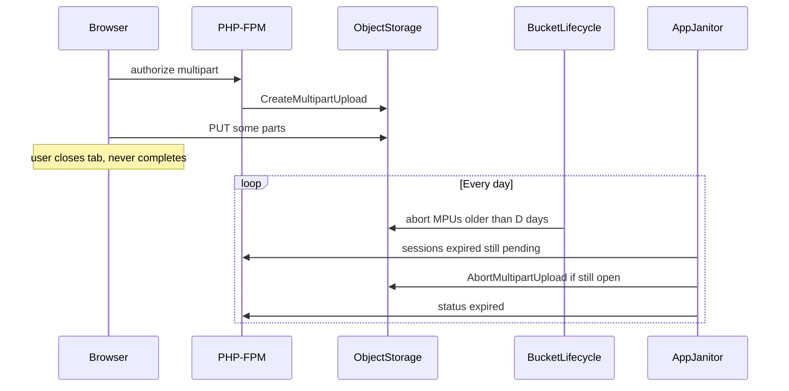

# Large File Upload Redesign — System Design
> - **Document Status**: Draft
> - **Last Updated**: 2026 Aug 29
> - **Author**: Paul Serban

This document is the mechanical *how* for the system described in the [Architecture Document](./02_architecture_document.md). It specifies the size-class threshold, the two upload sequences, the session model, security constraints on pre-signed URLs, and post-upload verification. It does not specify code.

## 1. Control Flow

Two protocols, one authorization entry point. Size class is chosen from the **declared** size at authorize time. The client does not pick the protocol.

**Invariant:** PHP-FPM never receives the file body. If `$_FILES` is populated on these routes, the design has failed.

**Threshold T:** 64 MB is the working default. Rationale is in [ADR-002](./04_architecture_decision_records.md#adr-002). It is a design parameter, not a product setting. Changing it does not require a new architecture; it requires a decision that single PUT is still safe at the new T on real last-mile and storage SDK timeouts *from the browser*, which is a different clock than PHP's old clock.

## 2. Size Class and Part Geometry

### Single PUT (declared_size < T)

- One pre-signed URL, method PUT (or POST with a policy — pick one and do not mix per session).
- Client uploads the whole object. A failure retries the whole object. That is acceptable below T.
- Server does not call `CreateMultipartUpload`.

### Multipart (declared_size ≥ T)

- Server calls `CreateMultipartUpload`, stores `multipart_upload_id` on the session.
- Part size **P** is chosen by the server from declared size so that:
  - `ceil(declared_size / P) ≤ 10000` (S3 part count cap).
  - `P ≥ 5 MB` except the last part (S3 minimum).
  - A failed part is cheaper to retry than the whole file. Working default: **16 MB**, unless declared size would exceed 10,000 parts at 16 MB, in which case P is raised. At 16 MB, 10,000 parts is 160 GB. If the product needs larger, raise P; do not invent a second protocol.
- Client must use the server's P. A client that invents its own part size will fail `CompleteMultipartUpload` or violate the minimum. Treat that as a client bug, not a reason to "be flexible."
- Parallelism: the client *may* PUT several parts concurrently. Cap concurrency on the client (e.g. 3–4). Unlimited parallelism from a browser on a bad last mile makes things worse, not better.
- Signing: either issue all part URLs at authorize time (simple, all URLs share the same short expiry — bad for multi-hour uploads) or issue URLs in batches via a `sign-parts` call (URLs stay short; the session can last longer than one URL). **Batch signing is the default for multipart** so a 2 GB upload is not racing a 15-minute URL issued at t=0. See [ADR-005](./04_architecture_decision_records.md#adr-005).

## 3. Sequences

### 3.1 Small file — single pre-signed PUT

If the PUT never happens, complete's `HeadObject` 404s and the session stays pending until expiry. Do not mark usable on "client said 200."

### 3.2 Large file — multipart, with one part failure and retry of that part only

**Re-sign on retry:** if the part URL expired during the outage, the client calls `sign-parts` for that part number only and retries. Completed parts are not re-uploaded.

**What the client must not do:** start a new authorize (new MPU) because one part failed. That abandons the previous MPU and is how incomplete-MPU bills grow.

### 3.3 Abandoned upload — lifecycle cleanup

Lifecycle is the primary sweeper (works even if the app is down). The janitor is backup and keeps the session table honest. D is in the 1–7 day range; shorter than 1 day punishes a user who started a large upload overnight; longer than 7 days is a storage bill.

## 4. Data Model (Logical)

Not SQL. Grain and invariants only.

### upload_session

| Field | Role |
| --- | --- |
| id | Primary key; issued to the client; unguessable. |
| owner_id | Principal who was authorized. Complete must be the same principal. |
| object_key | Server-minted. Not client-supplied. Unique. |
| protocol | `single_put` \| `multipart`. |
| multipart_upload_id | Storage's MPU id; null for single PUT. |
| expected_content_type | From authorize. Compared at HeadObject. |
| expected_max_size | From authorize. HeadObject size must be ≤ this (and, if a min was declared, ≥ min). |
| status | `pending` → `verified` → `pending_scan` or `usable`; or `rejected` / `expired` / `aborted`. Forward only except abort. |
| created_at, expires_at, completed_at | Session TTL is independent of URL TTL. Session may be hours (large file); each URL is minutes. |
| checksum_algo / checksum_expected | Optional. If the client declared a checksum at authorize, verify it at complete (storage checksum headers or a post-complete checksum API). If not declared, do not invent a comparison. |

**Invariants:**
- One row per in-flight upload. A retry of *authorize* creates a new session and a new key, and should abort the old MPU if the client is replacing an abandoned attempt for the same user intent — optional v1; do not block on it.
- `usable` requires verification. `pending_scan` is verified-but-not-usable.
- Application file records are not this table. They are created from `usable` sessions only.

### upload_part

| Field | Role |
| --- | --- |
| session_id | FK. |
| part_number | 1-based, contiguous at complete time. |
| etag | From storage's PUT-part response; required by CompleteMultipartUpload. |
| size_bytes | As reported; last part may be < P; others should equal P. |
| reported_at | When the client submitted this ETag (at complete, or incrementally). |

**Invariants:**
- ETags are opaque strings from storage. Do not recompute them in PHP from bytes you do not have.
- Complete sends parts sorted by part_number. Gaps are a client error; fail the complete; do not invent parts.

## 5. Security Mechanics

Authorization is decided at URL-issuance time. The data path has no application session cookie (the browser is talking to storage, not to you). That is the whole security-model change.

### Pre-signed URL constraints

- **Expiry:** 5–15 minutes per URL. Not 7 days. Not 30 seconds (clock skew). See [ADR-005](./04_architecture_decision_records.md#adr-005).
- **Key:** bound in the signature. A leaked URL writes *that* key, not an arbitrary prefix, if the IAM that signed it is scoped and the signature includes the key (standard pre-signed PUT).
- **Size:** for presigned POST, `content-length-range` in the policy. For presigned PUT, S3 does not always enforce a max size the way POST policies do — **this is a real gap**. Mitigation: keep PUT URLs short, `HeadObject` at complete, delete/reject if size exceeds `expected_max_size`. Do not pretend a pre-signed PUT is a perfect quota enforcer. If the product must hard-cap bytes on the wire, prefer presigned POST with `content-length-range`, or use S3 Object Lambda / bucket policies where they actually constrain Content-Length (verify against current S3 behavior in Phase 0; do not document a constraint S3 does not enforce).
- **Content-Type:** include in the signed headers (PUT) or POST policy. Browser must send the matching header. A mismatch is a 403 from storage, which is the desired failure.
- **Who can use the URL:** anyone who holds it, until expiry. Treat it like a capability token. HTTPS, short TTL, unguessable key, do not log full URLs, do not put them in query strings that hit analytics.

### CORS on the bucket

- Allowed origins: the application's exact frontend origins, not `*`.
- Allowed methods: `PUT`, `POST` (if POST policy), `HEAD` if the client probes.
- Allowed headers: those the client will send (`Content-Type`, and any signed headers).
- Expose headers: `ETag` is required for multipart; browsers hide `ETag` unless exposed. Forgetting this looks like "multipart is broken."
- Max-Age: long enough that preflight is not per-part. Preflight per part on a 200-part upload is a self-inflicted outage.

### IAM

- The app role can: `s3:PutObject` (or the MPU family: `CreateMultipartUpload`, `UploadPart`, `CompleteMultipartUpload`, `AbortMultipartUpload`), `s3:GetObject` / `HeadObject` on the upload prefix, `s3:ListBucketMultipartUploads` if the janitor needs it.
- The app role cannot: `s3:*` on `*`. The prefix is `uploads/` or similar, separate from the rest of the bucket if the bucket is shared.
- There is no IAM user whose keys are shipped to the browser. A "temporary browser credential" via STS is an alternative design; it is not this one. Pre-signed URLs are enough. STS in the browser is more moving parts for the same capability.

### Replay and confuse-deputy

- Replaying a PUT of the same part with the same URL is idempotent enough (same bytes → same ETag; different bytes → different ETag and complete may fail or accept the later part depending on timing). Complete uses the ETags the *authorized client* submitted. A third party with a leaked part URL can overwrite a part until expiry; short TTL is the mitigation; verification of total size is the backstop.
- Complete is authenticated to the app (cookie/token), not to storage. A third party with only a storage URL cannot mark the session usable.

## 6. Verification Mechanics

The client's completion report cannot be trusted. Procedure after the client calls complete:

1. **Load session.** Wrong owner → 403. Unknown id → 404. Status not `pending` → idempotent return of current status (do not CompleteMultipartUpload twice).
2. **Protocol branch.**
   - Single PUT: `HeadObject` on `object_key`. 404 → 409/425 "not present"; session stays pending.
   - Multipart: persist submitted parts; call `CompleteMultipartUpload`. Storage error → 409 with the error; session stays pending so the client can retry complete (complete is reasonably idempotent if the same parts are sent; if storage says "already completed," HeadObject and continue).
3. **HeadObject** (always, including after MPU complete).
4. **Compare:**
   - `Content-Length` ≤ `expected_max_size` (and ≥ min if you collected one).
   - `Content-Type` equals `expected_content_type` (be explicit about whether storage stores the signed header; if Head shows `binary/octet-stream` because the client omitted the header, that is a fail or a client bug to fix, not a reason to skip the check).
   - Checksum if one was declared.
5. **Mismatch:** set `rejected`. Best effort `DeleteObject` (or leave for a sweeper). Do not create an application file record.
6. **Match:** set `verified`. If scanning is required, set `pending_scan` and return that to the client ("uploaded, not yet available"). If not, set `usable` and create the application file record.

**Idempotency of complete:** the client will double-submit. The second complete must not fail the session. Gate on status.

## 7. Error Handling

| Failure | Where | What the system does | What it must not do |
| --- | --- | --- | --- |
| Authorize 401/403 | App | No session, no URL | Issue a URL "anyway" |
| Quota exceeded | App | 429 or 403 with a stable code | Issue URL and hope complete rejects |
| CORS preflight fail | Browser / bucket | Client error; ops fixes CORS | Proxy the file through PHP to "unblock" |
| Part PUT 403 expired | Storage | Client re-signs that part, retries | New MPU |
| Part PUT network drop | Storage | Retry that part | Retry parts that already have ETags |
| Complete with gaps | App | 400, session pending | Pad empty parts |
| HeadObject size too large | App | rejected, delete | Mark usable and "fix later" |
| Scanner dirty | Scanner | quarantined / deleted; never usable | Serve the object because "it uploaded fine" |
| Scanner down | Scanner | stay pending_scan; alert | Auto-mark usable after a timeout unless product explicitly accepts that risk in writing |
| Abandoned MPU | Lifecycle | Abort after D days | Monthly human script as the only sweeper |
| Old proxy path still receiving files | nginx / app | Phase 3 drain; then 410 | Silent dual-write forever |

PHP-FPM timeouts and `client_max_body_size` are **not** in this table for the new path. If they appear in an incident on the new path, the file is back on the data path.

## 8. Observability (Minimum)

The app no longer sees the transfer. If on-call only has PHP error logs, large-upload failures become "client says it failed, we see nothing." Minimum:

- **App:** authorize count, complete count, complete failures by reason (not present, size mismatch, MPU complete error), session age at complete, sign-parts count.
- **Client telemetry (opt-in, sampled):** part duration, part retries, CORS errors. This is the only view of last-mile. Without it, "only some people" returns as a ghost.
- **Storage:** server access logs / metrics for 4xx on the upload prefix.
- **Do not log full pre-signed URLs.** They are credentials.

## 9. What stays on nginx / PHP (and what does not)

Still on nginx/PHP: cookies, JSON authorize/complete, ordinary `client_max_body_size` for JSON (a few MB is plenty).

Not on nginx/PHP: the file. `upload_max_filesize` is irrelevant to this design. Do not raise it as part of this project except to keep the *old* path alive during Phases 1–3. Raising it is not a substitute for Phase 2.
