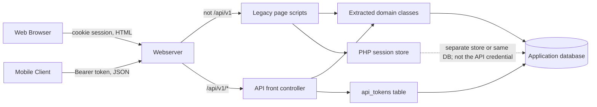
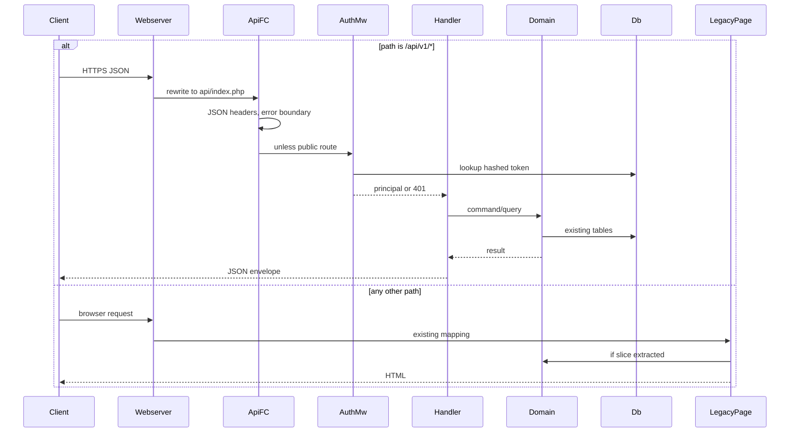
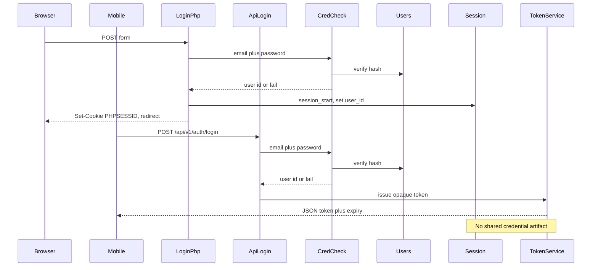

# Legacy PHP API Strangler — Architecture Document
> - **Document Status**: Draft
> - **Last Updated**: 2026 Aug 29
> - **Author**: Paul Serban

A framework-less PHP 8 HTML application must grow a JSON API for a mobile client without a rewrite and without breaking existing pages. The architecture is a **strangler-fig at the HTTP edge**: a new front controller owns `/api/v1`, extracted domain classes become the only shared brain, PHP sessions stay on the web, and mobile authenticates with opaque bearer tokens. This document covers *what* the system is and *why* it is shaped this way; see [System Design](./03_system_design.md) for *how* routing, extraction, tokens, errors, and tests actually work, and [Trade-offs and Honest Assessment](./05_tradeoffs_and_honest_assessment.md) for what this costs and when extraction is the wrong move.

## Overview

**Brief description**: Two PHP entry points, one database, one gradually extracted domain. The old entry point keeps rendering HTML the way it always has. The new one speaks JSON. They meet only in classes that have no `echo`.

**Business Context**
- See [Business Overview](./01_business_overview.md) for the full framing. In short: the templates *are* the domain, there are no tests, and a second client cannot wait for a clean rewrite.
- Target users: owning engineer, mobile client team, incumbent web users. The web users are a constraint, not a migration audience.

## Requirements

### Functional Requirements

- **API surface**: HTTPS JSON under `/api/v1`, including `GET /health`, `POST /auth/login`, `POST /auth/logout` (revoke current token), and resource endpoints that exist only after their vertical slice is extracted.
- **Legacy surface**: existing page URLs continue to resolve to the same scripts they do today. No requirement to introduce a router on the web side.
- **Shared domain**: extracted classes implement query + calculation + authorization-relevant rules for a slice. HTML templates and API handlers both call those classes after extraction.
- **Auth**: web continues to use PHP sessions. API uses bearer tokens issued after the same credential check the web login uses. Tokens are revocable.
- **Errors**: API responses use a single error envelope and HTTP status codes that mean what they say.
- **Versioning**: `/api/v1` is the contract a shipped mobile binary can pin to.

### Non-Functional Requirements

**Performance Requirements:**
- The API is not being designed for a traffic spike the HTML app could not already survive. Same app servers, same database. If the HTML app is already one query from collapse, the API will not save it; it will add a second client to the same queries. See [Risks](#risks-and-mitigation).
- Extraction must not add a mandatory extra network hop. Domain classes are in-process PHP, not a new service.

**Reliability Requirements:**
- **HTML behavior is the regression SLA.** A green API test suite with a red golden-master on a touched page is a failed change.
- **API failure isolation**: a fatal error in an API handler must not take down the PHP-FPM pool in a way the HTML app does not already risk. More importantly, API error handling must not be allowed to leak into the web SAPI's global error handlers. Handlers are installed per entry point.
- **Token store availability**: if the `api_tokens` table is down, the API cannot authenticate. The website must still log in via sessions. That independence is load-bearing.

**Infrastructure Constraints:**
- PHP 8 on whatever already serves the HTML app (PHP-FPM + nginx/Apache is the assumed shape; IIS is fine if that is what is there).
- Composer and PSR-4 are introduced **for new code only** ([ADR-006](./04_architecture_decision_records.md#adr-006)). Legacy `include` graphs stay.
- One relational database already used by the app. New table: `api_tokens`. No new datastore required for v1.
- PHPUnit and an HTTP golden-master harness are new CI dependencies. They are not optional "later."

## Executive Summary

The system is a **strangler-fig API beside a page-based monolith**, not a retrofit of JSON into `orders.php`.

**Architecture Style:** Strangler fig at the edge + extract-till-you-drop (Fowler) on vertical slices. Not hexagonal-from-day-one, not a rewrite, not a BFF-on-a-separate-host unless ops already has that (and even then the domain stays in this PHP app).

**Key Components:**
- **Webserver path split**: `/api/v1` → API front controller; everything else → legacy files as today.
- **API Front Controller**: tiny router, JSON error boundary, auth middleware, no HTML.
- **Extracted Domain (`src/Domain`)**: plain PHP classes, no I/O to the HTTP SAPI.
- **Legacy Pages**: remaining templates; after a slice, they call the domain class and still echo HTML.
- **Credential Checker**: the one shared auth *function*; used by web login and `POST /auth/login`.
- **Token Service**: issue/hash/lookup/revoke opaque tokens. Unknown to the web session code.
- **Session Manager**: PHP's native sessions; unknown to the API handlers.
- **Characterization Harness**: golden masters for pages about to be touched.
- **PHPUnit + API contract tests**: for extracted classes and new HTTP endpoints.

**Architecture Principles:**
- **Do not strangle the old dispatcher. Bypass it.** The old dispatch is not a router you can extend; it is a pile of files.
- **Share rules, not scripts.** `include 'orders.php'` is not reuse.
- **Characterize, then extract, then expose.** Reverse that order and you ship a mobile client that trains on a bug you then "fix" on the website by accident.
- **Two auth systems is the design, not a smell to clean up in v1.** See [ADR-003](./04_architecture_decision_records.md#adr-003).
- **JSON or nothing on the API process.** The first `echo` from a legacy include is a defect.
- **Tests for new code; snapshots for old code.** There is no third category called "we'll unit-test the template."

**Key Architectural Decisions:**
1. Separate API front controller via webserver rewrite ([ADR-001](./04_architecture_decision_records.md#adr-001)).
2. Extract with mandatory characterization; do not duplicate and do not rewrite ([ADR-002](./04_architecture_decision_records.md#adr-002)).
3. Opaque, hashed, DB-backed bearer tokens; sessions stay on the web ([ADR-003](./04_architecture_decision_records.md#adr-003)).
4. Per-entry-point exception boundary, typed errors, JSON envelope; output buffering as recorded debt ([ADR-004](./04_architecture_decision_records.md#adr-004)).
5. Golden-master first, PHPUnit on extracted code, contract tests on the API ([ADR-005](./04_architecture_decision_records.md#adr-005)).
6. Composer/PSR-4 scoped to new code ([ADR-006](./04_architecture_decision_records.md#adr-006)).
7. `/api/v1` from day one ([ADR-007](./04_architecture_decision_records.md#adr-007)).

### Context Diagram

The mobile client never talks to a page script. The browser never needs a bearer token. The database is the only store both sides have always shared; `api_tokens` is new and API-only.

## Runtime Architecture

1. **Web path** (unchanged): request → nginx/Apache maps to a `.php` file → `session_start()` → script queries DB and/or calls an extracted class → HTML out. Error handling is whatever the app already does (usually: PHP warnings in the page). This path is not improved as a prerequisite of the API.
2. **API path** (new): request → rewrite to `public/api/index.php` → set JSON content type + error handlers → match route → auth middleware if required → handler calls extracted domain → map result or exception to envelope → JSON out.
3. **Extraction is a change process, not a request path.** It happens in engineering time: snapshot page, pull logic into a class, point the page at the class, prove the snapshot, then add an API handler that calls the same class.

### Request routing (steady state)

### Login: two issuers, one checker

## Components

### 1. Webserver Path Split
**Purpose**: Make `/api/v1` a different application at the socket, not a branch inside `orders.php`.

**Responsibilities:**
- Rewrite `/api/v1/*` to the API front controller, preserving method, path suffix, and body.
- Leave every other URL mapped exactly as today.
- Do not run the API through a front controller that also renders the website (there isn't one, and inventing one for both is a rewrite).

**Interactions:**
- Reads: HTTP request.
- Writes: nothing durable. Pure dispatch.

### 2. API Front Controller
**Purpose**: Own JSON, routing, authn of tokens, and the error boundary.

**Responsibilities:**
- Tiny method+path router. No page auto-loading. Unknown routes are JSON `404`.
- Install error/exception handlers that *only* apply to this process/request.
- Reject non-JSON-acceptable requests if you want (optional); always *produce* JSON.
- Never `include` a file whose job is to render a page.

**Interactions:**
- Calls: auth middleware, handlers.
- Must not call: `session_start()` as a matter of course. If some extracted path still reads `$_SESSION` during an incomplete extraction, that is debt and a failed Phase 3 gate for that slice.

### 3. Extracted Domain
**Purpose**: Be the shared brain. If it prints, it is not the domain.

**Responsibilities:**
- Pure-enough application services: given inputs and a database (or a narrow port), return data or throw typed exceptions.
- No HTML, no JSON encoding (the handler maps to JSON; the page maps to HTML). Encoding is not a business rule.
- Authorization *decisions* that are business rules (e.g. "this user may see this order") live here so web and API cannot disagree. Transport-level "is there a token" stays in middleware.

**Interactions:**
- Reads/writes: application tables.
- Called by: legacy pages (after extraction) and API handlers.

### 4. Legacy Pages
**Purpose**: Keep the product that already pays the bills.

**Responsibilities:**
- Session, HTML, redirects, form CSRF as today.
- After extraction: replace the inlined query/calculation with a call; keep the markup.

**Interactions:**
- May still include `db.php`, `header.php`. The domain class should receive a connection/PDO, not reopen a global if it can be avoided — but do not boil the ocean on connection management in slice 1. See [System Design §3](./03_system_design.md#3-extraction-procedure).

### 5. Credential Checker
**Purpose**: One password (or whatever credential) verification path.

**Responsibilities:**
- Verify submitted credentials against the user store using the existing hash scheme.
- Return a user identity or a failure. Do not issue sessions. Do not issue tokens.

**Interactions:**
- Used by `login.php` (after a small extraction — this is usually slice 0 of auth, Phase 2) and `POST /api/v1/auth/login`.

### 6. Token Service
**Purpose**: Mobile credentials that are not cookies.

**Responsibilities:**
- Generate a high-entropy opaque token; store only a hash; persist `user_id`, expiry, created-at, optional device label, revoked-at.
- Lookup on `Authorization: Bearer`. Constant-time hash compare of the presented token against the stored hash for the lookup key (or lookup by a token id prefix plus hash — see [System Design §4](./03_system_design.md#4-authentication)).
- Revoke one token (logout) or all for a user (optional "logout everywhere").

**Interactions:**
- Table `api_tokens` only. Does not read or write `$_SESSION`.

### 7. Characterization Harness + PHPUnit
**Purpose**: Make extraction non-suicidal.

**Responsibilities:**
- Golden-master: HTTP GET (and POST where needed) of nominated pages with fixture data; store snapshots; fail on unexpected diff.
- PHPUnit: unit tests for new classes.
- Contract tests: HTTP to `/api/v1` against a test database.

**Interactions:**
- CI on every change that touches listed pages, domain, or API.

### Communication Patterns

**Synchronous, in-process:**
- Handler ↔ Domain, Page ↔ Domain, Login ↔ Credential Checker. Function calls. Not HTTP-to-self.

**Synchronous, HTTP:**
- Mobile ↔ API, Browser ↔ pages.

**Deliberately absent:**
- API ↔ pages (no HTTP loopback to scrape HTML).
- API ↔ session store.
- Pages ↔ token table (except an explicit "logout everywhere" that an operator might later add to the web account screen — not v1).

## Scaling Strategy

**Current Scale Requirements:**
- Whatever the HTML app already serves. The API adds mobile users to the same database. If that is 50 RPS of PHP, it is still 50 RPS of PHP plus mobile.

**What does not need to scale in this design:**
- The router. Dozens of routes, not thousands.
- The token table. One row per logged-in mobile session. Index on hash or on `token_id`.
- A separate API cluster. Not until the HTML app itself is scaled that way.

**What is already the ceiling:**
- Shared DB and shared inlined queries. Extraction can *improve* this (you finally see the query) or *worsen* it (API N+1 that the page hid in a join). Phase 3's contract tests should include a query budget for the first slice if the page was already expensive.

**Bottleneck Analysis:**
- Primary: human extraction time and characterization maintenance, not CPU.
- Secondary: token lookup on every API request — one indexed read; fine.
- Tertiary: PHP session lock on the *web* path (a pre-existing classic). Do not accidentally `session_start()` on the API path or you import that bottleneck for no benefit.

## Data Architecture

### Data Model

**Key Entities:**
- **Existing business tables**: untouched in structure unless a slice cannot be extracted without a column that already exists in the page's SQL. Schema change is not a goal of this project.
- **User**: existing. Password hash stays where it is.
- **PhpSession**: whatever PHP already uses (files, Redis, DB). Out of API scope.
- **ApiToken**: new. `id`, `token_hash`, `user_id`, `expires_at`, `revoked_at`, `created_at`, optional `label`.
- **CharacterizationSnapshot**: test artifact, not production data. Stored in the repo or a test fixtures dir.

**Entity Relationships:**
- Many ApiTokens per User. A user may be logged into the website (session) and the app (token) independently.
- Domain entities as they already exist; the API does not introduce a parallel order table.

### Data Lifecycle

**Create**: tokens at login; domain rows as the app already creates them (API writes come later per slice; v1 may be read-heavy).

**Read**: token hashed lookup per authenticated API request; domain reads as today.

**Update**: revoke sets `revoked_at`. Expiry is checked on read; a sweeper may delete expired rows (ops, not correctness).

**Delete**: expired/revoked tokens may be purged. Business data deletion is unchanged.

## Cost Analysis

### Cost Components

**Money:** approximately zero in new infra. PHPUnit in CI, a table, a rewrite rule. If CI does not exist, *that* is a real cost: you cannot run golden masters by memory.

**Engineering time — the actual cost:**
- Phase 0 inventory + first golden-master harness: larger than people estimate, because "representative inputs" includes logged-in vs logged-out, empty vs full lists, and the ugly record in production someone will hit.
- Each vertical slice: hours to days depending on how interleaved `echo` and SQL are. An 800-line script with mid-render `header()` is not a two-hour extraction.
- Test scaffolding: **budget 30–40% of the project**. If that number is refused, the project is a rewrite of bugs onto mobile.

**Risk cost of skipping extraction:** a duplicated query that ships the first screen on time, then silently disagrees after a tax-rule change in `orders.php`. That cost is paid by support, not by the sprint that skipped the slice.

### Cost Optimization

- Extract the slices the mobile client actually needs, in the order the mobile client ships. Do not "extract the whole app" as Phase 3.
- Prefer one fat domain method that matches the page over a beautiful repository tree. Beauty is how slice 1 takes three weeks.
- Characterization only for pages you will touch. Snapshots of the entire site are a second project.

## Risks and Mitigation

| Risk | Likelihood | Impact | Mitigation Strategy | Owner |
| --- | --- | --- | --- | --- |
| Extraction changes HTML (whitespace, notice, sort order) | High if untested | High | Golden masters before any edit; CI gate ([ADR-005](./04_architecture_decision_records.md#adr-005)) | Engineer |
| `echo`/`exit`/`header` inside "shared" code leaks onto API | High | High | Domain rule: no SAPI I/O; output-buffer stopgap is debt ([ADR-004](./04_architecture_decision_records.md#adr-004)) | Engineer |
| Warnings (`E_WARNING`) prepended to JSON | High on PHP 8+ with legacy | High | API entry sets error handler + `display_errors=0` for that request; convert warnings to exceptions in API process | API FC |
| Session cookies used as API auth | Medium (pressure) | High | Refuse; tokens only ([ADR-003](./04_architecture_decision_records.md#adr-003)). WebViews will tempt you. | Engineer |
| JWT chosen for fashion; revocation fails | Medium | High | Opaque hashed tokens in DB ([ADR-003](./04_architecture_decision_records.md#adr-003)) | Engineer |
| Duplicate logic "just for this one screen" becomes five screens | High | High | Time-box documented duplicates; any second endpoint on the same rule forces extraction ([Trade-offs](./05_tradeoffs_and_honest_assessment.md)) | Engineer |
| Golden masters are brittle (csrf, dates, csrf tokens in HTML) | High | Medium | Normalize snapshots (mask CSRF, timestamps); document what is masked so you do not mask the total | Engineer |
| No CI → characterization is a local ritual | Medium | High | Phase 0 includes "these tests run on a server that is not a laptop" | Engineer |
| Autoloading Composer classes from a legacy include fails | Medium | Medium | Front controller of *both* paths that need domain classes bootstrap Composer autoload; do not assume `orders.php` magically knows PSR-4 | Engineer |
| Global `$db` / `mysql_*` leftover | Medium | Medium | Pass connection into domain; if the app is still `mysql_*`, PHP 8 may already be on `mysqli`/`PDO` — Phase 0 records this. `mysql_*` on PHP 8 is dead; if they are somehow still there, the API project is not the first fire | Engineer |
| Mobile wants the whole site as API on a deadline | High | High | Feature surface tracks extracted slices; say no with the inventory ([Trade-offs](./05_tradeoffs_and_honest_assessment.md#3-what-i-would-ask-for)) | Engineer |
| CSRF / same-site assumptions broken if someone later calls API from a browser SPA | Medium | Medium | Tokens in `Authorization`, not cookies, avoid classic CSRF. If cookies are ever added to the API, this design is invalidated. | Engineer |
| Privilege rules stay in the template (`if ($isAdmin) echo`) and the API forgets them | High | High | Authorization decisions move with the slice or the extraction is not done | Engineer |

## Future Enhancements

### Phase 1 (Current)
**Focus**: Edge split, JSON boundary, health. See [Phased Implementation Plan](./06_phased_implementation_plan.md).

### Phase 2
**Focus**: Credential extraction + tokens.

### Phase 3–4
**Focus**: Vertical slices the mobile client actually ships.

### Phase 5
**Focus**: Rate limiting, structured logging, deprecation policy. Not a rewrite into Laravel.

### Technical Debt (accepted)

- Output-buffer wrappers around unextractable functions.
- Two auth systems forever, or until a real identity project.
- Composer covering only `src/`. Legacy remains a require soup.
- Golden masters that encode ugly HTML. They should. That is the product.
- Incomplete API coverage of the website. That is the strangler working, not a miss.

## Brutal Honesty

This architecture is **slower to the first mobile screen** than copying a SELECT into a new file. It is **faster to the tenth screen that still matches the website**. It is the right design when disagreement between clients is expensive (money, inventory, permissions). It is heavy theater if the mobile app needs a read-only banner and a phone number from a table the template barely uses. See [Trade-offs](./05_tradeoffs_and_honest_assessment.md) before treating every endpoint as a sacred extraction.
