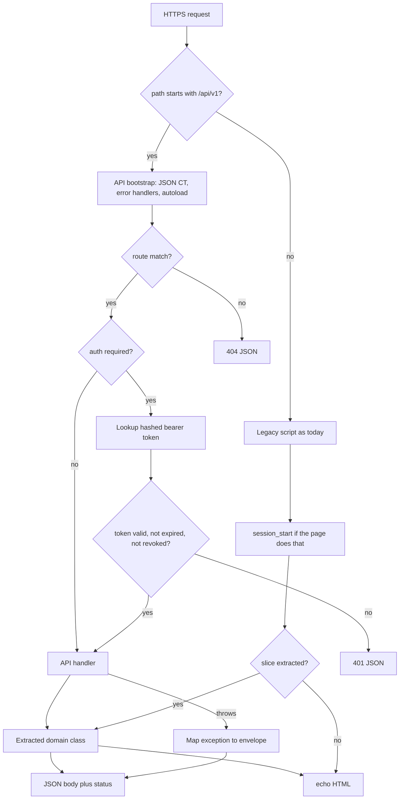
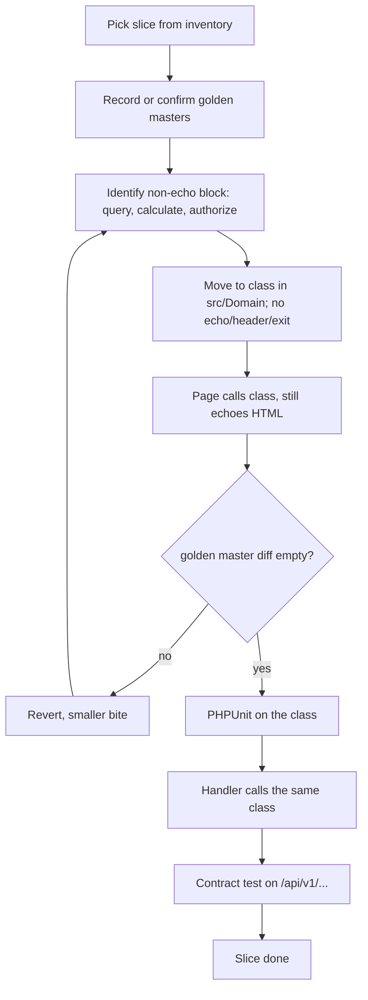

# Legacy PHP API Strangler — System Design
> - **Document Status**: Draft
> - **Last Updated**: 2026 Aug 29
> - **Author**: Paul Serban

This document is the mechanical *how* for the system described in the [Architecture Document](./02_architecture_document.md). It specifies routing, the extraction procedure, token auth, the error envelope, and the test layers. It does not specify code.

## 1. Control Flow

Two HTTP applications on one origin. Extraction is an engineering procedure that feeds both.



**Invariant:** the HTML path never depends on `api_tokens`. The API path never depends on `$_SESSION` once a slice's extraction gate has passed.

## 2. Routing

### 2.1 Webserver

Assume nginx (Apache is equivalent: `RewriteRule ^api/v1(/.*)?$ /api/index.php [QSA,L]` or a dedicated `Alias`).

Conceptual nginx:

- `location /api/v1` → `fastcgi_pass` to `public/api/index.php` (or a front controller whose `SCRIPT_FILENAME` is that file). `PATH_INFO` or a preserved `REQUEST_URI` is how the router sees `/api/v1/orders/12`.
- All other `location ~ \.php$` remain as they are today.
- Do **not** send `/api/v1` through a `try_files` that falls back to `orders.php`.

If the app is not behind a rewrite-capable server (plain `php -S` in a directory of scripts), the API still lives in its own file; the mobile client is configured with a base URL that hits that file. Production should not stay on `php -S`.

### 2.2 API router

A table of `{method, path-pattern} → handler`. Path parameters are explicit (`/orders/{id}`), not "load a file with that name."

Rules:

- `GET /api/v1/health` — public, no domain, no DB if possible (or a `SELECT 1` if you want liveness to mean database). Prefer: process up = 200; a separate `/health/ready` if DB must be checked. Do not mix them without documenting which one kube/load-balancers hit.
- Unknown method on a known path: `405` with `Allow`.
- Unknown path: `404` JSON, not the website's HTML 404.
- Trailing slashes: pick one, 301 or reject. Document it. Mobile clients concatenate paths badly.
- Version is in the path. The router may strip `/api/v1` and dispatch the remainder. There is no unversioned `/api/orders`.

### 2.3 What is not routing

- `?format=json` on `orders.php`.
- `Accept: application/json` inspected by a template. Content negotiation on a file that already printed `<!DOCTYPE` is a fantasy.
- A framework router wrapped around *all* traffic as the first PR. That is a rewrite of the web app. Out of scope ([ADR-001](./04_architecture_decision_records.md#adr-001)).

## 3. Extraction Procedure

This is the heart of the design. It is a repeatable procedure, not a refactoring festival.

### 3.1 Preconditions (per slice)

1. The slice is on the inventory from Phase 0: named page(s), the rule to extract, the API endpoint that will consume it, the tests that will characterize it.
2. Characterization snapshots exist and are green against **current production-equivalent HTML** (test DB seeded to match the snapshot fixtures).
3. Composer autoload can load `src/` from both the API front controller and from the legacy page that will be edited (a one-line `require vendor/autoload.php` at the top of that page, or a shared bootstrap include that only those pages get). Do not autoload-bootstrap the entire legacy app in one go unless Phase 0 proved it is safe.

### 3.2 Steps



**Step detail:**

1. **Snapshot.** For each affected URL: logged-out (expect redirect or login HTML), logged-in owner, logged-in other user (authorization), empty collection, typical collection, the ugliest fixture you can legally put in the test DB (zero totals, huge totals, deleted-flag rows if the page hides them).
2. **Identify the seam.** The seam is the last point at which you have a PHP array (or object) and the first point at which you concatenate HTML. Pull *that*. If SQL is interleaved with markup (query inside a `<tr>` loop), the class owns the query and returns rows; the template keeps the loop. Do not invent a templating engine.
3. **Extract with zero SAPI I/O.** The class receives: a database connection, the current user id (an integer, not `$_SESSION`), and request-derived inputs (order id, filters) as arguments. It returns a data structure or throws `NotFoundException` / `ForbiddenException` / `ValidationException`.
4. **Wire the page.** Replace the inlined block with a call. Catch exceptions and map them to whatever the page already did (redirect, `die('Not found')`). Mapping legacy UX is the page's job; do not change it to a JSON error.
5. **Diff.** Golden master must match. If the only delta is a CSRF token or a timestamp, tighten the normalizer — do not "accept the diff" because you are tired. If the delta is a sort order, you changed behavior; fix the class or the query.
6. **Unit test the class** with the same fixtures. This is now cheap; the snapshot already forced you to know the cases.
7. **API handler** maps HTTP ↔ class. It does not reimplement the query. It maps exceptions to the envelope.
8. **Contract test** the endpoint: status, JSON shape, authz (other user → 403/404 per policy), validation.

### 3.3 Seams that resist extraction

| Smell | What to do |
| --- | --- |
| `header('Location')` + `exit` in the middle of "logic" | Pull the *decision* (`mustRedirectToLogin(): bool`) into the class; leave `header`+`exit` in the page. API maps the same decision to `401`. |
| `echo` of a computed value inside a helper used by five pages | Extract the computation; leave a thin `echo` wrapper with the old function name so you do not have to edit five pages in one PR if you do not have snapshots for all five. Then snapshot-and-replace the others later. |
| Writes to `$_SESSION` as a side effect of a GET | That is a bug that the API must not copy. Extract the read path; leave the session write in the page; file the bug. Do not make `GET /api/v1/orders` write a session. |
| `include` of a file that both computes and renders | Split file, not just function. New file is the class; old file becomes HTML + call. |
| SQL built from `$_GET` with no validation | Validation becomes explicit in the class (throws `ValidationException`). The page may currently SQL-inject; the extraction is allowed to be *stricter* only if the golden master still matches for legitimate inputs. Do not use extraction as a silent WAF that changes UX for abusive inputs unless you document it. Legitimate inputs must match. |
| Unreachable mess (800 lines, two fields needed) | See [Trade-offs §4](./05_tradeoffs_and_honest_assessment.md#4-when-this-approach-is-not-worth-it). Duplicated read-only query with a kill-by date may be the adult answer. |

### 3.4 Output buffering (stopgap, not architecture)

If a function must be called and it `echo`s:

1. `ob_start()` around the call in the **API handler only**.
2. Parse or discard the buffer. Prefer discard + structured return if you can later change the function to return. If you must parse HTML, you have failed the extraction and should not ship that as "the domain."
3. Log a debt item: function name, why, revisit trigger ("when page X is characterized").
4. Never `ob_start()` as a global in the front controller to "catch whatever." That hides leaks and trains people to `echo` again.

## 4. Authentication

### 4.1 Web (unchanged)

- `session_start()` on pages that already do it.
- Cookie: `PHPSESSID` (or whatever `session.name` is). `HttpOnly`, `Secure`, `SameSite` should already be set; if they are not, that is a website defect to fix on the website, not a reason to share sessions with mobile.
- CSRF: form tokens as today. Irrelevant to bearer-token API calls from a native client.

### 4.2 Credential check (shared)

Extract from `login.php` in Phase 2, *before* building token issuance:

- Input: identifier + password (and 2FA later, if it exists — Phase 0 records whether login is more than a hash).
- Existing hash algorithm (probably `password_verify`). Do not "upgrade hashes" in the same PR as the API login unless you enjoy mixed incidents.
- Throttle: if the website has none, the API must not become the brute-force hole. Add a small per-identity/per-IP delay or lockout on **the API login** even if the website is weak. This is a rare allowed asymmetry: stricter on the new surface. Document it.

### 4.3 Token model

Opaque token, not JWT ([ADR-003](./04_architecture_decision_records.md#adr-003)).

**Issue (`POST /api/v1/auth/login`):**

1. Parse JSON body (`email`, `password`). Invalid JSON → `400`. Missing fields → `422`.
2. Credential check. Failure → `401` with a generic message (`invalid_credentials`). Do not reveal whether the email exists.
3. Generate 32+ bytes of CSPRNG; encode as hex or base64url. This is the **raw token**.
4. Store `hash('sha256', raw_token)` (or HMAC with a server-side pepper from env). Never store the raw token.
5. Optional: store a public `token_id` (UUID) and look up by id, then compare hash — avoids full-table hash compares. Preferred: `Authorization: Bearer <token_id>.<secret>` or a single random string used as lookup key via hash (SHA-256 of token as lookup key is fine if indexed: unique on `token_hash`).
6. Set `expires_at` (e.g. 30 days, refresh-by-login-again for v1; do not build refresh-token rotation until a slice needs it).
7. Return JSON: `{ "token": "<raw>", "expires_at": "<iso8601>", "token_type": "Bearer" }`. Raw token appears once.

**Authenticate (middleware):**

1. Require `Authorization` header matching `Bearer <token>`. Missing/malformed → `401`. Do not fall back to cookies.
2. Hash the presented token; lookup. Miss, expired, or `revoked_at` not null → `401`.
3. Attach `user_id` (and role if you have it) to request context. Handlers receive a principal, not a token string.

**Revoke (`POST /api/v1/auth/logout`):**

- Authenticated. Set `revoked_at` on *this* token. `204` or `200` with a small JSON ack.
- Website session is untouched.

**"Logout everywhere"** (optional, later): revoke all tokens for `user_id`. Still does not `session_destroy()` unless product asks for a combined kill-switch.

### 4.4 Logical schema: `api_tokens`

| Column | Notes |
| --- | --- |
| `id` | Internal PK. |
| `token_hash` | Unique. SHA-256 (hex) of raw token, or HMAC. |
| `user_id` | FK to existing users. Indexed. |
| `expires_at` | Required. |
| `revoked_at` | Null = active. |
| `created_at` | |
| `last_used_at` | Optional; update on a sampled basis if you do not want a write on every request. |
| `label` | Optional device name. Do not trust it. |

Sweeper: DELETE or mark where `expires_at < now()` or `revoked_at` older than a retention window. Correctness does not depend on the sweeper; middleware checks expiry.

### 4.5 What we refuse

- Sending `PHPSESSID` from a mobile `Cookie` header as API auth. Native clients and cookie jars are a mess; CSRF and SameSite become your problem; session fixation and session locking come along; logout semantics collide.
- JWT without a denylist "because it's stateless." You need revocation. You already have a database. Stateless is a slogan here, not a requirement.
- Putting the token in a query string. It leaks to logs and Referer.

## 5. Errors

### 5.1 Envelope

Every error body:

```json
{
  "error": {
    "code": "not_found",
    "message": "Order not found.",
    "details": []
  }
}
```

- `code`: stable, machine-readable, snake_case. The mobile client branches on `code` and status, not on `message`.
- `message`: human, English for v1, safe to show. No stack traces, no SQL, no filesystem paths.
- `details`: optional array of `{ "field": "email", "message": "..." }` for validation. Empty array or omitted for non-validation errors. Pick one; contract-test it.

Success bodies are **not** wrapped in `{ "success": true, "data": ... }` unless you enjoy tax on every client. Return the resource. HTTP status already said success. Consistency-of-envelope-for-errors does not require wrapping successes.

### 5.2 Status map

| Exception / case | Status | `code` |
| --- | --- | --- |
| Unmatched route | 404 | `not_found` |
| Wrong method | 405 | `method_not_allowed` |
| Malformed JSON body | 400 | `invalid_json` |
| Validation | 422 | `validation_error` |
| Bad or missing token | 401 | `unauthenticated` |
| Credential failure on login | 401 | `invalid_credentials` |
| Authenticated but not allowed | 403 | `forbidden` |
| Missing resource | 404 | `not_found` |
| Conflict (if a write slice needs it) | 409 | `conflict` |
| Rate limit (Phase 5) | 429 | `rate_limited` |
| Uncaught `Throwable` | 500 | `internal_error` |
| Domain/DB temporarily unavailable | 503 | `unavailable` |

**404 vs 403 on other-user's-order:** pick a policy and keep it for the whole API. Leaking existence is often worse; many apps `404` both. Match the website if the website already hides existence; if the website says "not allowed," you may `403`. Phase 0 records what the HTML does; the API is allowed to be stricter (always 404) if product agrees.

### 5.3 Boundary behavior

On API bootstrap, in this order:

1. `ini_set('display_errors', '0')` for the request (do not change php.ini globally if the website relies on display_errors in some terrible staging mode — but production website should also have display_errors off).
2. Register an exception handler: convert to envelope, log the throwable id, return 500 for unknown types.
3. Register an error handler: convert `E_WARNING`/`E_NOTICE`/`E_DEPRECATED` into exceptions **on the API process**, or at least log and suppress output. A notice that prints `Notice: Undefined variable...` before `{` is a P0 for the mobile client.
4. Register a shutdown function: if `error_get_last()` is a fatal, emit a single JSON 500 if headers not sent. If headers already sent, you have already failed; logging is all that's left.
5. Set `Content-Type: application/json` immediately.

Handlers wrap each route in try/catch for the typed exceptions. Unknown `Throwable` hits the top handler.

### 5.4 Typed exceptions (domain)

A small hierarchy. Do not recreate HTTP in the domain (`Http404Exception` is a smell). Domain throws `NotFound`, `Forbidden`, `Validation`; the handler maps to status.

Do not throw `\Exception` with string messages as the API contract.

## 6. Testing with Zero Existing Tests

The existing app has no tests. That is not permission to add none. It is permission to **not pretend templates are unit-tested**. Three layers, introduced in order.

### 6.1 Characterization (golden master)

**What:** HTTP request (or PHP CLI request emulator) against the **legacy URL**, with a seeded DB and a seeded session cookie, comparing response body to a stored snapshot.

**Tooling (illustrative):** PHPUnit + a thin HTTP client against a test-server, or something in the spirit of Approval Tests / `approvals`. The brand does not matter. The diff does.

**What to snapshot:**
- Body, with a documented normalizer: rewrite CSRF hidden fields, `nonce=`, time-of-day, `PHPSESSID` values in HTML if they appear.
- Status code.
- Redirect `Location` if any.
- Do not snapshot entire `Set-Cookie` of the session if it changes every hit; snapshot the *presence* of the cookie on login.

**When they run:** on every PR that touches the listed page, the domain class used by that page, or shared includes that page pulls. CI.

**When they are created:** before the first edit to that page. A snapshot created *after* the extraction proves nothing.

**Maintenance:** an intended HTML change updates the snapshot in the same PR, reviewed like code. "Update snapshots" as a bulk command with no diff review is how you delete the safety net.

### 6.2 Unit tests (extracted classes)

Ordinary PHPUnit. Seed DB or mock the query port — **prefer a real test database** for the first slices. These classes *are* the SQL. Mocking PDO in a system where the bug is the SQL is theater.

Fixtures match characterization fixtures so "the page shows 19.99" and "the class returns 19.99" are the same story.

### 6.3 API contract tests

HTTP against `/api/v1/...` on the test server:

- Auth: no token, bad token, expired, revoked.
- Happy path JSON schema (even a hand-written key list is enough; OpenAPI can come in Phase 5).
- Authorization: user B cannot read user A's resource.
- Error envelope shape on 422/401/404.

These tests are written **with** the handler, ideally first. There is no legacy entanglement; there is no excuse for skipping them.

### 6.4 What you do not do

- Write unit tests for `orders.php` as a file that `echo`s. You will fight output buffers and then still not know if HTML changed.
- Generate 90% coverage on the legacy tree as a Phase 0 goal. You will spend the budget on includes you will never extract.
- Run only contract tests and skip golden masters because "we were careful." You were not.

### 6.5 Effort

Characterization + first CI: a large fraction of Phase 0–1. Unit + contract per slice: part of every slice estimate. **If the project plan does not show 30–40% test work, the plan is lying.** See [Trade-offs](./05_tradeoffs_and_honest_assessment.md#1-what-i-would-build).

## 7. API Handler Shape (logical)

A handler is:

1. Parse input (path, query, JSON body).
2. Map to domain input types. Fail → `ValidationException`.
3. Call domain with `user_id` from principal (or null on public routes).
4. Map domain result to JSON (explicit field list; do not `json_encode($pdoRow)` and leak columns).
5. Catch nothing that the front controller already handles, except to translate domain exceptions.

Handlers do not open their own "just this query" if the domain already has it. The whole point is one query path.

## 8. Error Handling (ops)

| Class | Behavior |
| --- | --- |
| **Client error** | 4xx envelope. Log at info, not pager. |
| **Auth failure** | 401. Log at info with reason code internally (`expired` vs `missing`), same external message. |
| **Domain not found / forbidden** | 4xx. No stack. |
| **DB exception** | 500 or 503. Log the SQLSTATE, not the bound customer payload at error level if PII. |
| **Fatal after headers sent** | Log. Client may see truncated JSON. Treat as incident; fix the `echo`. |
| **PHP warning leaked** | Same as fatal for priority. Add a test that `json_decode`s every API response in the suite. |

## 9. Observability (minimum)

No new APM required.

- Request log: method, path template (not raw ids if PII), status, duration, `user_id` if any, token id (not the raw token).
- A `X-Request-Id` generated at the front controller, returned, logged.
- Alert: spike in 500s; `invalid_json` rate if you suddenly break the client; login 401 spike (credential stuffing).

Website logging stays as it is. Do not "improve" web error handling as a hidden scope add.

## 10. Security (brief)

This project has no separate security-architecture doc; the interesting surface is auth and output isolation.

- Tokens: HTTPS only. Hash at rest. No token in query, logs, or golden-master snapshots.
- Password check: existing algorithm; generic 401.
- Field filtering on JSON: explicit allow-lists.
- CORS: if a browser-based mobile wrapper appears, configure it deliberately. A native app does not need `Access-Control-Allow-Origin: *`. Default: no CORS until something in a browser origin must call the API.
- Rate-limit login (Phase 2, not 5): this is security, not hardening theater.
- The API process must not `eval` or include uploaded templates. Obvious, and still how PHP apps die.

## 11. Versioning and Compatibility

- `/api/v1` is a contract. Additive fields are OK. Removing/renaming fields, changing status codes, or changing `error.code` strings is a new version or a deprecation window with a mobile min-version.
- The website has no version. It can change HTML whenever characterization snapshots are updated. That asymmetry is fine.

## 12. Stop / Done Conditions (per slice)

A slice is done when:

1. Golden masters for listed pages are green in CI.
2. Domain class has PHPUnit coverage of the cases in §3.2 step 1.
3. Contract tests cover happy path + 401 + other-user + validation if inputs exist.
4. Handler has an explicit JSON field list.
5. No `$_SESSION` read in the domain class.
6. Any `ob_start` is listed in the debt log.

The *product* is not done when slices remain that mobile still needs. That is a backlog, not an architecture failure. Shipping `/health` and login and one resource is a successful Phase 3. Shipping twenty handlers that all `include` `orders.php` is a failed Phase 3 regardless of demo day.
