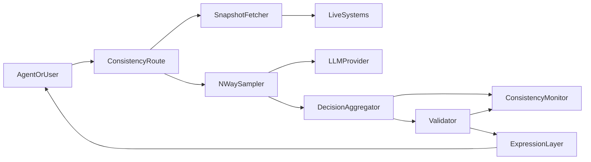
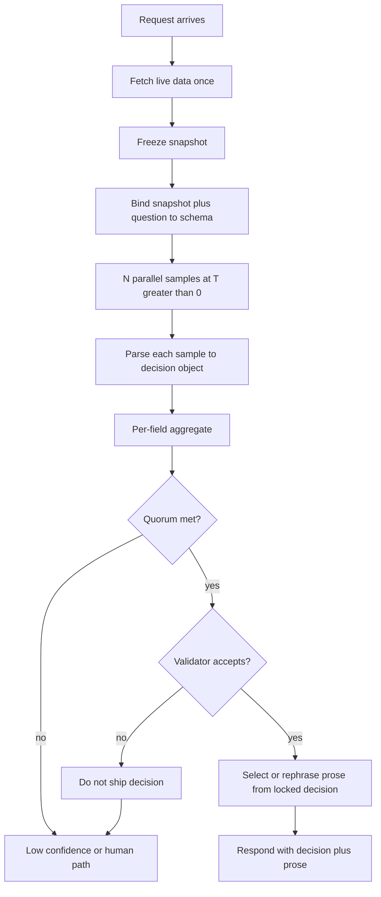
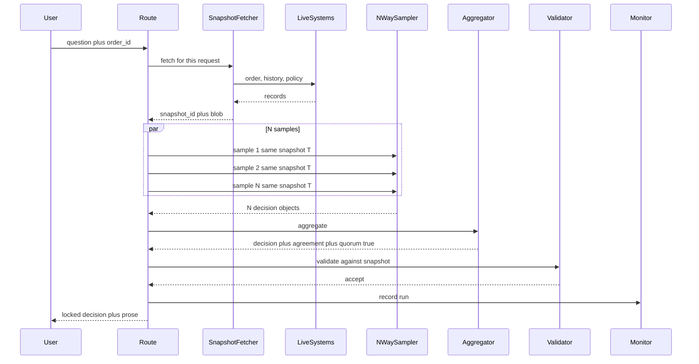
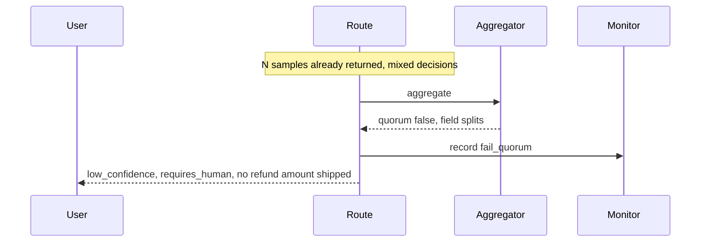

# LLM Answer Consistency — Architecture Document
> - **Document Status**: Draft
> - **Last Updated**: 2026 Aug 29
> - **Author**: Paul Serban

A request-scoped self-consistency ensemble over **structured decisions**, with a deterministic validator on top and creative prose left alone. Live data is fetched once per request and shared across that request's samples; answers are not cached across requests. Temperature stays above 0. This document covers *what* the system is and *why* it is shaped this way; see [System Design](./03_system_design.md) for *how* snapshot, schema, voting, and quorum actually work, and [Trade-offs and Honest Assessment](./05_tradeoffs_and_honest_assessment.md) for what that ensemble costs.

## Overview

**Brief description**: Consistency infrastructure, scoped narrowly: stabilize the decision a downstream system will act on, while letting the customer-facing wording vary, without T=0 and without an answer cache. It is not an LLM gateway, not an eval harness, and not a hallucination detector.

**Business Context**
- See [Scenario and Requirements](./01_scenario_and_requirements.md) for the full framing. In short: product wants consistent *answers* from a sampling model, forbids the two cheap ways to get them (T=0, cache), and still requires live data. "Consistent" is therefore redefined as decision-layer agreement under a shared snapshot, measured as a rate.
- Target users: owning engineer, on-call, product, finance/policy. The end user consumes a paragraph plus a locked decision.

## Requirements

### Functional Requirements

- **Snapshot**: for each request, fetch live data once, freeze it, and inject the same blob into every sample of that request.
- **Schema-constrained decision**: every sample must emit a typed decision object that matches the route schema. Unparseable samples are dropped from the vote, not repaired from prose.
- **N-way sample at T>0**: N independent generations, same prompt, same snapshot, product temperature. N is a route parameter with a hard cap.
- **Aggregate**: per-field voting (categorical plurality, numeric median with a variance gate, clustered free-text claims). Produce an `AggregatedDecision` plus per-field agreement scores and a quorum boolean.
- **Validate**: run a deterministic post-processor on the aggregated decision. Illegal decisions do not ship.
- **Express**: select or regenerate customer-facing prose *conditioned on the locked decision*. Prose is not an input to money or routing.
- **Fallback**: failed quorum or failed validation → `low_confidence` / human path. Not sample #1. Not unbounded resample.
- **Measure**: record per-field agreement, quorum failures, N-multiplier cost, latency of the fan-out. Continuously, per route.

### Non-Functional Requirements

**Performance Requirements:**
- Latency is approximately **one generation** (the N samples run in parallel) plus snapshot fetch plus aggregation. The user pays the slowest sample, not N serial calls. A slow tail sample still sets p95. That is the honest latency budget; "N samples, still feels like one call" is true only if the fan-out and the provider allow it.
- Cost is approximately **N × decision-sample tokens**, plus optional one expression-layer call, plus the live-data fetch. Cost is the line item that makes the clever answer expensive. It is not hidden.
- Aggregation and validation are CPU-cheap relative to generation. Do not design them as a separate service in v1.

**Reliability Requirements:**
- **A parse failure of one sample must not fail the request** if remaining valid samples can still form a quorum.
- **A failed quorum must not emit a fluent decision.** Low-confidence is a successful handling of disagreement, not an error to retry until it disappears.
- **Snapshot identity is an invariant.** If the snapshot is invalidated mid-flight (fetch error, partial data, schema mismatch against the live source), the ensemble is not allowed to vote. Refetch or fail the request. Do not mix snapshots inside one vote.
- **The system must not degrade into T=0 or a response cache** under load. Load shedding drops or queues requests; it does not "become consistent the cheap way."

**Infrastructure Constraints:**
- Illustrative: whatever HTTP service the company already runs for LLM calls; a provider that supports structured output or tool calls; a place to store ensemble-run telemetry (the same log/metrics stack). No new model, no GPU cluster, no vector database **required** in v1 — embedding-cluster consensus for free-text decision fields is Phase 4-shaped and only for fields that cannot be enums. Prefer enums.
- This project does **not** include training, fine-tuning, or replacing the model with a "more consistent" one. If the model cannot emit the schema at T>0, N=5 will not save you. Phase 0 exists to find that out.

**The defining constraint:**
- Temperature > 0 and no answer cache together forbid literal reproducibility. The architecture is: **stop asking the sampler to be a function; ask a vote-plus-validator to be a function of the samples.**

## Executive Summary

The system is a **request-scoped ensemble with a typed ballot**. The scarce resource on the naive path was *trust in a single sample's buried numbers*. The new path spends N samples to estimate the mode of the model's decision distribution, then spends a deterministic validator to make that mode legal, then spends wording on top.

**Architecture Style:** Self-consistency ensemble over structured outputs, with a deterministic post-processor. Not a cache. Not a temperature hack. Not a multi-agent debate club.

**Key Components:**
- **Live-Data Snapshot Fetcher**: one fetch per request; immutable blob + snapshot id.
- **Prompt / Schema Builder**: binds the snapshot and the user question to the route's decision schema.
- **N-way Sampler**: parallel generations at T>0, constrained to the schema.
- **Decision Aggregator**: per-field voting; quorum check.
- **Deterministic Post-Processor / Validator**: business rules, clamps, schema re-check.
- **Expression Selector / Re-phraser**: prose that is allowed to vary, locked to the decision.
- **Consistency Monitor**: agreement rates, quorum failures, cost multiplier.

**Technology Stack (illustrative):**
- App: existing LLM-calling service.
- Structured output: provider JSON schema / tool-call constraint. Grammar-constrained decoding if the provider has it. Prompt-only "please emit JSON" is a known weaker fallback, not the design.
- Telemetry: existing metrics + a durable `ensemble_run` record for audit of money-shaped fields.
- Optional later: embedding model for clustering free-text *decision* claims. Default is: do not have free-text decision fields.

**Architecture Principles:**
- **Decision ≠ expression.** If a number can affect money or routing, it is a schema field, not a sentence.
- **Vote on typed values, not on prose.** String-similarity of two refund emails is not a refund policy.
- **One world per vote.** The snapshot is the world. Samples do not fetch.
- **Quorum failure is an answer.** Escalation is in the product contract.
- **N is a cost control, not a quality knob you turn until fear goes away.**
- **Measure agreement in production.** A notebook that agreed 19/20 times is not an SLO.

**Key Architectural Decisions:**
1. **Split decision layer vs. expression layer; enforce consistency only on the former.** [ADR-001](./04_architecture_decision_records.md#adr-001).
2. **Structured / schema-constrained output as the substrate for voting.** [ADR-002](./04_architecture_decision_records.md#adr-002).
3. **N-way self-consistency at fixed T>0 with per-field-type aggregation.** [ADR-003](./04_architecture_decision_records.md#adr-003).
4. **Single snapshotted live-data fetch shared across the ensemble within one request; no cross-request answer cache.** [ADR-004](./04_architecture_decision_records.md#adr-004).
5. **Deterministic post-processing after the vote, before downstream use.** [ADR-005](./04_architecture_decision_records.md#adr-005).
6. **Bounded N with explicit low-confidence fallback on failed quorum.** [ADR-006](./04_architecture_decision_records.md#adr-006).
7. **Continuous consistency measurement as a first-class metric.** [ADR-007](./04_architecture_decision_records.md#adr-007).

### Context Diagram

The LLM provider is a sampling backend. Live systems are the source of facts. The aggregator and validator are the consistency mechanism. Nothing in this diagram is a cache of answers.

### Target path — one request

## Runtime Architecture

1. **Snapshot layer** (milliseconds to whatever the live systems take): authenticate the caller, fetch the sources the route is allowed to see, freeze a snapshot with an id and a timestamp. Fail the request if a required source is down — do not generate against missing facts and call it live.
2. **Sample layer** (one generation's latency, in parallel): N constrained completions. Same temperature, same snapshot id in every prompt. Provider timeouts and parse failures reduce N_effective.
3. **Aggregate layer** (milliseconds): per-field vote, agreement scores, quorum boolean.
4. **Validate layer** (milliseconds): pure function of `(snapshot, aggregated_decision)`. No LLM.
5. **Expression layer** (zero or one extra generation): either pick a sample whose decision matched the vote and keep its prose, or run a short T>0 "phrase this decision" call. Default in v1: pick among agreeing samples to avoid a fourth LLM call on the happy path. See [System Design](./03_system_design.md).
6. **Monitor layer** (async, cheap): write the ensemble run; increment agreement / fail-quorum / cost metrics.

Once the decision is no longer extracted from a single paragraph, temperature and cache **stop being the consistency architecture**. They remain available as *other* products' levers. Using them on this route is how you fail the scenario.

### Happy path vs failed quorum

Failed quorum does not pick a winner:

## Components

### 1. Live-Data Snapshot Fetcher
**Purpose**: Be the only place live systems are read for this request, so the ensemble votes in one world.

**Responsibilities:**
- Fetch the route's required sources (order, refund history, policy version, flags).
- Produce an immutable snapshot: id, fetched_at, source versions, payload.
- Refuse to open an ensemble if a required source failed. Partial snapshots are a route-level policy; default is fail closed for money routes.
- Never write the snapshot into a **response** cache. Retention of the snapshot **on the ensemble_run record** for audit is allowed and recommended for money-shaped routes. That is provenance, not an answer cache. TTL it with the audit policy.

**Interactions:**
- Reads: live systems.
- Writes: snapshot blob onto the in-flight request (and, after the run, onto the audit record).
- Does not call the LLM.

### 2. Prompt / Schema Builder
**Purpose**: Make "this question, this world, this ballot" a single artifact so samples are comparable.

**Responsibilities:**
- Bind user question + snapshot payload into the prompt.
- Attach the decision JSON schema / tool definition.
- Copy provenance fields that the model must not invent (`policy_version`, order amount) as **pre-filled or validator-checked** values. Prefer validator-checked: the model may echo them; the validator compares.
- Stable serialization so the only intended randomness is the sampler, not prompt jitter (timestamp formatting, unordered JSON keys in the prompt). Prompt jitter is a self-inflicted consistency bug.

**Interactions:**
- Reads: snapshot, route schema, user question.
- Outputs: canonical prompt + schema sent to every sample.

### 3. N-way Sampler
**Purpose**: Draw N i.i.d. samples from the model's decision distribution at the product temperature.

**Responsibilities:**
- Fire N parallel constrained generations. Same model, same T, same prompt, same schema.
- Enforce a per-sample timeout. A hung sample is a missing ballot, not a reason to block past the timeout.
- Return raw completions plus parse status. Do not "fix up" invalid JSON beyond a strictly specified, deterministic repair (trim fences) — and prefer provider-side constraints so repair is rare.
- Cap N. The sampler does not decide to "add three more because they disagreed." That is [ADR-006](./04_architecture_decision_records.md#adr-006).

**Interactions:**
- Calls: LLM provider.
- Writes: `SampleResult` rows for the run.

### 4. Decision Aggregator
**Purpose**: Turn N typed ballots into one candidate decision plus honesty about disagreement.

**Responsibilities:**
- Drop invalid samples (`N_valid = N - parse_failures - schema_mismatches`).
- Per field, apply the type's aggregation rule (see [System Design](./03_system_design.md)):
  - categorical / boolean / enum: plurality; record vote share.
  - numeric: median; record spread; fail the field if spread exceeds a route threshold (a 3-way split of $10 / $40 / $90 is not "the median is $40, ship it" on a money route without a spread gate).
  - free-text claims (discouraged): embedding-cluster majority if Phase 4 enabled; otherwise treat as expression and do not vote.
- Quorum: every **consistency-gated** field meets its threshold (working default: strict majority of `N_valid`, and `N_valid >= N_min`). One field failing quorum fails the decision.
- Tie: not a winner. Quorum false for that field.

**Interactions:**
- Reads: sample decision objects.
- Writes: `AggregatedDecision`.

### 5. Deterministic Post-Processor / Validator
**Purpose**: Make "the model voted $40" into "$40 is legal given this snapshot."

**Responsibilities:**
- Re-validate schema types.
- Enforce business rules that are functions of the snapshot: refund ≤ order amount; `eligible=false` implies amount 0; `reason_code` in enum; `policy_version` equals snapshot's version.
- Clamp only where product has explicitly allowed clamping (e.g. round to minor units). Do not clamp a $90 vote down to the order total and call it validation — that is silently changing the decision. Prefer reject.
- Pure function. No I/O, no LLM. Same snapshot + same aggregate → same accept/reject.

**Interactions:**
- Reads: snapshot, aggregated decision, rule table for the route.
- Writes: `validated` or `rejected` plus rule ids.

### 6. Expression Selector / Re-phraser
**Purpose**: Spend creativity where it was asked for, after the decision is frozen.

**Responsibilities:**
- v1 default: among samples whose decision **equals** the validated decision on gated fields, pick one (deterministic pick: lowest sample index, or highest provider logprob if available — pick a rule and do not randomize the pick if you care about rerun-stability of *which* paragraph; the paragraph is allowed to vary across *requests*, not required to vary). Use that sample's prose. Strip any numbers in the prose that disagree with the locked decision (better: render numbers from the decision into a template around the prose, or regenerate).
- Alternative: one additional T>0 call: "Write the customer-facing paragraph. You must use these fields verbatim: …" Cheaper in engineering, extra latency and cost. See [ADR-001](./04_architecture_decision_records.md#adr-001).
- If no sample's decision matched the aggregate (possible if median numeric ≠ any sample), **must** re-phrase from the locked decision; do not ship a paragraph that quotes a different amount.

**Interactions:**
- Reads: validated decision, agreeing samples' prose.
- Optionally calls: LLM once.
- Writes: `expression_text`.

### 7. Consistency Monitor
**Purpose**: Make "we are consistent" a graph, not a story.

**Responsibilities:**
- Per route: `agreement_rate` per gated field, `quorum_failure_rate`, `validator_reject_rate`, `n_valid / N`, `cost_tokens_total / cost_tokens_single_sample` (the realized multiplier), fan-out latency p50/p95.
- Alert on SLO burn (agreement below target) and on cost burn (multiplier creeping up because someone raised N).
- Do not alert on "prose differed." That is not a defect.

**Interactions:**
- Reads: every ensemble run.
- Writes: metrics, the durable run record.

### Communication Patterns

**Synchronous:**
- Caller ↔ route: one request / one response (decision + prose + confidence).
- Route ↔ live systems: snapshot fetch.
- Route ↔ LLM provider: N parallel generate calls; optionally one expression call.

**Asynchronous:**
- Monitor / audit sink.
- Human escalation queue when `requires_human` or `low_confidence`.

There is no asynchronous "write the answer to a cache for the next caller."

## Scaling Strategy

**Current Scale Requirements:**
- One route, human-paced QPS (support agent or customer bot). N=3 or N=5. This is not a batch-enrichment firehose. If it becomes one, N× will dominate the LLM bill and this architecture needs a hard look, not a silent N=3 forever.

**What scales horizontally:**
- Route handlers. Each request owns its own snapshot and samples. No shared consistency state between requests — by design (no cache).

**What does not:**
- Provider RPM/TPM. N samples per user-visible request multiply origin load. A 10 RPS route at N=5 is 50 RPS at the provider **before** retries. Capacity planning uses N.
- Cost. Linear in N. There is no clever encoding that makes five samples cost like one if you actually want five independent draws.
- Live-system read QPS. Snapshot-once means **one** fetch cluster per user request, not N. That is a rare gift of this design; do not waste it by refetching per sample.

**If QPS grows:**
- Lower N if measured agreement stays in SLO (Phase 3 is for this).
- Narrow the schema so more of the "answer" is expression (not voted).
- Split routes: high-stakes keep the ensemble; chatty FAQ does not.
- Do **not** add an answer cache to "scale consistency." That is constraint violation.

**Bottleneck Analysis:**
- Primary: provider latency tail of the slowest of N, and provider rate limits × N.
- Secondary: live-data fetch (the old bottleneck, still real; now at least it is not multiplied by N).
- Tertiary: nothing about voting. If voting is your bottleneck you have built something else wrong.

### What changes as N or QPS grows

| Dimension | N=3, support QPS | N=7, or batch QPS |
| --- | --- | --- |
| Cost | 3×, usually tolerable if the route is rare and high-stakes | Often intolerable; Phase 0/3 must say so |
| Latency | ~max of 3 generations | Tail-driven; stragglers hurt; timeouts drop N_valid |
| Agreement | Usually enough for coarse enums | Diminishing returns; bias remains |
| Provider limits | Easy to forget to multiply | The first outage you cause |
| Temptation to cache | Low | High; resist or kill the project |

## Data Architecture

### Data Model

**Key Entities:**
- **DecisionSchema**: route_id, field list (name, type, gated?, agreement_threshold, numeric_spread_limit), N, N_min, T, model_id.
- **LiveSnapshot**: snapshot_id, request_id, fetched_at, payload, source_versions.
- **EnsembleRun**: run_id, request_id, snapshot_id, N, N_valid, quorum, validator_status, latency, token_cost.
- **SampleResult**: run_id, index, parse_ok, decision_object, expression_text, provider_ids, latency, tokens.
- **AggregatedDecision**: run_id, fields with value + vote_share + spread, quorum bool.
- **ConsistencyMetric**: route_id, window, per-field agreement, quorum_failure_rate, mean_N_multiplier.

**Entity Relationships:**
- One request → one snapshot → one ensemble run → N samples → one aggregate → one validation outcome → one expression.
- Metrics are rollups of runs, not a parallel truth.

### Data Lifecycle

**Create**: snapshot at fetch; samples as they return; aggregate and validation at end of fan-out; metrics continuously.

**Read**: validator reads snapshot; monitor reads runs; support reads a run to explain a refund amount.

**Update**: none of the decision artifacts. Runs are append-only.

**Delete**: snapshot payloads retained per audit/PII policy (days for debug, longer if finance requires). Metrics stay. Do not keep snapshots "in case we can cache them later."

## Cost Analysis

### Cost Components

**Money:**
- LLM: **N × input tokens** (the snapshot is in every prompt — this is the ugly part: you pay to re-send the same snapshot N times) **+ N × output tokens** for the decision objects (hopefully small) **+ 0 or 1 × expression call**.
- Live-data fetches: once per request.
- Telemetry storage: cheap relative to tokens.

The snapshot-in-every-prompt duplication is a real tax. Some providers support prefix caching of identical prompt prefixes **inside their infrastructure**. Using that is **not** an application-level answer cache and does not violate the live-data constraint: each request still has a fresh snapshot; if two samples of the *same* request share a prefix, the vendor may bill input cheaper. Take the vendor optimization if it exists. Do not build your own answer cache because the vendor prefix cache is "kind of similar." It is not.

**Engineering time — the actual build cost:**
- Schema design and the fight with product about which fields are gated. This is most of Phase 0.
- Constrained decoding integration and parse-failure handling.
- Aggregator + validator rules.
- Telemetry and the SLO conversation.
- The ensemble runner itself is small.

**Risk cost of skipping the ensemble and "just asking nicely":**
- Inconsistent refunds, inconsistent routing, users who quote two different bot answers to support. That is why you would pay N×. If that risk is cheap, do not pay N×. See [Trade-offs](./05_tradeoffs_and_honest_assessment.md).

### Cost Optimization

- Keep decision objects small. Do not put the essay in the voted schema.
- Parallelize; never serialize the N calls.
- Start N=3. Raise only if Phase 0/3 measurement says agreement is below SLO **and** extra samples actually move it. N=9 for a boolean is superstition.
- Prefer enums over free text in the decision layer so you never pay for embeddings to cluster claims.
- Do not add a second model as a "judge" of the N samples. That is another cost and a correlated error source. The vote is the judge.

## Risks and Mitigation

| Risk | Likelihood | Impact | Mitigation Strategy | Owner |
| --- | --- | --- | --- | --- |
| Systematic bias: all N samples agree on the wrong refund | High if the model is wrong | High | Ensemble does not fix this. Evals, snapshot grounding, validator rules, human review on money. Do not sell voting as correctness | Product + evals (out of this system) |
| Product hears "consistent" as "same words" and files bugs on prose | High | Medium | Contract: decision SLO, not string equality. Tests that assert prose equality are rejected | Owning engineer |
| Someone sets T=0 to "help the vote" | High under incident pressure | High (constraint violation; also wastes N×) | Config deny T=0 on this route; incident review treats it as a policy breach | Operator |
| Someone adds a 5-minute answer cache during a bill spike | High | High (stale live data) | No cache client on this route; review; kill criterion | Operator |
| Per-sample live refetch sneaks in via tool calls | Medium | High (vote across worlds) | Tools disabled on ensemble samples; snapshot injected; no live tools in the sample prompt | Schema builder |
| N_valid drops to 1 because of parse failures; silent majority-of-1 | Medium | High | `N_min`; quorum false if `N_valid < N_min` | Aggregator, [ADR-006](./04_architecture_decision_records.md#adr-006) |
| Numeric median ships despite huge spread | Medium | High | Spread gate on money fields | Aggregator |
| Snapshot in all N prompts blows input-token cost | High | Medium | Small snapshots; vendor prefix cache if any; do not paste entire CRM history | Snapshot fetcher |
| Fan-out hits provider rate limits, p95 explodes | Medium | High | Capacity plan with N; timeouts; shed load; do not serialize | Sampler |
| Schema drift: new field without a vote rule | Medium | Medium | Schema version on the route; unknown fields ignored or fail closed | Schema owner |
| Open-ended route forced through this design | Medium | High (cost for no gain) | Phase 0 kill if no gated fields exist | Phase 0 |
| Provider structured-output still leaks invalid JSON at T>0 | Medium | Medium | Drop sample; if too common, the model/provider is unfit for this route | Sampler |
| Expression prose quotes a number that lost the vote | Medium | High | Render money/enums from locked decision; or regenerate expression | Expression layer |

## Future Enhancements

### Phase 1 (current design target)
Snapshot-once + schema-constrained **single** sample. No ensemble yet. Prove plumbing. See [Phased Implementation Plan](./06_phased_implementation_plan.md).

### Phase 2
N-way vote, quorum, validator, pick agreeing prose.

### Phase 3
Production agreement SLO, tune N, cost dashboard.

### Phase 4
Optional expression re-phrase call; optional clustering for any remaining free-text *decision* fields; additional routes that actually have a decision substructure.

### Explicitly not in this design

- Temperature 0 as a consistency strategy.
- Cross-request answer caching.
- A second LLM judge.
- Multi-agent debate / devil's-advocate chains as v1 (cost and correlated error; not needed to answer this scenario).
- Guaranteeing identical prose.
- Guaranteeing correctness.
- A company-wide "consistency gateway" wrapping every prompt. This is per-route, for routes that have a decision worth paying N× for.
