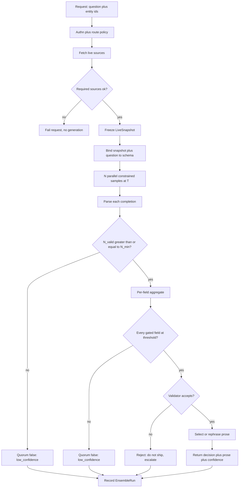
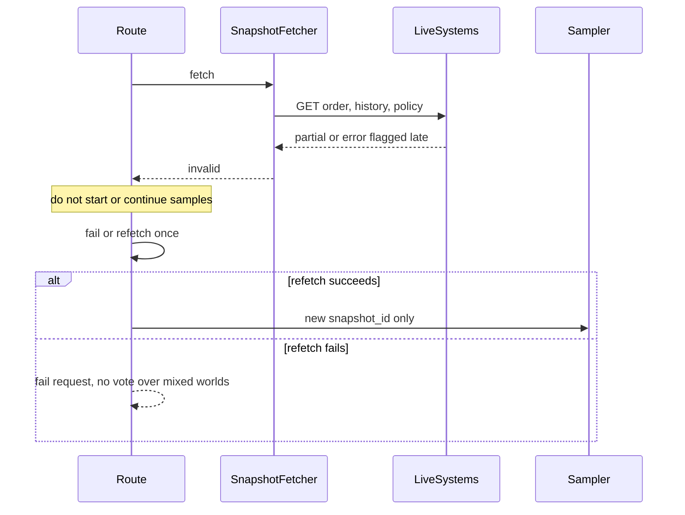
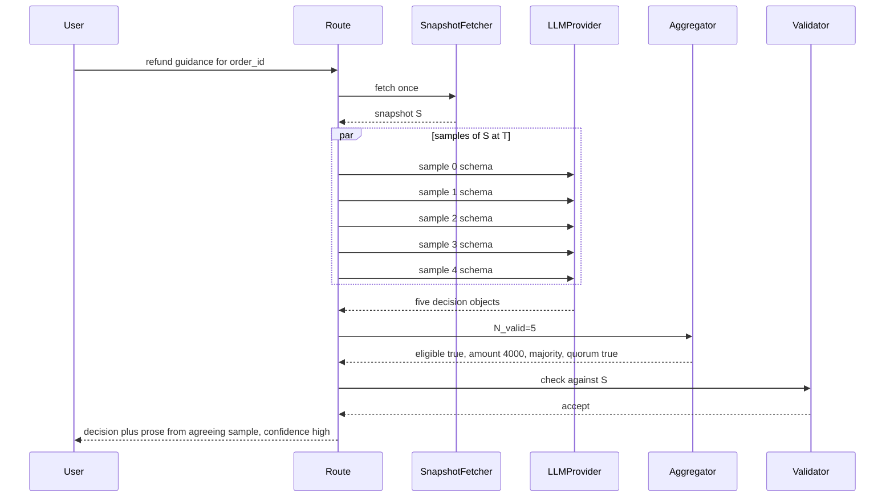
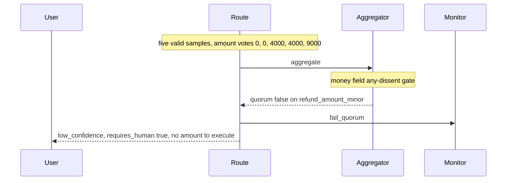
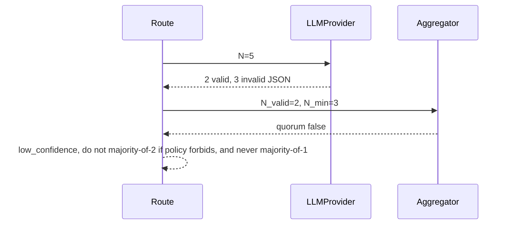
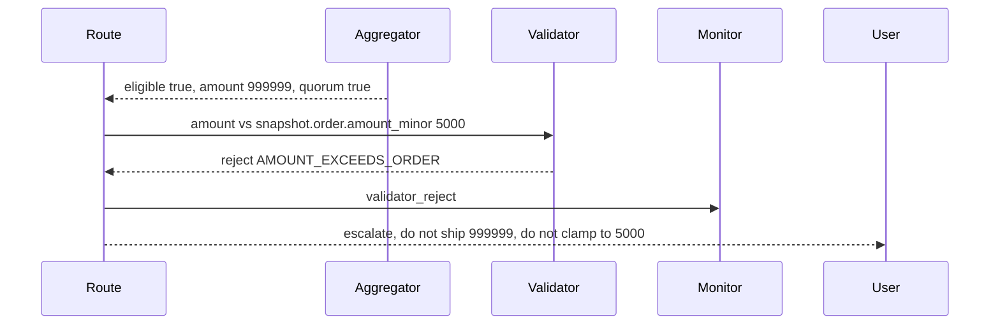

# LLM Answer Consistency — System Design
> - **Document Status**: Draft
> - **Last Updated**: 2026 Aug 29
> - **Author**: Paul Serban

This document is the mechanical *how* for the system described in the [Architecture Document](./02_architecture_document.md). It specifies the snapshot contract, the decision schema, per-field aggregation, quorum, validation, expression selection, and the sequences that must not silently pick sample #1. It does not specify code.

## 1. Control Flow

One request, one snapshot, N ballots, one validated decision, optional prose. The client does not pick N or T.

**Invariant:** no sample fetches live data. If a tool definition that can read live systems is attached to the sample call, the design has failed.

**Working defaults for `support.refund_guidance`:** T = 0.7, N = 5, N_min = 3, categorical threshold = strict majority of `N_valid`, numeric spread gate as defined in §4. These are route parameters. Changing them is not a new architecture; shipping T=0 or an answer cache is.

## 2. Live-Data Snapshot

### What is snapshotted

For `support.refund_guidance`, one blob:

| Source | Contents used | Missing → |
| --- | --- | --- |
| Order service | order_id, status, amount_minor, currency, placed_at, items | Fail closed |
| Refund history | prior refunds for this order / customer as the policy needs | Fail closed if policy requires them |
| Policy | policy_version, rule parameters the validator will re-check | Fail closed |
| Inventory flags | restocking_required, etc., if eligibility depends on them | Fail closed if the field is gated |

Fetched_at is recorded. Source versions (policy_version, order etag if any) are recorded.

### Once per request

- The fetcher runs **before** any sample.
- The blob is immutable for the life of the ensemble run. Samples receive a serialization of this blob, not a handle they can re-read.
- A second user request for the same order, even 200ms later, **fetches again**. That is the live-data constraint. The two requests may see different worlds and may correctly produce different decisions. That is not inconsistency; that is the world moving.

### Intra-request reuse is not a cache

Sharing the blob across N samples is required for the vote to mean anything. Naming it "cache" in a code review is a category error. Caching the **completion** or caching the **snapshot to skip a later request's fetch** is the forbidden thing.

### Snapshot invalidation mid-flight

The snapshot should not change because it is immutable. Invalidation means: we discovered it was **wrong or incomplete** before voting (e.g. a source returned 200 with an empty body we treated as "no history," then a late header said truncated).

**Forbidden:** start samples on snapshot A, refetch to snapshot B for the stragglers, vote them together.

## 3. Decision Schema (Logical)

Not JSON Schema syntax. Grain and invariants only. Example for `support.refund_guidance`:

| Field | Type | Gated | Aggregation | Notes |
| --- | --- | --- | --- | --- |
| `eligible` | boolean | yes | plurality | |
| `refund_amount_minor` | integer | yes | median + spread gate | Currency minor units. Validator: 0 if not eligible; ≤ order.amount_minor |
| `reason_code` | enum | yes | plurality | Closed set from policy |
| `requires_human` | boolean | yes | plurality | |
| `policy_version` | string | yes (must match snapshot) | not voted — copied / checked | Model may echo; validator compares to snapshot |
| `customer_summary` | string | no | none (expression) | Not voted |

**Invariants:**
- Gated fields are a small set. If the schema has twelve gated free-text fields, Phase 0 failed.
- Enums beat strings. If `reason_code` is free text, you do not have a vote, you have a clustering research project.
- The expression field may appear in the same model output for convenience (one structured object with a `customer_summary` key) so v1 can pick agreeing-sample prose without a second call. It is still not gated.

Provider constraint: the sample call uses structured output / tool calling so the decision object is not "the JSON we regexed out of a paragraph." Prompt-only JSON is a degraded mode: expect higher parse-fail rates and a higher N to compensate — which is paying for a provider feature you did not use.

## 4. Aggregation Rules

Operate only on `N_valid` samples (parse_ok, schema-valid, snapshot_id matches).

### 4.1 Categorical, boolean, enum

- Count votes per distinct value (exact match after canonicalization: booleans real booleans, enums case-normalized to the schema's spelling).
- Winner = plurality.
- Vote share = winner_count / N_valid.
- Quorum for the field: vote share ≥ threshold **and** winner_count > second_place (no tie). Working threshold: `> 0.5` (strict majority). A 2-2 split at N_valid=4 is a failed quorum, not "first listed enum."
- Canonicalization is deterministic and specified. "APPROVE" vs "approve" must not split a vote because someone skipped normalization.

### 4.2 Numeric

- Value = **median** of the N_valid numbers (for even N_valid, the arithmetic mean of the two central values, then round **to nearest minor unit, banker's or always-down — pick one, document it, do not leave it to the language runtime's default**).
- Spread gate: a field fails quorum if the **range** (max − min) or IQR exceeds a route limit. Working default for refunds: fail if range > 0 **and** more than one distinct value unless the distinct values differ only by rounding dust (0). Money routes should be harsh: if the model cannot agree on a number, a human should see it.
- Alternative (stricter, preferred for money): treat the number as categorical after rounding to minor units; require plurality like an enum. Median is the wrong story if votes are $0, $0, $0, $40, $90 — median is $0, which may be correct, but the spread gate must still fire if product wants humans on any dissent. **Product picks: "any dissent on amount → human" vs "majority amount wins."** Default in this design: **any dissent on `refund_amount_minor` fails quorum.** That is conservative and will raise `requires_human`. It is the honest money default. Relaxing it is a signed product decision, not a silent aggregator tweak.

### 4.3 Free-text claims that were mistakenly gated

If Phase 4 clustering is **not** on: do not vote. Either reclassify the field as expression or fail the route config in Phase 0.

If clustering is on: embed each claim, cluster (e.g. agglomerative with a cosine threshold), majority cluster's representative = the claim closest to the centroid, or a deterministic pick from the cluster. This is expensive, fuzzy, and easy to oversell. Prefer not to have this field.

### 4.4 Whole-decision quorum

Quorum is **conjunction** over gated fields. One failed field fails the decision. Do not ship a confident `eligible=true` with a failed amount vote.

`N_valid < N_min` fails quorum even if the remaining samples agree (majority-of-1 is not a majority).

## 5. Validator

Pure function `validate(snapshot, aggregated_decision) → accept | reject(rule_ids)`.

Working rules for the example route:

1. Schema types and enum membership.
2. `policy_version == snapshot.policy_version`.
3. If `eligible == false` then `refund_amount_minor == 0`.
4. `refund_amount_minor >= 0` and `refund_amount_minor <= snapshot.order.amount_minor`.
5. Currency is the snapshot currency (if the schema includes it).
6. `reason_code` is allowed for this `eligible` value by a static table (e.g. `NOT_ELIGIBLE_*` only when ineligible).

**No LLM. No I/O.** Same inputs, same output.

**Reject vs clamp:** default reject. Clamping `$40.4` to `$40` is rounding and may be allowed if the aggregator already rounded. Clamping `$90` to order total `$50` is changing the vote; that is a silent policy. Forbidden unless product listed that clamp as a rule — and even then, prefer reject-and-escalate, because the model did not understand the cap.

## 6. Expression Selection

After accept:

1. Partition samples into `agreeing` = those whose gated fields **equal** the validated decision (after the same canonicalization).
2. If `agreeing` is non-empty: take `agreeing[0]`'s `customer_summary` (lowest index). **Rewrite numeric/enum tokens in the prose from the locked decision** if a cheap deterministic renderer exists (template slots). If the prose cannot be trusted not to contain a conflicting number, discard it and go to step 3.
3. If `agreeing` is empty (median produced a number no sample emitted — should be rare if money is categorical) **or** prose is untrusted: one T>0 expression call, prompt contains the **locked decision as data**, instruction to not contradict it. Structured output with a single `customer_summary` field. Do not vote this call.
4. Never parse a number back out of the paragraph to fill the decision. The decision is already locked.

## 7. Sequences

### 7.1 Normal quorum

### 7.2 Failed quorum (do not pick sample 0)

**Forbidden terminal:** returning sample 0's $0 because it arrived first, or returning the median $4000 while the spread gate failed.

### 7.3 Parse failures reducing N_valid below N_min

If this is common, the problem is structured-output quality, not N. Raising N to 15 so that 3 parse is superstition layered on a provider bug.

### 7.4 Validator reject

## 8. Data Model (Logical)

Not SQL. Grain and invariants only.

### decision_schema (route config)

| Field | Role |
| --- | --- |
| route_id | `support.refund_guidance` |
| model_id, temperature | T>0; T=0 rejected at config load |
| N, N_min | Cap and floor |
| fields[] | name, type, gated, threshold, spread_policy |
| validator_rule_set_id | Versioned rules |
| schema_version | Bump when fields change |

### live_snapshot

| Field | Role |
| --- | --- |
| snapshot_id | Unguessable; referenced by every sample |
| request_id | |
| fetched_at | |
| payload | Immutable blob |
| source_versions | policy_version, order etag, … |

**Invariant:** samples store `snapshot_id`. Aggregator refuses a sample with a mismatch.

### ensemble_run

| Field | Role |
| --- | --- |
| run_id | |
| request_id, snapshot_id, route_id, schema_version | |
| N, N_valid | |
| quorum | bool |
| validator_status | accept / reject / skipped (if no quorum) |
| token_input, token_output | Realized cost |
| latency_ms | Fan-out wall time |
| terminal | `answered` / `low_confidence` / `validator_reject` / `snapshot_fail` |

### sample_result

| Field | Role |
| --- | --- |
| run_id, index | 0..N-1 |
| parse_ok | |
| decision_object | Null if parse failed |
| expression_text | May be null |
| provider_request_id | Support |
| latency_ms, tokens | |

### aggregated_decision

| Field | Role |
| --- | --- |
| run_id | |
| values | Map of field → value |
| vote_shares / spreads | Honesty |
| quorum | bool |
| failing_fields | Empty if quorum |

### consistency_metric

| Field | Role |
| --- | --- |
| route_id, window | e.g. 1h |
| agreement_rate_by_field | |
| quorum_failure_rate | |
| validator_reject_rate | |
| mean_n_multiplier | token_total / (token_total / N) — actually: total tokens / tokens of a hypothetical single sample; compute as `sum(tokens) / mean(per_sample_tokens)` or simpler `N` when all samples succeed. Report **realized** `sum(sample tokens)/median(sample tokens)` so parse retries are visible. |

## 9. Error Handling

| Failure | Where | What the system does | What it must not do |
| --- | --- | --- | --- |
| Unauthenticated | Edge | 401, no fetch | Sample anyway |
| Required live source down | Snapshot | Fail request / 503 with a stable code | Generate from training data and call it live |
| Partial snapshot | Snapshot | Fail closed on money routes | Vote with "best effort" facts |
| One sample timeout | Sampler | Count as invalid; proceed | Wait unbounded; serialize a retry that desynchronizes the world |
| One sample invalid JSON | Parse | Drop; proceed | Regex a number out of the broken text into the vote |
| `N_valid < N_min` | Aggregator | `low_confidence` | Ship majority-of-1 |
| Tie on enum | Aggregator | Field fails quorum | Hash-based tie-break that pretends to be determinism |
| Dissent on money amount | Aggregator | Fail quorum (default) | Median-and-ship |
| All samples disagree | Aggregator | `low_confidence` | Pick sample 0, pick longest prose, pick highest logprob as if that were truth |
| Validator reject | Validator | Escalate; no decision shipped | Clamp into legality |
| Expression call fails | Expression | Return decision with a template fallback ("Eligible: {eligible}. Amount: {amount}.") | Block the locked decision because the joke in the paragraph failed |
| Provider 429 on fan-out | Sampler | Shed / retry with bounded backoff **without** refetching live data; if N_valid collapses, low_confidence | Open a cache "until the provider is healthy" |
| Pressure to set T=0 during an incident | Config | Refuse | "Just for tonight" |
| Pressure to cache answers during a bill spike | Config | Refuse | TTL cache of completions |

## 10. Observability (Minimum)

Without these, "we are consistent" is folklore.

- **Per route, per gated field:** agreement rate (share of runs with quorum on that field).
- **Per route:** quorum_failure_rate, validator_reject_rate, snapshot_fail_rate, parse_fail_rate (samples, not runs).
- **Cost:** tokens in/out per run, implied N multiplier, extra expression-call rate.
- **Latency:** snapshot fetch; time-to-last-sample (this *is* user-visible latency); aggregation (should be noise).
- **Audit:** for money routes, persist snapshot_id, aggregated values, vote shares, validator result. Support must reconstruct "why $40" without reading a prose log.
- **Do not** page on prose variation.
- **Do** page on SLO burn of agreement, on parse_fail_rate (schema/provider regression), and on N config changes.

## 11. What this does to the LLM call shape

Still one user-visible HTTP request. Internally: 1 fetch + N constrained generates + 0–1 expression generate.

Provider features that are **in**: structured output, parallel requests, per-call ids, usage tokens.

Provider features that are **out**: temperature 0 on this route; seed-as-determinism (seed is best-effort and does not replace the ensemble; if you set seed *and* T>0 you still sample); application-level response cache; live tools on sample calls.

`seed` is not an ADR here because it does not satisfy the scenario. It is a weak extra, vendor-specific, and teams treat it as T=0's cousin. If someone proposes seed instead of the ensemble, reject it: it neither keeps creativity nor bounds decision variance in a measurable way across providers.
