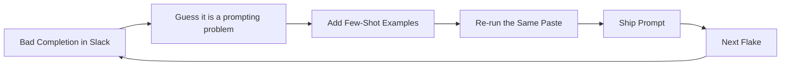
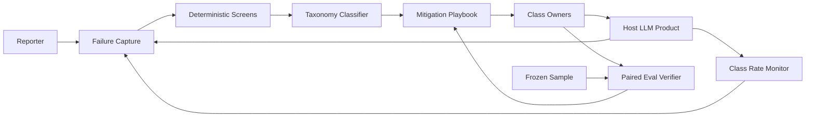
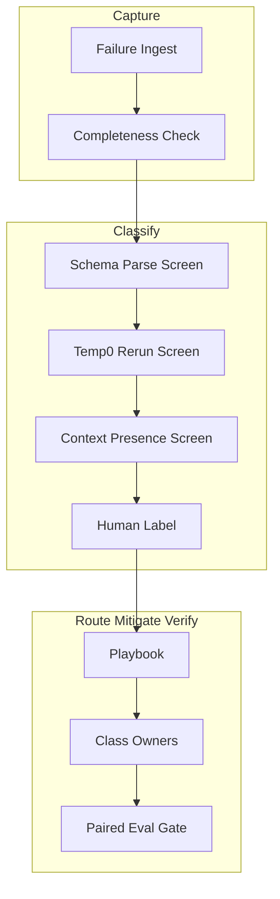
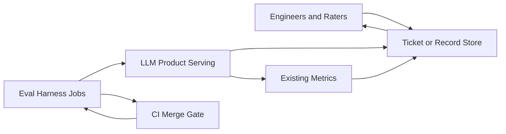

# LLM Output Flakiness Triage — Architecture Document
> - **Document Status**: Draft
> - **Last Updated**: 2026 Aug 29
> - **Author**: Paul Serban

A **triage pipeline** that sits beside an existing LLM surface so that "the output is flaky" becomes a labeled failure class, a routed lever, and a paired before/after — not another few-shot example in the system prompt. This document covers *what* the system is and *why* it is shaped this way; see [System Design](./03_system_design.md) for *how* records, classification, the playbook, and verification actually work.

## Overview

**Brief description**: This is internal quality infrastructure, not a customer-facing product and not a prompt file. It is scoped narrowly on purpose: one failure (a prompt, a completion, sampling params, optional retrieved context, a reporter) in; a primary class, a routed mitigation, and a verification result out. It does not generate the user-facing answer. It does not replace retrieval. It does not "make the model consistent."

**Business Context**
- Owner: the team that already owns the LLM surface and is currently losing the "just add examples" argument in Slack (see [Scenario and Requirements](./01_scenario_and_requirements.md)).
- Current state: incident-driven prompt patches. Few-shot examples accumulate. There is no class label, no owner split between prompt / retrieval / decoding, and no check that the patch moved anything except the original paste.
- Desired future state: Capture → Classify → Route → Mitigate → Verify. Few-shot is a scoped tool for format/style, not the default response to unlabeled flakiness.
- Goal: stop spending tokens and calendar on the wrong lever — at the cost of slower one-off patches, a labeled sample you have to fund, and residual misdiagnosis at class boundaries.
- Target users: prompt owner, eval/quality owner, retrieval owner, platform/serving owner, on-call.

## Requirements

### Functional Requirements

- **Capture**:
  - The system must persist a failure record with enough context to classify later: prompt template version, full prompt hash, completion, model id, temperature/top-p/seed, tool/schema version, retrieved chunk ids *and* texts if any, reporter, timestamp.
  - A Slack paste without this context is allowed in as `incomplete_capture`; it cannot proceed to a mergeable mitigation.
- **Classify**:
  - Every record gets a primary class in `{F, R, G, S, A}` or `class_unknown`.
  - Deterministic screens run first (schema/parse → F; re-run disagreement → S candidate).
  - Human (or calibrated suggestion + human confirm) labels the rest. LLM-as-classifier is never the sole authority ([ADR-005](./04_architecture_decision_records.md#adr-005)).
- **Route**:
  - The playbook maps class → allowed levers and named owner.
  - A mitigation PR must cite `failure_record_id`(s) and `failure_class`.
- **Mitigate**:
  - Allowed levers are class-specific. Few-shot is in-bounds for F (and as illustration of a rewritten A contract), out-of-bounds as the *primary* lever for R/G/S without an override ([ADR-002](./04_architecture_decision_records.md#adr-002)).
  - Structured output is preferred over few-shot for F where the provider supports it ([ADR-003](./04_architecture_decision_records.md#adr-003)).
- **Verify**:
  - A mitigation is not a fix until a paired before/after on a frozen sample reports the **target class rate** moved (or an explicit inconclusive / override). The original ticket is not the sample ([ADR-004](./04_architecture_decision_records.md#adr-004)).
- **Observe**:
  - Class rates, few-shot token share, parse-fail rate, re-run disagreement rate, rater disagreement, override count.

### Non-Functional Requirements

**Performance Requirements:**
- Triage latency is a human-workflow SLO, not a serving SLO. Design intent: a complete capture + deterministic screens in seconds; a primary label the same day for anything that is blocking a ship; paired verify in whatever time the eval harness already needs for a frozen sample (tens of minutes, not seconds — shrinking the sample to "go faster" is forbidden).
- The triage path is **not** on the user-facing generation hot path. Deterministic parse/validate *may* already exist on that path as a product feature (reject-and-retry). That is a Class F control, not this system's runtime.
- Classifier suggestions, if ever automated (Phase 5), are async and budgeted. They must not add a second LLM call to 100% of production traffic.

**Service Level Agreement (SLA):**
- System criticality: quality-adjacent. A misrouted Class G "fixed" with examples can ship a confident wrong answer forever. A blocked prompt PR because classification is backlogged is also a cost. Neither is five-nines.
- The *eval verifier*'s availability matters at mitigation-merge time (fail closed: no sample, no merge as a "fix"). It does not need to run on every production request.
- Detection lag for a class-rate spike is bounded by the production monitoring cadence in Phase 4. Claiming "we notice immediately" is a lie unless parse-fail is already a live metric (Class F only).

**Infrastructure Constraints:**
- Technology shape (not an implementation mandate): a table or ticket subtype for failure records; a labeling guide; a job that can re-run a prompt at temperature 0; access to the existing eval harness for paired compare; CI as the merge gate; metrics already used by the host product. This is not an excuse to buy an "LLM observability platform" on day one.
- Capture of prompts and completions is production data. Retention, PII, and training-use restrictions inherit from the host product. A spreadsheet of customer tickets is an incident, not Phase 1.
- Structured-output / grammar constraints depend on the serving provider. If the provider cannot constrain decoding, Class F falls back to validate-and-retry plus optional few-shot. The architecture does not assume OpenAI-shaped function calling.

## Executive Summary

The architecture is **Capture → Classify → Route → Mitigate → Verify**. It is a workflow with a data model and a gate, not a prompting technique.

1. **Capture** turns a complaint into a record with the fields classification actually needs (including sampling params and retrieved text, not just the completion).
2. **Classify** applies cheap deterministic screens, then a human using a frozen taxonomy. The output is a primary class, optional secondary tags, and a disagreement bit.
3. **Route** is a lookup: class → owner → allowed levers. The playbook is the product.
4. **Mitigate** is ordinary engineering (schema, retrieval, temperature, instruction rewrite, occasionally few-shot). It is not special except that it must cite the class.
5. **Verify** is a paired eval on a frozen sample, class-stratified when the sample allows. Pass / fail / inconclusive. Inconclusive is legal.

**Architecture Style:** Human-in-the-loop triage pipeline with deterministic pre-screens and an external paired-eval gate. Not an agent. Not a second model that "decides why the first model failed."

**Key Components:**
- **Failure Capture**: record + completeness check.
- **Deterministic Screens**: schema/parse, re-run-at-T=0, missing-context heuristic.
- **Taxonomy Classifier**: labeling guide, human raters, optional later suggestions.
- **Mitigation Playbook**: routing table and PR citation rule.
- **Regression Verifier**: paired before/after via the existing eval harness.
- **Example Budget**: tracked few-shot tokens, expiry, owner.
- **Class-Rate Monitor**: Phase 4 production signals, not a day-one dashboard product.

**Architecture Principles:**
- **Flaky is not a class.** It is a complaint. The system starts when the complaint becomes F, R, G, S, or A.
- **Levers are not interchangeable.** Format examples do not retrieve documents.
- **The cheapest correct control wins.** Schema constraint beats N few-shot examples on the hot path when both would move Class F.
- **The ticket is not the test.** Overfitting the report is how few-shot looks like a miracle.
- **Misdiagnosis is a first-class event.** Fuzzy boundaries are required to be visible.
- **Do not rebuild the eval harness.** Cite it. Gate on it.

**Key Architectural Decisions:**
1. Diagnosis-before-mitigation is a merge gate ([ADR-001](./04_architecture_decision_records.md#adr-001)).
2. Few-shot is scoped to Class F (and A-as-illustration), not a universal patch ([ADR-002](./04_architecture_decision_records.md#adr-002)).
3. Structured output preferred over few-shot for format drift ([ADR-003](./04_architecture_decision_records.md#adr-003)).
4. Paired before/after on a frozen sample is required to call a mitigation a fix ([ADR-004](./04_architecture_decision_records.md#adr-004)).
5. Classifier is human-seeded and heuristic-first; LLM-as-classifier is optional, async, calibrated ([ADR-005](./04_architecture_decision_records.md#adr-005)).

### The Anti-Pattern This Design Exists to Kill

This fails because:

- There is no class, so the wrong lever is the default lever.
- The evaluation set is the ticket. Apparent fixes are overfitting.
- Examples accumulate. Cost, latency, and window pressure grow without an owner.
- Retrieval and decoding owners never see the failure. The prompt file absorbs every incident.
- The teammate who said "just add examples" is empirically "right" on the one paste, so the loop is self-sealing.

### Context Diagram

## Runtime Architecture

1. **A failure arrives** from a human report, a parse-fail metric, a CI flake, or (Phase 4) a class-rate monitor.
2. **Capture** writes the record. If sampling params or retrieved texts are missing, status is `incomplete_capture`; the playbook stops.
3. **Deterministic screens** run: schema/parse, optional temperature-0 re-run, optional "was any retrieved text present / did the claim appear in chunks."
4. **Classification**: auto-label only when the screen is decisive (hard parse fail with a valid-looking answer otherwise → F). Otherwise human label using the guide. `class_unknown` is allowed and time-boxed.
5. **Route**: playbook returns owner + allowed levers + forbidden default (few-shot on R/G/S).
6. **Mitigate** in the owner's system (prompt repo, index, serving config). The change cites the record id and class.
7. **Verify**: paired eval vs the frozen sample's baseline. Target metric is the **class rate**, not a generic "quality" mean. Outcome pass / fail / inconclusive.
8. **Record the outcome** on the failure record. If few-shot was used, it enters the example budget with an expiry tied to the next eval.

This runtime is mostly people and tickets in Phase 1. Components below are logical. Automating them before the taxonomy holds on real cases is how you ship a classifier that is as flaky as the model.

## Components

### 1. Failure Capture

**Purpose**: Make a flake a joinable object instead of a Slack screenshot.

**Responsibilities:**
- Persist the fields in [System Design — Data Model](./03_system_design.md#1-data-model).
- Enforce completeness for mergeable mitigations: model id, temperature, prompt version, completion, and retrieved texts if the surface is RAG.
- Attach provenance: prod trace id vs. playground paste vs. eval-harness item.
- Redact / inherit PII rules. Capture that cannot be stored must still be classifiable from a redacted bundle (schema-fail bits, hashes, chunk ids) or it must be dropped — not pasted into a doc.

**Interactions:**
- Reads: serving traces, eval runs, human paste (worst, still allowed).
- Writes: `failure_record`.
- Honesty: if production tracing does not currently log retrieved *text* (only ids), Class G cannot be diagnosed after the index changes. That is a platform gap. Phase 0 is allowed to block on it.

### 2. Deterministic Screens

**Purpose**: Take the easy classes off the human queue, and generate evidence for the hard ones.

**Responsibilities:**
- **Schema/parse screen:** run the product's actual parser/validator. Failure → Class F candidate (often decisive). Success does not mean "not F" (wrong enum that still parses can be F); it means "not a parse fail."
- **Re-run screen:** same prompt, same context, temperature 0 (and/or seed if honored). If the original was T>0 and answers disagree → Class S candidate. If they *agree and are still wrong* → S is the wrong class; remaining work is R or G.
- **Context-presence screen (RAG only):** for extracted claims that are fact-like, cheap string/overlap or existing groundedness score if [hallucination detection](../../prj--llm-hallucination-detection/README.md) exists. No overlap and no chunks → G candidate. Overlap and still wrong → R candidate. This screen is a heuristic. It will mis-fire. It does not auto-merge.

**Interactions:**
- Reads: failure record, parser, serving API (re-run), optional NLI/groundedness.
- Writes: `screen_results` on the record; may set `suspected_class`.

**Honesty about this component:** the re-run screen costs tokens. Budget it. Do not re-run k=10 as a "screen." One T=0 retry is the screen; k-sampling is a Class S *mitigation* you have not yet earned.

### 3. Taxonomy Classifier

**Purpose**: Produce a primary class a human will defend in a PR description.

**Responsibilities:**
- Publish a labeling guide with the five classes, worked examples, and "when to use `class_unknown`."
- Measure inter-rater agreement on a calibration batch. If agreement is coin-flip, the taxonomy or the guide is wrong — do not automate.
- Store `confirmed_class`, `secondary_tags`, `rater_id`, `disagreement`.
- Optionally (Phase 5) propose a class. Never auto-confirm from an LLM. Same stance as [prj--llm-hallucination-detection](../../prj--llm-hallucination-detection/README.md) and [prj--support-bot-eval-harness](../../prj--support-bot-eval-harness/README.md): uncalibrated judges are decoration.

**Interactions:**
- Reads: record + screen results + labeling guide version.
- Writes: class fields. Feeds the playbook.

**Honesty about this component:** R vs. G will be the disagreement hotspot. The design's job is to **force the rater to look at retrieved text**, not to magically separate "ignored the clause" from "the clause wasn't really there." If retrieved text is missing from the record, the classifier must return `class_unknown` or G-by-insufficiency, not R.

### 4. Mitigation Playbook

**Purpose**: Be the routing table that makes the 2-minute answer operational.

**Responsibilities:**
- Map class → owner → allowed levers → default lever → forbidden default.
- Require `failure_class` + `failure_record_id` on mitigation PRs (checklist in Phase 2, CI comment in Phase 3).
- Track overrides (few-shot used on a non-F class) as an auditable exception, not a quiet merge.
- Own the **example budget**: list of few-shot pairs, token count, linked schema/instruction version, linked eval result, expiry.

**Interactions:**
- Reads: confirmed class.
- Writes: nothing on the generation path. Constrains how owners change the product.

The lookup itself is in [System Design §3](./03_system_design.md#3-mitigation-playbook).

### 5. Regression Verifier

**Purpose**: Stop "I re-ran the ticket" from counting as science.

**Responsibilities:**
- Call the existing paired-eval path ([prj--support-bot-eval-harness](../../prj--support-bot-eval-harness/README.md)) on a **frozen sample**, preferably stratified so Class F items, Class G items, etc. can be reported separately.
- Primary metric for the gate: **target class rate** (e.g. parse-fail rate for an F mitigation; claim-unsupported rate for a G mitigation; pairwise disagreement on re-run for an S mitigation). Secondary: "did we tank another class."
- Emit pass / fail / inconclusive. Inconclusive (sample too small to see the effect) is not a pass.
- The original failure record may be *added* to the next golden-set version; it must not be the only item.

**Interactions:**
- Reads: candidate prompt/model/index/decoding config vs. baseline.
- Writes: `eval_run_id` and outcome onto the failure record / PR.

**Honesty about this component:** a 15-item sample cannot detect a 2-point drop. If the team refuses to size the sample, the gate will be inconclusive often, and people will start treating inconclusive as pass. That is the eval harness's failure mode and this project's too. See [ADR-004](./04_architecture_decision_records.md#adr-004).

### 6. Class-Rate Monitor (Phase 4)

**Purpose**: Notice when a class comes back after the playbook "fixed" it — and when a prompt change elsewhere regresses Class F while you were staring at Class R.

**Responsibilities:**
- Cheap live metrics: parse/schema fail rate (F), T=0 vs. sampled disagreement on a tiny canary (S), groundedness-fail rate if that detector exists (G-ish).
- Expensive metrics: human-labeled R/A rates on an audit sample. These will always be lagged.
- Alert on spikes with an evidence pack, not a vibe. Do not auto-rollback the prompt by default.

**Honesty about this component:** R and A are not fully observable without labels. A monitor that only plots parse fails will declare victory while reasoning errors climb. Publish the blind spot on the dashboard or do not call it a flake dashboard.

### Communication Patterns

**Synchronous:**
- Parser/validator on the product hot path (product feature).
- Capture API or ticket form when a human files a flake.
- CI talking to the eval harness at mitigation-merge time.

**Asynchronous:**
- Re-run screens.
- Human labeling queue.
- Phase 5 classifier suggestions.
- Phase 4 monitors and canaries.

There is no synchronous "ask another LLM why this failed" on the user path. That is a second flaky system.

## Brutal Honesty

This pipeline is **materially slower** than pasting two examples and re-running the ticket. It adds:

- A data model and a completeness rule (you cannot classify what you did not capture)
- A labeling discipline and a second human on a calibration batch
- A routing conversation ("this is retrieval's bug") that the teammate did not want
- A paired eval that costs tokens and can return `inconclusive`
- An example budget someone has to prune
- Residual arguments about R vs. G

**When this is justified:** the surface is production, flakes are recurring, prompt tokens are already growing, more than one class is showing up, or a wrong answer has product/safety cost. The interview scenario is this world.

**When this is overkill:** a weekend prototype, a one-off internal summarizer, a confirmed Class F preamble on a provider with no structured output — add the examples, set a reminder to delete them, do not build a taxonomy service. See [Trade-offs](./05_tradeoffs_and_honest_assessment.md).

**Classification will be wrong some of the time.** A wrong-answer-with-docs-in-context is genuinely ambiguous between "the model didn't use the docs" and "the docs were the wrong docs / truncated / stale." This system **reduces** "we always add examples" misdiagnosis. It does not eliminate misdiagnosis. Anyone who sells a five-class taxonomy as a crisp partition is lying about language models *and* about language.

**The 2-minute answer can still lose the room.** A teammate who ships a prompt change in twenty minutes will sometimes be locally right (the paste was Class F). The architecture has to *admit* that case or it becomes religion. The playbook therefore includes "few-shot is allowed here" in writing.

**Complexity you will actually pay:**
- Tracing must log retrieved text, sampling params, and schema version or Class G/S/F collapse into folklore.
- Golden-set stratification by class is extra curation work on top of the eval harness you already didn't want to staff.
- Example expiry will be ignored unless CI fails a "few-shot token budget" check. Social processes do not delete tokens.
- Phase 5 automation will be requested immediately. Shipping it before rater agreement is measured is how the classifier becomes the new flake.

## Scaling Strategy

**Current (Phase 1–3):** tickets + a table + humans + the existing eval harness. Horizontal scale is not a problem. Human labeling is the bottleneck.

**Bottlenecks:**
- Primary: rater time and rater disagreement (R vs. G).
- Secondary: eval-harness runtime at merge (people will skip the gate if it is an hour).
- Tertiary: capture completeness from production traces.

**Scale-out (Phase 5, conditional):** suggested class from heuristics + a calibrated model, still human-confirmed; self-consistency infra for Class S at production volume. Do not scale the taxonomy to twelve classes because a blog post named more failure modes. Twelve classes with 40% agreement is worse than five with 75%.

### Component Diagram (Logic View)

### Deployment Diagram (Physical View)

Phase 1 can be a ticket template and a spreadsheet of labels. That is not an embarrassment; it is the proof the taxonomy works. A dedicated service before that proof is costume.

## Data Architecture

See [System Design](./03_system_design.md) for field-level description. Summary:

- **`failure_record`** is the unit of work. It is not the golden set. Promoting a record into the frozen sample is a versioned eval-set change.
- **`label_event`** is append-only (who labeled what class under which guide version). Disagreement is reconstructed from events, not overwritten.
- **`mitigation`** points at a product change (prompt sha, index version, serving config) and at the eval run that judged it.
- **`few_shot_example`** is a first-class row with token count and expiry, not a blob inside an unmarked system prompt.

The platform does not treat the failure record as production truth about model quality. It is a biased sample of things humans noticed plus things cheap screens caught. Class rates on this store are not population rates until Phase 4 sampling says so.

## Cost Analysis

This is not an AWS bill exercise. The costs that matter:

- **Wrong-lever spend (status quo):** few-shot tokens on every production call, forever, for a class they cannot move; engineer hours re-litigating the same flake; residual wrong answers.
- **Triage spend (this design):** capture/tracing, rater hours, eval tokens at merge, occasional T=0 re-run screens.
- **Correct-lever spend:** schema decoding (usually cheaper than examples), retrieval work (often larger than a prompt PR — that is the point; the work was being avoided), temperature/config (cheap).

Price the architecture against the **permanent per-call tax** of the status quo plus the incident cost of a Class G/R miss, not against "a ticket template looks like process overhead."

If the product is a low-QPS internal tool, the per-call tax is small and this design's human overhead can exceed it. Say so and pick the small path. See [Trade-offs](./05_tradeoffs_and_honest_assessment.md).

## Risks and Mitigation

| Risk | Likelihood | Impact | Mitigation | Owner |
| --- | --- | --- | --- | --- |
| Team skips classification under schedule pressure | High | High | Merge checklist / CI comment requiring `failure_class`; overrides audited ([ADR-001](./04_architecture_decision_records.md#adr-001)) | Prompt owner + eval owner |
| R vs. G disagreement hidden by picking a class at random | High | High | Require retrieved text on RAG records; disagreement metric; `class_unknown` allowed | Eval owner |
| Paired eval sample too small; inconclusive rounded to pass | High | High | Three-way gate; do not ship "fix" language on inconclusive ([ADR-004](./04_architecture_decision_records.md#adr-004)) | Eval owner |
| Few-shot still used as default because schema support is missing | Medium | Medium | Validate-and-retry; then bounded examples with expiry ([ADR-003](./04_architecture_decision_records.md#adr-003)) | Platform owner |
| Capture missing retrieved text / temperature | High | High | Completeness gate; Phase 0 can block | Platform owner |
| Taxonomy grows until unusable | Medium | Medium | Versioned taxonomy; new class requires agreement data, not a blog post | Architect |
| Phase 5 LLM classifier shipped uncalibrated | Medium | High | Agreement floor before suggestions; never sole authority ([ADR-005](./04_architecture_decision_records.md#adr-005)) | Eval owner |
| Applying this machine to a throwaway prototype | Medium | Low (waste) | Non-goals; [Trade-offs](./05_tradeoffs_and_honest_assessment.md) | Architect |

## Future Enhancements

Covered by phases rather than a wishlist: taxonomy proof, deterministic screens, eval gate, production class rates, then conditional automation. See [Phased Implementation Plan](./06_phased_implementation_plan.md).

**Known/Accepted Trade-offs:**
- Slower patches for faster correct patches and a cheaper hot path.
- Fuzzy classes with visible disagreement, instead of a fake crisp ontology.
- Dependence on the eval harness existing (or a Phase 3 stub that is honest about its weakness).
- Few-shot still allowed for confirmed Class F — the 2-minute answer is not "examples are immoral."
