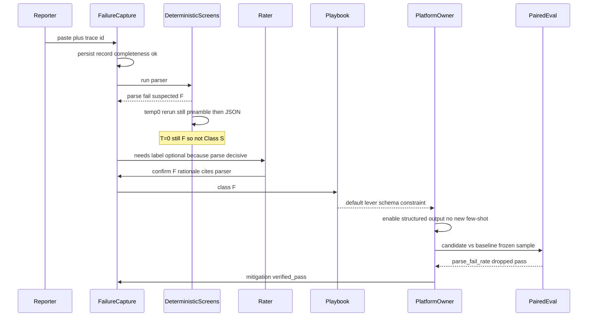
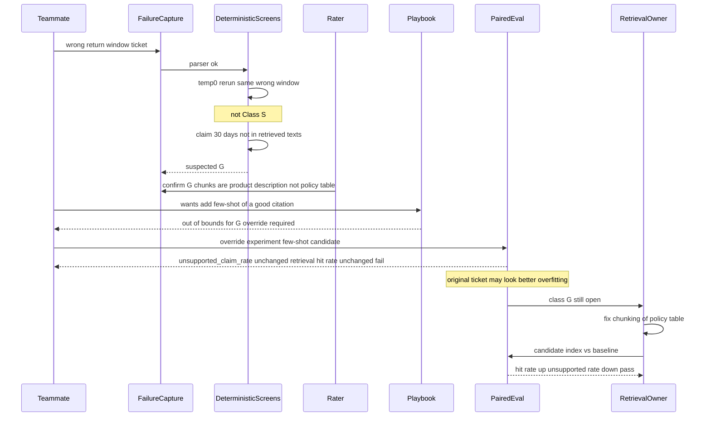
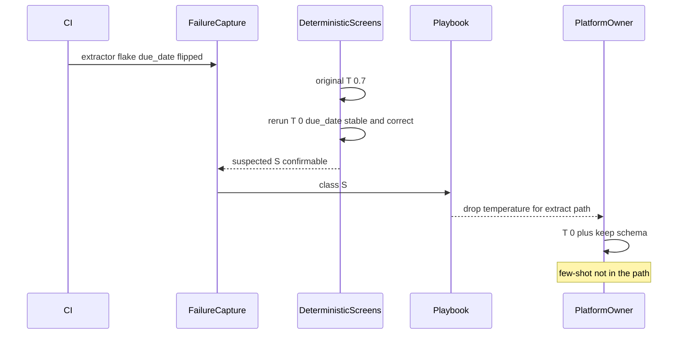

# LLM Output Flakiness Triage — System Design

This document describes *how* the triage path works internally: the data model, classification workflow, mitigation playbook, and the sequences that actually answer the scenario (a correctly routed fix, and a few-shot patch on a retrieval bug failing the gate). It complements the [Architecture Document](./02_architecture_document.md), which covers *what* the system is and *why* it is shaped this way.

> This is a design specification. No capture service, classifier, or eval runner is implemented as part of this documentation deliverable. Numbered steps are the intended behavior, not a source file.

## 1. Data Model

Four logical stores. They may be a ticket template plus a spreadsheet in Phase 1. They must not be collapsed into "the system prompt and a Slack thread."

### 1.1 `failure_record`

The unit of triage. One row per reported or auto-captured flake. Not the golden set.

| Field | Role |
| --- | --- |
| `record_id` | Stable id. Cited on mitigation PRs. |
| `surface_id` | Which LLM product/surface. |
| `provenance` | `prod_trace` \| `playground` \| `eval_item` \| `human_paste` |
| `trace_id` | Join to serving logs when provenance allows. |
| `model_id` | Provider model string *and* any fingerprint/version header if present. |
| `prompt_template_version` | Named version, not "whatever is in main." |
| `prompt_hash` | Hash of the fully rendered prompt. |
| `sampling` | Temperature, top-p, seed, n. Missing → `incomplete_capture`. |
| `schema_version` | Tool/JSON schema id if the call was structured. |
| `retrieved_chunk_ids` | Index ids at request time. |
| `retrieved_chunk_texts` | The actual text the model saw. Ids-only is insufficient for Class G vs R. |
| `completion` | The output under dispute. |
| `parser_result` | `{ok, error, parsed}` from the product's real parser. |
| `reported_by` | Human or `auto:parse_fail` / `auto:monitor`. |
| `reported_symptom` | Free text ("wrong refund", "sometimes JSON"). Not a class. |
| `suspected_class` | From deterministic screens. Optional. |
| `confirmed_class` | `{F, R, G, S, A, class_unknown}` after labeling. |
| `secondary_tags` | Optional extra classes (F+R is common). |
| `label_guide_version` | Which guide the confirmer used. |
| `status` | `incomplete_capture` \| `screens_pending` \| `needs_label` \| `labeled` \| `mitigation_open` \| `verified_pass` \| `verified_fail` \| `verified_inconclusive` \| `wont_fix` |
| `linked_mitigation_id` | Once someone is changing the product. |
| `linked_eval_run_id` | Paired before/after run. |

**Completeness rule:** for a RAG surface, `retrieved_chunk_texts` (or an honest `retrieval_unavailable` flag) is required before `confirmed_class` may be R. Without texts, the allowed confirmed classes are G (insufficient evidence in context — we cannot prove otherwise), F, S, A, or `class_unknown`. Confirming R without the chunks is how the taxonomy launders a retrieval bug into a prompt bug.

### 1.2 `label_event`

Append-only. Overwriting `confirmed_class` without an event is how disagreement disappears.

| Field | Role |
| --- | --- |
| `record_id` | Parent. |
| `rater_id` | Who. |
| `class` | Their primary class. |
| `secondary_tags` | Their extras. |
| `confidence` | `high` \| `medium` \| `low` — ordinal, not a fake probability. |
| `rationale` | Short, required. "Looks wrong" is not a rationale. Must cite screen results or a span in completion/chunks. |
| `guide_version` | Frozen with the taxonomy. |
| `labeled_at` | |

Disagreement = two events on the same record with different primary class. Metric: pairwise agreement on a calibration batch, per class (R vs G will be worst).

### 1.3 `mitigation`

A product change claimed to address one or more records of one primary class.

| Field | Role |
| --- | --- |
| `mitigation_id` | |
| `failure_class` | The class it claims to move. Required. |
| `record_ids` | Evidence, not the eval set. |
| `owner` | Prompt / retrieval / platform / product-logic. |
| `lever` | Enum from the playbook (e.g. `schema_constraint`, `few_shot_add`, `temperature_drop`, `query_rewrite`, `instruction_rewrite`, `tool_offload`, `majority_vote`). |
| `artifact` | Prompt sha, index version, serving config pointer. |
| `few_shot_delta_tokens` | 0 if unused. |
| `override` | True if the lever is out-of-policy for the class (few-shot on G, etc.). Requires named approver. |
| `eval_run_id` | Paired compare. |
| `eval_outcome` | `pass` \| `fail` \| `inconclusive` |
| `target_metric` | e.g. `parse_fail_rate`, `rerun_disagreement`, `unsupported_claim_rate` |

### 1.4 `few_shot_example`

First-class so they can die.

| Field | Role |
| --- | --- |
| `example_id` | |
| `surface_id` | |
| `created_for_record_id` | Why it exists. |
| `schema_or_instruction_version` | What it illustrates. If that version is gone, the example is expired. |
| `token_count` | Input tokens added to every subsequent call. |
| `expires_after_eval` | Next paired run that must re-justify it. |
| `status` | `active` \| `expired` \| `removed` |

There is no "examples live only in the prompt file with no row." That is the status quo this table exists to kill.

### 1.5 What is *not* a table

- A `processed_flake_ids` cache of Slack message ids without the completion and context. Capture without replay is folklore.
- A twelve-class ontology table. New classes are a taxonomy version bump with an agreement study, not a migration every time someone reads a paper.

## 2. Classification Workflow

Cheap and decisive first. Humans on the remainder. An LLM does not get to be the authority. Numbered so an implementation (or a Phase 1 ticket workflow) can be traced 1:1.

1. **Completeness check.** Missing sampling params → `incomplete_capture`, request them. RAG missing chunk texts and no `retrieval_unavailable` → same. Do not label from a screenshot of the completion alone except as F (parse) if the parser output is attached.
2. **Schema/parse screen.** Run the product parser/validator.
   - Fail → `suspected_class = F`. If the *payload* (when parsed with a sloppy fallback) is otherwise what the reporter wanted, **auto-confirm F** and skip to playbook. If the payload is also semantically wrong, auto-tag F as secondary and continue — do not stop, you will miss R/G.
   - Pass → not a parse fail. Continue.
3. **Re-run screen (Class S).** If original temperature > 0 (or seed was unset): one additional call at temperature 0 with the same prompt and context.
   - Disagree with original → `suspected_class = S` (candidate). Confirm S if the T=0 answer is *acceptable* and the flake was "sometimes." If T=0 is also wrong, S is not the primary class; variance is a side issue.
   - Agree and wrong → S is unlikely as primary. Continue.
   - Provider does not honor seed/T=0 (output still wanders): record `seed_not_honored`. Class S mitigations that depend on seed are then invalid; validate-and-retry or majority vote remain.
4. **Context-presence screen (RAG only).** Extract a small set of checkable claims from the completion (heuristic: numbers, dates, ids, policy verbs). For each, search retrieved texts.
   - No retrieved texts at all → G candidate (or incomplete capture).
   - Claims not supported by chunks → G candidate.
   - Claims supported and still the wrong *decision* (refund issued despite a matching "must not" clause) → R candidate.
   - This screen **never auto-confirms** R or G. It fills `suspected_class` and a `screen_note` the rater must address.
5. **Human label.** Rater reads completion, prompt instruction (not only examples), sampling, screen notes, and chunks. Picks primary class or `class_unknown`. Writes a rationale that cites a span. Second rater on a sampled slice (100% of calibration batch; later, a %).
6. **Disagreement protocol.** Two different primaries → discussion or a third rater, else keep `class_unknown` and time-box. Do not average into "quality issues."
7. **Taxonomy version.** Labels are invalid under a different guide version without relabel. Historical records keep their old class and guide version.

**What an automated classifier is allowed to decide alone (v1):** Class F when the parser failed and there is no competing semantic complaint, and *maybe* Class S when T=0 is good and T>0 disagrees. Everything else is suggestion-only (Phase 5) or human.

**What it is not allowed to decide alone:** R vs. G, A vs. anything, "the model hallucinated," safety. Those are the classes where an LLM-as-classifier is most correlated with the generator and most overconfident.

## 3. Mitigation Playbook

A mitigation PR / change must cite `failure_class` and `record_id`s. The playbook is a lookup, not a brainstorm.

| Primary class | Owner | Default lever (try first) | Also in bounds | Out of bounds as *primary* without override + eval |
| --- | --- | --- | --- | --- |
| **F** Format / schema | Platform + prompt | Schema-constrained decoding / function-calling / grammar; else validate-and-regenerate | Small versioned few-shot illustrating the schema; parser hardening | A growing few-shot zoo *instead of* a schema the provider already supports |
| **R** Reasoning | Product logic + prompt | Tool-offload the rule/arithmetic to code; decompose (extract then decide) | Stronger model; inspected scratchpad; verification step that is itself eval'd | Few-shot of "a correctly reasoned example" as the control |
| **G** Retrieval | Retrieval / RAG | Fix chunking, query rewrite, filters, coverage, recency | Groundedness check; refuse when unsupported | Few-shot of a correctly cited answer; pasting the missing doc into the prompt as a fake index |
| **S** Sampling | Platform | Temperature/top-p down for extract/tool calls; verify seed; validate-and-retry | Majority vote / self-consistency when T>0 is *required* for quality and k× is funded | Few-shot to "stabilize" CI; raising temperature and adding examples |
| **A** Ambiguous instruction | Prompt owner | Rewrite the instruction (audience, missing-data policy, length, forbidden content) | One or two examples *of the rewritten contract* | Examples without rewriting the instruction; one example per newly noticed interpretation |

**Rule: a mitigation PR must cite a failure class.** Phase 2 is a checklist. Phase 3 is a CI comment / required field. No class, no "fix" language in the merge.

**Rule: few-shot adds must create `few_shot_example` rows** with token count and `created_for_record_id`. Prompt diffs that add unmarked examples fail the checklist.

**Override path:** lever out of bounds (typically few-shot on R/G/S) requires (1) named approver, (2) `override=true`, (3) a paired eval that shows the **target class rate** moved, (4) a written hypothesis for why (so the next person can falsify it). Overrides without (3) are not mitigations; they are experiments and must not ship to production as fixes.

## 4. Verification

Reuse the paired-comparison gate from [prj--support-bot-eval-harness](../../prj--support-bot-eval-harness/_docs/02_architecture_document.md). This project specifies *what to measure*, not a second harness.

1. Freeze a sample (or a stratum of the existing golden set) **before** looking at the mitigation's effect on the original ticket. Adding the ticket to the set is a version bump for a *later* run.
2. Run baseline (current production prompt+model+index+decoding) and candidate (the mitigation) on the same items.
3. Score the **target class metric**, not only a generic rubric mean:

| Class of mitigation | Target metric | Also watch |
| --- | --- | --- |
| F | Parse/schema fail rate; exact-schema pass rate | Latency/token cost (schema vs. few-shot) |
| R | Rubric / human / rule-check error rate on items where context was sufficient | Safety/policy stratum |
| G | Unsupported-claim / groundedness-fail rate; retrieval hit rate on needed docs | Answer correctness *given* retrieval (don't credit a G fix that didn't improve hits) |
| S | Pairwise disagreement on double-run; CI flake rate | Mean quality if you dropped temperature |
| A | Rater disagreement on "did it follow the contract"; split by audience | Length/tone regressions |

4. Gate: pass / fail / **inconclusive**. Inconclusive means the sample cannot support the claim. Shipping with "looks fine" on inconclusive is the trap with extra steps.
5. Write `eval_outcome` on the mitigation. Only `pass` may close the failure record as `verified_pass`.

If the eval harness does not exist yet, Phase 3's honest stub is: a frozen file of N items, two columns (baseline/candidate), a scripted parse-fail count and a human pass-rate with a documented N. Do not pretend a stub of 8 items is a statistical gate. See [Phased Implementation Plan](./06_phased_implementation_plan.md).

## 5. Sequence Diagrams

### 5.1 Happy path: bug report → triage → correct lever → verified

Class F, schema constraint available. The 2-minute answer's allowed few-shot case is *not* the default here — schema wins.

### 5.2 The trap, caught: few-shot patch on a retrieval-gap bug

This is the sequence the scenario is about. The teammate's fix is allowed to be *attempted* as an override experiment. It is not allowed to merge as a fix when the Class G metric does not move.

If the override eval is skipped and the few-shot PR merges anyway, the design has failed ASR 1. Phase 3 exists so this sequence cannot be skipped without an explicit, logged override that still requires the eval — eval-fail then blocks.

### 5.3 Class S screen saving a week of prompt archaeology

## 6. Observability (Minimum)

Metrics that change behavior:

- Capture: `incomplete_capture` rate (if this is high, tracing is the real project).
- Screens: parse-fail count, T=0 disagreement rate, context-miss rate.
- Labels: volume by class, **pairwise agreement**, time-to-label, `class_unknown` age.
- Mitigations: count by lever and class; override count; eval pass/fail/inconclusive.
- Examples: total few-shot tokens on the hot path; expired-but-still-active count (this should be zero; it will not be).
- Production (Phase 4): parse-fail rate, canary disagreement rate, groundedness-fail rate if present.

Logs: `record_id`, class, lever, eval_outcome. Not full customer prompts in default logs.

## 7. Mapping Back to the Scenario Questions

| Question | Answer in this design |
| --- | --- |
| Convince them in under 2 minutes | [The 2-Minute Answer](./01_scenario_and_requirements.md#the-2-minute-answer). Few-shot demonstrates a mapping. It does not supply facts, repair reasoning, or reduce sampling entropy. It has a per-call bill and it rots. |
| Why few-shot does or doesn't fix a given failure mode | Taxonomy: F — partially, prefer schema; R — no, bad prior risk; G — no, cannot inject missing context; S — no, does not cut entropy; A — only the demonstrated interpretation, masks the rest. |
| What you'd actually do | Capture with completeness → deterministic screens → human class → playbook lever → paired eval on frozen sample. Route G to retrieval, S to decoding, R to code/tools, F to schema, A to the instruction. |
| Is this just conversational sparring? | No. The merge gate requires a class and a metric. The second sequence is the debate operationalized: their PR fails the Class G rate even if the ticket looks better. |

## 8. Worked Classification Cheatsheet

For the labeling guide (Phase 0 deliverable). Short on purpose.

| You observe | First check | Likely primary |
| --- | --- | --- |
| Parser threw / extra prose / missing key | Parser screen | F |
| Same prompt, two runs, two answers; T>0 | T=0 re-run | S if T=0 is good; else not S |
| Fact/number not in chunks / no chunks | Chunk texts present? | G (or incomplete) |
| Fact *is* in chunks; decision still wrong | Quote the span in rationale | R |
| Two defensible styles/audiences | Did the instruction name the audience? | A |
| Wrong *and* you have no chunks logged | Do not label R | `class_unknown` or G |
| Mix (preamble + wrong amount) | Tag F secondary; keep going | Primary = R or G from the amount, not F |

When unsure between R and G: **default `class_unknown` and pull retrieval**, not default few-shot. The cost of a wrong G→prompt misroute is a permanent confident error. The cost of a wrong R→retrieval investigation is a few days of index work that still often helps.
