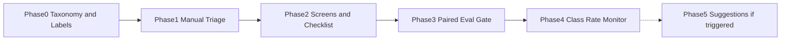

# LLM Output Flakiness Triage — Phased Implementation Plan

Each phase has an **Objective**, **Deliverables**, and an **Exit Gate** that must pass before the next phase begins. Phases 0–4 are sequential. Phase 5 is conditional and may never trigger.

The order is load-bearing: **Phase 1 does not automate classification, and Phase 3 is the first phase that can honestly call a mitigation a fix.** If Phase 0–1 are skipped ("we already know it's a prompting problem, we'll add the gate later"), the trap is back — you cannot prove the taxonomy holds if it never met real tickets.

## Phase 0 — Foundations

**Objective**: Freeze the taxonomy, the labeling guide, and the capture fields before anyone "fixes" a flake under this project's name.

**Deliverables**:
- Taxonomy v1: classes F, R, G, S, A, plus `class_unknown`. Worked examples from *this product's* tickets, not only the illustrative ones in [Scenario](./01_scenario_and_requirements.md).
- Labeling guide: screens to run, R vs. G rule (chunk texts required), mixed F+semantic rule, T=0 protocol. Version id on the guide.
- Capture field list reviewed against [System Design — Data Model](./03_system_design.md#1-data-model). Decision: where records live (ticket template vs. table). PII/retention inherited from the host product.
- Tracing gap list: can production logs supply temperature, model id, prompt version, retrieved **texts**? If not, Phase 0 records the gap. Class G vs. R is blocked without texts.
- First frozen batch: at least **30** real failures (more if a single class would otherwise dominate), sampled from recent tickets/logs, not authored to make few-shot look bad. Dual-labeled by two people using the guide.
- Named owners for the playbook lanes (prompt, retrieval, platform, eval).
- Eval-harness status: exists / stub / neither. If neither, Phase 3 stub plan is written now.

**Exit Gate**:
- [ ] Pairwise agreement on the 30-batch is **measured and published** (overall and F vs. {R,G} vs. S vs. A). If R vs. G is near chance, the guide is revised once and the batch relabeled. If it is still chance, document a temporary collapse (see [Trade-offs §5](./05_tradeoffs_and_honest_assessment.md#5-classification-is-genuinely-fuzzy--operational-rules-for-the-messy-cases)) or **stop** — do not proceed to automation fantasies.
- [ ] Capture completeness rules written: which fields block `confirmed_class = R`.
- [ ] Tracing gaps have owners and a "Phase 1 can start / cannot start" decision. Starting Phase 1 with screenshot-only capture is allowed only if everyone agrees most records will be `class_unknown` or F (parse attached).
- [ ] Owners named. An unnamed "retrieval owner" means Class G will be "fixed" in the prompt file.

**Honesty gate:** if the team will not dual-label 30 items, they may keep the [2-minute answer](./01_scenario_and_requirements.md#the-2-minute-answer) as a talking point. They may not claim a triage system. See [kill criteria](./05_tradeoffs_and_honest_assessment.md#8-kill-criteria).

## Phase 1 — Manual Triage Only

**Objective**: Prove the taxonomy on incoming work with **zero** classifier automation beyond a human running the screens by hand (parser, optional T=0 re-run). Spreadsheet or ticket fields are success, not an incomplete feature.

**Deliverables**:
- Ticket / record template with completeness fields, `suspected_class`, `confirmed_class`, rationale, `label_guide_version`.
- Every new flake for a defined window (e.g. four weeks, or 30 new records, whichever first) goes through the template. Mitigations that happen in that window must cite a class *even if the actual lever is still a prompt change*.
- Weekly count: records by class, `incomplete_capture` rate, agreement on a second-rater sample.
- Playbook used as a **conversation**: "this is G, it goes to retrieval." No CI yet.

**Exit Gate**:
- [ ] ≥30 *new* records (not the Phase 0 museum batch) have `confirmed_class`. `incomplete_capture` rate is known. If it is >50%, tracing work is the next increment, not Phase 2 automation.
- [ ] At least one record each of F, and of {R or G}, actually occurred — if the window is 100% F preambles, the product's problem is Class F and the playbook should say so; do not invent G tickets to look complete.
- [ ] At least one mitigation was routed away from few-shot because of class (e.g. temperature drop, schema, retrieval ticket). If every "triage" still ended in unmarked examples, the process is costume — fix that socially before Phase 2 checklists.
- [ ] No LLM classifier in this phase (review the path).

**Honesty gate:** product will want Phase 2 tools immediately. The compromise is a short Phase 1 on real tickets, not skipping the proof because "the taxonomy is obvious."

## Phase 2 — Deterministic Screens + Playbook as Checklist

**Objective**: Take the easy classes off the human's back, and put teeth on PRs without claiming measurement yet.

**Deliverables**:
- Parse/schema screen using the **product's** parser, attached to the record. Auto-confirm F when the screen is decisive and there is no competing semantic complaint ([System Design §2](./03_system_design.md#2-classification-workflow)).
- T=0 re-run screen, budgeted (one retry, not k=10). Seed-not-honored noted if applicable.
- Context-presence heuristic for RAG as **notes**, not auto-confirm.
- PR checklist (or equivalent): `failure_class`, `record_id`, lever, `few_shot_delta_tokens`, override flag. Unmarked example diffs fail the checklist.
- `few_shot_example` inventory of **existing** prompt examples: token count, guessed age, linked schema. Anything that cannot be linked is `expired` pending justification.

**Exit Gate**:
- [ ] A parse-fail fixture auto-tags F; a T=0-stable-and-correct vs T>0-disagree fixture tags S candidate.
- [ ] A prompt PR that adds examples without `failure_class` is blocked by checklist (or is reverted in a drill).
- [ ] Existing few-shot token budget is a published number with an owner.
- [ ] Humans still confirm R/G/A. Screens do not silently confirm them.

Phase 2 still **cannot** call a change a verified fix. It can only stop unlabeled example dumps.

## Phase 3 — Mandatory Paired Verification

**Objective**: Make "I re-ran the ticket" insufficient to merge a fix. This is the first phase that operationalizes sequence [§5.2](./03_system_design.md#52-the-trap-caught-few-shot-patch-on-a-retrieval-gap-bug).

**Deliverables**:
- Frozen sample for verification: reuse the eval harness golden set with **class tags** where items can be tagged; otherwise a dedicated frozen file. Versioned. The Phase 0/1 records may be *promoted* into a new version; they are not silently used as the only items.
- Target metrics per class wired to the gate ([System Design §4](./03_system_design.md#4-verification)).
- CI or merge job: mitigation artifact vs. baseline → `pass` / `fail` / `inconclusive`. `verified_pass` only on pass.
- Override path implemented as data, not Slack: approver, hypothesis, eval still required.
- If the [eval harness](../../prj--support-bot-eval-harness/README.md) is not available: a stub with documented N, class-specific counts, and a written prohibition on claiming significance the stub cannot support. Inconclusive must still be a possible output (e.g. "N<20 for this class → inconclusive").

**Exit Gate**:
- [ ] Drill: few-shot-only candidate on a Class G-tagged slice does **not** get `verified_pass` if unsupported-claim / retrieval-hit metrics do not move — even if the original ticket looks better.
- [ ] Drill: schema (or validate-and-retry) candidate on a Class F slice *can* pass on parse-fail rate.
- [ ] Inconclusive is produced at least once in a drill (undersized stratum) and is **not** mapped to pass.
- [ ] Checklist from Phase 2 still required (regression: eval is not a substitute for a class label).

**Honesty gate:** if N is too small to ever pass, engineers will hate the gate and route around it. Either fund sample size or keep saying `inconclusive` and do not use "fix" language. Do not lower N to get green CI.

## Phase 4 — Production Class-Rate Monitoring

**Objective**: Notice when a class returns, and stop using the biased failure store as if it were traffic.

**Deliverables**:
- Live cheap metrics: parse/schema fail rate (F); optional small canary double-run disagreement (S); groundedness-fail rate if [hallucination detection](../../prj--llm-hallucination-detection/README.md) exists (G-ish).
- Lagged expensive metrics: audit sample labeled on a cadence (R/A). Rate-limited on purpose.
- Alert on spikes with an evidence pack (`record_id`s, stratum, recent mitigations). No auto-rollback of the prompt by default.
- Few-shot token share as a dashboard number next to class rates — so a "quality win" that added 2k tokens is visible.
- Recalibrate the story: "our tickets were 70% F" vs. "production parse-fail is 1.2%." Both published.

**Exit Gate**:
- [ ] Parse-fail metric exists and was used in a drill (induced preamble or schema break).
- [ ] Dashboard states the **blind spot**: R/A are audit-only. A plot of parse fails is not a flake dashboard by itself.
- [ ] Alert fired in a drill, not only in production.
- [ ] Example token budget still owned; expired-but-active examples are an alert, not a footnote.

## Phase 5 — Conditional Automation

**Objective**: Suggest classes and, if funded, run Class S controls at volume — **only** when Phase 0–1 agreement and Phase 3 gates are real. [ADR-005](./04_architecture_decision_records.md#adr-005).

**Entry Gate (all of):**
- [ ] Pairwise human agreement on a held-out batch is above the floor documented in Phase 0 (re-measured, not a memory).
- [ ] `incomplete_capture` is low enough that a model is not classifying screenshots.
- [ ] Phase 3 eval gate is actually blocking (overrides counted, not infinite).
- [ ] A written cost cap for suggestion calls and for any self-consistency k.

**Deliverables (pick what the entry gate justifies; do not bundle):**
- Suggestion model or rule ensemble that outputs `{class, confidence}` async. Human confirm still required for R/G/A and for any production mitigation.
- Optional: validate-and-regenerate or majority vote **on a budgeted subset** for Class S, not 100% of traffic unless the arithmetic says k× is cheaper than the error (it usually is not).
- Calibration: suggestion vs. human confusion matrix. If the suggester never emits G (always R) it is unshipped.

**Exit Gate**:
- [ ] Suggestions never auto-merge a mitigation.
- [ ] Confusion matrix published; R/G swap rate is explicit.
- [ ] Cost cap held in a drill (retry storm of classifier calls does not happen).
- [ ] Killing the suggester returns you to Phase 2–3 behavior (fail open on suggestions, not fail closed on triage).

This phase can be deferred indefinitely. A labeled ticket queue, a parser screen, a schema constraint, and a paired eval will handle the interview scenario. Shipping an "AI debugger" in Phase 1 is the few-shot trap at one higher level of abstraction.

## Phase Dependency Graph

Phases 2–3 may be compressed in calendar time on a small team; they must not be collapsed into one deploy that first sees production prompt changes. Phase 1 should take real tickets before Phase 3 claims to verify fixes. Phase 5's dotted line is the whole point: most teams should stop at Phase 3 or 4.

## Suggested calendar (not a commitment)

Illustrative for a team that already has an LLM surface in production and *some* eval ability. Replace with your staffing.

| Phase | Elapsed if staffed | Elapsed if eval harness does not exist |
| --- | --- | --- |
| 0 | 1–2 weeks (labeling is the wait) | Same |
| 1 | 2–4 weeks of calendar (needs incoming volume) | Same |
| 2 | 1 week | Same |
| 3 | 1–2 weeks if harness exists | 2–4 weeks to build an honest stub + freeze a set |
| 4 | 1–2 weeks of metrics work | Same, still no LLM classifier |
| 5 | Optional, weeks to months | Do not start |

If leadership asks for Phase 5 in week one, the answer is the Phase 0 exit gate, not a model choice.
