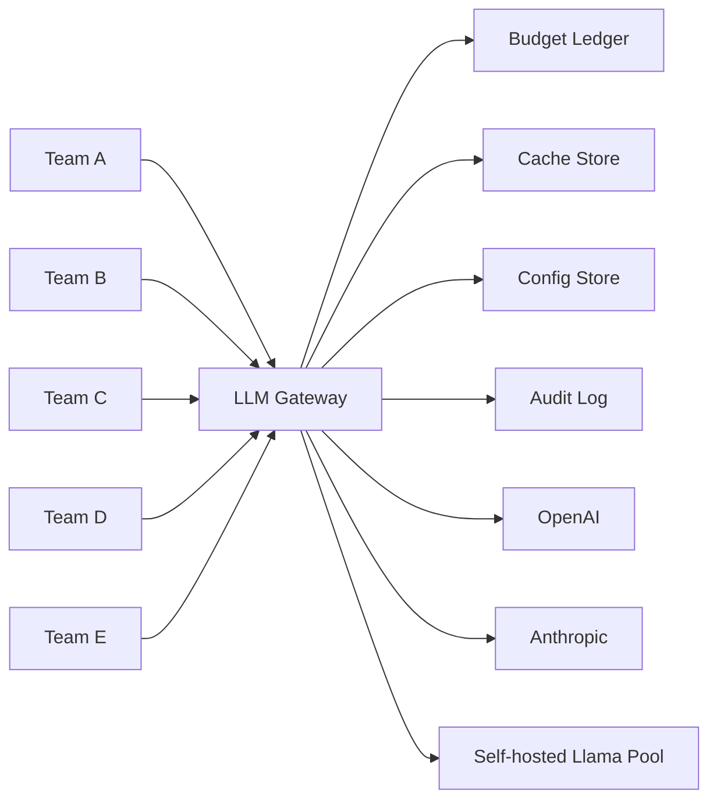
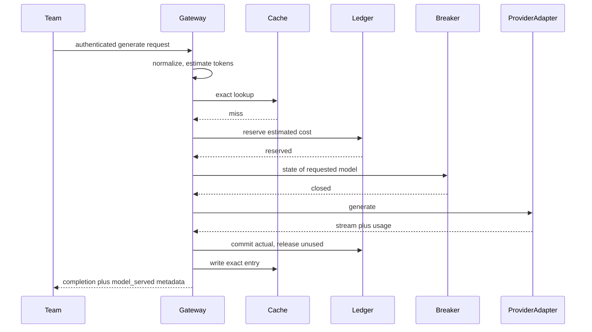
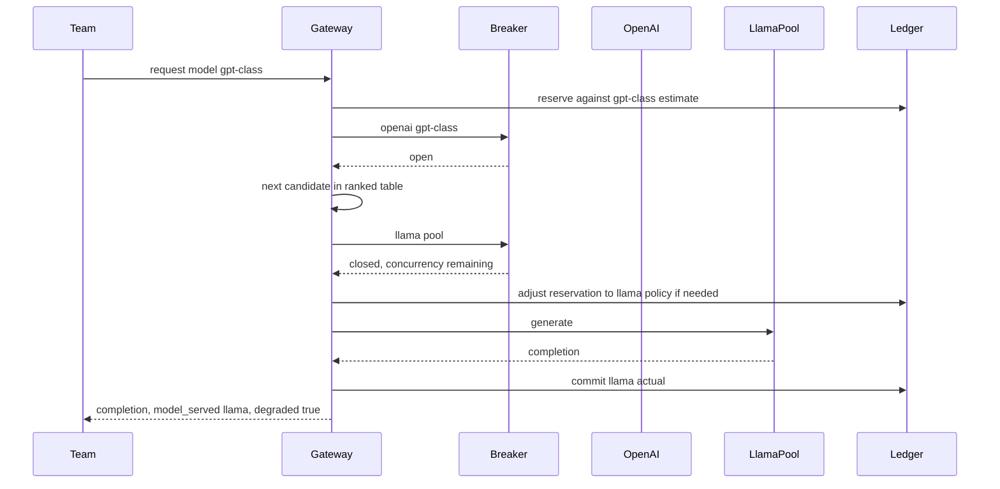

# LLM Gateway — Architecture Document
> - **Document Status**: Draft
> - **Last Updated**: 2026 Aug 29
> - **Author**: Paul Serban

An internal control plane that five teams call instead of calling OpenAI, Anthropic, and a self-hosted Llama cluster directly. This document covers *what* the system is and *why* it is shaped this way; see [System Design](./03_system_design.md) for *how* reservation, cache, breakers, and retries actually work, and [Trade-offs](./06_tradeoffs_and_honest_assessment.md) for what is abandoned and when buying a proxy beats building this.

## Overview

**Brief description**: A horizontally scalable, internally-facing HTTP gateway. Instances are stateless. Shared state (budget ledger, cache, breaker counters, config) lives in a store. Provider-specific mess lives in adapters. The thing that looks like "load balancing" is a quality-and-cost-ranked routing table sitting behind circuit breakers — not round-robin across three logos.

**Business Context**
- See [Business Overview](./01_business_overview.md). In short: the bill is the reason this exists; token cost is unknowable pre-call; Llama is capacity, not a price list; semantic cache is a correctness risk.
- Target users: calling teams (service identities), platform operator, FinOps, security.

## Requirements

### Functional Requirements

- **Single internal endpoint**: authenticated teams send generation (and, later, embedding) requests to the gateway. They do not hold OpenAI/Anthropic keys.
- **Per-team budgets**: a team cannot keep spending after its cap is exhausted, subject to the honesty constraint that enforcement is reservation-based and can overshoot. See [ADR-001](./04_architecture_decision_records.md#adr-001).
- **Cost-aware routing**: given a requested model (or a requested *tier*), pick a provider/model that is allowed, healthy, within rate limits, and consistent with the team's cost and data-handling policy. "Cheapest that is up" is a policy some teams may opt into; it is not the default for a team that named a specific model.
- **Provider-outage fallback**: when the chosen (provider, model) is open-circuit or returning sustained failure, fail over along an explicit ranked table. The response discloses what actually served. See [ADR-003](./04_architecture_decision_records.md#adr-003) and [ADR-007](./04_architecture_decision_records.md#adr-007).
- **Exact-match cache**: identical normalized requests may be served from cache without a provider call. Default on, with per-route TTL and opt-out.
- **Semantic cache (optional)**: similar requests *may* be served from cache only on routes that have opted in. Default off. See [ADR-002](./04_architecture_decision_records.md#adr-002).
- **Usage audit**: every request (hit or miss, success or fail, reserved and committed) is attributable to a team, route, provider, and model served.
- **Streaming**: the gateway must proxy token streams. Budget commit for streams happens at end-of-stream (or on disconnect, using whatever usage the provider reported — which may be nothing).

### Non-Functional Requirements

**Performance Requirements:**
- Added latency budget: **tens of milliseconds p50** for the gateway's own work (auth, normalize, exact-cache lookup, reserve, route) on a cache miss before the origin TTFB. Not "sub-5ms" and not "we don't care." A semantic-cache lookup (embed + ANN search) is **a second origin call** and does not fit in that tens-of-ms budget; it is an explicit extra hop, only on opted-in routes.
- Throughput: sized for the company's actual QPS from Phase 0, with headroom for a fallback storm (all SaaS traffic suddenly aimed at Llama).
- Streaming: the gateway must not buffer an entire completion before forwarding. Buffering "to count tokens first" adds latency the user feels and still does not give you a pre-call cost.

**Reliability Requirements:**
- The gateway is a **new single point of failure** in front of three backends. Its own availability must beat any one provider, or the project has made outages worse. Multi-instance, health-checked, no in-process budget counters ([ADR-004](./04_architecture_decision_records.md#adr-004)).
- Provider calls have timeouts, circuit breakers, and classified errors. A content-policy 400 is not an outage. A 429 is not an outage; it is a rate-limit event.
- Budget store unavailability: **fail closed on spend** (cannot reserve → do not call a billable origin) and **fail open on exact-cache reads** if the cache store is down (cache is an optimization). Llama may still be callable under a conservative local cap if SaaS cannot be spent against an unknown ledger — this is an operator policy, not a clever default. See [System Design — Error Handling](./03_system_design.md#8-error-handling).

**Infrastructure Constraints:**
- Illustrative stack: a small fleet of gateway processes (containers or VMs the company already knows how to run); a shared store for ledgers and exact cache (Redis for hot counters + cache, Postgres for durable audit/ledger — or one store if Phase 0 traffic is tiny; do not invent a third database); existing identity (service accounts, mTLS, or the company's internal IdP).
- No new SaaS "AI gateway" product is *required* by this design. Buying one is a live alternative; see [Trade-offs](./06_tradeoffs_and_honest_assessment.md#4-build-vs-buy).
- Self-hosted Llama is an existing cluster (or will be). This project does **not** include training, fine-tuning, or GPU procurement.

**The defining constraint:**
- Output tokens are unknown until generation ends. Therefore **exact pre-call budget enforcement does not exist**. Architecture that claims it does is lying to FinOps.

## Executive Summary

The LLM gateway is a **stateful control plane with stateless request handlers**. The handlers proxy HTTP. The state is the budget ledger, the cache, the breaker counters, and the routing table. Providers are adapters behind a uniform internal call interface. Llama is a capacity pool with a concurrency limit, not a third identically-shaped HTTP API with a price tag.

**Architecture Style:** Reverse proxy + policy engine. Not a service mesh. Not an "LLM OS." Not a multi-agent framework.

**Key Components:**
- **Edge / Auth**: terminate TLS, authenticate the calling team, attach team and route policy.
- **Request Normalizer**: canonical JSON for cache keys and token estimates; reject unknown fields that would silently drop out of the cache key.
- **Cache Layer**: exact-match first; optional semantic second.
- **Budget Reservation Service**: atomic reserve / commit / release against a per-team, per-period ledger.
- **Router**: policy + breaker + rate-limit + cost, producing an ordered candidate list.
- **Provider Adapters**: one per origin (OpenAI, Anthropic, Llama). Auth, error mapping, usage extraction, streaming shape.
- **Circuit Breaker + origin rate limiter**: per `(provider, model)` (and per Llama replica pool).
- **Usage Reconciler**: turns provider-reported usage (or a timeout guess) into a ledger commit, and writes the audit row.
- **Config store**: budgets, route policies, fallback tables, cache opt-ins. Operator-edited, versioned.

**Technology Stack (illustrative):**
- Gateway: whatever the platform team ships HTTP services in. Language is not the architecture. Timeouts, streaming, and a Redis client are.
- Ledger/cache: Redis (INCR/Lua for atomic reserve) + Postgres (audit, period close, dispute). A single Postgres with `SELECT … FOR UPDATE` is acceptable at low QPS and becomes the bottleneck at high QPS; Phase 0 numbers decide. See [ADR-004](./04_architecture_decision_records.md#adr-004).
- Semantic cache (Phase 4 only): embedding model + vector index. This is a new moving part and is *why* it is gated.

**Architecture Principles:**
- **LLMs are flaky backends.** Timeouts, breakers, error classification, load shedding. Then layer the parts that are *not* like a normal backend: non-idempotent retries, unknown cost, quality-changing failover.
- **Estimate, reserve, reconcile.** Never "check remaining budget, then send, then hope."
- **Cache correctness beats cache hit rate.** Exact-match is a hash. Semantic match is a guess.
- **Disclose the actual model.** Fallback is a feature only if the caller can see it.
- **Llama is capacity.** Route to it with a queue/concurrency budget, not with a token price of $0.
- **Observe, then enforce.** Caps invented without a measured baseline will be wrong.

**Key Architectural Decisions:**
1. Optimistic budget reservation with post-hoc reconciliation. [ADR-001](./04_architecture_decision_records.md#adr-001).
2. Exact-match cache default on; semantic cache opt-in per route. [ADR-002](./04_architecture_decision_records.md#adr-002).
3. Per-(provider, model) circuit breakers and a quality-ranked fallback table. [ADR-003](./04_architecture_decision_records.md#adr-003).
4. Stateless gateway instances; shared store for budget and cache. [ADR-004](./04_architecture_decision_records.md#adr-004).
5. Llama as a capacity-constrained pool, not a peer of the SaaS APIs. [ADR-005](./04_architecture_decision_records.md#adr-005).
6. No automatic retry after partial generation. [ADR-006](./04_architecture_decision_records.md#adr-006).
7. Response metadata always names provider and model served. [ADR-007](./04_architecture_decision_records.md#adr-007).

### Context Diagram

## Runtime Architecture

1. **Auth layer**: identify the team. No team identity, no budget attribution, no request.
2. **Normalize + estimate**: build the cache key; count or estimate input tokens; compute a reservation amount from input estimate + output ceiling (or historical p95 for that route).
3. **Cache layer**: exact lookup. If miss and the route opted into semantic, embed + search. Hits skip origin and skip *new* spend (semantic hits still paid the embedding, which must be reserved/committed too).
4. **Reserve**: atomic debit of estimated cost (and, separately, of origin RPM/TPM tokens). Failure here is `402`/`429`-class gateway error, not a provider call.
5. **Route**: walk the candidate list (requested model first, then fallbacks) skipping open circuits and exhausted origin rate limits. Llama candidates check pool concurrency.
6. **Call adapter**: stream or unary. Classify errors.
7. **Reconcile**: commit actual usage; release unused reservation; write audit; maybe write cache; set `model_served` metadata.

### Happy path (cache miss, primary model healthy)

### Provider outage, fallback, degraded flag

If the caller set `allow_fallback: false` (or the route forbids it), the second diagram ends at the open breaker with a gateway error. That is a supported, first-class outcome.

## Components

### 1. Edge / Auth
**Purpose**: make every request attributable to exactly one team, because budgets and audit are the product.

**Responsibilities:**
- TLS, authentication (service identity, not a shared static key across five teams).
- Attach team_id, route_id, policy snapshot (budget period, data-handling class, fallback allowed, cache mode).
- Reject unauthenticated or unknown-team traffic before any origin call.

**Interactions:** company identity provider / internal mTLS / service tokens. See [Security Architecture](./05_security_architecture.md).

### 2. Request Normalizer
**Purpose**: one canonical form for "this request," so cache keys and token estimates are not folklore.

**Responsibilities:**
- Parse the public API (OpenAI-compatible is the pragmatic default so teams migrate with a base-URL change; Anthropic-native can be a second facade or a translation — translating silently between prompt formats is a quality footgun, document it).
- Stable serialization for the exact-match key: model *requested*, messages, tools, temperature, top_p, penalties, seed, response_format, stop sequences. Anything that changes output must be in the key. Anything that does not (client request id) must not.
- Input token estimate.
- Output reservation basis: `min(max_tokens or provider default, route_output_ceiling)` or historical p95 — policy per route, documented.

### 3. Cache Layer
**Purpose**: not call a provider when we already have the answer **for this key**.

**Responsibilities:**
- Exact-match GET/SET with TTL, keyed by hash of the normalized request **and the model that produced the entry**. A completion from Llama is not a legal hit for a later request that still asks for a frontier model unless the caller opted into "any cached model in this tier" — default is no.
- Semantic path (opt-in): embed the normalized prompt, k-NN search, threshold, return with `cache_status: semantic` and provenance (source request id, similarity).
- Do not cache: streaming partials, errors, content-policy refusals (unless policy says otherwise), requests marked `cache: false`, any route in the deny list (personalized, time-sensitive, high-stakes).
- Cache writes happen **after** a successful complete response. Failed or truncated generations are not stored as if they were answers.

**Interactions:** cache store; embedding provider only on opted-in semantic routes (that embedding provider is itself an origin — budget and breakers apply).

### 4. Budget Reservation Service
**Purpose**: the actual reason this service exists. Convert "we think this might cost X" into an atomic hold, then true-up.

**Responsibilities:**
- Per-team, per-period ledger: `limit`, `committed`, `reserved_outstanding`.
- Atomic `reserve(team, amount)` / `commit(reservation_id, actual)` / `release(reservation_id)` / `timeout-release` for crashed handlers.
- Period close (calendar month unless Phase 0 says otherwise). No silent rollover of unused budget unless policy says so.
- Read API for remaining estimate (limit − committed − reserved). This number is what dashboards show; it is **not** exact remaining spend.

**Interactions:** Redis/Postgres. Never in-process memory. See [System Design §2](./03_system_design.md#2-budget-enforcement).

### 5. Router / Candidate Selector
**Purpose**: produce an ordered list of `(provider, model)` to try, not "pick one at random."

**Responsibilities:**
- Start from requested model (or requested tier).
- Apply pins: data-handling class (no SaaS), operator overrides, team allowlist.
- Filter: open circuits, origin RPM/TPM exhausted, Llama pool at concurrency cap.
- Order remaining fallbacks by the **documented quality ranking**, not by "whatever is cheapest" unless the route's policy is `prefer_cost`.
- Load-balance only among **equivalent** candidates (e.g. two Llama replicas, or two Azure OpenAI deployments of the same model). Equivalence is a config assertion. OpenAI GPT-class and Anthropic Claude-class are **not equivalent**.

### 6. Provider Adapters
**Purpose**: contain the vendor mess so the rest of the gateway does not.

**Responsibilities (each adapter):**
- Auth to the origin (gateway-held key, Azure deployment name, Llama internal URL).
- Map the normalized request to the vendor body.
- Stream proxy.
- Extract `usage` (prompt/completion tokens, cache-read tokens if the vendor reports them).
- Map errors to a gateway taxonomy: `timeout`, `rate_limit`, `unavailable`, `auth`, `content_policy`, `bad_request`, `unknown`.
- Surface vendor request ids for support tickets.

**Why not one generic HTTP proxy:** headers, streaming frames, usage JSON, and 429 shapes differ. A generic proxy will mis-count usage — which is the ledger, which is the product.

### 7. Circuit Breaker and Origin Rate Limiter
**Purpose**: stop sending money and latency into a hole, and stop a 429 storm from becoming a self-inflicted outage.

**Responsibilities:**
- Breaker per `(provider, model)` (Llama: per pool). Failure: timeouts, 5xx, connection errors. **Not** 4xx content-policy or 4xx bad-request. **Not** a single 429 — 429 feeds the origin rate limiter instead.
- Half-open: allow a probe, close or re-open.
- Origin limiter: estimated TPM/RPM against documented (then observed) vendor caps. Shared across all teams, because the vendor cap is shared. Per-team dollar budgets do not partition a vendor TPM.

### 8. Usage Reconciler and Audit Sink
**Purpose**: make the ledger true after the world has happened.

**Responsibilities:**
- On success: commit provider-reported usage × that model's unit price (or Llama's *policy* cost — see data model).
- On failure with no usage: release reservation. If the vendor may still have billed (timeout after the request left): **do not release fully**; mark `unconfirmed_spend` and reconcile from vendor usage APIs later if they exist (many don't in real time — this is a known hole, see Risks).
- Write an immutable audit row: team, route, requested model, served model, cache status, reserved, committed, latency, breaker path, request hash (not necessarily full prompt in the same store — see [Security](./05_security_architecture.md)).

## Scaling Strategy

**Current Scale Requirements:**
- Five teams. QPS is unknown until Phase 0. Many internal LLM gateways are "bursty tens of RPS," not "Stripe." Design for horizontal handlers; do not design for global anycast until the numbers exist.

**What scales horizontally:**
- Gateway processes. They hold no ledger.

**What does not:**
- The budget store. Atomic reserve is a contention point on a hot team key. One hot team can serialize on its ledger key. That is acceptable at five teams; it is the first thing that breaks at fifty.
- The Llama GPU pool. Adding gateway replicas **increases** pressure on Llama during fallback. Gateway scale-out without Llama concurrency caps is how you DDoS yourself.
- Vendor RPM/TPM. No amount of gateway replicas creates more OpenAI capacity.

**If QPS grows:**
- Split Redis: hot counters vs cache blobs.
- Ledger sharding by `team_id` (already natural).
- Cache TTL and size caps so Redis is not an unbounded prompt dump.
- Revisit build-vs-buy ([Phase 5](./07_phased_implementation_plan.md#phase-5--conditional-scale-out-or-buy)).

**Bottleneck Analysis:**
- Primary: origin latency and origin caps. The gateway will not make GPT faster.
- Secondary: Llama queue under fallback storms.
- Tertiary: ledger Redis on a pathological reserve rate (tiny cheap requests, huge RPS).
- Gateway CPU: tokenization and JSON canonicalize. Real, usually fine, measure in Phase 1.

### What changes as team count or QPS grows

| Dimension | Five teams, modest QPS | More teams / higher QPS |
| --- | --- | --- |
| Ledger | One Redis hash per team per period | Same, but hot-team contention; maybe local admission control |
| Cache | One shared exact-match store | Per-team cache namespaces (security + hit-rate isolation) become mandatory, not optional |
| Llama pool | One shared concurrency cap with per-team ceilings | Hard isolation (queues per team) or dedicated GPUs for the user-facing team |
| Routing config | A file or table the operator edits | Self-service route policies, or the operator becomes a ticket queue |
| Observability | Logs + a few counters | Per-team SLO, per-model cost anomaly alerts, breaker dashboards |
| Build vs buy | Building is still a reasonable choice | Vendor AI gateways start winning on adapter churn and UI |

## Data Architecture

### Data Model

**Key Entities:**
- **Team**: identity, data-handling class, budget period and limit, default fallback policy.
- **Route**: named use case under a team (e.g. `support-drafts`, `nightly-enrichment`). Cache mode, output ceiling, model allowlist, semantic threshold if any.
- **LedgerPeriod**: `(team_id, period_start)` → limit, committed, reserved_outstanding.
- **Reservation**: id, team, amount, state (`held`/`committed`/`released`/`unconfirmed`), request id, expiry.
- **CacheEntry**: exact key hash, model_served, response body ref, TTL, created_at, team_id. Semantic: embedding, source hash, similarity metadata.
- **AuditEvent**: request id, team, route, timestamps, token counts, costs, cache_status, models, error class. Prompt payload stored under the retention policy, **separately** if possible.
- **BreakerState**: `(provider, model)` counts, state, last_transition.
- **PriceTable**: per model, input/output unit prices, effective date. Llama rows are **policy costs** (e.g. $0 to teams, or an internal transfer rate) — not a vendor invoice line.

**Entity Relationships:**
- Team 1—* Route, Team 1—* LedgerPeriod.
- Request 1—1 Reservation (or 1—* if fallback retries with adjusted reserve).
- CacheEntry belongs to a model_served and optionally a team namespace.

### Data Lifecycle

**Create**: reservation on admit; audit on complete; cache on successful miss.
**Read**: remaining budget on every request; cache lookup; operator dashboards.
**Update**: commit/release; breaker counters; price table (dated, never rewrite history — old audit rows keep the rate they used).
**Delete**: cache TTL; prompt payloads per retention; ledger periods retained for finance (years, not days). Cache deletion is not a substitute for prompt-retention policy.

## Cost Analysis

### Cost Components

**Gateway infra (small):**
- Compute for the proxy fleet.
- Redis + Postgres.
- Logs/metrics already in the company's stack.
- Optional: vector index in Phase 4.

This should land in the **tens to low hundreds of dollars per month** at five-team internal scale if you are not buying a vendor gateway. If it does not, something is overbuilt (a Kubernetes platform for a 50 RPS proxy, a dedicated vector DB before semantic cache is justified).

**LLM spend (large — the thing being controlled):**
- SaaS invoices (OpenAI, Anthropic).
- Llama GPUs (fixed monthly, whether you cache or not).
- Embedding calls for semantic cache (easy to forget; can dominate if completions are cheap and traffic is high).

**Operator time (the real build cost):**
- Adapter maintenance when vendors change APIs.
- Price table updates.
- On-call for a new SPOF.
- Arguing with teams about caps.

### Cost Optimization (what this architecture is allowed to do)

- Exact-match cache where hit rate is real.
- Route batch/internal workloads to cheaper models or Llama **when quality policy allows**.
- Do not semantic-cache a workload just to have a vector DB.
- Do not "load balance" traffic onto the expensive model to keep utilization even.

### ROI framing

Build this if (a) monthly LLM spend is large enough that unbounded invoices hurt, (b) five teams will actually migrate, (c) the operator can own adapters and on-call. If monthly spend is a few hundred dollars, **buy nothing and set provider billing alerts**; a gateway is heavier than the problem. If spend is large but engineering time is scarce, **buy LiteLLM Cloud / Portkey / Cloudflare AI Gateway / equivalent** and configure budgets there. See [Trade-offs §4](./06_tradeoffs_and_honest_assessment.md#4-build-vs-buy).

## Risks and Mitigation

| Risk | Likelihood | Impact | Mitigation Strategy | Owner |
| --- | --- | --- | --- | --- |
| Reservation systematically under-estimates output tokens; teams overshoot caps | High | High | Reserve against `max_tokens` or p95, not mean; track variance; tighten ceilings on chatty routes | Budget service |
| Reservation systematically over-estimates; false-positive rejects starve product work | High if using max_tokens naively | High | Per-route ceiling vs p95; soft-fail Phase 2; measure false-positive rejects | Operator + teams |
| In-flight reservations + crash leave budget leaked (held forever) | Medium | Medium | Reservation TTL; reconciler sweeper; idempotent commit | Reconciler |
| Timeout after origin accepted the request; vendor bills us, we released the reserve | Medium | High | `unconfirmed_spend`; later usage-API reconcile if any; otherwise accept a measured leak and pad caps | Operator |
| Semantic cache serves a wrong-but-plausible answer | High if enabled globally | High | Default off; opt-in; deny-list; measure complaints; kill switch | Route owner |
| Fallback storm saturates Llama, taking down the last backend | High during SaaS incident | High | Per-pool and per-team concurrency caps; shed load; do not treat Llama as infinite | Router |
| Gateway outage is worse than a single-provider outage | Medium if single-instance | High | Multi-instance, shared store, fail-closed on billable SaaS only where policy allows | Operator |
| Teams bypass the gateway with leftover provider keys | High | High | Rotate keys at cutover; detect unused gateway traffic vs invoice; treat bypass as an incident | Security + operator |
| Provider API/schema drift silently mis-parses usage → wrong ledger | Medium | High | Adapter tests against fixtures; alert on missing usage in 200s; contract tests | Operator |
| Prompt store / cache becomes a pile of PII and secrets | High | High | Retention, encryption, access control, no shared cache across data-handling classes | Security |
| Price table stale after a vendor price change | High | Medium | Dated prices; FinOps review; alert on invoice vs ledger drift | FinOps |
| Tokenizer mismatch vs vendor billing tokens | Medium | Medium | Accept small drift; do not pretend token counts are a legal billing API | Budget service |
| "OpenAI-compatible" translation of Anthropic requests drops behavior | Medium | Medium | Document which fields survive; prefer native adapter endpoints for teams that need them | Operator |

## Future Enhancements

### Phase 1 (current design target)
Proxy, exact cache, observed spend. See [Phased Implementation Plan](./07_phased_implementation_plan.md).

### Phase 2–3
Hard-ish budgets, breakers, labeled fallback.

### Phase 4
Semantic cache on one boring route.

### Explicitly not in this design
- Fine-tuning, eval harnesses as a product, prompt versioning as a CMS, "agent OS," per-user end-customer billing (B2B SaaS metering). Those are other systems. Putting them in v1 is how the ledger never ships.
- Guaranteeing identical outputs across providers. Non-determinism and model inequality are facts. `seed` is best-effort and vendor-specific.
