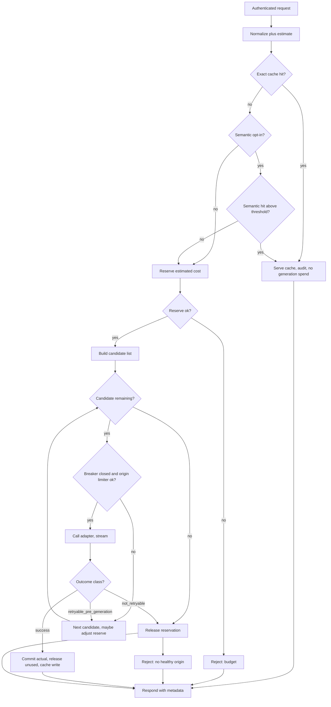

# LLM Gateway — System Design
> - **Document Status**: Draft
> - **Last Updated**: 2026 Aug 29
> - **Author**: Paul Serban

This document is the mechanical *how* for the gateway described in the [Architecture Document](./02_architecture_document.md). It specifies request flow, budget reservation, cache keys, circuit breakers, origin rate limits, and retry rules. It does not specify code.

## 1. Control Flow

One request, one reservation (unless fallback adjusts it), at most one *successful* origin generation. Cache hits never call a generation origin. Semantic lookup may call an embedding origin.



**Invariant:** a request that already received origin tokens (stream started with content, or a non-error completion body) does **not** automatically retry on another provider. That path is [ADR-006](./04_architecture_decision_records.md#adr-006). Fallback is for *failed to start / failed before generation* and for *open breaker before the call*.

## 2. Budget Enforcement

### 2.1 Why this cannot be a hard pre-flight gate

Input tokens are estimable. Output tokens are not. Provider-side prefix caching and discounts are not visible up front. A timeout may still be billed. Therefore the ledger has three numbers, not one:

| Field | Meaning |
| --- | --- |
| `limit` | Cap for the period (dollars, or internal units). |
| `committed` | Usage we believe is real (from origin `usage` or a closed guess). |
| `reserved_outstanding` | Sum of live holds. |

**Available ≈ `limit - committed - reserved_outstanding`.** Dashboard this. Do not call it "exact remaining spend."

### 2.2 Estimate

For each candidate model that might be used (primary first):

```
estimated_cost =
    input_tokens * input_unit_price
  + output_reservation_tokens * output_unit_price
  + extra_route_costs   // e.g. embedding lookup if semantic path already ran
```

`output_reservation_tokens` is **not** "the model's average." Pick one policy per route, documented on the route:

| Policy | When to use | Failure mode |
| --- | --- | --- |
| `max_tokens` ceiling | Safety-critical caps, unknown workloads | Over-reserves; false-positive rejects |
| Historical p95 output tokens for this route | Stable traffic, Phase 2+ | Under-reserves on a new long-answer behavior |
| Fixed route ceiling (e.g. 512) | Operator wants predictability | Truncation if the caller asked for more; **do not silently lower max_tokens without telling the caller** |

Llama estimates: if team policy costs Llama at $0, reservation against the **dollar** ledger is $0 and **must not** skip the concurrency cap. If an internal transfer price exists, reserve that. Never treat "free" as "unlimited."

Semantic embedding cost: if the route did an embed on the miss path, that cost is **already incurred** (or reserved just before embed) and is committed even when generation is later rejected.

### 2.3 Reserve → call → commit / release

Atomic operations on `(team_id, period)`:

1. **`reserve(amount, ttl)`** — if `available >= amount`, increment `reserved_outstanding`, write a reservation row with expiry, return `reservation_id`. Else reject.
2. **Call origin** (or fallback, with **`adjust`**: if the fallback model is cheaper, do not inflate; if it is more expensive, `reserve` the delta or fail the fallback).
3. **`commit(reservation_id, actual)`** — `reserved_outstanding -= original_hold`; `committed += actual`. If `actual > original_hold`, the extra hits `committed` anyway (**overshoot is allowed and metered**). If that drives `committed > limit`, the period is in breach; subsequent reserves fail; this request already ran.
4. **`release(reservation_id)`** — on pre-generation failure: `reserved_outstanding -= hold`. No commit.
5. **Sweeper** — reservations past TTL in `held` go to `release` **unless** marked `unconfirmed` (timeout after send). Unconfirmed stays until operator/vendor reconcile or a max age, then is committed at the original hold (pessimistic) or a configured fraction.

Concurrency: two requests for the same team must not both pass a read-then-write check. Use a single-key atomic (Redis Lua / `INCR` with compare, or `SELECT FOR UPDATE` on the period row). **Five teams does not mean you can skip this.** One team with a bursty job is enough.

### 2.4 When reserve fails — per-team policy

Configure one of:

| Policy | Behavior | Use |
| --- | --- | --- |
| `reject` | Gateway error, no origin call | Default. Honest. |
| `downgrade` | Retry candidate selection on a cheaper allowlisted model, re-reserve | Only if the route listed those models and the caller allows fallback |
| `queue` | Hold the HTTP request until reservation can succeed or queue TTL | Almost always a mistake for user-facing; optional for batch with a worker, not a synchronous HTTP queue inside the gateway |

Do not invent a global queue of LLM jobs in v1. That is a second product.

### 2.5 Streaming and disconnects

- Stream tokens to the client as they arrive. Do not wait for `usage`.
- On `finish`: usage is usually on the last chunk or a trailer. Commit that.
- On **client disconnect**: abort the origin if the adapter can; some vendors still bill generated tokens. Commit whatever usage is returned; if none, `unconfirmed` at a conservative estimate (elapsed tokens unknown — use hold).
- On **gateway timeout waiting for first byte**: treat as pre-generation failure if no tokens were forwarded; still `unconfirmed` if the request was already sent (you cannot prove the vendor did not start).

### 2.6 Period boundaries

A request that reserves in period T and commits after midnight still belongs to T (reservation id carries the period). Do not split a completion across months. Teams that "need" calendar exactness get a documented rule, not clever prorating.

## 3. Caching

### 3.1 Exact-match key

Hash of a canonical encoding of:

- **Model that will be considered a hit** — by default, the *requested* model. An entry stored from a fallback Llama response must not satisfy a later request for the frontier model.
- Messages / prompt, including system, in order.
- Tools / functions definitions.
- Sampling: temperature, top_p, top_k, penalties, seed, stop, max_tokens (yes, max_tokens — a shorter ceiling is a different request).
- Response format / schema.
- Route-level flags that change decoding.

Exclude: client `request_id`, auth headers, `allow_fallback` (whether you *would* have fallen back does not change the primary model's answer).

Normalization: JSON key order, whitespace in strings **must not** be "helpfully" trimmed inside message content. Trimming user text changes meaning and creates false hits. Trim only wrapper JSON.

TTL: per route. Internal FAQ-like: hours to days. Chat: minutes or off. There is no universal TTL.

### 3.2 Exact-match write policy

Write only if:

- HTTP-equivalent success with a complete assistant message,
- not an origin content-policy refusal (those are not "answers"),
- `Cache-Control` / `x-gateway-cache: no-store` not set,
- body size under a cap (do not cache a 100-page dump into Redis without noticing).

Streaming: assemble the final assistant content for the cache **after** the stream completes successfully. Do not cache a partial.

### 3.3 Semantic cache (opt-in only)

Enabled per route, never globally. Additional requirements:

- **Embedding of a defined text view** of the request (usually concatenated messages minus unstable metadata). The embedding model is pinned. Changing it invalidates the index.
- **k-NN search** in a per-route or per-team index. **Do not mix teams.** Do not mix data-handling classes.
- **Similarity threshold** set per route. There is no industry-standard number that is "safe." Start high (few hits) and measure wrong-answer rate, not start low and celebrate hit rate.
- **Hit metadata**: `cache_status: semantic`, similarity score, source cache id. Callers and evals need this.
- **Cost**: reserve/commit the embedding. A semantic miss that then generates has paid **embed + generation**. If hit rate is 5% and embeds are not free, this feature can **increase** spend. Phase 4 must show net savings on the chosen route.
- **TTL and invalidation**: facts go stale. Semantic cache without aggressive TTL is how you serve last quarter's pricing.

**Never enable on:**

- Personalized requests (any user-specific retrieved context, "my account", authz-scoped data).
- Time-sensitive facts ("now", "latest", "today", operational status).
- High-stakes actions (delete, pay, legal, medical, access control explanations that will be acted on).
- Creative / high-temperature work where "similar prompt" is not "same intent."
- Prompts that include untrusted retrieved documents as the *question* if those docs can collide (two tickets that embed close and should not share an answer).

A wrong semantic hit is worse than a cache miss: the caller may not retry, and the answer looks fluent.

### 3.4 Cache stampede

Hot exact keys: allow a single origin fill (lock or request coalescing) so a burst of identical misses does not multiply spend. This is worth doing for exact-match. It is not the first feature for semantic.

## 4. Circuit Breakers

### 4.1 Scope

One breaker per `(provider, model_id)`. Llama: one breaker per **pool** (or per replica if replicas are independent), plus the concurrency limiter in §5.

Do not share a breaker across "all of OpenAI." `gpt-x` being 500s while `small-y` is healthy is a real shape.

### 4.2 Failure classification

| Origin outcome | Counts as breaker failure? | Notes |
| --- | --- | --- |
| Timeout, connection error, 5xx | **Yes** | |
| 429 rate limit | **No** | Origin limiter + backoff; a 429 storm is capacity, not "OpenAI is dead" — unless 429s persist at zero RPS we send, then operator marks down |
| 400/422 bad request | **No** | Our bug or the team's; opening the breaker hides it behind fallback garbage |
| 401/403 | **No** (but **page immediately**) | Auth is not fixed by falling over to Llama with a different contract |
| 4xx content policy | **No** | Not an outage |
| HTTP 200 with empty/malformed usage | **No** for breaker; **yes** for a usage-quality alert | Ledger risk |

Thresholds: boring defaults (e.g. N failures in M seconds → open; half-open after T; one probe). Tune in production. Document them in config, not in folklore.

### 4.3 Half-open

Allow a small number of probes on the **next real request** (or a synthetic canary if the operator prefers — synthetic still costs money). Success closes. Failure reopens. Probes still reserve budget.

### 4.4 Fallback table

Not "any healthy backend." Explicit ranked list per requested model / tier, e.g.:

| Requested | 1 | 2 | 3 |
| --- | --- | --- | --- |
| Frontier OpenAI | Anthropic frontier (if team allowlisted) | Llama 70B-class | fail |
| Anthropic frontier | OpenAI frontier | Llama 70B-class | fail |
| Cheap SaaS mid-tier | Other cheap SaaS | Llama 8B/70B per quality policy | fail |
| Llama (pinned, sensitive) | **no SaaS** | fail | |

If the team's data-handling class is `no_egress`, rows that mention OpenAI/Anthropic are invalid and must not appear.

Every served fallback sets `degraded: true` when the quality rank is below the requested rank, and always sets `provider` + `model_served`. See [ADR-007](./04_architecture_decision_records.md#adr-007).

Cross-provider fallback is a **different model**. Prompt templates that depend on OpenAI tool-calling quirks may fail on Llama. That is a team problem the metadata exists to expose. The gateway does not rewrite prompts to "make Llama equivalent."

## 5. Rate Limiting

Two layers, different units, both required.

### 5.1 Origin RPM / TPM (shared)

Vendors cap **the credential**, not the team. All five teams share OpenAI TPM.

- Maintain an estimated token bucket per `(provider, model)` or per credential: requests and tokens (use the same input estimate + output reservation as §2 for TPM debit; true-up on actual if you need tightness).
- Smooth, small burst. A post-restart dump of "unused TPM" is how you earn a 429 wave.
- On 429: honor `Retry-After` if present; tighten the assumed cap until a clean window; do not retry in a hot loop (each retry is spend and TPM).

This limiter is **not** the dollar budget. A team can have $10k left and still be 429'd because another team's batch job ate TPM.

### 5.2 Per-team origin fairness (optional but recommended)

Without it, the batch team starves the user-facing team at the OpenAI key. Simple version: per-team fraction of TPM, or a priority lane (interactive vs batch). v1 can be "two keys if finance will pay for two," which is the only fairness that vendors actually understand. Ask for it; expect a no; implement fractions if no.

### 5.3 Llama concurrency

Not TPM. A semaphore: `max_in_flight` for the pool, plus `max_in_flight_per_team`. Queue **inside the Llama serving stack** if it has one (vLLM-style); the gateway should **fail fast** when the semaphore is full rather than hold HTTP requests until GPU-wait exceeds the client's timeout. Holding is how the gateway's thread/connection pool dies during a fallback storm.

### 5.4 Gateway admission

Global max in-flight on the gateway itself so Llama + origin timeouts cannot pile unbounded connections. Shed with a 503 and a retry-after. This is load shedding, not budget.

## 6. Retry Semantics

Retries are how LLM gateways quietly double-bill.

| Situation | Auto-retry same origin? | Auto-fallback other origin? |
| --- | --- | --- |
| TCP fail / HTTP fail **before** request fully sent | Yes, bounded (1–2), still on the same reservation | If still failing, yes, per table |
| Timeout **before any token forwarded to client** | **At most one** retry is still dangerous (vendor may have started). Prefer fallback or fail; if retry, `unconfirmed` risk | Allowed as "failed to start" only if you accept possible double generation |
| Stream started (any content forwarded) | **No** | **No** |
| 429 | No immediate retry; wait Retry-After or pick another **equivalent** candidate (second Azure deployment), not a different model unless fallback policy says so | Only if policy allows degraded |
| 4xx (bad request, policy) | **No** | **No** — the other model may still 4xx or, worse, **comply** and do the wrong thing |
| 5xx after empty body | Treat as pre-generation; fallback allowed | Yes |

Idempotency keys: some vendors support them; many generation APIs do not make retries return the *same tokens*. Even with a key, **content is not a bank transfer**. Do not tell callers retries are idempotent.

Client-specified `Idempotency-Key`: the gateway may coalesce **exact** in-flight duplicates (same team, same key, same hash) so a client retry of a still-running request does not launch a second generation. After completion, replay the same response. This is worth doing. It is not semantic.

## 7. Load Balancing (what that word is allowed to mean)

- **Among equivalent replicas**: Llama pods, or two regions of the *same* model deployment. Round-robin or least-in-flight. Health-aware.
- **Among non-equivalent models**: not load balancing. That is the fallback table or an explicit `prefer_cost` policy.
- **Weighted traffic splitting** (10% Llama for a shadow eval): a Phase 3+ experiment feature, **must** label `model_served`, must not silently mix into a production cache for the primary model.

"Load-balance OpenAI vs Anthropic vs Llama 33/33/33" is rejected. See [ADR-005](./04_architecture_decision_records.md#adr-005).

## 8. Error Handling

| Class | Examples | Behavior |
| --- | --- | --- |
| **AuthN/Z** | missing team identity, unknown token | 401/403, no reserve, no origin |
| **Bad request** | schema, empty messages, model not allowlisted | 400, no origin |
| **Budget** | reserve failed | 402 or 429 with `error_class=budget`; no origin |
| **Admission / shed** | gateway in-flight cap | 503 Retry-After |
| **Origin rate limit** | 429 from vendor or local TPM empty | 429 `error_class=origin_rate`; maybe fallback if equivalent replica exists |
| **No healthy origin** | all breakers open, Llama full, pins exclude SaaS | 503 `error_class=unavailable`; release hold |
| **Content policy** | vendor 4xx policy | pass through mapped error; do not fallback to "a model that will just do it" |
| **Timeout / 5xx pre-generation** | | fallback or mapped 504/502; reservation release or unconfirmed |
| **Mid-stream failure** | origin die after tokens sent | end stream with error trailer if possible; commit partial usage if reported; **no retry** |
| **Ledger store down** | Redis/Postgres | **fail closed** for billable SaaS; operator policy for Llama-only; alert |
| **Cache store down** | Redis | skip cache, continue; alert |
| **Config store down** | | fail closed (unknown policy must not default to "all models, no budget") |

## 9. Observability (minimum)

Metrics (labels: team, route, provider, model_requested, model_served, cache_status):

- request count, success, error_class
- origin latency, TTFB, gateway overhead
- cost committed, reserved, overshoot
- cache hits exact vs semantic, semantic wrong-answer reports (event)
- breaker state, origin 429s, Llama in-flight
- reservation-vs-actual histogram
- invoice-vs-ledger drift (daily job)

Logs: request id, team, hash of prompt not necessarily raw prompt at info level. Debug raw prompts only under the retention/access rules in [Security](./05_security_architecture.md).

Alerts: breaker open, ledger store down, auth-to-origin fail, spend velocity (committed/hour vs cap), Llama pool at cap, missing `usage` on 200s, gateway 5xx rate.

Traces: one trace per client request, child span per origin attempt. This is how you debug double-calls.

## 10. Public metadata (response)

Every completion (including cache hits) includes at least:

- `request_id`
- `provider`, `model_served`, `model_requested`
- `degraded` (bool)
- `cache_status`: `none` | `exact` | `semantic`
- `usage` (tokens) and `cost_committed` (internal units)
- `budget_remaining_estimate` (the approximate number from §2.1)
- `reservation_overshoot` if actual > hold

Teams that strip this before their own users see it may do so **downstream**. The gateway never strips it from the team-facing response.
