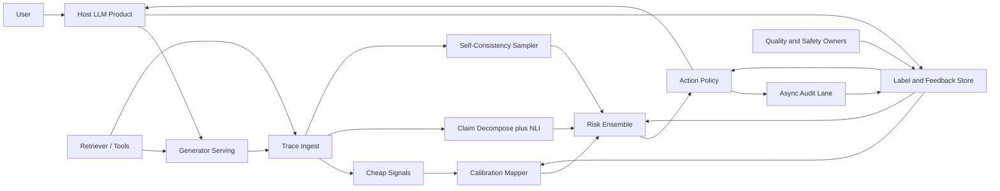

# LLM Hallucination Detection — Architecture Document
> - **Document Status**: Draft
> - **Last Updated**: 2026 Aug 29
> - **Author**: Paul Serban

A production-side **risk scoring pipeline** that attaches to an existing LLM serving path, extracts cheap signals on every response, spends expensive signals on a budgeted subset, and maps an ensemble score onto **domain-configured actions** — without pretending any of those signals is ground truth. This document covers *what* the system is and *why* it is shaped this way; see [System Design](./03_system_design.md) for *how* sampling, entailment, calibration, and the action policy actually work.

## Overview

**Brief description**: This is internal quality/safety infrastructure, not a customer-facing product. It is scoped narrowly on purpose: one generation (prompt, completion, optional retrieved context, optional token-level internals) in; one risk score plus a policy decision out. It does not answer the user. It does not replace retrieval. It does not "know facts."

**Business Context**
- See [Business Overview](./01_business_overview.md) for the full framing. In short: there is no per-request gold label at scale; a second LLM is a correlated, expensive proxy; false-positive cost is paid by the product; a small labeled sample is still mandatory.
- Target users: product owner of the LLM surface (operating point), safety/trust owner (hard blocks), serving/platform owner (latency and logprobs), quality/eval owner (labels and honesty).

## Requirements

### Functional Requirements

- **Attach, do not replace**: the system must score generations from an existing serving path. It must not become a second chatbot or a second retriever.
- **Envelope-aware scoring**: grounded (RAG / tool-output) and ungrounded generations must be identifiable at ingest. Entailment runs only when retrieved evidence is present.
- **Cheap signals on all traffic**: token-level uncertainty (when the serving stack exposes logprobs) and/or verbalized confidence, plus a calibrated mapping to empirical error.
- **Expensive signals on a budget**: self-consistency sampling and full claim-level entailment must run under an explicit budget (rate, token cap, or risk-trigger), not "on every request because the paper sampled k=10."
- **Claim decomposition for grounded traffic**: a long answer must be broken into checkable claims; a single document-level "is this grounded?" bit is not sufficient.
- **Ensemble risk score**: signals combine into a score in `[0, 1]` (or a calibrated log-odds), not a boolean. Boolean actions happen only after a policy layer.
- **Policy actions**: at minimum `pass`, `annotate/hedge`, `block_or_refuse`, `escalate_to_human`, `async_audit_only`. Which actions exist per surface is a product configuration.
- **Shadow mode**: scores and would-have-actions must be computable without changing the user-visible response.
- **Feedback ingest**: user disputes, regenerations, human audit labels, and known-bad probes must be joinable back to the originating generation and its signals.
- **Observability**: every scored generation emits signal values, ensemble score, policy action, envelope, cost/latency of the detector path, and enough ids to join to the serving trace.

### Non-Functional Requirements

**Performance Requirements:**
- Traffic profile: production QPS of the host product, not a nightly batch. The detector's inline path is on or next to the hot path.
- Inline latency budget: **a small, product-defined additive budget** (illustrative starting point: tens of milliseconds p95 for scoring once the completion exists — NLI on claims, calibration lookup, ensemble — not another round-trip generation). If the serving stack cannot expose logprobs without a second decode, that is a platform gap, not a reason to skip to an LLM judge.
- Expensive-tier latency: self-consistency **is** extra generation latency. It is therefore off the default user-visible critical path unless the product explicitly accepts "wait for k samples" (almost no consumer chat product will). Triggered sampling may run **after** first-token streaming of the primary answer and only affect *post-hoc* actions (hedge banner, follow-up disclaimer, async review) unless the domain is safety-grade and the product has accepted the wait.
- Cost: extra tokens from sampling and judges are a first-class SLO, expressed as **detector-tokens / generator-tokens** and as dollars. There is no "quality is priceless" exception in v1.

**Reliability Requirements:**
- **Fail open on the inline path by default**, fail closed only where a named owner has configured a safety-grade domain. A detector outage must not take down chat. A detector outage on a hard-block medical surface may fail closed — that is a config, not a global rule.
- **Bounded spend.** Sampling k, judge calls, and NLI batch size have hard caps. A retry storm of detector calls is a defect.
- **Deterministic policy given a score and a config.** The ensemble may be a fitted model; the mapping from score → action for a given domain config must be replayable from logs.

**Infrastructure Constraints:**
- Technology stack (illustrative): a sidecar or inline scorer next to the existing generator; access to prompt/completion/trace ids; optional logprobs from the serving API; a small NLI / groundedness model (not an LLM) for entailment; a feature store or log join for signals; a calibration table; a tiny ensemble model; an audit-label store; a queue for async expensive work.
- Hosting: same region as serving to keep inline NLI cheap. The labeled-sample workflow is human-time, not GPU-time, and is the actual scarce resource.
- Compliance: prompts and completions may be PII. Detector logs inherit the host product's retention, access control, and training-use restrictions. **Audit labels and sampled completions used for calibration are production data.** They do not go into a random spreadsheet.

## Executive Summary

The detector is a **two-envelope, two-tier risk pipeline**: cheap uncertainty signals on every response; evidence-faithfulness checks when evidence exists; expensive agreement checks on a budget; a fitted ensemble; a human-set action policy; a labeled-sample loop that keeps the numbers honest.

**Architecture Style:** Sidecar scoring pipeline with an async audit lane. Not a multi-agent debate society. Not "the model grades itself" as the product.

**Key Components:**
- **Ingest / Trace Join**: attaches to the generation trace (prompt, completion, retrieval set, model id, params).
- **Envelope Classifier**: grounded vs. ungrounded, plus domain/surface id for policy.
- **Cheap Signal Extractors**: logprob / entropy / verbalized confidence.
- **Claim Decomposer**: splits a completion into atomic claims (grounded path; also used when self-consistency compares *claims* rather than whole strings).
- **Groundedness / NLI Checker**: specialized entailment model against retrieved chunks.
- **Self-Consistency Sampler**: k additional generations under a budget, agreement/entropy over answers or claims.
- **Calibration Mapper**: turns raw confidence into empirical error probability using a curve fitted on the labeled sample.
- **Risk Ensemble**: combines available signals into one score, with missing-signal handling (ungrounded traffic has no entailment feature).
- **Action Policy**: domain thresholds → pass / hedge / block / escalate / audit.
- **Async Audit Lane**: optional LLM-judge, human review, probe sets, drift jobs.
- **Label & Feedback Store**: the small gold-ish sample plus production proxies.
- **Observability**: the only way anyone is allowed to claim the detector works.

**Architecture Principles:**
- **Every signal is a proxy with a named blind spot.** The ensemble exists because of that, not because stacking is fashionable.
- **Independence is worth more than another correlated LLM.** Logprobs, NLI-against-sources, and multi-sample disagreement fail in different ways. A judge fails the same way the generator does, more often than people want to admit.
- **Spend is a product feature.** k=10 on 100% of traffic is a research protocol. Production uses k small, triggered, and measured.
- **The operating point is not in the model weights.** Safety-grade and low-stakes surfaces share plumbing and do not share cutoffs.
- **Labels are runtime infrastructure.** No sample, no calibration, no ship as a detector.
- **Shadow first.** User-visible friction is earned by labeled-set evidence, not by a demo.

**Key Architectural Decisions:**
1. An **ensemble of proxies**, not a single signal or a boolean OR of checks ([ADR-001](./04_architecture_decision_records.md#adr-001)).
2. **Tiered compute**: cheap inline, expensive sampled/triggered ([ADR-002](./04_architecture_decision_records.md#adr-002)).
3. **LLM-as-judge demoted** to optional async, never primary ([ADR-003](./04_architecture_decision_records.md#adr-003)).
4. A **small human-labeled sample is mandatory** despite "no ground truth at scale" ([ADR-004](./04_architecture_decision_records.md#adr-004)).
5. **Per-domain action thresholds**, not one global cutoff ([ADR-005](./04_architecture_decision_records.md#adr-005)).
6. **Specialized NLI for faithfulness**, not an LLM, on the grounded path ([ADR-006](./04_architecture_decision_records.md#adr-006)).
7. **Shadow mode before user-visible actions** ([ADR-007](./04_architecture_decision_records.md#adr-007)).

### Context Diagram

## Runtime Architecture

1. **Generation happens as it does today.** The detector is not in the token loop of the primary decode except to capture logprobs if the API allows.
2. **Ingest** copies the trace: model version, prompt hash, completion, retrieval chunks if any, latency, temperature, domain/surface id.
3. **Envelope**: if retrieval/tool evidence is present and the product contract is "answer from this," the grounded path is on. Otherwise ungrounded.
4. **Cheap path (all traffic)**: extract uncertainty features, map through the current calibration curve, emit a partial score immediately.
5. **Grounded path (when applicable)**: decompose claims, run NLI against chunks, aggregate claim-level support into faithfulness features. This is the primary *independent* signal for RAG.
6. **Expensive path (budgeted)**: either a stratified sample (for calibration/eval) or a risk trigger (cheap score already high, or domain policy says "always sample"). Run k additional generations, compute agreement. Optionally enqueue an LLM-judge job **async**.
7. **Ensemble** produces a score given the features that exist. Missing entailment on ungrounded is a missing value, not a zero.
8. **Policy** maps score + domain config + shadow flag → action. In shadow mode the user-visible action is always the product's previous behavior; the would-have-action is logged.
9. **After-the-fact**: human labels, user disputes, and probe results land in the label store and periodically refit calibration and ensemble, and re-evaluate operating points.

## Components

### 1. Trace Ingest
**Purpose**: Make a generation a first-class, joinable event without becoming a second source of truth for the answer.

**Responsibilities:**
- Capture identifiers (request id, session id, model id, prompt template version, index version).
- Capture payloads needed for scoring: completion text, retrieved chunk texts (not just ids — ids drift), tool outputs.
- Capture internals when present: per-token logprobs, selected-token entropy, alternative tokens if cheap.
- Respect retention and PII rules of the host product. Scoring that requires raw text must live inside the same trust boundary.

**Interactions:**
- Reads: generator and retriever traces.
- Feeds: all signal extractors.
- Emits: ingest-lag and drop rate. A detector that silently drops 8% of traces is a random sample, not a production control.

### 2. Envelope Classifier
**Purpose**: Stop the system from running groundedness checks on traffic that has no grounding, and stop operators from averaging those two worlds into one AUC.

**Responsibilities:**
- Tag `grounded` vs `ungrounded` from explicit product contract, not from heuristics like "the prompt mentioned documents."
- Tag `domain_id` / `surface_id` for policy. Unknown domain uses a conservative default: shadow-only, no hard block.
- Refuse to invent a corpus for ungrounded traffic.

**Interactions:**
- Reads: trace metadata from the host product (this is a config, not an ML classifier, in v1).
- Feeds: which feature pipelines run.

### 3. Cheap Signal Extractors
**Purpose**: A per-request uncertainty feature that does not multiply generation cost.

**Responsibilities:**
- Sequence-level aggregates: mean/min logprob of content tokens, length-normalized joint probability, entropy spikes on factual spans if span tagging exists.
- Verbalized confidence if the product already asks the model to rate its certainty — treated as a **separate, biased** feature, not as a probability.
- Handle missing logprobs honestly: if the serving API strips them, this whole family is off, and the ensemble must still run on what remains (for RAG, that can still be entailment). Do not fake logprobs by a second scored decode "to be complete" on 100% of traffic; that is a hidden 2× bill. A sampled second-pass score is allowed under the expensive budget.

**Interactions:**
- Reads: token internals, completion text.
- Writes: feature vector to Calibration Mapper.

**Honesty:** instruction-tuned chat models are often **overconfident**. Raw logprob is not P(correct). That mapping is Calibration Mapper's job, and it is empirical, not theoretical.

### 4. Claim Decomposer
**Purpose**: Turn a paragraph into units an entailment model can actually check.

**Responsibilities:**
- Split the completion into atomic factual claims; leave questions, hedging, and instructions out of the claim set.
- Preserve claim-to-span offsets so a UI (and a hedge policy) can mark *which sentence* is unsupported.
- Bound claim count (a 2,000-word dump is not 400 NLI calls by accident — cap and sample with a documented policy).

**Interactions:**
- Used by: Groundedness Checker, Self-Consistency (claim-level agreement), audit UI.
- Implementation options and the v1 choice: [System Design §2](./03_system_design.md#2-claim-decomposition).

**Honesty:** bad decomposition is a first-class error source. Over-splitting creates false "unsupported" fragments ("The"+"patient"+"was" as claims). Under-splitting hides a fabricated number inside a mostly-true sentence. This component needs labeled examples as much as the ensemble does.

### 5. Groundedness / NLI Checker
**Purpose**: The only signal that can say "this claim is not supported by the evidence we retrieved." That is not the same as "this claim is false."

**Responsibilities:**
- For each claim, score entailment / contradiction / neutral against the retrieved chunk set (or a retrieved-subset after cheap lexical filter).
- Aggregate: fraction of claims unsupported, worst-claim score, contradiction flag, citation-claim alignment if the product emits citations.
- Stay on a **specialized NLI or groundedness model**, not a general LLM, for the inline/near-inline path ([ADR-006](./04_architecture_decision_records.md#adr-006)).

**Interactions:**
- Reads: claims, retrieved texts.
- Writes: faithfulness features to the ensemble.
- Does **not** fetch new web evidence. Retrieval quality is out of scope except as a documented blind spot.

### 6. Self-Consistency Sampler
**Purpose**: Measure whether the generator *stably* believes the answer. Disagreement is evidence of unreliability. Agreement is **not** evidence of truth.

**Responsibilities:**
- Draw k additional completions under documented decoding params (temperature > 0; k small — see [System Design §3](./03_system_design.md#3-self-consistency-sampling)).
- Normalize and compare: exact match for short answers; claim-set overlap or clustered paraphrases for long answers. Raw string equality on chat is close to useless.
- Emit agreement rate, pairwise entailment among samples, entropy over clusters.
- Enforce the budget: max extra tokens per minute per surface, max k, no retry amplification.

**Interactions:**
- Calls: the same generator (preferred: same model id). A different model is a different experiment.
- Triggered by: stratified sampler, or cheap-path risk, or domain policy.
- Writes: consistency features. On traffic that was not sampled, the feature is missing, not zero.

### 7. Calibration Mapper
**Purpose**: Convert "the model sounded sure" into "in last month's labeled sample, this surety bin was wrong X% of the time."

**Responsibilities:**
- Maintain reliability diagrams / isotonic or temperature-style maps **per (model_id, envelope, domain-bucket)**.
- Output `p_err_hat` or a calibrated confidence. Never present raw logprob as a user-facing certainty.
- Invalidate and refit on generator or prompt-template change. Stale curves are a pageable condition.
- Require a minimum bin count; refuse to extrapolate from 12 labels.

**Interactions:**
- Fitted from: Label Store.
- Reads: cheap uncertainty features.
- Writes: calibrated features to the ensemble.

### 8. Risk Ensemble
**Purpose**: Combine heterogeneous, often-missing proxies into one score without a brittle rule pile.

**Responsibilities:**
- Train / fit on the labeled sample (logistic or small gradient-boosted model is enough; this is not a foundation model).
- Handle missing features (ungrounded: no NLI; unsampled: no consistency) via explicit missing indicators, not imputed "0 = safe."
- Stay interpretable enough that an eval owner can say which signal drove a score. A 70-feature deep net is how you lose the ability to debug a false positive.
- Do not include the LLM-judge score in the **primary** inline ensemble in v1 even if the judge ran async — that creates a circular dependency and a delayed feature. Judge labels belong in evaluation and in optional offline analysis ([ADR-003](./04_architecture_decision_records.md#adr-003)).

**Interactions:**
- Reads: calibrated confidence, faithfulness, consistency, missingness flags, simple priors (answer length, "citation-shaped" spans).
- Writes: `risk_score` to Action Policy and logs.

### 9. Action Policy
**Purpose**: The only component allowed to affect the user or a human queue. The ensemble is not a product manager.

**Responsibilities:**
- Load per-`domain_id` thresholds and enabled actions.
- Map score → action. Support shadow mode.
- Bound human escalation with a queue quota; overflow degrades to annotate-or-pass with a metric, it does not silently grow a 10-year backlog.
- Fail-open vs fail-closed as configured.

**Interactions:**
- Reads: score, domain config, shadow flag, queue depth.
- Writes: action to the host product (or a no-op in shadow), audit enqueue, metrics.

### 10. Async Audit Lane
**Purpose**: Everything too slow or too correlated to put on the hot path: LLM-judge spot checks, human review, synthetic probes, drift jobs.

**Responsibilities:**
- Consume a sampled plus triggered subset.
- Run optional judge **for analysis**, storing judge output as a proxy alongside human labels, never as a replacement.
- Drive the review UI with claim-level highlights, not a naked "risk=0.73."
- Run a fixed probe set of known fabrications and known-good items on a schedule (canary for the detector itself).

**Interactions:**
- Reads: policy enqueue, stratified sample.
- Writes: Label Store, detector-health metrics.

### 11. Label and Feedback Store
**Purpose**: The scarce source of anything resembling truth.

**Responsibilities:**
- Hold the stratified human-labeled sample (schema: envelope, domain, claim- or answer-level label, rater id, guidelines version).
- Hold production proxies: thumbs-down, regenerate, "report inaccuracy," human ticket outcomes — tagged as proxies.
- Hold probe-set items and their expected labels.
- Track calibration freshness: last fit time, model id, sample size, ECE.

**Interactions:**
- Written by: audit lane, product feedback, periodic annotation jobs.
- Read by: Calibration Mapper, Ensemble fit, evaluation reports.

### Communication Patterns

**Synchronous (inline, completion-time):**
- Cheap extractors, calibration lookup, NLI on a bounded claim set, ensemble, policy. Must fit the inline latency budget or the action is limited to post-hoc (banner after stream).

**Asynchronous:**
- Self-consistency when not accepted on the user wait path; LLM-judge; human review; refits; probe sets.

**Human-paced:**
- Annotation of the labeled sample; operating-point review when flag rate or ECE breaks SLO; go-live from shadow to user-visible actions ([ADR-007](./04_architecture_decision_records.md#adr-007)).

## Cost and Latency Tiers

This is load-bearing, not an optimization appendix.

| Tier | What runs | When | User-wait impact | Token multiplier vs. generator |
| --- | --- | --- | --- | --- |
| **T0 Inline cheap** | Logprob aggregates, verbalized confidence, calibration lookup, ensemble, policy | 100% of scorable traffic | Target: small vs. generation time (NLI-off) | ~0 extra generator tokens |
| **T1 Inline grounded** | T0 + claim decompose + NLI | 100% of grounded traffic, with claim-count caps | Additive model-inference ms, not an extra generation if NLI is small | 0 extra generator tokens; GPU/CPU for NLI |
| **T2 Sampled/triggered consistency** | k extra generations + agreement | Stratified % plus risk trigger | Default: **not** on first-byte path; may delay a hedge | ~k× (often 2–5× on that subset; if subset is 5% of traffic, fleet-wide ~0.1–0.25×) |
| **T3 Async judge / human** | LLM-judge and/or rater | Flagged plus audit sample | None on user wait | Judge ≈ another long prompt; humans are the real cost |

The architecture **does not offer a fifth tier** called "k=10 and a judge on every request." That tier is how teams go bankrupt and still miss consistent hallucinations.

Fleet-wide extra cost is `sum over tiers (traffic_fraction × work)`. A 5% T2 sample at k=3 is a 15% generation-budget tax. That number belongs on the Phase 0 baseline and on every go-live review.

## Scaling Strategy

**Current Scale Requirements:**
- Production QPS of the host product. Detector inline work must be horizontally scalable like any other scoring sidecar (stateless scorers, sharded logs, a single policy config).
- Labeled sample does **not** scale with QPS. It scales with domain count, model-change frequency, and how small an effect you need to detect. That is statistical, not operational. See [System Design §8](./03_system_design.md#8-evaluation-without-ground-truth-at-scale).

**Scaling Strategy:**

**Horizontal (inline scorers):** replicate NLI + ensemble workers. They are CPU/GPU-small compared to the generator if ADR-006 holds.

**Do not horizontally scale T2 by "just sample more."** Sampling fraction is a budget. Raising it is a product decision with a cost model.

**Bottleneck Analysis:**
- **Primary bottleneck for quality:** labeled-sample throughput and rater agreement, not model inference.
- **Primary bottleneck for cost:** T2 self-consistency, if anyone sets the sample fraction like a researcher.
- **Primary bottleneck for latency:** putting T2 on the user wait path, or running claim NLI without a cap on a long completion.
- **Hidden bottleneck:** log volume of full prompts/completions. This will hit retention and privacy before it hits CPU.

**Monitoring and Triggers:**
- Flag-rate spike without a model change: policy or traffic mix shift; investigate before celebrating "we caught more."
- Flag-rate collapse after a model upgrade: calibration stale; **turn user-visible blocks off** until refit.
- Review queue age > SLO: policy is over-flagging relative to staffing; degrade actions automatically.
- ECE / AUROC breach on the latest labeled batch: detector is not a detector this week.

## Data Architecture

### Data Model

**Key Entities:**
- **GenerationTrace**: request id, model id, prompt template version, index version, envelope, domain, completion, retrieval chunks, logprob summary.
- **SignalRecord**: per-trace feature vector, missingness flags, tier(s) executed, detector latency, extra tokens.
- **RiskDecision**: score, policy version, action, shadow flag, queue id if any.
- **ClaimRecord**: claim text, offsets, NLI scores, per-claim action highlights.
- **Label**: trace or claim id, label (hallucinated / unfaithful / unsupported / ok / unable), rater, guideline version, whether gold vs proxy.
- **CalibrationArtifact**: model id, envelope, fitted curve, sample size, ECE, valid_from, invalidated_at.
- **EnsembleArtifact**: weights, feature list, training sample pointer, valid_from.
- **ProbeItem**: frozen prompt + expected behavior; used as a canary.

**Entity Relationships:**
- One GenerationTrace has one SignalRecord and one RiskDecision (append-only if policy is replayed).
- One GenerationTrace has many ClaimRecords on the grounded path.
- Labels attach to traces or claims. Proxies and gold are distinguished, always.

### Data Lifecycle

**Create**: traces at request time; labels at audit/annotation time; artifacts at refit time.

**Read**: online scorers read the *current* calibration and ensemble artifacts; eval jobs read historical traces + labels.

**Update**: artifacts are versioned, not mutated in place. A refit is a new version. Roll-forward and roll-back are the same mechanism.

**Delete**: follow host-product retention. Calibration needs *some* historical labeled traces; that retention is a documented exception, not "keep forever."

## Cost Analysis

### Cost Components

**Generator tokens (T2/T3):** usually the dominant *incremental* $ cost. This is the number to argue about in Phase 0.

**NLI inference:** cheap per call if the model is small; not cheap if someone "temporarily" pointed it at a 70B judge.

**Human labels:** dominant *quality* cost. A 1,000-example stratified sample with dual annotation is real money and calendar time. It is still cheaper than a wrong hard-block policy at production QPS.

**Review queue:** if policy maps too much to humans, this becomes larger than the ML spend. Staff time is not free infrastructure.

**Log storage:** full-text traces for detector training/eval.

### Cost Optimization

- Cap claims per response; lexical-filter chunks before NLI.
- T2 only on stratified + triggered; never 100%.
- No judge on the inline path.
- Deduplicate identical prompts for T2 when a cache key is safe (same template, same retrieved set) — optional, easy to get wrong on personalized RAG.
- Do not build a third-party "AI observability platform" in v1 to store traces you already have.

## Risks and Mitigation

| Risk | Likelihood | Impact | Mitigation Strategy | Owner |
| --- | --- | --- | --- | --- |
| Detector billed as "we catch hallucinations" covering consistent-and-wrong | High | High (safety + honesty) | Named blind spots in every exec readout; probe set for known-confident fabrications; [Trade-offs](./05_tradeoffs_and_honest_assessment.md) | Eval owner |
| LLM-judge sneaks onto 100% traffic | High | High (cost + correlated FN) | [ADR-003](./04_architecture_decision_records.md#adr-003); budget alerts | Platform |
| No budget for labels; team ships uncalibrated scores | High | High | Business rule 8: telemetry ≠ detector; Phase 0 gate | Product + eval |
| False-positive rate kills the product or the review team | High | High | Per-domain thresholds, queue quotas, shadow first ([ADR-005](./04_architecture_decision_records.md#adr-005), [ADR-007](./04_architecture_decision_records.md#adr-007)) | Product |
| Stale calibration after model swap | High | High (silent FN or FP) | Artifact invalidation; auto shadow-on-swap | Platform |
| Entailment green-lights wrong retrieval | High for RAG | High in "grounded" products | Document as retrieval bug; retrieval eval is a sibling system, not this one | Retrieval owner |
| Claim decomposition garbage-in | Medium | Medium–high | Labeled claims, cap, error analysis in Phase 2 | Eval |
| Logprobs unavailable | Medium | Medium | Ensemble must run without them; do not secretly 2×-decode 100% | Platform |
| PII in detector logs / rater tools | Medium | High | Same trust boundary, same retention | Security |
| Stakeholders want a single accuracy number | High | Medium (political) | Report ROC-at-operating-point + flag rate + cost; refuse "94%" | Eval owner |

## Future Enhancements

### Phase 1 (Current)
**Focus**: Shadow-mode cheap signals + labels + grounded NLI, then budgeted consistency, then policy go-live — see [Phased Implementation Plan](./06_phased_implementation_plan.md).

### Phase 2 (Post-hardening)
**Focus**: Only if retrieval quality is the remaining FN source: join this detector to a retrieval-eval pipeline (relevance labels, index freshness). That is a different project. Do not grow this one into it by stealth.

### Phase 3 (Conditional)
**Focus**: Tool-using agents (hallucinated tool arguments, invented APIs) as a third envelope. v1's claim/NLI path does not automatically cover that. A new envelope, new labels, new probes — not a config flag.

### Technical Debt

**Known/Accepted Trade-offs:**
- Blind to many consistent fabrications — accepted as a property of the signal set, not a temporary gap a prompt will fix.
- T2 not on the default wait path — accepted: latency vs. detection coverage is a real trade, not a TODO to "make sampling free."
- Small models for NLI — accepted: some faithfulness nuance will be missed; a giant judge is not the v1 fix.
- No open-domain web verification — accepted: that is a search product with legal and freshness problems.
