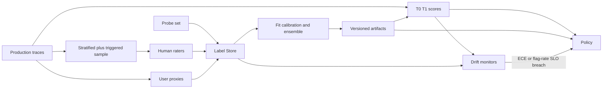
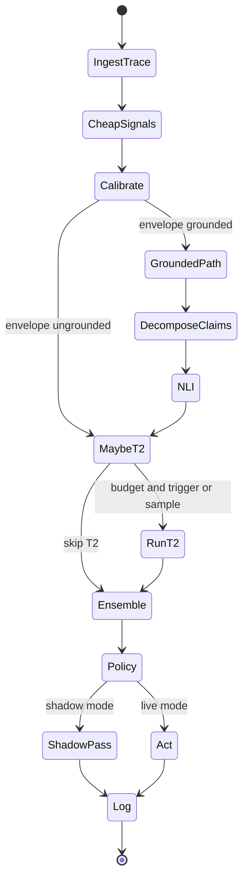

# LLM Hallucination Detection — System Design
> - **Document Status**: Draft
> - **Last Updated**: 2026 Aug 29
> - **Author**: Paul Serban

This document describes *how* the detector works internally: how claims are split, how self-consistency is sampled and compared, how entailment is scored against retrieved evidence, how confidence is calibrated, how the ensemble and action policy behave, and how the system is evaluated when production has no gold labels. It complements the [Architecture Document](./02_architecture_document.md), which covers *what* the system is and *why*.

> This is a design specification. No detector code is implemented as part of this documentation deliverable — names below describe the intended future implementation.

## 1. Trace contract (what must exist before any signal)

If the host serving path cannot provide the fields below, the corresponding signal is **off**, not faked.

| Field | Required for | Notes |
| --- | --- | --- |
| `request_id`, `model_id`, `model_version` | everything | Calibration keys. A silent model swap without a version bump poisons the curve. |
| `prompt_template_id` / hash | calibration, drift | Prompt changes are distribution changes. |
| `domain_id`, `surface_id` | policy | Unknown → shadow only, no hard block. |
| `envelope` (`grounded` \| `ungrounded`) | routing | Product contract, not inferred from prose. |
| `completion_text` | everything | Streamed responses are scored at complete, unless a mid-stream policy is explicitly in scope (v1: at complete, with optional post-stream hedge). |
| `retrieved_chunks[]` `{id, text, metadata}` | T1 NLI | **Text**, not ids only. Index rebuilds make ids lie. |
| `citations[]` if the product emits them | citation-alignment | Optional. |
| `token_logprobs[]` | T0 uncertainty | Optional at the platform layer; if absent, T0 shrinks to verbalized confidence and priors. |
| `temperature`, `top_p` | consistency interpretation | Sampling at temperature 0 makes self-consistency mostly pointless. |
| `user_feedback` join key | proxies | Later. |

**Streaming:** most products stream tokens to the user before NLI can run on the full answer. v1's user-visible *block* therefore cannot apply to tokens already sent. Honest options: (a) buffer then send (hurts TTFB; rarely acceptable), (b) post-stream hedge/footnote/retract, (c) only block on *next* turn or on tool execution. Phase 0 must pick (b) or (c) per surface. Pretending you can unsend a streamed paragraph is not a design.

## 2. Claim decomposition

### Why

NLI models score a premise-hypothesis pair. A 400-word RAG answer is not a hypothesis. String-level "is the whole answer grounded?" averages a fabricated dosage into a correct restatement of the patient's name and calls it fine.

### Target output

A list of **atomic claims**: short declarative sentences, each one thing that could be true or false, with character offsets into the completion.

Not claims: hedges ("it might be"), questions, instructions to the user, quotes that are clearly attributed *if* the product wants quotes treated as reproductions (document this; quote-of-a-wrong-source is still unfaithful-to-world and faithful-to-chunk).

### v1 method

Use a **small, specialized extractor** (sequence tagger or constrained small seq2seq), not a frontier LLM, for the same cost/correlation reasons as NLI ([ADR-006](./04_architecture_decision_records.md#adr-006)). A frozen rules+sentence split is an acceptable Phase 2 stepping stone if the labeled claim sample is not ready — with the documented failure mode that compound sentences will be under-split.

### Caps (load-bearing)

| Cap | Default starting point | Why |
| --- | --- | --- |
| Max claims scored per completion | 20 | Tail answers must not become 200 NLI calls |
| Max claim characters | ~240 | NLI quality falls apart on paragraph-hypotheses |
| Chunks scored per claim | Top M by lexical overlap (e.g. 3–8) | Full Cartesian product of claims × chunks is the silent cost bomb |

Overflow claims: **sample** remaining claims uniformly and record `claims_truncated=true`. Do not silently drop the tail (that's where people bury the invented number) without a metric.

### Confirmation

Claim quality is measured on a labeled subset: precision/recall of extracted claims vs. rater-written claims, plus error analysis of FP "unsupported" caused by fragments. This is a Phase 2 gate, not a vibe.

## 3. Self-consistency sampling

### What it measures

If you sample the model k times at temperature > 0, do the answers (or their claims) agree? **Disagreement → higher risk of variance-driven error. Agreement → no information about systematic error.**

This limitation is not a footnote. It is the reason T2 cannot be "the" detector. See [Trade-offs §1](./05_tradeoffs_and_honest_assessment.md#1-named-blind-spots-of-each-signal).

### When it runs

```
run_T2 = stratified_sample(p_audit) OR (calibrated_p_err_hat >= trigger) OR domain.always_sample
```

`p_audit` is a budget (illustrative: 1–5% of traffic, lower at high QPS). The trigger exists so the expensive path concentrates where T0 already smells uncertainty — which **biases** T2 features on triggered traffic (you oversample uncertain cases). The ensemble must know `t2_reason ∈ {stratified, triggered, domain_policy}` as a feature or must only *train* consistency weights on the stratified subset. Training on triggered-only samples will teach the model "T2 ran ⇒ bad." That is leakage.

### Decoding

- Use the **same model_id**. Different-model "consistency" is a committee, not self-consistency.
- Temperature: high enough to not clone the first sample, low enough to not produce garbage. Starting point: the product's own non-zero temperature, or 0.5–0.8 if the product runs at 0. **If the product is greedy (T=0)**, self-consistency requires an explicit higher-T resample; those samples are off-policy relative to what the user saw. Still useful as a probe of the mode's stability, but they are not "the same distribution as production." Log it.
- k: **3 to 5** on the T2 subset. Papers use k=10–40; production pays k. Phase 2 measures agreement AUC vs. k on the labeled sample and **stops increasing k when the curve flattens**. If k=3 and k=5 are indistinguishable, k=3 wins.

### Comparison, not string match

| Answer shape | Comparison |
| --- | --- |
| Short, closed (number, entity, enum) | Normalize then exact / numeric tolerance |
| Long free text | Decompose each sample into claims; cluster by pairwise NLI or embedding-near-duplicate; agreement = size of largest cluster / k, plus entropy |
| RAG answer | Same claim clustering; optionally also pairwise groundedness to the *same* retrieved set |

Do not use BLEU against sample 1. It rewards shared fluff.

### Cost governor

A process-wide (or per-surface) token bucket on **extra** generator tokens. When empty, T2 does not run; the consistency feature is missing. Missing is legal. Silently reusing an old sample from a different prompt is not.

### What not to do

- Do not wait for k samples before sending the first token unless the surface has accepted that SLO in writing (safety-grade, low QPS).
- Do not treat 5/5 agreement as "verified."
- Do not run T2 on 100% "just until we have data." That is how until becomes the architecture.

## 4. Entailment / groundedness pipeline

### Task

For each claim H and retrieved texts P: classify **entailment, contradiction, or neutral (not enough info)**. Map to:

- `unsupported` = neutral or (if the product requires citations) "no chunk cited and none entail"
- `contradicted` = contradiction with any chunk (high risk even if another chunk entails — retrieval is fighting itself)
- `supported` = entailed by at least one chunk and not contradicted

World-truth is **out of scope**. A supported claim drawn from a stale policy PDF is a retrieval/freshness incident.

### Model

A **specialized NLI / groundedness encoder** (cross-encoder or small sequence classifier), batched, CPU- or small-GPU-sized, with a documented max sequence length. Not a chat model with a "Does the context support this? Answer yes/no" prompt. [ADR-006](./04_architecture_decision_records.md#adr-006).

### Aggregation into features

Per completion:

| Feature | Meaning |
| --- | --- |
| `frac_unsupported` | Claims the evidence does not back |
| `frac_contradicted` | Claims the evidence actively fights |
| `worst_claim_risk` | 1 - max entailment score among claims, or 1 if any contradiction |
| `citation_mismatch` | Emitted citation does not entail the adjacent claim (if citations exist) |
| `n_claims`, `claims_truncated` | Size and cap hit |
| `retrieval_empty` | Grounded envelope but zero chunks — this is a product bug; score as max risk on faithfulness, and metric-page it |

### Contradiction vs. missing support

These are different user actions. Contradiction (the docs say X, the model said not-X) is a strong hedge/block candidate. Missing support on a chit-chat sentence in a mostly-grounded answer may be a claim-splitter error. The ensemble sees both; the policy may weight contradiction higher via a policy rule **on top of** the score (a rare, explicit override: `if frac_contradicted > 0 then at least annotate`). Overrides are versioned and counted. A pile of overrides is a failed ensemble, not a clever policy.

### Confirmation

On the grounded labeled sample: PR curve of `frac_unsupported` / ensemble vs. rater "unfaithful" labels. Slice by contradiction vs. neutral. If NLI precision is poor, **do not compensate by adding an LLM judge on 100%**. Fix decomposition, chunk filtering, or the NLI model — or widen the threshold.

## 5. Confidence extraction and calibration

### Raw features

From logprobs, when present (content tokens only; skip BOS/specials if they dominate):

- mean logprob, min logprob, 10th percentile
- mean token entropy if the API returns a distribution
- length-normalized joint logprob (to stop punishing long answers naively — still imperfect)

From the completion, when the product already elicits it:

- verbalized confidence (`"I'm 70% sure"`) parsed as a **biased** feature. Models asked to be confident will be.

Do not add a second "rate your confidence" generation on 100% of traffic. That is a T2-class cost wearing a T0 badge.

### Calibration

Fit **per `(model_id, envelope, coarse_domain)`** a map from a scalar uncertainty summary (or a small vector) to empirical P(error) on the labeled sample.

v1: isotonic regression or Platt scaling on a single summary score, with reliability diagrams. Not a 40-feature neural net. Sample sizes will be hundreds to low thousands; a flexible calibrator will overfit and produce a beautiful ECE on train.

**Minimum sample:** do not ship a curve with empty high-confidence bins. If all labeled errors are in the "model was unsure" bin, you have not tested the dangerous bin. **Force-include high-confidence production traces in the annotation sample** (stratify on raw confidence, not only on user complaints). User complaints under-sample consistent-and-wrong.

### Staleness

`CalibrationArtifact.valid` is false when:

- `model_id` / `model_version` changes
- prompt template for that surface changes materially
- retrieval index version changes (grounded envelope — chunk distribution shift)
- ECE on the latest labeled batch exceeds a gate
- sample age exceeds a TTL (e.g. 30–90 days, domain-dependent)

Invalid artifact → **shadow mode for user-visible blocks** on that key, still logging scores. This is a Phase 4 control, designed in from the start.

## 6. Risk ensemble

### Features (v1, small)

- Calibrated `p_err_hat` (or missing flag)
- Grounded-only: `frac_unsupported`, `frac_contradicted`, `citation_mismatch`, `retrieval_empty`, `claims_truncated`
- Consistency-only when T2 ran **and** `t2_reason=stratified` for training; at inference, include with `t2_reason` flag
- Cheap priors: completion length, whether the answer contains citation-like patterns, domain id as a categorical with pooling if rare

### Model

Logistic regression with missing indicators, or a small boosted tree with a hard cap on depth. Train on the **human-labeled** set, not on LLM-judge labels, not on thumbs-down.

Class imbalance will be ugly (hallucination base rate depends on the product; it is often neither 50% nor 0.1%). Report PR-AUC and precision at the policy's recall target, not accuracy.

### Leakage to refuse

- Judge scores as features
- User feedback on the *same* request as a feature (you don't have it yet at decision time)
- Rater identity
- Post-hoc "the user regenerated" 

### Output

`risk_score ∈ [0,1]` interpreted as a ranking score. It is **not** automatically P(hallucination) unless calibration of the ensemble itself is measured and named as such. Policy thresholds are set on this score using labeled-set precision/recall plus a cost model, not by assuming 0.5 is meaningful.

## 7. Decision / action policy

### Actions

| Action | User-visible? | Typical use |
| --- | --- | --- |
| `pass` | No extra UI | Below threshold |
| `annotate` | Hedge, "this may be unreliable", highlight unsupported spans, ask to verify | Medium risk, FP cost of a banner is acceptable |
| `refuse_or_block` | Replace or withhold the answer | Safety-grade domains, after explicit FP acceptance |
| `escalate` | Maybe a "checking" state; human queue | Low QPS, high FN cost, **staffed** queue |
| `async_audit` | No | Always-on sample, T3 |

### Mapping

Per `domain_id`:

```
if shadow: log(would_action); emit pass to user
else if score >= T_block and block_enabled: refuse
else if score >= T_escalate and queue_not_full: escalate
else if score >= T_annotate: annotate
else: pass
```

Contradiction override: optional `if frac_contradicted > 0: max(action, annotate)`.

**Queue not full:** if escalate would exceed `max_inflight` or `max_arrival_per_min`, degrade to annotate (or pass, if annotate is disabled) and increment `escalation_overflow`. Overflow is a **policy incident**, not a success ("we flagged them").

### Fail open / fail closed

Default `fail_open` on detector errors (NLI timeout, missing artifact). Surfaces with `fail_closed=true` must have an owner and a tabletop: what the user sees when the sidecar is dead.

### Streaming interaction

`refuse` on a fully streamed answer is a retraction (ugly, sometimes necessary). Prefer `annotate` post-stream unless the surface buffers. Document per surface in Phase 0.

## 8. Evaluation without ground truth at scale

This section is the evaluation framework. There is no gold label on 99.9% of traffic. That does not license folklore.

### Four evidence tiers (all required for go-live of user-visible actions)

1. **Held-out human-labeled sample.** Stratified by envelope, domain, and raw-confidence bin. Dual-rated until agreement is measured; disagreements adjudicated. **Drawn before** anyone knows the detector's score on those items, as far as process allows (raters do not see `risk_score`). This is the only source of precision/recall.
2. **Production proxy join.** Thumbs-down, "report inaccuracy", regenerate, tickets. Use for **drift alerts and audit prioritization**, not as the training label and not as the published precision. Users miss hallucinations; users also thumbs-down correct refusals.
3. **Frozen probe set.** Known fabrications, known faithful RAG answers, known consistent-wrong items if you can construct them (popular myths the model asserts stably). Run on a schedule. A probe fail is a detector-health incident. This set will be gamed if it is the only number leadership watches — keep it small and supplementary, like the harness eval's "not a launch gate" smoke tests.
4. **Statistical humility.** A binary label on 80 items does not establish a 90% precision. Go-live gates in the [Phased Implementation Plan](./06_phased_implementation_plan.md) require a sample size argued from the effect you care about (e.g. distinguishing 50% vs 70% precision at the operating point), not "we labeled a sprint's worth."

### Metrics that matter vs. vanity

| Vanity | Why it misleads | Use instead |
| --- | --- | --- |
| Accuracy / "94% detected" | Base-rate games; unlabeled production | Precision & recall **at the chosen threshold**, plus PR-AUC, sliced by envelope |
| LLM-judge agreement | Circular, correlated | Human labels; judge vs human on a subset as a *bias study* |
| Flag count | Can go up because you lowered a threshold | Flag rate vs. review capacity; precision on audit sample |
| Mean risk score | Uncalibrated drift | ECE, score distribution vs. last week, sliced |
| "Users didn't complain" | Users often cannot see the error | Probes + stratified labels, including high-confidence slice |

### Blind-spot slice (mandatory report)

Among labeled items with **high calibrated confidence, high self-consistency (when sampled), and (if grounded) low `frac_unsupported`**: what fraction are still rated hallucinated? That number is the **residual the architecture cannot talk its way out of**. If it is high, the product still needs retrieval improvements, tool checks, or "don't use an LLM for this."

## 9. Feedback and recalibration loop



- **Refit cadence:** on artifact invalidation events, and on a wall-clock cadence (e.g. biweekly) if traffic is high enough to add labels.
- **Human rater guidelines** are versioned. A guideline change is a distribution change; old labels stay, but new metrics slice by guideline version.
- **Do not auto-retrain the ensemble on proxies.** A thumbs-down spike after a UI change will teach the model to flag whatever the new UI annoyed.

## 10. Drift monitoring

Page / ticket (not per-flag) when:

| Signal | Suggests |
| --- | --- |
| Flag rate ±X% relative vs. 7-day baseline without a config change | Traffic mix, model stealth swap, or broken NLI |
| ECE breach on latest labeled batch | Recalibrate; disable blocks |
| Probe-set fail | Detector or generator regression |
| `escalation_overflow` > 0 sustained | Policy unaffordable |
| T2 token bucket empty for > Y minutes | Budget too tight or QPS spike; consistency features go missing (legal) but eval coverage drops |
| `retrieval_empty` on grounded envelope | Product/retrieval incident |
| Artifact `valid=false` | Blocks already should be shadowed; if not, it's a bug |

## 11. Error handling

| Failure | Detection | Response | User-visible (default fail-open) |
| --- | --- | --- | --- |
| Missing logprobs | Ingest | T0 partial; missing flag | Unchanged |
| NLI timeout | Deadline | Faithfulness features missing; score on remainder | Unchanged unless fail_closed |
| Claim cap hit | Counter | Score on sampled claims; `claims_truncated` | Unchanged |
| T2 budget empty | Token bucket | Skip T2 | Unchanged |
| Stale/missing calibration | Artifact registry | Shadow blocks; log | Unchanged |
| Label backlog / no dual-rate | Ops metric | Do not go live / revert to shadow | Unchanged |
| Detector sidecar dead | Health check | Fail-open or fail-closed per domain | Open: unchanged. Closed: configured fallback (generic refuse) |
| PII leak to rater tool | Review / DLP | Incident; halt annotation | N/A |

## 12. End-to-end flow



## 13. Configuration surface (not code forks)

| Parameter | Role |
| --- | --- |
| `p_audit` | Stratified T2 / audit fraction |
| `k`, T2 temperature | Consistency |
| `T_annotate`, `T_block`, `T_escalate` per domain | Operating point |
| `block_enabled`, `fail_closed` per domain | Safety vs availability |
| `max_claims`, `chunks_per_claim` | NLI cost |
| `t2_token_budget` | Fleet extra-generation cap |
| `max_escalation_inflight` | Human-cost cap |
| `ece_gate`, `calibration_ttl` | Honesty gates |
| `shadow` per surface | Go-live switch |

The codebase does not fork per product. Config does. A new domain without a labeled slice **cannot** get `shadow=false`.
