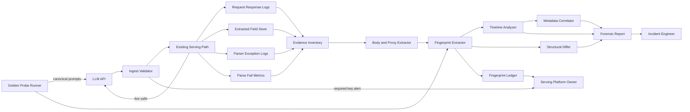
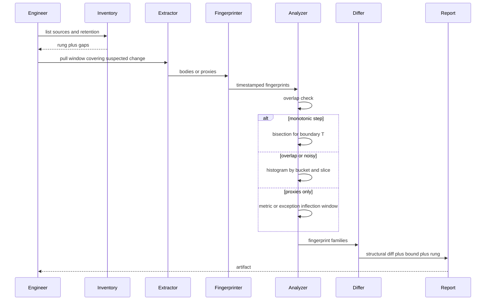

# LLM Schema Drift Forensics — Architecture Document
> - **Document Status**: Draft
> - **Last Updated**: 2026 Aug 29
> - **Author**: Paul Serban

A two-subsystem design: a **one-shot forensic toolkit** that reconstructs a silent LLM JSON-schema change from whatever request/response evidence already exists, and a **schema contract monitor** that makes the next change a same-day detection. This document covers *what* the system is and *why* it is shaped this way; see [System Design](./03_system_design.md) for *how* fingerprinting, bisection, histogram fallback, and probes actually work, and [Trade-offs and Honest Assessment](./05_tradeoffs_and_honest_assessment.md) for what the evidence can and cannot carry.

## Overview

**Brief description**: Internal investigative and contract-enforcement infrastructure, scoped narrowly. The forensic half reads existing logs, warehouses, exception streams, and metrics; it writes a report. The monitor half sends a small number of golden probes, validates live responses at ingest, and retains fingerprints (and, where policy allows, sampled bodies). It is not a general LLM gateway, not a prompt-evaluation harness, and not a substitute for pinning model versions.

**Business Context**
- See [Business Overview](./01_business_overview.md) for the full framing. In short: you cannot collect last week's evidence this week; raw payload diffs are diffs of answers; bisection is licensed only by a monotonic fingerprint step; most teams are on a lower evidence rung than they think.
- Target users: incident engineer (patch + diff), postmortem owner (bound + rung), serving/platform owner (monitor + pinning). The vendor is out of the runtime path.

## Requirements

### Functional Requirements

- **Evidence inventory**: the forensic path must start by classifying available sources onto the [evidence ladder](./01_business_overview.md#the-evidence-ladder-the-actual-requirement) and refusing to promise a tighter bound than the highest populated rung.
- **Schema fingerprinting**: given a JSON body, produce a canonical fingerprint of key paths and types, independent of values. Optional-key noise must be distinguishable from a sustained schema shift. See [ADR-001](./04_architecture_decision_records.md#adr-001).
- **Timeline reconstruction**: given timestamped fingerprints (or weaker proxies), produce either a step-boundary timestamp **or** a window, plus a statement of which algorithm was used (bisection vs histogram vs proxy inflection).
- **Monotonicity gate**: bisection may run only after an overlap check passes. If old and new fingerprints coexist in the same window, bisection is forbidden. [ADR-002](./04_architecture_decision_records.md#adr-002).
- **Structural diff**: once two (or more) fingerprint families are isolated, report added paths, removed paths, type changes, and *candidate* renames with the evidence for complementarity — never as proven renames.
- **Metadata correlation**: join the fingerprint timeseries to whatever request metadata exists (model id / alias, snapshot or system fingerprint, endpoint, region, headers) and report plausible triggers. Absence of metadata is reported as absence, not as "unknown model."
- **Degraded-evidence path**: if raw bodies do not exist, the system must still consume exception logs, extracted-column null rates, and metrics, and must label the output as a **bound**, not a schema.
- **Parser-patch independence**: nothing in the forensic path is a precondition for making the live parser tolerate the new keys. That work is Phase 0 and may use *current* traffic only.
- **Contract monitor**: scheduled golden probes, ingest-time required-key validation, fingerprint retention, alerting on fingerprint or required-key change.
- **Forensic report artifact**: a dated document (or row) that records rung, algorithm, structural diff, bound, correlation notes, and caveats. Arguments about "what we knew on Friday" are answered from this artifact, not from Slack.

### Non-Functional Requirements

**Performance Requirements:**
- Forensic analysis is **offline and laptop-class**. A week of LLM logs, even verbose, is not a Spark job unless you already emit bodies at very high QPS and retained them all — in which case the bottleneck is I/O and JSON parse, still a batch job, still not a streaming product.
- Bisection, when licensed, is O(log n) fingerprint comparisons. Histogram is O(n). For a week of traffic, both finish. The reason to prefer bisection is not runtime; it is that the interview and the clean-step case both want a boundary. The reason to refuse it is correctness.
- Monitor probes are a **tiny** addition to QPS (single-digit requests per interval per model/endpoint pair). They are not a load test. They do consume tokens and rate-limit budget; that cost is an SLO, not a rounding error. [ADR-006](./04_architecture_decision_records.md#adr-006).
- Ingest validation on the hot path must be **cheap** (schema-check the JSON you already parsed). It must not add a second model call.

**Reliability Requirements:**
- Forensic jobs are rerunnable: given the same evidence snapshot, the same report. They do not mutate production serving.
- Monitor fail-open on probe failure (a dead probe is an alert, not a blocked user request). Ingest validation fail-open vs fail-closed is a **per-surface config**: a missing required key on a payments-extraction path may drop the response from downstream use; a chatbot may annotate and proceed. Default is fail-open-with-alert. [ADR-003](./04_architecture_decision_records.md#adr-003).
- Probe credentials are production credentials. A leaked probe key is a leaked production key.

**Infrastructure Constraints:**
- Technology stack (illustrative, vendor-agnostic): a batch reader over existing log stores / object storage / DB tables; a fingerprint function; a small analysis job; a cron (or existing scheduler) for probes; the same secret store the serving path already uses; an alert channel the operator already has.
- **No new observability vendor required for the forensic half.** If the bodies are in CloudWatch / Datadog / a table, read them there. Buying a new platform to analyze last week is a category error and a procurement delay.
- Compliance: LLM request/response bodies are often PII, customer content, and (in some shops) legally privileged. Forensic copies inherit the host product's retention and access control. Fingerprint-only retention is the default going forward because it is the forensic primitive and a smaller privacy surface. [ADR-004](./04_architecture_decision_records.md#adr-004).

**The defining constraint:**
- The tightness of "when" is capped by the highest evidence rung that actually has data for the incident window. Architecture that ignores the rung is a plan to publish a timestamp you cannot defend.

## Executive Summary

The system is a **read-only reconstruction job** plus a **small always-on contract**. The scarce resource is historical evidence, not CPU. The forensic half spends engineer time on inventory and interpretation. The monitor half spends a little token budget and a little retention to never do that inventory again.

**Architecture Style:** Offline forensic batch + scheduled synthetic probes + a validation hook on the existing ingest path. Not event-driven, not a mesh, not "an LLM that looks at the logs."

**Key Components:**
- **Evidence Inventory**: catalogue of sources, rungs, retention gaps, timezones.
- **Body / Proxy Extractor**: pulls JSON bodies where they exist; otherwise exception lines, column null-rates, metric series.
- **Fingerprint Extractor**: shape → canonical fingerprint + per-key presence vectors.
- **Timeline Analyzer**: monotonicity check, then bisection *or* histogram; proxy-inflection for rungs 1–3.
- **Structural Differ**: fingerprint family A vs B (vs C, if the rollout had more than two shapes).
- **Metadata Correlator**: slices the timeseries by model/region/endpoint/headers.
- **Forensic Report Store**: the artifact.
- **Golden Probe Runner** (monitor): fixed prompts, fixed params, on a schedule.
- **Ingest Validator** (monitor): required-key check on live responses.
- **Fingerprint Ledger** (monitor): append-only (timestamp, model, endpoint, fingerprint, optional sample-id).

**Architecture Principles:**
- **Fingerprint the shape, not the answer.** [ADR-001](./04_architecture_decision_records.md#adr-001).
- **Histogram by default; bisection when earned.** [ADR-002](./04_architecture_decision_records.md#adr-002).
- **Tolerate extra keys; alert on missing required keys.** Extra keys are how vendors extend. Missing required keys are how your parser dies. [ADR-003](./04_architecture_decision_records.md#adr-003).
- **Retain fingerprints cheaper than bodies.** [ADR-004](./04_architecture_decision_records.md#adr-004).
- **Pin versions where the vendor lets you; treat floating aliases as an accepted, named risk.** [ADR-005](./04_architecture_decision_records.md#adr-005).
- **The report states its rung.** A date without a rung is a defect.
- **Patch then date.** Phase 0 does not wait for Phase 2.

**Key Architectural Decisions:**
1. **Schema fingerprint over raw payload diff.** [ADR-001](./04_architecture_decision_records.md#adr-001).
2. **Monotonicity-gated bisection, histogram fallback.** [ADR-002](./04_architecture_decision_records.md#adr-002).
3. **Open extra keys, closed required keys, at ingest.** [ADR-003](./04_architecture_decision_records.md#adr-003).
4. **Fingerprint-first retention; sampled bodies as a budgeted exception.** [ADR-004](./04_architecture_decision_records.md#adr-004).
5. **Pin model snapshot/version when offered; never silently depend on `"latest"`.** [ADR-005](./04_architecture_decision_records.md#adr-005).
6. **Golden probes are first-class production spend, few and fixed.** [ADR-006](./04_architecture_decision_records.md#adr-006).

### Context Diagram

The left/center cluster is the **forensic toolkit** (read-only over existing stores). The right cluster is the **contract monitor** (small new runtime). They share the fingerprint function. They do not share a release train: the patch and the monitor can ship without a dated forensic report, and the report can be produced without the monitor existing yet.

## Runtime Architecture

### Forensic path (this incident)

1. **Inventory layer**: list sources, retention windows, whether bodies are sampled or full, whether timestamps are comparable (clock skew, UTC vs local, "ingestion time" vs "response time"). Produce a rung. Stop and write the rung even if the rest of the job is about to be disappointing.
2. **Extract layer**: pull bodies or proxies for a window that **starts before the suspected change** — "a week ago" is a rumor, not a start date. Default lookback is last-known-good plus margin (illustrative: 21 days if retention allows, else whatever remains). A lookback that starts *after* the change produces a flat timeseries of the new schema and a false "nothing changed."
3. **Fingerprint layer**: every body → fingerprint + per-key presence. Proxies → whatever weaker series they support (exception type over time; column null-rate over time).
4. **Analyze layer**: overlap check. If two dominant fingerprints form a clean step, bisect. Else histogram by time bucket and by metadata slice. If only proxies exist, find inflections and emit a window.
5. **Diff + correlate layer**: structural diff of isolated families; slice by model/region/alias; write the report.

### Monitor path (steady state, after Phase 4)

1. **Probe loop** (scheduled): send canonical prompts to each (provider, model, endpoint) you actually depend on; fingerprint the response; append to the ledger; alert on mismatch against last-known-good *required* fingerprint (extra keys: warn; required-key miss or type change: page).
2. **Ingest hook** (synchronous, on every live response you already parse): validate required keys/types; on failure, follow the surface's fail-open/fail-closed config; always emit a metric.
3. **Ledger loop**: retain fingerprints for the forensic-horizon (illustrative: 90 days). Retain sampled raw bodies only if policy and budget allow; the ledger is the source of truth for "has the shape moved."

## Components

### 1. Evidence Inventory
**Purpose**: Stop the investigation from assuming rung 6.

**Responsibilities:**
- Catalogue: log groups, traces, warehouse tables, exception streams, dashboards, ticket sources.
- For each: time range present, sample rate, fields retained, PII handling, timezone, join key (request id).
- Emit a rung and a list of **gaps** (e.g. "bodies retained 3 days; incident is 7 days old" — that single sentence may be the whole forensic result).

**Interactions:**
- Reads: whatever stores already exist. Writes: inventory document into the report store.
- Does not call the LLM API.

### 2. Body / Proxy Extractor
**Purpose**: Get the best series the inventory says exists, without pretending a weaker series is a body.

**Responsibilities:**
- Body mode: parse JSON from logs/traces/object storage; attach timestamp and metadata.
- Exception mode: parse `KeyError` / validator errors into (timestamp, missing_path, error_class).
- Column mode: time-bucketed null/presence rates for stored extraction columns.
- Metric mode: existing parse-fail / empty-field series, with the dashboard's aggregation caveats preserved (5-minute bins are 5-minute bins).
- Redaction: forensic working copies follow the same redaction as the source. Do not "unredact for science."

**Interactions:**
- Reads: source stores. Writes: a working extract (ephemeral, access-controlled). Feeds the fingerprinter or, for proxies, the analyzer directly.

### 3. Fingerprint Extractor
**Purpose**: Turn a JSON value into a comparable schema identity.

**Responsibilities:**
- Walk the body; emit canonical path+type set; hash it; also emit the **presence vector** used for optional-key statistics. See [System Design §2](./03_system_design.md#2-schema-fingerprint).
- Array handling: type-of-elements at a path, not per-index keys, unless a path is a fixed-length tuple (rare in LLM JSON; do not invent it).
- Unparseable body: record as fingerprint `INVALID`, not as a schema change. A week of invalid JSON is a different incident.

**Interactions:**
- Reads: extracted bodies. Writes: (timestamp, metadata, fingerprint, presence vector) rows. Shared function with the monitor.

### 4. Timeline Analyzer
**Purpose**: Turn a timeseries of fingerprints (or proxies) into a bound, without lying about algorithm applicability.

**Responsibilities:**
- Compute fingerprint frequencies in coarse buckets first (e.g. 6-hour) to see the shape of the change.
- Overlap check: do two (or more) non-trivial fingerprints coexist inside the same bucket for longer than a transient (clock skew, in-flight retries)? If yes → histogram path. If a clean step → bisection path.
- Bisection: ordered log, predicate "is this sample the new family?", find first new. See [System Design §3](./03_system_design.md#3-timeline-reconstruction-bisection-and-its-kill-switch).
- Histogram path: per-bucket proportions, plus slices.
- Proxy path: inflection detection with an explicit window (last bucket matching old behavior, first bucket matching new).

**Interactions:**
- Reads: fingerprint rows or proxy series. Writes: chosen algorithm, bound, family labels, slice notes — into the report.

### 5. Structural Differ
**Purpose**: Answer "what" once "when" has families to compare.

**Responsibilities:**
- Set-diff of path+type between families.
- Candidate rename: path A disappears as path B appears, same type, complementary presence in the transition window. Labeled **candidate**, not fact.
- Multiple new families: the vendor may have shipped two shapes. Report all; do not force a single "the" new schema.

**Interactions:**
- Reads: representative bodies or path-sets per family (a sample, not the full set). Writes: the diff section of the report.

### 6. Metadata Correlator
**Purpose**: Find a plausible trigger without requiring one.

**Responsibilities:**
- Slice fingerprint timeseries by model alias, snapshot/system fingerprint, endpoint, region, HTTP API version, prompt-hash/task type if present.
- Report slices where the change is concentrated. If it is uniform across slices, say so — that is also a finding (account-wide or global).
- Do not overfit: five requests in `eu-west-1` do not prove a regional rollout.

**Interactions:**
- Reads: fingerprint rows with metadata. Writes: correlation section. May be empty if metadata was never logged — that emptiness is the finding.

### 7. Forensic Report Store
**Purpose**: Make the investigation an artifact.

**Responsibilities:**
- Persist: rung, sources, algorithm, bound, diff, correlation, caveats, author, time.
- Immutable once published (amendments are new versions). Last week's Slack thread is not the system of record.

### 8. Golden Probe Runner (monitor)
**Purpose**: Manufacture rung-7 evidence going forward.

**Responsibilities:**
- Maintain a small set of canonical prompts per (provider, model, endpoint) that exercise the structured-output paths you actually parse.
- Run on a schedule; fingerprint; compare to last-known-good; write ledger; alert.
- Isolated from user traffic: a probe failure must not take down serving. A probe that is accidentally routed through a cache of user responses is a failed probe design.

**Interactions:**
- Calls the LLM API with production credentials (or a dedicated key with the same model access — dedicated is better so probe spend is attributable).
- Writes: ledger, alerts.

### 9. Ingest Validator (monitor)
**Purpose**: Catch required-key breakage on live traffic at the moment of parse, not at the next probe.

**Responsibilities:**
- After JSON parse, check required paths and types.
- Extra keys: allow, optionally metric.
- Failure: metric + alert; drop/hedge/pass per surface config.

**Interactions:**
- Inline on the serving path. Must stay cheap. Does not call out.

### 10. Fingerprint Ledger (monitor)
**Purpose**: Be next incident's rung 6, at fingerprint grain, without retaining every body.

**Responsibilities:**
- Append-only rows: time, model, endpoint, fingerprint, probe vs live, sample-rate tag, optional pointer to a retained body.
- Queryable for "when did fingerprint X become dominant."
- Retention: long enough that a week-later question is answerable (90 days is a starting point; legal may shorten it — if they do, the bound for *future* incidents shortens with it, and that is a documented business choice).

### Communication Patterns

**Synchronous:**
- Ingest validator on the serving path.
- Probe HTTP call to the LLM API.

**Asynchronous / batch:**
- Entire forensic toolkit.
- Ledger writes, alerts.

**Human-paced:**
- Vendor ask with the report attached. Silence is a no.

## Scaling Strategy

**Current Scale Requirements:**
- One (or a handful of) LLM endpoints, a week of history, parser breakage already visible. This is small.

**What does not need to scale:**
- The forensic job. Even millions of JSON bodies is a one-off batch.
- The number of golden probes. More probes do not date last week. A probe per *distinct contract* you parse is enough; a probe per user prompt is a second product.

**What is already at a ceiling:**
- Historical evidence. No horizontal scaling recovers deleted logs.

**If live QPS is huge and you want live fingerprinting of user traffic:**
- Sample. Fingerprint 0.1–1% of live responses into the ledger. That is a monitor enhancement, not a forensic requirement. Do not full-capture user bodies "for schema" — that is how you accidentally build a prompt warehouse. [ADR-004](./04_architecture_decision_records.md#adr-004).

**Bottleneck Analysis:**
- Primary: missing history. Full stop.
- Secondary: optional-key noise drowning a real shift — solved by presence rates and required-key sets, not by more compute.
- Tertiary: timezone/join-key mess between log systems producing a false "overlap" that kills bisection. Phase 1 of the plan spends time here on purpose.

## Data Architecture

### Data Model

**Key Entities:**
- **EvidenceSource**: name, rung contribution, retention, sample rate, join keys.
- **FingerprintRow**: timestamp, source, model, endpoint, region, fingerprint hash, presence vector (or pointer), probe_or_live.
- **SchemaFamily**: label (old/new/other), path+type set, representative sample ids.
- **ForensicReport**: rung, algorithm, bound_start, bound_end, families, diff, caveats, version.
- **RequiredContract**: per surface, the path+type set that ingest will enforce.
- **ProbeSpec**: prompt, params, model, endpoint, interval, last-known-good fingerprint.
- **LedgerEntry**: as FingerprintRow, retained on a policy.

**Entity Relationships:**
- Many FingerprintRows map to few SchemaFamilies.
- One ForensicReport pins the sources and the bound it used (so a later re-run with more data is a new report, not a silent rewrite).

### Data Lifecycle

**Create**: forensic rows from a one-time extract (deleted after the report, unless legal holds). Ledger rows from probes and optional live samples, continuously.

**Read**: analyzer, differ, humans, next incident's inventory.

**Update**: last-known-good fingerprint on a probe, only after a **human-accepted** schema change (a vendor you agreed to). An automatic update of last-known-good is how the monitor learns the breakage as normal.

**Delete**: working extracts after the report; bodies per PII policy; ledger after retention. Deleting the ledger re-creates today's incident for the next one.

## Cost Analysis

### Cost Components

**This incident (forensic):**
- Engineer time on inventory and interpretation: the real cost.
- Query/scan over existing logs: usually noise compared to the people.
- No new SaaS required.

**Going forward (monitor):**
- Probe tokens: (probes/hour) × (tokens/probe) × (models). Keep the prompt short and the cadence human (15–60 min, not 5 seconds).
- Ledger storage: fingerprints are cheap; sampled bodies are not.
- Ingest validation: CPU noise.
- Alert fatigue if extra-key warnings are paged: that is an operating-point cost. Extra keys warn; required-key misses page.

### Cost Optimization

- Fingerprint, do not retain, by default.
- One probe per contract, not per prompt template in the company.
- Do not stand up a new data lake for a week of JSON.

## Risks and Mitigation

| Risk | Likelihood | Impact | Mitigation Strategy | Owner |
| --- | --- | --- | --- | --- |
| Bodies already aged out of retention | High | High | Inventory first; degrade to proxies; publish a window or an inability; do not invent a day | Incident engineer |
| Warehouse-only evidence hides new keys | High | High | Treat column stores as rung 4; never call that "the schema" | Analyzer (process) |
| Optional-key noise looks like drift | High | Medium | Presence-rate baseline; required-key subset as the alert surface | Fingerprinter |
| Bisection on a canary rollout yields a fake T | Medium | High | Overlap check is mandatory; histogram fallback | Analyzer |
| Multiple schema families (not a binary change) | Medium | Medium | Cluster fingerprints; diff all pairs; do not force two buckets | Differ |
| Clock skew / mixed timezones smear a step into overlap | Medium | Medium | Normalize timestamps in inventory; record the uncertainty in the bound | Inventory |
| Parser patch waits for a perfect date | Medium | High | Phase 0 is a gate of its own and uses *current* bodies only | Incident engineer |
| Golden probes cached or served a stale schema | Low | Medium | Bypass application caches; pin probe path to the real provider call | Probe runner |
| Monitor auto-updates last-known-good | Medium if sloppy | High | Last-known-good changes only via explicit accept | Platform owner |
| Fingerprint ledger contains enough path names to reconstruct sensitive structure | Low | Medium | Paths are schema, not content; still access-control the ledger | Platform owner |
| Vendor denies change; team discards own evidence | Medium | Medium | The report is the source of truth for *our* traffic; vendor input is corroboration | Postmortem owner |
| `"latest"` alias moves again next month | High | High | Pin snapshots [ADR-005](./04_architecture_decision_records.md#adr-005); probes per alias you still insist on using | Platform owner |

## Future Enhancements

### Phase 1 (this incident)
**Focus**: Inventory, bound, diff, parser patch. See [Phased Implementation Plan](./06_phased_implementation_plan.md).

### Phase 2 (monitor)
**Focus**: Probes, ingest validation, ledger. This is what makes the documentation more than a postmortem template.

### Phase 3 (conditional)
**Focus**: If the vendor offers schema-stability SLAs, changelog webhooks, or pinned snapshots, subscribe. Do not wait for that to ship Phase 2. If they never do, the monitor is the whole defense.

### Technical Debt (accepted)
- Forensic extract is a pile of log queries, not a product. Do not platformize it unless this incident is the third of its kind.
- Histogram buckets are a judgment call; they can hide a one-hour flip inside a six-hour bin. Re-bucket if the first view is inconclusive — that is analysis, not a missing abstraction.
- Ingest validation only knows keys you declared required. A semantic change *inside* a string field ("citation" went from URL to opaque id) is **out of scope** for schema forensics. That is a different detector. Say so in the report if the "schema change" rumor was actually a value-format change with the same keys.
